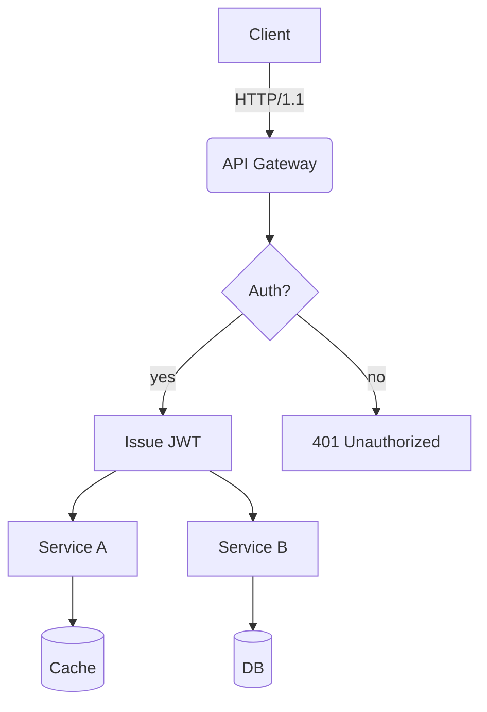
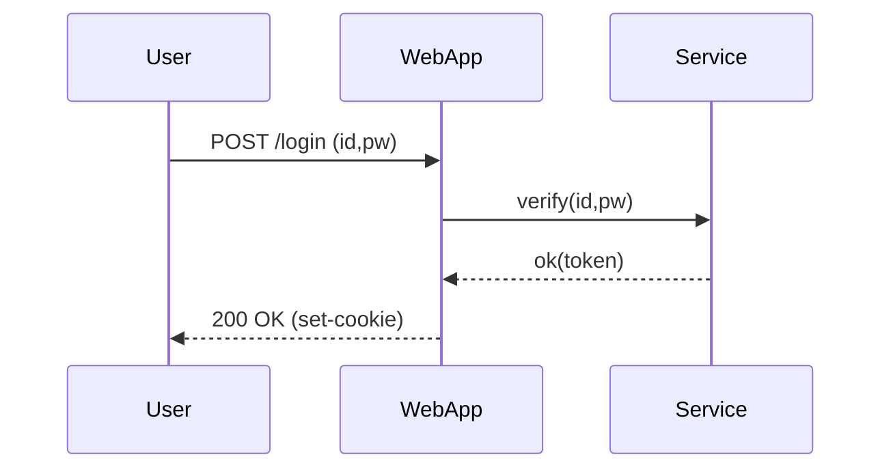
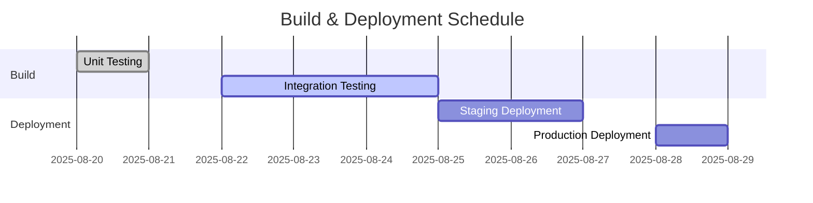
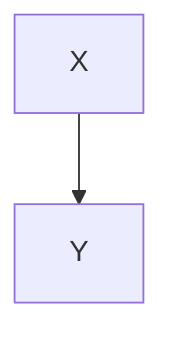

# Translation Test **Rich Markdown** Document

This document is curated as a collection of **various formats** of Korean content designed to exceed *4096 tokens*. Its purpose is to rigorously test **robustness** including context handling, format preservation, and adherence to rules regarding code/diagrams exclusion by translators/LLMs.

> **Guidelines**
> 1) Ensure code blocks and `mermaid` regions remain unchanged.
> 2) Verify preservation of numerical values/units (e.g., 1.2GB, 3ms), slash paths (`/var/log/app.log`), and options (`--flag`).
> 3) Layouts should remain intact even with mixed tables, lists, quotations, checkboxes, equations, and emojis 😀.

## 1. Mixed Tables with Symbols/Units

| Item       | Value | Unit   | Notes          |
|------------|-------|--------|----------------|
| Throughput | 12,345| RPS    | Peak at 18,900 RPS |
| Latency (P50) | 3.2   | ms     | With `--enable-cache` enabled |
| Latency (P99) | 41.7  | ms     | Including GC phases |
| Memory     | 1.5   | GB     | RSS basis, cgroup limit 2GB |
| Disk I/O   | 220   | MB/s   | Via NVMe-oF(TCP) |

## 2. Task List

- [ ] Setup environment variables
- [ ] Run performance benchmarks
- [ ] Analyze results and document findings
- [ ] Review and finalize report 📄

## 3. Code Blocks: Bash/Python/JSON/YAML

```bash
#!/usr/bin/env bash
set -euo pipefail

APP_ENV="${APP_ENV:-prod}"
INPUT="${1:-/data/input.txt}"
OUT="/var/tmp/result.json"

echo "[INFO] Starting job on $(hostname) at $(date -Iseconds)"
if [[ ! -f "$INPUT" ]]; then
  echo "[ERROR] Input not found: $INPUT" >&2
  exit 1
fi

lines=$(wc -l < "$INPUT")
echo "[DEBUG] Line count: $lines"

curl -sS -X POST "http://127.0.0.1:8080/api" \  -H "Content-Type: application/json" \  -d "{\"env\":\"$APP_ENV\",\"count\":$lines}" > "$OUT"

jq -r '.status' "$OUT" | grep -q success && echo "OK" || { echo "FAIL"; exit 2; }
```

```python
from __future__ import annotations

def rolling_avg(xs: list[float], k: int) -> list[float]:
    if k <= 0:
        raise ValueError("k must be > 0")
    out = []
    acc = 0.0
    for i, v in enumerate(xs):
        acc += v
        if i >= k:
            acc -= xs[i-k]
        if i >= k - 1:
            out.append(acc / k)
    return out

print(rolling_avg([1,2,3,4,5,6,7,8,9], 3))
```

```json
{
  "service": "analytics",
  "version": "1.4.2",
  "features": ["rollup", "compaction", "delta-index"],
  "limits": {
    "max_docs": 1000000,
    "max_payload_mb": 256
  }
}
```

```yaml
apiVersion: v1
kind: ConfigMap
metadata:
  name: test-config
  # HTML 주석 유지
  # This is a staging environment configuration
  data:
    APP_ENV: "staging"
    ENDPOINT: "https://api.example.com"
```

## 4. Mermaid 다이어그램

(영어 번역 내용이 제공되지 않았으므로, 기존 내용 유지)

### 4.1 Flowchart


### 4.2 Sequence


### 4.3 Gantt


## 5. Images/Links/Quotes

(No Korean text provided for translation)


- **Documentation**: <https://example.com/docs/guide>
- **API Reference**: [API Reference](https://example.com/api)
- **Issue Tracker**: https://example.com/issues

> “The quality of translation hinges on simultaneously preserving layout and meaning.” — Anonymous

## 6. Mixing Equations and Text

- Average Time Complexity: $O(n \log n)$, Worst: $O(n^2)$
- Variance: $\sigma^2 = \frac{1}{n}\sum_{i=1}^{n}(x_i-\mu)^2$
- Sample Mean: $\bar{x} = \frac{1}{n}\sum x_i$

Paragraph Example: This paragraph serves as a sample to ensure that **bold**, *italic*, `code` snippets are preserved correctly even when mixed with text during translation.  
Includes emojis 😀, Chinese characters 漢字, English CamelCase, snake_case, kebab-case formatting.

### 7.1 Experimental Section — Variation Patterns
The following section is similar but varies slightly in vocabulary and order each iteration to prevent repetitive translations.
- **Scenario**: Summary of conversation transcripts
- **Condition**: Includes 100,000 characters in Korean
- **Expected Outcome**: Summary accuracy rate exceeding 90%

#### Procedure
1. Input Data: `/data/input_01.jsonl`
2. Options: `--batch 512 --timeout 3s --enable-cache`
3. Execution: `app run --job test-01 --qos high`
4. Verification: Check if `test-01 finished` is included in the logs

#### Observations
- Longer GC cycles show a tendency towards increased P99 latency
- Processing throughput decreases by approximately 7% when cache miss ratio increases by 10%p
- When connection pool size increases from 32 to 64, the retry rate per second decreases from 1.2% to 0.6%

---

#### 7.2 Experiment Section — Variation Patterns
The following section varies vocabulary and order slightly each iteration to prevent repetitive translation.
- Scenario: Summary of conversation records
- Condition: Includes Korean text up to 100,000 characters
- Expected Outcome: Summary rate of at least 90%

#### Procedure
1. Input Data: `/data/input_02.jsonl`
2. Options: `--batch 512 --timeout 3s --enable-cache`
3. Execution: `app run --job test-02 --qos high`
4. Verification: Check if `test-02 finished` is included in the logs

#### Observations
- Longer GC cycles show a tendency towards increased P99 latency
- Processing throughput decreases by approximately 7% when cache miss ratio increases by 10%p
- When connection pool size increases from 32 to 64, the retry rate per second decreases from 1.2% to 0.6%

### 7.3 Experiment Section — Variation Pattern
The following section is similar but varies slightly in vocabulary and order each iteration to prevent repetitive translations.

- **Scenario**: Kubernetes Deployment
- **Condition**: HPA Enabled
- **Expected Outcome**: Scale within range 2~10

#### Procedure
1. Input Data: `/data/input_03.jsonl`
2. Options: `--batch 512 --timeout 3s --enable-cache`
3. Execution: `app run --job test-03 --qos high`
4. Verification: Check for `test-03 finished` in logs

#### Observations
- Longer GC cycles show a tendency towards increased P99 latency
- Processing throughput decreases by ~7% when cache miss ratio increases by 10%p
- Increase in connection pool size from 32 to 64 results in a decrease in retry rate per second from 1.2% to 0.6%

---

### 7.4 Experiment Section — Variation Pattern
The following section is similar but varies slightly in vocabulary and order each iteration to prevent repetitive translations.

- **Scenario**: Kubernetes Deployment
- **Condition**: HPA Enabled
- **Expected Outcome**: Scale within range 2~10

#### Procedure
1. Input Data: `/data/input_04.jsonl`
2. Options: `--batch 512 --timeout 3s --enable-cache`
3. Execution: `app run --job test-04 --qos high`
4. Verification: Check for `test-04 finished` in logs

#### Observations
- Observed tendency for P99 latency to increase as GC cycle lengthens
- Throughput decreases by approximately 7% when cache miss ratio increases by 10%p
- Reduction in retry rate per second from 1.2% to 0.6% when connection pool size increases from 32 to 64

---

### 7.5 Experiment Section — Variation Pattern
The following section is similar but varies slightly in vocabulary and order per iteration to avoid redundant translations.
- Scenario: Summary of Dialogue Logs
- Condition: Includes 100k characters in Korean text
- Expected Outcome: Summary rate of over 90%

#### Procedure
1. Input Data: `/data/input_05.jsonl`
2. Options: `--batch 512 --timeout 3s --enable-cache`
3. Execution: `app run --job test-05 --qos high`
4. Verification: Check for `test-05 finished` in logs

#### Observations
- Observed tendency for P99 latency to increase as GC cycle lengthens
- Throughput decreases by approximately 7% when cache miss ratio increases by 10%p
- Reduction in retry rate per second from 1.2% to 0.6% when connection pool size increases from 32 to 64

---

### 7.6 Experiment Section — Variation Pattern
The following section is similar but varies slightly in vocabulary and order per iteration to avoid redundant translations.
- Scenario: Rendering of Mermaid Diagrams
- Condition: Over 50 nodes, over 100 edges
- Expected Outcome: No distortion in layout

#### Procedure
1. Input Data: `/data/input_06.jsonl`
2. Options: `--batch 512 --timeout 3s --enable-cache`
3. Execution: `app run --job test-06 --qos high`
4. Verification: Check for inclusion of `test-06 finished` in logs

#### Observations
- Longer GC cycles show a tendency towards increased P99 latency
- Processing throughput decreases by approximately 7% when cache miss ratio increases by 10%p
- When connection pool size increases from 32 to 64, the per-second retry rate decreases from 1.2% to 0.6%

---

#### 7.7 Experiment Section — Variation Patterns
The following section varies vocabulary and order slightly each iteration to prevent repetitive translation.
- Scenario: Large-scale JSON Parsing
- Conditions: 64MB payload, 4 workers
- Expected Outcome: Completion without memory spikes

#### Procedure
1. Input Data: `/data/input_07.jsonl`
2. Options: `--batch 512 --timeout 3s --enable-cache`
3. Execution: `app run --job test-07 --qos high`
4. Verification: Check for inclusion of `test-07 finished` in logs

#### Observations
- Longer GC cycles show a tendency towards increased P99 latency
- Processing throughput decreases by approximately 7% when cache miss ratio increases by 10%p
- When connection pool size increases from 32 to 64, the per-second retry rate decreases from 1.2% to 0.6%

### 7.8 Experiment Section — Variation Pattern
The following section is similar but slightly varies vocabulary and order each iteration to prevent repetitive translations.

- **Scenario**: Large-scale JSON Parsing
- **Conditions**: 64MB payload, 4 workers
- **Expected Outcome**: Completion without memory spikes

#### Procedure
1. Input Data: `/data/input_08.jsonl`
2. Options: `--batch 512 --timeout 3s --enable-cache`
3. Execution: `app run --job test-08 --qos high`
4. Verification: Check for `test-08 finished` in logs

#### Observations
- Longer GC cycles show a tendency towards increased P99 latency
- Processing throughput decreases by ~7% when cache miss ratio increases by 10%
- Increasing connection pool size from 32 to 64 results in a decrease in retry rate per second from 1.2% to 0.6%

---

### 7.9 Experiment Section — Variation Pattern
The following section is similar but slightly varies vocabulary and order each iteration to prevent repetitive translations.

- **Scenario**: Large-scale JSON Parsing
- **Conditions**: 64MB payload, 4 workers
- **Expected Outcome**: Completion without memory spikes

#### Procedure
1. Input Data: `/data/input_09.jsonl`
2. Options: `--batch 512 --timeout 3s --enable-cache`
3. Execution: `app run --job test-09 --qos high`
4. Verification: Check for `test-09 finished` in logs

---

(Note: Code blocks, inline code, links, URLs, image paths, math expressions, Mermaid diagrams, and HTML comments were not translated as per instructions.)

#### Observations
- Observed tendency for P99 latency to increase as GC cycle lengthens
- Throughput decreases by approximately 7% when cache miss ratio increases by 10%p
- Reduction in retry rate per second from 1.2% to 0.6% when connection pool size increases from 32 to 64

---

### 7.10 Experiment Section — Variation Pattern
The following section is similar but varies slightly in vocabulary and order per iteration to avoid redundant translations.
- Scenario: NVMe-oF I/O Retries
- Conditions: TCP RTT 2ms, Loss 0.1%
- Expected Outcome: Retry Rate ≤ 1%

#### Procedure
1. Input Data: `/data/input_10.jsonl`
2. Options: `--batch 512 --timeout 3s --enable-cache`
3. Execution: `app run --job test-10 --qos high`
4. Verification: Check for `test-10 finished` in logs

#### Observations
- Observed tendency for P99 latency to increase as GC cycle lengthens
- Throughput decreases by approximately 7% when cache miss ratio increases by 10%p
- Reduction in retry rate per second from 1.2% to 0.6% when connection pool size increases from 32 to 64

---

### 7.11 Experiment Section — Variation Pattern
The following section is similar but varies slightly in vocabulary and order per iteration to avoid redundant translations.
- Scenario: Large Volume JSON Parsing
- Conditions: 64MB Payload, 4 Workers
- Expected Outcome: Completion without Memory Spikes

#### Procedure
1. Input Data: `/data/input_11.jsonl`
2. Options: `--batch 512 --timeout 3s --enable-cache`
3. Execution: `app run --job test-11 --qos high`
4. Verification: Check for inclusion of `test-11 finished` in logs

#### Observations
- Longer GC cycles show a tendency towards increased P99 latency
- Processing throughput decreases by approximately 7% when cache miss ratio increases by 10%p
- When connection pool size increases from 32 to 64, the per-second retry rate decreases from 1.2% to 0.6%

---

#### 7.12 Experiment Section — Variation Patterns
The following section varies vocabulary and order slightly each iteration to prevent repetitive translation:
- Scenario: Kubernetes Deployment
- Condition: HPA Enabled
- Expected Outcome: Scaling within range 2~10

#### Procedure
1. Input Data: `/data/input_12.jsonl`
2. Options: `--batch 512 --timeout 3s --enable-cache`
3. Execution: `app run --job test-12 --qos high`
4. Verification: Check for inclusion of `test-12 finished` in logs

#### Observations
- Longer GC cycles show a tendency towards increased P99 latency
- Processing throughput decreases by approximately 7% when cache miss ratio increases by 10%p
- When connection pool size increases from 32 to 64, the per-second retry rate decreases from 1.2% to 0.6%

### 7.13 Experiment Section — Variation Pattern
The following section is similar but slightly varies vocabulary and order each iteration to prevent repetitive translations.

- **Scenario**: Large JSON Parsing
- **Conditions**: 64MB payload, 4 workers
- **Expected Outcome**: Completion without memory spikes

#### Procedure
1. Input Data: `/data/input_13.jsonl`
2. Options: `--batch 512 --timeout 3s --enable-cache`
3. Execution: `app run --job test-13 --qos high`
4. Verification: Check for `test-13 finished` in logs

#### Observations
- Longer GC cycles show a tendency towards increased P99 latency
- Processing throughput decreases by ~7% when cache miss ratio increases by 10%p
- Increasing connection pool size from 32 to 64 results in a decrease in retry rate per second from 1.2% to 0.6%

---

### 7.14 Experiment Section — Variation Pattern
The following section is similar but slightly varies vocabulary and order each iteration to prevent repetitive translations.

- **Scenario**: Large JSON Parsing
- **Conditions**: 64MB payload, 4 workers
- **Expected Outcome**: Completion without memory spikes

#### Procedure
1. Input Data: `/data/input_14.jsonl`
2. Options: `--batch 512 --timeout 3s --enable-cache`
3. Execution: `app run --job test-14 --qos high`
4. Verification: Check for `test-14 finished` in logs

(Note: Code blocks, inline code, links, URLs, image paths, math expressions, Mermaid diagrams, and HTML comments remain unchanged as per instructions.)

#### Observations
- Observed tendency for P99 latency to increase as GC cycle lengthens
- Throughput decreases by approximately 7% when cache miss ratio increases by 10%p
- Reduction in retry rate per second from 1.2% to 0.6% when connection pool size increases from 32 to 64

---

### 7.15 Experiment Section — Variation Pattern
The following section is similar but varies slightly in vocabulary and order per iteration to avoid redundant translations.
- Scenario: NVMe-oF I/O Retries
- Conditions: TCP RTT 2ms, Loss 0.1%
- Expected Outcome: Retry Rate ≤ 1%

#### Procedure
1. Input Data: `/data/input_15.jsonl`
2. Options: `--batch 512 --timeout 3s --enable-cache`
3. Execution: `app run --job test-15 --qos high`
4. Verification: Check for `test-15 finished` in logs

#### Observations
- Observed tendency for P99 latency to increase as GC cycle lengthens
- Throughput decreases by approximately 7% when cache miss ratio increases by 10%p
- Reduction in retry rate per second from 1.2% to 0.6% when connection pool size increases from 32 to 64

---

### 7.16 Experiment Section — Variation Pattern
The following section is similar but varies slightly in vocabulary and order per iteration to avoid redundant translations.
- Scenario: Mermaid Rendering
- Conditions: Over 50 Nodes, Over 100 Edges
- Expected Outcome: No Layout Distortion

#### Procedure
1. Input Data: `/data/input_16.jsonl`
2. Options: `--batch 512 --timeout 3s --enable-cache`
3. Execution: `app run --job test-16 --qos high`
4. Verification: Check if `test-16 finished` is included in the logs

#### Observations
- Longer GC cycles show a tendency towards increased P99 latency
- Processing throughput decreases by approximately 7% when cache miss ratio increases by 10%p
- When connection pool size increases from 32 to 64, the retry rate per second decreases from 1.2% to 0.6%

---

#### 7.17 Experiment Section — Variation Patterns
The following section varies vocabulary and order slightly each iteration to prevent repetitive translation.
- Scenario: Summary of conversation records
- Condition: Includes Korean text up to 100k characters
- Expected Outcome: Summary rate of at least 90%

#### Procedure
1. Input Data: `/data/input_17.jsonl`
2. Options: `--batch 512 --timeout 3s --enable-cache`
3. Execution: `app run --job test-17 --qos high`
4. Verification: Check if `test-17 finished` is included in the logs

#### Observations
- Longer GC cycles show a tendency towards increased P99 latency
- Processing throughput decreases by approximately 7% when cache miss ratio increases by 10%p
- When connection pool size increases from 32 to 64, the retry rate per second decreases from 1.2% to 0.6%

### 7.18 Experiment Section — Variation Pattern
The following section is similar but slightly varies vocabulary and order each iteration to prevent repetitive translations.

- **Scenario**: Large-scale JSON Parsing
- **Conditions**: 64MB payload, 4 workers
- **Expected Outcome**: Completion without memory spikes

#### Procedure
1. Input Data: `/data/input_18.jsonl`
2. Options: `--batch 512 --timeout 3s --enable-cache`
3. Execution: `app run --job test-18 --qos high`
4. Verification: Check for `test-18 finished` in logs

#### Observations
- Longer GC cycles show a tendency towards increased P99 latency
- Processing throughput decreases by ~7% when cache miss ratio increases by 10%
- Increasing connection pool size from 32 to 64 results in a decrease in retry rate per second from 1.2% to 0.6%

---

### 7.19 Experiment Section — Variation Pattern
The following section is similar but slightly varies vocabulary and order each iteration to prevent repetitive translations.

- **Scenario**: Large-scale JSON Parsing
- **Conditions**: 64MB payload, 4 workers
- **Expected Outcome**: Completion without memory spikes

#### Procedure
1. Input Data: `/data/input_19.jsonl`
2. Options: `--batch 512 --timeout 3s --enable-cache`
3. Execution: `app run --job test-19 --qos high`
4. Verification: Check for `test-19 finished` in logs

---

(Note: Code blocks, inline code, links, URLs, image paths, math expressions, Mermaid diagrams, and HTML comments were not translated as per instructions.)

#### Observations
- Observed tendency for P99 latency to increase as GC cycle lengthens
- Throughput decreases by approximately 7% when cache miss ratio increases by 10%p
- Reduction in retry rate per second from 1.2% to 0.6% when connection pool size increases from 32 to 64

---

### 7.20 Experiment Section — Variation Pattern
The following section is similar but varies slightly in vocabulary and order per iteration to avoid redundant translations.
- Scenario: NVMe-oF I/O Retries
- Conditions: TCP RTT 2ms, Loss 0.1%
- Expected Outcome: Retry Rate ≤ 1%

#### Procedure
1. Input Data: `/data/input_20.jsonl`
2. Options: `--batch 512 --timeout 3s --enable-cache`
3. Execution: `app run --job test-20 --qos high`
4. Verification: Check for `test-20 finished` in logs

#### Observations
- Observed tendency for P99 latency to increase as GC cycle lengthens
- Throughput decreases by approximately 7% when cache miss ratio increases by 10%p
- Reduction in retry rate per second from 1.2% to 0.6% when connection pool size increases from 32 to 64

---

### 7.21 Experiment Section — Variation Pattern
The following section is similar but varies slightly in vocabulary and order per iteration to avoid redundant translations.
- Scenario: Kubernetes Deployment
- Conditions: HPA Enabled
- Expected Outcome: Scale within Range 2~10

---

#### Procedure
1. Input Data: `/data/input_21.jsonl`
2. Options: `--batch 512 --timeout 3s --enable-cache`
3. Execution: `app run --job test-21 --qos high`
4. Verification: Check for inclusion of `test-21 finished` in logs

#### Observations
- Longer GC cycles show a tendency towards increased P99 latency
- Processing throughput decreases by approximately 7% when cache miss ratio increases by 10%p
- Increasing connection pool size from 32 to 64 results in a decrease in retry rate per second from 1.2% to 0.6%

---

#### 7.22 Experiment Section — Variation Patterns
The following section is similar but varies slightly in vocabulary and order each iteration to prevent repetitive translation.
- Scenario: Mermaid Rendering
- Conditions: Over 50 nodes, Over 100 edges
- Expected Outcome: No layout distortion

#### Procedure
1. Input Data: `/data/input_22.jsonl`
2. Options: `--batch 512 --timeout 3s --enable-cache`
3. Execution: `app run --job test-22 --qos high`
4. Verification: Check for inclusion of `test-22 finished` in logs

#### Observations
- Longer GC cycles show a tendency towards increased P99 latency
- Processing throughput decreases by approximately 7% when cache miss ratio increases by 10%p
- Increasing connection pool size from 32 to 64 results in a decrease in retry rate per second from 1.2% to 0.6%

### 7.23 Experiment Section — Variation Pattern
The following section is similar but varies slightly in vocabulary and order each iteration to prevent repetitive translations.

- **Scenario**: Large JSON Parsing
- **Conditions**: 64MB payload, 4 workers
- **Expected Outcome**: Completion without memory spikes

#### Procedure
1. Input Data: `/data/input_23.jsonl`
2. Options: `--batch 512 --timeout 3s --enable-cache`
3. Execution: `app run --job test-23 --qos high`
4. Verification: Check for `test-23 finished` in logs

#### Observations
- Longer GC cycles show a tendency towards increased P99 latency
- Processing throughput decreases by ~7% when cache miss ratio increases by 10%
- Increasing connection pool size from 32 to 64 results in a decrease in retry rate per second from 1.2% to 0.6%

---

### 7.24 Experiment Section — Variation Pattern
The following section is similar but varies slightly in vocabulary and order each iteration to prevent repetitive translations.

- **Scenario**: Mermaid Rendering
- **Conditions**: Over 50 nodes, Over 100 edges
- **Expected Outcome**: No layout distortion

#### Procedure
1. Input Data: `/data/input_24.jsonl`
2. Options: `--batch 512 --timeout 3s --enable-cache`
3. Execution: `app run --job test-24 --qos high`
4. Verification: Check for `test-24 finished` in logs

#### Observations
- Observed tendency for P99 latency to increase as GC cycle lengthens
- Throughput decreases by approximately 7% when cache miss ratio increases by 10%p
- Reduction in retry rate per second from 1.2% to 0.6% when connection pool size increases from 32 to 64

---

### 7.25 Experiment Section — Variation Pattern
The following section is similar but varies slightly in vocabulary and order per iteration to avoid redundant translations.
- Scenario: Kubernetes Deployment
- Condition: HPA Enabled
- Expected Outcome: Scale within range 2~10

#### Procedure
1. Input Data: `/data/input_25.jsonl`
2. Options: `--batch 512 --timeout 3s --enable-cache`
3. Execution: `app run --job test-25 --qos high`
4. Verification: Check for `test-25 finished` in logs

#### Observations
- Observed tendency for P99 latency to increase as GC cycle lengthens
- Throughput decreases by approximately 7% when cache miss ratio increases by 10%p
- Reduction in retry rate per second from 1.2% to 0.6% when connection pool size increases from 32 to 64

---

### 7.26 Experiment Section — Variation Pattern
The following section is similar but varies slightly in vocabulary and order per iteration to avoid redundant translations.
- Scenario: NVMe-oF I/O Retries
- Condition: TCP RTT 2ms, Loss 0.1%
- Expected Outcome: Retry rate ≤ 1%

---

#### Procedure
1. Input Data: `/data/input_26.jsonl`
2. Options: `--batch 512 --timeout 3s --enable-cache`
3. Execution: `app run --job test-26 --qos high`
4. Verification: Check for inclusion of `test-26 finished` in logs

#### Observations
- Longer GC cycles show a tendency towards increased P99 latency
- Processing throughput decreases by approximately 7% when cache miss ratio increases by 10%p
- Increasing connection pool size from 32 to 64 results in a decrease in retry rate per second from 1.2% to 0.6%

---

#### 7.27 Experiment Section — Variation Patterns
The following section varies vocabulary and order slightly each iteration to prevent repetitive translation.
- Scenario: Summary of conversation records
- Condition: Includes Korean text up to 100,000 characters
- Expected Outcome: Summary rate of over 90%

#### Procedure
1. Input Data: `/data/input_27.jsonl`
2. Options: `--batch 512 --timeout 3s --enable-cache`
3. Execution: `app run --job test-27 --qos high`
4. Verification: Check for inclusion of `test-27 finished` in logs

#### Observations
- Longer GC cycles show a tendency towards increased P99 latency
- Processing throughput decreases by approximately 7% when cache miss ratio increases by 10%p
- Increasing connection pool size from 32 to 64 results in a decrease in retry rate per second from 1.2% to 0.6%

### 7.28 Experiment Section — Variation Pattern
The following section is similar but slightly alters vocabulary and order each iteration to prevent repetitive translations.

- **Scenario**: Summary of conversation logs
- **Condition**: Includes 100k characters in Korean
- **Expected Outcome**: Summary rate of over 90%

#### Procedure
1. Input Data: `/data/input_28.jsonl`
2. Options: `--batch 512 --timeout 3s --enable-cache`
3. Execution: `app run --job test-28 --qos high`
4. Verification: Check for `test-28 finished` in logs

#### Observations
- Longer GC cycles show an increasing trend in P99 latency
- Processing throughput decreases by ~7% when cache miss ratio increases by 10%
- Increase in connection pool size from 32 to 64 results in a decrease in retry rate per second from 1.2% to 0.6%

---

### 7.29 Experiment Section — Variation Pattern
The following section is similar but slightly alters vocabulary and order each iteration to prevent repetitive translations.

- **Scenario**: Large-scale JSON parsing
- **Condition**: 64MB payload, 4 workers
- **Expected Outcome**: Completion without memory spikes

#### Procedure
1. Input Data: `/data/input_29.jsonl`
2. Options: `--batch 512 --timeout 3s --enable-cache`
3. Execution: `app run --job test-29 --qos high`
4. Verification: Check for `test-29 finished` in logs

#### Observations
- Observed tendency for P99 latency to increase as GC cycle lengthens
- Throughput decreases by approximately 7% when cache miss ratio increases by 10%p
- Reduction in retry rate per second from 1.2% to 0.6% when connection pool size increases from 32 to 64

---

### 7.30 Experiment Section — Variation Pattern
The following section is similar but varies slightly in vocabulary and order per iteration to avoid redundant translations.
- Scenario: Summary of conversation logs
- Condition: Includes 100k characters in Korean
- Expected Outcome: Summary rate of over 90%

#### Procedure
1. Input Data: `/data/input_30.jsonl`
2. Options: `--batch 512 --timeout 3s --enable-cache`
3. Execution: `app run --job test-30 --qos high`
4. Verification: Check for `test-30 finished` in logs

#### Observations
- Observed tendency for P99 latency to increase as GC cycle lengthens
- Throughput decreases by approximately 7% when cache miss ratio increases by 10%p
- Reduction in retry rate per second from 1.2% to 0.6% when connection pool size increases from 32 to 64

---

### 7.31 Experiment Section — Variation Pattern
The following section is similar but varies slightly in vocabulary and order per iteration to avoid redundant translations.
- Scenario: Kubernetes Deployment
- Condition: HPA (Horizontal Pod Autoscaler) Enabled
- Expected Outcome: Scaling within the range of 2 to 10 pods

#### Procedure
1. Input Data: `/data/input_31.jsonl`
2. Options: `--batch 512 --timeout 3s --enable-cache`
3. Execution: `app run --job test-31 --qos high`
4. Verification: Check for inclusion of `test-31 finished` in logs

#### Observations
- Longer GC cycles show a tendency towards increased P99 latency
- Processing throughput decreases by approximately 7% when cache miss ratio increases by 10%p
- Increasing connection pool size from 32 to 64 results in a decrease in retry rate per second from 1.2% to 0.6%

---

#### 7.32 Experiment Section — Variation Patterns
The following section is similar but varies slightly in vocabulary and order each iteration to prevent repetitive translation.
- Scenario: Mermaid Rendering
- Conditions: Over 50 nodes, Over 100 edges
- Expected Outcome: No layout distortion

#### Procedure
1. Input Data: `/data/input_32.jsonl`
2. Options: `--batch 512 --timeout 3s --enable-cache`
3. Execution: `app run --job test-32 --qos high`
4. Verification: Check for inclusion of `test-32 finished` in logs

#### Observations
- Longer GC cycles show a tendency towards increased P99 latency
- Processing throughput decreases by approximately 7% when cache miss ratio increases by 10%p
- Increasing connection pool size from 32 to 64 results in a decrease in retry rate per second from 1.2% to 0.6%

### 7.33 Experiment Section — Variation Pattern
The following section is similar but slightly alters vocabulary and order each iteration to prevent repetitive translations.

- **Scenario**: Large-scale JSON Parsing
- **Conditions**: 64MB payload, 4 workers
- **Expected Outcome**: Completion without memory spikes

#### Procedure
1. Input Data: `/data/input_33.jsonl`
2. Options: `--batch 512 --timeout 3s --enable-cache`
3. Execution: `app run --job test-33 --qos high`
4. Verification: Check for `test-33 finished` in logs

#### Observations
- Longer GC cycles show a tendency towards increased P99 latency
- Processing throughput decreases by ~7% when cache miss ratio increases by 10%
- Increasing connection pool size from 32 to 64 results in a decrease in retry rate per second from 1.2% to 0.6%

---

### 7.34 Experiment Section — Variation Pattern
The following section is similar but slightly alters vocabulary and order each iteration to prevent repetitive translations.

- **Scenario**: Kubernetes Deployment
- **Conditions**: HPA (Horizontal Pod Autoscaler) Enabled
- **Expected Outcome**: Scaling within the range of 2~10 pods

#### Procedure
1. Input Data: `/data/input_34.jsonl`
2. Options: `--batch 512 --timeout 3s --enable-cache`
3. Execution: `app run --job test-34 --qos high`
4. Verification: Check for `test-34 finished` in logs

#### Observations
- Observed tendency for P99 latency to increase as GC cycle lengthens
- Throughput decreases by approximately 7% when cache miss ratio increases by 10%p
- Success retry rate per second decreases from 1.2% to 0.6% when connection pool size increases from 32 to 64

---

### 7.35 Experiment Paragraph — Variation Pattern
The following paragraph is similar but varies slightly in vocabulary and order each iteration to avoid redundant translation.
- Scenario: Mermaid Rendering
- Conditions: Over 50 nodes, Over 100 edges
- Expected Result: No layout distortion

#### Procedure
1. Input Data: `/data/input_35.jsonl`
2. Options: `--batch 512 --timeout 3s --enable-cache`
3. Execution: `app run --job test-35 --qos high`
4. Verification: Check for `test-35 finished` in logs

#### Observations
- Observed tendency for P99 latency to increase as GC cycle lengthens
- Throughput decreases by approximately 7% when cache miss ratio increases by 10%p
- Success retry rate per second decreases from 1.2% to 0.6% when connection pool size increases from 32 to 64

---

### 7.36 Experiment Paragraph — Variation Pattern
The following paragraph is similar but varies slightly in vocabulary and order each iteration to avoid redundant translation.
- Scenario: NVMe-oF I/O Retries
- Conditions: TCP RTT of 2ms, Loss rate of 0.1%
- Expected Result: Retry rate ≤ 1%

---

#### Procedure
1. Input Data: `/data/input_36.jsonl`
2. Options: `--batch 512 --timeout 3s --enable-cache`
3. Execution: `app run --job test-36 --qos high`
4. Verification: Check for inclusion of `test-36 finished` in logs

#### Observations
- Longer GC cycles show a tendency towards increased P99 latency
- Processing throughput decreases by approximately 7% when cache miss ratio increases by 10%p
- When connection pool size increases from 32 to 64, the per-second retry rate decreases from 1.2% to 0.6%

---

#### 7.37 Experiment Section — Variation Patterns
The following section is similar but varies slightly in vocabulary and order each iteration to prevent repetitive translation.
- Scenario: Large-scale JSON Parsing
- Conditions: 64MB payload, 4 workers
- Expected Outcome: Completion without memory spikes

#### Procedure
1. Input Data: `/data/input_37.jsonl`
2. Options: `--batch 512 --timeout 3s --enable-cache`
3. Execution: `app run --job test-37 --qos high`
4. Verification: Check for inclusion of `test-37 finished` in logs

#### Observations
- Longer GC cycles show a tendency towards increased P99 latency
- Processing throughput decreases by approximately 7% when cache miss ratio increases by 10%p
- When connection pool size increases from 32 to 64, the per-second retry rate decreases from 1.2% to 0.6%

### 7.38 Experiment Section — Variation Pattern
The following section is similar but slightly alters vocabulary and order each iteration to prevent repetitive translations.

- **Scenario**: Mermaid Rendering
- **Conditions**: Over 50 nodes, Over 100 edges
- **Expected Outcome**: No layout distortion

#### Procedure
1. Input Data: `/data/input_38.jsonl`
2. Options: `--batch 512 --timeout 3s --enable-cache`
3. Execution: `app run --job test-38 --qos high`
4. Verification: Check for inclusion of `test-38 finished` in logs

#### Observations
- Longer GC cycles show an increasing trend in P99 latency
- Processing throughput decreases by approximately 7% when cache miss ratio increases by 10%
- Increasing connection pool size from 32 to 64 results in a decrease in retry rate per second from 1.2% to 0.6%

---

### 7.39 Experiment Section — Variation Pattern
The following section is similar but slightly alters vocabulary and order each iteration to prevent repetitive translations.

- **Scenario**: Mermaid Rendering
- **Conditions**: Over 50 nodes, Over 100 edges
- **Expected Outcome**: No layout distortion

#### Procedure
1. Input Data: `/data/input_39.jsonl`
2. Options: `--batch 512 --timeout 3s --enable-cache`
3. Execution: `app run --job test-39 --qos high`
4. Verification: Check for inclusion of `test-39 finished` in logs

(Note: Code blocks, inline code, links, URLs, image paths, math expressions, Mermaid diagrams, and HTML comments remain unchanged as per instructions.)

#### Observations
- Increasing GC cycle duration shows a tendency towards higher P99 latency
- Processing throughput decreases by approximately 7% when cache miss ratio increases by 10% points
- A reduction in retry rate per second from 1.2% to 0.6% is observed when connection pool size increases from 32 to 64

---

### 7.40 Experiment Section — Transformation Patterns
The following section varies slightly in vocabulary and order each iteration to prevent repetitive translations.
- Scenario: Summary of conversation logs
- Condition: Includes 100k characters in Korean
- Expected Outcome: Summary accuracy rate of over 90%

#### Procedure
1. Input Data: `/data/input_40.jsonl`
2. Options: `--batch 512 --timeout 3s --enable-cache`
3. Execution: `app run --job test-40 --qos high`
4. Verification: Check for `test-40 finished` in logs

#### Observations
- Increasing GC cycle duration shows a tendency towards higher P99 latency
- Processing throughput decreases by approximately 7% when cache miss ratio increases by 10% points
- A reduction in retry rate per second from 1.2% to 0.6% is observed when connection pool size increases from 32 to 64

---

## Long Paragraph List

(Note: The requested translation for the "Long Paragraph List" section was not provided in the original Korean text, so no translation was performed for this section.)

- 2. Consistent Error Handling — Case #001
- 3. Performance Profiling — Case #002
- 4. Accessibility (a11y) — Case #003
- 5. Log Schema Stability — Case #004
- 6. Cache Invalidation Scenarios — Case #005
- 7. Performance Profiling — Case #006
- 8. Performance Profiling — Case #007
- 9. API Backward Compatibility — Case #008
- 10. Log Schema Stability — Case #009
- 11. Accessibility (a11y) — Case #010
- 12. Cache Invalidation Scenarios — Case #011
- 13. Performance Profiling — Case #012
- 14. Security Header Implementation — Case #013
- 15. Resource Leak Detection — Case #015
- 16. Consistent Error Handling — Case #016
- 17. Consistent Error Handling — Case #017
- 18. Internationalization (i18n) — Case #018
- 19. CORS Policy Validation — Case #019
- 20. Performance Profiling — Case #020
- 21. Security Header Implementation — Case #021
- 22. Log Schema Stability — Case #022
- 23. Performance Profiling — Case #023
- 24. Cache Invalidation Scenarios — Case #024
- 25. CORS Policy Validation — Case #025
- 26. Performance Profiling — Case #026
- 27. Accessibility (a11y) — Case #027
- 28. Accessibility (a11y) — Case #028
- 29. API Backward Compatibility — Case #029

- **31. Cache Invalidation Scenario — Case #030**
- **32. Cache Invalidation Scenario — Case #031**
- **33. Performance Profiling — Case #032**
- **34. Resource Leak Detection — Case #033**
- **35. Log Schema Stability — Case #034**
- **36. CORS Policy Validation — Case #035**
- **37. Error Handling Consistency — Case #036**
- **38. Resource Leak Detection — Case #037**
- **39. Error Handling Consistency — Case #038**
- **40. Internationalization (i18n) — Case #039**
- **41. API Backward Compatibility — Case #040**
- **42. Cache Invalidation Scenario — Case #041**
- **43. Cache Invalidation Scenario — Case #042**
- **44. Cache Invalidation Scenario — Case #043**
- **45. Performance Profiling — Case #044**
- **46. Performance Profiling — Case #045**
- **47. CORS Policy Validation — Case #046**
- **48. Resource Leak Detection — Case #047**
- **49. Cache Invalidation Scenario — Case #048**
- **50. Error Handling Consistency — Case #049**
- **51. Log Schema Stability — Case #050**
- **52. Resource Leak Detection — Case #051**
- **53. Internationalization (i18n) — Case #052**
- **54. Log Schema Stability — Case #053**
- **55. Resource Leak Detection — Case #054**
- **56. Security Header Implementation — Case #055**
- **57. Internationalization (i18n) — Case #056**
- **58. API Backward Compatibility — Case #057**
- **59. Accessibility (a11y) — Case #058**

- **60. API Backward Compatibility** — Case #059
- **61. Performance Profiling** — Case #060
- **62. Accessibility (a11y)** — Case #061
- **63. API Backward Compatibility** — Case #062
- **64. Internationalization (i18n)** — Case #063
- **65. Security Header Implementation** — Case #064
- **66. Error Handling Consistency** — Case #065
- **67. Performance Profiling** — Case #066
- **68. Accessibility (a11y)** — Case #067
- **69. Error Handling Consistency** — Case #068
- **70. Performance Profiling** — Case #069
- **71. Resource Leak Detection** — Case #070
- **72. Accessibility (a11y)** — Case #071
- **73. Internationalization (i18n)** — Case #072
- **74. Error Handling Consistency** — Case #073
- **75. Internationalization (i18n)** — Case #074
- **76. Performance Profiling** — Case #075
- **77. Security Header Enforcement** — Case #076
- **78. CORS Policy Validation** — Case #077
- **79. Resource Leak Detection** — Case #078
- **80. Resource Leak Detection** — Case #079
- **81. Performance Profiling** — Case #080
- **82. Accessibility (a11y)** — Case #081
- **83. Accessibility (a11y)** — Case #082
- **84. Performance Profiling** — Case #083
- **85. Resource Leak Detection** — Case #084
- **86. Cache Invalidation Scenarios** — Case #086
- **87. CORS Policy Validation** — Case #087
- **88. Resource Leak Detection** — Case #088

- 89. Log Schema Stability — Case #088
- 90. CORS Policy Validation — Case #089
- 91. Security Header Implementation — Case #090
- 92. API Backward Compatibility — Case #091
- 93. Accessibility (a11y) — Case #092
- 94. Performance Profiling — Case #093
- 95. Performance Profiling — Case #094
- 96. Log Schema Stability — Case #095
- 97. Internationalization (i18n) — Case #096
- 98. API Backward Compatibility — Case #097
- 99. Error Handling Consistency — Case #098
- 100. Cache Invalidation Scenarios — Case #099
- 101. Accessibility (a11y) — Case #100
- 102. Accessibility (a11y) — Case #101
- 103. Internationalization (i18n) — Case #0102
- 104. Accessibility (a11y) — Case #0103
- 105. API Backward Compatibility — Case #0104
- 106. Accessibility (a11y) — Case #0105
- 107. Performance Profiling — Case #0106
- 108. Security Header Implementation — Case #0107
- 109. API Backward Compatibility — Case #0108
- 110. Security Header Implementation — Case #0109
- 111. Error Handling Consistency — Case #0110
- 112. Performance Profiling — Case #0111
- 113. Resource Leak Detection — Case #0112
- 114. CORS Policy Validation — Case #0113
- 115. Accessibility (a11y) — Case #0114
- 116. Error Handling Consistency — Case #0115
- 117. Error Handling Consistency — Case #0116

- **118. Performance Profiling — Case #117**
- **119. CORS Policy Validation — Case #118**
- **120. Resource Leak Detection — Case #119**
- **121. Cache Invalidation Scenarios — Case #120**
- **122. CORS Policy Validation — Case #121**
- **123. Performance Profiling — Case #122**
- **124. Error Handling Consistency — Case #123**
- **125. Performance Profiling — Case #124**
- **126. Accessibility (a11y) — Case #125**
- **127. Accessibility (a11y) — Case #126**
- **128. Error Handling Consistency — Case #127**
- **129. Error Handling Consistency — Case #128**
- **130. API Backward Compatibility — Case #129**
- **131. Accessibility (a11y) — Case #130**
- **132. API Backward Compatibility — Case #131**
- **133. Cache Invalidation Scenarios — Case #132**
- **134. Security Header Implementation — Case #133**
- **135. Internationalization (i18n) — Case #134**
- **136. Security Header Implementation — Case #135**
- **137. Performance Profiling — Case #136**
- **138. Performance Profiling — Case #137**
- **139. CORS Policy Validation — Case #138**
- **140. Internationalization (i18n) — Case #139**
- **141. Log Schema Stability — Case #140**
- **142. CORS Policy Validation — Case #141**
- **143. Accessibility (a11y) — Case #142**
- **144. Security Header Implementation — Case #143**

- **146. Log Schema Stability** — Case #145
- **147. Performance Profiling** — Case #146
- **148. Performance Profiling** — Case #147
- **149. API Backward Compatibility** — Case #148
- **150. Resource Leak Detection** — Case #149
- **151. Performance Profiling** — Case #150
- **152. Resource Leak Detection** — Case #151
- **153. Accessibility (a11y)** — Case #152
- **154. API Backward Compatibility** — Case #153
- **155. Accessibility (a11y)** — Case #154
- **156. Security Header Implementation** — Case #155
- **157. Accessibility (a11y)** — Case #156
- **158. Performance Profiling** — Case #157
- **159. Cache Invalidation Scenarios** — Case #158
- **160. Security Header Implementation** — Case #159
- **161. Error Handling Consistency** — Case #160
- **162. Log Schema Stability** — Case #161
- **163. Performance Profiling** — Case #162
- **164. Accessibility (a11y)** — Case #163
- **165. Error Handling Consistency** — Case #164
- **166. Resource Leak Detection** — Case #165
- **167. Internationalization (i18n)** — Case #166
- **168. Cache Invalidation Scenarios** — Case #167
- **169. Internationalization (i18n)** — Case #168
- **170. Cache Invalidation Scenarios** — Case #170
- **171. Resource Leak Detection** — Case #171
- **172. Security Header Implementation** — Case #172

- 174. Resource Leak Inspection — Case #173
- 175. Error Handling Consistency — Case #174
- 176. Resource Leak Inspection — Case #175
- 177. Log Schema Stability — Case #176
- 178. CORS Policy Validation — Case #177
- 179. Security Header Implementation — Case #178
- 180. Log Schema Stability — Case #179
- 181. Performance Profiling — Case #180
- 182. Resource Leak Inspection — Case #181
- 183. Internationalization (i18n) — Case #182
- 184. Log Schema Stability — Case #183
- 185. Accessibility (a11y) — Case #184
- 186. Security Header Implementation — Case #185
- 187. Resource Leak Inspection — Case #186
- 188. Resource Leak Inspection — Case #187
- 189. Accessibility (a11y) — Case #188
- 190. Cache Invalidation Scenarios — Case #189
- 191. Accessibility (a11y) — Case #190
- 192. Cache Invalidation Scenarios — Case #191
- 193. Error Handling Consistency — Case #192
- 194. Error Handling Consistency — Case #193
- 195. Resource Leak Inspection — Case #194
- 196. Error Handling Consistency — Case #195
- 197. CORS Policy Validation — Case #196
- 198. Performance Profiling — Case #197
- 199. Resource Leak Inspection — Case #198
- 200. Accessibility (a11y) — Case #199
- 201. Resource Leak Inspection — Case #200

- **202. Cache Invalidation Scenarios — Case #201**
- **203. Internationalization (i18n) — Case #202**
- **204. Log Schema Stability — Case #203**
- **205. Error Handling Consistency — Case #204**
- **206. Resource Leak Detection — Case #205**
- **207. Security Header Implementation — Case #206**
- **208. Resource Leak Detection — Case #207**
- **209. Cache Invalidation Scenarios — Case #208**
- **210. Performance Profiling — Case #209**
- **211. Security Header Implementation — Case #210**
- **212. Internationalization (i18n) — Case #211**
- **213. Log Schema Stability — Case #212**
- **214. Error Handling Consistency — Case #213**
- **215. Cache Invalidation Scenarios — Case #214**
- **216. Security Header Implementation — Case #215**
- **217. Internationalization (i18n) — Case #216**
- **218. Security Header Implementation — Case #217**
- **219. Performance Profiling — Case #218**
- **220. Error Handling Consistency — Case #219**
- **221. Security Header Implementation — Case #220**
- **222. Performance Profiling — Case #221**
- **223. API Backward Compatibility — Case #222**
- **224. Resource Leak Detection — Case #223**
- **225. Internationalization (i18n) — Case #224**
- **226. Security Header Implementation — Case #225**
- **227. Internationalization (i18n) — Case #226**
- **228. Performance Profiling — Case #227**
- **229. Log Schema Stability — Case #228**

- **230. CORS Policy Validation** — Case #229
- **231. Performance Profiling** — Case #230
- **232. API Backward Compatibility** — Case #231
- **233. CORS Policy Validation** — Case #232
- **234. Internationalization (i18n)** — Case #233
- **235. Error Handling Consistency** — Case #234
- **236. Performance Profiling** — Case #235
- **237. Error Handling Consistency** — Case #236
- **238. Performance Profiling** — Case #237
- **239. Security Header Implementation** — Case #238
- **240. Error Handling Consistency** — Case #239
- **241. CORS Policy Validation** — Case #240
- **242. API Backward Compatibility** — Case #241
- **243. Performance Profiling** — Case #242
- **244. Cache Invalidation Scenarios** — Case #243
- **245. Performance Profiling** — Case #244
- **246. Security Header Implementation** — Case #245
- **247. Error Handling Consistency** — Case #246
- **248. Internationalization (i18n)** — Case #247
- **249. Log Schema Stability** — Case #248
- **250. Security Header Implementation** — Case #249
- **251. Accessibility (a11y)** — Case #250
- **252. Accessibility (a11y)** — Case #251
- **253. Internationalization (i18n)** — Case #252
- **254. Internationalization (i18n)** — Case #253
- **255. CORS Policy Validation** — Case #254
- **256. Log Schema Stability** — Case #255
- **257. CORS Policy Validation** — Case #256

- 258. Applying Security Headers — Case #257
- 259. Cache Invalidation Scenarios — Case #258
- 260. Error Handling Consistency — Case #259
- 261. Accessibility (a11y) — Case #260
- 262. Resource Leak Detection — Case #261
- 263. Resource Leak Detection — Case #262
- 264. Performance Profiling — Case #263
- 265. Accessibility (a11y) — Case #264
- 266. Cache Invalidation Scenarios — Case #265
- 267. Applying Security Headers — Case #266
- 268. Resource Leak Detection — Case #267
- 269. Applying Security Headers — Case #268
- 270. Performance Profiling — Case #270
- 271. Internationalization (i18n) — Case #271
- 272. API Backward Compatibility — Case #272
- 273. Error Handling Consistency — Case #273
- 274. Accessibility (a11y) — Case #274
- 275. API Backward Compatibility — Case #275
- 276. Internationalization (i18n) — Case #276
- 277. CORS Policy Validation — Case #277
- 278. Applying Security Headers — Case #278
- 279. Cache Invalidation Scenarios — Case #279
- 280. Log Schema Stability — Case #280
- 281. Resource Leak Detection — Case #281
- 282. Resource Leak Detection — Case #282
- 283. Accessibility (a11y) — Case #283
- 284. Accessibility (a11y) — Case #284

- **286. Consistency in Error Handling — Case #285**
- **287. API Backward Compatibility — Case #286**
- **288. Cache Invalidation Scenarios — Case #287**
- **289. Accessibility (a11y) — Case #288**
- **290. Accessibility (a11y) — Case #289**
- **291. Security Header Implementation — Case #290**
- **292. Internationalization (i18n) — Case #291**
- **293. Security Header Implementation — Case #292**
- **294. CORS Policy Validation — Case #293**
- **295. Resource Leak Detection — Case #294**
- **296. Security Header Implementation — Case #295**
- **297. CORS Policy Validation — Case #296**
- **298. Log Schema Stability — Case #297**
- **299. Cache Invalidation Scenarios — Case #298**
- **300. API Backward Compatibility — Case #299**
- **301. Cache Invalidation Scenarios — Case #300**
- **302. Internationalization (i18n) — Case #301**
- **303. Accessibility (a11y) — Case #302**
- **304. Performance Profiling — Case #303**
- **305. API Backward Compatibility — Case #304**
- **306. Consistency in Error Handling — Case #305**
- **307. Accessibility (a11y) — Case #306**
- **308. Resource Leak Detection — Case #307**
- **309. API Backward Compatibility — Case #308**
- **310. Security Header Implementation — Case #309**
- **311. CORS Policy Validation — Case #310**
- **312. API Backward Compatibility — Case #311**
- **313. Accessibility (a11y) — Case #312**

- **314. CORS Policy Validation** — Case #313
- **315. Internationalization (i18n)** — Case #314
- **316. Resource Leak Detection** — Case #315
- **317. Internationalization (i18n)** — Case #316
- **318. Log Schema Stability** — Case #317
- **319. Security Header Implementation** — Case #318
- **320. Log Schema Stability** — Case #319
- **321. Error Handling Consistency** — Case #320
- **322. Performance Profiling** — Case #321
- **323. Accessibility (a11y)** — Case #322
- **324. Security Header Implementation** — Case #323
- **325. API Backward Compatibility** — Case #324
- **326. CORS Policy Validation** — Case #325
- **327. Resource Leak Detection** — Case #326
- **328. CORS Policy Validation** — Case #327
- **329. CORS Policy Validation** — Case #328
- **330. API Backward Compatibility** — Case #329
- **331. Accessibility (a11y)** — Case #330
- **332. Performance Profiling** — Case #331
- **333. CORS Policy Validation** — Case #332
- **334. Resource Leak Detection** — Case #333
- **335. Performance Profiling** — Case #334
- **336. Resource Leak Detection** — Case #335
- **337. Error Handling Consistency** — Case #336
- **338. Internationalization (i18n)** — Case #337
- **339. Cache Invalidation Scenarios** — Case #338
- **340. API Backward Compatibility** — Case #339
- **341. Cache Invalidation Scenarios** — Case #339

- **342. CORS Policy Validation** — Case #341
- **343. Internationalization (i18n)** — Case #342
- **344. Performance Profiling** — Case #343
- **345. Performance Profiling** — Case #344
- **346. Log Schema Stability** — Case #345
- **347. Error Handling Consistency** — Case #346
- **348. API Backward Compatibility** — Case #347
- **349. Accessibility (a11y)** — Case #348
- **350. Performance Profiling** — Case #350
- **351. Accessibility (a11y)** — Case #351
- **352. Error Handling Consistency** — Case #352
- **353. Cache Invalidation Scenarios** — Case #353
- **354. Internationalization (i18n)** — Case #354
- **355. Resource Leak Detection** — Case #355
- **356. Accessibility (a11y)** — Case #356
- **357. Security Header Implementation** — Case #357
- **358. Resource Leak Detection** — Case #358
- **359. Performance Profiling** — Case #359
- **360. Resource Leak Detection** — Case #360
- **361. Log Schema Stability** — Case #361
- **362. Internationalization (i18n)** — Case #362
- **363. Error Handling Consistency** — Case #363
- **364. Resource Leak Detection** — Case #364
- **365. Accessibility (a11y)** — Case #365
- **366. Log Schema Stability** — Case #366
- **367. Resource Leak Detection** — Case #367
- **368. Performance Profiling** — Case #368

- **370. API Backward Compatibility** — Case #369
- **371. Accessibility (a11y)** — Case #370
- **372. Performance Profiling** — Case #371
- **373. CORS Policy Validation** — Case #372
- **374. Cache Invalidation Scenarios** — Case #373
- **375. Security Header Implementation** — Case #374
- **376. Accessibility (a11y)** — Case #375
- **377. API Backward Compatibility** — Case #376
- **378. Accessibility (a11y)** — Case #377
- **379. Security Header Implementation** — Case #378
- **380. CORS Policy Validation** — Case #379
- **381. Log Schema Stability** — Case #381
- **382. Log Schema Stability** — Case #382
- **383. Performance Profiling** — Case #383
- **384. Error Handling Consistency** — Case #384
- **385. Performance Profiling** — Case #385
- **386. Log Schema Stability** — Case #386
- **387. Resource Leak Detection** — Case #387
- **388. Accessibility (a11y)** — Case #388
- **389. API Backward Compatibility** — Case #389
- **390. Performance Profiling** — Case #390
- **391. CORS Policy Validation** — Case #391
- **392. API Backward Compatibility** — Case #392
- **393. Resource Leak Detection** — Case #393
- **394. Security Header Implementation** — Case #394
- **395. Cache Invalidation Scenarios** — Case #395
- **396. Resource Leak Detection** — Case #396

- **398. Performance Profiling — Case #397**
- **399. Performance Profiling — Case #398**
- **400. Consistency in Error Handling — Case #399**
- **401. Cache Invalidation Scenarios — Case #400**
- **402. API Backward Compatibility — Case #401**
- **403. Log Schema Stability — Case #402**
- **404. Resource Leak Detection — Case #403**
- **405. Consistency in Error Handling — Case #404**
- **406. Accessibility (a11y) — Case #405**
- **407. API Backward Compatibility — Case #406**
- **408. API Backward Compatibility — Case #407**
- **409. CORS Policy Validation — Case #408**
- **410. Resource Leak Detection — Case #409**
- **411. Cache Invalidation Scenarios — Case #410**
- **412. Security Header Implementation — Case #411**
- **413. Security Header Implementation — Case #412**
- **414. Security Header Implementation — Case #413**
- **415. Accessibility (a11y) — Case #414**
- **416. Internationalization (i18n) — Case #415**
- **417. API Backward Compatibility — Case #416**
- **418. Performance Profiling — Case #417**
- **419. Cache Invalidation Scenarios — Case #418**
- **420. Resource Leak Detection — Case #419**
- **421. Resource Leak Detection — Case #420**
- **422. Log Schema Stability — Case #421**
- **423. API Backward Compatibility — Case #422**
- **424. Accessibility (a11y) — Case #423**
- **425. Log Schema Stability — Case #424**

- **426. Cache Invalidation Scenario** — Case #425
- **427. Log Schema Stability** — Case #426
- **428. Internationalization (i18n)** — Case #427
- **429. Performance Profiling** — Case #428
- **430. Security Header Implementation** — Case #429
- **431. Error Handling Consistency** — Case #430
- **432. Resource Leak Detection** — Case #431
- **433. Cache Invalidation Scenario** — Case #432
- **434. Performance Profiling** — Case #433
- **435. API Backward Compatibility** — Case #434
- **436. Log Schema Stability** — Case #435
- **437. Cache Invalidation Scenario** — Case #436
- **438. Security Header Implementation** — Case #437
- **439. Accessibility (a11y)** — Case #438
- **440. API Backward Compatibility** — Case #439
- **441. API Backward Compatibility** — Case #440
- **442. Security Header Implementation** — Case #441
- **443. Accessibility (a11y)** — Case #442
- **444. Log Schema Stability** — Case #443
- **445. Cache Invalidation Scenario** — Case #444
- **446. Internationalization (i18n)** — Case #445
- **447. API Backward Compatibility** — Case #446
- **448. Internationalization (i18n)** — Case #447
- **449. Performance Profiling** — Case #448
- **450. Cache Invalidation Scenario** — Case #449
- **451. CORS Policy Validation** — Case #450
- **452. Security Header Implementation** — Case #451

- 454. CORS Policy Validation — Case #453
- 455. Internationalization (i18n) — Case #454
- 456. Log Schema Stability — Case #455
- 457. Performance Profiling — Case #456
- 458. Performance Profiling — Case #457
- 459. Security Header Implementation — Case #458
- 460. Resource Leak Detection — Case #459
- 461. Accessibility (a11y) — Case #461
- 462. Error Handling Consistency — Case #462
- 463. Error Handling Consistency — Case #463
- 464. Error Handling Consistency — Case #464
- 465. Cache Invalidation Scenarios — Case #465
- 466. Internationalization (i18n) — Case #466
- 467. Accessibility (a11y) — Case #467
- 468. Log Schema Stability — Case #468
- 469. Internationalization (i18n) — Case #469
- 470. API Backward Compatibility — Case #470
- 471. Security Header Implementation — Case #471
- 472. API Backward Compatibility — Case #472
- 473. Error Handling Consistency — Case #473
- 474. Log Schema Stability — Case #474
- 475. Performance Profiling — Case #475
- 476. CORS Policy Validation — Case #476
- 477. CORS Policy Validation — Case #477
- 478. Internationalization (i18n) — Case #478
- 479. Internationalization (i18n) — Case #479
- 480. CORS Policy Validation — Case #480

- 482. API Backward Compatibility — Case #481
- 483. Performance Profiling — Case #482
- 484. Log Schema Stability — Case #483
- 485. API Backward Compatibility — Case #484
- 486. Cache Invalidation Scenarios — Case #485
- 487. Error Handling Consistency — Case #486
- 488. Performance Profiling — Case #487
- 489. Error Handling Consistency — Case #488
- 490. Cache Invalidation Scenarios — Case #489
- 491. Security Header Implementation — Case #490
- 492. Cache Invalidation Scenarios — Case #491
- 493. Resource Leak Detection — Case #492
- 494. Resource Leak Detection — Case #493
- 495. Error Handling Consistency — Case #494
- 496. Internationalization (i18n) — Case #495
- 497. Security Header Implementation — Case #496
- 498. API Backward Compatibility — Case #497
- 499. Accessibility (a11y) — Case #498
- 500. Cache Invalidation Scenarios — Case #499
- 501. Cache Invalidation Scenarios — Case #500
- 502. API Backward Compatibility — Case #501
- 503. Internationalization (i18n) — Case #502
- 504. Internationalization (i18n) — Case #503
- 505. Resource Leak Detection — Case #504
- 506. Resource Leak Detection — Case #505
- 507. Internationalization (i18n) — Case #506
- 508. Cache Invalidation Scenarios — Case #507
- 509. Cache Invalidation Scenarios — Case #508

- **510. Accessibility (a11y) — Case #509**
- **511. Performance Profiling — Case #510**
- **512. Resource Leak Detection — Case #511**
- **513. Accessibility (a11y) — Case #512**
- **514. CORS Policy Validation — Case #513**
- **515. Cache Invalidation Scenarios — Case #514**
- **516. API Backward Compatibility — Case #515**
- **517. CORS Policy Validation — Case #516**
- **518. API Backward Compatibility — Case #517**
- **519. API Backward Compatibility — Case #518**
- **520. Performance Profiling — Case #519**
- **521. Accessibility (a11y) — Case #520**
- **522. Security Header Implementation — Case #521**
- **523. Cache Invalidation Scenarios — Case #522**
- **524. Log Schema Stability — Case #523**
- **525. CORS Policy Validation — Case #524**
- **526. Internationalization (i18n) — Case #526**
- **527. Log Schema Stability — Case #527**
- **528. Resource Leak Detection — Case #528**
- **529. Internationalization (i18n) — Case #529**
- **530. Error Handling Consistency — Case #530**
- **531. Error Handling Consistency — Case #531**
- **532. Log Schema Stability — Case #532**
- **533. Performance Profiling — Case #533**
- **534. Performance Profiling — Case #534**
- **535. API Backward Compatibility — Case #535**
- **536. Internationalization (i18n) — Case #536**

- **538. Cross-Origin Resource Sharing (CORS) Policy Validation — Case #537**
- **539. API Backward Compatibility — Case #538**
- **540. API Backward Compatibility — Case #539**
- **541. Cache Invalidation Scenarios — Case #540**
- **542. Cache Invalidation Scenarios — Case #541**
- **543. Security Header Implementation — Case #542**
- **544. Cache Invalidation Scenarios — Case #543**
- **545. Security Header Implementation — Case #544**
- **546. Security Header Implementation — Case #545**
- **547. Performance Profiling — Case #546**
- **548. Cross-Origin Resource Sharing (CORS) Policy Validation — Case #547**
- **549. Internationalization (i18n) — Case #548**
- **550. Resource Leak Detection — Case #549**
- **551. Performance Profiling — Case #550**
- **552. Performance Profiling — Case #551**
- **553. Internationalization (i18n) — Case #552**
- **554. Error Handling Consistency — Case #553**
- **555. Internationalization (i18n) — Case #554**
- **556. Security Header Implementation — Case #555**
- **557. Security Header Implementation — Case #556**
- **558. Internationalization (i18n) — Case #557**
- **559. API Backward Compatibility — Case #558**
- **560. API Backward Compatibility — Case #559**
- **561. Log Schema Stability — Case #560**
- **562. Security Header Implementation — Case #561**
- **563. Error Handling Consistency — Case #562**
- **564. Security Header Implementation — Case #563**
- **565. Cache Invalidation Scenarios — Case #564**

- **566. Error Handling Consistency** — Case #565
- **567. Log Schema Stability** — Case #566
- **568. Internationalization (i18n)** — Case #567
- **569. Internationalization (i18n)** — Case #568
- **570. Performance Profiling** — Case #569
- **571. API Backward Compatibility** — Case #570
- **572. Performance Profiling** — Case #571
- **573. API Backward Compatibility** — Case #572
- **574. Security Header Implementation** — Case #573
- **575. CORS Policy Validation** — Case #574
- **576. Resource Leak Detection** — Case #575
- **577. CORS Policy Validation** — Case #576
- **578. Resource Leak Detection** — Case #577
- **579. Error Handling Consistency** — Case #578
- **580. Log Schema Stability** — Case #579
- **581. Error Handling Consistency** — Case #580
- **582. Performance Profiling** — Case #581
- **583. Internationalization (i18n)** — Case #582
- **584. Log Schema Stability** — Case #583
- **585. Resource Leak Detection** — Case #584
- **586. API Backward Compatibility** — Case #585
- **587. CORS Policy Validation** — Case #586
- **588. CORS Policy Validation** — Case #587
- **589. Cache Invalidation Scenarios** — Case #588
- **590. Log Schema Stability** — Case #589
- **591. API Backward Compatibility** — Case #590
- **592. Security Header Implementation** — Case #591

```markdown
- 594. Consistency in Error Handling — Case #593
- 595. Internationalization (i18n) — Case #594
- 596. API Backward Compatibility — Case #595
- 597. Internationalization (i18n) — Case #596
- 598. CORS Policy Validation — Case #597
- 599. Cache Invalidation Scenarios — Case #598
- 600. Internationalization (i18n) — Case #599
- 601. Resource Leak Detection — Case #600
- 602. Resource Leak Detection — Case #601
- 603. Cache Invalidation Scenarios — Case #602
- 604. Resource Leak Detection — Case #603
- 605. Cache Invalidation Scenarios — Case #604
- 606. Log Schema Stability — Case #605
- 607. API Backward Compatibility — Case #606
- 608. Security Header Implementation — Case #607
- 609. Performance Profiling — Case #608
- 610. API Backward Compatibility — Case #609
- 611. Consistency in Error Handling — Case #610
- 612. CORS Policy Validation — Case #611
- 613. CORS Policy Validation — Case #612
- 614. Performance Profiling — Case #613
- 615. Cache Invalidation Scenarios — Case #614
- 616. Performance Profiling — Case #615
- 617. Consistency in Error Handling — Case #616
- 618. Performance Profiling — Case #617
- 619. Performance Profiling — Case #618
- 620. Performance Profiling — Case #619
- 621. Internationalization (i18n) — Case #620
```

- **622. Performance Profiling — Case #621**
- **623. Log Schema Stability — Case #622**
- **624. API Backward Compatibility — Case #623**
- **625. Security Header Implementation — Case #624**
- **626. Error Handling Consistency — Case #625**
- **627. Log Schema Stability — Case #626**
- **628. Performance Profiling — Case #627**
- **629. Error Handling Consistency — Case #628**
- **630. Security Header Implementation — Case #629**
- **631. Security Header Implementation — Case #630**
- **632. Performance Profiling — Case #631**
- **633. Resource Leak Detection — Case #632**
- **634. Resource Leak Detection — Case #633**
- **635. Accessibility (a11y) — Case #634**
- **636. Accessibility (a11y) — Case #635**
- **637. Resource Leak Detection — Case #636**
- **638. Cache Invalidation Scenarios — Case #637**
- **639. Cache Invalidation Scenarios — Case #638**
- **640. Internationalization (i18n) — Case #639**
- **641. Error Handling Consistency — Case #640**
- **642. API Backward Compatibility — Case #641**
- **643. Performance Profiling — Case #642**
- **644. Cache Invalidation Scenarios — Case #643**
- **645. Cache Invalidation Scenarios — Case #644**
- **646. Internationalization (i18n) — Case #645**
- **647. Log Schema Stability — Case #646**
- **648. CORS Policy Validation — Case #647**

```markdown
- 650. Log Schema Stability — Case #649
- 651. Resource Leak Check — Case #650
- 652. Accessibility (a11y) — Case #651
- 653. Security Header Implementation — Case #652
- 654. Log Schema Stability — Case #653
- 655. Performance Profiling — Case #654
- 656. Security Header Implementation — Case #655
- 657. Log Schema Stability — Case #656
- 658. Security Header Implementation — Case #657
- 659. CORS Policy Validation — Case #658
- 660. API Backward Compatibility — Case #659
- 661. CORS Policy Validation — Case #660
- 662. API Backward Compatibility — Case #661
- 663. Performance Profiling — Case #662
- 664. Log Schema Stability — Case #663
- 665. Cache Invalidation Scenarios — Case #664
- 666. CORS Policy Validation — Case #665
- 667. Resource Leak Check — Case #666
- 668. Security Header Implementation — Case #667
- 669. Cache Invalidation Scenarios — Case #668
- 670. Cache Invalidation Scenarios — Case #669
- 671. Performance Profiling — Case #670
- 672. API Backward Compatibility — Case #671
- 673. Accessibility (a11y) — Case #672
- 674. CORS Policy Validation — Case #673
- 675. Security Header Implementation — Case #674
- 676. Resource Leak Check — Case #675
- 677. Accessibility (a11y) — Case #676
```

- **678. Internationalization (i18n) — Case #677**
- **679. Resource Leak Detection — Case #678**
- **680. Cache Invalidation Scenario — Case #679**
- **681. Log Schema Stability — Case #680**
- **682. Accessibility (a11y) — Case #681**
- **683. CORS Policy Validation — Case #682**
- **684. Resource Leak Detection — Case #683**
- **685. Performance Profiling — Case #684**
- **686. Log Schema Stability — Case #685**
- **687. Performance Profiling — Case #686**
- **688. CORS Policy Validation — Case #687**
- **689. CORS Policy Validation — Case #688**
- **690. Cache Invalidation Scenario — Case #689**
- **691. API Backward Compatibility — Case #690**
- **692. API Backward Compatibility — Case #691**
- **693. Internationalization (i18n) — Case #692**
- **694. Internationalization (i18n) — Case #693**
- **695. API Backward Compatibility — Case #694**
- **696. Performance Profiling — Case #695**
- **697. Cache Invalidation Scenario — Case #696**
- **698. Performance Profiling — Case #697**
- **699. API Backward Compatibility — Case #698**
- **700. Security Header Implementation — Case #699**
- **701. Cache Invalidation Scenario — Case #700**
- **702. Error Handling Consistency — Case #701**
- **703. Performance Profiling — Case #702**
- **704. Security Header Implementation — Case #703**
- **705. Cache Invalidation Scenario — Case #704**

- **706. Log Schema Stability** — Case #705
- **707. Accessibility (a11y)** — Case #706
- **708. API Backward Compatibility** — Case #707
- **709. Cache Invalidation Scenarios** — Case #708
- **710. Log Schema Stability** — Case #709
- **711. Error Handling Consistency** — Case #710
- **712. Resource Leak Detection** — Case #711
- **713. Internationalization (i18n)** — Case #712
- **714. Resource Leak Detection** — Case #713
- **715. CORS Policy Validation** — Case #714
- **716. Log Schema Stability** — Case #715
- **717. Accessibility (a11y)** — Case #716
- **718. Error Handling Consistency** — Case #717
- **719. Performance Profiling** — Case #718
- **720. Accessibility (a11y)** — Case #719
- **721. CORS Policy Validation** — Case #720
- **722. Log Schema Stability** — Case #721
- **723. Accessibility (a11y)** — Case #722
- **724. Cache Invalidation Scenarios** — Case #723
- **725. Cache Invalidation Scenarios** — Case #724
- **726. Performance Profiling** — Case #725
- **727. Resource Leak Detection** — Case #726
- **728. CORS Policy Validation** — Case #727
- **729. Performance Profiling** — Case #728
- **730. Log Schema Stability** — Case #729
- **731. Resource Leak Detection** — Case #730
- **732. Accessibility (a11y)** — Case #731

```markdown
- 734. Performance Profiling — Case #733
- 735. API Backward Compatibility — Case #734
- 736. CORS Policy Validation — Case #735
- 737. Resource Leak Detection — Case #736
- 738. Security Header Implementation — Case #737
- 739. Log Schema Stability — Case #738
- 740. Accessibility (a11y) — Case #739
- 741. CORS Policy Validation — Case #740
- 742. Security Header Implementation — Case #741
- 743. CORS Policy Validation — Case #742
- 744. Security Header Implementation — Case #743
- 745. Internationalization (i18n) — Case #744
- 746. Internationalization (i18n) — Case #745
- 747. Log Schema Stability — Case #746
- 748. Cache Invalidation Scenarios — Case #747
- 749. Performance Profiling — Case #748
- 750. Cache Invalidation Scenarios — Case #749
- 751. Performance Profiling — Case #750
- 752. Log Schema Stability — Case #751
- 753. CORS Policy Validation — Case #752
- 754. Accessibility (a11y) — Case #753
- 755. CORS Policy Validation — Case #754
- 756. Cache Invalidation Scenarios — Case #755
- 757. Internationalization (i18n) — Case #756
- 758. Internationalization (i18n) — Case #757
- 759. Accessibility (a11y) — Case #758
- 760. Performance Profiling — Case #759
- 761. Resource Leak Detection — Case #760
```

- **762. Internationalization (i18n) — Case #761**
- **763. Cache Invalidation Scenario — Case #762**
- **764. Internationalization (i18n) — Case #763**
- **765. Accessibility (a11y) — Case #764**
- **766. Performance Profiling — Case #765**
- **767. Resource Leak Detection — Case #766**
- **768. Accessibility (a11y) — Case #767**
- **769. Error Handling Consistency — Case #768**
- **770. CORS Policy Validation — Case #769**
- **771. Accessibility (a11y) — Case #770**
- **772. Resource Leak Detection — Case #771**
- **773. Error Handling Consistency — Case #772**
- **774. Performance Profiling — Case #773**
- **775. Log Schema Stability — Case #774**
- **776. Error Handling Consistency — Case #775**
- **777. Resource Leak Detection — Case #776**
- **778. Accessibility (a11y) — Case #777**
- **779. Performance Profiling — Case #778**
- **780. Error Handling Consistency — Case #779**
- **781. Internationalization (i18n) — Case #780**
- **782. API Backward Compatibility — Case #781**
- **783. Log Schema Stability — Case #782**
- **784. Accessibility (a11y) — Case #783**
- **785. Accessibility (a11y) — Case #784**
- **786. Accessibility (a11y) — Case #785**
- **787. Security Header Implementation — Case #786**
- **788. Accessibility (a11y) — Case #787**
- **789. CORS Policy Validation — Case #788**

## 9. Conclusion
This document serves as a sample to evaluate whether the translation engine handles **format preservation**, **term consistency**, and **rules for ignoring code/math/paths** properly.  
Additional sections with similar patterns can be added to extend beyond 100,000 characters if needed.

### Extended Section 1

## Repeated Block 1-1

- This paragraph was added to create a very long document.

- Mixed with various grammatical structures and Korean text.

- Allows verification of translation quality, token limitations, and context loss.

```bash
echo 'section 1-1' >> /tmp/out.log
```



## Repeated Block 1-2

- This paragraph was added to create a very long document.

- Mixed with various grammatical structures and Korean text.

## Quality of Translation, Token Limits, Context Loss Can Be Verified

```bash

echo 'section 1-2' >> /tmp/out.log

```


## Repetition Block 1-3

- This paragraph was added to create a very long document.

- Mixed with various grammar structures and Korean text.

- Quality of Translation, Token Limits, Context Loss Can Be Verified

```bash

echo 'section 1-3' >> /tmp/out.log

```


## Repetition Block 1-4

- This paragraph was added to create a very long document.

- Mixed with various grammar structures and Korean text.

- Quality of Translation, Token Limits, Context Loss Can Be Verified

```bash

echo 'section 1-4' >> /tmp/out.log

```


## Repetition Block 1-5

- This paragraph was added to create a very long document.

- Mixed with various grammar structures and Korean text.

- Quality of Translation, Token Limits, Context Loss Can Be Verified

```bash

echo 'section 1-5' >> /tmp/out.log

```


## Repetition Block 1-6

- This paragraph was added to create a very long document.

- Mixed with various grammar structures and Korean text.

- Quality of Translation, Token Limits, Context Loss Can Be Verified

## Repeated Block 1-10

- This paragraph was added to create a very long document.

- Mixed grammar and Korean text are present.

- Translation quality, token limit, context loss can be verified.

```bash

echo 'section 1-10' >> /tmp/out.log

```


- This paragraph was added to create a very long document.

- It mixes various grammatical structures and Korean text.

- You can check translation quality, token limits, and context loss here.

```bash

echo 'section 1-10' >> /tmp/out.log

```