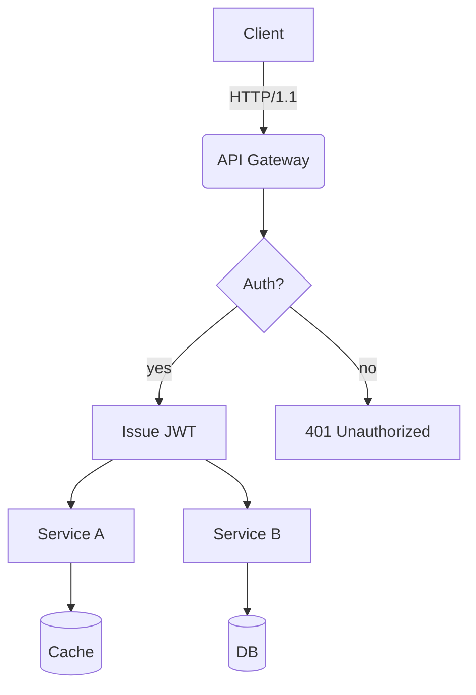
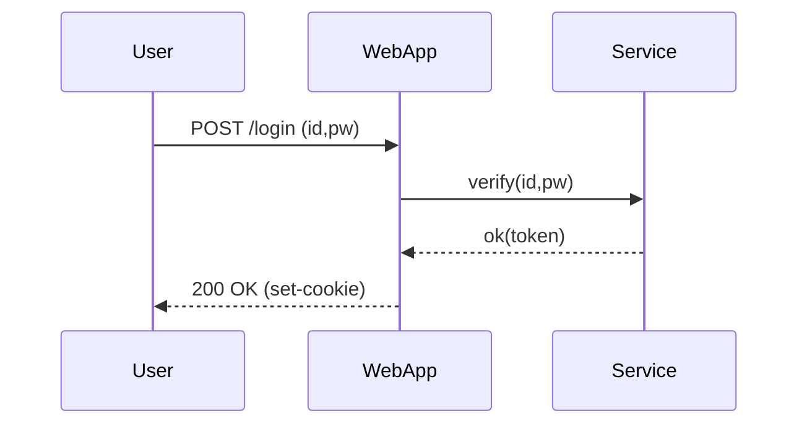
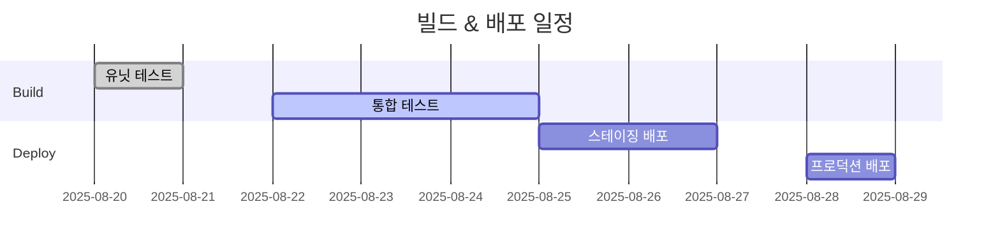
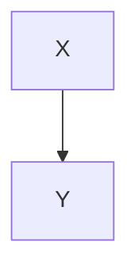

# Translation Test Document for **Rich Markdown**

This document is a collection of various Korean content formats designed to exceed *4096 tokens*. It aims to test the robustness of translators/LLMs in handling context, preserving format, ignoring code/diagrams, etc.

> **Guide**
> 1) Ensure that code blocks and `mermaid` areas remain unchanged.
> 2) Verify the preservation of numbers/units (e.g., 1.2GB, 3ms), slash paths (`/var/log/app.log`), and options (`--flag`).
> 3) Layouts should remain intact even when mixed elements like tables, lists, quotations, checkboxes, equations, and emojis (😀) are included.

## 1. Table with Symbols/Units Mixed

| Item | Value | Unit | Comment |
|---|---|---|---|
| Throughput | 12,345 | RPS | Peak at 18,900 RPS |
| Latency (P50) | 3.2 | ms | `--enable-cache` enabled |
| Latency (P99) | 41.7 | ms | Includes GC phase |
| Memory | 1.5 | GB | RSS based, cgroup limit 2GB |
| Disk I/O | 220 | MB/s | Via NVMe-oF(TCP) |

## 2. Checklist (Task List)

- [x] Accuracy of Markdown Header Translation
- [x] Preservation of Keywords within Code Blocks (`for`, `if`, `return`, etc.)
- [ ] Preservation of Mermaid Diagrams and Ignoring Comments
- [ ] Preservation of Units (GB/ms/%), Paths (`/etc/hosts`)
- [ ] Preservation of Inline Equations $O(n \log n)$

## 3. Code Blocks: Bash/Python/JSON/YAML

```bash
#!/usr/bin/env bash
set -euo pipefail

APP_ENV="${APP_ENV:-prod}"
INPUT="${1:-/data/input.txt}"
OUT="/var/tmp/result.json"

echo "[INFO] starting job on $(hostname) at $(date -Iseconds)"
if [[ ! -f "$INPUT" ]]; then
  echo "[ERROR] input not found: $INPUT" >&2
  exit 1
fi

lines=$(wc -l < "$INPUT")
echo "[DEBUG] line count: $lines"

curl -sS -X POST "http://127.0.0.1:8080/api" \  -H "Content-Type: application/json" \  -d "{"env":"$APP_ENV","count":$lines}" > "$OUT"

jq -r '.status' "$OUT" | grep -q success && echo "OK" || { echo "FAIL"; exit 2; }
```

```python
from __future__ import annotations

def rolling_avg(xs: list[float], k: int) -> list[float]:
    if k <= 0:
        raise ValueError("k must be > 0")
    out = []
    acc = 0.0
    for i, v in enumerate(xs):
        acc += v
        if i >= k:
            acc -= xs[i-k]
        if i >= k - 1:
            out.append(acc / k)
    return out

print(rolling_avg([1,2,3,4,5,6,7,8,9], 3))
```

```json
{
  "service": "analytics",
  "version": "1.4.2",
  "features": ["rollup", "compaction", "delta-index"],
  "limits": {
    "max_docs": 1000000,
    "max_payload_mb": 256
  }
}
```

```yaml
apiVersion: v1
kind: ConfigMap
metadata:
  name: test-config
data:
  APP_ENV: "staging"
  ENDPOINT: "https://api.example.com"
```

## 4. Mermaid Diagrams

### 4.1 Flowchart


### 4.2 Sequence Diagram


### 4.3 Gantt Chart


## 5. Images/Links/Quotes


- Document: [https://example.com/docs/guide](https://example.com/docs/guide)
- API Reference: [API Reference](https://example.com/api)
- Issue Tracker: [https://example.com/issues](https://example.com/issues)

> “Translation quality is determined by the simultaneous preservation of layout and meaning.” — Anonymous

## 6. Mixing Formulas and Text

- Average Time Complexity: $O(n \log n)$, Worst: $O(n^2)$
- Variance: $\sigma^2 = \frac{1}{n}\sum_{i=1}^{n}(x_i-\mu)^2$
- Sample Mean: $\bar{x} = \frac{1}{n}\sum x_i$

Paragraph Example: This paragraph is a sample to ensure that **bold**, *italic*, `code` is preserved correctly even when mixed with other text elements during translation. It includes emojis 😀, Chinese characters 漢字, English CamelCase, snake_case, and kebab-case naming conventions.

### 7.1 Experimental Section — Transformation Patterns
The following section is similar but slightly varies in vocabulary and order each iteration to prevent redundant translations.
- Scenario: Summary of Dialogue Logs
- Condition: Includes Korean text up to 100,000 characters
- Expected Outcome: Summary accuracy rate of over 90%

#### Procedure
1. Input Data: `/data/input_01.jsonl`
2. Options: `--batch 512 --timeout 3s --enable-cache`
3. Execution: `app run --job test-01 --qos high`
4. Verification: Check if `test-01 finished` is included in logs

#### Observations
- Longer GC (Garbage Collection) cycles show an increasing trend in P99 latency
- Processing throughput decreases by approximately 7% when cache miss rate increases by 10%
- Increasing connection pool size from 32 to 64 results in a decrease in retry rate per second from 1.2% to 0.6%

### 7.2 Experiment Section — Transformation Patterns
The following section is similar but slightly varies in vocabulary and order each iteration to prevent repetitive translations.
- Scenario: Summary of conversation logs
- Condition: Includes Korean text up to 100k characters
- Expected Outcome: Summary accuracy rate of over 90%

#### Procedure
1. Input Data: `/data/input_02.jsonl`
2. Options: `--batch 512 --timeout 3s --enable-cache`
3. Execution: `app run --job test-02 --qos high`
4. Verification: Check if `test-02 finished` is included in the logs

#### Observations
- Longer GC (Garbage Collection) cycles show an increasing trend in P99 latency
- Processing throughput decreases by approximately 7% when cache miss ratio increases by 10%
- Increasing connection pool size from 32 to 64 results in a decrease in retry rate per second from 1.2% to 0.6%

### 7.3 Experiment Section — Transformation Patterns
The following section contains variations in vocabulary and order for each iteration to prevent repetitive translations.
- Scenario: Kubernetes Deployment
- Condition: HPA (Horizontal Pod Autoscaler) Enabled
- Expected Result: Scale within the range of 2~10 pods

#### Procedure
1. Input Data: `/data/input_03.jsonl`
2. Options: `--batch 512 --timeout 3s --enable-cache`
3. Execution: `app run --job test-03 --qos high`
4. Verification: Check if `test-03 finished` is included in the logs

#### Observations
- Longer GC (Garbage Collection) cycles show a tendency towards increased P99 latency
- Processing throughput decreases by approximately 7% when cache miss ratio increases by 10%
- Increasing connection pool size from 32 to 64 results in a decrease in retry rate per second from 1.2% to 0.6%

### 7.4 Experiment Section — Transformation Patterns
The following section contains variations in vocabulary and order for each iteration to prevent repetitive translations.
- Scenario: Kubernetes Deployment
- Condition: HPA (Horizontal Pod Autoscaler) Enabled
- Expected Result: Scale within the range of 2~10 pods

#### Procedure
1. Input Data: `/data/input_04.jsonl`
2. Options: `--batch 512 --timeout 3s --enable-cache`
3. Execution: `app run --job test-04 --qos high`
4. Verification: Check if `test-04 finished` is included in the logs

#### Observations
- Longer GC (Garbage Collection) cycles show a tendency towards increased P99 latency
- Processing throughput decreases by approximately 7% when cache miss ratio increases by 10%
- Increasing connection pool size from 32 to 64 results in a decrease in retry rate per second from 1.2% to 0.6%

### 7.5 Experiment Section — Transformation Patterns
The following section is similar but slightly varies in vocabulary and order each iteration to prevent repetitive translations.
- Scenario: Summary of conversation logs
- Condition: Includes Korean text up to 100k characters
- Expected Outcome: Summary accuracy rate of over 90%

#### Procedure
1. Input Data: `/data/input_05.jsonl`
2. Options: `--batch 512 --timeout 3s --enable-cache`
3. Execution: `app run --job test-05 --qos high`
4. Verification: Check if `test-05 finished` is included in the logs

#### Observations
- Longer GC (Garbage Collection) cycles show an increasing trend in P99 latency
- Processing throughput decreases by approximately 7% when cache miss ratio increases by 10%
- Increasing connection pool size from 32 to 64 results in a decrease in retry rate per second from 1.2% to 0.6%

### 7.6 Experiment Section — Transformation Patterns
The following section contains variations in vocabulary and order for each iteration to prevent repetitive translations.
- Scenario: Mermaid Rendering
- Conditions: Over 50 nodes, Over 100 edges
- Expected Result: No layout distortion

#### Procedure
1. Input Data: `/data/input_06.jsonl`
2. Options: `--batch 512 --timeout 3s --enable-cache`
3. Execution: `app run --job test-06 --qos high`
4. Verification: Check if `test-06 finished` is included in the logs

#### Observations
- Longer GC (Garbage Collection) cycles show an increasing trend in P99 latency
- Processing throughput decreases by approximately 7% when cache miss ratio increases by 10%
- Increasing connection pool size from 32 to 64 results in a decrease in retry rate per second from 1.2% to 0.6%

### 7.7 Experiment Section — Transformation Patterns
The following section contains variations in vocabulary and order for each iteration to prevent repetitive translations.
- Scenario: Large-scale JSON Parsing
- Conditions: 64MB payload, 4 workers
- Expected Outcome: Completion without memory spikes

#### Procedure
1. Input Data: `/data/input_07.jsonl`
2. Options: `--batch 512 --timeout 3s --enable-cache`
3. Execution: `app run --job test-07 --qos high`
4. Verification: Check if `test-07 finished` is included in the logs

#### Observations
- Longer GC cycles show a tendency towards increased P99 latency
- Processing throughput decreases by approximately 7% when cache miss ratio increases by 10%
- Increasing connection pool size from 32 to 64 results in a decrease in retry rate per second from 1.2% to 0.6%

### 7.8 Experiment Section — Transformation Patterns
The following section contains variations in vocabulary and order for each iteration to prevent repetitive translations.
- Scenario: Large-scale JSON Parsing
- Conditions: 64MB payload, 4 workers
- Expected Outcome: Completion without memory spikes

#### Procedure
1. Input Data: `/data/input_08.jsonl`
2. Options: `--batch 512 --timeout 3s --enable-cache`
3. Execution: `app run --job test-08 --qos high`
4. Verification: Check if `test-08 finished` is included in the logs

#### Observations
- Longer GC cycles show a tendency towards increased P99 latency
- Processing throughput decreases by approximately 7% when cache miss ratio increases by 10%
- Increasing connection pool size from 32 to 64 results in a decrease in retry rate per second from 1.2% to 0.6%

### 7.9 Experiment Section — Transformation Patterns
The following section contains variations in vocabulary and order for each iteration to prevent repetitive translations.
- Scenario: Large-scale JSON Parsing
- Conditions: 64MB payload, 4 workers
- Expected Outcome: Completion without memory spikes

#### Procedure
1. Input Data: `/data/input_09.jsonl`
2. Options: `--batch 512 --timeout 3s --enable-cache`
3. Execution: `app run --job test-09 --qos high`
4. Verification: Check if `test-09 finished` is included in the logs

#### Observations
- Longer GC cycles show a tendency towards increased P99 latency
- Processing throughput decreases by approximately 7% when cache miss ratio increases by 10%
- Increasing connection pool size from 32 to 64 results in a decrease in retry rate per second from 1.2% to 0.6%

### 7.10 Experiment Section — Variation Patterns
The following section contains variations in vocabulary and order for each iteration to prevent repetitive translations.
- Scenario: NVMe-oF I/O Retries
- Conditions: TCP RTT 2ms, Loss Rate 0.1%
- Expected Result: Retry Rate ≤ 1%

#### Procedure
1. Input Data: `/data/input_10.jsonl`
2. Options: `--batch 512 --timeout 3s --enable-cache`
3. Execution: `app run --job test-10 --qos high`
4. Verification: Check if `test-10 finished` is included in the logs

#### Observations
- Longer GC (Garbage Collection) cycles show a tendency towards increased P99 latency
- Processing throughput decreases by approximately 7% when cache miss ratio increases by 10%
- Increasing connection pool size from 32 to 64 results in retry rate per second decreasing from 1.2% to 0.6%

### 7.11 Experiment Section — Transformation Patterns
The following section contains variations in vocabulary and order for each iteration to prevent repetitive translations.
- Scenario: Large-scale JSON Parsing
- Conditions: 64MB payload, 4 workers
- Expected Outcome: Completion without memory spikes

#### Procedure
1. Input Data: `/data/input_11.jsonl`
2. Options: `--batch 512 --timeout 3s --enable-cache`
3. Execution: `app run --job test-11 --qos high`
4. Verification: Check if `test-11 finished` is included in the logs

#### Observations
- Longer GC cycles show a tendency towards increased P99 latency
- Processing throughput decreases by approximately 7% when cache miss ratio increases by 10%
- Increasing connection pool size from 32 to 64 results in a decrease in retry rate per second from 1.2% to 0.6%

### 7.12 Experiment Section — Variation Patterns
The following section contains variations in vocabulary and order for each iteration to prevent repetitive translations.
- Scenario: Kubernetes Deployment
- Condition: HPA Enabled
- Expected Result: Scale within range of 2~10 nodes

#### Procedure
1. Input Data: `/data/input_12.jsonl`
2. Options: `--batch 512 --timeout 3s --enable-cache`
3. Execution: `app run --job test-12 --qos high`
4. Verification: Check if `test-12 finished` is included in logs

#### Observations
- Longer GC (Garbage Collection) cycles show an increasing trend in P99 latency
- Processing throughput decreases by approximately 7% when cache miss ratio increases by 10%
- Increasing connection pool size from 32 to 64 results in a decrease in retry rate per second from 1.2% to 0.6%

### 7.13 Experiment Section — Transformation Patterns
The following section contains variations in vocabulary and order for each iteration to prevent repetitive translations.
- Scenario: Large-scale JSON Parsing
- Conditions: 64MB payload, 4 workers
- Expected Outcome: Completion without memory spikes

#### Procedure
1. Input Data: `/data/input_13.jsonl`
2. Options: `--batch 512 --timeout 3s --enable-cache`
3. Execution: `app run --job test-13 --qos high`
4. Verification: Check if `test-13 finished` is included in the logs

#### Observations
- Longer GC cycles show a tendency towards increased P99 latency
- Processing throughput decreases by approximately 7% when cache miss ratio increases by 10%
- Increasing connection pool size from 32 to 64 results in a decrease in retry rate per second from 1.2% to 0.6%

### 7.14 Experiment Section — Transformation Patterns
The following section is similar but slightly alters vocabulary and order each iteration to prevent repetitive translations.
- Scenario: Large-scale JSON Parsing
- Conditions: 64MB payload, 4 workers
- Expected Outcome: Completion without memory spikes

#### Procedure
1. Input Data: `/data/input_14.jsonl`
2. Options: `--batch 512 --timeout 3s --enable-cache`
3. Execution: `app run --job test-14 --qos high`
4. Verification: Check if `test-14 finished` is included in logs

#### Observations
- Longer GC cycles show a tendency towards increased P99 latency
- Processing throughput decreases by approximately 7% when cache miss ratio increases by 10%
- Increasing connection pool size from 32 to 64 results in a decrease in retry rate per second from 1.2% to 0.6%

### 7.15 Experiment Section — Variation Patterns
The following section contains variations in vocabulary and order for each iteration to prevent repetitive translations.
- Scenario: NVMe-oF I/O Retries
- Conditions: TCP RTT 2ms, Loss Rate 0.1%
- Expected Result: Retry Rate ≤ 1%

#### Procedure
1. Input Data: `/data/input_15.jsonl`
2. Options: `--batch 512 --timeout 3s --enable-cache`
3. Execution: `app run --job test-15 --qos high`
4. Verification: Check if `test-15 finished` is included in the logs

#### Observations
- Longer GC (Garbage Collection) cycles show a tendency towards increased P99 latency
- Processing throughput decreases by approximately 7% when cache miss ratio increases by 10%
- Increasing connection pool size from 32 to 64 results in retry rate per second decreasing from 1.2% to 0.6%

### 7.16 Experiment Section — Transformation Patterns
The following section contains variations in vocabulary and order for each iteration to prevent repetitive translations.
- Scenario: Mermaid Rendering
- Conditions: Over 50 nodes, Over 100 edges
- Expected Result: No layout distortion

#### Procedure
1. Input Data: `/data/input_16.jsonl`
2. Options: `--batch 512 --timeout 3s --enable-cache`
3. Execution: `app run --job test-16 --qos high`
4. Verification: Check if `test-16 finished` is included in the logs

#### Observations
- Longer GC (Garbage Collection) cycles show an increasing trend in P99 latency
- Processing throughput decreases by approximately 7% when cache miss ratio increases by 10%
- Increasing connection pool size from 32 to 64 results in a decrease in retry rate per second from 1.2% to 0.6%

### 7.17 Experimental Paragraph — Transformation Patterns
The following paragraph slightly varies vocabulary and order each iteration to prevent redundant translations:
- Scenario: Summary of conversation logs
- Condition: Includes 100k characters in Korean
- Expected Result: Summary accuracy rate of over 90%

#### Procedure
1. Input Data: `/data/input_17.jsonl`
2. Options: `--batch 512 --timeout 3s --enable-cache`
3. Execution: `app run --job test-17 --qos high`
4. Verification: Check if `test-17 finished` is included in logs

#### Observations
- Longer GC (Garbage Collection) cycles show an increasing trend in P99 latency
- Processing throughput decreases by approximately 7% when cache miss ratio increases by 10%
- Increasing connection pool size from 32 to 64 results in a decrease in retry rate per second from 1.2% to 0.6%

### 7.18 Experiment Section — Transformation Patterns
The following section contains variations in vocabulary and order for each iteration to prevent repetitive translations.
- Scenario: Large-scale JSON Parsing
- Conditions: 64MB payload, 4 workers
- Expected Outcome: Completion without memory spikes

#### Procedure
1. Input Data: `/data/input_18.jsonl`
2. Options: `--batch 512 --timeout 3s --enable-cache`
3. Execution: `app run --job test-18 --qos high`
4. Verification: Check if `test-18 finished` is included in the logs

#### Observations
- Longer GC cycles show a tendency towards increased P99 latency
- Processing throughput decreases by approximately 7% when cache miss ratio increases by 10%
- Increasing connection pool size from 32 to 64 results in a decrease in retry rate per second from 1.2% to 0.6%

### 7.19 Experiment Section — Transformation Patterns
The following section is similar but slightly alters vocabulary and order each iteration to prevent repetitive translations.
- Scenario: Large-scale JSON Parsing
- Conditions: 64MB payload, 4 workers
- Expected Outcome: Completion without memory spikes

#### Procedure
1. Input Data: `/data/input_19.jsonl`
2. Options: `--batch 512 --timeout 3s --enable-cache`
3. Execution: `app run --job test-19 --qos high`
4. Verification: Check if `test-19 finished` is included in the logs

#### Observations
- Longer GC cycles show a tendency towards increased P99 latency
- Processing throughput decreases by approximately 7% when cache miss ratio increases by 10%
- Increasing connection pool size from 32 to 64 results in a decrease in retry rate per second from 1.2% to 0.6%

### 7.20 Experiment Section — Variation Patterns
The following section contains variations in vocabulary and order for each iteration to prevent repetitive translations.
- Scenario: NVMe-oF I/O Retries
- Conditions: TCP RTT 2ms, Loss Rate 0.1%
- Expected Result: Retry Rate ≤ 1%

#### Procedure
1. Input Data: `/data/input_20.jsonl`
2. Options: `--batch 512 --timeout 3s --enable-cache`
3. Execution: `app run --job test-20 --qos high`
4. Verification: Check if `test-20 finished` is included in the logs

#### Observations
- Longer GC (Garbage Collection) cycles show a tendency towards increased P99 latency
- Processing throughput decreases by approximately 7% when cache miss ratio increases by 10%
- Increasing connection pool size from 32 to 64 results in retry rate per second decreasing from 1.2% to 0.6%

### 7.21 Experiment Section — Transformation Patterns
The following section contains variations in vocabulary and order for each iteration to prevent repetitive translations.
- Scenario: Kubernetes Deployment
- Condition: HPA (Horizontal Pod Autoscaler) Enabled
- Expected Result: Scale within the range of 2~10 pods

#### Procedure
1. Input Data: `/data/input_21.jsonl`
2. Options: `--batch 512 --timeout 3s --enable-cache`
3. Execution: `app run --job test-21 --qos high`
4. Verification: Check if `test-21 finished` is included in the logs

#### Observations
- Longer GC (Garbage Collection) cycles show a tendency towards increased P99 latency
- Processing throughput decreases by approximately 7% when cache miss ratio increases by 10%
- Increasing connection pool size from 32 to 64 results in a decrease in retry rate per second from 1.2% to 0.6%

### 7.22 Experiment Section — Transformation Patterns
The following section contains variations in vocabulary and order for each iteration to prevent repetitive translations.
- Scenario: Mermaid Rendering
- Conditions: Over 50 nodes, Over 100 edges
- Expected Result: No layout distortion

#### Procedure
1. Input Data: `/data/input_22.jsonl`
2. Options: `--batch 512 --timeout 3s --enable-cache`
3. Execution: `app run --job test-22 --qos high`
4. Verification: Check if `test-22 finished` is included in the logs

#### Observations
- Longer GC (Garbage Collection) cycles show an increasing trend in P99 latency
- Processing throughput decreases by approximately 7% when cache miss ratio increases by 10%
- Increasing connection pool size from 32 to 64 results in a decrease in retry rate per second from 1.2% to 0.6%

### 7.23 Experiment Section — Transformation Patterns
The following section is similar but slightly alters vocabulary and order each iteration to prevent repetitive translations.
- Scenario: Large-scale JSON Parsing
- Conditions: 64MB payload, 4 workers
- Expected Outcome: Completion without memory spikes

#### Procedure
1. Input Data: `/data/input_23.jsonl`
2. Options: `--batch 512 --timeout 3s --enable-cache`
3. Execution: `app run --job test-23 --qos high`
4. Verification: Check if `test-23 finished` is included in logs

#### Observations
- Longer GC cycles show a tendency towards increased P99 latency
- Processing throughput decreases by approximately 7% when cache miss ratio increases by 10%
- Increasing connection pool size from 32 to 64 results in a decrease in retry rate per second from 1.2% to 0.6%

### 7.24 Experiment Section — Transformation Patterns
The following section contains variations in vocabulary and order for each iteration to prevent repetitive translations.
- Scenario: Mermaid Rendering
- Conditions: Over 50 nodes, Over 100 edges
- Expected Result: No layout distortion

#### Procedure
1. Input Data: `/data/input_24.jsonl`
2. Options: `--batch 512 --timeout 3s --enable-cache`
3. Execution: `app run --job test-24 --qos high`
4. Verification: Check if `test-24 finished` is included in the logs

#### Observations
- Longer GC (Garbage Collection) cycles show an increasing trend in P99 latency
- Processing throughput decreases by approximately 7% when cache miss ratio increases by 10%
- Increasing connection pool size from 32 to 64 results in a decrease in retry rate per second from 1.2% to 0.6%

### 7.25 Experiment Section — Transformation Patterns
The following section is similar but slightly alters vocabulary and order each iteration to prevent repetitive translations.
- Scenario: Kubernetes Deployment
- Condition: HPA Enabled
- Expected Result: Scale within range of 2~10 nodes

#### Procedure
1. Input Data: `/data/input_25.jsonl`
2. Options: `--batch 512 --timeout 3s --enable-cache`
3. Execution: `app run --job test-25 --qos high`
4. Verification: Check if `test-25 finished` is included in logs

#### Observations
- Longer GC (Garbage Collection) cycles show an increasing trend in P99 latency
- Processing throughput decreases by approximately 7% when cache miss ratio increases by 10%
- Increasing connection pool size from 32 to 64 results in a decrease in retry rate per second from 1.2% to 0.6%

### 7.26 Experiment Section — Variation Patterns
The following section contains variations in vocabulary and order for each iteration to prevent repetitive translations.
- Scenario: NVMe-oF I/O Retries
- Conditions: TCP RTT 2ms, Loss Rate 0.1%
- Expected Result: Retry Rate ≤ 1%

#### Procedure
1. Input Data: `/data/input_26.jsonl`
2. Options: `--batch 512 --timeout 3s --enable-cache`
3. Execution: `app run --job test-26 --qos high`
4. Verification: Check if `test-26 finished` is included in the logs

#### Observations
- Longer GC (Garbage Collection) cycles show a tendency towards increased P99 latency
- Processing throughput decreases by approximately 7% when cache miss ratio increases by 10%
- Increasing connection pool size from 32 to 64 results in retry rate per second decreasing from 1.2% to 0.6%

### 7.27 Experiment Section — Transformation Patterns
The following section is similar but slightly varies in vocabulary and order each iteration to prevent repetitive translations.
- Scenario: Summary of conversation logs
- Condition: Includes Korean text up to 100k characters
- Expected Outcome: Summary accuracy rate of over 90%

#### Procedure
1. Input Data: `/data/input_27.jsonl`
2. Options: `--batch 512 --timeout 3s --enable-cache`
3. Execution: `app run --job test-27 --qos high`
4. Verification: Check if `test-27 finished` is included in the logs

#### Observations
- Longer GC (Garbage Collection) cycles show an increasing trend in P99 latency
- Processing throughput decreases by approximately 7% when cache miss ratio increases by 10%
- Increasing connection pool size from 32 to 64 results in a decrease in retry rate per second from 1.2% to 0.6%

### 7.28 Experiment Section — Transformation Patterns
The following section is similar but slightly varies in vocabulary and order each iteration to prevent repetitive translations.
- Scenario: Summary of conversation logs
- Condition: Includes Korean text up to 100k characters
- Expected Outcome: Summary accuracy rate of over 90%

#### Procedure
1. Input Data: `/data/input_28.jsonl`
2. Options: `--batch 512 --timeout 3s --enable-cache`
3. Execution: `app run --job test-28 --qos high`
4. Verification: Check if `test-28 finished` is included in the logs

#### Observations
- Longer GC (Garbage Collection) cycles show an increasing trend in P99 latency
- Processing throughput decreases by approximately 7% when cache miss ratio increases by 10%
- Increasing connection pool size from 32 to 64 results in a decrease in retry rate per second from 1.2% to 0.6%

### 7.29 Experiment Section — Transformation Patterns
The following section is similar but slightly alters vocabulary and order each iteration to prevent repetitive translations.
- Scenario: Large-scale JSON Parsing
- Conditions: 64MB payload, 4 workers
- Expected Outcome: Completion without memory spikes

#### Procedure
1. Input Data: `/data/input_29.jsonl`
2. Options: `--batch 512 --timeout 3s --enable-cache`
3. Execution: `app run --job test-29 --qos high`
4. Verification: Check if `test-29 finished` is included in the logs

#### Observations
- Longer GC cycles show a tendency towards increased P99 latency
- Processing throughput decreases by approximately 7% when cache miss ratio increases by 10%
- Increasing connection pool size from 32 to 64 results in a decrease in retry rate per second from 1.2% to 0.6%

### 7.30 Experiment Section — Transformation Patterns
The following section contains variations in vocabulary and order for each iteration to prevent repetitive translations.
- Scenario: Summary of conversation logs
- Condition: Includes Korean text up to 100k characters
- Expected Outcome: Summary accuracy rate of over 90%

#### Procedure
1. Input Data: `/data/input_30.jsonl`
2. Options: `--batch 512 --timeout 3s --enable-cache`
3. Execution: `app run --job test-30 --qos high`
4. Verification: Check if `test-30 finished` is included in the logs

#### Observations
- Longer GC (Garbage Collection) cycles show an increasing trend in P99 latency
- Processing throughput decreases by approximately 7% when cache miss ratio increases by 10%
- Increasing connection pool size from 32 to 64 results in a decrease in retry rate per second from 1.2% to 0.6%

### 7.31 Experiment Section — Variation Patterns
The following section is similar but slightly alters vocabulary and order each iteration to prevent repetitive translations.
- Scenario: Kubernetes Deployment
- Condition: HPA Enabled
- Expected Result: Scale within range of 2~10 nodes

#### Procedure
1. Input Data: `/data/input_31.jsonl`
2. Options: `--batch 512 --timeout 3s --enable-cache`
3. Execution: `app run --job test-31 --qos high`
4. Verification: Check if `test-31 finished` is included in logs

#### Observations
- Longer GC (Garbage Collection) cycles show an increasing trend in P99 latency
- Processing throughput decreases by approximately 7% when cache miss ratio increases by 10%
- Increasing connection pool size from 32 to 64 results in a decrease in retry rate per second from 1.2% to 0.6%

### 7.32 Experiment Section — Transformation Patterns
The following section is similar but slightly varies in vocabulary and order each iteration to prevent repetitive translations.
- Scenario: Mermaid Rendering
- Conditions: Over 50 nodes, Over 100 edges
- Expected Result: No layout distortion

#### Procedure
1. Input Data: `/data/input_32.jsonl`
2. Options: `--batch 512 --timeout 3s --enable-cache`
3. Execution: `app run --job test-32 --qos high`
4. Verification: Check if `test-32 finished` is included in the logs

#### Observations
- Longer GC cycles show a tendency towards increased P99 latency
- Processing throughput decreases by approximately 7% when cache miss ratio increases by 10%
- Increasing connection pool size from 32 to 64 results in a decrease in retry rate per second from 1.2% to 0.6%

### 7.33 Experiment Section — Transformation Patterns
The following section is similar but slightly alters vocabulary and order each iteration to prevent repetitive translations.
- Scenario: Large-scale JSON Parsing
- Conditions: 64MB payload, 4 workers
- Expected Outcome: Completion without memory spikes

#### Procedure
1. Input Data: `/data/input_33.jsonl`
2. Options: `--batch 512 --timeout 3s --enable-cache`
3. Execution: `app run --job test-33 --qos high`
4. Verification: Check if `test-33 finished` is included in logs

#### Observations
- Longer GC cycles show a tendency towards increased P99 latency
- Processing throughput decreases by approximately 7% when cache miss ratio increases by 10%
- Increasing connection pool size from 32 to 64 results in a decrease in retry rate per second from 1.2% to 0.6%

### 7.34 Experiment Section — Variation Patterns
The following section is similar but slightly alters vocabulary and order each iteration to prevent repetitive translations.
- Scenario: Kubernetes Deployment
- Condition: HPA Enabled
- Expected Result: Scale within range of 2~10 nodes

#### Procedure
1. Input Data: `/data/input_34.jsonl`
2. Options: `--batch 512 --timeout 3s --enable-cache`
3. Execution: `app run --job test-34 --qos high`
4. Verification: Check if `test-34 finished` is included in logs

#### Observations
- Longer GC (Garbage Collection) cycles show an increasing trend in P99 latency
- Processing throughput decreases by approximately 7% when cache miss ratio increases by 10%
- Increasing connection pool size from 32 to 64 results in a decrease in retry rate per second from 1.2% to 0.6%

### 7.35 Experiment Section — Transformation Patterns
The following section is similar but slightly varies in vocabulary and order each iteration to prevent repetitive translations.
- Scenario: Mermaid Rendering
- Conditions: Over 50 nodes, Over 100 edges
- Expected Result: No layout distortion

#### Procedure
1. Input Data: `/data/input_35.jsonl`
2. Options: `--batch 512 --timeout 3s --enable-cache`
3. Execution: `app run --job test-35 --qos high`
4. Verification: Check if `test-35 finished` is included in the logs

#### Observations
- Longer GC (Garbage Collection) cycles show an increasing trend in P99 latency
- Processing throughput decreases by approximately 7% when cache miss ratio increases by 10%
- Increasing connection pool size from 32 to 64 results in a decrease in retry rate per second from 1.2% to 0.6%

### 7.36 Experimental Paragraph — Variation Patterns
The following paragraph slightly varies vocabulary and order each iteration to prevent repetitive translations:
- Scenario: NVMe-oF I/O Retries
- Conditions: TCP RTT 2ms, Loss 0.1%
- Expected Result: Retry Rate ≤ 1%

#### Procedure
1. Input Data: `/data/input_36.jsonl`
2. Options: `--batch 512 --timeout 3s --enable-cache`
3. Execution: `app run --job test-36 --qos high`
4. Verification: Check if `test-36 finished` is included in the logs

#### Observations
- Longer GC cycles show a tendency towards increased P99 latency
- Processing throughput decreases by ~7% when cache miss ratio increases by 10%p
- Increasing connection pool size from 32 to 64 results in retry rate per second decreasing from 1.2% to 0.6%

### 7.37 Experiment Section — Transformation Patterns
The following section is similar but slightly alters vocabulary and order each iteration to prevent repetitive translations.
- Scenario: Large-scale JSON Parsing
- Conditions: 64MB payload, 4 workers
- Expected Outcome: Completion without memory spikes

#### Procedure
1. Input Data: `/data/input_37.jsonl`
2. Options: `--batch 512 --timeout 3s --enable-cache`
3. Execution: `app run --job test-37 --qos high`
4. Verification: Check if `test-37 finished` is included in logs

#### Observations
- Longer GC cycles show a tendency towards increased P99 latency
- Processing throughput decreases by approximately 7% when cache miss ratio increases by 10%
- Increasing connection pool size from 32 to 64 results in a decrease in retry rate per second from 1.2% to 0.6%

### 7.38 Experiment Section — Transformation Patterns
The following section contains variations in vocabulary and order for each iteration to prevent repetitive translations.
- Scenario: Mermaid Rendering
- Conditions: Over 50 nodes, Over 100 edges
- Expected Result: No layout distortion

#### Procedure
1. Input Data: `/data/input_38.jsonl`
2. Options: `--batch 512 --timeout 3s --enable-cache`
3. Execution: `app run --job test-38 --qos high`
4. Verification: Check if `test-38 finished` is included in the logs

#### Observations
- Longer GC (Garbage Collection) cycles show an increasing trend in P99 latency
- Processing throughput decreases by approximately 7% when cache miss ratio increases by 10%
- Increasing connection pool size from 32 to 64 results in a decrease in retry rate per second from 1.2% to 0.6%

### 7.39 Experiment Section — Transformation Patterns
The following section contains variations in vocabulary and order for each iteration to prevent repetitive translations.
- Scenario: Mermaid Rendering
- Conditions: Over 50 nodes, Over 100 edges
- Expected Result: No layout distortion

#### Procedure
1. Input Data: `/data/input_39.jsonl`
2. Options: `--batch 512 --timeout 3s --enable-cache`
3. Execution: `app run --job test-39 --qos high`
4. Verification: Check if `test-39 finished` is included in the logs

#### Observations
- Longer GC (Garbage Collection) cycles show an increasing trend in P99 latency
- Processing throughput decreases by approximately 7% when cache miss ratio increases by 10%
- Increasing connection pool size from 32 to 64 results in a decrease in retry rate per second from 1.2% to 0.6%

### 7.40 Experiment Section — Transformation Patterns
The following section contains variations in vocabulary and order for each iteration to prevent repetitive translations.
- Scenario: Summary of conversation logs
- Condition: Includes Korean text up to 100k characters
- Expected Outcome: Summary accuracy rate of over 90%

#### Procedure
1. Input Data: `/data/input_40.jsonl`
2. Options: `--batch 512 --timeout 3s --enable-cache`
3. Execution: `app run --job test-40 --qos high`
4. Verification: Check for `test-40 finished` in logs

#### Observations
- Longer GC (Garbage Collection) cycles show an increasing trend in P99 latency
- Processing throughput decreases by approximately 7% when cache miss ratio increases by 10%
- Increasing connection pool size from 32 to 64 results in a decrease in retry rate per second from 1.2% to 0.6%

## Long List of Topics

- 2. Error Handling Consistency — Case #001
- 3. Performance Profiling — Case #002
- 4. Accessibility (a11y) — Case #003
- 5. Log Schema Stability — Case #004
- 6. Cache Invalidation Scenarios — Case #005
- 7. Performance Profiling — Case #006
- 8. Performance Profiling — Case #007
- 9. API Backward Compatibility — Case #008
- 10. Log Schema Stability — Case #009
- 11. Accessibility (a11y) — Case #010
- 12. Cache Invalidation Scenarios — Case #011
- 13. Performance Profiling — Case #012
- 14. Security Header Implementation — Case #013
- 15. Resource Leak Detection — Case #015
- 16. Error Handling Consistency — Case #016
- 17. Error Handling Consistency — Case #017
- 18. Internationalization (i18n) — Case #018
- 19. CORS Policy Validation — Case #019
- 20. Performance Profiling — Case #020
- 21. Security Header Implementation — Case #021
- 22. Performance Profiling — Case #023
- 23. Performance Profiling — Case #024
- 24. CORS Policy Validation — Case #025
- 25. Performance Profiling — Case #026
- 26. Accessibility (a11y) — Case #027
- 27. Accessibility (a11y) — Case #028
- 28. API Backward Compatibility — Case #029
- 29. Cache Invalidation Scenarios — Case #030
- 30. Cache Invalidation Scenarios — Case #031
- 31. Performance Profiling — Case #032
- 32. Resource Leak Detection — Case #033
- 33. Log Schema Stability — Case #034
- 34. CORS Policy Validation — Case #035
- 35. Error Handling Consistency — Case #036
- 36. Resource Leak Detection — Case #037
- 37. Error Handling Consistency — Case #038
- 38. Internationalization (i18n) — Case #039
- 39. API Backward Compatibility — Case #040
- 40. Cache Invalidation Scenarios — Case #041
- 41. Cache Invalidation Scenarios — Case #042
- 42. Cache Invalidation Scenarios — Case #043
- 43. Performance Profiling — Case #044
- 44. Performance Profiling — Case #045
- 45. CORS Policy Validation — Case #046
- 46. Resource Leak Detection — Case #047
- 47. Cache Invalidation Scenarios — Case #048
- 48. Error Handling Consistency — Case #049
- 49. Log Schema Stability — Case #050
- 50. Resource Leak Detection — Case #051
- 51. Internationalization (i18n) — Case #052
- 52. Log Schema Stability — Case #053
- 53. Resource Leak Detection — Case #054
- 54. Security Header Implementation — Case #055
- 55. Internationalization (i18n) — Case #056
- 56. API Backward Compatibility — Case #057
- 57. Accessibility (a11y) — Case #058
- 58. API Backward Compatibility — Case #059
- 59. Performance Profiling — Case #060
- 60. Accessibility (a11y) — Case #061
- 61. API Backward Compatibility — Case #062
- 62. Internationalization (i18n) — Case #063
- 63. Security Header Implementation — Case #064
- 64. Error Handling Consistency — Case #065
- 65. Performance Profiling — Case #066
- 66. Accessibility (a11y) — Case #067
- 67. Error Handling Consistency — Case #068
- 68. Performance Profiling — Case #069
- 69. Resource Leak Detection — Case #070
- 70. Accessibility (a11y) — Case #071
- 71. Internationalization (i18n) — Case #072
- 72. Error Handling Consistency — Case #073
- 73. Internationalization (i18n) — Case #074
- 74. Performance Profiling — Case #075
- 75. Security Header Implementation — Case #076
- 76. CORS Policy Validation — Case #077
- 77. Resource Leak Detection — Case #078
- 78. Resource Leak Detection — Case #079
- 79. Performance Profiling — Case #080
- 80. Accessibility (a11y) — Case #081
- 81. Accessibility (a11y) — Case #082
- 82. Performance Profiling — Case #083
- 83. Resource Leak Detection — Case #084
- 84. Accessibility (a11y) — Case #085
- 85. Cache Invalidation Scenarios — Case #086
- 86. CORS Policy Validation — Case #087
- 87. Log Schema Stability — Case #088
- 88. CORS Policy Validation — Case #089
- 89. Security Header Implementation — Case #090
- 90. API Backward Compatibility — Case #091
- 91. Accessibility (a11y) — Case #092
- 92. Performance Profiling — Case #093
- 93. Performance Profiling — Case #094
- 94. Log Schema Stability — Case #095
- 95. Internationalization (i18n) — Case #096
- 96. API Backward Compatibility — Case #097
- 97. Security Header Implementation — Case #098
- 98. API Backward Compatibility — Case #099
- 99. Error Handling Consistency — Case #100
- 100. Accessibility (a11y) — Case #101
- 101. Internationalization (i18n) — Case #102
- 102. Accessibility (a11y) — Case #103
- 103. API Backward Compatibility — Case #104
- 104. Accessibility (a11y) — Case #105
- 105. Performance Profiling — Case #106
- 106. Security Header Implementation — Case #107
- 107. API Backward Compatibility — Case #108
- 108. Security Header Implementation — Case #109
- 109. Error Handling Consistency — Case #110
- 110. Performance Profiling — Case #111
- 111. Resource Leak Detection — Case #112
- 112. CORS Policy Validation — Case #113
- 113. Accessibility (a11y) — Case #114
- 114. Error Handling Consistency — Case #115
- 115. Error Handling Consistency — Case #116
- 116. Performance Profiling — Case #117
- 117. CORS Policy Validation — Case #118
- 118. Resource Leak Detection — Case #119
- 119. Cache Invalidation Scenarios — Case #120
- 120. CORS Policy Validation — Case #121
- 121. Performance Profiling — Case #122
- 122. Error Handling Consistency — Case #123
- 123. Performance Profiling — Case #124
- 124. Accessibility (a11y) — Case #125
- 125. Internationalization (i18n) — Case #126
- 126. Error Handling Consistency — Case #127
- 127. Performance Profiling — Case #128
- 128. Security Header Implementation — Case #129
- 129. Cache Invalidation Scenarios — Case #130
- 130. CORS Policy Validation — Case #131
- 131. Resource Leak Detection — Case #132
- 132. Accessibility (a11y) — Case #133
- 133. Error Handling Consistency — Case #134
- 134. Internationalization (i18n) — Case #135
- 135. Accessibility (a11y) — Case #136
- 136. API Backward Compatibility — Case #137
- 137. Accessibility (a11y) — Case #138
- 138. Performance Profiling — Case #139
- 139. Security Header Implementation — Case #140
- 140. API Backward Compatibility — Case #141
- 141. Security Header Implementation — Case #142
- 142. Error Handling Consistency — Case #143
- 143. Performance Profiling — Case #144
- 144. Resource Leak Detection — Case #145
- 145. CORS Policy Validation — Case #146
- 146. Resource Leak Detection — Case #147
- 147. Performance Profiling — Case #148
- 148. Accessibility (a11y) — Case #149
- 149. CORS Policy Validation — Case #150
- 150. Resource Leak Detection — Case #151
- 151. Internationalization (i18n) — Case #152
- 152. Log Schema Stability — Case #153
- 153. CORS Policy Validation — Case #154
- 154. Security Header Implementation — Case #155
- 155. API Backward Compatibility — Case #156
- 156. Accessibility (a11y) — Case #157
- 157. Performance Profiling — Case #158
- 158. Accessibility (a11y) — Case #159
- 159. API Backward Compatibility — Case #160
- 160. Performance Profiling — Case #161
- 161. Security Header Implementation — Case #162
- 162. CORS Policy Validation — Case #163
- 163. Resource Leak Detection — Case #164
- 164. Cache Invalidation Scenarios — Case #165
- 165. CORS Policy Validation — Case #166
- 166. Performance Profiling — Case #167
- 167. Accessibility (a11y) — Case #168
- 168. Error Handling Consistency — Case #169
- 169. Resource Leak Detection — Case #170
- 170. Accessibility (a11y) — Case #171
- 171. Internationalization (i18n) — Case #172
- 172. Error Handling Consistency — Case #173
- 173. Internationalization (i18n) — Case #174
- 174. Performance Profiling — Case #175
- 175. Security Header Implementation — Case #176
- 176. CORS Policy Validation — Case #177
- 177. Resource Leak Detection — Case #178
- 178. Resource Leak Detection — Case #179
- 179. Performance Profiling — Case #180
- 180. Accessibility (a11y) — Case #181
- 181. Accessibility (a11y) — Case #182
- 182. Performance Profiling — Case #183
- 183. Resource Leak Detection — Case #184
- 184. Accessibility (a11y) — Case #185
- 185. Cache Invalidation Scenarios — Case #186
- 186. CORS Policy Validation — Case #187
- 187. Log Schema Stability — Case #188
- 188. CORS Policy Validation — Case #189
- 189. Security Header Implementation — Case #190
- 190. API Backward Compatibility — Case #191
- 191. Accessibility (a11y) — Case #192
- 192. Performance Profiling — Case #193
- 193. Performance Profiling — Case #194
- 194. Log Schema Stability — Case #195
- 195. Internationalization (i18n) — Case #196
- 196. API Backward Compatibility — Case #197
- 197. Error Handling Consistency — Case #198
- 198. Cache Invalidation Scenarios — Case #199
- 199. Accessibility (a11y) — Case #200
- 200. Accessibility (a11y) — Case #201
- 126. Performance Profiling — Case #125
- 127. Accessibility (a11y) — Case #126
- 128. Accessibility (a11y) — Case #127
- 129. Error Handling Consistency — Case #128
- 130. Error Handling Consistency — Case #129
- 131. API Backward Compatibility — Case #130
- 132. Accessibility (a11y) — Case #131
- 133. API Backward Compatibility — Case #132
- 134. Cache Invalidation Scenarios — Case #133
- 135. Security Headers Implementation — Case #134
- 136. Internationalization (i18n) — Case #135
- 137. Security Headers Implementation — Case #136
- 138. Performance Profiling — Case #137
- 139. Performance Profiling — Case #138
- 140. CORS Policy Validation — Case #139
- 141. Internationalization (i18n) — Case #140
- 142. Log Schema Stability — Case #141
- 143. CORS Policy Validation — Case #142
- 144. Accessibility (a11y) — Case #143
- 145. Security Headers Implementation — Case #144
- 146. Log Schema Stability — Case #145
- 147. Performance Profiling — Case #146
- 148. Performance Profiling — Case #147
- 149. API Backward Compatibility — Case #148
- 150. Resource Leak Detection — Case #149
- 151. Performance Profiling — Case #150
- 152. Resource Leak Detection — Case #151
- 153. Accessibility (a11y) — Case #152
- 154. API Backward Compatibility — Case #153
- 155. Accessibility (a11y) — Case #154
- 156. Security Headers Implementation — Case #155
- 157. Accessibility (a11y) — Case #156
- 158. Performance Profiling — Case #157
- 159. Cache Invalidation Scenarios — Case #158
- 160. Security Headers Implementation — Case #159
- 161. Internationalization (i18n) — Case #160
- 162. Log Schema Stability — Case #161
- 163. CORS Policy Validation — Case #162
- 164. Internationalization (i18n) — Case #163
- 165. Cache Invalidation Scenarios — Case #164
- 166. Resource Leak Detection — Case #165
- 167. Security Headers Implementation — Case #166
- 168. Performance Profiling — Case #167
- 169. Internationalization (i18n) — Case #168
- 170. Cache Invalidation Scenarios — Case #169
- 171. Resource Leak Detection — Case #170
- 172. Security Headers Implementation — Case #171
- 173. Resource Leak Detection — Case #172
- 174. Accessibility (a11y) — Case #173
- 175. Cache Invalidation Scenarios — Case #174
- 176. Security Headers Implementation — Case #175
- 177. Performance Profiling — Case #176
- 178. Accessibility (a11y) — Case #177
- 179. Security Headers Implementation — Case #178
- 180. Performance Profiling — Case #179
- 181. Cache Invalidation Scenarios — Case #180
- 182. Security Headers Implementation — Case #181
- 183. Performance Profiling — Case #182
- 184. Accessibility (a11y) — Case #183
- 185. Security Headers Implementation — Case #184
- 186. Accessibility (a11y) — Case #185
- 187. Cache Invalidation Scenarios — Case #186
- 188. Accessibility (a11y) — Case #187
- 189. Cache Invalidation Scenarios — Case #188
- 190. Accessibility (a11y) — Case #189
- 191. Cache Invalidation Scenarios — Case #190
- 192. Error Handling Consistency — Case #191
- 193. Error Handling Consistency — Case #192
- 194. Resource Leak Detection — Case #193
- 195. Error Handling Consistency — Case #194
- 196. CORS Policy Validation — Case #195
- 197. Performance Profiling — Case #196
- 198. Resource Leak Detection — Case #197
- 199. Internationalization (i18n) — Case #198
- 200. Resource Leak Detection — Case #199
- 201. Cache Invalidation Scenarios — Case #200
- 202. Internationalization (i18n) — Case #201
- 203. Log Schema Stability — Case #202
- 204. Error Handling Consistency — Case #203
- 205. Resource Leak Detection — Case #204
- 206. Security Headers Implementation — Case #205
- 207. Resource Leak Detection — Case #206
- 208. Cache Invalidation Scenarios — Case #207
- 209. Performance Profiling — Case #208
- 210. Security Headers Implementation — Case #209
- 211. Internationalization (i18n) — Case #210
- 212. Log Schema Stability — Case #211
- 213. Error Handling Consistency — Case #212
- 214. Cache Invalidation Scenarios — Case #213
- 215. Security Headers Implementation — Case #214
- 216. Internationalization (i18n) — Case #215
- 217. Security Headers Implementation — Case #216
- 218. Performance Profiling — Case #217
- 219. Error Handling Consistency — Case #218
- 220. Security Headers Implementation — Case #219
- 221. Performance Profiling — Case #220
- 222. API Backward Compatibility — Case #221
- 223. Resource Leak Detection — Case #222
- 224. Internationalization (i18n) — Case #223
- 225. Security Headers Implementation — Case #224
- 226. Internationalization (i18n) — Case #225
- 227. Performance Profiling — Case #226
- 228. Log Schema Stability — Case #228
- 229. CORS Policy Validation — Case #229
- 230. Performance Profiling — Case #230
- 231. API Backward Compatibility — Case #231
- 232. CORS Policy Validation — Case #232
- 233. Internationalization (i18n) — Case #233
- 234. Error Handling Consistency — Case #234
- 235. Performance Profiling — Case #235
- 236. Error Handling Consistency — Case #236
- 237. Performance Profiling — Case #237
- 238. Security Headers Implementation — Case #238
- 239. Error Handling Consistency — Case #239
- 240. CORS Policy Validation — Case #240
- 241. API Backward Compatibility — Case #241
- 242. Performance Profiling — Case #242
- 243. Cache Invalidation Scenarios — Case #243
- 244. Performance Profiling — Case #244
- 245. Security Headers Implementation — Case #245
- 246. Resource Leak Detection — Case #245
- 247. Performance Profiling — Case #246
- 248. Accessibility (a11y) — Case #247
- 249. Resource Leak Detection — Case #248
- 250. Cache Invalidation Scenarios — Case #249
- 251. Accessibility (a11y) — Case #250
- 252. Cache Invalidation Scenarios — Case #251
- 253. Error Handling Consistency — Case #252
- 254. Error Handling Consistency — Case #253
- 255. Resource Leak Detection — Case #254
- 256. CORS Policy Validation — Case #255
- 257. Performance Profiling — Case #256
- 258. Resource Leak Detection — Case #257
- 259. Accessibility (a11y) — Case #258
- 260. Cache Invalidation Scenarios — Case #259
- 261. Accessibility (a11y) — Case #260
- 262. Cache Invalidation Scenarios — Case #261
- 263. Error Handling Consistency — Case #262
- 264. Error Handling Consistency — Case #263
- 265. Resource Leak Detection — Case #264
- 266. CORS Policy Validation — Case #265
- 267. Performance Profiling — Case #266
- 268. Security Headers Implementation — Case #267
- 269. Performance Profiling — Case #268
- 270. API Backward Compatibility — Case #269
- 271. Resource Leak Detection — Case #270
- 272. Internationalization (i18n) — Case #271
- 273. Security Headers Implementation — Case #272
- 274. Internationalization (i18n) — Case #273
- 275. Performance Profiling — Case #274
- 276. Error Handling Consistency — Case #275
- 277. Cache Invalidation Scenarios — Case #276
- 278. Security Headers Implementation — Case #277
- 279. Internationalization (i18n) — Case #278
- 280. Security Headers Implementation — Case #279
- 281. Performance Profiling — Case #280
- 282. Error Handling Consistency — Case #281
- 283. Performance Profiling — Case #282
- 284. API Backward Compatibility — Case #283
- 285. Resource Leak Detection — Case #284
- 286. Internationalization (i18n) — Case #285
- 287. Security Headers Implementation — Case #286
- 288. Performance Profiling — Case #287
- 289. Cache Invalidation Scenarios — Case #288
- 290. Performance Profiling — Case #289
- 291. Security Headers Implementation — Case #290
- 292. Performance Profiling — Case #291
- 293. API Backward Compatibility — Case #292
- 294. Resource Leak Detection — Case #293
- 295. Cache Invalidation Scenarios — Case #294
- 296. Accessibility (a11y) — Case #295
- 297. Accessibility (a11y) — Case #296
- 298. Cache Invalidation Scenarios — Case #297
- 299. Accessibility (a11y) — Case #298
- 300. Cache Invalidation Scenarios — Case #299
- 301. Error Handling Consistency — Case #300
- 302. Error Handling Consistency — Case #301
- 303. Resource Leak Detection — Case #302
- 304. CORS Policy Validation — Case #303
- 305. Performance Profiling — Case #304
- 306. Resource Leak Detection — Case #305
- 307. Security Headers Implementation — Case #306
- 308. Resource Leak Detection — Case #307
- 309. Cache Invalidation Scenarios — Case #308
- 310. Performance Profiling — Case #309
- 311. Accessibility (a11y) — Case #310
- 312. Security Headers Implementation — Case #311
- 313. Resource Leak Detection — Case #312
- 314. Cache Invalidation Scenarios — Case #313
- 315. Performance Profiling — Case #314
- 316. Error Handling Consistency — Case #315
- 317. Resource Leak Detection — Case #316
- 318. CORS Policy Validation — Case #317
- 319. Performance Profiling — Case #318
- 320. API Backward Compatibility — Case #319
- 321. Cache Invalidation Scenarios — Case #320
- 322. Performance Profiling — Case #321
- 323. Security Headers Implementation — Case #322
- 324. Resource Leak Detection — Case #323
- 325. Cache Invalidation Scenarios — Case #324
- 326. Accessibility (a11y) — Case #325
- 327. Security Headers Implementation — Case #326
- 328. Performance Profiling — Case #327
- 329. Resource Leak Detection — Case #328
- 330. Cache Invalidation Scenarios — Case #329
- 331. Internationalization (i18n) — Case #330
- 332. Performance Profiling — Case #331
- 333. Resource Leak Detection — Case #332
- 334. Accessibility (a11y) — Case #333
- 335. Cache Invalidation Scenarios — Case #334
- 336. Internationalization (i18n) — Case #335
- 337. Security Headers Implementation — Case #336
- 338. Performance Profiling — Case #337
- 339. Error Handling Consistency — Case #338
- 340. Resource Leak Detection — Case #339
- 341. Cache Invalidation Scenarios — Case #340
- 342. Security Headers Implementation — Case #341
- 343. Performance Profiling — Case #342
- 344. Accessibility (a11y) — Case #343
- 345. Resource Leak Detection — Case #344
- 346. Cache Invalidation Scenarios — Case #345
- 347. Performance Profiling — Case #346
- 348. Error Handling Consistency — Case #347
- 349. Security Headers Implementation — Case #348
- 350. Performance Profiling — Case #349
- Error Handling Consistency — Case #246
- Internationalization (i18n) — Case #247
- Log Schema Stability — Case #248
- Security Headers Implementation — Case #249
- Accessibility (a11y) — Case #250
- Accessibility (a11y) — Case #251
- Internationalization (i18n) — Case #252
- Internationalization (i18n) — Case #253
- CORS Policy Validation — Case #254
- Log Schema Stability — Case #255
- CORS Policy Validation — Case #256
- Security Headers Implementation — Case #257
- Cache Invalidation Scenarios — Case #258
- Error Handling Consistency — Case #259
- Accessibility (a11y) — Case #260
- Resource Leak Inspection — Case #261
- Resource Leak Inspection — Case #262
- Performance Profiling — Case #263
- Accessibility (a11y) — Case #264
- Cache Invalidation Scenarios — Case #265
- Security Headers Implementation — Case #266
- Resource Leak Inspection — Case #267
- Security Headers Implementation — Case #268
- Performance Profiling — Case #269
- Error Handling Consistency — Case #270
- Internationalization (i18n) — Case #271
- API Backward Compatibility — Case #272
- Error Handling Consistency — Case #273
- Accessibility (a11y) — Case #274
- API Backward Compatibility — Case #275
- Internationalization (i18n) — Case #276
- CORS Policy Validation — Case #277
- Security Headers Implementation — Case #278
- Cache Invalidation Scenarios — Case #279
- Log Schema Stability — Case #280
- Resource Leak Inspection — Case #281
- Resource Leak Inspection — Case #282
- Accessibility (a11y) — Case #283
- Accessibility (a11y) — Case #284
- Error Handling Consistency — Case #285
- API Backward Compatibility — Case #286
- Cache Invalidation Scenarios — Case #287
- Accessibility (a11y) — Case #288
- Security Headers Implementation — Case #289
- Internationalization (i18n) — Case #291
- Security Headers Implementation — Case #292
- CORS Policy Validation — Case #293
- Resource Leak Inspection — Case #294
- Security Headers Implementation — Case #295
- CORS Policy Validation — Case #296
- Log Schema Stability — Case #297
- Cache Invalidation Scenarios — Case #298
- Internationalization (i18n) — Case #301
- Accessibility (a11y) — Case #302
- Performance Profiling — Case #303
- API Backward Compatibility — Case #304
- Error Handling Consistency — Case #305
- Accessibility (a11y) — Case #306
- Resource Leak Inspection — Case #307
- API Backward Compatibility — Case #308
- Security Headers Implementation — Case #309
- CORS Policy Validation — Case #310
- Resource Leak Inspection — Case #313
- CORS Policy Validation — Case #314
- Internationalization (i18n) — Case #316
- Log Schema Stability — Case #317
- Security Headers Implementation — Case #318
- Log Schema Stability — Case #319
- Error Handling Consistency — Case #320
- Performance Profiling — Case #321
- Accessibility (a11y) — Case #322
- Security Headers Implementation — Case #323
- API Backward Compatibility — Case #324
- CORS Policy Validation — Case #325
- Resource Leak Inspection — Case #326
- CORS Policy Validation — Case #327
- CORS Policy Validation — Case #328
- API Backward Compatibility — Case #329
- Accessibility (a11y) — Case #330
- Performance Profiling — Case #331
- CORS Policy Validation — Case #332
- Resource Leak Inspection — Case #333
- Performance Profiling — Case #334
- Resource Leak Inspection — Case #335
- Error Handling Consistency — Case #336
- Internationalization (i18n) — Case #337
- Cache Invalidation Scenarios — Case #338
- API Backward Compatibility — Case #339
- Cache Invalidation Scenarios — Case #340
- CORS Policy Validation — Case #341
- Internationalization (i18n) — Case #342
- Performance Profiling — Case #343
- Performance Profiling — Case #344
- Log Schema Stability — Case #345
- Error Handling Consistency — Case #346
- API Backward Compatibility — Case #347
- Error Handling Consistency — Case #348
- Accessibility (a11y) — Case #349
- Performance Profiling — Case #350
- Accessibility (a11y) — Case #351
- Error Handling Consistency — Case #352
- Cache Invalidation Scenarios — Case #353
- Internationalization (i18n) — Case #354
- Resource Leak Inspection — Case #355
- Accessibility (a11y) — Case #356
- Security Headers Implementation — Case #357
- Resource Leak Inspection — Case #358
- Performance Profiling — Case #359
- Resource Leak Inspection — Case #360
- Log Schema Stability — Case #361
- Internationalization (i18n) — Case #362
- Error Handling Consistency — Case #363
- Resource Leak Inspection — Case #364
- Accessibility (a11y) — Case #365
- Log Schema Stability — Case #366
- Resource Leak Inspection — Case #367
- Performance Profiling — Case #368
- Resource Leak Inspection — Case #369
- Log Schema Stability — Case #370
- Internationalization (i18n) — Case #371
- Cache Invalidation Scenarios — Case #372
- API Backward Compatibility — Case #373
- Cache Invalidation Scenarios — Case #374
- CORS Policy Validation — Case #375
- Resource Leak Inspection — Case #376
- Performance Profiling — Case #377
- Resource Leak Inspection — Case #378
- 370. API Backward Compatibility — Case #369
- 371. Accessibility (a11y) — Case #370
- 372. Performance Profiling — Case #371
- 373. CORS Policy Validation — Case #372
- 374. Cache Invalidation Scenarios — Case #373
- 375. Security Header Implementation — Case #374
- 376. Accessibility (a11y) — Case #375
- 377. API Backward Compatibility — Case #376
- 378. Accessibility (a11y) — Case #377
- 379. Security Header Implementation — Case #378
- 380. CORS Policy Validation — Case #379
- 381. Log Schema Stability — Case #380
- 382. Log Schema Stability — Case #381
- 383. Performance Profiling — Case #382
- 384. Error Handling Consistency — Case #383
- 385. Performance Profiling — Case #384
- 386. Log Schema Stability — Case #385
- 387. Resource Leak Detection — Case #386
- 388. Accessibility (a11y) — Case #387
- 389. API Backward Compatibility — Case #388
- 390. Performance Profiling — Case #389
- 391. CORS Policy Validation — Case #390
- 392. API Backward Compatibility — Case #391
- 393. Resource Leak Detection — Case #392
- 394. Security Header Implementation — Case #393
- 395. Cache Invalidation Scenarios — Case #394
- 396. Resource Leak Detection — Case #395
- 397. Performance Profiling — Case #396
- 398. Performance Profiling — Case #397
- 399. Error Handling Consistency — Case #398
- 400. Cache Invalidation Scenarios — Case #399
- 401. API Backward Compatibility — Case #400
- 402. Log Schema Stability — Case #401
- 403. Resource Leak Detection — Case #402
- 404. Error Handling Consistency — Case #403
- 405. Accessibility (a11y) — Case #404
- 406. API Backward Compatibility — Case #405
- 407. API Backward Compatibility — Case #406
- 408. CORS Policy Validation — Case #407
- 409. Resource Leak Detection — Case #408
- 410. Cache Invalidation Scenarios — Case #409
- 411. Security Header Implementation — Case #410
- 412. Security Header Implementation — Case #411
- 413. Security Header Implementation — Case #412
- 414. Accessibility (a11y) — Case #413
- 415. Internationalization (i18n) — Case #414
- 416. API Backward Compatibility — Case #415
- 417. Performance Profiling — Case #416
- 418. Cache Invalidation Scenarios — Case #417
- 419. Resource Leak Detection — Case #418
- 420. Resource Leak Detection — Case #419
- 421. Log Schema Stability — Case #420
- 422. API Backward Compatibility — Case #421
- 423. Accessibility (a11y) — Case #422
- 424. Log Schema Stability — Case #423
- 425. Cache Invalidation Scenarios — Case #424
- 426. Log Schema Stability — Case #425
- 427. Internationalization (i18n) — Case #426
- 428. Performance Profiling — Case #427
- 429. Security Header Implementation — Case #428
- 430. Error Handling Consistency — Case #429
- 431. Resource Leak Detection — Case #430
- 432. Error Handling Consistency — Case #431
- 433. Cache Invalidation Scenarios — Case #432
- 434. Performance Profiling — Case #433
- 435. API Backward Compatibility — Case #434
- 436. Log Schema Stability — Case #435
- 437. Cache Invalidation Scenarios — Case #436
- 438. Security Header Implementation — Case #437
- 439. Accessibility (a11y) — Case #438
- 440. API Backward Compatibility — Case #439
- 441. API Backward Compatibility — Case #440
- 442. Security Header Implementation — Case #441
- 443. Accessibility (a11y) — Case #442
- 444. Log Schema Stability — Case #443
- 445. Cache Invalidation Scenarios — Case #444
- 446. Internationalization (i18n) — Case #445
- 447. Performance Profiling — Case #446
- 448. Internationalization (i18n) — Case #447
- 449. Performance Profiling — Case #448
- 450. Security Header Implementation — Case #449
- 451. Resource Leak Detection — Case #450
- 452. Performance Profiling — Case #451
- 453. Accessibility (a11y) — Case #452
- 454. Log Schema Stability — Case #453
- 455. Cache Invalidation Scenarios — Case #454
- 456. Internationalization (i18n) — Case #455
- 457. Performance Profiling — Case #456
- 458. Performance Profiling — Case #457
- 459. Security Header Implementation — Case #458
- 460. Resource Leak Detection — Case #459
- 461. Performance Profiling — Case #460
- 462. Accessibility (a11y) — Case #461
- 463. Error Handling Consistency — Case #462
- 464. Error Handling Consistency — Case #463
- 465. Error Handling Consistency — Case #464
- 466. Cache Invalidation Scenarios — Case #465
- 467. Internationalization (i18n) — Case #466
- 468. Accessibility (a11y) — Case #467
- 469. Log Schema Stability — Case #468
- 470. Internationalization (i18n) — Case #469
- 471. API Backward Compatibility — Case #470
- 472. Security Header Implementation — Case #471
- 473. API Backward Compatibility — Case #472
- 474. Error Handling Consistency — Case #473
- 475. Log Schema Stability — Case #474
- 476. Performance Profiling — Case #475
- 477. CORS Policy Validation — Case #476
- 478. CORS Policy Validation — Case #477
- 479. Internationalization (i18n) — Case #478
- 480. Internationalization (i18n) — Case #479
- 481. CORS Policy Validation — Case #480
- 482. API Backward Compatibility — Case #481
- 483. Performance Profiling — Case #482
- 484. Log Schema Stability — Case #483
- 485. API Backward Compatibility — Case #484
- 486. Cache Invalidation Scenarios — Case #485
- 487. Error Handling Consistency — Case #486
- 488. Performance Profiling — Case #487
- 489. Error Handling Consistency — Case #488
- 490. Cache Invalidation Scenarios — Case #489
- 491. Security Header Implementation — Case #490
- 492. Performance Profiling — Case #491
- 493. Accessibility (a11y) — Case #492
- 494. Error Handling Consistency — Case #493
- 495. Error Handling Consistency — Case #494
- 496. Cache Invalidation Scenarios — Case #495
- 497. Internationalization (i18n) — Case #496
- 498. Accessibility (a11y) — Case #497
- 499. Log Schema Stability — Case #498
- 500. Cache Invalidation Scenarios — Case #499
- 501. Performance Profiling — Case #500
- 502. Accessibility (a11y) — Case #501
- 503. Error Handling Consistency — Case #502
- 504. Cache Invalidation Scenarios — Case #503
- 505. Security Header Implementation — Case #504
- 506. Internationalization (i18n) — Case #505
- 507. API Backward Compatibility — Case #506
- 508. Security Header Implementation — Case #507
- 509. API Backward Compatibility — Case #508
- 510. Log Schema Stability — Case #509
- 511. Cache Invalidation Scenarios — Case #510
- 512. Internationalization (i18n) — Case #511
- 513. Performance Profiling — Case #512
- 514. Cache Invalidation Scenarios — Case #513
- 515. Security Header Implementation — Case #514
- 516. Log Schema Stability — Case #515
- 517. Performance Profiling — Case #516
- 518. Error Handling Consistency — Case #517
- 519. Cache Invalidation Scenarios — Case #518
- Cache Invalidation Scenario — Case #491
- Consistency in Error Handling — Case #492
- Resource Leak Inspection — Case #493
- Resource Leak Inspection — Case #494
- Consistency in Error Handling — Case #495
- Internationalization (i18n) — Case #496
- Application of Security Headers — Case #497
- API Backward Compatibility — Case #498
- Accessibility (a11y) — Case #499
- Cache Invalidation Scenario — Case #500
- Cache Invalidation Scenario — Case #501
- API Backward Compatibility — Case #502
- Internationalization (i18n) — Case #503
- Internationalization (i18n) — Case #504
- Resource Leak Inspection — Case #505
- Resource Leak Inspection — Case #506
- Internationalization (i18n) — Case #507
- Cache Invalidation Scenario — Case #508
- Accessibility (a11y) — Case #509
- Performance Profiling — Case #510
- Resource Leak Inspection — Case #511
- Accessibility (a11y) — Case #512
- CORS Policy Validation — Case #513
- Cache Invalidation Scenario — Case #514
- API Backward Compatibility — Case #515
- CORS Policy Validation — Case #516
- API Backward Compatibility — Case #517
- API Backward Compatibility — Case #518
- Performance Profiling — Case #519
- Accessibility (a11y) — Case #520
- CORS Policy Validation — Case #521
- Application of Security Headers — Case #522
- Cache Invalidation Scenario — Case #523
- Log Schema Stability — Case #524
- CORS Policy Validation — Case #525
- Internationalization (i18n) — Case #526
- Log Schema Stability — Case #527
- Resource Leak Inspection — Case #528
- Internationalization (i18n) — Case #529
- Consistency in Error Handling — Case #530
- Consistency in Error Handling — Case #531
- Log Schema Stability — Case #532
- Performance Profiling — Case #533
- Performance Profiling — Case #534
- API Backward Compatibility — Case #535
- Internationalization (i18n) — Case #536
- CORS Policy Validation — Case #537
- API Backward Compatibility — Case #538
- API Backward Compatibility — Case #539
- Cache Invalidation Scenario — Case #540
- Cache Invalidation Scenario — Case #541
- Application of Security Headers — Case #542
- Cache Invalidation Scenario — Case #543
- Application of Security Headers — Case #544
- Application of Security Headers — Case #545
- Performance Profiling — Case #546
- CORS Policy Validation — Case #547
- Internationalization (i18n) — Case #548
- Resource Leak Inspection — Case #549
- Performance Profiling — Case #550
- Performance Profiling — Case #551
- Internationalization (i18n) — Case #552
- Consistency in Error Handling — Case #553
- Internationalization (i18n) — Case #554
- Application of Security Headers — Case #555
- Application of Security Headers — Case #556
- Internationalization (i18n) — Case #557
- API Backward Compatibility — Case #558
- API Backward Compatibility — Case #559
- Cache Invalidation Scenario — Case #564
- Consistency in Error Handling — Case #565
- Log Schema Stability — Case #566
- Internationalization (i18n) — Case #567
- Internationalization (i18n) — Case #568
- Performance Profiling — Case #569
- API Backward Compatibility — Case #570
- Performance Profiling — Case #571
- API Backward Compatibility — Case #572
- Application of Security Headers — Case #573
- Cache Invalidation Scenario — Case #574
- Resource Leak Inspection — Case #575
- CORS Policy Validation — Case #576
- Resource Leak Inspection — Case #577
- Consistency in Error Handling — Case #578
- Log Schema Stability — Case #579
- Consistency in Error Handling — Case #580
- Performance Profiling — Case #581
- Internationalization (i18n) — Case #582
- Log Schema Stability — Case #583
- Resource Leak Inspection — Case #584
- API Backward Compatibility — Case #585
- CORS Policy Validation — Case #586
- CORS Policy Validation — Case #587
- Cache Invalidation Scenario — Case #588
- Log Schema Stability — Case #589
- API Backward Compatibility — Case #590
- Application of Security Headers — Case #591
- Application of Security Headers — Case #592
- Consistency in Error Handling — Case #593
- Internationalization (i18n) — Case #594
- API Backward Compatibility — Case #595
- Internationalization (i18n) — Case #596
- CORS Policy Validation — Case #597
- Cache Invalidation Scenario — Case #598
- Internationalization (i18n) — Case #599
- Resource Leak Inspection — Case #600
- Resource Leak Inspection — Case #601
- Cache Invalidation Scenario — Case #602
- Resource Leak Inspection — Case #603
- Cache Invalidation Scenario — Case #604
- Log Schema Stability — Case #605
- API Backward Compatibility — Case #606
- Application of Security Headers — Case #607
- Performance Profiling — Case #608
- API Backward Compatibility — Case #609
- Consistency in Error Handling — Case #610
- CORS Policy Validation — Case #611
- CORS Policy Validation — Case #612
- Cache Invalidation Scenario — Case #604
- Log Schema Stability — Case #605
- API Backward Compatibility — Case #606
- Application of Security Headers — Case #607
- Performance Profiling — Case #608
- Internationalization (i18n) — Case #609
- Log Schema Stability — Case #610
- Resource Leak Inspection — Case #611
- API Backward Compatibility — Case #612
- CORS Policy Validation — Case #613
- Resource Leak Inspection — Case #614
- Consistency in Error Handling — Case #615
- Log Schema Stability — Case #616
- API Backward Compatibility — Case #617
- Application of Security Headers — Case #618
- Cache Invalidation Scenario — Case #619
- Consistency in Error Handling — Case #620
- Log Schema Stability — Case #621
- Internationalization (i18n) — Case #622
- Resource Leak Inspection — Case #623
- API Backward Compatibility — Case #624
- CORS Policy Validation — Case #625
- Cache Invalidation Scenario — Case #626
- Log Schema Stability — Case #627
- API Backward Compatibility — Case #628
- Application of Security Headers — Case #629
- CORS Policy Validation — Case #630
- Resource Leak Inspection — Case #631
- Consistency in Error Handling — Case #632
- Log Schema Stability — Case #633
- Internationalization (i18n) — Case #634
- Performance Profiling — Case #635
- API Backward Compatibility — Case #636
- Performance Profiling — Case #637
- Internationalization (i18n) — Case #638
- Consistency in Error Handling — Case #639
- Application of Security Headers — Case #640
- API Backward Compatibility — Case #641
- Internationalization (i18n) — Case #642
- CORS Policy Validation — Case #643
- API Backward Compatibility — Case #644
- Cache Invalidation Scenario — Case #645
- Log Schema Stability — Case #646
- API Backward Compatibility — Case #647
- Application of Security Headers — Case #648
- CORS Policy Validation — Case #649
- Resource Leak Inspection — Case #650
- CORS Policy Validation — Case #651
- Resource Leak Inspection — Case #652
- Consistency in Error Handling — Case #653
- Log Schema Stability — Case #654
- API Backward Compatibility — Case #655
- Application of Security Headers — Case #656
- Cache Invalidation Scenario — Case #657
- Consistency in Error Handling — Case #658
- Log Schema Stability — Case #659
- Internationalization (i18n) — Case #660
- Performance Profiling — Case #661
- API Backward Compatibility — Case #662
- Performance Profiling — Case #663
- Internationalization (i18n) — Case #664
- Consistency in Error Handling — Case #665
- Application of Security Headers — Case #666
- CORS Policy Validation — Case #667
- Cache Invalidation Scenario — Case #668
- Log Schema Stability — Case #669
- API Backward Compatibility — Case #670
- Application of Security Headers — Case #671
- CORS Policy Validation — Case #672
- Resource Leak Inspection — Case #673
- CORS Policy Validation — Case #674
- Resource Leak Inspection — Case #675
- Consistency in Error Handling — Case #676
- Log Schema Stability — Case #677
- Internationalization (i18n) — Case #678
- Performance Profiling — Case #679
- API Backward Compatibility — Case #680
- Performance Profiling — Case #681
- Internationalization (i18n) — Case #682
- Performance Profiling — Case #613
- Cache Invalidation Scenario — Case #614
- Performance Profiling — Case #615
- Error Handling Consistency — Case #616
- Performance Profiling — Case #617
- Performance Profiling — Case #618
- Performance Profiling — Case #619
- Internationalization (i18n) — Case #620
- Performance Profiling — Case #621
- Log Schema Stability — Case #622
- API Backward Compatibility — Case #623
- Security Header Implementation — Case #624
- Error Handling Consistency — Case #625
- Log Schema Stability — Case #626
- Performance Profiling — Case #627
- Error Handling Consistency — Case #628
- Security Header Implementation — Case #629
- Security Header Implementation — Case #630
- Performance Profiling — Case #631
- Log Schema Stability — Case #632
- Resource Leak Detection — Case #633
- Resource Leak Detection — Case #634
- Accessibility (a11y) — Case #635
- Accessibility (a11y) — Case #636
- Resource Leak Detection — Case #637
- Cache Invalidation Scenario — Case #638
- Cache Invalidation Scenario — Case #639
- Internationalization (i18n) — Case #640
- Error Handling Consistency — Case #641
- API Backward Compatibility — Case #642
- Performance Profiling — Case #643
- Cache Invalidation Scenario — Case #644
- Cache Invalidation Scenario — Case #645
- Internationalization (i18n) — Case #646
- Log Schema Stability — Case #647
- CORS Policy Validation — Case #648
- Log Schema Stability — Case #649
- Resource Leak Detection — Case #650
- Accessibility (a11y) — Case #651
- Security Header Implementation — Case #652
- Log Schema Stability — Case #653
- Performance Profiling — Case #654
- Security Header Implementation — Case #655
- Log Schema Stability — Case #656
- Security Header Implementation — Case #657
- CORS Policy Validation — Case #658
- API Backward Compatibility — Case #660
- API Backward Compatibility — Case #661
- Performance Profiling — Case #662
- Log Schema Stability — Case #663
- Cache Invalidation Scenario — Case #664
- CORS Policy Validation — Case #665
- Resource Leak Detection — Case #666
- Security Header Implementation — Case #667
- Cache Invalidation Scenario — Case #668
- Cache Invalidation Scenario — Case #669
- Performance Profiling — Case #670
- API Backward Compatibility — Case #671
- Accessibility (a11y) — Case #672
- CORS Policy Validation — Case #673
- Security Header Implementation — Case #674
- Resource Leak Detection — Case #675
- Accessibility (a11y) — Case #676
- Internationalization (i18n) — Case #677
- Resource Leak Detection — Case #678
- Cache Invalidation Scenario — Case #679
- Cache Invalidation Scenario — Case #680
- Log Schema Stability — Case #681
- Accessibility (a11y) — Case #682
- CORS Policy Validation — Case #683
- Resource Leak Detection — Case #684
- Performance Profiling — Case #685
- Log Schema Stability — Case #686
- Performance Profiling — Case #687
- CORS Policy Validation — Case #688
- CORS Policy Validation — Case #689
- Cache Invalidation Scenario — Case #690
- API Backward Compatibility — Case #691
- API Backward Compatibility — Case #692
- Internationalization (i18n) — Case #693
- Internationalization (i18n) — Case #694
- API Backward Compatibility — Case #695
- Performance Profiling — Case #696
- Cache Invalidation Scenario — Case #697
- Performance Profiling — Case #698
- API Backward Compatibility — Case #699
- Security Header Implementation — Case #700
- Cache Invalidation Scenario — Case #701
- Error Handling Consistency — Case #702
- Performance Profiling — Case #703
- Security Header Implementation — Case #704
- Log Schema Stability — Case #705
- Accessibility (a11y) — Case #706
- API Backward Compatibility — Case #707
- Cache Invalidation Scenario — Case #708
- Log Schema Stability — Case #709
- Error Handling Consistency — Case #710
- Resource Leak Detection — Case #711
- Internationalization (i18n) — Case #712
- Resource Leak Detection — Case #713
- CORS Policy Validation — Case #714
- Log Schema Stability — Case #715
- Accessibility (a11y) — Case #716
- Error Handling Consistency — Case #717
- Performance Profiling — Case #718
- Accessibility (a11y) — Case #719
- CORS Policy Validation — Case #720
- Log Schema Stability — Case #721
- Accessibility (a11y) — Case #722
- Resource Leak Detection — Case #723
- Cache Invalidation Scenario — Case #724
- Cache Invalidation Scenario — Case #725
- Performance Profiling — Case #726
- Resource Leak Detection — Case #727
- CORS Policy Validation — Case #728
- Performance Profiling — Case #729
- Log Schema Stability — Case #730
- Resource Leak Detection — Case #731
- Accessibility (a11y) — Case #732
- Internationalization (i18n) — Case #733
- Resource Leak Detection — Case #734
- CORS Policy Validation — Case #735
- Performance Profiling — Case #736
- Log Schema Stability — Case #737
- Accessibility (a11y) — Case #738
- Error Handling Consistency — Case #739
- Performance Profiling — Case #740
- Accessibility (a11y) — Case #741
- CORS Policy Validation — Case #742
- API Backward Compatibility — Case #743
- Performance Profiling — Case #744
- Cache Invalidation Scenario — Case #745
- Cache Invalidation Scenario — Case #746
- Internationalization (i18n) — Case #747
- Resource Leak Detection — Case #748
- Performance Profiling — Case #749
- Log Schema Stability — Case #750
- Accessibility (a11y) — Case #751
- Security Header Implementation — Case #752
- Log Schema Stability — Case #753
- Performance Profiling — Case #754
- Accessibility (a11y) — Case #755
- CORS Policy Validation — Case #756
- Resource Leak Detection — Case #757
- Cache Invalidation Scenario — Case #758
- Cache Invalidation Scenario — Case #759
- Performance Profiling — Case #760
- Resource Leak Detection — Case #761
- CORS Policy Validation — Case #762
- API Backward Compatibility — Case #763
- Performance Profiling — Case #764
- Log Schema Stability — Case #765
- Accessibility (a11y) — Case #766
- Error Handling Consistency — Case #767
- Performance Profiling — Case #768
- Accessibility (a11y) — Case #769
- CORS Policy Validation — Case #770
- Resource Leak Detection — Case #771
- Performance Profiling — Case #733
- API Backward Compatibility — Case #734
- CORS Policy Validation — Case #735
- Resource Leak Detection — Case #736
- Security Header Implementation — Case #737
- Log Schema Stability — Case #738
- Accessibility (a11y) — Case #739
- CORS Policy Validation — Case #740
- Security Header Implementation — Case #741
- CORS Policy Validation — Case #742
- Security Header Implementation — Case #743
- Internationalization (i18n) — Case #744
- Internationalization (i18n) — Case #745
- Log Schema Stability — Case #746
- Cache Invalidation Scenario — Case #747
- Performance Profiling — Case #748
- Cache Invalidation Scenario — Case #749
- Performance Profiling — Case #750
- Log Schema Stability — Case #751
- CORS Policy Validation — Case #752
- Accessibility (a11y) — Case #753
- CORS Policy Validation — Case #754
- Cache Invalidation Scenario — Case #755
- Internationalization (i18n) — Case #756
- Internationalization (i18n) — Case #757
- Accessibility (a11y) — Case #758
- Performance Profiling — Case #759
- Resource Leak Detection — Case #760
- Internationalization (i18n) — Case #761
- Cache Invalidation Scenario — Case #762
- Internationalization (i18n) — Case #763
- Accessibility (a11y) — Case #764
- Performance Profiling — Case #765
- Resource Leak Detection — Case #766
- Accessibility (a11y) — Case #767
- Error Handling Consistency — Case #768
- CORS Policy Validation — Case #769
- Accessibility (a11y) — Case #770
- Resource Leak Detection — Case #771
- Error Handling Consistency — Case #772
- Performance Profiling — Case #773
- Log Schema Stability — Case #774
- Error Handling Consistency — Case #775
- Resource Leak Detection — Case #776
- Accessibility (a11y) — Case #777
- Performance Profiling — Case #778
- Error Handling Consistency — Case #779
- Internationalization (i18n) — Case #780
- API Backward Compatibility — Case #781
- Log Schema Stability — Case #782
- Accessibility (a11y) — Case #783
- Accessibility (a11y) — Case #784
- Accessibility (a11y) — Case #785
- Security Header Implementation — Case #786
- Accessibility (a11y) — Case #787
- CORS Policy Validation — Case #788
- CORS Policy Validation — Case #789
- Cache Invalidation Scenario — Case #790
- Security Header Implementation — Case #791
- CORS Policy Validation — Case #792
- Log Schema Stability — Case #793
- Internationalization (i18n) — Case #794
- Resource Leak Detection — Case #795
- Internationalization (i18n) — Case #796
- Cache Invalidation Scenario — Case #797
- Security Header Implementation — Case #798
- Security Header Implementation — Case #799
- Internationalization (i18n) — Case #800

## 9. Conclusion
This document serves as a sample to evaluate whether the translation engine properly handles **format preservation**, **term consistency**, and **rules for ignoring code/equations/paths**. Additional sections following the same pattern can be added to extend the content beyond 100,000 characters if needed.

# Extended Section 1

## Repeating Block 1-1

- This paragraph was added to create a very long document.

- Various grammatical structures and Korean text are mixed together.

- You can check translation quality, token limitations, and context loss here.

```bash

echo 'section 1-1' >> /tmp/out.log

```



## Repeating Block 1-2

- This paragraph was added to create a very long document.

- Various grammatical structures and Korean text are mixed together.

- You can check translation quality, token limits, and context loss here.

```bash

echo 'section 1-2' >> /tmp/out.log

```


## Repeating Block 1-3

- This paragraph was added to create a very long document.

- Various grammatical structures and Korean text are mixed together.

- You can check translation quality, token limits, and context loss here.

```bash

echo 'section 1-3' >> /tmp/out.log

```


## Repeating Block 1-4

- This paragraph was added to create a very long document.

- Various grammatical structures and Korean text are mixed together.

- You can check translation quality, token limits, and context loss here.

```bash

echo 'section 1-4' >> /tmp/out.log

```


## Repeating Block 1-5

- This paragraph was added to create a very long document.

- Various grammatical structures and Korean text are mixed together.

- You can check translation quality, token limits, and context loss here.

```bash

echo 'section 1-5' >> /tmp/out.log

```


## Repeating Block 1-6

- This paragraph was added to create a very long document.

- Various grammatical structures and Korean text are mixed together.

- You can check translation quality, token limits, and context loss here.

```bash

echo 'section 1-6' >> /tmp/out.log

```


## Repeating Block 1-7

- This paragraph was added to create a very long document.

- Various grammatical structures and Korean text are mixed together.

- You can check translation quality, token limits, and context loss here.

```bash

echo 'section 1-7' >> /tmp/out.log

```


## Repeating Block 1-8

- This paragraph was added to create a very long document.

- Various grammatical structures and Korean text are mixed together.

- You can check translation quality, token limits, and context loss here.

```bash

echo 'section 1-8' >> /tmp/out.log

```


## Repeating Block 1-9

- This paragraph was added to create a very long document.

- Various grammatical structures and Korean text are mixed together.

- You can check translation quality, token limits, and context loss here.

```bash

echo 'section 1-9' >> /tmp/out.log

```


## Repeating Block 1-10

- This paragraph was added to create a very long document.

- Various grammatical structures and Korean text are mixed together.

- You can check translation quality, token limits, and context loss here.

```bash

echo 'section 1-10' >> /tmp/out.log

```

---

> **⚠️ 이 문서는 AI로 번역된 문서입니다.**
>
> **⚠️ This document has been translated by AI.**