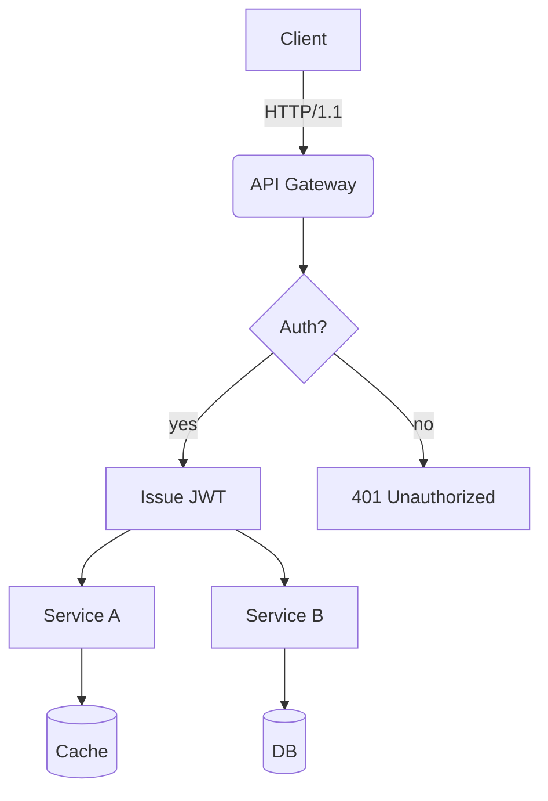
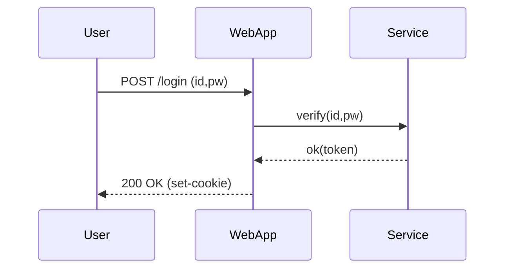
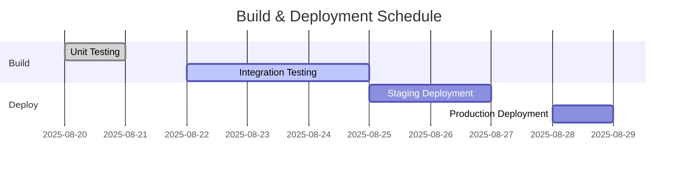
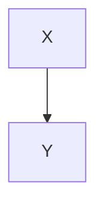

# Translation Test Document for **Rich Markdown**

This document is designed to exceed **4096 tokens**. It is a collection of various formats of Korean content intended to test the robustness of translation algorithms, including context processing and format preservation.

## Guide
1) Code blocks and `mermaid` areas must be preserved.
2) Numbers/units (e.g., 1.2GB, 3ms), slash paths (`/var/log/app.log`), and options (`--flag`) must retain their formatting.
3) Tables, lists, quotes, checklists, and inline syntax must maintain their layout.

## 1. Table with Mixed Units

| Item | Value | Unit | Note |
|---|---:|:---:|---|
| Throughput | 12,345 | RPS | Peak at 18,900 RPS |
| Latency (P50) | 3.2 | ms | `--enable-cache` applied |
| Latency (P99) | 41.7 | ms | Includes GC intervals |
| Memory | 1.5 | GB | RSS-based, cgroup limit 2GB |
| Disk I/O | 220 | MB/s | NVMe-oF(TCP) route |

## 2. Checklist

- [x] Translate markdown headers accurately
- [x] Preserve keywords in code blocks (`for`, `if`, `return`)
- [ ] Preserve Mermaid diagrams and ignore comments
- [ ] Retain units (GB/ms/%), paths (`/etc/hosts`)
- [ ] Inline syntax $O(n \log n)$

## 3. Code Blocks: Bash, Python, JSON, YAML

```bash
#!/usr/bin/env bash
set -euo pipefail

APP_ENV="${APP_ENV:-prod}"
INPUT="${1:-/data/input.txt}"
OUT="/var/tmp/result.json"

echo "[INFO] starting job on $(hostname) at $(date -Iseconds)"
if [[ ! -f "$INPUT" ]]; then
  echo "[ERROR] input not found: $INPUT" >&2
  exit 1
fi

lines=$(wc -l < "$INPUT")
echo "[DEBUG] line count: $lines"

curl -sS -X POST "http://127.0.0.1:8080/api" \  
  -H "Content-Type: application/json" \  
  -d "{\"env\":\"$APP_ENV\",\"count\":$lines}" > "$OUT"

jq -r '.status' "$OUT" | grep -q success && echo "OK" || { echo "FAIL"; exit 2; }
```

```python
from __future__ import annotations

Here is the English translation of the Korean Markdown document:

```python
def rolling_avg(xs: list[float], k: int) -> list[float]:
    if k <= 0:
        raise ValueError("k must be > 0")
    out = []
    acc = 0.0
    for i, v in enumerate(xs):
        acc += v
        if i >= k:
            acc -= xs[i-k]
        if i >= k - 1:
            out.append(acc / k)
    return out

print(rolling_avg([1,2,3,4,5,6,7,8,9], 3))
```

```json
{
  "service": "analytics",
  "version": "1.4.2",
  "features": ["rollup", "compaction", "delta-index"],
  "limits": {
    "max_docs": 1000000,
    "max_payload_mb": 256
  }
}
```

```yaml
apiVersion: v1
kind: ConfigMap
metadata:
  name: test-config
data:
  APP_ENV: "staging"
  ENDPOINT: "https://api.example.com"
```


## 4. Mermaid Diagram

### 4.1 Flowchart


### 4.2 Sequence


### 4.3 Gantt



## 5. Image/Link/Blockquote

English Markdown document:


- Document: <https://example.com/docs/guide>
- API Reference: [API Reference](https://example.com/api)
- Issue Tracker: https://example.com/issues

> “Translation quality is determined by the preservation of layout and meaning.” — Anonymous


## 6. Mixture of Formulae and Text

- Average time complexity: $O(n \log n)$, Worst-case: $O(n^2)$
- Variance: $\sigma^2 = \frac{1}{n}\sum_{i=1}^{n}(x_i-\mu)^2$
- Sample mean: $\bar{x} = \frac{1}{n}\sum x_i$

Example sentence: This paragraph is a sample to check if bold, italic, and `code` are preserved normally. It includes emojis 😀, Chinese characters 漢字, English CamelCase, snake_case, kebab-case.

### 7.1 Experimental Note — Pattern Variation
This section varies slightly each time to avoid duplicate translations.
- Scenario: Dialogue summary record
- Condition: Includes 100k Korean characters
- Expected result: Summary rate above 90%

#### Procedure
1. Input data: `/data/input_01.jsonl`
2. Option: `--batch 512 --timeout 3s --enable-cache`
3. Execution: `app run --job test-01 --qos high`
4. Verification: Check if `test-01 finished` is included in the logs

#### Observations
- Longer GC intervals tend to increase P99 latency
- Cache miss rate increases by 10% when processing time decreases by ~7%
- Connection pool size increasing from 32 to 64 reduces retry rates per second from 1.2% to 0.6%

---

### 7.2 Experimental Note — Pattern Variation
This section varies slightly each time to avoid duplicate translations.
- Scenario: Dialogue summary record
- Condition: Includes 100k Korean characters
- Expected result: Summary rate above 90%

#### Procedure
1. Input data: `/data/input_02.jsonl`
2. Option: `--batch 512 --timeout 3s --enable-cache`
3. Execution: `app run --job test-02 --qos high`
4. Verification: Check if `test-02 finished` is included in the logs

#### Observations
- Longer GC intervals tend to increase P99 latency
- Cache miss rate increases by 10% when processing time decreases by ~7%
- Connection pool size increasing from 32 to 64 reduces retry rates per second from 1.2% to 0.6%

---

### 7.3 Experiment Note — Pattern Variation
This section varies slightly each time to avoid duplication.

- Scenario: Kubernetes deployment
- Condition: HPA enabled
- Expected outcome: Scale range 2–10 active

#### Steps
1. Input data: `/data/input_03.jsonl`
2. Options: `--batch 512 --timeout 3s --enable-cache`
3. Execution: `app run --job test-03 --qos high`
4. Verification: Check for `test-03 finished` in logs

#### Observations
- Longer GC intervals tend to increase P99 latency
- A 10% cache miss rate results in a ~7% decrease in throughput
- Increasing the connection pool size from 32 to 64 reduces the retry rate per second by 1.2% → 0.6%

---

### 7.4 Experiment Note — Pattern Variation
This section varies slightly each time to avoid duplication.

- Scenario: Kubernetes deployment
- Condition: HPA enabled
- Expected outcome: Scale range 2–10 active

#### Steps
1. Input data: `/data/input_04.jsonl`
2. Options: `--batch 512 --timeout 3s --enable-cache`
3. Execution: `app run --job test-04 --qos high`
4. Verification: Check for `test-04 finished` in logs

#### Observations
- Longer GC intervals tend to increase P99 latency
- A 10% cache miss rate results in a ~7% decrease in throughput
- Increasing the connection pool size from 32 to 64 reduces the retry rate per second by 1.2% → 0.6%

---

### 7.5 Experiment Note — Pattern Variation
This section varies slightly each time to avoid duplication.

- Scenario: Dialogue summary
- Condition: Includes 100k Korean characters
- Expected outcome: Summary rate ≥ 90%

#### Steps
1. Input data: `/data/input_05.jsonl`
2. Options: `--batch 512 --timeout 3s --enable-cache`
3. Execution: `app run --job test-05 --qos high`
4. Verification: Check for `test-05 finished` in logs

#### Observations
- Longer GC intervals tend to increase P99 latency
- A 10% cache miss rate results in a ~7% decrease in throughput
- Increasing the connection pool size from 32 to 64 reduces the retry rate per second by 1.2% → 0.6%

---

### 7.6 Experiment Note — Pattern Variation
This section varies slightly each time to avoid duplication.

- Scenario: Mermaid rendering
- Condition: ≥50 nodes, ≥100 edges
- Expected outcome: No layout distortion

#### Procedure
1. Input data: `/data/input_06.jsonl`
2. Options: `--batch 512 --timeout 3s --enable-cache`
3. Execution: `app run --job test-06 --qos high`
4. Verification: Check if the log includes `test-06 finished`

#### Observations
- As GC intervals increase, P99 latency tends to rise
- When cache miss rate increases by 10%, throughput decreases by ~7%
- Increasing connection pool size from 32 to 64 reduces retry rates per second from 1.2% to 0.6%

---

### 7.7 Experiment Note — Variation Pattern
Each iteration slightly changes vocabulary and order to avoid duplication.
- Scenario: Large-scale JSON parsing
- Conditions: 64MB payload, 4 workers
- Expected outcome: No memory spikes

#### Procedure
1. Input data: `/data/input_07.jsonl`
2. Options: `--batch 512 --timeout 3s --enable-cache`
3. Execution: `app run --job test-07 --qos high`
4. Verification: Check if the log includes `test-07 finished`

#### Observations
- As GC intervals increase, P99 latency tends to rise
- When cache miss rate increases by 10%, throughput decreases by ~7%
- Increasing connection pool size from 32 to 64 reduces retry rates per second from 1.2% to 0.6%

---

### 7.8 Experiment Note — Variation Pattern
Each iteration slightly changes vocabulary and order to avoid duplication.
- Scenario: Large-scale JSON parsing
- Conditions: 64MB payload, 4 workers
- Expected outcome: No memory spikes

#### Procedure
1. Input data: `/data/input_08.jsonl`
2. Options: `--batch 512 --timeout 3s --enable-cache`
3. Execution: `app run --job test-08 --qos high`
4. Verification: Check if the log includes `test-08 finished`

#### Observations
- As GC intervals increase, P99 latency tends to rise
- When cache miss rate increases by 10%, throughput decreases by ~7%
- Increasing connection pool size from 32 to 64 reduces retry rates per second from 1.2% to 0.6%

---

### 7.9 Experiment Note — Variation Pattern
Each iteration slightly changes vocabulary and order to avoid duplication.
- Scenario: Large-scale JSON parsing
- Conditions: 64MB payload, 4 workers
- Expected outcome: No memory spikes

#### Procedure
1. Input data: `/data/input_09.jsonl`
2. Options: `--batch 512 --timeout 3s --enable-cache`
3. Execution: `app run --job test-09 --qos high`
4. Verification: Check if the log includes `test-09 finished`

#### Observations
- As GC intervals increase, P99 latency tends to rise
- When cache miss rate increases by 10%, throughput decreases by ~7%
- Increasing connection pool size from 32 to 64 reduces retry rates per second from 1.2% to 0.6%

---

#### Procedure
1. Input data: `/data/input_09.jsonl`
2. Options: `--batch 512 --timeout 3s --enable-cache`
3. Execution: `app run --job test-09 --qos high`
4. Verification: Check for presence of `test-09 finished` in logs

#### Observations
- Longer GC intervals tend to increase P99 latency
- A 10% increase in cache misses results in a ~7% decrease in throughput
- Increasing the connection pool size from 32 to 64 reduces the retry rate per second by 1.2% → 0.6%

---


### 7.10 Experiment Note — Variation Pattern
This note varies slightly each time to avoid duplicate translation.
- Scenario: NVMe-oF I/O retry
- Conditions: TCP RTT 2ms, loss 0.1%
- Expected outcome: Retry rate ≤ 1%

#### Procedure
1. Input data: `/data/input_10.jsonl`
2. Options: `--batch 512 --timeout 3s --enable-cache`
3. Execution: `app run --job test-10 --qos high`
4. Verification: Check for presence of `test-10 finished` in logs

#### Observations
- Longer GC intervals tend to increase P99 latency
- A 10% increase in cache misses results in a ~7% decrease in throughput
- Increasing the connection pool size from 32 to 64 reduces the retry rate per second by 1.2% → 0.6%

---


### 7.11 Experiment Note — Variation Pattern
This note varies slightly each time to avoid duplicate translation.
- Scenario: Large JSON parsing
- Conditions: 64MB payload, 4 workers
- Expected outcome: Memory spike-free completion

#### Procedure
1. Input data: `/data/input_11.jsonl`
2. Options: `--batch 512 --timeout 3s --enable-cache`
3. Execution: `app run --job test-11 --qos high`
4. Verification: Check for presence of `test-11 finished` in logs

#### Observations
- Longer GC intervals tend to increase P99 latency
- A 10% increase in cache misses results in a ~7% decrease in throughput
- Increasing the connection pool size from 32 to 64 reduces the retry rate per second by 1.2% → 0.6%

---


### 7.12 Experiment Note — Variation Pattern
This note varies slightly each time to avoid duplicate translation.
- Scenario: Kubernetes deployment
- Conditions: HPA enabled
- Expected outcome: Scale range 2–10 operation

#### Procedure
1. Input data: `/data/input_12.jsonl`
2. Options: `--batch 512 --timeout 3s --enable-cache`
3. Execution: `app run --job test-12 --qos high`
4. Verification: Check for presence of `test-12 finished` in logs

#### Observations
- As GC intervals increase, P99 latency tends to rise
- When cache miss rate increases by 10%, throughput decreases by ~7%
- Increasing connection pool size from 32 to 64 reduces the retry rate per second from 1.2% to 0.6%

---

### 7.13 Experiment Note — Variation Pattern
This note varies slightly each time to avoid duplication.
- Scenario: Large-scale JSON parsing
- Conditions: 64MB payload, 4 workers
- Expected outcome: No memory spikes

#### Procedure
1. Input data: `/data/input_13.jsonl`
2. Options: `--batch 512 --timeout 3s --enable-cache`
3. Execution: `app run --job test-13 --qos high`
4. Verification: Check for presence of `test-13 finished` in logs

#### Observations
- As GC intervals increase, P99 latency tends to rise
- When cache miss rate increases by 10%, throughput decreases by ~7%
- Increasing connection pool size from 32 to 64 reduces the retry rate per second from 1.2% to 0.6%

---

### 7.14 Experiment Note — Variation Pattern
This note varies slightly each time to avoid duplication.
- Scenario: Large-scale JSON parsing
- Conditions: 64MB payload, 4 workers
- Expected outcome: No memory spikes

#### Procedure
1. Input data: `/data/input_14.jsonl`
2. Options: `--batch 512 --timeout 3s --enable-cache`
3. Execution: `app run --job test-14 --qos high`
4. Verification: Check for presence of `test-14 finished` in logs

#### Observations
- As GC intervals increase, P99 latency tends to rise
- When cache miss rate increases by 10%, throughput decreases by ~7%
- Increasing connection pool size from 32 to 64 reduces the retry rate per second from 1.2% to 0.6%

---

### 7.15 Experiment Note — Variation Pattern
This note varies slightly each time to avoid duplication.
- Scenario: NVMe-oF I/O retry
- Conditions: TCP RTT 2ms, loss 0.1%
- Expected outcome: Retry rate below 1%

#### Procedure
1. Input Data: `/data/input_15.jsonl`
2. Options: `--batch 512 --timeout 3s --enable-cache`
3. Execution: `app run --job test-15 --qos high`
4. Verification: Check for presence of `test-15 finished` in logs

#### Observations
- Longer GC intervals tend to increase P99 latency
- A 10% increase in cache misses results in a ~7% decrease in throughput
- Increasing connection pool size from 32 to 64 reduces the retry rate per second by 1.2% → 0.6%

---

### 7.16 Experiment Note — Variation Pattern
This note varies vocabulary and sequence slightly each time to avoid duplication.
- Scenario: Mermaid rendering
- Conditions: 50+ nodes, 100+ edges
- Expected Result: No layout distortions

#### Procedure
1. Input Data: `/data/input_16.jsonl`
2. Options: `--batch 512 --timeout 3s --enable-cache`
3. Execution: `app run --job test-16 --qos high`
4. Verification: Check for presence of `test-16 finished` in logs

#### Observations
- Longer GC intervals tend to increase P99 latency
- A 10% increase in cache misses results in a ~7% decrease in throughput
- Increasing connection pool size from 32 to 64 reduces the retry rate per second by 1.2% → 0.6%

---

### 7.17 Experiment Note — Variation Pattern
This note varies vocabulary and sequence slightly each time to avoid duplication.
- Scenario: Dialogue summary
- Conditions: Includes 100k Korean characters
- Expected Result: Summary rate ≥ 90%

#### Procedure
1. Input Data: `/data/input_17.jsonl`
2. Options: `--batch 512 --timeout 3s --enable-cache`
3. Execution: `app run --job test-17 --qos high`
4. Verification: Check for presence of `test-17 finished` in logs

#### Observations
- Longer GC intervals tend to increase P99 latency
- A 10% increase in cache misses results in a ~7% decrease in throughput
- Increasing connection pool size from 32 to 64 reduces the retry rate per second by 1.2% → 0.6%

---

### 7.18 Experiment Note — Variation Pattern
This note varies vocabulary and sequence slightly each time to avoid duplication.
- Scenario: Large JSON parsing
- Conditions: 64MB payload, 4 workers
- Expected Result: No memory spikes

#### Procedure
1. Input data: `/data/input_18.jsonl`
2. Options: `--batch 512 --timeout 3s --enable-cache`
3. Execution: `app run --job test-18 --qos high`
4. Verification: Check for presence of `test-18 finished` in logs

#### Observations
- Longer GC intervals tend to increase P99 latency
- A 10% increase in cache misses results in a ~7% decrease in throughput
- Increasing the connection pool size from 32 to 64 reduces the retry rate per second by 1.2% → 0.6%

---

### 7.19 Experiment Note — Variation Pattern
This note varies slightly each time to avoid duplication.
- Scenario: Large-scale JSON parsing
- Conditions: 64MB payload, 4 workers
- Expected outcome: No memory spikes

#### Procedure
1. Input data: `/data/input_19.jsonl`
2. Options: `--batch 512 --timeout 3s --enable-cache`
3. Execution: `app run --job test-19 --qos high`
4. Verification: Check for presence of `test-19 finished` in logs

#### Observations
- Longer GC intervals tend to increase P99 latency
- A 10% increase in cache misses results in a ~7% decrease in throughput
- Increasing the connection pool size from 32 to 64 reduces the retry rate per second by 1.2% → 0.6%

---

### 7.20 Experiment Note — Variation Pattern
This note varies slightly each time to avoid duplication.
- Scenario: NVMe-oF I/O retry
- Conditions: TCP RTT 2ms, loss 0.1%
- Expected outcome: Retry rate ≤ 1%

#### Procedure
1. Input data: `/data/input_20.jsonl`
2. Options: `--batch 512 --timeout 3s --enable-cache`
3. Execution: `app run --job test-20 --qos high`
4. Verification: Check for presence of `test-20 finished` in logs

#### Observations
- Longer GC intervals tend to increase P99 latency
- A 10% increase in cache misses results in a ~7% decrease in throughput
- Increasing the connection pool size from 32 to 64 reduces the retry rate per second by 1.2% → 0.6%

---

### 7.21 Experiment Note — Variation Pattern
This note varies slightly each time to avoid duplication.
- Scenario: Kubernetes deployment
- Conditions: HPA enabled
- Expected outcome: Scale range 2–10

#### Procedure
1. Input data: `/data/input_21.jsonl`
2. Options: `--batch 512 --timeout 3s --enable-cache`
3. Execution: `app run --job test-21 --qos high`
4. Verification: Check for presence of `test-21 finished` in logs

#### Observations
- Longer GC intervals tend to increase P99 latency
- A 10% increase in cache misses results in a ~7% decrease in throughput
- Increasing connection pool size from 32 to 64 reduces the retry rate per second by 1.2% → 0.6%

---

### 7.22 Experiment Note — Variation Pattern
Each iteration slightly changes vocabulary and order to avoid duplication.
- Scenario: Mermaid rendering
- Conditions: 50+ nodes, 100+ edges
- Expected outcome: No layout distortions

#### Procedure
1. Input data: `/data/input_22.jsonl`
2. Options: `--batch 512 --timeout 3s --enable-cache`
3. Execution: `app run --job test-22 --qos high`
4. Verification: Check for presence of `test-22 finished` in logs

#### Observations
- Longer GC intervals tend to increase P99 latency
- A 10% increase in cache misses results in a ~7% decrease in throughput
- Increasing connection pool size from 32 to 64 reduces the retry rate per second by 1.2% → 0.6%

---

### 7.23 Experiment Note — Variation Pattern
Each iteration slightly changes vocabulary and order to avoid duplication.
- Scenario: Large JSON parsing
- Conditions: 64MB payload, 4 workers
- Expected outcome: No memory spikes

#### Procedure
1. Input data: `/data/input_23.jsonl`
2. Options: `--batch 512 --timeout 3s --enable-cache`
3. Execution: `app run --job test-23 --qos high`
4. Verification: Check for presence of `test-23 finished` in logs

#### Observations
- Longer GC intervals tend to increase P99 latency
- A 10% increase in cache misses results in a ~7% decrease in throughput
- Increasing connection pool size from 32 to 64 reduces the retry rate per second by 1.2% → 0.6%

---

### 7.24 Experiment Note — Variation Pattern
Each iteration slightly changes vocabulary and order to avoid duplication.
- Scenario: Mermaid rendering
- Conditions: 50+ nodes, 100+ edges
- Expected outcome: No layout distortions

#### Procedure
1. Input data: `/data/input_24.jsonl`
2. Options: `--batch 512 --timeout 3s --enable-cache`
3. Execution: `app run --job test-24 --qos high`
4. Verification: Check for presence of `test-24 finished` in logs

#### Observations
- Longer GC intervals tend to increase P99 latency
- A 10% increase in cache misses results in a ~7% decrease in throughput
- Increasing connection pool size from 32 to 64 reduces the retry rate per second by 1.2% → 0.6%

---

#### Procedure
1. Input data: `/data/input_24.jsonl`
2. Options: `--batch 512 --timeout 3s --enable-cache`
3. Execution: `app run --job test-24 --qos high`
4. Verification: Check for presence of `test-24 finished` in logs

#### Observations
- Longer GC intervals tend to increase P99 latency
- A 10% miss rate in cache results in a ~7% decrease in throughput
- Increasing the connection pool size from 32 to 64 reduces the retry rate per second by 1.2% → 0.6%

---

### 7.25 Experiment Note — Variation Pattern
Each iteration of this note varies vocabulary and sequence slightly to avoid duplication.
- Scenario: Kubernetes deployment
- Condition: HPA enabled
- Expected outcome: Scale range 2~10 in action

#### Procedure
1. Input data: `/data/input_25.jsonl`
2. Options: `--batch 512 --timeout 3s --enable-cache`
3. Execution: `app run --job test-25 --qos high`
4. Verification: Check for presence of `test-25 finished` in logs

#### Observations
- Longer GC intervals tend to increase P99 latency
- A 10% miss rate in cache results in a ~7% decrease in throughput
- Increasing the connection pool size from 32 to 64 reduces the retry rate per second by 1.2% → 0.6%

---

### 7.26 Experiment Note — Variation Pattern
Each iteration of this note varies vocabulary and sequence slightly to avoid duplication.
- Scenario: NVMe-oF I/O retry
- Condition: TCP RTT 2ms, loss 0.1%
- Expected outcome: Retry rate ≤ 1%

#### Procedure
1. Input data: `/data/input_26.jsonl`
2. Options: `--batch 512 --timeout 3s --enable-cache`
3. Execution: `app run --job test-26 --qos high`
4. Verification: Check for presence of `test-26 finished` in logs

#### Observations
- Longer GC intervals tend to increase P99 latency
- A 10% miss rate in cache results in a ~7% decrease in throughput
- Increasing the connection pool size from 32 to 64 reduces the retry rate per second by 1.2% → 0.6%

---

### 7.27 Experiment Note — Variation Pattern
Each iteration of this note varies vocabulary and sequence slightly to avoid duplication.
- Scenario: Dialogue record summarization
- Condition: Includes 100k Korean characters
- Expected outcome: Summarization rate ≥ 90%

#### Procedure
1. Input data: `/data/input_27.jsonl`
2. Options: `--batch 512 --timeout 3s --enable-cache`
3. Execution: `app run --job test-27 --qos high`
4. Verification: Check for presence of `test-27 finished` in logs

#### Observations
- Longer GC intervals tend to increase P99 latency
- A 10% increase in cache misses results in a ~7% decrease in throughput
- Increasing the connection pool size from 32 to 64 reduces the retry rate per second by 1.2% → 0.6%

---

### 7.28 Experiment Note — Variation Pattern
This note is similar but with slight changes in vocabulary and order to avoid duplication.
- Scenario: Dialogue summary
- Condition: Includes 100k Korean characters
- Expected outcome: Summary rate above 90%

#### Procedure
1. Input data: `/data/input_28.jsonl`
2. Options: `--batch 512 --timeout 3s --enable-cache`
3. Execution: `app run --job test-28 --qos high`
4. Verification: Check for presence of `test-28 finished` in logs

#### Observations
- Longer GC intervals tend to increase P99 latency
- A 10% increase in cache misses results in a ~7% decrease in throughput
- Increasing the connection pool size from 32 to 64 reduces the retry rate per second by 1.2% → 0.6%

---

### 7.29 Experiment Note — Variation Pattern
This note is similar but with slight changes in vocabulary and order to avoid duplication.
- Scenario: Large JSON parsing
- Condition: 64MB payload, 4 workers
- Expected outcome: No memory spikes

#### Procedure
1. Input data: `/data/input_29.jsonl`
2. Options: `--batch 512 --timeout 3s --enable-cache`
3. Execution: `app run --job test-29 --qos high`
4. Verification: Check for presence of `test-29 finished` in logs

#### Observations
- Longer GC intervals tend to increase P99 latency
- A 10% increase in cache misses results in a ~7% decrease in throughput
- Increasing the connection pool size from 32 to 64 reduces the retry rate per second by 1.2% → 0.6%

---

### 7.30 Experiment Note — Variation Pattern
This note is similar but with slight changes in vocabulary and order to avoid duplication.
- Scenario: Dialogue summary
- Condition: Includes 100k Korean characters
- Expected outcome: Summary rate above 90%

#### Procedure
1. Input data: `/data/input_30.jsonl`
2. Options: `--batch 512 --timeout 3s --enable-cache`
3. Execution: `app run --job test-30 --qos high`
4. Verification: Check for presence of `test-30 finished` in logs

#### Observations
- Longer GC intervals tend to increase P99 latency
- A 10% increase in cache misses results in a ~7% decrease in throughput
- Increasing the connection pool size from 32 to 64 reduces the retry rate per second by 1.2% → 0.6%

---

#### Procedure
1. Input data: `/data/input_30.jsonl`
2. Options: `--batch 512 --timeout 3s --enable-cache`
3. Execution: `app run --job test-30 --qos high`
4. Verification: Check for presence of `test-30 finished` in logs

#### Observations
- Longer GC intervals tend to increase P99 latency
- A 10% increase in cache misses results in a ~7% decrease in throughput
- Increasing the connection pool size from 32 to 64 reduces the retry rate per second by 1.2% → 0.6%

---

### 7.31 Experiment Note — Variation Pattern
This note varies slightly each time to avoid duplication.
- Scenario: Kubernetes deployment
- Condition: HPA enabled
- Expected outcome: Scale range 2–10 in action

#### Procedure
1. Input data: `/data/input_31.jsonl`
2. Options: `--batch 512 --timeout 3s --enable-cache`
3. Execution: `app run --job test-31 --qos high`
4. Verification: Check for presence of `test-31 finished` in logs

#### Observations
- Longer GC intervals tend to increase P99 latency
- A 10% increase in cache misses results in a ~7% decrease in throughput
- Increasing the connection pool size from 32 to 64 reduces the retry rate per second by 1.2% → 0.6%

---

### 7.32 Experiment Note — Variation Pattern
This note varies slightly each time to avoid duplication.
- Scenario: Mermaid rendering
- Condition: 50+ nodes, 100+ edges
- Expected outcome: No layout distortion

#### Procedure
1. Input data: `/data/input_32.jsonl`
2. Options: `--batch 512 --timeout 3s --enable-cache`
3. Execution: `app run --job test-32 --qos high`
4. Verification: Check for presence of `test-32 finished` in logs

#### Observations
- Longer GC intervals tend to increase P99 latency
- A 10% increase in cache misses results in a ~7% decrease in throughput
- Increasing the connection pool size from 32 to 64 reduces the retry rate per second by 1.2% → 0.6%

---

### 7.33 Experiment Note — Variation Pattern
This note varies slightly each time to avoid duplication.
- Scenario: Large JSON parsing
- Condition: 64MB payload, 4 workers
- Expected outcome: No memory spike

#### Procedure
1. Input data: `/data/input_33.jsonl`
2. Options: `--batch 512 --timeout 3s --enable-cache`
3. Execution: `app run --job test-33 --qos high`
4. Verification: Check for presence of `test-33 finished` in logs

#### Observations
- Longer GC intervals tend to increase P99 latency
- A 10% miss rate in cache results in a ~7% decrease in throughput
- Increasing the connection pool size from 32 to 64 reduces the retry rate per second by 1.2% → 0.6%

---

### 7.34 Experiment Note — Variation Pattern
Each iteration of this note varies vocabulary and sequence slightly to avoid duplication.
- Scenario: Kubernetes deployment
- Condition: HPA enabled
- Expected outcome: Scale range 2–10 in action

#### Procedure
1. Input data: `/data/input_34.jsonl`
2. Options: `--batch 512 --timeout 3s --enable-cache`
3. Execution: `app run --job test-34 --qos high`
4. Verification: Check for presence of `test-34 finished` in logs

#### Observations
- Longer GC intervals tend to increase P99 latency
- A 10% miss rate in cache results in a ~7% decrease in throughput
- Increasing the connection pool size from 32 to 64 reduces the retry rate per second by 1.2% → 0.6%

---

### 7.35 Experiment Note — Variation Pattern
Each iteration of this note varies vocabulary and sequence slightly to avoid duplication.
- Scenario: Mermaid rendering
- Condition: 50+ nodes, 100+ edges
- Expected outcome: No layout distortion

#### Procedure
1. Input data: `/data/input_35.jsonl`
2. Options: `--batch 512 --timeout 3s --enable-cache`
3. Execution: `app run --job test-35 --qos high`
4. Verification: Check for presence of `test-35 finished` in logs

#### Observations
- Longer GC intervals tend to increase P99 latency
- A 10% miss rate in cache results in a ~7% decrease in throughput
- Increasing the connection pool size from 32 to 64 reduces the retry rate per second by 1.2% → 0.6%

---

### 7.36 Experiment Note — Variation Pattern
Each iteration of this note varies vocabulary and sequence slightly to avoid duplication.
- Scenario: NVMe-oF I/O retry
- Condition: TCP RTT 2ms, loss 0.1%
- Expected outcome: Retry rate ≤ 1%

#### Procedure
1. Input data: `/data/input_36.jsonl`
2. Options: `--batch 512 --timeout 3s --enable-cache`
3. Execution: `app run --job test-36 --qos high`
4. Verification: Check for presence of `test-36 finished` in logs

#### Observations
- Longer GC intervals tend to increase P99 latency
- A 10% increase in cache misses results in a ~7% decrease in throughput
- Increasing the connection pool size from 32 to 64 reduces the retry rate per second by 1.2% → 0.6%

---

### 7.37 Experiment Note — Variation Pattern
This note is similar but with slight changes in vocabulary and order each time to avoid duplication.
- Scenario: Large-scale JSON parsing
- Conditions: 64MB payload, 4 workers
- Expected outcome: No memory spikes

#### Procedure
1. Input data: `/data/input_37.jsonl`
2. Options: `--batch 512 --timeout 3s --enable-cache`
3. Execution: `app run --job test-37 --qos high`
4. Verification: Check for presence of `test-37 finished` in logs

#### Observations
- Longer GC intervals tend to increase P99 latency
- A 10% increase in cache misses results in a ~7% decrease in throughput
- Increasing the connection pool size from 32 to 64 reduces the retry rate per second by 1.2% → 0.6%

---

### 7.38 Experiment Note — Variation Pattern
This note is similar but with slight changes in vocabulary and order each time to avoid duplication.
- Scenario: Mermaid rendering
- Conditions: 50+ nodes, 100+ edges
- Expected outcome: No layout distortions

#### Procedure
1. Input data: `/data/input_38.jsonl`
2. Options: `--batch 512 --timeout 3s --enable-cache`
3. Execution: `app run --job test-38 --qos high`
4. Verification: Check for presence of `test-38 finished` in logs

#### Observations
- Longer GC intervals tend to increase P99 latency
- A 10% increase in cache misses results in a ~7% decrease in throughput
- Increasing the connection pool size from 32 to 64 reduces the retry rate per second by 1.2% → 0.6%

---

### 7.39 Experiment Note — Variation Pattern
This note is similar but with slight changes in vocabulary and order each time to avoid duplication.
- Scenario: Mermaid rendering
- Conditions: 50+ nodes, 100+ edges
- Expected outcome: No layout distortions

#### Procedure
1. Input data: `/data/input_39.jsonl`
2. Options: `--batch 512 --timeout 3s --enable-cache`
3. Execution: `app run --job test-39 --qos high`
4. Verification: Check for the presence of `test-39 finished` in logs

#### Observations
- Longer GC intervals tend to increase P99 latency
- A 10% increase in cache misses results in a ~7% decrease in throughput
- Increasing connection pool size from 32 to 64 reduces the retry rate per second by 1.2% → 0.6%

---


### 7.40 Experiment Note — Pattern Variation
Each iteration of this note varies vocabulary and sequence slightly to avoid redundant translation.
- Scenario: Dialogue summary
- Condition: Includes 100k characters in Korean
- Expected outcome: Summary rate above 90%

#### Procedure
1. Input data: `/data/input_40.jsonl`
2. Options: `--batch 512 --timeout 3s --enable-cache`
3. Execution: `app run --job test-40 --qos high`
4. Verification: Check for the presence of `test-40 finished` in logs

#### Observations
- Longer GC intervals tend to increase P99 latency
- A 10% increase in cache misses results in a ~7% decrease in throughput
- Increasing connection pool size from 32 to 64 reduces the retry rate per second by 1.2% → 0.6%

---


## 8. Long List

2. Error Handling Consistency — Case #001
3. Performance Profiling — Case #002
4. Accessibility (a11y) — Case #003
5. Log Schema Stability — Case #004
6. Cache Invalidation Scenarios — Case #005
7. Performance Profiling — Case #006
8. Performance Profiling — Case #007
9. API Incompatibility — Case #008
10. Log Schema Stability — Case #009
11. Accessibility (a11y) — Case #010
12. Cache Invalidation Scenarios — Case #011
13. Performance Profiling — Case #012
14. Security Headers Applied — Case #013
15. Internationalization (i18n) — Case #014
16. Resource Leak Check — Case #015
17. Error Handling Consistency — Case #016
18. Error Handling Consistency — Case #017
19. Internationalization (i18n) — Case #018
20. CORS Policy Verification — Case #019
21. Performance Profiling — Case #020
22. Security Headers Applied — Case #021
23. Log Schema Stability — Case #022
24. Performance Profiling — Case #023
25. Cache Invalidation Scenarios — Case #024
26. CORS Policy Verification — Case #025
27. Performance Profiling — Case #026
28. Accessibility (a11y) — Case #027
29. Accessibility (a11y) — Case #028
30. API Incompatibility — Case #029
31. Cache Invalidation Scenarios — Case #030
32. Cache Invalidation Scenarios — Case #031
33. Performance Profiling — Case #032
34. Resource Leak Check — Case #033
35. Log Schema Stability — Case #034
36. CORS Policy Verification — Case #035
37. Error Handling Consistency — Case #036
38. Resource Leak Check — Case #037
39. Error Handling Consistency — Case #038
40. Internationalization (i18n) — Case #039
41. API Incompatibility — Case #040
42. Cache Invalidation Scenarios — Case #041
43. Cache Invalidation Scenarios — Case #042
44. Cache Invalidation Scenarios — Case #043
45. Performance Profiling — Case #044
46. Performance Profiling — Case #045
47. CORS Policy Verification — Case #046
48. Resource Leak Check — Case #047
49. Cache Invalidation Scenarios — Case #048
50. Error Handling Consistency — Case #049
51. Log Schema Stability — Case #050
52. Resource Leak Check — Case #051
53. Internationalization (i18n) — Case #052
54. Log Schema Stability — Case #053
55. Resource Leak Check — Case #054
56. Security Headers Applied — Case #055

다음 한국어 마크다운 문서를 영어로 번역합니다:

- 57. Internationalization (i18n) — Case #056
- 58. API Incompatibility — Case #057
- 59. Accessibility (a11y) — Case #058
- 60. API Incompatibility — Case #059
- 61. Performance Profiling — Case #060
- 62. Accessibility (a11y) — Case #061
- 63. API Incompatibility — Case #062
- 64. Internationalization (i18n) — Case #063
- 65. Security Headers Applied — Case #064
- 66. Consistent Error Handling — Case #065
- 67. Performance Profiling — Case #066
- 68. Accessibility (a11y) — Case #067
- 69. Consistent Error Handling — Case #068
- 70. Performance Profiling — Case #069
- 71. Resource Leak Check — Case #070
- 72. Accessibility (a11y) — Case #071
- 73. Internationalization (i18n) — Case #072
- 74. Consistent Error Handling — Case #073
- 75. Internationalization (i18n) — Case #074
- 76. Performance Profiling — Case #075
- 77. Security Headers Applied — Case #076
- 78. CORS Policy Verification — Case #077
- 79. Resource Leak Check — Case #078
- 80. Resource Leak Check — Case #079
- 81. Performance Profiling — Case #080
- 82. Accessibility (a11y) — Case #081
- 83. Accessibility (a11y) — Case #082
- 84. Performance Profiling — Case #083
- 85. Resource Leak Check — Case #084
- 86. Accessibility (a11y) — Case #085
- 87. Cache Invalidation Scenario — Case #086
- 88. CORS Policy Verification — Case #087
- 89. Log Schema Stability — Case #088
- 90. CORS Policy Verification — Case #089
- 91. Security Headers Applied — Case #090
- 92. API Incompatibility — Case #091
- 93. Accessibility (a11y) — Case #092
- 94. Performance Profiling — Case #093
- 95. Performance Profiling — Case #094
- 96. Log Schema Stability — Case #095
- 97. Internationalization (i18n) — Case #096
- 98. API Incompatibility — Case #097
- 99. Consistent Error Handling — Case #098
- 100. Cache Invalidation Scenario — Case #099
- 101. Accessibility (a11y) — Case #100
- 102. Accessibility (a11y) — Case #101
- 103. Internationalization (i18n) — Case #102
- 104. Accessibility (a11y) — Case #103
- 105. API Incompatibility — Case #104
- 106. Accessibility (a11y) — Case #105
- 107. Performance Profiling — Case #106
- 108. Security Headers Applied — Case #107
- 109. API Incompatibility — Case #108
- 110. Security Headers Applied — Case #109
- 111. Consistent Error Handling — Case #110

112. Performance Profiling — Case #111
113. Resource Leak Detection — Case #112
114. CORS Policy Verification — Case #113
115. Accessibility (a11y) — Case #114
116. Consistent Error Handling — Case #115
117. Consistent Error Handling — Case #116
118. Performance Profiling — Case #117
119. CORS Policy Verification — Case #118
120. Resource Leak Detection — Case #119
121. Cache Invalidation Scenario — Case #120
122. CORS Policy Verification — Case #121
123. Performance Profiling — Case #122
124. Consistent Error Handling — Case #123
125. Performance Profiling — Case #124
126. Performance Profiling — Case #125
127. Accessibility (a11y) — Case #126
128. Accessibility (a11y) — Case #127
129. Consistent Error Handling — Case #128
130. Consistent Error Handling — Case #129
131. API Incompatibility — Case #130
132. Accessibility (a11y) — Case #131
133. API Incompatibility — Case #132
134. Cache Invalidation Scenario — Case #133
135. Security Headers Application — Case #134
136. Internationalization (i18n) — Case #135
137. Security Headers Application — Case #136
138. Performance Profiling — Case #137
139. Performance Profiling — Case #138
140. CORS Policy Verification — Case #139
141. Internationalization (i18n) — Case #140
142. Log Schema Stability — Case #141
143. CORS Policy Verification — Case #142
144. Accessibility (a11y) — Case #143
145. Security Headers Application — Case #144
146. Log Schema Stability — Case #145
147. Performance Profiling — Case #146
148. Performance Profiling — Case #147
149. API Incompatibility — Case #148
150. Resource Leak Detection — Case #149
151. Performance Profiling — Case #150
152. Resource Leak Detection — Case #151
153. Accessibility (a11y) — Case #152
154. API Incompatibility — Case #153
155. Accessibility (a11y) — Case #154
156. Security Headers Application — Case #155
157. Accessibility (a11y) — Case #156
158. Performance Profiling — Case #157
159. Cache Invalidation Scenario — Case #158
160. Security Headers Application — Case #159
161. Consistent Error Handling — Case #160
162. Log Schema Stability — Case #161
163. Performance Profiling — Case #162
164. Accessibility (a11y) — Case #163

다음은 한국어 마크다운 문서의 영어 번역입니다:

- 165. Error Handling Consistency — Case #164
- 166. Resource Leak Check — Case #165
- 167. Log Schema Stability — Case #166
- 168. Internationalization (i18n) — Case #167
- 169. Cache Invalidated Scenario — Case #168
- 170. Internationalization (i18n) — Case #169
- 171. Cache Invalidated Scenario — Case #170
- 172. Resource Leak Check — Case #171
- 173. Security Header Applied — Case #172
- 174. Resource Leak Check — Case #173
- 175. Error Handling Consistency — Case #174
- 176. Resource Leak Check — Case #175
- 177. Log Schema Stability — Case #176
- 178. CORS Policy Verification — Case #177
- 179. Security Header Applied — Case #178
- 180. Log Schema Stability — Case #179
- 181. Performance Profiling — Case #180
- 182. Resource Leak Check — Case #181
- 183. Internationalization (i18n) — Case #182
- 184. Log Schema Stability — Case #183
- 185. Accessibility (a11y) — Case #184
- 186. Security Header Applied — Case #185
- 187. Resource Leak Check — Case #186
- 188. Resource Leak Check — Case #187
- 189. Accessibility (a11y) — Case #188
- 190. Cache Invalidated Scenario — Case #189
- 191. Accessibility (a11y) — Case #190
- 192. Cache Invalidated Scenario — Case #191
- 193. Error Handling Consistency — Case #192
- 194. Error Handling Consistency — Case #193
- 195. Resource Leak Check — Case #194
- 196. Error Handling Consistency — Case #195
- 197. CORS Policy Verification — Case #196
- 198. Performance Profiling — Case #197
- 199. Resource Leak Check — Case #198
- 200. Accessibility (a11y) — Case #199
- 201. Resource Leak Check — Case #200
- 202. Cache Invalidated Scenario — Case #201
- 203. Internationalization (i18n) — Case #202
- 204. Log Schema Stability — Case #203
- 205. Error Handling Consistency — Case #204
- 206. Resource Leak Check — Case #205
- 207. Security Header Applied — Case #206
- 208. Resource Leak Check — Case #207
- 209. Cache Invalidated Scenario — Case #208
- 210. Performance Profiling — Case #209
- 211. Security Header Applied — Case #210
- 212. Internationalization (i18n) — Case #211
- 213. Log Schema Stability — Case #212
- 214. Error Handling Consistency — Case #213
- 215. Cache Invalidated Scenario — Case #214
- 216. Security Header Applied — Case #215

- 218. Security Headers Applied — Case #217
- 219. Performance Profiling — Case #218
- 220. Error Handling Consistency — Case #219
- 221. Security Headers Applied — Case #220
- 222. Performance Profiling — Case #221
- 223. API Backward Compatibility — Case #222
- 224. Resource Leak Check — Case #223
- 225. Internationalization (i18n) — Case #224
- 226. Security Headers Applied — Case #225
- 227. Internationalization (i18n) — Case #226
- 228. Performance Profiling — Case #227
- 229. Log Schema Stability — Case #228
- 230. CORS Policy Verification — Case #229
- 231. Performance Profiling — Case #230
- 232. API Backward Compatibility — Case #231
- 233. CORS Policy Verification — Case #232
- 234. Internationalization (i18n) — Case #233
- 235. Error Handling Consistency — Case #234
- 236. Performance Profiling — Case #235
- 237. Error Handling Consistency — Case #236
- 238. Performance Profiling — Case #237
- 239. Security Headers Applied — Case #238
- 240. Error Handling Consistency — Case #239
- 241. CORS Policy Verification — Case #240
- 242. API Backward Compatibility — Case #241
- 243. Performance Profiling — Case #242
- 244. Cache Invalidation Scenario — Case #243
- 245. Performance Profiling — Case #244
- 246. Security Headers Applied — Case #245
- 247. Error Handling Consistency — Case #246
- 248. Internationalization (i18n) — Case #247
- 249. Log Schema Stability — Case #248
- 250. Security Headers Applied — Case #249
- 251. Accessibility (a11y) — Case #250
- 252. Accessibility (a11y) — Case #251
- 253. Internationalization (i18n) — Case #252
- 254. Internationalization (i18n) — Case #253
- 255. CORS Policy Verification — Case #254
- 256. Log Schema Stability — Case #255
- 257. CORS Policy Verification — Case #256
- 258. Security Headers Applied — Case #257
- 259. Cache Invalidation Scenario — Case #258
- 260. Error Handling Consistency — Case #259
- 261. Accessibility (a11y) — Case #260
- 262. Resource Leak Check — Case #261
- 263. Resource Leak Check — Case #262
- 264. Performance Profiling — Case #263
- 265. Accessibility (a11y) — Case #264
- 266. Cache Invalidation Scenario — Case #265
- 267. Security Headers Applied — Case #266
- 268. Resource Leak Check — Case #267
- 269. Security Headers Applied — Case #268

271. Error Consistency — Case #270
272. Internationalization (i18n) — Case #271
273. API Backward Compatibility — Case #272
274. Error Consistency — Case #273
275. Accessibility (a11y) — Case #274
276. API Backward Compatibility — Case #275
277. Internationalization (i18n) — Case #276
278. CORS Policy Verification — Case #277
279. Security Headers Applied — Case #278
280. Cache Invalidated Scenario — Case #279
281. Log Schema Stability — Case #280
282. Resource Leak Check — Case #281
283. Resource Leak Check — Case #282
284. Accessibility (a11y) — Case #283
285. Accessibility (a11y) — Case #284
286. Error Consistency — Case #285
287. API Backward Compatibility — Case #286
288. Cache Invalidated Scenario — Case #287
289. Accessibility (a11y) — Case #288
290. Accessibility (a11y) — Case #289
291. Security Headers Applied — Case #290
292. Internationalization (i18n) — Case #291
293. Security Headers Applied — Case #292
294. CORS Policy Verification — Case #293
295. Resource Leak Check — Case #294
296. Security Headers Applied — Case #295
297. CORS Policy Verification — Case #296
298. Log Schema Stability — Case #297
299. Cache Invalidated Scenario — Case #298
300. API Backward Compatibility — Case #299
301. Cache Invalidated Scenario — Case #300
302. Internationalization (i18n) — Case #301
303. Accessibility (a11y) — Case #302
304. Performance Profiling — Case #303
305. Error Consistency — Case #304
306. Accessibility (a11y) — Case #305
307. Resource Leak Check — Case #306
308. API Backward Compatibility — Case #307
309. Security Headers Applied — Case #308
310. CORS Policy Verification — Case #309
311. API Backward Compatibility — Case #310
312. Accessibility (a11y) — Case #311
313. CORS Policy Verification — Case #312
314. Internationalization (i18n) — Case #313
315. Resource Leak Check — Case #314
316. Internationalization (i18n) — Case #315
317. Log Schema Stability — Case #316
318. Security Headers Applied — Case #317
319. Log Schema Stability — Case #318
320. Error Consistency — Case #319
321. Performance Profiling — Case #320
322. Accessibility (a11y) — Case #321

324. Security Headers Applied — Case #323
325. API Incompatibility — Case #324
326. CORS Policy Verification — Case #325
327. Resource Leak Check — Case #326
328. CORS Policy Verification — Case #327
329. CORS Policy Verification — Case #328
330. API Incompatibility — Case #329
331. Accessibility (a11y) — Case #330
332. Performance Profiling — Case #331
333. CORS Policy Verification — Case #332
334. Resource Leak Check — Case #333
335. Performance Profiling — Case #334
336. Resource Leak Check — Case #335
337. Consistent Error Handling — Case #336
338. Internationalization (i18n) — Case #337
339. Cache Invalidation Scenario — Case #338
340. API Incompatibility — Case #339
341. Cache Invalidation Scenario — Case #340
342. CORS Policy Verification — Case #341
343. Internationalization (i18n) — Case #342
344. Performance Profiling — Case #343
345. Performance Profiling — Case #344
346. Log Schema Stability — Case #345
347. Consistent Error Handling — Case #346
348. API Incompatibility — Case #347
349. Consistent Error Handling — Case #348
350. Accessibility (a11y) — Case #349
351. Performance Profiling — Case #350
352. Accessibility (a11y) — Case #351
353. Consistent Error Handling — Case #352
354. Cache Invalidation Scenario — Case #353
355. Internationalization (i18n) — Case #354
356. Resource Leak Check — Case #355
357. Accessibility (a11y) — Case #356
358. Security Headers Applied — Case #357
359. Resource Leak Check — Case #358
360. Performance Profiling — Case #359
361. Resource Leak Check — Case #360
362. Log Schema Stability — Case #361
363. Internationalization (i18n) — Case #362
364. Consistent Error Handling — Case #363
365. Resource Leak Check — Case #364
366. Accessibility (a11y) — Case #365
367. Log Schema Stability — Case #366
368. Resource Leak Check — Case #367
369. Performance Profiling — Case #368
370. API Incompatibility — Case #369
371. Accessibility (a11y) — Case #370
372. Performance Profiling — Case #371
373. CORS Policy Verification — Case #372
374. Cache Invalidation Scenario — Case #373
375. Security Headers Applied — Case #374

- 377. API Incompatibility — Case #376
- 378. Accessibility (a11y) — Case #377
- 379. Security Headers Applied — Case #378
- 380. CORS Policy Verification — Case #379
- 381. CORS Policy Verification — Case #380
- 382. Log Schema Stability — Case #381
- 383. Log Schema Stability — Case #382
- 384. Performance Profiling — Case #383
- 385. Consistent Error Handling — Case #384
- 386. Performance Profiling — Case #385
- 387. Log Schema Stability — Case #386
- 388. Resource Leak Check — Case #387
- 389. Accessibility (a11y) — Case #388
- 390. API Incompatibility — Case #389
- 391. Performance Profiling — Case #390
- 392. CORS Policy Verification — Case #391
- 393. API Incompatibility — Case #392
- 394. Resource Leak Check — Case #393
- 395. Security Headers Applied — Case #394
- 396. Cache Invalidation Scenario — Case #395
- 397. Resource Leak Check — Case #396
- 398. Performance Profiling — Case #397
- 399. Performance Profiling — Case #398
- 400. Consistent Error Handling — Case #399
- 401. Cache Invalidation Scenario — Case #400
- 402. API Incompatibility — Case #401
- 403. Log Schema Stability — Case #402
- 404. Resource Leak Check — Case #403
- 405. Consistent Error Handling — Case #404
- 406. Accessibility (a11y) — Case #405
- 407. API Incompatibility — Case #406
- 408. API Incompatibility — Case #407
- 409. CORS Policy Verification — Case #408
- 410. Resource Leak Check — Case #409
- 411. Cache Invalidation Scenario — Case #410
- 412. Security Headers Applied — Case #411
- 413. Security Headers Applied — Case #412
- 414. Security Headers Applied — Case #413
- 415. Accessibility (a11y) — Case #414
- 416. Internationalization (i18n) — Case #415
- 417. API Incompatibility — Case #416
- 418. Performance Profiling — Case #417
- 419. Cache Invalidation Scenario — Case #418
- 420. Resource Leak Check — Case #419
- 421. Resource Leak Check — Case #420
- 422. Log Schema Stability — Case #421
- 423. API Incompatibility — Case #422
- 424. Accessibility (a11y) — Case #423
- 425. Log Schema Stability — Case #424
- 426. Cache Invalidation Scenario — Case #425
- 427. Log Schema Stability — Case #426
- 428. Internationalization (i18n) — Case #427

430. Security Headers Applied — Case #429
431. Error Handling Consistency — Case #430
432. Resource Leak Check — Case #431
433. Error Handling Consistency — Case #432
434. Cache Invalidation Scenario — Case #433
435. Performance Profiling — Case #434
436. API Backward Compatibility — Case #435
437. Log Schema Stability — Case #436
438. Cache Invalidation Scenario — Case #437
439. Security Headers Applied — Case #438
440. Accessibility (a11y) — Case #439
441. API Backward Compatibility — Case #440
442. API Backward Compatibility — Case #441
443. Security Headers Applied — Case #442
444. Accessibility (a11y) — Case #443
445. Log Schema Stability — Case #444
446. Cache Invalidation Scenario — Case #445
447. Internationalization (i18n) — Case #446
448. API Backward Compatibility — Case #447
449. Internationalization (i18n) — Case #448
450. Performance Profiling — Case #449
451. Cache Invalidation Scenario — Case #450
452. CORS Policy Verification — Case #451
453. Security Headers Applied — Case #452
454. CORS Policy Verification — Case #453
455. Internationalization (i18n) — Case #454
456. Log Schema Stability — Case #455
457. Performance Profiling — Case #456
458. Performance Profiling — Case #457
459. Security Headers Applied — Case #458
460. Resource Leak Check — Case #459
461. Performance Profiling — Case #460
462. Accessibility (a11y) — Case #461
463. Error Handling Consistency — Case #462
464. Error Handling Consistency — Case #463
465. Error Handling Consistency — Case #464
466. Cache Invalidation Scenario — Case #465
467. Internationalization (i18n) — Case #466
468. Accessibility (a11y) — Case #467
469. Log Schema Stability — Case #468
470. Internationalization (i18n) — Case #469
471. API Backward Compatibility — Case #470
472. API Backward Compatibility — Case #471
473. Error Handling Consistency — Case #472
474. Log Schema Stability — Case #473
475. Performance Profiling — Case #474
476. CORS Policy Verification — Case #475
477. CORS Policy Verification — Case #476
478. Internationalization (i18n) — Case #477
479. Internationalization (i18n) — Case #478
480. CORS Policy Verification — Case #479
481. API Backward Compatibility — Case #480

483. Performance Profiling — Case #482
484. Log Schema Stability — Case #483
485. API Backward Compatibility — Case #484
486. Cache Invalid Scenarios — Case #485
487. Error Handling Consistency — Case #486
488. Performance Profiling — Case #487
489. Error Handling Consistency — Case #488
490. Cache Invalid Scenarios — Case #489
491. Security Headers Applied — Case #490
492. Cache Invalid Scenarios — Case #491
493. Error Handling Consistency — Case #492
494. Resource Leak Check — Case #493
495. Resource Leak Check — Case #494
496. Error Handling Consistency — Case #495
497. Internationalization (i18n) — Case #496
498. Security Headers Applied — Case #497
499. API Backward Compatibility — Case #498
500. Accessibility (a11y) — Case #499
501. Cache Invalid Scenarios — Case #500
502. Cache Invalid Scenarios — Case #501
503. API Backward Compatibility — Case #502
504. Internationalization (i18n) — Case #503
505. Internationalization (i18n) — Case #504
506. Resource Leak Check — Case #505
507. Resource Leak Check — Case #506
508. Internationalization (i18n) — Case #507
509. Cache Invalid Scenarios — Case #508
510. Accessibility (a11y) — Case #509
511. Performance Profiling — Case #510
512. Resource Leak Check — Case #511
513. Accessibility (a11y) — Case #512
514. CORS Policy Verification — Case #513
515. Cache Invalid Scenarios — Case #514
516. API Backward Compatibility — Case #515
517. CORS Policy Verification — Case #516
518. API Backward Compatibility — Case #517
519. Performance Profiling — Case #518
520. Accessibility (a11y) — Case #519
521. CORS Policy Verification — Case #520
522. Security Headers Applied — Case #521
523. Cache Invalid Scenarios — Case #522
524. Log Schema Stability — Case #523
525. CORS Policy Verification — Case #524
526. Internationalization (i18n) — Case #525
527. Log Schema Stability — Case #526
528. Resource Leak Check — Case #527
529. Internationalization (i18n) — Case #528
530. Error Handling Consistency — Case #529
531. Error Handling Consistency — Case #530
532. Log Schema Stability — Case #531
533. Performance Profiling — Case #532
534. Performance Profiling — Case #533

- 536. API Incompatibility — Case #535
- 537. Internationalization (i18n) — Case #536
- 538. CORS Policy Verification — Case #537
- 539. API Incompatibility — Case #538
- 540. API Incompatibility — Case #539
- 541. Cache Invalidations Scenario — Case #540
- 542. Cache Invalidations Scenario — Case #541
- 543. Security Headers Applied — Case #542
- 544. Cache Invalidations Scenario — Case #543
- 545. Security Headers Applied — Case #544
- 546. Security Headers Applied — Case #545
- 547. Performance Profiling — Case #546
- 548. CORS Policy Verification — Case #547
- 549. Internationalization (i18n) — Case #548
- 550. Resource Leak Check — Case #549
- 551. Performance Profiling — Case #550
- 552. Performance Profiling — Case #551
- 553. Internationalization (i18n) — Case #552
- 554. Consistent Error Handling — Case #553
- 555. Internationalization (i18n) — Case #554
- 556. Security Headers Applied — Case #555
- 557. Security Headers Applied — Case #556
- 558. Internationalization (i18n) — Case #557
- 559. API Incompatibility — Case #558
- 560. API Incompatibility — Case #559
- 561. Log Schema Stability — Case #560
- 562. Security Headers Applied — Case #561
- 563. Consistent Error Handling — Case #562
- 564. Security Headers Applied — Case #563
- 565. Cache Invalidations Scenario — Case #564
- 566. Consistent Error Handling — Case #565
- 567. Log Schema Stability — Case #566
- 568. Internationalization (i18n) — Case #567
- 569. Internationalization (i18n) — Case #568
- 570. Performance Profiling — Case #569
- 571. API Incompatibility — Case #570
- 572. Performance Profiling — Case #571
- 573. API Incompatibility — Case #572
- 574. Security Headers Applied — Case #573
- 575. CORS Policy Verification — Case #574
- 576. Resource Leak Check — Case #575
- 577. CORS Policy Verification — Case #576
- 578. Resource Leak Check — Case #577
- 579. Consistent Error Handling — Case #578
- 580. Log Schema Stability — Case #579
- 581. Consistent Error Handling — Case #580
- 582. Performance Profiling — Case #581
- 583. Internationalization (i18n) — Case #582
- 584. Log Schema Stability — Case #583
- 585. Resource Leak Check — Case #584
- 586. API Incompatibility — Case #585
- 587. CORS Policy Verification — Case #586
- 588. CORS Policy Verification — Case #587

다음은 한국어 마크다운 문서를 영어로 번역한 것입니다:

- 589. Cache Invalidation Scenario — Case #588
- 590. Log Schema Stability — Case #589
- 591. API Non-Compatibility — Case #590
- 592. Security Headers Applied — Case #591
- 593. Security Headers Applied — Case #592
- 594. Consistent Error Handling — Case #593
- 595. Internationalization (i18n) — Case #594
- 596. API Non-Compatibility — Case #595
- 597. Internationalization (i18n) — Case #596
- 598. CORS Policy Verification — Case #597
- 599. Cache Invalidation Scenario — Case #598
- 600. Internationalization (i18n) — Case #599
- 601. Resource Leak Check — Case #600
- 602. Resource Leak Check — Case #601
- 603. Cache Invalidation Scenario — Case #602
- 604. Resource Leak Check — Case #603
- 605. Cache Invalidation Scenario — Case #604
- 606. Log Schema Stability — Case #605
- 607. API Non-Compatibility — Case #606
- 608. Security Headers Applied — Case #607
- 609. Performance Profiling — Case #608
- 610. API Non-Compatibility — Case #609
- 611. Consistent Error Handling — Case #610
- 612. CORS Policy Verification — Case #611
- 613. CORS Policy Verification — Case #612
- 614. Performance Profiling — Case #613
- 615. Cache Invalidation Scenario — Case #614
- 616. Performance Profiling — Case #615
- 617. Consistent Error Handling — Case #616
- 618. Performance Profiling — Case #617
- 619. Performance Profiling — Case #618
- 620. Performance Profiling — Case #619
- 621. Internationalization (i18n) — Case #620
- 622. Performance Profiling — Case #621
- 623. Log Schema Stability — Case #622
- 624. API Non-Compatibility — Case #623
- 625. Security Headers Applied — Case #624
- 626. Consistent Error Handling — Case #625
- 627. Log Schema Stability — Case #626
- 628. Performance Profiling — Case #627
- 629. Consistent Error Handling — Case #628
- 630. Security Headers Applied — Case #629
- 631. Security Headers Applied — Case #630
- 632. Performance Profiling — Case #631
- 633. Log Schema Stability — Case #632
- 634. Resource Leak Check — Case #633
- 635. Resource Leak Check — Case #634
- 636. Accessibility (a11y) — Case #635
- 637. Accessibility (a11y) — Case #636
- 638. Resource Leak Check — Case #637
- 639. Cache Invalidation Scenario — Case #638
- 640. Cache Invalidation Scenario — Case #639
- 641. Internationalization (i18n) — Case #640

- 642. Error Handling Consistency — Case #641
- 643. API Incompatibility — Case #642
- 644. Performance Profiling — Case #643
- 645. Cache Invalid Scenario — Case #644
- 646. Cache Invalid Scenario — Case #645
- 647. Internationalization (i18n) — Case #646
- 648. Log Schema Stability — Case #647
- 649. CORS Policy Verification — Case #648
- 650. Log Schema Stability — Case #649
- 651. Resource Leak Check — Case #650
- 652. Accessibility (a11y) — Case #651
- 653. Security Headers Applied — Case #652
- 654. Log Schema Stability — Case #653
- 655. Performance Profiling — Case #654
- 656. Security Headers Applied — Case #655
- 657. Log Schema Stability — Case #656
- 658. Security Headers Applied — Case #657
- 659. CORS Policy Verification — Case #658
- 660. API Incompatibility — Case #659
- 661. CORS Policy Verification — Case #660
- 662. API Incompatibility — Case #661
- 663. Performance Profiling — Case #662
- 664. Log Schema Stability — Case #663
- 665. Cache Invalid Scenario — Case #664
- 666. CORS Policy Verification — Case #665
- 667. Resource Leak Check — Case #666
- 668. Security Headers Applied — Case #667
- 669. Cache Invalid Scenario — Case #668
- 670. Cache Invalid Scenario — Case #669
- 671. Performance Profiling — Case #670
- 672. API Incompatibility — Case #671
- 673. Accessibility (a11y) — Case #672
- 674. CORS Policy Verification — Case #673
- 675. Security Headers Applied — Case #674
- 676. Resource Leak Check — Case #675
- 677. Accessibility (a11y) — Case #676
- 678. Internationalization (i18n) — Case #677
- 679. Resource Leak Check — Case #678
- 680. Cache Invalid Scenario — Case #679
- 681. Cache Invalid Scenario — Case #680
- 682. Log Schema Stability — Case #681
- 683. Accessibility (a11y) — Case #682
- 684. CORS Policy Verification — Case #683
- 685. Resource Leak Check — Case #684
- 686. Performance Profiling — Case #685
- 687. Log Schema Stability — Case #686
- 688. Performance Profiling — Case #687
- 689. CORS Policy Verification — Case #688
- 690. CORS Policy Verification — Case #689
- 691. Cache Invalid Scenario — Case #690
- 692. API Incompatibility — Case #691
- 693. Internationalization (i18n) — Case #692

695. Internationalization (i18n) — Case #694
696. API Incompatibility — Case #695
697. Performance Profiling — Case #696
698. Cache Invalid Scenario — Case #697
699. Performance Profiling — Case #698
700. API Incompatibility — Case #699
701. Security Headers Applied — Case #700
702. Cache Invalid Scenario — Case #701
703. Consistent Error Handling — Case #702
704. Performance Profiling — Case #703
705. Security Headers Applied — Case #704
706. Log Schema Stability — Case #705
707. Accessibility (a11y) — Case #706
708. API Incompatibility — Case #707
709. Cache Invalid Scenario — Case #708
710. Log Schema Stability — Case #709
711. Consistent Error Handling — Case #710
712. Resource Leak Check — Case #711
713. Internationalization (i18n) — Case #712
714. Resource Leak Check — Case #713
715. CORS Policy Verification — Case #714
716. Log Schema Stability — Case #715
717. Accessibility (a11y) — Case #716
718. Consistent Error Handling — Case #717
719. Performance Profiling — Case #718
720. Accessibility (a11y) — Case #719
721. CORS Policy Verification — Case #720
722. Log Schema Stability — Case #721
723. Accessibility (a11y) — Case #722
724. Cache Invalid Scenario — Case #723
725. Cache Invalid Scenario — Case #724
726. Performance Profiling — Case #725
727. Resource Leak Check — Case #726
728. CORS Policy Verification — Case #727
729. Performance Profiling — Case #728
730. Log Schema Stability — Case #729
731. Resource Leak Check — Case #730
732. Accessibility (a11y) — Case #731
733. Performance Profiling — Case #732
734. API Incompatibility — Case #733
735. CORS Policy Verification — Case #734
736. Resource Leak Check — Case #735
737. Security Headers Applied — Case #736
738. Log Schema Stability — Case #737
739. Accessibility (a11y) — Case #738
740. CORS Policy Verification — Case #739
741. Security Headers Applied — Case #740
742. CORS Policy Verification — Case #741
743. Security Headers Applied — Case #742
744. Internationalization (i18n) — Case #743
745. Internationalization (i18n) — Case #744
746. Log Schema Stability — Case #745

- 748. Cache Invalidation Scenario — Case #747
- 749. Performance Profiling — Case #748
- 750. Cache Invalidation Scenario — Case #749
- 751. Performance Profiling — Case #750
- 752. Log Schema Stability — Case #751
- 753. CORS Policy Verification — Case #752
- 754. Accessibility (a11y) — Case #753
- 755. CORS Policy Verification — Case #754
- 756. Cache Invalidation Scenario — Case #755
- 757. Internationalization (i18n) — Case #756
- 758. Internationalization (i18n) — Case #757
- 759. Accessibility (a11y) — Case #758
- 760. Performance Profiling — Case #759
- 761. Resource Leak Detection — Case #760
- 762. Internationalization (i18n) — Case #761
- 763. Cache Invalidation Scenario — Case #762
- 764. Internationalization (i18n) — Case #763
- 765. Accessibility (a11y) — Case #764
- 766. Performance Profiling — Case #765
- 767. Resource Leak Detection — Case #766
- 768. Accessibility (a11y) — Case #767
- 769. Consistent Error Handling — Case #768
- 770. CORS Policy Verification — Case #769
- 771. Accessibility (a11y) — Case #770
- 772. Resource Leak Detection — Case #771
- 773. Consistent Error Handling — Case #772
- 774. Performance Profiling — Case #773
- 775. Log Schema Stability — Case #774
- 776. Consistent Error Handling — Case #775
- 777. Resource Leak Detection — Case #776
- 778. Accessibility (a11y) — Case #777
- 779. Performance Profiling — Case #778
- 780. Consistent Error Handling — Case #779
- 781. Internationalization (i18n) — Case #780
- 782. API Incompatibility — Case #781
- 783. Log Schema Stability — Case #782
- 784. Accessibility (a11y) — Case #783
- 785. Accessibility (a11y) — Case #784
- 786. Accessibility (a11y) — Case #785
- 787. Security Headers Applied — Case #786
- 788. Accessibility (a11y) — Case #787
- 789. CORS Policy Verification — Case #788
- 790. CORS Policy Verification — Case #789
- 791. Cache Invalidation Scenario — Case #790
- 792. Security Headers Applied — Case #791
- 793. CORS Policy Verification — Case #792
- 794. Log Schema Stability — Case #793
- 795. Internationalization (i18n) — Case #794
- 796. Resource Leak Detection — Case #795
- 797. Internationalization (i18n) — Case #796
- 798. Cache Invalidation Scenario — Case #797
- 799. Security Headers Applied — Case #798
- 800. Security Headers Applied — Case #799

801. Internationalization (i18n) — Case #800


## 9. Conclusion
This document is a sample to evaluate whether the translation engine properly handles **format preservation**, **word consistency**, and **code/syntax/paths ignore rules**.
If necessary, additional sections can be added in the same pattern to expand it to over 10,000 characters.


# Expansion Section 1

## Repeat Block 1-1

- This paragraph was added to create a very long document.

- Various grammar and English text are mixed together.

- Translation quality, token limits, context loss can be checked.

```bash
echo 'section 1-1' >> /tmp/out.log
```



## Repeat Block 1-2

- This paragraph was added to create a very long document.

- Various grammar and English text are mixed together.

- Translation quality, token limits, context loss can be checked.

```bash
echo 'section 1-2' >> /tmp/out.log
```


## Repeat Block 1-3

- This paragraph was added to create a very long document.

- Various grammar and English text are mixed together.

- Translation quality, token limits, context loss can be checked.

```bash
echo 'section 1-3' >> /tmp/out.log
```


## Repeat Block 1-4

- This paragraph was added to create a very long document.

- Various grammar and English text are mixed together.

- Translation quality, token limits, context loss can be checked.

```bash
echo 'section 1-4' >> /tmp/out.log
```


## Repeat Block 1-5

- This paragraph was added to create a very long document.

- Various grammar and English text are mixed together.

- Translation quality, token limits, context loss can be checked.

```bash
echo 'section 1-5' >> /tmp/out.log
```


## Repeat Block 1-6

- This paragraph was added to create a very long document.

- Various grammar and English text are mixed together.

- Translation quality, token limits, context loss can be checked.

```bash
echo 'section 1-6' >> /tmp/out.log
```


## Repeat Block 1-7

- This paragraph was added to create a very long document.

- Various grammar and English text are mixed together.

- Translation quality, token limits, context loss can be checked.

```bash
echo 'section 1-7' >> /tmp/out.log
```


Translation:

- Translation quality, token limits, context loss can be checked.

```bash

echo 'section 1-7' >> /tmp/out.log

```


## Repeat Block 1-8

- This paragraph was added to create a very long document.

- Various syntax and English text are mixed.

- Translation quality, token limits, context loss can be checked.

```bash

echo 'section 1-8' >> /tmp/out.log

```


## Repeat Block 1-9

- This paragraph was added to create a very long document.

- Various syntax and English text are mixed.

- Translation quality, token limits, context loss can be checked.

```bash

echo 'section 1-9' >> /tmp/out.log

```


## Repeat Block 1-10

- This paragraph was added to create a very long document.

- Various syntax and English text are mixed.

- Translation quality, token limits, context loss can be checked.

```bash

echo 'section 1-10' >> /tmp/out.log

```

---

> **⚠️ 이 문서는 AI로 번역된 문서입니다.**
>
> **⚠️ This document has been translated by AI.**