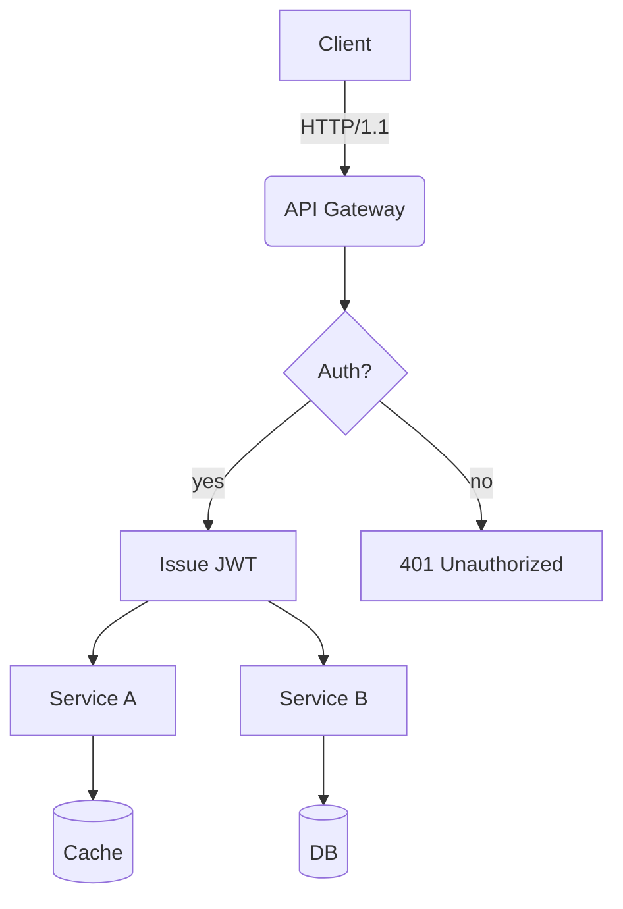
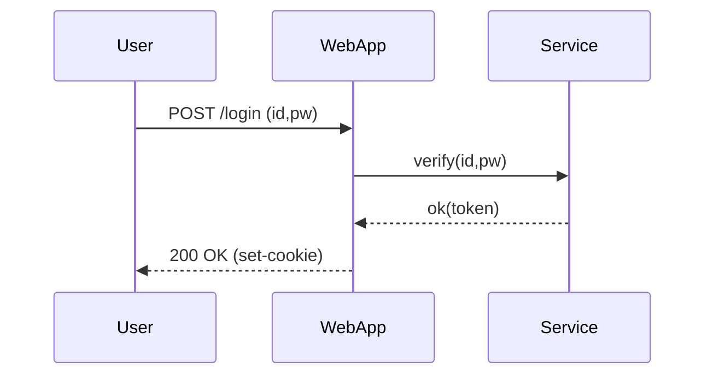
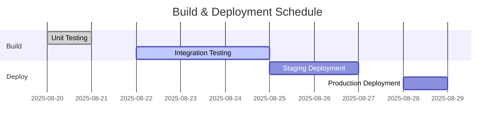
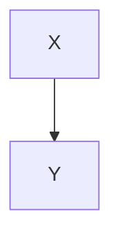

# A Rich Markdown Document for Translation Testing

This document is a collection of Korean content in various formats, designed to definitely exceed 4096 tokens. Its purpose is to test the **robustness** of translation engines/LLMs, including their ability to handle context, preserve format, and ignore code/table contents.

> **Guidelines:**
> 1) Ensure that code blocks and `mermaid` areas are preserved as-is.
> 2) Verify that numbers and units (e.g., 1.2GB, 3ms), slash-separated paths (`/var/log/app.log`), and options (`--flag`) are correctly retained.
> 3) The layout should not be disrupted even if tables, lists, quotations, checkboxes, formulas, and emojis 😀 are mixed together.

## 1. Mixing of Tables and Symbols/Units

| Item        | Value   | Unit    | Notes       |
|-------------|--------:|-------:|------------|
| Throughput     | 12,345   | RPS    | 18,900 RPS at peak |
| Latency (P50)    | 3.2     | ms     | `--enable-cache` is applied |
| Latency (P99)    | 41.7     | ms     | Includes periods of GC occurrence |
| Memory       | 1.5      | GB      | Based on RSS; cgroup limit is 2GB |
| Disk I/O      | 220     | MB/s    | Via NVMe-oF (TCP) |

## 2. Task List

- [x] Accuracy of markdown header translations
- [x] Preservation of keywords within code blocks (`for`, `if`, `return`, etc.)
- [ ] Preservation of Mermaid diagrams and ignoring of comments
- [ ] Preservation of units (GB/ms/%), paths (/etc/hosts)
- [ ] Preservation of inline formulas ($O(n \log n)$)

## 3. Code Blocks: Bash/Python/JSON/YAML

```bash
#!/usr/bin/env bash
set -euo pipefail

APP_ENV="${APP_ENV:-prod}"
INPUT="${1:-/data/input.txt}"
OUT="/var/tmp/result.json"

echo "[INFO] Starting job on $(hostname) at $(date -Iseconds)"
if [[ ! -f "$INPUT" ]]; then
  echo "[ERROR] Input not found: $INPUT" >&2
  exit 1
fi

lines=$(wc -l < "$INPUT")
echo "[DEBUG] Line count: $lines"

curl -sS -X POST "http://127.0.0.1:8080/api" \  -H "Content-Type: application/json" \  -d "{"env":"$APP_ENV","count":$lines}" > "$OUT"

jq -r '.status' "$OUT" | grep -q success && echo "OK" || { echo "FAIL"; exit 2; }
```

```python
from __future__ import annotations

def rolling_avg(xs: list[float], k: int) -> list[float]:
    if k <= 0:
        raise ValueError("k must be > 0")
    out = []
    acc = 0.0
    for i, v in enumerate(xs):
        acc += v
        if i >= k:
            acc -= xs[i-k]
        if i >= k - 1:
            out.append(acc / k)
    return out

print(rolling_avg([1,2,3,4,5,6,7,8,9], 3))
```

```json
{
  "service": "analytics",
  "version": "1.4.2",
  "features": ["rollup", "compaction", "delta-index"],
  "limits": {
    "max_docs": 1000000,
    "max_payload_mb": 256
  }
}
```

```yaml
apiVersion: v1
kind: ConfigMap
metadata:
  name: test-config
data:
  APP_ENV: "staging"
  ENDPOINT: "https://api.example.com"
```

## 4. Mermaid Diagrams

### 4.1 Flowchart


### 4.2 Sequence Diagram


### 4.3 Gantt Chart


## 5. Images/Links/Citations


- Document: <https://example.com/docs/guide>
- API Reference: [API Reference](https://example.com/api)
- Issue Tracker: https://example.com/issues

> “The quality of translation is determined by the simultaneous preservation of layout and meaning.” — Anonymous

## 6. Mixing Formulas and Text

- Average time complexity: $O(n \log n)$, worst-case: $O(n^2)$
- Variance: $\sigma^2 = \frac{1}{n}\sum_{i=1}^{n}(x_i-\mu)^2$
- Sample mean: $\bar{x} = \frac{1}{n}\sum x_i$

Paragraph example: This paragraph is an example to verify that bold text, italic text, and code are all properly preserved during translation.
It includes emojis 😀, Chinese characters (漢字), English text written in CamelCase, snake_case, and kebab-case formats.

### 7.1 Experimental Paragraph – Variation Patterns
The following paragraphs are similar; however, to avoid duplicate translations, the vocabulary and order are slightly altered with each iteration.
- Scenario: Summary of conversation records
- Condition: Must contain 100,000 Korean characters (한글)
- Expected result: Summary accuracy of over 90%

#### Procedure
1. Input data: `/data/input_01.jsonl`
2. Options: `--batch 512 --timeout 3s --enable-cache`
3. Execution: `app run --job test-01 --qos high`
4. Verification: Check if “test-01 finished” is included in the log files

#### Observations
- As the GC (Garbage Collection) cycle length increases, there is a tendency for P99 latency to increase as well.
- When the cache miss rate increases by 10%, throughput decreases by approximately 7%.
- When the connection pool size is increased from 32 to 64, the retry rate per second decreases from 1.2% to 0.6%.

---

### 7.2 Experiment Section – Variation Patterns
In the following sections, although the content is similar, we slightly alter the vocabulary and order with each iteration to prevent duplicate translations.
- Scenario: Summary of conversation records
- Condition: Including 100,000 Korean characters
- Expected result: A summary accuracy of over 90%

#### Procedures
1. Input data: `/data/input_02.jsonl`
2. Options: `--batch 512 --timeout 3s --enable-cache`
3. Execution: `app run --job test-02 --qos high`
4. Verification: Check if “test-02 finished” is included in the logs

#### Observations
- As the GC cycle length increases, there is a tendency for P99 latency to increase as well.
- When the cache miss rate increases by 10%, throughput decreases by approximately 7%.
- When the connection pool size is increased from 32 to 64, the retry rate per second decreases from 1.2% to 0.6%.

---

### 7.3 Experiment Section – Variation Patterns
In the following sections, although the content is similar, we slightly alter the vocabulary and order with each iteration to prevent duplicate translations.
- Scenario: Kubernetes deployment
- Condition: HPA (Horizontal Pod Autoregulation) enabled
- Expected Result: Operation within a scale range of 2 to 10

#### Procedures
1. Input data: `/data/input_03.jsonl`
2. Options: `--batch 512 --timeout 3s --enable-cache`
3. Execution: `app run --job test-03 --qos high`
4. Verification: Check if “test-03 finished” is included in the logs

#### Observations
- As the GC (Garbage Collection) cycle length increases, there is a tendency for P99 latency to increase as well.
- When the cache miss rate increases by 10%, throughput decreases by approximately 7%.
- When the connection pool size is increased from 32 to 64, the retry rate per second decreases from 1.2% to 0.6%.

---

### 7.4 Experiment Section – Variation Patterns
In the following sections, although the content is similar, we slightly alter the vocabulary and order with each iteration to prevent duplicate translations.
- Scenario: Kubernetes deployment
- Condition: HPA (Horizontal Pod Autoregulation) enabled
- Expected Result: Operation within a scale range of 2 to 10

#### Procedures
1. Input data: `/data/input_04.jsonl`
2. Options: `--batch 512 --timeout 3s --enable-cache`
3. Execution: `app run --job test-04 --qos high`
4. Verification: Check if “test-04 finished” is included in the logs

#### Observations
- As the GC (Garbage Collection) cycle length increases, there is a tendency for P99 latency to increase as well.
- When the cache miss rate increases by 10%, throughput decreases by approximately 7%.
- When the connection pool size is increased from 32 to 64, the retry rate per second decreases from 1.2% to 0.6%.

---

### 7.5 Experiment Section – Variation Patterns
In the following sections, although the content is similar, we slightly alter the vocabulary and order with each iteration to prevent duplicate translations.
- Scenario: Summary of conversation records
- Condition: Including 100,000 Korean characters
- Expected result: A summary accuracy of over 90%

#### Procedures
1. Input data: `/data/input_05.jsonl`
2. Options: `--batch 512 --timeout 3s --enable-cache`
3. Execution: `app run --job test-05 --qos high`
4. Verification: Check if “test-05 finished” is included in the logs

#### Observations
- As the GC cycle length increases, there is a tendency for P99 latency to increase as well.
- When the cache miss rate increases by 10%, throughput decreases by approximately 7%.
- When the connection pool size is increased from 32 to 64, the retry rate per second decreases from 1.2% to 0.6%.

---

### 7.6 Experiment Section – Variation Patterns
In the following sections, although the content is similar, we slightly alter the vocabulary and order with each iteration to prevent duplicate translations.
- Scenario: Mermaid rendering
- Conditions: 50+ nodes, 100+ edges
- Expected Result: No layout distortion

#### Procedure
1. Input data: `/data/input_06.jsonl`
2. Options: `--batch 512 --timeout 3s --enable-cache`
3. Execution: `app run --job test-06 --qos high`
4. Verification: Check if “test-06 finished” is included in the logs

#### Observations
- As the GC cycle length increases, there is a tendency for P99 latency to increase as well.
- When the cache miss rate increases by 10%, throughput decreases by approximately 7%.
- When the connection pool size is increased from 32 to 64, the retry rate per second decreases from 1.2% to 0.6%.

---

### 7.7 Experiment Section – Variation Patterns
In the following sections, although the content is similar, we slightly alter the vocabulary and order with each iteration to prevent duplicate translations.
- Scenario: Parsing large volumes of JSON data
- Conditions: 64MB payload, 4 workers
- Expected outcome: Completion without any memory spikes

#### Procedures
1. Input data: `/data/input_07.jsonl`
2. Options: `--batch 512 --timeout 3s --enable-cache`
3. Execution: `app run --job test-07 --qos high`
4. Verification: Check if “test-07 finished” is included in the logs

#### Observations
- As the GC (Garbage Collection) cycle length increases, there is a tendency for P99 latency to rise.
- When the cache miss rate increases by 10%, throughput decreases by approximately 7%.
- When the connection pool size is increased from 32 to 64, the retry rate per second decreases from 1.2% to 0.6%.

---

### 7.8 Experiment Section – Variation Patterns
In the following sections, although the content is similar, we slightly alter the vocabulary and order with each iteration to prevent duplicate translations.
- Scenario: Parsing large volumes of JSON data
- Conditions: 64MB payload, 4 workers
- Expected outcome: Completion without any memory spikes

#### Procedures
1. Input data: `/data/input_08.jsonl`
2. Options: `--batch 512 --timeout 3s --enable-cache`
3. Execution: `app run --job test-08 --qos high`
4. Verification: Check if “test-08 finished” is included in the logs

#### Observations
- As the GC (Garbage Collection) cycle length increases, there is a tendency for P99 latency to rise.
- When the cache miss rate increases by 10%, throughput decreases by approximately 7%.
- When the connection pool size is increased from 32 to 64, the retry rate per second decreases from 1.2% to 0.6%.

---

### 7.9 Experiment Section – Variation Patterns
In the following sections, although the content is similar, we slightly alter the vocabulary and order with each iteration to prevent duplicate translations.
- Scenario: Parsing large volumes of JSON data
- Conditions: 64MB payload, 4 workers
- Expected outcome: Completion without any memory spikes

#### Procedures
1. Input data: `/data/input_09.jsonl`
2. Options: `--batch 512 --timeout 3s --enable-cache`
3. Execution: `app run --job test-09 --qos high`
4. Verification: Check if “test-09 finished” is included in the logs

#### Observations
- As the GC (Garbage Collection) cycle length increases, there is a tendency for P99 latency to rise as well.
- When the cache miss rate increases by 10%, throughput decreases by approximately 7%.
- When the connection pool size is increased from 32 to 64, the retry rate per second decreases from 1.2% to 0.6%.

---

### 7.10 Experiment Section – Variation Patterns
In the following sections, although the content is similar, we slightly alter the vocabulary and order with each iteration to prevent duplicate translations.
- Scenario: NVMe-oF I/O retries
- Conditions: TCP RTT of 2ms, loss rate of 0.1%
- Expected result: Retry rate below 1%

#### Procedure
1. Input data: `/data/input_10.jsonl`
2. Options: `--batch 512 --timeout 3s --enable-cache`
3. Execution: `app run --job test-10 --qos high`
4. Verification: Check if “test-10 finished” is included in the logs

#### Observations
- As the GC cycle length increases, there is a tendency for the P99 latency to increase.
- When the cache miss rate increases by 10%, throughput decreases by approximately 7%.
- When the connection pool size is increased from 32 to 64, the retry rate per second decreases from 1.2% to 0.6%.

---

### 7.11 Experiment Section – Variation Patterns
The following sections are similar, but to avoid duplicate translations, the vocabulary and order are slightly altered with each iteration.
- Scenario: Parsing large volumes of JSON data
- Conditions: 64MB payload, 4 workers
- Expected outcome: Completion without any memory spikes

#### Procedures
1. Input data: `/data/input_11.jsonl`
2. Options: `--batch 512 --timeout 3s --enable-cache`
3. Execution: `app run --job test-11 --qos high`
4. Verification: Check if “test-11 finished” is included in the logs

#### Observations
- It was observed that as the GC (Garbage Collection) cycle length increased, so did the P99 latency time.
- When the cache miss rate increased by 10%, throughput decreased by approximately 7%.
- When the connection pool size was increased from 32 to 64, the retry rate per second decreased from 1.2% to 0.6%.

---

### 7.12 Experiment Section – Variation Patterns
The following sections are similar, but to avoid duplicate translations, the vocabulary and order are slightly altered with each iteration.
- Scenario: Kubernetes deployment
- Condition: HPA (Horizontal Pod Autoregulation) enabled
- Expected Result: Operation within a scale range of 2 to 10

#### Procedures
1. Input data: `/data/input_12.jsonl`
2. Options: `--batch 512 --timeout 3s --enable-cache`
3. Execution: `app run --job test-12 --qos high`
4. Verification: Check if “test-12 finished” is included in the logs

#### Observations
- A tendency to observe an increase in P99 latency as the GC (Garbage Collection) cycle lengthens
- When the cache miss rate increases by 10%, throughput decreases by approximately 7%
- When the connection pool size is increased from 32 to 64, the retry rate per second decreases from 1.2% to 0.6%

---

### 7.13 Experiment Section – Variation Patterns
The following sections are similar, but to avoid duplicate translations, the vocabulary and order are slightly altered with each iteration.
- Scenario: Parsing large volumes of JSON data
- Conditions: 64MB payload, 4 workers
- Expected outcome: Completion without any memory spikes

#### Procedures
1. Input data: `/data/input_13.jsonl`
2. Options: `--batch 512 --timeout 3s --enable-cache`
3. Execution: `app run --job test-13 --qos high`
4. Verification: Check if “test-13 finished” is included in the logs

#### Observations
- It was observed that as the GC (Garbage Collection) cycle duration increased, so did the P99 latency.
- When the cache miss rate increased by 10%, throughput decreased by approximately 7%.
- When the connection pool size was increased from 32 to 64, the retry rate per second decreased from 1.2% to 0.6%.

---

### 7.14 Experiment Section – Variation Patterns
The following sections are similar, but to avoid duplicate translations, the vocabulary and order are slightly altered with each iteration.
- Scenario: Parsing large volumes of JSON data
- Conditions: 64MB payload, 4 workers
- Expected outcome: Completion without any memory spikes

#### Procedures
1. Input data: `/data/input_14.jsonl`
2. Options: `--batch 512 --timeout 3s --enable-cache`
3. Execution: `app run --job test-14 --qos high`
4. Verification: Check if “test-14 finished” is included in the logs

#### Observations
- It was observed that as the GC (Garbage Collection) cycle duration increased, so did the P99 latency.
- When the cache miss rate increased by 10%, throughput decreased by approximately 7%.
- When the connection pool size was increased from 32 to 64, the retry rate per second decreased from 1.2% to 0.6%.

---

### 7.15 Experiment Section – Variation Patterns
In the following sections, although the content is similar, we slightly alter the vocabulary and order with each iteration to prevent duplicate translations.
- Scenario: NVMe-oF I/O retries
- Conditions: TCP RTT of 2ms, loss rate of 0.1%
- Expected Result: Retry rate of less than 1%

#### Procedure
1. Input data: `/data/input_15.jsonl`
2. Options: `--batch 512 --timeout 3s --enable-cache`
3. Execution: `app run --job test-15 --qos high`
4. Verification: Check if “test-15 finished” is included in the logs

#### Observations
- As the GC cycle length increases, there is a tendency for the P99 latency to increase.
- When the cache miss rate increases by 10%, throughput decreases by approximately 7%.
- When the connection pool size is increased from 32 to 64, the retry rate per second decreases from 1.2% to 0.6%.

---

### 7.16 Experiment Section – Variation Patterns
The following sections are similar, but to avoid duplicate translations, the vocabulary and order are slightly altered with each iteration.
- Scenario: Mermaid rendering
- Conditions: 50+ nodes, 100+ edges
- Expected Result: No layout distortion

#### Procedure
1. Input data: `/data/input_16.jsonl`
2. Options: `--batch 512 --timeout 3s --enable-cache`
3. Execution: `app run --job test-16 --qos high`
4. Verification: Check if “test-16 finished” is included in the logs

#### Observations
- It was observed that as the GC cycle length increased, so did the P99 latency time.
- When the cache miss rate increased by 10%, throughput decreased by approximately 7%.
- When the connection pool size was increased from 32 to 64, the retry rate per second decreased from 1.2% to 0.6%.

---

### 7.17 Experiment Section – Variation Patterns
The following sections are similar, but to avoid duplicate translations, the vocabulary and order are slightly altered with each iteration.
- Scenario: Summary of conversation records
- Condition: Including 100,000 Korean characters
- Expected result: A summary rate of over 90%

#### Procedure
1. Input data: `/data/input_17.jsonl`
2. Options: `--batch 512 --timeout 3s --enable-cache`
3. Execution: `app run --job test-17 --qos high`
4. Verification: Check if “test-17 finished” is included in the logs

#### Observations
- It was observed that as the GC cycle length increased, so did the P99 latency time.
- When the cache miss rate increased by 10%, throughput decreased by approximately 7%.
- When the connection pool size was increased from 32 to 64, the retry rate per second decreased from 1.2% to 0.6%.

---

### 7.18 Experiment Section – Variation Patterns
The following sections are similar, but to avoid duplicate translations, the vocabulary and order are slightly altered with each iteration.
- Scenario: Parsing large volumes of JSON data
- Conditions: 64MB payload, 4 workers
- Expected outcome: Completion without any memory spikes

#### Procedures
1. Input data: `/data/input_18.jsonl`
2. Options: `--batch 512 --timeout 3s --enable-cache`
3. Execution: `app run --job test-18 --qos high`
4. Verification: Check if “test-18 finished” is included in the logs

#### Observations
- It was observed that as the GC (Garbage Collection) cycle duration increased, so did the P99 latency.
- When the cache miss rate increased by 10%, throughput decreased by approximately 7%.
- When the connection pool size was increased from 32 to 64, the retry rate per second decreased from 1.2% to 0.6%.

---

### 7.19 Experiment Section – Variation Patterns
The following sections are similar, but to avoid duplicate translations, the vocabulary and order are slightly altered with each iteration.
- Scenario: Parsing large volumes of JSON data
- Conditions: 64MB payload, 4 workers
- Expected outcome: Completion without any memory spikes

#### Procedures
1. Input data: `/data/input_19.jsonl`
2. Options: `--batch 512 --timeout 3s --enable-cache`
3. Execution: `app run --job test-19 --qos high`
4. Verification: Check if “test-19 finished” is included in the logs

#### Observations
- It was observed that as the GC (Garbage Collection) cycle duration increased, so did the P99 latency.
- When the cache miss rate increased by 10%, throughput decreased by approximately 7%.
- When the connection pool size was increased from 32 to 64, the retry rate per second decreased from 1.2% to 0.6%.

---

### 7.20 Experiment Section – Variation Patterns
In the following sections, although the content is similar, we slightly alter the vocabulary and order with each iteration to prevent duplicate translations.
- Scenario: NVMe-oF I/O retries
- Conditions: TCP RTT of 2ms, loss rate of 0.1%
- Expected Result: Retry rate of less than 1%

#### Procedure
1. Input data: `/data/input_20.jsonl`
2. Options: `--batch 512 --timeout 3s --enable-cache`
3. Execution: `app run --job test-20 --qos high`
4. Verification: Check if “test-20 finished” is included in the logs

#### Observations
- As the GC cycle length increases, there is a tendency for P99 latency to increase as well.
- When the cache miss rate increases by 10%, throughput decreases by approximately 7%.
- When the connection pool size is increased from 32 to 64, the retry rate per second decreases from 1.2% to 0.6%.

---

### 7.21 Experiment Section – Variation Patterns
The following sections are similar, but to avoid duplicate translations, the vocabulary and order are slightly altered with each iteration.
- Scenario: Kubernetes deployment
- Condition: HPA (Horizontal Pod Autoregulation) enabled
- Expected Result: Operation within a scale range of 2 to 10

#### Procedures
1. Input data: `/data/input_21.jsonl`
2. Options: `--batch 512 --timeout 3s --enable-cache`
3. Execution: `app run --job test-21 --qos high`
4. Verification: Check if “test-21 finished” is included in the logs

#### Observations
- A tendency to observe an increase in P99 latency as the GC (Garbage Collection) cycle lengthens
- When the cache miss rate increases by 10%, throughput decreases by approximately 7%
- When the connection pool size is increased from 32 to 64, the retry rate per second decreases from 1.2% to 0.6%

---

### 7.22 Experiment Section – Variation Patterns
In the following sections, although the content is similar, we slightly alter the vocabulary and order with each iteration to prevent duplicate translations.
- Scenario: Mermaid rendering
- Conditions: 50+ nodes, 100+ edges
- Expected Result: No layout distortion

#### Procedures
1. Input data: `/data/input_22.jsonl`
2. Options: `--batch 512 --timeout 3s --enable-cache`
3. Execution: `app run --job test-22 --qos high`
4. Verification: Check if “test-22 finished” is included in the logs

#### Observations
- As the GC cycle length increases, there is a tendency for P99 latency to increase as well.
- When the cache miss rate increases by 10%, throughput decreases by approximately 7%.
- When the connection pool size is increased from 32 to 64, the retry rate per second decreases from 1.2% to 0.6%.

---

### 7.23 Experiment Section – Variation Patterns
The following sections are similar, but to avoid duplicate translations, the vocabulary and order are slightly altered with each iteration.
- Scenario: Parsing large volumes of JSON data
- Conditions: 64MB payload, 4 workers
- Expected outcome: Completion without any memory spikes

#### Procedures
1. Input data: `/data/input_23.jsonl`
2. Options: `--batch 512 --timeout 3s --enable-cache`
3. Execution: `app run --job test-23 --qos high`
4. Verification: Check if “test-23 finished” is included in the logs

#### Observations
- It was observed that as the GC (Garbage Collection) cycle length increased, so did the P99 latency time.
- When the cache miss rate increased by 10%, throughput decreased by approximately 7%.
- When the connection pool size was increased from 32 to 64, the retry rate per second decreased from 1.2% to 0.6%.

---

### 7.24 Experiment Section – Variation Patterns
In the following sections, although the content is similar, we slightly alter the vocabulary and order with each iteration to prevent duplicate translations.
- Scenario: Mermaid rendering
- Conditions: 50+ nodes, 100+ edges
- Expected Result: No layout distortion

#### Procedures
1. Input data: `/data/input_24.jsonl`
2. Options: `--batch 512 --timeout 3s --enable-cache`
3. Execution: `app run --job test-24 --qos high`
4. Verification: Check if “test-24 finished” is included in the logs

#### Observations
- As the GC cycle length increases, there is a tendency for P99 latency to increase as well.
- When the cache miss rate increases by 10%, throughput decreases by approximately 7%.
- When the connection pool size is increased from 32 to 64, the retry rate per second decreases from 1.2% to 0.6%.

---

### 7.25 Experiment Section – Variation Patterns
The following sections are similar, but to avoid duplicate translations, the vocabulary and order are slightly altered with each iteration.
- Scenario: Kubernetes deployment
- Condition: HPA (Horizontal Pod Autoregulation) enabled
- Expected Result: Operation within a scale range of 2 to 10

#### Procedures
1. Input data: `/data/input_25.jsonl`
2. Options: `--batch 512 --timeout 3s --enable-cache`
3. Execution: `app run --job test-25 --qos high`
4. Verification: Check if “test-25 finished” is included in the logs

#### Observations
- A tendency to observe an increase in P99 latency as the GC (Garbage Collection) cycle lengthens
- When the cache miss rate increases by 10%, throughput decreases by approximately 7%
- When the connection pool size is increased from 32 to 64, the retry rate per second decreases from 1.2% to 0.6%

---

### 7.26 Experiment Section – Variation Patterns
In the following sections, although the content is similar, we slightly alter the vocabulary and order with each iteration to prevent duplicate translations.
- Scenario: NVMe-oF I/O retries
- Conditions: TCP RTT of 2ms, loss rate of 0.1%
- Expected Result: Retry rate of less than 1%

#### Procedure
1. Input data: `/data/input_26.jsonl`
2. Options: `--batch 512 --timeout 3s --enable-cache`
3. Execution: `app run --job test-26 --qos high`
4. Verification: Check if “test-26 finished” is included in the logs

#### Observations
- As the GC cycle length increases, there is a tendency for the P99 latency to increase as well.
- When the cache miss rate increases by 10%, throughput decreases by approximately 7%.
- When the connection pool size is increased from 32 to 64, the retry rate per second decreases from 1.2% to 0.6%.

---

### 7.27 Experiment Section – Variation Patterns
The following sections are similar, but to avoid duplicate translations, the vocabulary and order are slightly altered with each iteration.
- Scenario: Summary of conversation records
- Condition: Including 100,000 Korean characters
- Expected result: A summary rate of over 90%

#### Procedures
1. Input data: `/data/input_27.jsonl`
2. Options: `--batch 512 --timeout 3s --enable-cache`
3. Execution: `app run --job test-27 --qos high`
4. Verification: Check if “test-27 finished” is included in the logs

#### Observations
- It was observed that as the GC cycle length increased, so did the P99 latency time.
- When the cache miss rate increased by 10%, throughput decreased by approximately 7%.
- When the connection pool size was increased from 32 to 64, the retry rate per second decreased from 1.2% to 0.6%.

---

### 7.28 Experiment Section – Variation Patterns
In the following sections, although the content is similar, we slightly alter the vocabulary and order with each iteration to prevent duplicate translations.
- Scenario: Summary of conversation records
- Condition: Including 100,000 Korean characters
- Expected result: A summary accuracy of over 90%

#### Procedures
1. Input data: `/data/input_28.jsonl`
2. Options: `--batch 512 --timeout 3s --enable-cache`
3. Execution: `app run --job test-28 --qos high`
4. Verification: Check if “test-28 finished” is included in the logs

#### Observations
- As the GC cycle length increases, there is a tendency for P99 latency to increase.
- When the cache miss rate increases by 10%, throughput decreases by approximately 7%.
- When the connection pool size is increased from 32 to 64, the retry rate per second decreases from 1.2% to 0.6%.

---

### 7.29 Experiment Section – Variation Patterns
The following sections are similar, but to avoid duplicate translations, the vocabulary and order are slightly altered with each iteration.
- Scenario: Parsing large volumes of JSON data
- Conditions: 64MB payload, 4 workers
- Expected outcome: Completion without any memory spikes

#### Procedures
1. Input data: `/data/input_29.jsonl`
2. Options: `--batch 512 --timeout 3s --enable-cache`
3. Execution: `app run --job test-29 --qos high`
4. Verification: Check if “test-29 finished” is included in the logs

#### Observations
- It was observed that as the GC (Garbage Collection) cycle duration increased, so did the P99 latency.
- When the cache miss rate increased by 10%, throughput decreased by approximately 7%.
- When the connection pool size was increased from 32 to 64, the retry rate per second decreased from 1.2% to 0.6%.

---

### 7.30 Experiment Section – Variation Patterns
In the following sections, although the content is similar, we slightly alter the vocabulary and order with each iteration to prevent duplicate translations.
- Scenario: Summary of conversation records
- Condition: Including 100,000 Korean characters
- Expected result: A summary accuracy of over 90%

#### Procedures
1. Input data: `/data/input_30.jsonl`
2. Options: `--batch 512 --timeout 3s --enable-cache`
3. Execution: `app run --job test-30 --qos high`
4. Verification: Check if “test-30 finished” is included in the logs

#### Observations
- As the GC cycle length increases, there is a tendency for P99 latency to increase.
- When the cache miss rate increases by 10%, throughput decreases by approximately 7%.
- When the connection pool size is increased from 32 to 64, the retry rate per second decreases from 1.2% to 0.6%.

---

### 7.31 Experiment Section – Variation Patterns
The following sections are similar, but to avoid duplicate translations, the vocabulary and order are slightly altered with each iteration.
- Scenario: Kubernetes deployment
- Condition: HPA (Horizontal Pod Autoregulation) enabled
- Expected Result: Operation within a scale range of 2 to 10

#### Procedures
1. Input data: `/data/input_31.jsonl`
2. Options: `--batch 512 --timeout 3s --enable-cache`
3. Execution: `app run --job test-31 --qos high`
4. Verification: Check if “test-31 finished” is included in the logs

#### Observations
- A tendency to observe an increase in P99 latency as the GC (Garbage Collection) cycle lengthens
- When the cache miss rate increases by 10%, throughput decreases by approximately 7%
- When the connection pool size is increased from 32 to 64, the retry rate per second decreases from 1.2% to 0.6%

---

### 7.32 Experiment Section — Variation Patterns
In the following sections, although the content is similar, we slightly alter the vocabulary and order with each iteration to prevent duplicate translations.
- Scenario: Mermaid rendering
- Conditions: 50+ nodes, 100+ edges
- Expected Result: No layout distortion

#### Procedures
1. Input data: `/data/input_32.jsonl`
2. Options: `--batch 512 --timeout 3s --enable-cache`
3. Execution: `app run --job test-32 --qos high`
4. Verification: Check if “test-32 finished” is included in the logs

#### Observations
- As the GC cycle length increases, there is a tendency for P99 latency to increase as well.
- When the cache miss rate increases by 10%, throughput decreases by approximately 7%.
- When the connection pool size is increased from 32 to 64, the retry rate per second decreases from 1.2% to 0.6%.

---

### 7.33 Experiment Section – Variation Patterns
The following sections are similar, but to avoid duplicate translations, the vocabulary and order are slightly altered with each iteration.
- Scenario: Parsing large volumes of JSON data
- Conditions: 64MB payload, 4 workers
- Expected outcome: Completion without any memory spikes

#### Procedures
1. Input data: `/data/input_33.jsonl`
2. Options: `--batch 512 --timeout 3s --enable-cache`
3. Execution: `app run --job test-33 --qos high`
4. Verification: Check if “test-33 finished” is included in the logs

#### Observations
- It was observed that as the GC (Garbage Collection) cycle duration increased, so did the P99 latency.
- When the cache miss rate increased by 10%, throughput decreased by approximately 7%.
- When the connection pool size was increased from 32 to 64, the retry rate per second decreased from 1.2% to 0.6%.

---

### 7.34 Experiment Section – Variation Patterns
The following sections are similar, but to avoid duplicate translations, the vocabulary and order are slightly altered with each iteration.
- Scenario: Kubernetes deployment
- Condition: HPA (Horizontal Pod Autoregulation) enabled
- Expected Result: Operation within a scale range of 2 to 10

#### Procedures
1. Input data: `/data/input_34.jsonl`
2. Options: `--batch 512 --timeout 3s --enable-cache`
3. Execution: `app run --job test-34 --qos high`
4. Verification: Check if “test-34 finished” is included in the logs

#### Observations
- A tendency to observe an increase in P99 latency as the GC (Garbage Collection) cycle lengthens
- When the cache miss rate increases by 10%, throughput decreases by approximately 7%
- When the connection pool size is increased from 32 to 64, the retry rate per second decreases from 1.2% to 0.6%

---

### 7.35 Experiment Section – Variation Patterns
In the following sections, although the content is similar, we slightly alter the vocabulary and order with each iteration to prevent duplicate translations.
- Scenario: Mermaid rendering
- Conditions: 50+ nodes, 100+ edges
- Expected Result: No layout distortion

#### Procedures
1. Input data: `/data/input_35.jsonl`
2. Options: `--batch 512 --timeout 3s --enable-cache`
3. Execution: `app run --job test-35 --qos high`
4. Verification: Check if “test-35 finished” is included in the logs

#### Observations
- As the GC cycle length increases, there is a tendency for P99 latency to increase as well.
- When the cache miss rate increases by 10%, throughput decreases by approximately 7%.
- When the connection pool size is increased from 32 to 64, the retry rate per second decreases from 1.2% to 0.6%.

---

### 7.36 Experiment Section – Variation Patterns
In the following sections, although the content is similar, we slightly alter the vocabulary and order with each iteration to prevent duplicate translations.
- Scenario: NVMe-oF I/O retries
- Conditions: TCP RTT of 2ms, loss rate of 0.1%
- Expected Result: Retry rate of less than 1%

#### Procedure
1. Input data: `/data/input_36.jsonl`
2. Options: `--batch 512 --timeout 3s --enable-cache`
3. Execution: `app run --job test-36 --qos high`
4. Verification: Check if “test-36 finished” is included in the logs

#### Observations
- As the GC cycle length increases, there is a tendency for the P99 latency to increase as well.
- When the cache miss rate increases by 10%, throughput decreases by approximately 7%.
- When the connection pool size is increased from 32 to 64, the retry rate per second decreases from 1.2% to 0.6%.

---

### 7.37 Experiment Section – Variation Patterns
The following sections are similar, but to avoid duplicate translations, the vocabulary and order are slightly altered with each iteration.
- Scenario: Parsing large volumes of JSON data
- Conditions: 64MB payload, 4 workers
- Expected outcome: Completion without any memory spikes

#### Procedures
1. Input data: `/data/input_37.jsonl`
2. Options: `--batch 512 --timeout 3s --enable-cache`
3. Execution: `app run --job test-37 --qos high`
4. Verification: Check if “test-37 finished” is included in the logs

#### Observations
- It was observed that as the GC (Garbage Collection) cycle duration increased, so did the P99 latency.
- When the cache miss rate increased by 10%, throughput decreased by approximately 7%.
- When the connection pool size was increased from 32 to 64, the retry rate per second decreased from 1.2% to 0.6%.

---

### 7.38 Experiment Section – Variation Patterns
In the following sections, although the content is similar, we slightly alter the vocabulary and order with each iteration to prevent duplicate translations.
- Scenario: Mermaid rendering
- Conditions: 50+ nodes, 100+ edges
- Expected Result: No layout distortion

#### Procedures
1. Input data: `/data/input_38.jsonl`
2. Options: `--batch 512 --timeout 3s --enable-cache`
3. Execution: `app run --job test-38 --qos high`
4. Verification: Check if “test-38 finished” is included in the logs

#### Observations
- As the GC cycle length increases, there is a tendency for P99 latency to increase as well.
- When the cache miss rate increases by 10%, throughput decreases by approximately 7%.
- When the connection pool size is increased from 32 to 64, the retry rate per second decreases from 1.2% to 0.6%.

---

### 7.39 Experiment Section – Variation Patterns
The following sections are similar, but to avoid duplicate translations, the vocabulary and order are slightly altered with each iteration.
- Scenario: Mermaid rendering
- Conditions: 50+ nodes, 100+ edges
- Expected Result: No layout distortion

#### Procedure
1. Input data: `/data/input_39.jsonl`
2. Options: `--batch 512 --timeout 3s --enable-cache`
3. Execution: `app run --job test-39 --qos high`
4. Verification: Check if “test-39 finished” is included in the logs

#### Observations
- It was observed that as the GC cycle length increased, so did the P99 latency time.
- When the cache miss rate increased by 10%, throughput decreased by approximately 7%.
- When the connection pool size was increased from 32 to 64, the retry rate per second decreased from 1.2% to 0.6%.

---

### 7.40 Experiment Section – Variation Patterns
In the following sections, although the content is similar, we slightly alter the vocabulary and order with each iteration to prevent duplicate translations.
- Scenario: Summary of conversation records
- Condition: Including 100,000 Korean characters
- Expected result: A summary accuracy of over 90%

#### Procedures
1. Input data: `/data/input_40.jsonl`
2. Options: `--batch 512 --timeout 3s --enable-cache`
3. Execution: `app run --job test-40 --qos high`
4. Verification: Check if “test-40 finished” is included in the logs

#### Observations
- As the GC cycle length increases, there is a tendency for P99 latency to increase.
- When the cache miss rate increases by 10%, throughput decreases by approximately 7%.
- When the connection pool size is increased from 32 to 64, the retry rate per second decreases from 1.2% to 0.6%.

---

## 8. Extended List

- 2. Consistency in Error Handling — Case #001
- 3. Performance Profiling — Case #002
- 4. Accessibility (a11y) — Case #003
- 5. Log Schema Stability — Case #004
- 6. Cache Invalidation Scenarios — Case #005
- 7. Performance Profiling — Case #006
- 8. Performance Profiling — Case #007
- 9. API Backward Compatibility — Case #008
- 10. Log Schema Stability — Case #009
- 11. Accessibility (a11y) — Case #010
- 12. Cache Invalidation Scenarios — Case #011
- 13. Performance Profiling — Case #012
- 14. Application of Security Headers — Case #013
- 15. Internationalization (i18n) — Case #014
- 16. Resource Leak Detection — Case #015
- 17. Consistency in Error Handling — Case #016
- 18. Consistency in Error Handling — Case #017
- 19. Internationalization (i18n) — Case #018
- 20. CORS Policy Verification — Case #019
- 21. Performance Profiling — Case #020
- 22. Application of Security Headers — Case #021
- 23. Log Schema Stability — Case #022
- 24. Performance Profiling — Case #023
- 25. Cache Invalidation Scenarios — Case #024
- 26. CORS Policy Verification — Case #025
- 27. Performance Profiling — Case #026
- 28. Accessibility (a11y) — Case #027
- 29. Accessibility (a11y) — Case #028
- 30. API Backward Compatibility — Case #029
- 31. Cache Invalidation Scenarios — Case #030
- 32. Cache Invalidation Scenarios — Case #031
- 33. Performance Profiling — Case #032
- 34. Resource Leak Detection — Case #033
- 35. Log Schema Stability — Case #034
- 36. CORS Policy Verification — Case #035
- 37. Consistency in Error Handling — Case #036
- 38. Resource Leak Detection — Case #037
- 39. Consistency in Error Handling — Case #038
- 40. Internationalization (i18n) — Case #039
- 41. API Backward Compatibility — Case #040
- 42. Cache Invalidation Scenarios — Case #041
- 43. Cache Invalidation Scenarios — Case #042
- 44. Cache Invalidation Scenarios — Case #043
- 45. Performance Profiling — Case #044
- 46. Performance Profiling — Case #045
- 47. CORS Policy Verification — Case #046
- 48. Resource Leak Detection — Case #047
- 49. Cache Invalidation Scenarios — Case #048
- 50. Consistency in Error Handling — Case #049
- 51. Log Schema Stability — Case #050
- 52. Resource Leak Detection — Case #051
- 53. Internationalization (i18n) — Case #052
- 54. Log Schema Stability — Case #053
- 55. Resource Leak Detection — Case #054
- 56. Application of Security Headers — Case #055
- 57. Internationalization (i18n) — Case #056
- 58. API Backward Compatibility — Case #057
- 59. Accessibility (a11y) — Case #058
- 60. API Backward Compatibility — Case #059
- 61. Performance Profiling — Case #060
- 62. Accessibility (a11y) — Case #061
- 63. API Backward Compatibility — Case #062
- 64. Internationalization (i18n) — Case #063
- 65. Application of Security Headers — Case #064
- 66. Consistency in Error Handling — Case #065
- 67. Performance Profiling — Case #066
- 68. Accessibility (a11y) — Case #067
- 69. Consistency in Error Handling — Case #068
- 70. Performance Profiling — Case #069
- 71. Resource Leak Detection — Case #070
- 72. Accessibility (a11y) — Case #071
- 73. Internationalization (i18n) — Case #072
- 74. Consistency in Error Handling — Case #073

75. Internationalization (i18n) – Case #074
76. Performance Profiling – Case #075
77. Application of Security Headers – Case #076
78. CORS Policy Verification – Case #077
79. Resource Leak Detection – Case #078
80. Resource Leak Detection – Case #079
81. Performance Profiling – Case #080
82. Accessibility (a11y) – Case #081
83. Accessibility (a11y) – Case #082
84. Performance Profiling – Case #083
85. Resource Leak Detection – Case #084
86. Accessibility (a11y) – Case #085
87. Cache Invalidation Scenarios – Case #086
88. CORS Policy Verification – Case #087
89. Log Schema Stability – Case #088
90. CORS Policy Verification – Case #089
91. Application of Security Headers – Case #090
92. API Backward Compatibility – Case #091
93. Accessibility (a11y) – Case #092
94. Performance Profiling – Case #093
95. Performance Profiling – Case #094
96. Log Schema Stability – Case #095
97. Internationalization (i18n) – Case #096
98. API Backward Compatibility – Case #097
99. Consistency in Error Handling – Case #098
100. Cache Invalidation Scenarios – Case #099
101. Accessibility (a11y) – Case #100
102. Accessibility (a11y) – Case #101
103. Internationalization (i18n) – Case #102
104. Accessibility (a11y) – Case #103
105. API Backward Compatibility – Case #104
106. Accessibility (a11y) – Case #105
107. Performance Profiling – Case #106
108. Application of Security Headers – Case #107
109. API Backward Compatibility – Case #108
110. Application of Security Headers – Case #109
111. Consistency in Error Handling – Case #110
112. Performance Profiling – Case #111
113. Resource Leak Detection – Case #112
114. CORS Policy Verification – Case #113
115. Accessibility (a11y) – Case #114
116. Consistency in Error Handling – Case #115
117. Consistency in Error Handling – Case #116
118. Performance Profiling – Case #117
119. CORS Policy Verification – Case #118
120. Resource Leak Detection – Case #119
121. Cache Invalidation Scenarios – Case #120
122. CORS Policy Verification – Case #121
123. Performance Profiling – Case #122
124. Consistency in Error Handling – Case #123
125. Performance Profiling – Case #124
126. Performance Profiling – Case #125
127. Accessibility (a11y) – Case #126
128. Accessibility (a11y) – Case #127
129. Consistency in Error Handling – Case #128
130. Consistency in Error Handling – Case #129
131. API Backward Compatibility – Case #130
132. Accessibility (a11y) – Case #131
133. API Backward Compatibility – Case #132
134. Cache Invalidation Scenarios – Case #133
135. Application of Security Headers – Case #134
136. Internationalization (i18n) – Case #135
137. Application of Security Headers – Case #136
138. Performance Profiling – Case #137
139. Performance Profiling – Case #138
140. CORS Policy Verification – Case #139
141. Internationalization (i18n) – Case #140
142. Log Schema Stability – Case #141
143. CORS Policy Verification – Case #142
144. Accessibility (a11y) – Case #143
145. Application of Security Headers – Case #144
146. Log Schema Stability – Case #145
147. Performance Profiling – Case #146
148. Performance Profiling – Case #147
149. API Backward Compatibility – Case #148
150. Resource Leak Inspection – Case #149
151. Performance Profiling – Case #150
152. Resource Leak Inspection – Case #151
153. Accessibility (a11y) – Case #152
154. API Backward Compatibility – Case #153
155. Accessibility (a11y) – Case #154
156. Application of Security Headers – Case #155
157. Accessibility (a11y) – Case #156
158. Performance Profiling – Case #157
159. Cache Invalidation Scenarios – Case #158
160. Application of Security Headers – Case #159
161. Consistency in Error Handling – Case #160
162. Log Schema Stability – Case #161
163. Performance Profiling – Case #162
164. Accessibility (a11y) – Case #163
165. Consistency in Error Handling – Case #164
166. Resource Leak Inspection – Case #165
167. Log Schema Stability – Case #166
168. Internationalization (i18n) – Case #167
169. Cache Invalidation Scenarios – Case #168
170. Internationalization (i18n) – Case #169
171. Cache Invalidation Scenarios – Case #170
172. Resource Leak Inspection – Case #171
173. Application of Security Headers – Case #172
174. Resource Leak Inspection – Case #173
175. Consistency in Error Handling – Case #174
176. Resource Leak Inspection – Case #175
177. Log Schema Stability – Case #176
178. CORS Policy Verification – Case #177
179. Application of Security Headers – Case #178
180. Log Schema Stability – Case #179
181. Performance Profiling – Case #180
182. Resource Leak Inspection – Case #181
183. Internationalization (i18n) – Case #182
184. Log Schema Stability – Case #183
185. Accessibility (a11y) – Case #184
186. Application of Security Headers – Case #185
187. Resource Leak Inspection – Case #186
188. Resource Leak Inspection – Case #187
189. Accessibility (a11y) – Case #188
190. Cache Invalidation Scenarios – Case #189
191. Accessibility (a11y) – Case #190
192. Cache Invalidation Scenarios – Case #191
193. Consistency in Error Handling – Case #192
194. Consistency in Error Handling – Case #193
195. Resource Leak Inspection – Case #194
196. Consistency in Error Handling – Case #195
197. CORS Policy Verification – Case #196
198. Performance Profiling – Case #197
199. Resource Leak Inspection – Case #198
200. Accessibility (a11y) – Case #199
201. Resource Leak Inspection – Case #200
202. Cache Invalidation Scenarios – Case #201
203. Internationalization (i18n) – Case #202
204. Log Schema Stability – Case #203
205. Consistency in Error Handling – Case #204
206. Resource Leak Inspection – Case #205
207. Application of Security Headers – Case #206
208. Resource Leak Inspection – Case #207
209. Cache Invalidation Scenarios – Case #208
210. Performance Profiling – Case #209
211. Application of Security Headers – Case #210
212. Internationalization (i18n) – Case #211
213. Log Schema Stability – Case #212
214. Consistency in Error Handling – Case #213
215. Cache Invalidation Scenarios – Case #214
216. Application of Security Headers – Case #215
217. Internationalization (i18n) – Case #216
218. Application of Security Headers – Case #217
219. Performance Profiling – Case #218
220. Consistency in Error Handling — Case #219
221. Implementation of Security Headers — Case #220
222. Performance Profiling — Case #221
223. API Backward Compatibility — Case #222
224. Resource Leak Detection — Case #223
225. Internationalization (i18n) — Case #224
226. Implementation of Security Headers — Case #225
227. Internationalization (i18n) — Case #226
228. Performance Profiling — Case #227
229. Stability of Log Schema — Case #228
230. CORS Policy Verification — Case #229
231. Performance Profiling — Case #230
232. API Backward Compatibility — Case #231
233. CORS Policy Verification — Case #232
234. Internationalization (i18n) — Case #233
235. Consistency in Error Handling — Case #234
236. Performance Profiling — Case #235
237. Consistency in Error Handling — Case #236
238. Performance Profiling — Case #237
239. Implementation of Security Headers — Case #238
240. Consistency in Error Handling — Case #239
241. CORS Policy Verification — Case #240
242. API Backward Compatibility — Case #241
243. Performance Profiling — Case #242
244. Cache Invalidation Scenarios — Case #243
245. Performance Profiling — Case #244
246. Implementation of Security Headers — Case #245
247. Consistency in Error Handling — Case #246
248. Internationalization (i18n) — Case #247
249. Stability of Log Schema — Case #248
250. Implementation of Security Headers — Case #249
251. Accessibility (a11y) — Case #250
252. Accessibility (a11y) — Case #251
253. Internationalization (i18n) — Case #252
254. Internationalization (i18n) — Case #253
255. CORS Policy Verification — Case #254
256. Stability of Log Schema — Case #255
257. CORS Policy Verification — Case #256
258. Implementation of Security Headers — Case #257
259. Cache Invalidation Scenarios — Case #258
260. Consistency in Error Handling — Case #259
261. Accessibility (a11y) — Case #260
262. Resource Leak Detection — Case #261
263. Resource Leak Detection — Case #262
264. Performance Profiling — Case #263
265. Accessibility (a11y) — Case #264
266. Cache Invalidation Scenarios — Case #265
267. Implementation of Security Headers — Case #266
268. Resource Leak Detection — Case #267
269. Implementation of Security Headers — Case #268
270. Performance Profiling — Case #269
271. Consistency in Error Handling — Case #270
272. Internationalization (i18n) — Case #271
273. API Backward Compatibility — Case #272
274. Consistency in Error Handling — Case #273
275. Accessibility (a11y) — Case #274
276. API Backward Compatibility — Case #275
277. Internationalization (i18n) — Case #276
278. CORS Policy Verification — Case #277
279. Implementation of Security Headers — Case #278
280. Cache Invalidation Scenarios — Case #279
281. Stability of Log Schema — Case #280
282. Resource Leak Detection — Case #281
283. Resource Leak Detection — Case #282
284. Accessibility (a11y) — Case #283
285. Accessibility (a11y) — Case #284
286. Consistency in Error Handling — Case #285
287. API Backward Compatibility — Case #286
288. Cache Invalidation Scenarios — Case #287
289. Accessibility (a11y) — Case #288
290. Accessibility (a11y) — Case #289
291. Implementation of Security Headers — Case #290
292. Internationalization (i18n) — Case #291
293. Application of Security Headers — Case #292
294. Verification of CORS Policy — Case #293
295. Inspection for Resource Leaks — Case #294
296. Application of Security Headers — Case #295
297. Verification of CORS Policy — Case #296
298. Stability of Log Schema — Case #297
299. Cache Invalidation Scenarios — Case #298
300. API Backward Compatibility — Case #299
301. Cache Invalidation Scenarios — Case #300
302. Internationalization (i18n) — Case #301
303. Accessibility (a11y) — Case #302
304. Performance Profiling — Case #303
305. API Backward Compatibility — Case #304
306. Consistency in Error Handling — Case #305
307. Accessibility (a11y) — Case #306
308. Inspection for Resource Leaks — Case #307
309. API Backward Compatibility — Case #308
310. Application of Security Headers — Case #309
311. Verification of CORS Policy — Case #310
312. API Backward Compatibility — Case #311
313. Accessibility (a11y) — Case #312
314. Verification of CORS Policy — Case #313
315. Internationalization (i18n) — Case #314
316. Inspection for Resource Leaks — Case #315
317. Internationalization (i18n) — Case #316
318. Stability of Log Schema — Case #317
319. Application of Security Headers — Case #318
320. Stability of Log Schema — Case #319
321. Consistency in Error Handling — Case #320
322. Performance Profiling — Case #321
323. Accessibility (a11y) — Case #322
324. Application of Security Headers — Case #323
325. API Backward Compatibility — Case #324
326. Verification of CORS Policy — Case #325
327. Inspection for Resource Leaks — Case #326
328. Verification of CORS Policy — Case #327
329. Verification of CORS Policy — Case #328
330. API Backward Compatibility — Case #329
331. Accessibility (a11y) — Case #330
332. Performance Profiling — Case #331
333. Verification of CORS Policy — Case #332
334. Inspection for Resource Leaks — Case #333
335. Performance Profiling — Case #334
336. Inspection for Resource Leaks — Case #335
337. Consistency in Error Handling — Case #336
338. Internationalization (i18n) — Case #337
339. Cache Invalidation Scenarios — Case #338
340. API Backward Compatibility — Case #339
341. Cache Invalidation Scenarios — Case #340
342. Verification of CORS Policy — Case #341
343. Internationalization (i18n) — Case #342
344. Performance Profiling — Case #343
345. Performance Profiling — Case #344
346. Stability of Log Schema — Case #345
347. Consistency in Error Handling — Case #346
348. API Backward Compatibility — Case #347
349. Consistency in Error Handling — Case #348
350. Accessibility (a11y) — Case #349
351. Performance Profiling — Case #350
352. Accessibility (a11y) — Case #351
353. Consistency in Error Handling — Case #352
354. Cache Invalidation Scenarios — Case #353
355. Internationalization (i18n) — Case #354
356. Inspection for Resource Leaks — Case #355
357. Accessibility (a11y) — Case #356
358. Application of Security Headers — Case #357
359. Inspection for Resource Leaks — Case #358
360. Performance Profiling — Case #359
361. Inspection for Resource Leaks — Case #360
362. Stability of Log Schema — Case #361
363. Internationalization (i18n) — Case #362
364. Consistency in Error Handling — Case #363
365. Inspection for Resource Leaks — Case #364
366. Accessibility (a11y) – Case #365
367. Log Schema Stability – Case #366
368. Resource Leak Inspection – Case #367
369. Performance Profiling – Case #368
370. API Backward Compatibility – Case #369
371. Accessibility (a11y) – Case #370
372. Performance Profiling – Case #371
373. CORS Policy Verification – Case #372
374. Cache Invalidation Scenarios – Case #373
375. Application of Security Headers – Case #374
376. Accessibility (a11y) – Case #375
377. API Backward Compatibility – Case #376
378. Accessibility (a11y) – Case #377
379. Application of Security Headers – Case #378
380. CORS Policy Verification – Case #379
381. CORS Policy Verification – Case #380
382. Log Schema Stability – Case #381
383. Log Schema Stability – Case #382
384. Performance Profiling – Case #383
385. Consistency in Error Handling – Case #384
386. Performance Profiling – Case #385
387. Log Schema Stability – Case #386
388. Resource Leak Inspection – Case #387
389. Accessibility (a11y) – Case #388
390. API Backward Compatibility – Case #389
391. Performance Profiling – Case #390
392. CORS Policy Verification – Case #391
393. API Backward Compatibility – Case #392
394. Resource Leak Inspection – Case #393
395. Application of Security Headers – Case #394
396. Cache Invalidation Scenarios – Case #395
397. Resource Leak Inspection – Case #396
398. Performance Profiling – Case #397
399. Performance Profiling – Case #398
400. Consistency in Error Handling – Case #399
401. Cache Invalidation Scenarios – Case #400
402. API Backward Compatibility – Case #401
403. Log Schema Stability – Case #402
404. Resource Leak Inspection – Case #403
405. Consistency in Error Handling – Case #404
406. Accessibility (a11y) – Case #405
407. API Backward Compatibility – Case #406
408. API Backward Compatibility – Case #407
409. CORS Policy Verification – Case #408
410. Resource Leak Inspection – Case #409
411. Cache Invalidation Scenarios – Case #410
412. Application of Security Headers – Case #411
413. Application of Security Headers – Case #412
414. Application of Security Headers – Case #413
415. Accessibility (a11y) – Case #414
416. Internationalization (i18n) – Case #415
417. API Backward Compatibility – Case #416
418. Performance Profiling – Case #417
419. Cache Invalidation Scenarios – Case #418
420. Resource Leak Inspection – Case #419
421. Resource Leak Inspection – Case #420
422. Log Schema Stability – Case #421
423. API Backward Compatibility – Case #422
424. Accessibility (a11y) – Case #423
425. Log Schema Stability – Case #424
426. Cache Invalidation Scenarios – Case #425
427. Log Schema Stability – Case #426
428. Internationalization (i18n) – Case #427
429. Performance Profiling – Case #428
430. Application of Security Headers – Case #429
431. Consistency in Error Handling – Case #430
432. Resource Leak Inspection – Case #431
433. Consistency in Error Handling – Case #432
434. Cache Invalidation Scenarios – Case #433
435. Performance Profiling – Case #434
436. API Backward Compatibility – Case #435
437. Log Schema Stability – Case #436
438. Cache Invalidation Scenarios — Case #437
439. Application of Security Headers — Case #438
440. Accessibility (a11y) — Case #439
441. API Backward Compatibility — Case #440
442. API Backward Compatibility — Case #441
443. Application of Security Headers — Case #442
444. Accessibility (a11y) — Case #443
445. Log Schema Stability — Case #444
446. Cache Invalidation Scenarios — Case #445
447. Internationalization (i18n) — Case #446
448. API Backward Compatibility — Case #447
449. Internationalization (i18n) — Case #448
450. Performance Profiling — Case #449
451. Cache Invalidation Scenarios — Case #450
452. CORS Policy Verification — Case #451
453. Application of Security Headers — Case #452
454. CORS Policy Verification — Case #453
455. Internationalization (i18n) — Case #454
456. Log Schema Stability — Case #455
457. Performance Profiling — Case #456
458. Performance Profiling — Case #457
459. Application of Security Headers — Case #458
460. Resource Leak Detection — Case #459
461. Performance Profiling — Case #460
462. Accessibility (a11y) — Case #461
463. Consistency in Error Handling — Case #462
464. Consistency in Error Handling — Case #463
465. Consistency in Error Handling — Case #464
466. Cache Invalidation Scenarios — Case #465
467. Internationalization (i18n) — Case #466
468. Accessibility (a11y) — Case #467
469. Log Schema Stability — Case #468
470. Internationalization (i18n) — Case #469
471. API Backward Compatibility — Case #470
472. Application of Security Headers — Case #471
473. API Backward Compatibility — Case #472
474. Consistency in Error Handling — Case #473
475. Log Schema Stability — Case #474
476. Performance Profiling — Case #475
477. CORS Policy Verification — Case #476
478. CORS Policy Verification — Case #477
479. Internationalization (i18n) — Case #478
480. Internationalization (i18n) — Case #479
481. CORS Policy Verification — Case #480
482. API Backward Compatibility — Case #481
483. Performance Profiling — Case #482
484. Log Schema Stability — Case #483
485. API Backward Compatibility — Case #484
486. Cache Invalidation Scenarios — Case #485
487. Consistency in Error Handling — Case #486
488. Performance Profiling — Case #487
489. Consistency in Error Handling — Case #488
490. Cache Invalidation Scenarios — Case #489
491. Application of Security Headers — Case #490
492. Cache Invalidation Scenarios — Case #491
493. Consistency in Error Handling — Case #492
494. Resource Leak Detection — Case #493
495. Resource Leak Detection — Case #494
496. Consistency in Error Handling — Case #495
497. Internationalization (i18n) — Case #496
498. Application of Security Headers — Case #497
499. API Backward Compatibility — Case #498
500. Accessibility (a11y) — Case #499
501. Cache Invalidation Scenarios — Case #500
502. Cache Invalidation Scenarios — Case #501
503. API Backward Compatibility — Case #502
504. Internationalization (i18n) — Case #503
505. Internationalization (i18n) — Case #504
506. Resource Leak Detection — Case #505
507. Resource Leak Detection — Case #506
508. Internationalization (i18n) — Case #507
509. Cache Invalidation Scenarios — Case #508
510. Accessibility (a11y) — Case #509
511. Performance Profiling — Case #510
512. Resource Leak Inspection — Case #511
513. Accessibility (a11y) — Case #512
514. CORS Policy Verification — Case #513
515. Cache Invalidation Scenarios — Case #514
516. API Backward Compatibility — Case #515
517. CORS Policy Verification — Case #516
518. API Backward Compatibility — Case #517
519. API Backward Compatibility — Case #518
520. Performance Profiling — Case #519
521. Accessibility (a11y) — Case #520
522. CORS Policy Verification — Case #521
523. Application of Security Headers — Case #522
524. Cache Invalidation Scenarios — Case #523
525. Log Schema Stability — Case #524
526. CORS Policy Verification — Case #525
527. Internationalization (i18n) — Case #526
528. Log Schema Stability — Case #527
529. Resource Leak Inspection — Case #528
530. Internationalization (i18n) — Case #529
531. Consistency in Error Handling — Case #530
532. Consistency in Error Handling — Case #531
533. Log Schema Stability — Case #532
534. Performance Profiling — Case #533
535. Performance Profiling — Case #534
536. API Backward Compatibility — Case #535
537. Internationalization (i18n) — Case #536
538. CORS Policy Verification — Case #537
539. API Backward Compatibility — Case #538
540. API Backward Compatibility — Case #539
541. Cache Invalidation Scenarios — Case #540
542. Cache Invalidation Scenarios — Case #541
543. Application of Security Headers — Case #542
544. Cache Invalidation Scenarios — Case #543
545. Application of Security Headers — Case #544
546. Application of Security Headers — Case #545
547. Performance Profiling — Case #546
548. CORS Policy Verification — Case #547
549. Internationalization (i18n) — Case #548
550. Resource Leak Inspection — Case #549
551. Performance Profiling — Case #550
552. Performance Profiling — Case #551
553. Internationalization (i18n) — Case #552
554. Consistency in Error Handling — Case #553
555. Internationalization (i18n) — Case #554
556. Application of Security Headers — Case #555
557. Application of Security Headers — Case #556
558. Internationalization (i18n) — Case #557
559. API Backward Compatibility — Case #558
560. API Backward Compatibility — Case #559
561. Log Schema Stability — Case #560
562. Application of Security Headers — Case #561
563. Consistency in Error Handling — Case #562
564. Application of Security Headers — Case #563
565. Cache Invalidation Scenarios — Case #564
566. Consistency in Error Handling — Case #565
567. Log Schema Stability — Case #566
568. Internationalization (i18n) — Case #567
569. Internationalization (i18n) — Case #568
570. Performance Profiling — Case #569
571. API Backward Compatibility — Case #570
572. Performance Profiling — Case #571
573. API Backward Compatibility — Case #572
574. Application of Security Headers — Case #573
575. CORS Policy Verification — Case #574
576. Resource Leak Inspection — Case #575
577. CORS Policy Verification — Case #576
578. Resource Leak Inspection — Case #577
579. Consistency in Error Handling — Case #578
580. Log Schema Stability — Case #579
581. Consistency in Error Handling — Case #580
582. Performance Profiling — Case #581
583. Internationalization (i18n) – Case #582
584. Log Schema Stability – Case #583
585. Resource Leak Inspection – Case #584
586. API Backward Compatibility – Case #585
587. CORS Policy Verification – Case #586
588. CORS Policy Verification – Case #587
589. Cache Invalidation Scenarios – Case #588
590. Log Schema Stability – Case #589
591. API Backward Compatibility – Case #590
592. Application of Security Headers – Case #591
593. Application of Security Headers – Case #592
594. Consistency in Error Handling – Case #593
595. Internationalization (i18n) – Case #594
596. API Backward Compatibility – Case #595
597. Internationalization (i18n) – Case #596
598. CORS Policy Verification – Case #597
599. Cache Invalidation Scenarios – Case #598
600. Internationalization (i18n) – Case #599
601. Resource Leak Inspection – Case #600
602. Resource Leak Inspection – Case #601
603. Cache Invalidation Scenarios – Case #602
604. Resource Leak Inspection – Case #603
605. Cache Invalidation Scenarios – Case #604
606. Log Schema Stability – Case #605
607. API Backward Compatibility – Case #606
608. Application of Security Headers – Case #607
609. Performance Profiling – Case #608
610. API Backward Compatibility – Case #609
611. Consistency in Error Handling – Case #610
612. CORS Policy Verification – Case #611
613. CORS Policy Verification – Case #612
614. Performance Profiling – Case #613
615. Cache Invalidation Scenarios – Case #614
616. Performance Profiling – Case #615
617. Consistency in Error Handling – Case #616
618. Performance Profiling – Case #617
619. Performance Profiling – Case #618
620. Internationalization (i18n) – Case #620
621. Performance Profiling – Case #621
622. Log Schema Stability – Case #622
623. API Backward Compatibility – Case #623
624. Application of Security Headers – Case #624
625. Consistency in Error Handling – Case #625
626. Log Schema Stability – Case #626
628. Performance Profiling – Case #627
629. Consistency in Error Handling – Case #628
630. Application of Security Headers – Case #629
631. Application of Security Headers – Case #630
632. Performance Profiling – Case #631
633. Log Schema Stability – Case #632
634. Resource Leak Inspection – Case #633
635. Resource Leak Inspection – Case #634
636. Accessibility (a11y) – Case #635
637. Accessibility (a11y) – Case #636
638. Resource Leak Inspection – Case #637
639. Cache Invalidation Scenarios – Case #638
640. Cache Invalidation Scenarios – Case #639
641. Internationalization (i18n) – Case #640
642. Consistency in Error Handling – Case #641
643. API Backward Compatibility – Case #642
644. Performance Profiling – Case #643
645. Cache Invalidation Scenarios – Case #644
646. Cache Invalidation Scenarios – Case #645
647. Internationalization (i18n) – Case #646
648. Log Schema Stability – Case #647
649. CORS Policy Verification – Case #648
650. Log Schema Stability – Case #649
651. Resource Leak Inspection – Case #650
652. Accessibility (a11y) – Case #651
653. Application of Security Headers – Case #652
654. Log Schema Stability – Case #653
655. Performance Profiling — Case #654
656. Application of Security Headers — Case #655
657. Log Schema Stability — Case #656
658. Application of Security Headers — Case #657
659. CORS Policy Verification — Case #658
660. API Backward Compatibility — Case #659
661. CORS Policy Verification — Case #660
662. API Backward Compatibility — Case #661
663. Performance Profiling — Case #662
664. Log Schema Stability — Case #663
665. Cache Invalidation Scenarios — Case #664
666. CORS Policy Verification — Case #665
667. Resource Leak Detection — Case #666
668. Application of Security Headers — Case #667
669. Cache Invalidation Scenarios — Case #668
670. Cache Invalidation Scenarios — Case #669
671. Performance Profiling — Case #670
672. API Backward Compatibility — Case #671
673. Accessibility (a11y) — Case #672
674. CORS Policy Verification — Case #673
675. Application of Security Headers — Case #674
676. Resource Leak Detection — Case #675
677. Accessibility (a11y) — Case #676
678. Internationalization (i18n) — Case #677
679. Resource Leak Detection — Case #678
680. Cache Invalidation Scenarios — Case #679
681. Cache Invalidation Scenarios — Case #680
682. Log Schema Stability — Case #681
683. Accessibility (a11y) — Case #682
684. CORS Policy Verification — Case #683
685. Resource Leak Detection — Case #684
686. Performance Profiling — Case #685
687. Log Schema Stability — Case #686
688. Performance Profiling — Case #687
689. CORS Policy Verification — Case #688
690. CORS Policy Verification — Case #689
691. Cache Invalidation Scenarios — Case #690
692. API Backward Compatibility — Case #691
693. API Backward Compatibility — Case #692
694. Internationalization (i18n) — Case #693
695. Internationalization (i18n) — Case #694
696. API Backward Compatibility — Case #695
697. Performance Profiling — Case #696
698. Cache Invalidation Scenarios — Case #697
699. Performance Profiling — Case #698
700. API Backward Compatibility — Case #699
701. Application of Security Headers — Case #700
702. Cache Invalidation Scenarios — Case #701
703. Consistency in Error Handling — Case #702
704. Performance Profiling — Case #703
705. Application of Security Headers — Case #704
706. Log Schema Stability — Case #705
707. Accessibility (a11y) — Case #706
708. API Backward Compatibility — Case #707
709. Cache Invalidation Scenarios — Case #708
710. Log Schema Stability — Case #709
711. Consistency in Error Handling — Case #710
712. Resource Leak Detection — Case #711
713. Internationalization (i18n) — Case #712
714. Resource Leak Detection — Case #713
715. CORS Policy Verification — Case #714
716. Log Schema Stability — Case #715
717. Accessibility (a11y) — Case #716
718. Consistency in Error Handling — Case #717
719. Performance Profiling — Case #718
720. Accessibility (a11y) — Case #719
721. CORS Policy Verification — Case #720
722. Log Schema Stability — Case #721
723. Accessibility (a11y) — Case #722
724. Resource Leak Detection — Case #723
725. Cache Invalidation Scenarios — Case #724
726. Cache Invalidation Scenarios — Case #725
727. Performance Profiling — Case #726
728. Resource Leak Inspection — Case #727
729. CORS Policy Verification — Case #728
730. Performance Profiling — Case #729
731. Log Schema Stability — Case #730
732. Resource Leak Inspection — Case #731
733. Accessibility (a11y) — Case #732
734. Performance Profiling — Case #733
735. API Backward Compatibility — Case #734
736. CORS Policy Verification — Case #735
737. Resource Leak Inspection — Case #736
738. Application of Security Headers — Case #737
739. Log Schema Stability — Case #738
740. Accessibility (a11y) — Case #739
741. CORS Policy Verification — Case #740
742. Application of Security Headers — Case #741
743. CORS Policy Verification — Case #742
744. Application of Security Headers — Case #743
745. Internationalization (i18n) — Case #744
746. Internationalization (i18n) — Case #745
747. Log Schema Stability — Case #746
748. Cache Invalidation Scenarios — Case #747
749. Performance Profiling — Case #748
750. Cache Invalidation Scenarios — Case #749
751. Performance Profiling — Case #750
752. Log Schema Stability — Case #751
753. CORS Policy Verification — Case #752
754. Accessibility (a11y) — Case #753
755. CORS Policy Verification — Case #754
756. Cache Invalidation Scenarios — Case #755
757. Internationalization (i18n) — Case #756
758. Internationalization (i18n) — Case #757
759. Accessibility (a11y) — Case #758
760. Performance Profiling — Case #759
761. Resource Leak Inspection — Case #760
762. Internationalization (i18n) — Case #761
763. Cache Invalidation Scenarios — Case #762
764. Internationalization (i18n) — Case #763
765. Accessibility (a11y) — Case #764
766. Performance Profiling — Case #765
767. Resource Leak Inspection — Case #766
768. Accessibility (a11y) — Case #767
769. Consistency in Error Handling — Case #768
770. CORS Policy Verification — Case #769
771. Accessibility (a11y) — Case #770
772. Resource Leak Inspection — Case #771
773. Consistency in Error Handling — Case #772
774. Performance Profiling — Case #773
775. Log Schema Stability — Case #774
776. Consistency in Error Handling — Case #775
777. Resource Leak Inspection — Case #776
778. Accessibility (a11y) — Case #777
779. Performance Profiling — Case #778
780. Consistency in Error Handling — Case #779
781. Internationalization (i18n) — Case #780
782. API Backward Compatibility — Case #781
783. Log Schema Stability — Case #782
784. Accessibility (a11y) — Case #783
785. Accessibility (a11y) — Case #784
786. Accessibility (a11y) — Case #785
787. Application of Security Headers — Case #786
788. Accessibility (a11y) — Case #787
789. CORS Policy Verification — Case #788
790. CORS Policy Verification — Case #789
791. Cache Invalidation Scenarios — Case #790
792. Application of Security Headers — Case #791
793. CORS Policy Verification — Case #792
794. Log Schema Stability — Case #793
795. Internationalization (i18n) — Case #794
796. Resource Leak Inspection — Case #795
797. Internationalization (i18n) — Case #796
798. Cache Invalidation Scenarios — Case #797
799. Application of Security Headers — Case #798
800. Applying Security Headers — Case #799
801. Internationalization (i18n) — Case #800

## 9. Conclusion
This document serves as a sample for evaluating whether a translation engine properly handles **format preservation**, **terminology consistency**, and the **rules for ignoring code/formulas/pathnames**.
If necessary, more sections can be added following the same pattern to extend it to over 100,000 characters.

# Section 1

## Repeated Block 1-1

- This paragraph has been added in order to create a very long document.

- It contains a mixture of various grammatical structures and Korean text.

- One can observe issues such as translation quality, token limitations, and loss of context.

```bash
echo 'section 1-1' >> /tmp/out.log
```



## Repeated Block 1-2

- This paragraph has been added in order to create a very long document.

- It contains a mixture of various grammatical structures and Korean text.

- One can observe issues such as translation quality, token limitations, and loss of context.

```bash
echo 'section 1-2' >> /tmp/out.log
```


## Repeated Blocks 1-3

- This paragraph has been added in order to create a very long document.

- It contains a mixture of various grammatical structures and Korean text.

- One can observe issues such as translation quality, token limitations, and loss of context.

```bash
echo 'section 1-3' >> /tmp/out.log
```


## Repeated Blocks 1-4

- This paragraph has been added in order to create a very long document.

- It contains a mixture of various grammatical structures and Korean text.

- One can observe issues such as translation quality, token limitations, and loss of context.

```bash
echo 'section 1-4' >> /tmp/out.log
```


## Repeated Blocks 1-5

- This paragraph has been added in order to create a very long document.

- It contains a mixture of various grammatical structures and Korean text.

- One can observe issues such as translation quality, token limitations, and loss of context.

```bash
echo 'section 1-5' >> /tmp/out.log
```


## Repeated Blocks 1-6

- This paragraph has been added in order to create a very long document.

- It contains a mixture of various grammatical structures and Korean text.

- One can observe issues such as translation quality, token limitations, and loss of context.

```bash
echo 'section 1-6' >> /tmp/out.log
```


## Repeated Blocks 1-7

- This paragraph has been added in order to create a very long document.

- It contains a mixture of various grammatical structures and Korean text.

- One can observe issues such as translation quality, token limitations, and loss of context.

```bash
echo 'section 1-7' >> /tmp/out.log
```


## Repeated Blocks 1-8

- This paragraph has been added in order to create a very long document.

- It contains a mixture of various grammatical structures and Korean text.

- One can observe issues such as translation quality, token limitations, and loss of context.

```bash
echo 'section 1-8' >> /tmp/out.log
```


## Repeated Blocks 1-9

- This paragraph has been added in order to create a very long document.

- It contains a mixture of various grammatical structures and Korean text.

- One can observe issues such as translation quality, token limitations, and loss of context.

```bash
echo 'section 1-9' >> /tmp/out.log
```


## Repeated Blocks 1-10

- This paragraph has been added in order to create a very long document.

- It contains a mixture of various grammatical structures and Korean text.

- One can observe issues such as translation quality, token limitations, and loss of context.

```bash
echo 'section 1-10' >> /tmp/out.log
```

---

> **⚠️ 이 문서는 AI로 번역된 문서입니다.**
>
> **⚠️ This document has been translated by AI.**