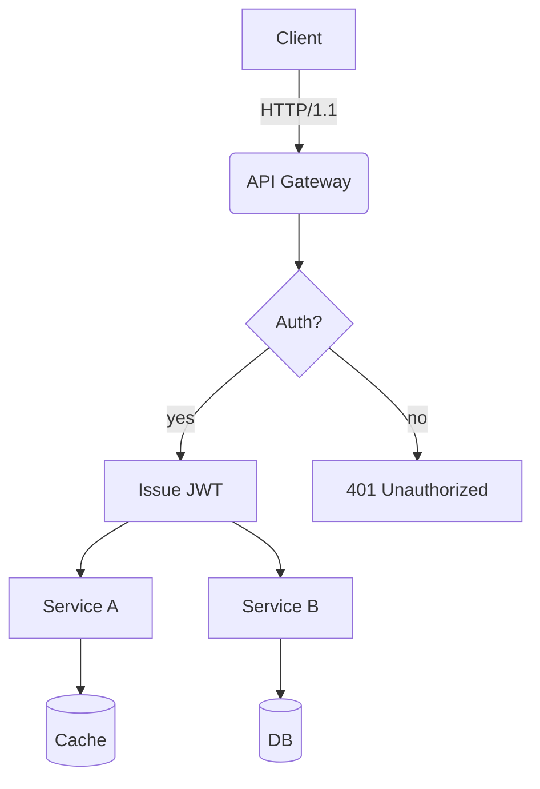
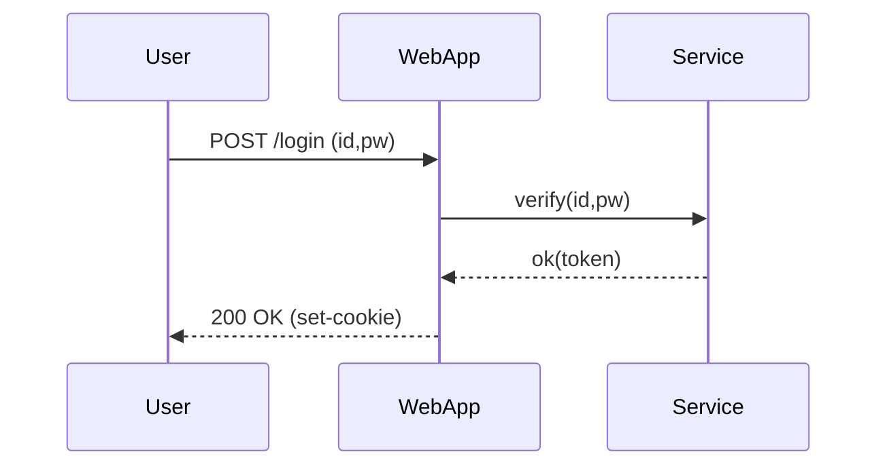
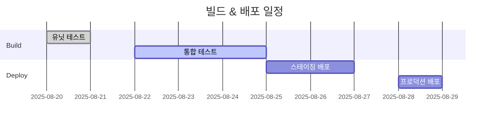
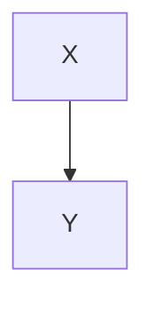

# Translation Test Document for **Rich Markdown**

This document is designed to contain a collection of various Korean content formats intended to exceed *4096 tokens*. The purpose is to test the robustness of translators/LLMs in handling context, preserving format, ignoring code/diagrams, etc.

> **Guide**
> 1) Ensure that code blocks and `mermaid` areas remain unchanged.
> 2) Verify the preservation of numbers/units (e.g., 1.2GB, 3ms), slash paths (`/var/log/app.log`), and options (`--flag`).
> 3) Layouts should remain intact even when mixed elements like tables, lists, quotations, checkboxes, equations, and emojis (😀) are included.

## 1. Table with Symbols/Units Mixed

| Item | Value | Unit | Comment |
|---|---|---|---|
| Throughput | 12,345 | RPS | Peak at 18,900 RPS |
| Latency (P50) | 3.2 | ms | `--enable-cache` enabled |
| Latency (P99) | 41.7 | ms | Includes GC phase |
| Memory | 1.5 | GB | RSS based, cgroup limit 2GB |
| Disk I/O | 220 | MB/s | Via NVMe-oF(TCP) |

## 2. Checklist (Task List)

- [x] Accuracy of Markdown Header Translation
- [x] Preservation of Keywords within Code Blocks (`for`, `if`, `return`, etc.)
- [ ] Preservation of Mermaid Diagrams and Ignoring Comments
- [ ] Preservation of Units (GB/ms/%), Paths (`/etc/hosts`)
- [ ] Preservation of Inline Equations $O(n \log n)$

## 3. Code Blocks: Bash/Python/JSON/YAML

```bash
#!/usr/bin/env bash
set -euo pipefail

APP_ENV="${APP_ENV:-prod}"
INPUT="${1:-/data/input.txt}"
OUT="/var/tmp/result.json"

echo "[INFO] starting job on $(hostname) at $(date -Iseconds)"
if [[ ! -f "$INPUT" ]]; then
  echo "[ERROR] input not found: $INPUT" >&2
  exit 1
fi

lines=$(wc -l < "$INPUT")
echo "[DEBUG] line count: $lines"

curl -sS -X POST "http://127.0.0.1:8080/api" \  -H "Content-Type: application/json" \  -d "{"env":"$APP_ENV","count":$lines}" > "$OUT"

jq -r '.status' "$OUT" | grep -q success && echo "OK" || { echo "FAIL"; exit 2; }
```

```python
from __future__ import annotations

def rolling_avg(xs: list[float], k: int) -> list[float]:
    if k <= 0:
        raise ValueError("k must be > 0")
    out = []
    acc = 0.0
    for i, v in enumerate(xs):
        acc += v
        if i >= k:
            acc -= xs[i-k]
        if i >= k - 1:
            out.append(acc / k)
    return out

print(rolling_avg([1,2,3,4,5,6,7,8,9], 3))
```

```json
{
  "service": "analytics",
  "version": "1.4.2",
  "features": ["rollup", "compaction", "delta-index"],
  "limits": {
    "max_docs": 1000000,
    "max_payload_mb": 256
  }
}
```

```yaml
apiVersion: v1
kind: ConfigMap
metadata:
  name: test-config
data:
  APP_ENV: "staging"
  ENDPOINT: "https://api.example.com"
```

## 4. Mermaid Diagrams

### 4.1 Flowchart


### 4.2 Sequence Diagram


### 4.3 Gantt Chart


## 5. Images/Links/Quotations


- Document: [https://example.com/docs/guide](https://example.com/docs/guide)
- API Reference: [API Reference](https://example.com/api)
- Issue Tracker: [https://example.com/issues](https://example.com/issues)

> “Translation quality is determined by the simultaneous preservation of layout and meaning.” — Anonymous

## 6. Mixed Equations and Text

- Average Time Complexity: $O(n \log n)$, Worst: $O(n^2)$
- Variance: $\sigma^2 = \frac{1}{n}\sum_{i=1}^{n}(x_i-\mu)^2$
- Sample Mean: $\bar{x} = \frac{1}{n}\sum x_i$

Paragraph Example: This paragraph is a sample to ensure that **bold**, *italic*, `code` snippets are preserved correctly even when mixed with other text elements during translation. It includes emojis 😀, Chinese characters 漢字, English CamelCase, snake_case, and kebab-case naming conventions.

### 7.1 Experimental Section — Transformation Patterns
The following section is similar but slightly varies in vocabulary and order each iteration to prevent redundant translations.
- Scenario: Summary of Dialogue Logs
- Condition: Includes 100k characters in Korean
- Expected Outcome: Summary accuracy rate of over 90%

#### Procedure
1. Input Data: `/data/input_01.jsonl`
2. Options: `--batch 512 --timeout 3s --enable-cache`
3. Execution: `app run --job test-01 --qos high`
4. Verification: Check if `test-01 finished` is included in logs

#### Observations
- Longer GC (Garbage Collection) cycles show an increasing trend in P99 latency
- Processing throughput decreases by approximately 7% when cache miss rate increases by 10%
- Increasing connection pool size from 32 to 64 results in a decrease in retry rate per second from 1.2% to 0.6%

### 7.2 Experiment Paragraph — Transformation Patterns
The following paragraph slightly varies vocabulary and order each iteration to prevent repetitive translation:
- Scenario: Summary of conversation logs
- Condition: Includes 100,000 characters in Korean
- Expected Result: Summary accuracy rate of over 90%

#### Procedure
1. Input Data: `/data/input_02.jsonl`
2. Options: `--batch 512 --timeout 3s --enable-cache`
3. Execution: `app run --job test-02 --qos high`
4. Verification: Check if `test-02 finished` is included in logs

#### Observations
- Longer GC (Garbage Collection) cycles show an increasing trend in P99 latency
- Processing throughput decreases by approximately 7% when cache miss ratio increases by 10%
- Increasing connection pool size from 32 to 64 results in a decrease in retry rate per second from 1.2% to 0.6%

### 7.3 Experiment Section — Variation Patterns
The following section is similar but slightly alters vocabulary and order each iteration to prevent repetitive translation.
- Scenario: Kubernetes Deployment
- Condition: HPA Enabled
- Expected Result: Scale within range of 2~10 nodes

#### Procedure
1. Input Data: `/data/input_03.jsonl`
2. Options: `--batch 512 --timeout 3s --enable-cache`
3. Execution: `app run --job test-03 --qos high`
4. Verification: Check if `test-03 finished` is included in logs

#### Observations
- Longer GC cycles show a tendency towards increased P99 latency
- Processing throughput decreases by approximately 7% when cache miss ratio increases by 10%
- Increasing connection pool size from 32 to 64 results in a decrease in retry rate per second from 1.2% to 0.6%

### 7.4 Experiment Paragraph — Transformation Patterns
The following paragraph slightly varies vocabulary and order each iteration to prevent repetitive translation:
- Scenario: Kubernetes Deployment
- Condition: HPA Enabled
- Expected Result: Scale within range of 2~10 nodes

#### Procedure
1. Input Data: `/data/input_04.jsonl`
2. Options: `--batch 512 --timeout 3s --enable-cache`
3. Execution: `app run --job test-04 --qos high`
4. Verification: Check if `test-04 finished` is included in logs

#### Observations
- Longer GC cycles show a tendency towards increased P99 latency
- Processing throughput decreases by approximately 7% when cache miss ratio increases by 10%
- Increasing connection pool size from 32 to 64 results in a decrease in retry rate per second from 1.2% to 0.6%

### 7.5 Experiment Paragraph — Transformation Patterns
The following paragraph slightly varies vocabulary and order each iteration to prevent repetitive translation:
- Scenario: Summary of conversation logs
- Condition: Includes 100,000 characters in Korean
- Expected Result: Summary accuracy rate of over 90%

#### Procedure
1. Input Data: `/data/input_05.jsonl`
2. Options: `--batch 512 --timeout 3s --enable-cache`
3. Execution: `app run --job test-05 --qos high`
4. Verification: Check if `test-05 finished` is included in logs

#### Observations
- Longer GC (Garbage Collection) cycles show an increasing trend in P99 latency
- Processing throughput decreases by approximately 7% when cache miss ratio increases by 10%
- Increasing connection pool size from 32 to 64 results in a decrease in retry rate per second from 1.2% to 0.6%

### 7.6 Experiment Paragraph — Transformation Patterns
The following paragraph slightly varies vocabulary and order each iteration to prevent repetitive translations.
- Scenario: Mermaid Rendering
- Conditions: Over 50 nodes, Over 100 edges
- Expected Result: No layout distortion

#### Procedure
1. Input Data: `/data/input_06.jsonl`
2. Options: `--batch 512 --timeout 3s --enable-cache`
3. Execution: `app run --job test-06 --qos high`
4. Verification: Check if `test-06 finished` is included in the logs

#### Observations
- Longer GC cycles show a tendency towards increased P99 latency
- Processing throughput decreases by approximately 7% when cache miss ratio increases by 10%
- Increasing connection pool size from 32 to 64 results in a decrease in retry rate per second from 1.2% to 0.6%

### 7.7 Experiment Section — Transformation Patterns
The following section is similar but slightly alters vocabulary and order each iteration to prevent repetitive translation.
- Scenario: Large-scale JSON Parsing
- Conditions: 64MB payload, 4 workers
- Expected Result: Completion without memory spikes

#### Procedure
1. Input Data: `/data/input_07.jsonl`
2. Options: `--batch 512 --timeout 3s --enable-cache`
3. Execution: `app run --job test-07 --qos high`
4. Verification: Check if `test-07 finished` is included in logs

#### Observations
- Longer GC cycles show a tendency towards increased P99 latency
- Processing throughput decreases by approximately 7% when cache miss ratio increases by 10%
- Increasing connection pool size from 32 to 64 results in a decrease in retry rate per second from 1.2% to 0.6%

### 7.8 Experiment Section — Transformation Patterns
The following section is similar but slightly alters vocabulary and order each iteration to prevent repetitive translation.
- Scenario: Large-scale JSON Parsing
- Conditions: 64MB payload, 4 workers
- Expected Result: Completion without memory spikes

#### Procedure
1. Input Data: `/data/input_08.jsonl`
2. Options: `--batch 512 --timeout 3s --enable-cache`
3. Execution: `app run --job test-08 --qos high`
4. Verification: Check if `test-08 finished` is included in logs

#### Observations
- Longer GC cycles show a tendency towards increased P99 latency
- Processing throughput decreases by approximately 7% when cache miss ratio increases by 10%
- Increasing connection pool size from 32 to 64 results in a decrease in retry rate per second from 1.2% to 0.6%

### 7.9 Experiment Paragraph — Transformation Patterns
The following paragraph slightly varies vocabulary and order each iteration to prevent repetitive translation:
- Scenario: Large-scale JSON Parsing
- Conditions: 64MB payload, 4 workers
- Expected Result: Completion without memory spikes

#### Procedure
1. Input Data: `/data/input_09.jsonl`
2. Options: `--batch 512 --timeout 3s --enable-cache`
3. Execution: `app run --job test-09 --qos high`
4. Verification: Check if `test-09 finished` is included in the logs

#### Observations
- Longer GC cycles show a tendency towards increased P99 latency
- Processing throughput decreases by approximately 7% when cache miss ratio increases by 10%
- Increasing connection pool size from 32 to 64 results in a decrease in retry rate per second from 1.2% to 0.6%

### 7.10 Experiment Paragraph — Variation Patterns
The following paragraph varies slightly in vocabulary and order each iteration to prevent repetitive translation:
- Scenario: NVMe-oF I/O Retries
- Condition: TCP RTT 2ms, Loss 0.1%
- Expected Result: Retry Rate ≤ 1%

#### Procedure
1. Input Data: `/data/input_10.jsonl`
2. Options: `--batch 512 --timeout 3s --enable-cache`
3. Execution: `app run --job test-10 --qos high`
4. Verification: Check if `test-10 finished` is included in the logs

#### Observations
- Longer GC cycles show a tendency towards increased P99 latency
- Processing throughput decreases by ~7% when cache miss ratio increases by 10%p
- Increasing connection pool size from 32 to 64 results in retry rate per second decreasing from 1.2% to 0.6%

### 7.11 Experiment Paragraph — Transformation Patterns
The following paragraph slightly varies vocabulary and order each iteration to prevent repetitive translation:
- Scenario: Large-scale JSON Parsing
- Conditions: 64MB payload, 4 workers
- Expected Result: Completion without memory spikes

#### Procedure
1. Input Data: `/data/input_11.jsonl`
2. Options: `--batch 512 --timeout 3s --enable-cache`
3. Execution: `app run --job test-11 --qos high`
4. Verification: Check if `test-11 finished` is included in logs

#### Observations
- Longer GC cycles show a tendency towards increased P99 latency
- Processing throughput decreases by approximately 7% when cache miss ratio increases by 10%
- Increasing connection pool size from 32 to 64 results in a decrease in retry rate per second from 1.2% to 0.6%

### 7.12 Experiment Paragraph — Transformation Patterns
The following paragraph slightly varies vocabulary and order each iteration to prevent repetitive translation:
- Scenario: Kubernetes Deployment
- Condition: HPA Enabled
- Expected Result: Scale within range of 2~10 nodes

#### Procedure
1. Input Data: `/data/input_12.jsonl`
2. Options: `--batch 512 --timeout 3s --enable-cache`
3. Execution: `app run --job test-12 --qos high`
4. Verification: Check if `test-12 finished` is included in logs

#### Observations
- Longer GC cycles show a tendency towards increased P99 latency
- Processing throughput decreases by approximately 7% when cache miss ratio increases by 10%
- Increasing connection pool size from 32 to 64 results in a decrease in retry rate per second from 1.2% to 0.6%

### 7.13 Experiment Paragraph — Transformation Patterns
The following paragraph slightly varies vocabulary and order each iteration to prevent repetitive translation:
- Scenario: Large-scale JSON Parsing
- Conditions: 64MB payload, 4 workers
- Expected Result: Completion without memory spikes

#### Procedure
1. Input Data: `/data/input_13.jsonl`
2. Options: `--batch 512 --timeout 3s --enable-cache`
3. Execution: `app run --job test-13 --qos high`
4. Verification: Check if `test-13 finished` is included in logs

#### Observations
- Longer GC cycles show a tendency towards increased P99 latency
- Processing throughput decreases by approximately 7% when cache miss ratio increases by 10%
- Increasing connection pool size from 32 to 64 results in a decrease in retry rate per second from 1.2% to 0.6%

### 7.14 Experiment Paragraph — Transformation Patterns
The following paragraph slightly varies vocabulary and order each iteration to prevent repetitive translation:
- Scenario: Large-scale JSON Parsing
- Conditions: 64MB payload, 4 workers
- Expected Result: Completion without memory spikes

#### Procedure
1. Input Data: `/data/input_14.jsonl`
2. Options: `--batch 512 --timeout 3s --enable-cache`
3. Execution: `app run --job test-14 --qos high`
4. Verification: Check if `test-14 finished` is included in logs

#### Observations
- Longer GC cycles show a tendency towards increased P99 latency
- Processing throughput decreases by approximately 7% when cache miss ratio increases by 10%
- Increasing connection pool size from 32 to 64 results in a decrease in retry rate per second from 1.2% to 0.6%

### 7.15 Experiment Paragraph — Variation Patterns
The following paragraph varies slightly in vocabulary and order each iteration to prevent repetitive translation:
- Scenario: NVMe-oF I/O Retries
- Condition: TCP RTT 2ms, Loss 0.1%
- Expected Result: Retry Rate ≤ 1%

#### Procedure
1. Input Data: `/data/input_15.jsonl`
2. Options: `--batch 512 --timeout 3s --enable-cache`
3. Execution: `app run --job test-15 --qos high`
4. Verification: Check if `test-15 finished` is included in the logs

#### Observations
- Longer GC cycles show a tendency towards increased P99 latency
- Processing throughput decreases by ~7% when cache miss ratio increases by 10%p
- Increasing connection pool size from 32 to 64 results in retry rate per second decreasing from 1.2% to 0.6%

### 7.16 Experiment Paragraph — Transformation Patterns
The following paragraph slightly varies vocabulary and order each iteration to prevent repetitive translations.
- Scenario: Mermaid Rendering
- Conditions: 50+ Nodes, 100+ Edges
- Expected Result: No Layout Distortion

#### Procedure
1. Input Data: `/data/input_16.jsonl`
2. Options: `--batch 512 --timeout 3s --enable-cache`
3. Execution: `app run --job test-16 --qos high`
4. Verification: Check if `test-16 finished` is included in the logs

#### Observations
- Longer GC cycles show a tendency towards increased P99 latency
- Processing throughput decreases by approximately 7% when cache miss ratio increases by 10%
- Increasing connection pool size from 32 to 64 results in a decrease in retry rate per second from 1.2% to 0.6%

### 7.17 Experimental Paragraph — Transformation Patterns
The following paragraph slightly varies vocabulary and order each iteration to prevent repetitive translation:
- Scenario: Summary of conversation logs
- Condition: Includes 100,000 characters in Korean
- Expected Result: Summary accuracy rate of over 90%

#### Procedure
1. Input Data: `/data/input_17.jsonl`
2. Options: `--batch 512 --timeout 3s --enable-cache`
3. Execution: `app run --job test-17 --qos high`
4. Verification: Check if `test-17 finished` is included in logs

#### Observations
- Longer GC (Garbage Collection) cycles show an increasing trend in P99 latency
- Processing throughput decreases by approximately 7% when cache miss ratio increases by 10%
- Increasing connection pool size from 32 to 64 results in a decrease in retry rate per second from 1.2% to 0.6%

### 7.18 Experiment Paragraph — Transformation Patterns
The following paragraph slightly varies vocabulary and order each iteration to prevent repetitive translation:
- Scenario: Large-scale JSON Parsing
- Conditions: 64MB payload, 4 workers
- Expected Result: Completion without memory spikes

#### Procedure
1. Input Data: `/data/input_18.jsonl`
2. Options: `--batch 512 --timeout 3s --enable-cache`
3. Execution: `app run --job test-18 --qos high`
4. Verification: Check if `test-18 finished` is included in the logs

#### Observations
- Longer GC cycles tend to show an increase in P99 latency
- Processing throughput decreases by approximately 7% when cache miss ratio increases by 10%
- Increasing connection pool size from 32 to 64 results in a decrease in retry rate per second from 1.2% to 0.6%

### 7.19 Experiment Paragraph — Transformation Patterns
The following paragraph slightly varies vocabulary and order each iteration to prevent repetitive translation:
- Scenario: Large-scale JSON Parsing
- Conditions: 64MB payload, 4 workers
- Expected Result: Completion without memory spikes

#### Procedure
1. Input Data: `/data/input_19.jsonl`
2. Options: `--batch 512 --timeout 3s --enable-cache`
3. Execution: `app run --job test-19 --qos high`
4. Verification: Check if `test-19 finished` is included in the logs

#### Observations
- Longer GC cycles tend to show an increase in P99 latency
- Processing throughput decreases by approximately 7% when cache miss ratio increases by 10%
- Increasing connection pool size from 32 to 64 results in a decrease in retry rate per second from 1.2% to 0.6%

### 7.20 Experiment Paragraph — Variation Patterns
The following paragraph varies slightly in vocabulary and order each iteration to prevent repetitive translation:
- Scenario: NVMe-oF I/O Retries
- Condition: TCP RTT 2ms, Loss 0.1%
- Expected Result: Retry Rate ≤ 1%

#### Procedure
1. Input Data: `/data/input_20.jsonl`
2. Options: `--batch 512 --timeout 3s --enable-cache`
3. Execution: `app run --job test-20 --qos high`
4. Verification: Check if `test-20 finished` is included in the logs

#### Observations
- Longer GC cycles show a tendency towards increased P99 latency
- Processing throughput decreases by ~7% when cache miss ratio increases by 10%p
- Increasing connection pool size from 32 to 64 results in retry rate per second decreasing from 1.2% to 0.6%

### 7.21 Experiment Paragraph — Transformation Patterns
The following paragraph slightly varies vocabulary and order each iteration to prevent repetitive translation:
- Scenario: Kubernetes Deployment
- Condition: HPA Enabled
- Expected Result: Scale within range of 2~10 nodes

#### Procedure
1. Input Data: `/data/input_21.jsonl`
2. Options: `--batch 512 --timeout 3s --enable-cache`
3. Execution: `app run --job test-21 --qos high`
4. Verification: Check if `test-21 finished` is included in logs

#### Observations
- Longer GC cycles show a tendency towards increased P99 latency
- Processing throughput decreases by approximately 7% when cache miss ratio increases by 10%
- Increasing connection pool size from 32 to 64 results in a decrease in retry rate per second from 1.2% to 0.6%

### 7.22 Experiment Paragraph — Transformation Patterns
The following paragraph slightly varies vocabulary and order each iteration to prevent repetitive translations.
- Scenario: Mermaid Rendering
- Conditions: 50+ Nodes, 100+ Edges
- Expected Result: No Layout Distortion

#### Procedure
1. Input Data: `/data/input_22.jsonl`
2. Options: `--batch 512 --timeout 3s --enable-cache`
3. Execution: `app run --job test-22 --qos high`
4. Verification: Check if `test-22 finished` is included in the logs

#### Observations
- Longer GC cycles show a tendency towards increased P99 latency
- Processing throughput decreases by approximately 7% when cache miss ratio increases by 10%
- Increasing connection pool size from 32 to 64 results in a decrease in retry rate per second from 1.2% to 0.6%

### 7.23 Experiment Paragraph — Transformation Patterns
The following paragraph slightly varies vocabulary and order each iteration to prevent repetitive translation:
- Scenario: Large-scale JSON Parsing
- Conditions: 64MB payload, 4 workers
- Expected Result: Completion without memory spikes

#### Procedure
1. Input Data: `/data/input_23.jsonl`
2. Options: `--batch 512 --timeout 3s --enable-cache`
3. Execution: `app run --job test-23 --qos high`
4. Verification: Check if `test-23 finished` is included in logs

#### Observations
- Longer GC cycles show a tendency towards increased P99 latency
- Processing throughput decreases by approximately 7% when cache miss ratio increases by 10%
- Increasing connection pool size from 32 to 64 results in a decrease in retry rate per second from 1.2% to 0.6%

### 7.24 Experiment Paragraph — Transformation Patterns
The following paragraph undergoes slight variations in vocabulary and order each iteration to prevent repetitive translations.
- Scenario: Mermaid Rendering
- Conditions: 50+ Nodes, 100+ Edges
- Expected Result: No Layout Distortion

#### Procedure
1. Input Data: `/data/input_24.jsonl`
2. Options: `--batch 512 --timeout 3s --enable-cache`
3. Execution: `app run --job test-24 --qos high`
4. Verification: Check if `test-24 finished` is included in the logs

#### Observations
- Longer GC cycles show a tendency towards increased P99 latency
- Processing throughput decreases by approximately 7% when cache miss ratio increases by 10%
- Increasing connection pool size from 32 to 64 results in a decrease in retry rate per second from 1.2% to 0.6%

### 7.25 Experiment Paragraph — Transformation Patterns
The following paragraph slightly varies vocabulary and order each iteration to prevent repetitive translation:
- Scenario: Kubernetes Deployment
- Condition: HPA Enabled
- Expected Result: Scale within range of 2~10 nodes

#### Procedure
1. Input Data: `/data/input_25.jsonl`
2. Options: `--batch 512 --timeout 3s --enable-cache`
3. Execution: `app run --job test-25 --qos high`
4. Verification: Check if `test-25 finished` is included in logs

#### Observations
- Longer GC cycles show a tendency towards increased P99 latency
- Processing throughput decreases by approximately 7% when cache miss ratio increases by 10%
- Increasing connection pool size from 32 to 64 results in a decrease in retry rate per second from 1.2% to 0.6%

### 7.26 Experiment Paragraph — Variation Patterns
The following paragraph varies slightly in vocabulary and order each iteration to prevent repetitive translation:
- Scenario: NVMe-oF I/O Retries
- Condition: TCP RTT 2ms, Loss 0.1%
- Expected Result: Retry Rate ≤ 1%

#### Procedure
1. Input Data: `/data/input_26.jsonl`
2. Options: `--batch 512 --timeout 3s --enable-cache`
3. Execution: `app run --job test-26 --qos high`
4. Verification: Check if `test-26 finished` is included in the logs

#### Observations
- Longer GC cycles show a tendency towards increased P99 latency
- Processing throughput decreases by ~7% when cache miss ratio increases by 10%p
- Increasing connection pool size from 32 to 64 results in retry rate per second decreasing from 1.2% to 0.6%

### 7.27 Experimental Paragraph — Transformation Patterns
The following paragraph undergoes slight variations in vocabulary and order each iteration to prevent repetitive translations.
- Scenario: Summary of Dialogue Logs
- Condition: Includes 100,000 characters in Korean
- Expected Result: Summary accuracy rate of over 90%

#### Procedure
1. Input Data: `/data/input_27.jsonl`
2. Options: `--batch 512 --timeout 3s --enable-cache`
3. Execution: `app run --job test-27 --qos high`
4. Verification: Check if `test-27 finished` is included in the logs

#### Observations
- Longer GC (Garbage Collection) cycles show an increasing trend in P99 latency
- Processing throughput decreases by approximately 7% when cache miss ratio increases by 10%
- Increasing connection pool size from 32 to 64 results in a decrease in retry rate per second from 1.2% to 0.6%

### 7.28 Experiment Paragraph — Transformation Pattern
The following paragraph slightly varies vocabulary and order each iteration to prevent repetitive translation:
- Scenario: Summary of conversation logs
- Condition: Includes 100,000 characters in Korean
- Expected Result: Summary accuracy rate of over 90%

#### Procedure
1. Input Data: `/data/input_28.jsonl`
2. Options: `--batch 512 --timeout 3s --enable-cache`
3. Execution: `app run --job test-28 --qos high`
4. Verification: Check if `test-28 finished` is included in logs

#### Observations
- Longer GC (Garbage Collection) cycles show an increasing trend in P99 latency
- Processing throughput decreases by approximately 7% when cache miss ratio increases by 10%
- Increasing connection pool size from 32 to 64 results in a decrease in retry rate per second from 1.2% to 0.6%

### 7.29 Experiment Paragraph — Transformation Pattern
The following paragraph slightly varies vocabulary and order each iteration to prevent repetitive translation:
- Scenario: Large-scale JSON Parsing
- Conditions: 64MB payload, 4 workers
- Expected Result: Completion without memory spikes

#### Procedure
1. Input Data: `/data/input_29.jsonl`
2. Options: `--batch 512 --timeout 3s --enable-cache`
3. Execution: `app run --job test-29 --qos high`
4. Verification: Check if `test-29 finished` is included in logs

#### Observations
- Longer GC cycles show a tendency towards increased P99 latency
- Processing throughput decreases by approximately 7% when cache miss ratio increases by 10%
- Increasing connection pool size from 32 to 64 results in a decrease in retry rate per second from 1.2% to 0.6%

### 7.30 Experiment Paragraph — Transformation Patterns
The following paragraph slightly varies vocabulary and order each iteration to prevent repetitive translation:
- Scenario: Summary of Dialogue Record
- Condition: Includes 100,000 characters in Korean
- Expected Result: Summary accuracy rate of over 90%

#### Procedure
1. Input Data: `/data/input_30.jsonl`
2. Options: `--batch 512 --timeout 3s --enable-cache`
3. Execution: `app run --job test-30 --qos high`
4. Verification: Check if `test-30 finished` is included in logs

#### Observations
- Longer GC (Garbage Collection) cycles show an increasing trend in P99 latency
- Processing throughput decreases by approximately 7% when cache miss ratio increases by 10%
- Increasing connection pool size from 32 to 64 results in a decrease in retry rate per second from 1.2% to 0.6%

### 7.31 Experiment Paragraph — Transformation Patterns
The following paragraph slightly varies vocabulary and order each iteration to prevent repetitive translation:
- Scenario: Kubernetes Deployment
- Condition: HPA Enabled
- Expected Result: Scale within range of 2~10 nodes

#### Procedure
1. Input Data: `/data/input_31.jsonl`
2. Options: `--batch 512 --timeout 3s --enable-cache`
3. Execution: `app run --job test-31 --qos high`
4. Verification: Check if `test-31 finished` is included in logs

#### Observations
- Longer GC cycles show a tendency towards increased P99 latency
- Processing throughput decreases by approximately 7% when cache miss ratio increases by 10%
- Increasing connection pool size from 32 to 64 results in a decrease in retry rate per second from 1.2% to 0.6%

### 7.32 Experiment Paragraph — Transformation Patterns
The following paragraph slightly varies vocabulary and order each iteration to prevent repetitive translations.
- Scenario: Mermaid Rendering
- Conditions: 50+ Nodes, 100+ Edges
- Expected Result: No Layout Distortion

#### Procedure
1. Input Data: `/data/input_32.jsonl`
2. Options: `--batch 512 --timeout 3s --enable-cache`
3. Execution: `app run --job test-32 --qos high`
4. Verification: Check if `test-32 finished` is included in the logs

#### Observations
- Longer GC cycles show a tendency towards increased P99 latency
- Processing throughput decreases by approximately 7% when cache miss ratio increases by 10%
- Increasing connection pool size from 32 to 64 results in a decrease in retry rate per second from 1.2% to 0.6%

### 7.33 Experiment Paragraph — Transformation Patterns
The following paragraph slightly varies vocabulary and order each iteration to prevent repetitive translation:
- Scenario: Large-scale JSON Parsing
- Conditions: 64MB payload, 4 workers
- Expected Result: Completion without memory spikes

#### Procedure
1. Input Data: `/data/input_33.jsonl`
2. Options: `--batch 512 --timeout 3s --enable-cache`
3. Execution: `app run --job test-33 --qos high`
4. Verification: Check if `test-33 finished` is included in logs

#### Observations
- Longer GC cycles show a tendency towards increased P99 latency
- Processing throughput decreases by approximately 7% when cache miss ratio increases by 10%
- Increasing connection pool size from 32 to 64 results in a decrease in retry rate per second from 1.2% to 0.6%

### 7.34 Experiment Paragraph — Transformation Patterns
The following paragraph slightly varies vocabulary and order each iteration to prevent repetitive translation:
- Scenario: Kubernetes Deployment
- Condition: HPA Enabled
- Expected Result: Scale within range of 2~10 nodes

#### Procedure
1. Input Data: `/data/input_34.jsonl`
2. Options: `--batch 512 --timeout 3s --enable-cache`
3. Execution: `app run --job test-34 --qos high`
4. Verification: Check if `test-34 finished` is included in logs

#### Observations
- Longer GC cycles show a tendency towards increased P99 latency
- Processing throughput decreases by approximately 7% when cache miss ratio increases by 10%
- Increasing connection pool size from 32 to 64 results in a decrease in retry rate per second from 1.2% to 0.6%

### 7.35 Experiment Paragraph — Transformation Pattern
The following paragraph slightly varies vocabulary and order each iteration to prevent repetitive translation:
- Scenario: Mermaid Rendering
- Conditions: 50+ Nodes, 100+ Edges
- Expected Result: No Layout Distortion

#### Procedure
1. Input Data: `/data/input_35.jsonl`
2. Options: `--batch 512 --timeout 3s --enable-cache`
3. Execution: `app run --job test-35 --qos high`
4. Verification: Check if `test-35 finished` is included in the logs

#### Observations
- Longer GC cycles show a tendency towards increased P99 latency
- Processing throughput decreases by approximately 7% when cache miss ratio increases by 10%
- Increasing connection pool size from 32 to 64 results in a decrease in retry rate per second from 1.2% to 0.6%

### 7.36 Experiment Paragraph — Variation Patterns
The following paragraph varies slightly in vocabulary and order each iteration to prevent repetitive translation:
- Scenario: NVMe-oF I/O Retries
- Condition: TCP RTT 2ms, Loss 0.1%
- Expected Result: Retry Rate ≤ 1%

#### Procedure
1. Input Data: `/data/input_36.jsonl`
2. Options: `--batch 512 --timeout 3s --enable-cache`
3. Execution: `app run --job test-36 --qos high`
4. Verification: Check if `test-36 finished` is included in the logs

#### Observations
- Longer GC cycles show a tendency towards increased P99 latency
- Processing throughput decreases by ~7% when cache miss ratio increases by 10%p
- Increasing connection pool size from 32 to 64 results in retry rate per second decreasing from 1.2% to 0.6%

### 7.37 Experiment Paragraph — Transformation Patterns
The following paragraph slightly varies vocabulary and order each iteration to prevent repetitive translation:
- Scenario: Large-scale JSON Parsing
- Conditions: 64MB payload, 4 workers
- Expected Result: Completion without memory spikes

#### Procedure
1. Input Data: `/data/input_37.jsonl`
2. Options: `--batch 512 --timeout 3s --enable-cache`
3. Execution: `app run --job test-37 --qos high`
4. Verification: Check if `test-37 finished` is included in logs

#### Observations
- Longer GC cycles show a tendency towards increased P99 latency
- Processing throughput decreases by approximately 7% when cache miss ratio increases by 10%
- Increasing connection pool size from 32 to 64 results in a decrease in retry rate per second from 1.2% to 0.6%

### 7.38 Experiment Paragraph — Transformation Pattern
The following paragraph slightly varies vocabulary and order each iteration to prevent repetitive translation:
- Scenario: Mermaid Rendering
- Condition: Over 50 nodes, Over 100 edges
- Expected Result: No layout distortion

#### Procedure
1. Input Data: `/data/input_38.jsonl`
2. Options: `--batch 512 --timeout 3s --enable-cache`
3. Execution: `app run --job test-38 --qos high`
4. Verification: Check if `test-38 finished` is included in the logs

#### Observations
- Longer GC cycles show a tendency towards increased P99 latency
- Processing throughput decreases by approximately 7% when cache miss ratio increases by 10%
- Increasing connection pool size from 32 to 64 results in a decrease in retry rate per second from 1.2% to 0.6%

### 7.39 Experiment Paragraph — Transformation Pattern
The following paragraph slightly varies vocabulary and order each iteration to prevent repetitive translation:
- Scenario: Mermaid Rendering
- Conditions: 50+ Nodes, 100+ Edges
- Expected Result: No Layout Distortion

#### Procedure
1. Input Data: `/data/input_39.jsonl`
2. Options: `--batch 512 --timeout 3s --enable-cache`
3. Execution: `app run --job test-39 --qos high`
4. Verification: Check if `test-39 finished` is included in the logs

#### Observations
- Longer GC cycles show a tendency towards increased P99 latency
- Processing throughput decreases by approximately 7% when cache miss ratio increases by 10%
- Increasing connection pool size from 32 to 64 results in a decrease in retry rate per second from 1.2% to 0.6%

### 7.40 Experimental Paragraph — Transformation Patterns
The following paragraph slightly varies vocabulary and order each iteration to prevent repetitive translation:
- Scenario: Summary of conversation logs
- Condition: Includes 100,000 characters in Korean
- Expected Result: Summary accuracy rate of over 90%

#### Procedure
1. Input Data: `/data/input_40.jsonl`
2. Options: `--batch 512 --timeout 3s --enable-cache`
3. Execution: `app run --job test-40 --qos high`
4. Verification: Check if `test-40 finished` is included in logs

#### Observations
- Longer GC (Garbage Collection) cycles show an increasing trend in P99 latency
- Processing throughput decreases by approximately 7% when cache miss ratio increases by 10%
- Increasing connection pool size from 32 to 64 results in a decrease in retry rate per second from 1.2% to 0.6%

## 8. Long List of Items

- 2. Error Handling Consistency — Case #001
- 3. Performance Profiling — Case #002
- 4. Accessibility (a11y) — Case #003
- 5. Log Schema Stability — Case #004
- 6. Cache Invalidation Scenarios — Case #005
- 7. Performance Profiling — Case #006
- 8. Performance Profiling — Case #007
- 9. API Backward Compatibility — Case #008
- 10. Log Schema Stability — Case #009
- 11. Accessibility (a11y) — Case #010
- 12. Cache Invalidation Scenarios — Case #011
- 13. Performance Profiling — Case #012
- 14. Security Header Implementation — Case #013
- 15. Resource Leak Detection — Case #015
- 16. Error Handling Consistency — Case #016
- 17. Error Handling Consistency — Case #017
- 18. Internationalization (i18n) — Case #018
- 19. CORS Policy Validation — Case #019
- 20. Performance Profiling — Case #020
- 21. Security Header Implementation — Case #021
- 22. Log Schema Stability — Case #022
- 23. Performance Profiling — Case #023
- 24. Cache Invalidation Scenarios — Case #024
- 25. CORS Policy Validation — Case #025
- 26. Performance Profiling — Case #026
- 27. Accessibility (a11y) — Case #027
- 28. Accessibility (a11y) — Case #028
- 29. API Backward Compatibility — Case #029
- 30. Cache Invalidation Scenarios — Case #030
- 31. Cache Invalidation Scenarios — Case #031
- 32. Performance Profiling — Case #032
- 33. Resource Leak Detection — Case #033
- 34. Log Schema Stability — Case #034
- 35. CORS Policy Validation — Case #035
- 36. Error Handling Consistency — Case #036
- 37. Resource Leak Detection — Case #037
- 38. Error Handling Consistency — Case #038
- 39. Internationalization (i18n) — Case #039
- 40. API Backward Compatibility — Case #040
- 41. Cache Invalidation Scenarios — Case #041
- 42. Cache Invalidation Scenarios — Case #042
- 43. Cache Invalidation Scenarios — Case #043
- 44. Performance Profiling — Case #044
- 45. Performance Profiling — Case #045
- 46. CORS Policy Validation — Case #046
- 47. Resource Leak Detection — Case #047
- 48. Cache Invalidation Scenarios — Case #048
- 49. Error Handling Consistency — Case #049
- 50. Log Schema Stability — Case #050
- 51. Resource Leak Detection — Case #051
- 52. Internationalization (i18n) — Case #052
- 53. Log Schema Stability — Case #053
- 54. Resource Leak Detection — Case #054
- 55. Security Header Implementation — Case #055
- 56. Internationalization (i18n) — Case #056
- 57. API Backward Compatibility — Case #057
- 58. Accessibility (a11y) — Case #058
- 59. API Backward Compatibility — Case #059
- 60. Performance Profiling — Case #060
- 61. Accessibility (a11y) — Case #061
- 62. API Backward Compatibility — Case #062
- 63. Internationalization (i18n) — Case #063
- 64. Security Header Implementation — Case #064
- 65. Error Handling Consistency — Case #065
- 66. Performance Profiling — Case #066
- 67. Accessibility (a11y) — Case #067
- 68. Error Handling Consistency — Case #068
- 69. Performance Profiling — Case #069
- 70. Resource Leak Detection — Case #070
- 71. Accessibility (a11y) — Case #071
- 72. Internationalization (i18n) — Case #072
- 73. Error Handling Consistency — Case #073
- 74. Internationalization (i18n) — Case #074
- 75. Performance Profiling — Case #075
- 76. Security Header Implementation — Case #076
- 77. CORS Policy Validation — Case #077
- 78. Resource Leak Detection — Case #078
- 79. Resource Leak Detection — Case #079
- 80. Performance Profiling — Case #080
- 81. Accessibility (a11y) — Case #081
- 82. Accessibility (a11y) — Case #082
- 83. Performance Profiling — Case #083
- 84. Resource Leak Detection — Case #084
- 85. Accessibility (a11y) — Case #085
- 86. Cache Invalidation Scenarios — Case #086
- 87. CORS Policy Validation — Case #087
- 88. Log Schema Stability — Case #088
- 89. CORS Policy Validation — Case #089
- 90. Security Header Implementation — Case #090
- 91. API Backward Compatibility — Case #091
- 92. Accessibility (a11y) — Case #092
- 93. Performance Profiling — Case #093
- 94. Performance Profiling — Case #094
- 95. Log Schema Stability — Case #095
- 96. Internationalization (i18n) — Case #096
- 97. API Backward Compatibility — Case #097
- 98. Security Header Implementation — Case #098
- 99. Error Handling Consistency — Case #099
- 100. Cache Invalidation Scenarios — Case #100
- 101. Accessibility (a11y) — Case #101
- 102. Internationalization (i18n) — Case #102
- 103. Accessibility (a11y) — Case #103
- 104. API Backward Compatibility — Case #104
- 105. Accessibility (a11y) — Case #105
- 106. Performance Profiling — Case #106
- 107. Security Header Implementation — Case #107
- 108. API Backward Compatibility — Case #108
- 109. Security Header Implementation — Case #109
- 110. Error Handling Consistency — Case #110
- 111. Performance Profiling — Case #111
- 112. Resource Leak Detection — Case #112
- 113. CORS Policy Validation — Case #113
- 114. Accessibility (a11y) — Case #114
- 115. Error Handling Consistency — Case #115
- 116. Error Handling Consistency — Case #116
- 117. Performance Profiling — Case #117
- 118. CORS Policy Validation — Case #118
- 119. Resource Leak Detection — Case #119
- 120. Cache Invalidation Scenarios — Case #120
- 121. CORS Policy Validation — Case #121
- 122. Performance Profiling — Case #122
- 123. Error Handling Consistency — Case #123
- 124. Performance Profiling — Case #124
- 125. Resource Leak Detection — Case #125
- 126. Internationalization (i18n) — Case #126
- 127. Accessibility (a11y) — Case #127
- 128. Error Handling Consistency — Case #128
- 129. Performance Profiling — Case #129
- 130. Accessibility (a11y) — Case #130
- 131. API Backward Compatibility — Case #131
- 132. Accessibility (a11y) — Case #132
- 133. Performance Profiling — Case #133
- 134. Resource Leak Detection — Case #134
- 135. CORS Policy Validation — Case #135
- 136. Error Handling Consistency — Case #136
- 137. Internationalization (i18n) — Case #137
- 138. Accessibility (a11y) — Case #138
- 139. Performance Profiling — Case #139
- 140. Security Header Implementation — Case #140
- 141. CORS Policy Validation — Case #141
- 142. Resource Leak Detection — Case #142
- 143. Cache Invalidation Scenarios — Case #143
- 144. CORS Policy Validation — Case #144
- 145. Performance Profiling — Case #145
- 146. Error Handling Consistency — Case #146
- 147. Performance Profiling — Case #147
- 148. Accessibility (a11y) — Case #148
- 149. Error Handling Consistency — Case #149
- 150. Performance Profiling — Case #150
- 151. Resource Leak Detection — Case #151
- 152. Internationalization (i18n) — Case #152
- 153. Log Schema Stability — Case #153
- 154. CORS Policy Validation — Case #154
- 155. Resource Leak Detection — Case #155
- 156. Performance Profiling — Case #156
- 157. Accessibility (a11y) — Case #157
- 158. Internationalization (i18n) — Case #158
- 159. Error Handling Consistency — Case #159
- 160. Internationalization (i18n) — Case #160
- 161. Performance Profiling — Case #161
- 162. Security Header Implementation — Case #162
- 163. API Backward Compatibility — Case #163
- 164. Accessibility (a11y) — Case #164
- 165. API Backward Compatibility — Case #165
- 166. Security Header Implementation — Case #166
- 167. Error Handling Consistency — Case #167
- 168. Performance Profiling — Case #168
- 169. Accessibility (a11y) — Case #169
- 170. Error Handling Consistency — Case #170
- 171. Performance Profiling — Case #171
- 172. Resource Leak Detection — Case #172
- 173. Accessibility (a11y) — Case #173
- 174. Internationalization (i18n) — Case #174
- 175. Error Handling Consistency — Case #175
- 176. Internationalization (i18n) — Case #176
- 177. Performance Profiling — Case #177
- 178. Security Header Implementation — Case #178
- 179. CORS Policy Validation — Case #179
- 180. Resource Leak Detection — Case #180
- 181. Resource Leak Detection — Case #181
- 182. Performance Profiling — Case #182
- 183. Accessibility (a11y) — Case #183
- 184. Accessibility (a11y) — Case #184
- 185. Performance Profiling — Case #185
- 186. Resource Leak Detection — Case #186
- 187. Accessibility (a11y) — Case #187
- 188. Cache Invalidation Scenarios — Case #188
- 189. CORS Policy Validation — Case #189
- 190. Log Schema Stability — Case #190
- 191. CORS Policy Validation — Case #191
- 192. Security Header Implementation — Case #192
- 193. API Backward Compatibility — Case #193
- 194. Accessibility (a11y) — Case #194
- 195. Performance Profiling — Case #195
- 196. Performance Profiling — Case #196
- 197. Log Schema Stability — Case #197
- 198. Internationalization (i18n) — Case #198
- 199. API Backward Compatibility — Case #199
- 200. Error Handling Consistency — Case #200
- 201. Cache Invalidation Scenarios — Case #201
- 202. Accessibility (a11y) — Case #202
- 203. Cache Invalidation Scenarios — Case #203
- 204. Cache Invalidation Scenarios — Case #204
- 205. Performance Profiling — Case #205
- 206. Performance Profiling — Case #206
- 207. CORS Policy Validation — Case #207
- 208. Resource Leak Detection — Case #208
- 209. Accessibility (a11y) — Case #209
- 210. Internationalization (i18n) — Case #210
- 211. Error Handling Consistency — Case #211
- 212. Internationalization (i18n) — Case #212
- 213. Performance Profiling — Case #213
- 214. Security Header Implementation — Case #214
- 215. CORS Policy Validation — Case #215
- 216. Resource Leak Detection — Case #216
- 217. Cache Invalidation Scenarios — Case #217
- 218. CORS Policy Validation — Case #218
- 219. Performance Profiling — Case #219
- 220. Error Handling Consistency — Case #220
- 221. Performance Profiling — Case #221
- 222. Resource Leak Detection — Case #222
- 223. Accessibility (a11y) — Case #223
- 224. Internationalization (i18n) — Case #224
- 225. Error Handling Consistency — Case #225
- 226. Internationalization (i18n) — Case #226
- 227. Performance Profiling — Case #227
- 228. Security Header Implementation — Case #228
- 229. CORS Policy Validation — Case #229
- 230. Resource Leak Detection — Case #230
- 231. Cache Invalidation Scenarios — Case #231
- 232. CORS Policy Validation — Case #232
- 233. Performance Profiling — Case #233
- 234. Accessibility (a11y) — Case #234
- 235. Error Handling Consistency — Case #235
- 236. Performance Profiling — Case #236
- 237. Resource Leak Detection — Case #237
- 238. Accessibility (a11y) — Case #238
- 126. Performance Profiling — Case #125
- 127. Accessibility (a11y) — Case #126
- 128. Accessibility (a11y) — Case #127
- 129. Error Handling Consistency — Case #128
- 130. Error Handling Consistency — Case #129
- 131. API Backward Compatibility — Case #130
- 132. Accessibility (a11y) — Case #131
- 133. API Backward Compatibility — Case #132
- 134. Cache Invalidation Scenarios — Case #133
- 135. Security Headers Implementation — Case #134
- 136. Internationalization (i18n) — Case #135
- 137. Security Headers Implementation — Case #136
- 138. Performance Profiling — Case #137
- 139. Performance Profiling — Case #138
- 140. CORS Policy Validation — Case #139
- 141. Internationalization (i18n) — Case #140
- 142. Log Schema Stability — Case #141
- 143. CORS Policy Validation — Case #142
- 144. Accessibility (a11y) — Case #143
- 145. Security Headers Implementation — Case #144
- 146. Log Schema Stability — Case #145
- 147. Performance Profiling — Case #146
- 148. Performance Profiling — Case #147
- 149. API Backward Compatibility — Case #148
- 150. Resource Leak Detection — Case #149
- 151. Performance Profiling — Case #150
- 152. Resource Leak Detection — Case #151
- 153. Accessibility (a11y) — Case #152
- 154. API Backward Compatibility — Case #153
- 155. Accessibility (a11y) — Case #154
- 156. Security Headers Implementation — Case #155
- 157. Performance Profiling — Case #156
- 158. Cache Invalidation Scenarios — Case #157
- 159. Security Headers Implementation — Case #158
- 160. Internationalization (i18n) — Case #159
- 161. Log Schema Stability — Case #160
- 162. CORS Policy Validation — Case #161
- 163. Internationalization (i18n) — Case #162
- 164. Performance Profiling — Case #163
- 165. Performance Profiling — Case #164
- 166. API Backward Compatibility — Case #165
- 167. Resource Leak Detection — Case #166
- 168. CORS Policy Validation — Case #167
- 169. Internationalization (i18n) — Case #168
- 170. Cache Invalidation Scenarios — Case #169
- 171. Resource Leak Detection — Case #170
- 172. Security Headers Implementation — Case #171
- 173. Resource Leak Detection — Case #172
- 174. Accessibility (a11y) — Case #173
- 175. Security Headers Implementation — Case #174
- 176. Log Schema Stability — Case #175
- 177. CORS Policy Validation — Case #176
- 178. Security Headers Implementation — Case #177
- 179. Log Schema Stability — Case #178
- 180. Performance Profiling — Case #179
- 181. Resource Leak Detection — Case #180
- 182. Internationalization (i18n) — Case #181
- 183. Log Schema Stability — Case #182
- 184. Accessibility (a11y) — Case #183
- 185. Security Headers Implementation — Case #184
- 186. Resource Leak Detection — Case #185
- 187. Accessibility (a11y) — Case #186
- 188. API Backward Compatibility — Case #187
- 189. Accessibility (a11y) — Case #188
- 190. Cache Invalidation Scenarios — Case #189
- 191. Accessibility (a11y) — Case #190
- 192. Cache Invalidation Scenarios — Case #191
- 193. Error Handling Consistency — Case #192
- 194. Error Handling Consistency — Case #193
- 195. Resource Leak Detection — Case #194
- 196. Error Handling Consistency — Case #195
- 197. CORS Policy Validation — Case #196
- 198. Performance Profiling — Case #197
- 199. Resource Leak Detection — Case #198
- 200. Accessibility (a11y) — Case #199
- 201. Resource Leak Detection — Case #200
- 202. Cache Invalidation Scenarios — Case #201
- 203. Internationalization (i18n) — Case #202
- 204. Log Schema Stability — Case #203
- 205. Error Handling Consistency — Case #204
- 206. Resource Leak Detection — Case #205
- 207. Security Headers Implementation — Case #206
- 208. Resource Leak Detection — Case #207
- 209. Cache Invalidation Scenarios — Case #208
- 210. Performance Profiling — Case #209
- 211. Security Headers Implementation — Case #210
- 212. Internationalization (i18n) — Case #211
- 213. Log Schema Stability — Case #212
- 214. Error Handling Consistency — Case #213
- 215. Cache Invalidation Scenarios — Case #214
- 216. Security Headers Implementation — Case #215
- 217. Internationalization (i18n) — Case #216
- 218. Security Headers Implementation — Case #217
- 219. Performance Profiling — Case #218
- 220. Error Handling Consistency — Case #219
- 221. Security Headers Implementation — Case #220
- 222. Performance Profiling — Case #221
- 223. API Backward Compatibility — Case #222
- 224. Resource Leak Detection — Case #223
- 225. Internationalization (i18n) — Case #224
- 226. Security Headers Implementation — Case #225
- 227. Internationalization (i18n) — Case #226
- 228. Performance Profiling — Case #227
- 229. Log Schema Stability — Case #228
- 230. CORS Policy Validation — Case #229
- 231. Performance Profiling — Case #230
- 232. API Backward Compatibility — Case #231
- 233. CORS Policy Validation — Case #232
- 234. Internationalization (i18n) — Case #233
- 235. Error Handling Consistency — Case #234
- 236. Performance Profiling — Case #235
- 237. Error Handling Consistency — Case #236
- 238. Performance Profiling — Case #237
- 239. Security Headers Implementation — Case #238
- 240. Error Handling Consistency — Case #239
- 241. CORS Policy Validation — Case #240
- 242. API Backward Compatibility — Case #241
- 243. Performance Profiling — Case #242
- 244. Cache Invalidation Scenarios — Case #243
- 245. Performance Profiling — Case #244
- 246. Security Headers Implementation — Case #245
- 247. Internationalization (i18n) — Case #246
- 248. Error Handling Consistency — Case #247
- 249. Resource Leak Detection — Case #248
- 250. Cache Invalidation Scenarios — Case #249
- 251. Accessibility (a11y) — Case #250
- 252. Security Headers Implementation — Case #251
- 253. Resource Leak Detection — Case #252
- 254. Cache Invalidation Scenarios — Case #253
- 255. Accessibility (a11y) — Case #254
- 256. Cache Invalidation Scenarios — Case #255
- 257. Error Handling Consistency — Case #256
- 258. Error Handling Consistency — Case #257
- 259. Resource Leak Detection — Case #258
- 260. CORS Policy Validation — Case #259
- 261. Performance Profiling — Case #260
- 262. Resource Leak Detection — Case #261
- 263. Internationalization (i18n) — Case #262
- 264. Log Schema Stability — Case #263
- 265. Error Handling Consistency — Case #264
- 266. Resource Leak Detection — Case #265
- 267. Security Headers Implementation — Case #266
- 268. Resource Leak Detection — Case #267
- 269. Cache Invalidation Scenarios — Case #268
- 270. Performance Profiling — Case #269
- 271. Security Headers Implementation — Case #270
- 272. Internationalization (i18n) — Case #271
- 273. Log Schema Stability — Case #272
- 274. Error Handling Consistency — Case #273
- 275. Cache Invalidation Scenarios — Case #274
- 276. Security Headers Implementation — Case #275
- 277. Internationalization (i18n) — Case #276
- 278. Security Headers Implementation — Case #277
- 279. Performance Profiling — Case #278
- 280. Error Handling Consistency — Case #279
- 281. Performance Profiling — Case #280
- 282. API Backward Compatibility — Case #281
- 283. Resource Leak Detection — Case #282
- 284. Internationalization (i18n) — Case #283
- 285. Security Headers Implementation — Case #284
- 286. Internationalization (i18n) — Case #285
- 287. Performance Profiling — Case #286
- 288. Log Schema Stability — Case #287
- 289. CORS Policy Validation — Case #288
- 290. Performance Profiling — Case #289
- 291. API Backward Compatibility — Case #290
- 292. CORS Policy Validation — Case #291
- 293. Internationalization (i18n) — Case #292
- 294. Error Handling Consistency — Case #293
- 295. Performance Profiling — Case #294
- 296. Resource Leak Detection — Case #295
- 297. Accessibility (a11y) — Case #296
- 298. API Backward Compatibility — Case #297
- 299. Accessibility (a11y) — Case #298
- 300. Cache Invalidation Scenarios — Case #299
- 301. Accessibility (a11y) — Case #300
- 302. Security Headers Implementation — Case #301
- 303. Accessibility (a11y) — Case #302
- 304. Performance Profiling — Case #303
- 305. Cache Invalidation Scenarios — Case #304
- 306. Accessibility (a11y) — Case #305
- 307. Security Headers Implementation — Case #306
- 308. Accessibility (a11y) — Case #307
- 309. Performance Profiling — Case #308
- 310. Cache Invalidation Scenarios — Case #309
- 311. Resource Leak Detection — Case #310
- 312. Security Headers Implementation — Case #311
- 313. Accessibility (a11y) — Case #312
- 314. Cache Invalidation Scenarios — Case #313
- 315. Resource Leak Detection — Case #314
- 316. Accessibility (a11y) — Case #315
- 317. Cache Invalidation Scenarios — Case #316
- 318. Resource Leak Detection — Case #317
- 319. CORS Policy Validation — Case #318
- 320. Performance Profiling — Case #319
- 321. Resource Leak Detection — Case #320
- 322. Internationalization (i18n) — Case #321
- 323. Log Schema Stability — Case #322
- 324. Error Handling Consistency — Case #323
- 325. Resource Leak Detection — Case #324
- 326. Security Headers Implementation — Case #325
- 327. Resource Leak Detection — Case #326
- 328. Cache Invalidation Scenarios — Case #327
- 329. Performance Profiling — Case #328
- 330. Security Headers Implementation — Case #329
- 331. Internationalization (i18n) — Case #330
- 332. Cache Invalidation Scenarios — Case #331
- 333. Performance Profiling — Case #332
- 334. API Backward Compatibility — Case #333
- 335. Resource Leak Detection — Case #334
- 336. Internationalization (i18n) — Case #335
- 337. Security Headers Implementation — Case #336
- 338. Internationalization (i18n) — Case #337
- 339. Performance Profiling — Case #338
- 340. Error Handling Consistency — Case #339
- 341. Security Headers Implementation — Case #340
- 342. Performance Profiling — Case #341
- 343. API Backward Compatibility — Case #342
- 344. Cache Invalidation Scenarios — Case #343
- 345. Performance Profiling — Case #344
- 346. Resource Leak Detection — Case #345
- 347. Accessibility (a11y) — Case #346
- 348. Cache Invalidation Scenarios — Case #347
- 349. Accessibility (a11y) — Case #348
- 350. Cache Invalidation Scenarios — Case #349
- 351. Error Handling Consistency — Case #350
- 352. Error Handling Consistency — Case #351
- 353. Resource Leak Detection — Case #352
- 354. CORS Policy Validation — Case #353
- 355. Performance Profiling — Case #354
- 356. Resource Leak Detection — Case #355
- 357. Internationalization (i18n) — Case #356
- 358. Log Schema Stability — Case #357
- 359. Error Handling Consistency — Case #358
- 360. Resource Leak Detection — Case #359
- 247. Error Handling Consistency — Case #246
- 248. Internationalization (i18n) — Case #247
- 249. Log Schema Stability — Case #248
- 250. Security Header Implementation — Case #249
- 251. Accessibility (a11y) — Case #250
- 252. Internationalization (i18n) — Case #252
- 253. Internationalization (i18n) — Case #253
- 254. CORS Policy Validation — Case #254
- 255. Log Schema Stability — Case #255
- 256. CORS Policy Validation — Case #256
- 257. Security Header Implementation — Case #257
- 258. Cache Invalidation Scenario — Case #258
- 259. Error Handling Consistency — Case #259
- 260. Accessibility (a11y) — Case #260
- 261. Resource Leak Inspection — Case #261
- 262. Resource Leak Inspection — Case #262
- 263. Performance Profiling — Case #263
- 264. Accessibility (a11y) — Case #264
- 265. Cache Invalidation Scenario — Case #265
- 266. Security Header Implementation — Case #266
- 267. Resource Leak Inspection — Case #267
- 268. Security Header Implementation — Case #268
- 269. Performance Profiling — Case #269
- 270. Error Handling Consistency — Case #270
- 271. Internationalization (i18n) — Case #271
- 272. API Backward Compatibility — Case #272
- 273. Error Handling Consistency — Case #273
- 274. Accessibility (a11y) — Case #274
- 275. API Backward Compatibility — Case #275
- 276. Internationalization (i18n) — Case #276
- 277. CORS Policy Validation — Case #277
- 278. Security Header Implementation — Case #278
- 279. Cache Invalidation Scenario — Case #279
- 280. Log Schema Stability — Case #280
- 281. Resource Leak Inspection — Case #281
- 282. Resource Leak Inspection — Case #282
- 283. Accessibility (a11y) — Case #283
- 284. Accessibility (a11y) — Case #284
- 285. Error Handling Consistency — Case #285
- 286. API Backward Compatibility — Case #286
- 287. Cache Invalidation Scenario — Case #287
- 288. Security Header Implementation — Case #288
- 289. Accessibility (a11y) — Case #289
- 290. Security Header Implementation — Case #290
- 291. CORS Policy Validation — Case #291
- 292. Security Header Implementation — Case #292
- 293. CORS Policy Validation — Case #293
- 294. Resource Leak Inspection — Case #294
- 295. Security Header Implementation — Case #295
- 296. CORS Policy Validation — Case #296
- 297. Log Schema Stability — Case #297
- 298. Cache Invalidation Scenario — Case #298
- 299. Internationalization (i18n) — Case #299
- 300. Accessibility (a11y) — Case #300
- 301. Performance Profiling — Case #301
- 302. API Backward Compatibility — Case #302
- 303. Error Handling Consistency — Case #303
- 304. Accessibility (a11y) — Case #304
- 305. Resource Leak Inspection — Case #305
- 306. API Backward Compatibility — Case #306
- 307. Security Header Implementation — Case #307
- 308. CORS Policy Validation — Case #308
- 309. Security Header Implementation — Case #309
- 310. Accessibility (a11y) — Case #310
- 311. Performance Profiling — Case #311
- 312. CORS Policy Validation — Case #312
- 313. Resource Leak Inspection — Case #313
- 314. Internationalization (i18n) — Case #314
- 315. Resource Leak Inspection — Case #315
- 316. Internationalization (i18n) — Case #316
- 317. Log Schema Stability — Case #317
- 318. Security Header Implementation — Case #318
- 319. Log Schema Stability — Case #319
- 320. Error Handling Consistency — Case #320
- 321. Performance Profiling — Case #321
- 322. Accessibility (a11y) — Case #322
- 323. Security Header Implementation — Case #323
- 324. API Backward Compatibility — Case #324
- 325. CORS Policy Validation — Case #325
- 326. Resource Leak Inspection — Case #326
- 327. CORS Policy Validation — Case #327
- 328. CORS Policy Validation — Case #328
- 329. API Backward Compatibility — Case #329
- 330. Accessibility (a11y) — Case #330
- 331. Performance Profiling — Case #331
- 332. CORS Policy Validation — Case #332
- 333. Resource Leak Inspection — Case #333
- 334. Performance Profiling — Case #334
- 335. Resource Leak Inspection — Case #335
- 336. Error Handling Consistency — Case #336
- 337. Internationalization (i18n) — Case #337
- 338. Cache Invalidation Scenario — Case #338
- 339. API Backward Compatibility — Case #339
- 340. Cache Invalidation Scenario — Case #340
- 341. CORS Policy Validation — Case #341
- 342. Internationalization (i18n) — Case #342
- 343. Performance Profiling — Case #343
- 344. Performance Profiling — Case #344
- 345. Log Schema Stability — Case #345
- 346. Error Handling Consistency — Case #346
- 347. API Backward Compatibility — Case #347
- 348. Error Handling Consistency — Case #348
- 349. Accessibility (a11y) — Case #349
- 350. Performance Profiling — Case #350
- 351. Accessibility (a11y) — Case #351
- 352. Error Handling Consistency — Case #352
- 353. Cache Invalidation Scenario — Case #353
- 354. Internationalization (i18n) — Case #354
- 355. Resource Leak Inspection — Case #355
- 356. Accessibility (a11y) — Case #356
- 357. Security Header Implementation — Case #357
- 358. Resource Leak Inspection — Case #358
- 359. Performance Profiling — Case #359
- 360. Resource Leak Inspection — Case #360
- 361. Log Schema Stability — Case #361
- 362. Internationalization (i18n) — Case #362
- 363. Error Handling Consistency — Case #363
- 364. Resource Leak Inspection — Case #364
- 365. Accessibility (a11y) — Case #365
- 366. Log Schema Stability — Case #366
- 367. Resource Leak Inspection — Case #367
- 368. Performance Profiling — Case #368
- 369. Resource Leak Inspection — Case #369
- 370. Error Handling Consistency — Case #370
- 371. Internationalization (i18n) — Case #371
- 372. Cache Invalidation Scenario — Case #372
- 373. API Backward Compatibility — Case #373
- 374. Cache Invalidation Scenario — Case #374
- 375. CORS Policy Validation — Case #375
- 376. Security Header Implementation — Case #376
- 377. CORS Policy Validation — Case #377
- 378. Performance Profiling — Case #378
- 379. Resource Leak Inspection — Case #379
- 380. Security Header Implementation — Case #380
- 381. CORS Policy Validation — Case #381
- 382. Resource Leak Inspection — Case #382
- 383. Performance Profiling — Case #383
- 384. Resource Leak Inspection — Case #384
- 385. Error Handling Consistency — Case #385
- 386. Internationalization (i18n) — Case #386
- 387. Cache Invalidation Scenario — Case #387
- 388. API Backward Compatibility — Case #388
- 389. Cache Invalidation Scenario — Case #389
- 390. CORS Policy Validation — Case #390
- 391. Security Header Implementation — Case #391
- 392. CORS Policy Validation — Case #392
- 393. Resource Leak Inspection — Case #393
- 394. Performance Profiling — Case #394
- 395. Resource Leak Inspection — Case #395
- 396. Log Schema Stability — Case #396
- 397. Internationalization (i18n) — Case #397
- 398. Error Handling Consistency — Case #398
- 399. Cache Invalidation Scenario — Case #399
- 400. API Backward Compatibility — Case #400
- 401. Cache Invalidation Scenario — Case #401
- 402. CORS Policy Validation — Case #402
- 403. Internationalization (i18n) — Case #403
- 404. Security Header Implementation — Case #404
- 405. Performance Profiling — Case #405
- 406. API Backward Compatibility — Case #406
- 407. Error Handling Consistency — Case #407
- 408. Accessibility (a11y) — Case #408
- 409. Resource Leak Inspection — Case #409
- 410. API Backward Compatibility — Case #410
- 411. Security Header Implementation — Case #411
- 412. CORS Policy Validation — Case #412
- 413. Resource Leak Inspection — Case #413
- 414. Performance Profiling — Case #414
- 370. API Backward Compatibility — Case #369
- 371. Accessibility (a11y) — Case #370
- 372. Performance Profiling — Case #371
- 373. CORS Policy Validation — Case #372
- 374. Cache Invalidation Scenarios — Case #373
- 375. Security Header Implementation — Case #374
- 376. Accessibility (a11y) — Case #375
- 377. API Backward Compatibility — Case #376
- 378. Accessibility (a11y) — Case #377
- 379. Security Header Implementation — Case #378
- 380. CORS Policy Validation — Case #379
- 381. Log Schema Stability — Case #380
- 382. Log Schema Stability — Case #381
- 383. Performance Profiling — Case #382
- 384. Error Handling Consistency — Case #383
- 385. Performance Profiling — Case #384
- 386. Log Schema Stability — Case #385
- 387. Resource Leak Detection — Case #386
- 388. Accessibility (a11y) — Case #387
- 389. API Backward Compatibility — Case #388
- 390. Performance Profiling — Case #389
- 391. CORS Policy Validation — Case #390
- 392. API Backward Compatibility — Case #391
- 393. Resource Leak Detection — Case #392
- 394. Security Header Implementation — Case #393
- 395. Cache Invalidation Scenarios — Case #394
- 396. Resource Leak Detection — Case #395
- 397. Performance Profiling — Case #396
- 398. Performance Profiling — Case #397
- 399. Error Handling Consistency — Case #398
- 400. Cache Invalidation Scenarios — Case #399
- 401. API Backward Compatibility — Case #400
- 402. Log Schema Stability — Case #401
- 403. Resource Leak Detection — Case #402
- 404. Error Handling Consistency — Case #403
- 405. Accessibility (a11y) — Case #404
- 406. API Backward Compatibility — Case #405
- 407. API Backward Compatibility — Case #406
- 408. CORS Policy Validation — Case #407
- 409. Resource Leak Detection — Case #408
- 410. Cache Invalidation Scenarios — Case #409
- 411. Security Header Implementation — Case #410
- 412. Security Header Implementation — Case #411
- 413. Security Header Implementation — Case #412
- 414. Accessibility (a11y) — Case #413
- 415. Internationalization (i18n) — Case #414
- 416. API Backward Compatibility — Case #415
- 417. Performance Profiling — Case #416
- 418. Cache Invalidation Scenarios — Case #417
- 419. Resource Leak Detection — Case #418
- 420. Resource Leak Detection — Case #419
- 421. Log Schema Stability — Case #420
- 422. API Backward Compatibility — Case #421
- 423. Accessibility (a11y) — Case #422
- 424. Log Schema Stability — Case #423
- 425. Cache Invalidation Scenarios — Case #424
- 426. Log Schema Stability — Case #425
- 427. Internationalization (i18n) — Case #426
- 428. Performance Profiling — Case #427
- 429. Security Header Implementation — Case #428
- 430. Error Handling Consistency — Case #429
- 431. Resource Leak Detection — Case #430
- 432. Error Handling Consistency — Case #431
- 433. Cache Invalidation Scenarios — Case #432
- 434. Performance Profiling — Case #433
- 435. API Backward Compatibility — Case #434
- 436. Log Schema Stability — Case #435
- 437. Cache Invalidation Scenarios — Case #436
- 438. Accessibility (a11y) — Case #437
- 439. Log Schema Stability — Case #438
- 440. Cache Invalidation Scenarios — Case #439
- 441. Security Header Implementation — Case #440
- 442. Accessibility (a11y) — Case #441
- 443. Log Schema Stability — Case #442
- 444. Cache Invalidation Scenarios — Case #443
- 445. Internationalization (i18n) — Case #444
- 446. Performance Profiling — Case #445
- 447. Cache Invalidation Scenarios — Case #446
- 448. Internationalization (i18n) — Case #447
- 449. Performance Profiling — Case #448
- 450. Security Header Implementation — Case #449
- 451. Error Handling Consistency — Case #450
- 452. Resource Leak Detection — Case #451
- 453. Error Handling Consistency — Case #452
- 454. Cache Invalidation Scenarios — Case #453
- 455. Internationalization (i18n) — Case #454
- 456. Log Schema Stability — Case #455
- 457. Performance Profiling — Case #456
- 458. Performance Profiling — Case #457
- 459. Security Header Implementation — Case #458
- 460. Resource Leak Detection — Case #459
- 461. Performance Profiling — Case #460
- 462. Accessibility (a11y) — Case #461
- 463. Error Handling Consistency — Case #462
- 464. Error Handling Consistency — Case #463
- 465. Cache Invalidation Scenarios — Case #464
- 466. Internationalization (i18n) — Case #465
- 467. Accessibility (a11y) — Case #466
- 468. Log Schema Stability — Case #467
- 469. Internationalization (i18n) — Case #468
- 470. API Backward Compatibility — Case #469
- 471. Security Header Implementation — Case #470
- 472. API Backward Compatibility — Case #471
- 473. Error Handling Consistency — Case #472
- 474. Log Schema Stability — Case #473
- 475. Performance Profiling — Case #474
- 476. CORS Policy Validation — Case #475
- 477. CORS Policy Validation — Case #476
- 478. Internationalization (i18n) — Case #477
- 479. Log Schema Stability — Case #478
- 480. Performance Profiling — Case #479
- 481. Cache Invalidation Scenarios — Case #480
- 482. Security Header Implementation — Case #481
- 483. CORS Policy Validation — Case #482
- 484. API Backward Compatibility — Case #483
- 485. Log Schema Stability — Case #484
- 486. Cache Invalidation Scenarios — Case #485
- 487. Security Header Implementation — Case #486
- 488. Internationalization (i18n) — Case #487
- 489. API Backward Compatibility — Case #488
- 490. Internationalization (i18n) — Case #489
- 491. Performance Profiling — Case #490
- 492. Cache Invalidation Scenarios — Case #491
- 493. CORS Policy Validation — Case #492
- 494. Internationalization (i18n) — Case #493
- 495. Log Schema Stability — Case #494
- 496. Performance Profiling — Case #495
- 497. Error Handling Consistency — Case #496
- 498. Cache Invalidation Scenarios — Case #497
- 499. Performance Profiling — Case #498
- 500. Accessibility (a11y) — Case #499
- 501. Error Handling Consistency — Case #500
- 502. Cache Invalidation Scenarios — Case #501
- 503. Internationalization (i18n) — Case #502
- 504. Accessibility (a11y) — Case #503
- 505. API Backward Compatibility — Case #504
- 506. Log Schema Stability — Case #505
- 507. Cache Invalidation Scenarios — Case #506
- 508. Security Header Implementation — Case #507
- 509. Internationalization (i18n) — Case #508
- 510. API Backward Compatibility — Case #509
- 511. Security Header Implementation — Case #510
- 512. Accessibility (a11y) — Case #511
- 513. Log Schema Stability — Case #512
- 514. Cache Invalidation Scenarios — Case #513
- 515. Internationalization (i18n) — Case #514
- 516. Performance Profiling — Case #515
- 517. Performance Profiling — Case #516
- 518. Security Header Implementation — Case #517
- 519. Resource Leak Detection — Case #518
- 520. Performance Profiling — Case #519
- 521. Accessibility (a11y) — Case #520
- 522. Error Handling Consistency — Case #521
- 523. Error Handling Consistency — Case #522
- 524. Cache Invalidation Scenarios — Case #523
- 525. Internationalization (i18n) — Case #524
- 492. Cache Invalidation Scenario — Case #491
- 493. Error Handling Consistency — Case #492
- 494. Resource Leak Check — Case #493
- 495. Resource Leak Check — Case #494
- 496. Error Handling Consistency — Case #495
- 497. Internationalization (i18n) — Case #496
- 498. Security Header Implementation — Case #497
- 499. API Backward Compatibility — Case #498
- 500. Accessibility (a11y) — Case #499
- 501. Cache Invalidation Scenario — Case #500
- 502. Cache Invalidation Scenario — Case #501
- 503. API Backward Compatibility — Case #502
- 504. Internationalization (i18n) — Case #503
- 505. Internationalization (i18n) — Case #504
- 506. Resource Leak Check — Case #505
- 507. Resource Leak Check — Case #506
- 508. Internationalization (i18n) — Case #507
- 509. Cache Invalidation Scenario — Case #508
- 510. Accessibility (a11y) — Case #509
- 511. Performance Profiling — Case #510
- 512. Resource Leak Check — Case #511
- 513. Accessibility (a11y) — Case #512
- 514. CORS Policy Validation — Case #513
- 515. Cache Invalidation Scenario — Case #514
- 516. API Backward Compatibility — Case #515
- 517. CORS Policy Validation — Case #516
- 518. API Backward Compatibility — Case #517
- 519. API Backward Compatibility — Case #518
- 520. Performance Profiling — Case #519
- 521. Accessibility (a11y) — Case #520
- 522. CORS Policy Validation — Case #521
- 523. Security Header Implementation — Case #522
- 524. Cache Invalidation Scenario — Case #523
- 525. Log Schema Stability — Case #524
- 526. CORS Policy Validation — Case #525
- 527. Internationalization (i18n) — Case #526
- 528. Log Schema Stability — Case #527
- 529. Resource Leak Check — Case #528
- 530. Internationalization (i18n) — Case #529
- 531. Error Handling Consistency — Case #530
- 532. Error Handling Consistency — Case #531
- 533. Log Schema Stability — Case #532
- 534. Performance Profiling — Case #533
- 535. Performance Profiling — Case #534
- 536. API Backward Compatibility — Case #535
- 537. Internationalization (i18n) — Case #536
- 538. CORS Policy Validation — Case #537
- 539. API Backward Compatibility — Case #538
- 540. API Backward Compatibility — Case #539
- 541. Cache Invalidation Scenario — Case #540
- 542. Cache Invalidation Scenario — Case #541
- 543. Security Header Implementation — Case #542
- 544. Cache Invalidation Scenario — Case #543
- 545. Security Header Implementation — Case #544
- 546. Security Header Implementation — Case #545
- 547. Performance Profiling — Case #546
- 548. CORS Policy Validation — Case #547
- 549. Internationalization (i18n) — Case #548
- 550. Resource Leak Check — Case #549
- 551. Performance Profiling — Case #550
- 552. Performance Profiling — Case #551
- 553. Internationalization (i18n) — Case #552
- 554. Error Handling Consistency — Case #553
- 555. Internationalization (i18n) — Case #554
- 556. Security Header Implementation — Case #555
- 557. Security Header Implementation — Case #556
- 558. Internationalization (i18n) — Case #557
- 559. API Backward Compatibility — Case #558
- 560. Performance Profiling — Case #559
- 561. API Backward Compatibility — Case #560
- 562. Performance Profiling — Case #561
- 563. API Backward Compatibility — Case #562
- 564. Security Header Implementation — Case #563
- 565. CORS Policy Validation — Case #564
- 566. Resource Leak Check — Case #565
- 567. CORS Policy Validation — Case #566
- 568. Resource Leak Check — Case #567
- 569. Error Handling Consistency — Case #568
- 570. Log Schema Stability — Case #569
- 571. Error Handling Consistency — Case #570
- 572. Performance Profiling — Case #571
- 573. Internationalization (i18n) — Case #572
- 574. Log Schema Stability — Case #573
- 575. Resource Leak Check — Case #574
- 576. CORS Policy Validation — Case #575
- 577. CORS Policy Validation — Case #576
- 578. Resource Leak Check — Case #577
- 579. Error Handling Consistency — Case #578
- 580. Log Schema Stability — Case #579
- 581. Error Handling Consistency — Case #580
- 582. Performance Profiling — Case #581
- 583. Internationalization (i18n) — Case #582
- 584. Log Schema Stability — Case #583
- 585. Resource Leak Check — Case #584
- 586. API Backward Compatibility — Case #585
- 587. CORS Policy Validation — Case #586
- 588. CORS Policy Validation — Case #587
- 589. Cache Invalidation Scenario — Case #588
- 590. Log Schema Stability — Case #589
- 591. API Backward Compatibility — Case #590
- 592. Performance Profiling — Case #591
- 593. API Backward Compatibility — Case #592
- 594. Error Handling Consistency — Case #593
- 595. Internationalization (i18n) — Case #594
- 596. API Backward Compatibility — Case #595
- 597. Internationalization (i18n) — Case #596
- 598. CORS Policy Validation — Case #597
- 599. Cache Invalidation Scenario — Case #598
- 600. Internationalization (i18n) — Case #599
- 601. Resource Leak Check — Case #600
- 602. Resource Leak Check — Case #601
- 603. Cache Invalidation Scenario — Case #602
- 604. Resource Leak Check — Case #603
- 605. Cache Invalidation Scenario — Case #604
- 606. Log Schema Stability — Case #605
- 607. API Backward Compatibility — Case #606
- 608. Security Header Implementation — Case #607
- 609. Performance Profiling — Case #608
- 610. API Backward Compatibility — Case #609
- 611. Error Handling Consistency — Case #610
- 612. CORS Policy Validation — Case #611
- 613. CORS Policy Validation — Case #612
- 614. Performance Profiling — Case #613
- 615. Internationalization (i18n) — Case #614
- 616. Log Schema Stability — Case #615
- 617. Resource Leak Check — Case #616
- 618. API Backward Compatibility — Case #617
- 619. Security Header Implementation — Case #618
- 620. Error Handling Consistency — Case #619
- 621. Internationalization (i18n) — Case #620
- 622. Security Header Implementation — Case #621
- 623. Internationalization (i18n) — Case #622
- 624. API Backward Compatibility — Case #623
- 625. API Backward Compatibility — Case #624
- 626. Cache Invalidation Scenario — Case #625
- 627. Error Handling Consistency — Case #626
- 628. Log Schema Stability — Case #627
- 629. Internationalization (i18n) — Case #628
- 630. Resource Leak Check — Case #629
- 631. Performance Profiling — Case #630
- 632. API Backward Compatibility — Case #631
- 633. CORS Policy Validation — Case #632
- 634. CORS Policy Validation — Case #633
- 635. Cache Invalidation Scenario — Case #634
- 636. Log Schema Stability — Case #635
- 637. API Backward Compatibility — Case #636
- 638. Security Header Implementation — Case #637
- 639. Error Handling Consistency — Case #638
- 640. Performance Profiling — Case #639
- 641. Internationalization (i18n) — Case #640
- 642. Log Schema Stability — Case #641
- 643. Resource Leak Check — Case #642
- 644. API Backward Compatibility — Case #643
- 645. CORS Policy Validation — Case #644
- 646. CORS Policy Validation — Case #645
- 647. Cache Invalidation Scenario — Case #646
- 648. Log Schema Stability — Case #647
- 649. API Backward Compatibility — Case #648
- 650. Security Header Implementation — Case #649
- 651. Performance Profiling — Case #650
- 652. CORS Policy Validation — Case #651
- 653. Internationalization (i18n) — Case #652
- 654. Resource Leak Check — Case #653
- 655. Performance Profiling — Case #654
- 656. Internationalization (i18n) — Case #655
- 657. Error Handling Consistency — Case #656
- 658. Security Header Implementation — Case #657
- 659. Security Header Implementation — Case #658
- 660. Internationalization (i18n) — Case #659
- 661. API Backward Compatibility — Case #660
- 662. API Backward Compatibility — Case #661
- 663. Log Schema Stability — Case #662
- 664. API Backward Compatibility — Case #663
- 665. CORS Policy Validation — Case #664
- 666. Resource Leak Check — Case #665
- 667. CORS Policy Validation — Case #666
- 668. Resource Leak Check — Case #667
- 669. Error Handling Consistency — Case #668
- 670. Log Schema Stability — Case #669
- 671. Error Handling Consistency — Case #670
- 672. Performance Profiling — Case #671
- 673. Internationalization (i18n) — Case #672
- 674. Log Schema Stability — Case #673
- 675. Resource Leak Check — Case #674
- 676. API Backward Compatibility — Case #675
- 677. Performance Profiling — Case #676
- 678. API Backward Compatibility — Case #677
- 679. Error Handling Consistency — Case #678
- 680. CORS Policy Validation — Case #679
- 681. Security Header Implementation — Case #680
- 682. Cache Invalidation Scenario — Case #681
- 683. Error Handling Consistency — Case #682
- 684. Log Schema Stability — Case #683
- 685. Internationalization (i18n) — Case #684
- 686. Resource Leak Check — Case #685
- 687. CORS Policy Validation — Case #686
- 688. CORS Policy Validation — Case #687
- 689. Cache Invalidation Scenario — Case #688
- 690. Log Schema Stability — Case #689
- 691. API Backward Compatibility — Case #690
- 692. Performance Profiling — Case #691
- 693. Internationalization (i18n) — Case #692
- 694. Log Schema Stability — Case #693
- 695. Resource Leak Check — Case #694
- 696. API Backward Compatibility — Case #695
- 697. CORS Policy Validation — Case #696
- 698. Resource Leak Check — Case #697
- 699. Error Handling Consistency — Case #698
- 700. Internationalization (i18n) — Case #699
- 701. Resource Leak Check — Case #700
- 702. Performance Profiling — Case #701
- 703. Performance Profiling — Case #702
- 704. Internationalization (i18n) — Case #703
- 705. Error Handling Consistency — Case #704
- 706. API Backward Compatibility — Case #705
- 707. Security Header Implementation — Case #706
- 708. CORS Policy Validation — Case #707
- 709. Resource Leak Check — Case #708
- 710. CORS Policy Validation — Case #709
- 711. Cache Invalidation Scenario — Case #710
- 712. Log Schema Stability — Case #711
- 713. API Backward Compatibility — Case #712
- 714. Performance Profiling — Case #713
- 715. API Backward Compatibility — Case #714
- 716. Error Handling Consistency — Case #715
- 717. CORS Policy Validation — Case #716
- 718. Security Header Implementation — Case #717
- 719. Cache Invalidation Scenario — Case #718
- 720. Error Handling Consistency — Case #719
- 721. Log Schema Stability — Case #720
- 722. Internationalization (i18n) — Case #721
- 723. Resource Leak Check — Case #722
- 724. API Backward Compatibility — Case #723
- 725. CORS Policy Validation — Case #724
- 726. CORS Policy Validation — Case #725
- 727. Cache Invalidation Scenario — Case #726
- 728. Log Schema Stability — Case #727
- 729. API Backward Compatibility — Case #728
- 730. Security Header Implementation — Case #729
- 731. Performance Profiling — Case #730
- 614. Performance Profiling — Case #613
- 615. Cache Invalidation Scenario — Case #614
- 616. Performance Profiling — Case #615
- 617. Error Handling Consistency — Case #616
- 618. Performance Profiling — Case #617
- 619. Performance Profiling — Case #618
- 620. Internationalization (i18n) — Case #620
- 621. Performance Profiling — Case #621
- 622. Log Schema Stability — Case #622
- 623. API Backward Compatibility — Case #623
- 624. Security Header Implementation — Case #624
- 625. Error Handling Consistency — Case #625
- 626. Log Schema Stability — Case #626
- 627. Performance Profiling — Case #627
- 628. Error Handling Consistency — Case #628
- 629. Security Header Implementation — Case #629
- 630. Security Header Implementation — Case #630
- 631. Performance Profiling — Case #631
- 632. Log Schema Stability — Case #632
- 633. Resource Leak Detection — Case #633
- 634. Resource Leak Detection — Case #634
- 635. Accessibility (a11y) — Case #635
- 636. Accessibility (a11y) — Case #636
- 637. Resource Leak Detection — Case #637
- 638. Cache Invalidation Scenario — Case #638
- 639. Cache Invalidation Scenario — Case #639
- 640. Internationalization (i18n) — Case #640
- 641. Error Handling Consistency — Case #641
- 642. API Backward Compatibility — Case #642
- 643. Performance Profiling — Case #643
- 644. Cache Invalidation Scenario — Case #644
- 645. Cache Invalidation Scenario — Case #645
- 646. Internationalization (i18n) — Case #646
- 647. Log Schema Stability — Case #647
- 648. CORS Policy Validation — Case #648
- 649. Log Schema Stability — Case #649
- 650. Resource Leak Detection — Case #650
- 651. Accessibility (a11y) — Case #651
- 652. Security Header Implementation — Case #652
- 653. Log Schema Stability — Case #653
- 654. Performance Profiling — Case #654
- 655. Security Header Implementation — Case #655
- 656. Log Schema Stability — Case #656
- 657. Security Header Implementation — Case #657
- 658. CORS Policy Validation — Case #658
- 659. API Backward Compatibility — Case #659
- 660. CORS Policy Validation — Case #660
- 661. API Backward Compatibility — Case #661
- 662. Performance Profiling — Case #662
- 663. Log Schema Stability — Case #663
- 664. Cache Invalidation Scenario — Case #664
- 665. CORS Policy Validation — Case #665
- 666. Resource Leak Detection — Case #666
- 667. Security Header Implementation — Case #667
- 668. Cache Invalidation Scenario — Case #668
- 669. Cache Invalidation Scenario — Case #669
- 670. Performance Profiling — Case #670
- 671. API Backward Compatibility — Case #671
- 672. Accessibility (a11y) — Case #672
- 673. CORS Policy Validation — Case #673
- 674. Security Header Implementation — Case #674
- 675. Resource Leak Detection — Case #675
- 676. Accessibility (a11y) — Case #676
- 677. Internationalization (i18n) — Case #677
- 678. Resource Leak Detection — Case #678
- 679. Cache Invalidation Scenario — Case #679
- 680. Cache Invalidation Scenario — Case #680
- 681. Log Schema Stability — Case #681
- 682. Accessibility (a11y) — Case #682
- 683. CORS Policy Validation — Case #683
- 684. Resource Leak Detection — Case #684
- 685. Performance Profiling — Case #685
- 686. Security Header Implementation — Case #686
- 687. Performance Profiling — Case #687
- 688. CORS Policy Validation — Case #688
- 689. CORS Policy Validation — Case #689
- 690. Cache Invalidation Scenario — Case #690
- 691. API Backward Compatibility — Case #691
- 692. API Backward Compatibility — Case #692
- 693. Internationalization (i18n) — Case #693
- 694. Internationalization (i18n) — Case #694
- 695. API Backward Compatibility — Case #695
- 696. Performance Profiling — Case #696
- 697. Cache Invalidation Scenario — Case #697
- 698. Performance Profiling — Case #698
- 699. API Backward Compatibility — Case #699
- 700. Security Header Implementation — Case #700
- 701. Cache Invalidation Scenario — Case #701
- 702. Error Handling Consistency — Case #702
- 703. Performance Profiling — Case #703
- 704. Security Header Implementation — Case #704
- 705. Log Schema Stability — Case #705
- 706. Accessibility (a11y) — Case #706
- 707. API Backward Compatibility — Case #707
- 708. Cache Invalidation Scenario — Case #708
- 709. Log Schema Stability — Case #709
- 710. Error Handling Consistency — Case #710
- 711. Resource Leak Detection — Case #711
- 712. Internationalization (i18n) — Case #712
- 713. Resource Leak Detection — Case #713
- 714. CORS Policy Validation — Case #714
- 715. Log Schema Stability — Case #715
- 716. Accessibility (a11y) — Case #716
- 717. Error Handling Consistency — Case #717
- 718. Performance Profiling — Case #718
- 719. Accessibility (a11y) — Case #719
- 720. CORS Policy Validation — Case #720
- 721. Log Schema Stability — Case #721
- 722. Accessibility (a11y) — Case #722
- 723. Resource Leak Detection — Case #723
- 724. Cache Invalidation Scenario — Case #724
- 725. Cache Invalidation Scenario — Case #725
- 726. Performance Profiling — Case #726
- 727. Resource Leak Detection — Case #727
- 728. CORS Policy Validation — Case #728
- 729. Performance Profiling — Case #729
- 730. Log Schema Stability — Case #730
- 731. Resource Leak Detection — Case #731
- 732. Accessibility (a11y) — Case #732
- 733. Internationalization (i18n) — Case #733
- 734. Resource Leak Detection — Case #734
- 735. CORS Policy Validation — Case #735
- 736. Log Schema Stability — Case #736
- 737. Accessibility (a11y) — Case #737
- 738. Error Handling Consistency — Case #738
- 739. Performance Profiling — Case #739
- 740. Cache Invalidation Scenario — Case #740
- 741. API Backward Compatibility — Case #741
- 742. API Backward Compatibility — Case #742
- 743. Internationalization (i18n) — Case #743
- 744. API Backward Compatibility — Case #744
- 745. Performance Profiling — Case #745
- 746. Cache Invalidation Scenario — Case #746
- 747. Cache Invalidation Scenario — Case #747
- 748. Log Schema Stability — Case #748
- 749. Accessibility (a11y) — Case #749
- 750. CORS Policy Validation — Case #750
- 751. Resource Leak Detection — Case #751
- 752. Security Header Implementation — Case #752
- 753. Cache Invalidation Scenario — Case #753
- 754. Performance Profiling — Case #754
- 755. Log Schema Stability — Case #755
- 756. Accessibility (a11y) — Case #756
- 757. API Backward Compatibility — Case #757
- 758. Cache Invalidation Scenario — Case #758
- 759. Log Schema Stability — Case #759
- 760. Error Handling Consistency — Case #760
- 761. Resource Leak Detection — Case #761
- 762. Internationalization (i18n) — Case #762
- 763. Resource Leak Detection — Case #763
- 764. CORS Policy Validation — Case #764
- 765. Log Schema Stability — Case #765
- 766. Accessibility (a11y) — Case #766
- 767. Error Handling Consistency — Case #767
- 768. Performance Profiling — Case #768
- 769. Accessibility (a11y) — Case #769
- 770. CORS Policy Validation — Case #770
- 771. Log Schema Stability — Case #771
- 772. Accessibility (a11y) — Case #772
- 773. Resource Leak Detection — Case #773
- 774. Cache Invalidation Scenario — Case #774
- 775. Cache Invalidation Scenario — Case #775
- 776. Performance Profiling — Case #776
- 777. Resource Leak Detection — Case #777
- 778. CORS Policy Validation — Case #778
- 779. Performance Profiling — Case #779
- 780. API Backward Compatibility — Case #780
- 781. Cache Invalidation Scenario — Case #781
- 782. Cache Invalidation Scenario — Case #782
- 783. Internationalization (i18n) — Case #783
- 784. Log Schema Stability — Case #784
- 785. Accessibility (a11y) — Case #785
- 786. Resource Leak Detection — Case #786
- 787. CORS Policy Validation — Case #787
- 788. Performance Profiling — Case #788
- 789. Log Schema Stability — Case #789
- 790. Accessibility (a11y) — Case #790
- 791. Resource Leak Detection — Case #791
- 792. Cache Invalidation Scenario — Case #792
- 793. API Backward Compatibility — Case #793
- 794. API Backward Compatibility — Case #794
- 795. Internationalization (i18n) — Case #795
- 796. Performance Profiling — Case #796
- 797. Cache Invalidation Scenario — Case #797
- 798. Performance Profiling — Case #798
- 799. CORS Policy Validation — Case #799
- 800. API Backward Compatibility — Case #800
- 801. Security Header Implementation — Case #801
- 802. Cache Invalidation Scenario — Case #802
- 803. Error Handling Consistency — Case #803
- 804. Performance Profiling — Case #804
- 805. Security Header Implementation — Case #805
- 806. Log Schema Stability — Case #806
- 807. Accessibility (a11y) — Case #807
- 808. API Backward Compatibility — Case #808
- 809. Cache Invalidation Scenario — Case #809
- 810. Log Schema Stability — Case #810
- 811. Error Handling Consistency — Case #811
- 812. Resource Leak Detection — Case #812
- 813. Internationalization (i18n) — Case #813
- 814. Resource Leak Detection — Case #814
- 815. CORS Policy Validation — Case #815
- 816. Log Schema Stability — Case #816
- 817. Accessibility (a11y) — Case #817
- 818. Error Handling Consistency — Case #818
- 819. Performance Profiling — Case #819
- 820. Accessibility (a11y) — Case #820
- 821. CORS Policy Validation — Case #821
- 822. Log Schema Stability — Case #822
- 823. Accessibility (a11y) — Case #823
- 824. Resource Leak Detection — Case #824
- 825. Cache Invalidation Scenario — Case #825
- 826. Cache Invalidation Scenario — Case #826
- 827. Performance Profiling — Case #827
- 828. Resource Leak Detection — Case #828
- 829. CORS Policy Validation — Case #829
- 830. Performance Profiling — Case #830
- 831. Log Schema Stability — Case #831
- 832. Resource Leak Detection — Case #832
- 833. Accessibility (a11y) — Case #833
- 834. Cache Invalidation Scenario — Case #834
- 835. Security Header Implementation — Case #835
- 836. Cache Invalidation Scenario — Case #836
- 837. Cache Invalidation Scenario — Case #837
- 838. Performance Profiling — Case #838
- 839. Log Schema Stability — Case #839
- 840. Accessibility (a11y) — Case #840
- 841. CORS Policy Validation — Case #841
- 842. Resource Leak Detection — Case #842
- 843. Performance Profiling — Case #843
- 844. API Backward Compatibility — Case #844
- 845. Cache Invalidation Scenario — Case #845
- 846. API Backward Compatibility — Case #846
- 847. Internationalization (i18n) — Case #847
- 848. Performance Profiling — Case #848
- 849. Cache Invalidation Scenario — Case #849
- 850. Performance Profiling — Case #850
- 734. Performance Profiling — Case #733
- 735. API Backward Compatibility — Case #734
- 736. CORS Policy Validation — Case #735
- 737. Resource Leak Detection — Case #736
- 738. Security Header Implementation — Case #737
- 739. Log Schema Stability — Case #738
- 740. Accessibility (a11y) — Case #739
- 741. CORS Policy Validation — Case #740
- 742. Security Header Implementation — Case #741
- 743. CORS Policy Validation — Case #742
- 744. Security Header Implementation — Case #743
- 745. Internationalization (i18n) — Case #744
- 746. Internationalization (i18n) — Case #745
- 747. Log Schema Stability — Case #746
- 748. Cache Invalidation Scenario — Case #747
- 749. Performance Profiling — Case #748
- 750. Cache Invalidation Scenario — Case #749
- 751. Performance Profiling — Case #750
- 752. Log Schema Stability — Case #751
- 753. CORS Policy Validation — Case #752
- 754. Accessibility (a11y) — Case #753
- 755. CORS Policy Validation — Case #754
- 756. Cache Invalidation Scenario — Case #755
- 757. Internationalization (i18n) — Case #756
- 758. Internationalization (i18n) — Case #757
- 759. Accessibility (a11y) — Case #758
- 760. Performance Profiling — Case #759
- 761. Resource Leak Detection — Case #760
- 762. Internationalization (i18n) — Case #761
- 763. Cache Invalidation Scenario — Case #762
- 764. Internationalization (i18n) — Case #763
- 765. Accessibility (a11y) — Case #764
- 766. Performance Profiling — Case #765
- 767. Resource Leak Detection — Case #766
- 768. Accessibility (a11y) — Case #767
- 769. Error Handling Consistency — Case #768
- 770. CORS Policy Validation — Case #769
- 771. Accessibility (a11y) — Case #770
- 772. Resource Leak Detection — Case #771
- 773. Error Handling Consistency — Case #772
- 774. Performance Profiling — Case #773
- 775. Log Schema Stability — Case #774
- 776. Error Handling Consistency — Case #775
- 777. Resource Leak Detection — Case #776
- 778. Accessibility (a11y) — Case #777
- 779. Performance Profiling — Case #778
- 780. Error Handling Consistency — Case #779
- 781. Internationalization (i18n) — Case #780
- 782. API Backward Compatibility — Case #781
- 783. Log Schema Stability — Case #782
- 784. Accessibility (a11y) — Case #783
- 785. Accessibility (a11y) — Case #784
- 786. Accessibility (a11y) — Case #785
- 787. Security Header Implementation — Case #786
- 788. Accessibility (a11y) — Case #787
- 789. CORS Policy Validation — Case #788
- 790. CORS Policy Validation — Case #789
- 791. Cache Invalidation Scenario — Case #790
- 792. Security Header Implementation — Case #791
- 793. CORS Policy Validation — Case #792
- 794. Log Schema Stability — Case #793
- 795. Internationalization (i18n) — Case #794
- 796. Resource Leak Detection — Case #795
- 797. Internationalization (i18n) — Case #796
- 798. Cache Invalidation Scenario — Case #797
- 799. Security Header Implementation — Case #798
- 800. Security Header Implementation — Case #799
- 801. Internationalization (i18n) — Case #800

## 9. Conclusion
This document serves as a sample to evaluate whether the translation engine properly handles **format preservation**, **term consistency**, and **rules for ignoring code/formulas/paths**. Additional sections following the same pattern can be added to extend this beyond 100,000 characters if needed.

# Extended Section 1

## Repeating Block 1-1

- This paragraph was added to create a very long document.

- Various grammatical structures and Korean text are mixed together.

- You can check translation quality, token limits, and context loss here.

```bash

echo 'section 1-1' >> /tmp/out.log

```



## Repeating Block 1-2

- This paragraph was added to create a very long document.

- Various grammatical structures and Korean text are mixed together.

- You can check translation quality, token limits, and context loss here.

```bash

echo 'section 1-2' >> /tmp/out.log

```


## Repeating Block 1-3

- This paragraph was added to create a very long document.

- Various grammatical structures and Korean text are mixed together.

- You can check translation quality, token limits, and context loss here.

```bash

echo 'section 1-3' >> /tmp/out.log

```


## Repeating Block 1-4

- This paragraph was added to create a very long document.

- Various grammatical structures and Korean text are mixed together.

- You can check translation quality, token limits, and context loss here.

```bash

echo 'section 1-4' >> /tmp/out.log

```


## Repeating Block 1-5

- This paragraph was added to create a very long document.

- Various grammatical structures and Korean text are mixed together.

- You can check translation quality, token limits, and context loss here.

```bash

echo 'section 1-5' >> /tmp/out.log

```


## Repeating Block 1-6

- This paragraph was added to create a very long document.

- Various grammatical structures and Korean text are mixed together.

- You can check translation quality, token limits, and context loss here.

```bash

echo 'section 1-6' >> /tmp/out.log

```


## Repeating Block 1-7

- This paragraph was added to create a very long document.

- Various grammatical structures and Korean text are mixed together.

- You can check translation quality, token limits, and context loss here.

```bash

echo 'section 1-7' >> /tmp/out.log

```


## Repeating Block 1-8

- This paragraph was added to create a very long document.

- Various grammatical structures and Korean text are mixed together.

- You can check translation quality, token limits, and context loss here.

```bash

echo 'section 1-8' >> /tmp/out.log

```


## Repeating Block 1-9

- This paragraph was added to create a very long document.

- Various grammatical structures and Korean text are mixed together.

- You can check translation quality, token limits, and context loss here.

```bash

echo 'section 1-9' >> /tmp/out.log

```


## Repeating Block 1-10

- This paragraph was added to create a very long document.

- Various grammatical structures and Korean text are mixed together.

- You can check translation quality, token limits, and context loss here.

```bash

echo 'section 1-10' >> /tmp/out.log

```

---

> **⚠️ 이 문서는 AI로 번역된 문서입니다.**
>
> **⚠️ This document has been translated by AI.**