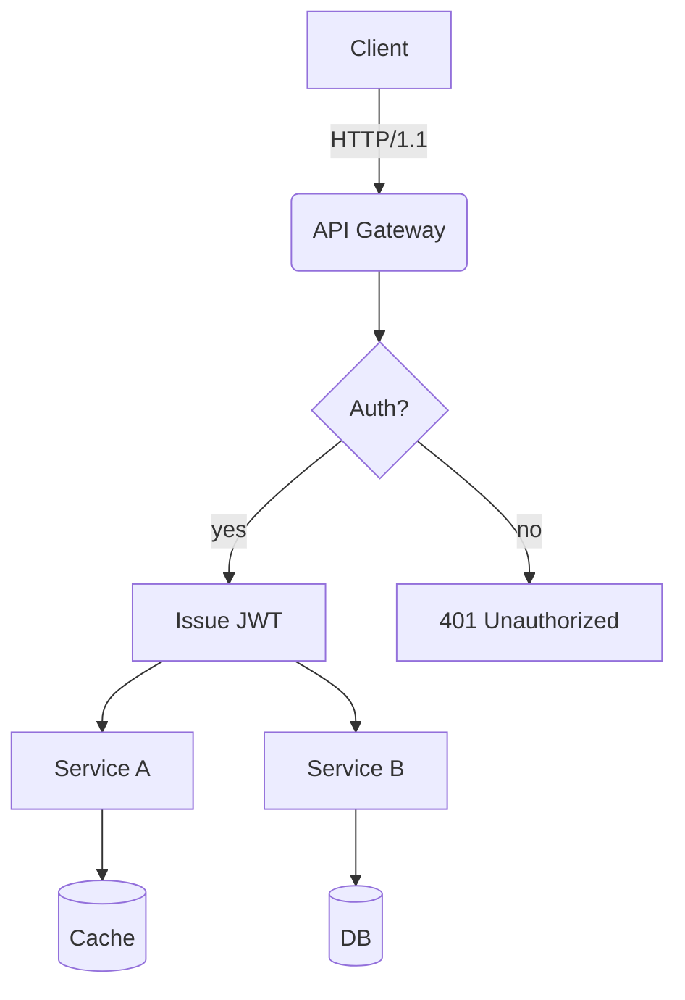
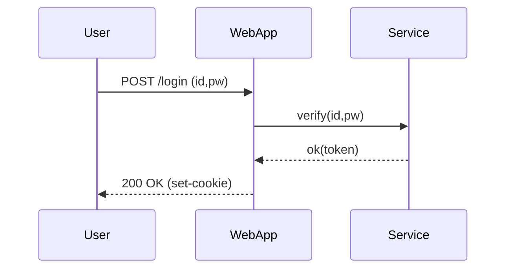
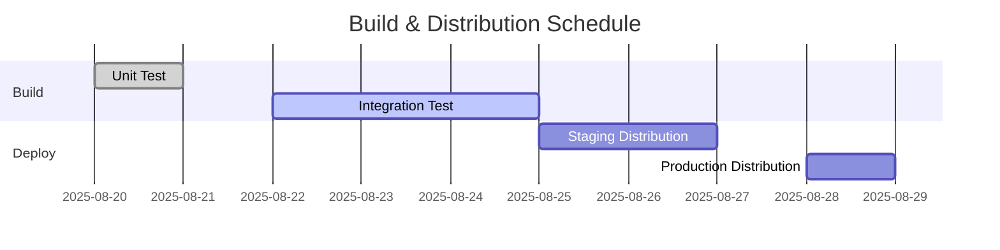
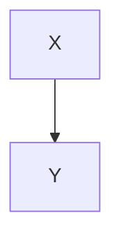

# Translation Test **Rich Markdown** Document

This document is a collection of various Korean content formats designed to exceed **4096 tokens**. It aims to test the robustness of translators/LLMs in handling context, preserving format, ignoring code/tables, etc.

> **Guide**
> 1) Ensure that code blocks and `mermaid` areas remain unchanged.
> 2) Verify the preservation of numbers/units (e.g., 1.2GB, 3ms), slash paths (`/var/log/app.log`), and options (`--flag`).
> 3) Layouts should remain intact even when mixed with tables, lists, quotations, checkboxes, equations, and emojis 😀.

## 1. Table and Symbol/Unit Mix

| Column | Value | Unit | Comment |
|---|---|---|---|
| Throughput | 12,345 | RPS | Peak at 18,900 RPS |
| Latency (P50) | 3.2 | ms | `--enable-cache` enabled |
| Latency (P99) | 41.7 | ms | Includes GC phase |
| Memory | 1.5 | GB | RSS basis, cgroup limit 2GB |
| Disk I/O | 220 | MB/s | Via NVMe-oF(TCP) |

## 2. Checklist (Task List)

- [x] Accuracy of Markdown Header Translation
- [x] Preservation of Keywords within Code Blocks (`for`, `if`, `return`, etc.)
- [ ] Preservation of Mermaid Diagrams and Ignoring Comments
- [ ] Preservation of Units (GB/ms/%), Paths (`/etc/hosts`)
- [ ] Preservation of Inline Equations $O(n \log n)$

## 3. Code Blocks: Bash/Python/JSON/YAML

```bash
#!/usr/bin/env bash
set -euo pipefail

APP_ENV="${APP_ENV:-prod}"
INPUT="${1:-/data/input.txt}"
OUT="/var/tmp/result.json"

echo "[INFO] starting job on $(hostname) at $(date -Iseconds)"
if [[ ! -f "$INPUT" ]]; then
  echo "[ERROR] input not found: $INPUT" >&2
  exit 1
fi

lines=$(wc -l < "$INPUT")
echo "[DEBUG] line count: $lines"

curl -sS -X POST "http://127.0.0.1:8080/api" \  -H "Content-Type: application/json" \  -d "{"env":"$APP_ENV","count":$lines}" > "$OUT"

jq -r '.status' "$OUT" | grep -q success && echo "OK" || { echo "FAIL"; exit 2; }
```

```python
from __future__ import annotations

def rolling_avg(xs: list[float], k: int) -> list[float]:
    if k <= 0:
        raise ValueError("k must be > 0")
    out = []
    acc = 0.0
    for i, v in enumerate(xs):
        acc += v
        if i >= k:
            acc -= xs[i-k]
        if i >= k - 1:
            out.append(acc / k)
    return out

print(rolling_avg([1,2,3,4,5,6,7,8,9], 3))
```

```json
{
  "service": "analytics",
  "version": "1.4.2",
  "features": ["rollup", "compaction", "delta-index"],
  "limits": {
    "max_docs": 1000000,
    "max_payload_mb": 256
  }
}
```

```yaml
apiVersion: v1
kind: ConfigMap
metadata:
  name: test-config
data:
  APP_ENV: "staging"
  ENDPOINT: "https://api.example.com"
```

## 4. Mermaid Diagrams

### 4.1 Flowchart


### 4.2 Sequence


### 4.3 Gantt Chart


## 5. Images/Links/Quotations


- Document: <https://example.com/docs/guide>
- API Reference: [API Reference](https://example.com/api)
- Issue Tracker: https://example.com/issues

> “Translation quality is determined by the simultaneous preservation of layout and meaning.” — Anonymous

## 6. Mixing Formulas and Text

- Average Time Complexity: $O(n \log n)$, Worst: $O(n^2)$
- Variance: $\sigma^2 = \frac{1}{n}\sum_{i=1}^{n}(x_i-\mu)^2$
- Sample Mean: $\bar{x} = \frac{1}{n}\sum x_i$

Paragraph Example: This paragraph is a sample to ensure that **bold**, *italic*, `code` is preserved correctly even when mixed within sentences, including emojis 😀, Chinese characters 漢字, English CamelCase, snake_case, and kebab-case.

### 7.1 Experimental Paragraph — Transformation Patterns
The following paragraph is similar but slightly varies in vocabulary and order each iteration to prevent redundant translations.
- Scenario: Summary of conversation logs
- Condition: Includes Korean text up to 100k characters
- Expected Result: Summary rate of over 90%

#### Procedure
1. Input Data: `/data/input_01.jsonl`
2. Options: `--batch 512 --timeout 3s --enable-cache`
3. Execution: `app run --job test-01 --qos high`
4. Verification: Check if `test-01 finished` is included in logs

#### Observations
- Longer GC cycles show an increasing trend in P99 latency
- Processing throughput decreases by ~7% when cache miss ratio increases by 10%
- Increasing connection pool size from 32 to 64 results in a decrease in retry rate per second from 1.2% to 0.6%

### 7.2 Experimental Paragraph — Transformation Patterns
The following paragraph slightly varies vocabulary and order each iteration to prevent repetitive translations.
- Scenario: Summary of conversation logs
- Condition: Includes 100k characters in Korean
- Expected Result: Summary accuracy rate of over 90%

#### Procedure
1. Input Data: `/data/input_02.jsonl`
2. Options: `--batch 512 --timeout 3s --enable-cache`
3. Execution: `app run --job test-02 --qos high`
4. Verification: Check if `test-02 finished` is included in logs

#### Observations
- Longer GC (Garbage Collection) cycles show an increasing trend in P99 latency
- Processing throughput decreases by approximately 7% when cache miss ratio increases by 10%
- Increasing connection pool size from 32 to 64 results in a decrease in retry rate per second from 1.2% to 0.6%

### 7.3 Experiment Paragraph — Variation Patterns
The following paragraph varies slightly in vocabulary and order each iteration to prevent repetitive translations.
- Scenario: Kubernetes Deployment
- Condition: HPA Enabled
- Expected Result: Scale within range of 2~10

#### Procedure
1. Input Data: `/data/input_03.jsonl`
2. Options: `--batch 512 --timeout 3s --enable-cache`
3. Execution: `app run --job test-03 --qos high`
4. Verification: Check if `test-03 finished` is included in logs

#### Observations
- Longer GC cycles show a tendency towards increased P99 latency
- Processing throughput decreases by ~7% when cache miss ratio increases by 10%p
- Increase in connection pool size from 32 to 64 results in a decrease in retry rate per second from 1.2% to 0.6%

### 7.4 Experiment Paragraph — Variation Patterns
The following paragraph varies slightly in vocabulary and order each iteration to prevent repetitive translations.
- Scenario: Kubernetes Deployment
- Condition: HPA Enabled
- Expected Result: Scale within range of 2~10

#### Procedure
1. Input Data: `/data/input_04.jsonl`
2. Options: `--batch 512 --timeout 3s --enable-cache`
3. Execution: `app run --job test-04 --qos high`
4. Verification: Check if `test-04 finished` is included in logs

#### Observations
- Longer GC cycles show a tendency towards increased P99 latency
- Processing throughput decreases by ~7% when cache miss ratio increases by 10%p
- Increase in connection pool size from 32 to 64 results in a decrease in retry rate per second from 1.2% to 0.6%

### 7.5 Experimental Paragraph — Transformation Patterns
The following paragraph varies slightly in vocabulary and order each iteration to prevent repetitive translations.
- Scenario: Summary of dialogue log records
- Condition: Includes Korean text up to 100k characters
- Expected Result: Summary accuracy rate of over 90%

#### Procedure
1. Input Data: `/data/input_05.jsonl`
2. Options: `--batch 512 --timeout 3s --enable-cache`
3. Execution: `app run --job test-05 --qos high`
4. Verification: Check if `test-05 finished` is included in logs

#### Observations
- Longer GC (Garbage Collection) cycles show an increasing trend in P99 latency
- Processing throughput decreases by approximately 7% when cache miss ratio increases by 10%
- Increasing connection pool size from 32 to 64 results in a decrease in retry rate per second from 1.2% to 0.6%

### 7.6 Experimental Paragraph — Transformation Patterns
The following paragraph varies slightly in vocabulary and order each iteration to prevent repetitive translations.
- Scenario: Mermaid Rendering
- Conditions: Over 50 nodes, Over 100 edges
- Expected Result: No layout distortion

#### Procedure
1. Input Data: `/data/input_06.jsonl`
2. Options: `--batch 512 --timeout 3s --enable-cache`
3. Execution: `app run --job test-06 --qos high`
4. Verification: Check if `test-06 finished` is included in the logs

#### Observations
- Longer GC cycles show an increasing trend in P99 latency
- Processing throughput decreases by approximately 7% when cache miss ratio increases by 10%
- Increasing connection pool size from 32 to 64 results in a decrease in retry rate per second from 1.2% to 0.6%

### 7.7 Experiment Paragraph — Transformation Pattern
The following paragraph varies slightly in vocabulary and order each iteration to prevent repetitive translations.
- Scenario: Large-scale JSON Parsing
- Conditions: 64MB payload, 4 workers
- Expected Result: Completion without memory spikes

#### Procedure
1. Input Data: `/data/input_07.jsonl`
2. Options: `--batch 512 --timeout 3s --enable-cache`
3. Execution: `app run --job test-07 --qos high`
4. Verification: Check if `test-07 finished` is included in the logs

#### Observations
- Longer GC cycles show a tendency towards increased P99 latency
- Processing throughput decreases by ~7% when cache miss ratio increases by 10%
- Increasing connection pool size from 32 to 64 results in a decrease in retry rate per second from 1.2% to 0.6%

### 7.8 Experiment Paragraph — Transformation Pattern
The following paragraph varies slightly in vocabulary and order each iteration to prevent repetitive translations.
- Scenario: Large-scale JSON Parsing
- Conditions: 64MB payload, 4 workers
- Expected Result: Completion without memory spikes

#### Procedure
1. Input Data: `/data/input_08.jsonl`
2. Options: `--batch 512 --timeout 3s --enable-cache`
3. Execution: `app run --job test-08 --qos high`
4. Verification: Check if `test-08 finished` is included in the logs

#### Observations
- Longer GC cycles show a tendency towards increased P99 latency
- Processing throughput decreases by ~7% when cache miss ratio increases by 10%
- Increasing connection pool size from 32 to 64 results in a decrease in retry rate per second from 1.2% to 0.6%

### 7.9 Experiment Paragraph — Transformation Pattern
The following paragraph varies slightly in vocabulary and order each iteration to prevent repetitive translations.
- Scenario: Large-scale JSON Parsing
- Conditions: 64MB payload, 4 workers
- Expected Result: Completion without memory spikes

#### Procedure
1. Input Data: `/data/input_09.jsonl`
2. Options: `--batch 512 --timeout 3s --enable-cache`
3. Execution: `app run --job test-09 --qos high`
4. Verification: Check if `test-09 finished` is included in the logs

#### Observations
- Longer GC cycles show a tendency towards increased P99 latency
- Processing throughput decreases by ~7% when cache miss ratio increases by 10%
- Increasing connection pool size from 32 to 64 results in a decrease in retry rate per second from 1.2% to 0.6%

### 7.10 Experimental Paragraph — Variation Patterns
The following paragraph varies slightly in vocabulary and order each iteration to prevent repetitive translations.
- Scenario: NVMe-oF I/O Retries
- Conditions: TCP RTT 2ms, Loss 0.1%
- Expected Result: Retry Rate ≤ 1%

#### Procedure
1. Input Data: `/data/input_10.jsonl`
2. Options: `--batch 512 --timeout 3s --enable-cache`
3. Execution: `app run --job test-10 --qos high`
4. Verification: Check if `test-10 finished` is included in the logs

#### Observations
- Longer GC cycles show a tendency towards increased P99 latency
- Throughput decreases by ~7% when cache miss ratio increases by 10%p
- Increasing connection pool size from 32 to 64 results in retry rate per second decreasing from 1.2% to 0.6%

### 7.11 Experimental Paragraph — Transformation Patterns
The following paragraph varies slightly in vocabulary and order each iteration to prevent repetitive translations.
- Scenario: Large-scale JSON Parsing
- Conditions: 64MB payload, 4 workers
- Expected Result: Completion without memory spikes

#### Procedure
1. Input Data: `/data/input_11.jsonl`
2. Options: `--batch 512 --timeout 3s --enable-cache`
3. Execution: `app run --job test-11 --qos high`
4. Verification: Check if `test-11 finished` is included in the logs

#### Observations
- Longer GC cycles show a tendency towards increased P99 latency
- Processing throughput decreases by ~7% when cache miss ratio increases by 10%p
- Increasing connection pool size from 32 to 64 results in a decrease in retry rate per second from 1.2% to 0.6%

### 7.12 Experimental Paragraph — Transformation Patterns
The following paragraph varies slightly in vocabulary and order each iteration to prevent redundant translations.
- Scenario: Kubernetes Deployment
- Condition: HPA Enabled
- Expected Result: Scale within range of 2~10

#### Procedure
1. Input Data: `/data/input_12.jsonl`
2. Options: `--batch 512 --timeout 3s --enable-cache`
3. Execution: `app run --job test-12 --qos high`
4. Verification: Check if `test-12 finished` is included in logs

#### Observations
- Longer GC cycles show a tendency towards increased P99 latency
- Processing throughput decreases by ~7% when cache miss ratio increases by 10%p
- Increase in connection pool size from 32 to 64 results in a decrease in retry rate per second from 1.2% to 0.6%

### 7.13 Experimental Paragraph — Transformation Pattern
The following paragraph varies slightly in vocabulary and order each iteration to prevent repetitive translation.
- Scenario: Large-scale JSON Parsing
- Conditions: 64MB payload, 4 workers
- Expected Result: Completion without memory spikes

#### Procedure
1. Input Data: `/data/input_13.jsonl`
2. Options: `--batch 512 --timeout 3s --enable-cache`
3. Execution: `app run --job test-13 --qos high`
4. Verification: Check if `test-13 finished` is included in logs

#### Observations
- Longer GC cycles show a tendency towards increased P99 latency
- Throughput decreases by approximately 7% when cache miss ratio increases by 10%
- When connection pool size increases from 32 to 64, the retry rate per second decreases from 1.2% to 0.6%

### 7.14 Experiment Paragraph — Transformation Pattern
The following paragraph varies slightly in vocabulary and order each iteration to prevent repetitive translation.
- Scenario: Large-scale JSON Parsing
- Conditions: 64MB payload, 4 workers
- Expected Result: Completion without memory spikes

#### Procedure
1. Input Data: `/data/input_14.jsonl`
2. Options: `--batch 512 --timeout 3s --enable-cache`
3. Execution: `app run --job test-14 --qos high`
4. Verification: Check if `test-14 finished` is included in logs

#### Observations
- Longer GC cycles show a tendency towards increased P99 latency
- Throughput decreases by approximately 7% when cache miss ratio increases by 10%
- When connection pool size increases from 32 to 64, the retry rate per second decreases from 1.2% to 0.6%

### 7.15 Experimental Paragraph — Variation Patterns
The following paragraph varies slightly in vocabulary and order each iteration to prevent repetitive translations.
- Scenario: NVMe-oF I/O Retries
- Conditions: TCP RTT 2ms, Loss 0.1%
- Expected Result: Retry Rate ≤ 1%

#### Procedure
1. Input Data: `/data/input_15.jsonl`
2. Options: `--batch 512 --timeout 3s --enable-cache`
3. Execution: `app run --job test-15 --qos high`
4. Verification: Check if `test-15 finished` is included in the logs

#### Observations
- Longer GC cycles show a tendency towards increased P99 latency
- Throughput decreases by ~7% when cache miss ratio increases by 10%p
- Increasing connection pool size from 32 to 64 results in retry rate per second decreasing from 1.2% to 0.6%

### 7.16 Experimental Paragraph — Transformation Pattern
The following paragraph varies slightly in vocabulary and order each iteration to prevent repetitive translation.
- Scenario: Mermaid Rendering
- Conditions: 50+ nodes, 100+ edges
- Expected Result: No layout distortion

#### Procedure
1. Input Data: `/data/input_16.jsonl`
2. Options: `--batch 512 --timeout 3s --enable-cache`
3. Execution: `app run --job test-16 --qos high`
4. Verification: Check if `test-16 finished` is included in the logs

#### Observations
- Longer GC cycles show an increasing trend in P99 latency
- Throughput decreases by ~7% when cache miss ratio increases by 10%p
- When connection pool size increases from 32 to 64, the retry rate per second decreases from 1.2% to 0.6%

### 7.17 Experimental Paragraph — Transformation Patterns
The following paragraph varies slightly in vocabulary and order each iteration to prevent repetitive translation.
- Scenario: Summary of dialogue log records
- Condition: Includes 100k characters in Korean
- Expected Result: Summary rate of over 90%

#### Procedure
1. Input Data: `/data/input_17.jsonl`
2. Options: `--batch 512 --timeout 3s --enable-cache`
3. Execution: `app run --job test-17 --qos high`
4. Verification: Check if `test-17 finished` is included in logs

#### Observations
- Longer GC (Garbage Collection) cycles show an increasing trend in P99 latency
- Processing throughput decreases by approximately 7% when cache miss ratio increases by 10%
- Increasing connection pool size from 32 to 64 results in a decrease in retry rate per second from 1.2% to 0.6%

### 7.18 Experiment Paragraph — Transformation Pattern
The following paragraph varies slightly in vocabulary and order each iteration to prevent repetitive translation.
- Scenario: Large-scale JSON Parsing
- Conditions: 64MB payload, 4 workers
- Expected Result: Completion without memory spikes

#### Procedure
1. Input Data: `/data/input_18.jsonl`
2. Options: `--batch 512 --timeout 3s --enable-cache`
3. Execution: `app run --job test-18 --qos high`
4. Verification: Check if `test-18 finished` is included in the logs

#### Observations
- Longer GC cycles show a tendency towards increased P99 latency
- Processing throughput decreases by ~7% when cache miss ratio increases by 10%p
- Increasing connection pool size from 32 to 64 results in a decrease in retry rate per second from 1.2% to 0.6%

### 7.19 Experiment Paragraph — Transformation Pattern
The following paragraph undergoes slight variations in vocabulary and order each iteration to prevent repetitive translation.
- Scenario: Large-scale JSON Parsing
- Conditions: 64MB payload, 4 workers
- Expected Result: Completion without memory spikes

#### Procedure
1. Input Data: `/data/input_19.jsonl`
2. Options: `--batch 512 --timeout 3s --enable-cache`
3. Execution: `app run --job test-19 --qos high`
4. Verification: Check if `test-19 finished` is included in the logs

#### Observations
- Longer GC cycles show a tendency towards increased P99 latency
- Processing throughput decreases by ~7% when cache miss ratio increases by 10%p
- Increasing connection pool size from 32 to 64 results in a decrease in retry rate per second from 1.2% to 0.6%

### 7.20 Experiment Paragraph — Variation Pattern
The following paragraph varies slightly in vocabulary and order each iteration to prevent repetitive translations.
- Scenario: NVMe-oF I/O Retries
- Conditions: TCP RTT 2ms, Loss 0.1%
- Expected Result: Retry Rate ≤ 1%

#### Procedure
1. Input Data: `/data/input_20.jsonl`
2. Options: `--batch 512 --timeout 3s --enable-cache`
3. Execution: `app run --job test-20 --qos high`
4. Verification: Check if `test-20 finished` is included in the logs

#### Observations
- Longer GC cycles show a tendency towards increased P99 latency
- Throughput decreases by ~7% when cache miss ratio increases by 10%p
- Increasing connection pool size from 32 to 64 results in retry rate per second decreasing from 1.2% to 0.6%

### 7.21 Experiment Paragraph — Transformation Pattern
The following paragraph varies slightly in vocabulary and order each iteration to prevent redundant translations.
- Scenario: Kubernetes Deployment
- Condition: HPA Enabled
- Expected Result: Scale within range of 2~10

#### Procedure
1. Input Data: `/data/input_21.jsonl`
2. Options: `--batch 512 --timeout 3s --enable-cache`
3. Execution: `app run --job test-21 --qos high`
4. Verification: Check if `test-21 finished` is included in logs

#### Observations
- Longer GC cycles show a tendency towards increased P99 latency
- Throughput decreases by ~7% when cache miss ratio increases by 10%p
- Increase in connection pool size from 32 to 64 results in a decrease in retry rate per second from 1.2% to 0.6%

### 7.22 Experimental Paragraph — Transformation Pattern
The following paragraph varies slightly in vocabulary and order each iteration to prevent redundant translations.
- Scenario: Mermaid Rendering
- Conditions: 50+ Nodes, 100+ Edges
- Expected Result: No Layout Distortion

#### Procedure
1. Input Data: `/data/input_22.jsonl`
2. Options: `--batch 512 --timeout 3s --enable-cache`
3. Execution: `app run --job test-22 --qos high`
4. Verification: Check if `test-22 finished` is included in the logs

#### Observations
- Longer GC cycles show an increasing trend in P99 latency
- Throughput decreases by ~7% when cache miss ratio increases by 10%p
- Increasing connection pool size from 32 to 64 results in a decrease in retry rate per second from 1.2% to 0.6%

### 7.23 Experimental Paragraph — Transformation Pattern
The following paragraph undergoes slight variations in vocabulary and order each iteration to prevent repetitive translation.
- Scenario: Large-scale JSON Parsing
- Conditions: 64MB payload, 4 workers
- Expected Result: Completion without memory spikes

#### Procedure
1. Input Data: `/data/input_23.jsonl`
2. Options: `--batch 512 --timeout 3s --enable-cache`
3. Execution: `app run --job test-23 --qos high`
4. Verification: Check if `test-23 finished` is included in logs

#### Observations
- Longer GC cycles show a tendency towards increased P99 latency
- Processing throughput decreases by ~7% when cache miss ratio increases by 10%
- Increasing connection pool size from 32 to 64 results in a decrease in retry rate per second from 1.2% to 0.6%

### 7.24 Experimental Paragraph — Transformation Pattern
The following paragraph varies slightly in vocabulary and order each iteration to prevent redundant translations.
- Scenario: Mermaid Rendering
- Conditions: 50+ Nodes, 100+ Edges
- Expected Result: No Layout Distortion

#### Procedure
1. Input Data: `/data/input_24.jsonl`
2. Options: `--batch 512 --timeout 3s --enable-cache`
3. Execution: `app run --job test-24 --qos high`
4. Verification: Check if `test-24 finished` is included in the logs

#### Observations
- Longer GC cycles show an increasing trend in P99 latency
- Throughput decreases by ~7% when cache miss ratio increases by 10%p
- Increasing connection pool size from 32 to 64 results in a decrease in retry rate per second from 1.2% to 0.6%

### 7.25 Experiment Paragraph — Transformation Pattern
The following paragraph varies slightly in vocabulary and order each iteration to prevent redundant translations.
- Scenario: Kubernetes Deployment
- Condition: HPA Enabled
- Expected Result: Scale within range of 2~10

#### Procedure
1. Input Data: `/data/input_25.jsonl`
2. Options: `--batch 512 --timeout 3s --enable-cache`
3. Execution: `app run --job test-25 --qos high`
4. Verification: Check if `test-25 finished` is included in logs

#### Observations
- Longer GC cycles show a tendency towards increased P99 latency
- Throughput decreases by ~7% when cache miss ratio increases by 10%
- Increase in connection pool size from 32 to 64 results in a decrease in retry rate per second from 1.2% to 0.6%

### 7.26 Experiment Paragraph — Variation Pattern
The following paragraph varies slightly in vocabulary and order each iteration to prevent repetitive translations.
- Scenario: NVMe-oF I/O Retries
- Conditions: TCP RTT 2ms, Loss 0.1%
- Expected Result: Retry Rate ≤ 1%

#### Procedure
1. Input Data: `/data/input_26.jsonl`
2. Options: `--batch 512 --timeout 3s --enable-cache`
3. Execution: `app run --job test-26 --qos high`
4. Verification: Check if `test-26 finished` is included in the logs

#### Observations
- Longer GC cycles show a tendency towards increased P99 latency
- Throughput decreases by ~7% when cache miss ratio increases by 10%p
- Increasing connection pool size from 32 to 64 results in retry rate per second decreasing from 1.2% to 0.6%

### 7.27 Experimental Paragraph — Transformation Pattern
The following paragraph undergoes slight variations in vocabulary and order each iteration to prevent repetitive translation.
- Scenario: Summary of dialogue log records
- Condition: Includes Korean text up to 100k characters
- Expected Result: Summary accuracy rate of over 90%

#### Procedure
1. Input Data: `/data/input_27.jsonl`
2. Options: `--batch 512 --timeout 3s --enable-cache`
3. Execution: `app run --job test-27 --qos high`
4. Verification: Check if `test-27 finished` is included in logs

#### Observations
- Longer GC (Garbage Collection) cycles show an increasing trend in P99 latency
- Processing throughput decreases by approximately 7% when cache miss ratio increases by 10%
- Increasing connection pool size from 32 to 64 results in a decrease in retry rate per second from 1.2% to 0.6%

### 7.28 Experimental Paragraph — Transformation Pattern
The following paragraph varies slightly in vocabulary and order each iteration to prevent redundant translations.
- Scenario: Summary of dialogue log records
- Condition: Includes Korean text of 100k characters
- Expected Result: Summary rate of over 90%

#### Procedure
1. Input Data: `/data/input_28.jsonl`
2. Options: `--batch 512 --timeout 3s --enable-cache`
3. Execution: `app run --job test-28 --qos high`
4. Verification: Check if `test-28 finished` is included in logs

#### Observations
- Longer GC cycles show an increasing trend in P99 latency
- Processing throughput decreases by ~7% when cache miss ratio increases by 10%p
- Increasing connection pool size from 32 to 64 results in a decrease in retry rate per second from 1.2% to 0.6%

### 7.29 Experiment Paragraph — Transformation Pattern
The following paragraph undergoes slight variations in vocabulary and order each iteration to prevent repetitive translations.
- Scenario: Large-scale JSON Parsing
- Conditions: 64MB payload, 4 workers
- Expected Result: Completion without memory spikes

#### Procedure
1. Input Data: `/data/input_29.jsonl`
2. Options: `--batch 512 --timeout 3s --enable-cache`
3. Execution: `app run --job test-29 --qos high`
4. Verification: Check if `test-29 finished` is included in logs

#### Observations
- Longer GC cycles show a tendency towards increased P99 latency
- Throughput decreases by approximately 7% when cache miss ratio increases by 10%
- Increasing connection pool size from 32 to 64 results in a decrease in retry rate per second from 1.2% to 0.6%

### 7.30 Experimental Paragraph — Transformation Pattern
The following paragraph slightly varies vocabulary and order each iteration to prevent redundant translations.
- Scenario: Summary of dialogue log records
- Condition: Includes Korean text of 100k characters
- Expected Result: Summary rate of over 90%

#### Procedure
1. Input Data: `/data/input_30.jsonl`
2. Options: `--batch 512 --timeout 3s --enable-cache`
3. Execution: `app run --job test-30 --qos high`
4. Verification: Check if `test-30 finished` is included in logs

#### Observations
- Longer GC cycles show a tendency towards increased P99 latency
- Processing throughput decreases by ~7% when cache miss ratio increases by 10%p
- Increasing connection pool size from 32 to 64 results in a decrease in retry rate per second from 1.2% to 0.6%

### 7.31 Experiment Paragraph — Transformation Patterns
The following paragraph varies slightly in vocabulary and order each iteration to prevent redundant translations.
- Scenario: Kubernetes Deployment
- Condition: HPA Enabled
- Expected Result: Scale within range of 2~10

#### Procedure
1. Input Data: `/data/input_31.jsonl`
2. Options: `--batch 512 --timeout 3s --enable-cache`
3. Execution: `app run --job test-31 --qos high`
4. Verification: Check if `test-31 finished` is included in logs

#### Observations
- Longer GC cycles show a tendency towards increased P99 latency
- Throughput decreases by ~7% when cache miss ratio increases by 10%p
- Increase in connection pool size from 32 to 64 results in a decrease in retry rate per second from 1.2% to 0.6%

### 7.32 Experimental Paragraph — Transformation Pattern
The following paragraph varies slightly in vocabulary and order each iteration to prevent repetitive translations.
- Scenario: Mermaid Rendering
- Conditions: 50+ nodes, 100+ edges
- Expected Result: No layout distortion

#### Procedure
1. Input Data: `/data/input_32.jsonl`
2. Options: `--batch 512 --timeout 3s --enable-cache`
3. Execution: `app run --job test-32 --qos high`
4. Verification: Check if `test-32 finished` is included in the logs

#### Observations
- Longer GC cycles show an increasing trend in P99 latency
- Throughput decreases by ~7% when cache miss ratio increases by 10%p
- Increasing connection pool size from 32 to 64 results in a decrease in retry rate per second from 1.2% to 0.6%

### 7.33 Experiment Paragraph — Transformation Pattern
The following paragraph slightly varies vocabulary and order each iteration to prevent redundant translations.
- Scenario: Large-scale JSON Parsing
- Conditions: 64MB payload, 4 workers
- Expected Result: Completion without memory spikes

#### Procedure
1. Input Data: `/data/input_33.jsonl`
2. Options: `--batch 512 --timeout 3s --enable-cache`
3. Execution: `app run --job test-33 --qos high`
4. Verification: Check if `test-33 finished` is included in logs

#### Observations
- Longer GC cycles show a tendency towards increased P99 latency
- Throughput decreases by approximately 7% when cache miss ratio increases by 10%
- Increasing connection pool size from 32 to 64 results in a decrease in retry rate per second from 1.2% to 0.6%

### 7.34 Experimental Paragraph — Transformation Patterns
The following paragraph varies slightly in vocabulary and order each iteration to prevent redundant translations.
- Scenario: Kubernetes Deployment
- Condition: HPA Enabled
- Expected Result: Scale within range 2~10

#### Procedure
1. Input Data: `/data/input_34.jsonl`
2. Options: `--batch 512 --timeout 3s --enable-cache`
3. Execution: `app run --job test-34 --qos high`
4. Verification: Check if `test-34 finished` is included in logs

#### Observations
- Longer GC cycles show a tendency towards increased P99 latency
- Processing throughput decreases by ~7% when cache miss ratio increases by 10%p
- Increase in connection pool size from 32 to 64 results in a decrease in retry rate per second from 1.2% to 0.6%

### 7.35 Experiment Paragraph — Transformation Pattern
The following paragraph varies slightly in vocabulary and order each iteration to prevent redundant translations.
- Scenario: Mermaid Rendering
- Conditions: 50+ Nodes, 100+ Edges
- Expected Result: No Layout Distortion

#### Procedure
1. Input Data: `/data/input_35.jsonl`
2. Options: `--batch 512 --timeout 3s --enable-cache`
3. Execution: `app run --job test-35 --qos high`
4. Verification: Check if `test-35 finished` is included in the logs

#### Observations
- Longer GC cycles show an increasing trend in P99 latency
- Throughput decreases by ~7% when cache miss ratio increases by 10%p
- Increasing connection pool size from 32 to 64 results in a decrease in retry rate per second from 1.2% to 0.6%

### 7.36 Experimental Paragraph — Variation Pattern
The following paragraph varies slightly in vocabulary and order each iteration to prevent redundant translations.
- Scenario: NVMe-oF I/O Retries
- Conditions: TCP RTT 2ms, Loss 0.1%
- Expected Result: Retry Rate ≤ 1%

#### Procedure
1. Input Data: `/data/input_36.jsonl`
2. Options: `--batch 512 --timeout 3s --enable-cache`
3. Execution: `app run --job test-36 --qos high`
4. Verification: Check if `test-36 finished` is included in the logs

#### Observations
- Longer GC cycles show a tendency towards increased P99 latency
- Throughput decreases by ~7% when cache miss ratio increases by 10%p
- Increasing connection pool size from 32 to 64 results in retry rate per second decreasing from 1.2% to 0.6%

### 7.37 Experiment Paragraph — Transformation Pattern
The following paragraph slightly varies vocabulary and order each iteration to prevent redundant translations.
- Scenario: Large-scale JSON Parsing
- Conditions: 64MB payload, 4 workers
- Expected Result: Completion without memory spikes

#### Procedure
1. Input Data: `/data/input_37.jsonl`
2. Options: `--batch 512 --timeout 3s --enable-cache`
3. Execution: `app run --job test-37 --qos high`
4. Verification: Check if `test-37 finished` is included in logs

#### Observations
- Longer GC cycles show a tendency towards increased P99 latency
- Throughput decreases by approximately 7% when cache miss ratio increases by 10%
- When connection pool size increases from 32 to 64, the retry rate per second decreases from 1.2% to 0.6%

### 7.38 Experiment Paragraph — Transformation Pattern
The following paragraph slightly varies vocabulary and order each iteration to prevent redundant translations.
- Scenario: Mermaid Rendering
- Condition: 50+ Nodes, 100+ Edges
- Expected Result: No Layout Distortion

#### Procedure
1. Input Data: `/data/input_38.jsonl`
2. Options: `--batch 512 --timeout 3s --enable-cache`
3. Execution: `app run --job test-38 --qos high`
4. Verification: Check if `test-38 finished` is included in logs

#### Observations
- Longer GC cycles show an increasing trend in P99 latency
- Throughput decreases by ~7% when cache miss ratio increases by 10%p
- Increasing connection pool size from 32 to 64 results in a decrease in retry rate per second from 1.2% to 0.6%

### 7.39 Experiment Paragraph — Transformation Pattern
The following paragraph varies slightly in vocabulary and order each iteration to prevent redundant translations.
- Scenario: Mermaid Rendering
- Conditions: 50+ Nodes, 100+ Edges
- Expected Result: No Layout Distortion

#### Procedure
1. Input Data: `/data/input_39.jsonl`
2. Options: `--batch 512 --timeout 3s --enable-cache`
3. Execution: `app run --job test-39 --qos high`
4. Verification: Check if `test-39 finished` is included in the logs

#### Observations
- Longer GC cycles show an increasing trend in P99 latency
- Throughput decreases by ~7% when cache miss ratio increases by 10%p
- Increasing connection pool size from 32 to 64 results in a decrease in retry rate per second from 1.2% to 0.6%

### 7.40 Experimental Paragraph — Transformation Patterns
The following paragraph slightly varies vocabulary and order each iteration to prevent redundant translations.
- Scenario: Summary of conversation logs
- Condition: Includes 100k characters in Korean
- Expected Result: Summary accuracy rate of over 90%

#### Procedure
1. Input Data: `/data/input_40.jsonl`
2. Options: `--batch 512 --timeout 3s --enable-cache`
3. Execution: `app run --job test-40 --qos high`
4. Verification: Check if `test-40 finished` is included in logs

#### Observations
- Longer GC (Garbage Collection) cycles show an increasing trend in P99 latency
- Processing throughput decreases by approximately 7% when cache miss ratio increases by 10%
- Increasing connection pool size from 32 to 64 results in a decrease in retry rate per second from 1.2% to 0.6%

## 8. Long List

- 2. Error Handling Consistency — Case #001
- 3. Performance Profiling — Case #002
- 4. Accessibility (a11y) — Case #003
- 5. Log Schema Stability — Case #004
- 6. Cache Invalidation Scenarios — Case #005
- 7. Performance Profiling — Case #006
- 8. Performance Profiling — Case #007
- 9. API Backward Compatibility — Case #008
- 10. Log Schema Stability — Case #009
- 11. Accessibility (a11y) — Case #010
- 12. Cache Invalidation Scenarios — Case #011
- 13. Performance Profiling — Case #012
- 14. Security Header Implementation — Case #013
- 15. Resource Leak Detection — Case #015
- 16. Error Handling Consistency — Case #016
- 17. Error Handling Consistency — Case #017
- 18. Internationalization (i18n) — Case #018
- 19. CORS Policy Validation — Case #019
- 20. Performance Profiling — Case #020
- 21. Security Header Implementation — Case #021
- 22. Log Schema Stability — Case #022
- 23. Performance Profiling — Case #023
- 24. Cache Invalidation Scenarios — Case #024
- 25. CORS Policy Validation — Case #025
- 26. Performance Profiling — Case #026
- 27. Accessibility (a11y) — Case #027
- 28. Accessibility (a11y) — Case #028
- 29. API Backward Compatibility — Case #029
- 30. Cache Invalidation Scenarios — Case #030
- 31. Cache Invalidation Scenarios — Case #031
- 32. Performance Profiling — Case #032
- 33. Resource Leak Detection — Case #033
- 34. Log Schema Stability — Case #034
- 35. CORS Policy Validation — Case #035
- 36. Error Handling Consistency — Case #036
- 37. Resource Leak Detection — Case #037
- 38. Error Handling Consistency — Case #038
- 39. Internationalization (i18n) — Case #039
- 40. API Backward Compatibility — Case #040
- 41. Cache Invalidation Scenarios — Case #041
- 42. Cache Invalidation Scenarios — Case #042
- 43. Cache Invalidation Scenarios — Case #043
- 44. Performance Profiling — Case #044
- 45. Performance Profiling — Case #045
- 46. CORS Policy Validation — Case #046
- 47. Resource Leak Detection — Case #047
- 48. Cache Invalidation Scenarios — Case #048
- 49. Error Handling Consistency — Case #049
- 50. Log Schema Stability — Case #050
- 51. Resource Leak Detection — Case #051
- 52. Internationalization (i18n) — Case #052
- 53. Log Schema Stability — Case #053
- 54. Resource Leak Detection — Case #054
- 55. Security Header Implementation — Case #055
- 56. Internationalization (i18n) — Case #056
- 57. API Backward Compatibility — Case #057
- 58. Accessibility (a11y) — Case #058
- 59. API Backward Compatibility — Case #059
- 60. Performance Profiling — Case #060
- 61. Accessibility (a11y) — Case #061
- 62. API Backward Compatibility — Case #062
- 63. Internationalization (i18n) — Case #063
- 64. Security Header Implementation — Case #064
- 65. Error Handling Consistency — Case #065
- 66. Performance Profiling — Case #066
- 67. Accessibility (a11y) — Case #067
- 68. Error Handling Consistency — Case #068
- 69. Performance Profiling — Case #069
- 70. Resource Leak Detection — Case #070
- 71. Accessibility (a11y) — Case #071
- 72. Internationalization (i18n) — Case #072
- 73. Error Handling Consistency — Case #073
- 74. Internationalization (i18n) — Case #074
- 75. Performance Profiling — Case #075
- 76. Security Header Implementation — Case #076
- 77. CORS Policy Validation — Case #077
- 78. Resource Leak Detection — Case #078
- 79. Resource Leak Detection — Case #079
- 80. Performance Profiling — Case #080
- 81. Accessibility (a11y) — Case #081
- 82. Accessibility (a11y) — Case #082
- 83. Performance Profiling — Case #083
- 84. Resource Leak Detection — Case #084
- 85. Accessibility (a11y) — Case #085
- 86. Cache Invalidation Scenarios — Case #086
- 87. CORS Policy Validation — Case #087
- 88. Log Schema Stability — Case #088
- 89. CORS Policy Validation — Case #089
- 90. Security Header Implementation — Case #090
- 91. API Backward Compatibility — Case #091
- 92. Accessibility (a11y) — Case #092
- 93. Performance Profiling — Case #093
- 94. Performance Profiling — Case #094
- 95. Log Schema Stability — Case #095
- 96. Internationalization (i18n) — Case #096
- 97. API Backward Compatibility — Case #097
- 98. Security Header Implementation — Case #098
- 99. Error Handling Consistency — Case #099
- 100. Cache Invalidation Scenarios — Case #100
- 101. Accessibility (a11y) — Case #101
- 102. Internationalization (i18n) — Case #102
- 103. Accessibility (a11y) — Case #103
- 104. API Backward Compatibility — Case #104
- 105. Accessibility (a11y) — Case #105
- 106. Performance Profiling — Case #106
- 107. Security Header Implementation — Case #107
- 108. API Backward Compatibility — Case #108
- 109. Security Header Implementation — Case #109
- 110. Error Handling Consistency — Case #110
- 111. Performance Profiling — Case #111
- 112. Resource Leak Detection — Case #112
- 113. CORS Policy Validation — Case #113
- 114. Accessibility (a11y) — Case #114
- 115. Error Handling Consistency — Case #115
- 116. Error Handling Consistency — Case #116
- 117. Performance Profiling — Case #117
- 118. CORS Policy Validation — Case #118
- 119. Resource Leak Detection — Case #119
- 120. Cache Invalidation Scenarios — Case #120
- 121. CORS Policy Validation — Case #121
- 122. Performance Profiling — Case #122
- 123. Error Handling Consistency — Case #123
- 124. Performance Profiling — Case #124
- 125. Resource Leak Detection — Case #124
- 126. Accessibility (a11y) — Case #125
- 127. Internationalization (i18n) — Case #126
- 128. Error Handling Consistency — Case #127
- 129. Internationalization (i18n) — Case #128
- 130. Performance Profiling — Case #129
- 131. Security Header Implementation — Case #130
- 132. API Backward Compatibility — Case #131
- 133. Accessibility (a11y) — Case #132
- 134. Performance Profiling — Case #133
- 135. Performance Profiling — Case #134
- 136. Log Schema Stability — Case #135
- 137. Internationalization (i18n) — Case #136
- 138. API Backward Compatibility — Case #137
- 139. Error Handling Consistency — Case #138
- 140. Cache Invalidation Scenarios — Case #139
- 141. Accessibility (a11y) — Case #140
- 142. Error Handling Consistency — Case #141
- 143. Error Handling Consistency — Case #142
- 144. Performance Profiling — Case #143
- 145. CORS Policy Validation — Case #144
- 146. Resource Leak Detection — Case #145
- 147. Cache Invalidation Scenarios — Case #146
- 148. CORS Policy Validation — Case #147
- 149. Performance Profiling — Case #148
- 150. Accessibility (a11y) — Case #149
- 151. Cache Invalidation Scenarios — Case #150
- 152. CORS Policy Validation — Case #151
- 153. Performance Profiling — Case #152
- 154. Resource Leak Detection — Case #153
- 155. Accessibility (a11y) — Case #154
- 156. Internationalization (i18n) — Case #155
- 157. Error Handling Consistency — Case #156
- 158. Internationalization (i18n) — Case #157
- 159. Performance Profiling — Case #158
- 160. Security Header Implementation — Case #159
- 161. API Backward Compatibility — Case #160
- 162. Accessibility (a11y) — Case #161
- 163. Performance Profiling — Case #162
- 164. Accessibility (a11y) — Case #163
- 165. API Backward Compatibility — Case #164
- 166. Accessibility (a11y) — Case #165
- 167. Performance Profiling — Case #166
- 168. Resource Leak Detection — Case #167
- 169. Accessibility (a11y) — Case #168
- 170. Internationalization (i18n) — Case #169
- 171. Error Handling Consistency — Case #170
- 172. Internationalization (i18n) — Case #171
- 173. Performance Profiling — Case #172
- 174. Security Header Implementation — Case #173
- 175. CORS Policy Validation — Case #174
- 176. Resource Leak Detection — Case #175
- 177. Cache Invalidation Scenarios — Case #176
- 178. CORS Policy Validation — Case #177
- 179. Performance Profiling — Case #178
- 180. Accessibility (a11y) — Case #179
- 181. Accessibility (a11y) — Case #180
- 182. Performance Profiling — Case #181
- 183. Resource Leak Detection — Case #182
- 184. Accessibility (a11y) — Case #183
- 185. Cache Invalidation Scenarios — Case #184
- 186. CORS Policy Validation — Case #185
- 187. Log Schema Stability — Case #186
- 188. CORS Policy Validation — Case #187
- 189. Security Header Implementation — Case #188
- 190. API Backward Compatibility — Case #189
- 191. Accessibility (a11y) — Case #190
- 192. Performance Profiling — Case #191
- 193. Performance Profiling — Case #192
- 194. Log Schema Stability — Case #193
- 195. Internationalization (i18n) — Case #194
- 196. API Backward Compatibility — Case #195
- 197. Error Handling Consistency — Case #196
- 198. Cache Invalidation Scenarios — Case #197
- 199. Accessibility (a11y) — Case #198
- 200. Cache Invalidation Scenarios — Case #199
- 201. Accessibility (a11y) — Case #200
- 202. API Backward Compatibility — Case #201
- 203. Error Handling Consistency — Case #202
- 204. Cache Invalidation Scenarios — Case #203
- 205. Accessibility (a11y) — Case #204
- 206. Performance Profiling — Case #205
- 207. Security Header Implementation — Case #206
- 208. API Backward Compatibility — Case #207
- 209. Security Header Implementation — Case #208
- 210. Error Handling Consistency — Case #209
- 211. Performance Profiling — Case #210
- 212. Resource Leak Detection — Case #211
- 213. CORS Policy Validation — Case #212
- 214. Accessibility (a11y) — Case #213
- 215. Error Handling Consistency — Case #214
- 216. Error Handling Consistency — Case #215
- 217. Performance Profiling — Case #216
- 218. CORS Policy Validation — Case #217
- 219. Resource Leak Detection — Case #218
- 220. Cache Invalidation Scenarios — Case #219
- 221. CORS Policy Validation — Case #220
- 222. Performance Profiling — Case #221
- 223. Accessibility (a11y) — Case #222
- 224. Internationalization (i18n) — Case #223
- 225. Error Handling Consistency — Case #224
- 226. Internationalization (i18n) — Case #225
- 227. Performance Profiling — Case #226
- 228. Security Header Implementation — Case #227
- 229. CORS Policy Validation — Case #228
- 230. Resource Leak Detection — Case #229
- 231. Cache Invalidation Scenarios — Case #230
- 232. Accessibility (a11y) — Case #231
- 233. Internationalization (i18n) — Case #232
- 234. Error Handling Consistency — Case #233
- 235. Internationalization (i18n) — Case #234
- 236. Performance Profiling — Case #235
- 237. Security Header Implementation — Case #236
- 238. CORS Policy Validation — Case #237
- 239. Resource Leak Detection — Case #238
- 240. Cache Invalidation Scenarios — Case #239
- 241. Accessibility (a11y) — Case #240
- 242. CORS Policy Validation — Case #241
- 243. Performance Profiling — Case #242
- 244. Accessibility (a11y) — Case #243
- 245. Error Handling Consistency — Case #244
- 246. Performance Profiling — Case #245
- 247. Resource Leak Detection — Case #246
- 248. Accessibility (a11y) — Case #247
- 249. Internationalization (i18n) — Case #248
- 250. Error Handling Consistency — Case #249
- 251. Internationalization (i18n) — Case #250
- 252. Performance Profiling — Case #251
- 126. Performance Profiling — Case #125
- 127. Accessibility (a11y) — Case #126
- 128. Accessibility (a11y) — Case #127
- 129. Error Handling Consistency — Case #128
- 130. Error Handling Consistency — Case #129
- 131. API Backward Compatibility — Case #130
- 132. Accessibility (a11y) — Case #131
- 133. API Backward Compatibility — Case #132
- 134. Cache Invalidation Scenarios — Case #133
- 135. Security Header Implementation — Case #134
- 136. Internationalization (i18n) — Case #135
- 137. Security Header Implementation — Case #136
- 138. Performance Profiling — Case #137
- 139. Performance Profiling — Case #138
- 140. CORS Policy Validation — Case #139
- 141. Internationalization (i18n) — Case #140
- 142. Log Schema Stability — Case #141
- 143. CORS Policy Validation — Case #142
- 144. Accessibility (a11y) — Case #143
- 145. Security Header Implementation — Case #144
- 146. Log Schema Stability — Case #145
- 147. Performance Profiling — Case #146
- 148. Performance Profiling — Case #147
- 149. API Backward Compatibility — Case #148
- 150. Resource Leak Detection — Case #149
- 151. Performance Profiling — Case #150
- 152. Resource Leak Detection — Case #151
- 153. Accessibility (a11y) — Case #152
- 154. API Backward Compatibility — Case #153
- 155. Accessibility (a11y) — Case #154
- 156. Security Header Implementation — Case #155
- 157. Performance Profiling — Case #156
- 158. Cache Invalidation Scenarios — Case #157
- 159. Security Header Implementation — Case #158
- 160. Internationalization (i18n) — Case #159
- 161. Log Schema Stability — Case #160
- 162. CORS Policy Validation — Case #161
- 163. Internationalization (i18n) — Case #162
- 164. Performance Profiling — Case #163
- 165. Performance Profiling — Case #164
- 166. Accessibility (a11y) — Case #165
- 167. Security Header Implementation — Case #166
- 168. Accessibility (a11y) — Case #167
- 169. Performance Profiling — Case #168
- 170. Cache Invalidation Scenarios — Case #169
- 171. Security Header Implementation — Case #170
- 172. Resource Leak Detection — Case #171
- 173. Accessibility (a11y) — Case #172
- 174. Security Header Implementation — Case #173
- 175. Log Schema Stability — Case #174
- 176. CORS Policy Validation — Case #175
- 177. Security Header Implementation — Case #176
- 178. Performance Profiling — Case #177
- 179. Resource Leak Detection — Case #178
- 180. Internationalization (i18n) — Case #179
- 181. Log Schema Stability — Case #180
- 182. Accessibility (a11y) — Case #181
- 183. Security Header Implementation — Case #182
- 184. Performance Profiling — Case #183
- 185. Cache Invalidation Scenarios — Case #184
- 186. Security Header Implementation — Case #185
- 187. Accessibility (a11y) — Case #186
- 188. Cache Invalidation Scenarios — Case #187
- 189. Accessibility (a11y) — Case #188
- 190. Cache Invalidation Scenarios — Case #189
- 191. Accessibility (a11y) — Case #190
- 192. Cache Invalidation Scenarios — Case #191
- 193. Error Handling Consistency — Case #192
- 194. Error Handling Consistency — Case #193
- 195. Resource Leak Detection — Case #194
- 196. Error Handling Consistency — Case #195
- 197. CORS Policy Validation — Case #196
- 198. Performance Profiling — Case #197
- 199. Resource Leak Detection — Case #198
- 200. Accessibility (a11y) — Case #199
- 201. Resource Leak Detection — Case #200
- 202. Cache Invalidation Scenarios — Case #201
- 203. Internationalization (i18n) — Case #202
- 204. Log Schema Stability — Case #203
- 205. Error Handling Consistency — Case #204
- 206. Resource Leak Detection — Case #205
- 207. Security Header Implementation — Case #206
- 208. Resource Leak Detection — Case #207
- 209. Cache Invalidation Scenarios — Case #208
- 210. Performance Profiling — Case #209
- 211. Security Header Implementation — Case #210
- 212. Internationalization (i18n) — Case #211
- 213. Log Schema Stability — Case #212
- 214. Error Handling Consistency — Case #213
- 215. Cache Invalidation Scenarios — Case #214
- 216. Security Header Implementation — Case #215
- 217. Internationalization (i18n) — Case #216
- 218. Security Header Implementation — Case #217
- 219. Performance Profiling — Case #218
- 220. Error Handling Consistency — Case #219
- 221. Security Header Implementation — Case #220
- 222. Performance Profiling — Case #221
- 223. API Backward Compatibility — Case #222
- 224. Resource Leak Detection — Case #223
- 225. Internationalization (i18n) — Case #224
- 226. Security Header Implementation — Case #225
- 227. Internationalization (i18n) — Case #226
- 228. Performance Profiling — Case #227
- 229. Log Schema Stability — Case #228
- 230. CORS Policy Validation — Case #229
- 231. Performance Profiling — Case #230
- 232. API Backward Compatibility — Case #231
- 233. CORS Policy Validation — Case #232
- 234. Internationalization (i18n) — Case #233
- 235. Error Handling Consistency — Case #234
- 236. Performance Profiling — Case #235
- 237. Error Handling Consistency — Case #236
- 238. Performance Profiling — Case #237
- 239. Security Header Implementation — Case #238
- 240. Error Handling Consistency — Case #239
- 241. CORS Policy Validation — Case #240
- 242. API Backward Compatibility — Case #241
- 243. Performance Profiling — Case #242
- 244. Cache Invalidation Scenarios — Case #243
- 245. Performance Profiling — Case #244
- 246. Security Header Implementation — Case #245
- 247. Resource Leak Detection — Case #246
- 248. Resource Leak Detection — Case #247
- 249. Accessibility (a11y) — Case #248
- 250. Cache Invalidation Scenarios — Case #249
- 251. Accessibility (a11y) — Case #250
- 252. Cache Invalidation Scenarios — Case #251
- 253. Error Handling Consistency — Case #252
- 254. Error Handling Consistency — Case #253
- 255. Resource Leak Detection — Case #254
- 256. CORS Policy Validation — Case #255
- 257. Performance Profiling — Case #256
- 258. Resource Leak Detection — Case #257
- 259. Internationalization (i18n) — Case #258
- 260. Log Schema Stability — Case #259
- 261. Error Handling Consistency — Case #260
- 262. Resource Leak Detection — Case #261
- 263. Security Header Implementation — Case #262
- 264. Resource Leak Detection — Case #263
- 265. Cache Invalidation Scenarios — Case #264
- 266. Performance Profiling — Case #265
- 267. Security Header Implementation — Case #266
- 268. Internationalization (i18n) — Case #267
- 269. Security Header Implementation — Case #268
- 270. Performance Profiling — Case #269
- 271. Error Handling Consistency — Case #270
- 272. Performance Profiling — Case #271
- 273. API Backward Compatibility — Case #272
- 274. Resource Leak Detection — Case #273
- 275. Internationalization (i18n) — Case #274
- 276. Security Header Implementation — Case #275
- 277. Internationalization (i18n) — Case #276
- 278. Performance Profiling — Case #277
- 279. Log Schema Stability — Case #278
- 280. CORS Policy Validation — Case #279
- 281. Performance Profiling — Case #280
- 282. Resource Leak Detection — Case #281
- 283. Internationalization (i18n) — Case #282
- 284. Log Schema Stability — Case #283
- 285. Accessibility (a11y) — Case #284
- 286. Security Header Implementation — Case #285
- 287. Resource Leak Detection — Case #286
- 288. Cache Invalidation Scenarios — Case #287
- 289. Accessibility (a11y) — Case #288
- 290. Cache Invalidation Scenarios — Case #289
- 291. Error Handling Consistency — Case #290
- 292. Error Handling Consistency — Case #291
- 293. Resource Leak Detection — Case #292
- 294. CORS Policy Validation — Case #293
- 295. Performance Profiling — Case #294
- 296. Resource Leak Detection — Case #295
- 297. Accessibility (a11y) — Case #296
- 298. Cache Invalidation Scenarios — Case #297
- 299. Accessibility (a11y) — Case #298
- 300. Cache Invalidation Scenarios — Case #299
- 301. Error Handling Consistency — Case #300
- 302. Error Handling Consistency — Case #301
- 303. Resource Leak Detection — Case #302
- 304. CORS Policy Validation — Case #303
- 305. API Backward Compatibility — Case #304
- 306. Performance Profiling — Case #305
- 307. Resource Leak Detection — Case #306
- 308. Security Header Implementation — Case #307
- 309. Resource Leak Detection — Case #308
- 310. Cache Invalidation Scenarios — Case #309
- 311. Performance Profiling — Case #310
- 312. Security Header Implementation — Case #311
- 313. Internationalization (i18n) — Case #312
- 314. Cache Invalidation Scenarios — Case #313
- 315. Security Header Implementation — Case #314
- 316. Performance Profiling — Case #315
- 317. Error Handling Consistency — Case #316
- 318. Resource Leak Detection — Case #317
- 319. Cache Invalidation Scenarios — Case #318
- 320. Security Header Implementation — Case #319
- 321. Internationalization (i18n) — Case #320
- 322. Security Header Implementation — Case #321
- 323. Performance Profiling — Case #322
- 324. Error Handling Consistency — Case #323
- 325. Performance Profiling — Case #324
- 326. API Backward Compatibility — Case #325
- 327. Resource Leak Detection — Case #326
- 328. Internationalization (i18n) — Case #327
- 329. Security Header Implementation — Case #328
- 330. Internationalization (i18n) — Case #329
- 331. Performance Profiling — Case #330
- 247. Consistency in Error Handling — Case #246
- 248. Internationalization (i18n) — Case #247
- 249. Log Schema Stability — Case #248
- 250. Applying Security Headers — Case #249
- 251. Accessibility (a11y) — Case #250
- 252. Accessibility (a11y) — Case #251
- 253. Internationalization (i18n) — Case #252
- 254. CORS Policy Validation — Case #253
- 255. Log Schema Stability — Case #254
- 256. CORS Policy Validation — Case #255
- 257. Applying Security Headers — Case #256
- 258. Cache Invalidation Scenarios — Case #257
- 259. Consistency in Error Handling — Case #258
- 260. Accessibility (a11y) — Case #259
- 261. Resource Leak Inspection — Case #260
- 262. Resource Leak Inspection — Case #261
- 263. Performance Profiling — Case #262
- 264. Accessibility (a11y) — Case #263
- 265. Cache Invalidation Scenarios — Case #264
- 266. Applying Security Headers — Case #265
- 267. Resource Leak Inspection — Case #266
- 268. Applying Security Headers — Case #267
- 269. Performance Profiling — Case #268
- 270. Consistency in Error Handling — Case #269
- 271. Internationalization (i18n) — Case #270
- 272. API Backward Compatibility — Case #271
- 273. Consistency in Error Handling — Case #272
- 274. Accessibility (a11y) — Case #273
- 275. API Backward Compatibility — Case #274
- 276. Internationalization (i18n) — Case #275
- 277. CORS Policy Validation — Case #276
- 278. Applying Security Headers — Case #277
- 279. Cache Invalidation Scenarios — Case #278
- 280. Log Schema Stability — Case #279
- 281. Resource Leak Inspection — Case #280
- 282. Resource Leak Inspection — Case #281
- 283. Accessibility (a11y) — Case #282
- 284. Accessibility (a11y) — Case #283
- 285. Consistency in Error Handling — Case #284
- 286. API Backward Compatibility — Case #285
- 287. Cache Invalidation Scenarios — Case #286
- 288. Accessibility (a11y) — Case #287
- 289. Accessibility (a11y) — Case #288
- 290. Applying Security Headers — Case #289
- 291. Internationalization (i18n) — Case #290
- 292. Applying Security Headers — Case #291
- 293. CORS Policy Validation — Case #292
- 294. Resource Leak Inspection — Case #293
- 295. Applying Security Headers — Case #294
- 296. CORS Policy Validation — Case #295
- 297. Log Schema Stability — Case #296
- 298. Cache Invalidation Scenarios — Case #297
- 299. API Backward Compatibility — Case #298
- 300. Cache Invalidation Scenarios — Case #299
- 301. Internationalization (i18n) — Case #300
- 302. Accessibility (a11y) — Case #301
- 303. Performance Profiling — Case #302
- 304. API Backward Compatibility — Case #303
- 305. Consistency in Error Handling — Case #304
- 306. Accessibility (a11y) — Case #305
- 307. Resource Leak Inspection — Case #306
- 308. API Backward Compatibility — Case #307
- 309. Applying Security Headers — Case #308
- 310. CORS Policy Validation — Case #309
- 311. API Backward Compatibility — Case #310
- 312. Accessibility (a11y) — Case #311
- 313. CORS Policy Validation — Case #312
- 314. Internationalization (i18n) — Case #313
- 315. Resource Leak Inspection — Case #314
- 316. Internationalization (i18n) — Case #315
- 317. Log Schema Stability — Case #316
- 318. Applying Security Headers — Case #317
- 319. Log Schema Stability — Case #318
- 320. Consistency in Error Handling — Case #319
- 321. Performance Profiling — Case #320
- 322. Accessibility (a11y) — Case #321
- 323. Applying Security Headers — Case #322
- 324. API Backward Compatibility — Case #323
- 325. CORS Policy Validation — Case #324
- 326. Resource Leak Inspection — Case #325
- 327. Applying Security Headers — Case #326
- 328. CORS Policy Validation — Case #327
- 329. Log Schema Stability — Case #328
- 330. Cache Invalidation Scenarios — Case #329
- 331. API Backward Compatibility — Case #330
- 332. CORS Policy Validation — Case #331
- 333. Resource Leak Inspection — Case #332
- 334. Performance Profiling — Case #333
- 335. Resource Leak Inspection — Case #334
- 336. Consistency in Error Handling — Case #335
- 337. Internationalization (i18n) — Case #336
- 338. Cache Invalidation Scenarios — Case #337
- 339. API Backward Compatibility — Case #338
- 340. Cache Invalidation Scenarios — Case #339
- 341. CORS Policy Validation — Case #340
- 342. Internationalization (i18n) — Case #341
- 343. Performance Profiling — Case #342
- 344. Performance Profiling — Case #343
- 345. Resource Leak Inspection — Case #344
- 346. Consistency in Error Handling — Case #345
- 347. API Backward Compatibility — Case #346
- 348. Consistency in Error Handling — Case #347
- 349. Accessibility (a11y) — Case #348
- 350. Performance Profiling — Case #349
- 351. Accessibility (a11y) — Case #350
- 352. Consistency in Error Handling — Case #351
- 353. Cache Invalidation Scenarios — Case #352
- 354. Internationalization (i18n) — Case #353
- 355. Resource Leak Inspection — Case #354
- 356. Accessibility (a11y) — Case #355
- 357. Applying Security Headers — Case #356
- 358. Resource Leak Inspection — Case #357
- 359. Performance Profiling — Case #358
- 360. Resource Leak Inspection — Case #359
- 361. Log Schema Stability — Case #360
- 362. Internationalization (i18n) — Case #361
- 363. Applying Security Headers — Case #362
- 364. Log Schema Stability — Case #363
- 365. Consistency in Error Handling — Case #364
- 366. API Backward Compatibility — Case #365
- 367. Consistency in Error Handling — Case #366
- 368. Resource Leak Inspection — Case #367
- 369. Performance Profiling — Case #368
- 370. Resource Leak Inspection — Case #369
- 371. Log Schema Stability — Case #370
- 372. Internationalization (i18n) — Case #371
- 373. Applying Security Headers — Case #372
- 374. Resource Leak Inspection — Case #373
- 375. Internationalization (i18n) — Case #374
- 376. Log Schema Stability — Case #375
- 377. Applying Security Headers — Case #376
- 378. CORS Policy Validation — Case #377
- 379. API Backward Compatibility — Case #378
- 380. Cache Invalidation Scenarios — Case #379
- 381. Applying Security Headers — Case #380
- 382. CORS Policy Validation — Case #381
- 383. API Backward Compatibility — Case #382
- 384. Accessibility (a11y) — Case #383
- 385. Performance Profiling — Case #384
- 386. CORS Policy Validation — Case #385
- 387. Resource Leak Inspection — Case #386
- 388. Performance Profiling — Case #387
- 389. Resource Leak Inspection — Case #388
- 390. Consistency in Error Handling — Case #389
- 391. Internationalization (i18n) — Case #390
- 392. Cache Invalidation Scenarios — Case #391
- 393. API Backward Compatibility — Case #392
- 394. Cache Invalidation Scenarios — Case #393
- 395. CORS Policy Validation — Case #394
- 396. Accessibility (a11y) — Case #395
- 397. Performance Profiling — Case #396
- 398. Resource Leak Inspection — Case #397
- 399. Applying Security Headers — Case #398
- 400. CORS Policy Validation — Case #399
- 401. Log Schema Stability — Case #400
- 402. Cache Invalidation Scenarios — Case #401
- 403. API Backward Compatibility — Case #402
- 404. Accessibility (a11y) — Case #403
- 405. Applying Security Headers — Case #404
- 406. CORS Policy Validation — Case #405
- 407. Resource Leak Inspection — Case #406
- 408. Performance Profiling — Case #407
- 409. Resource Leak Inspection — Case #408
- 370. API Backward Compatibility — Case #369
- 371. Accessibility (a11y) — Case #370
- 372. Performance Profiling — Case #371
- 373. CORS Policy Validation — Case #372
- 374. Cache Invalidation Scenarios — Case #373
- 375. Security Header Implementation — Case #374
- 376. Accessibility (a11y) — Case #375
- 377. API Backward Compatibility — Case #376
- 378. Accessibility (a11y) — Case #377
- 379. Security Header Implementation — Case #378
- 380. CORS Policy Validation — Case #379
- 381. Log Schema Stability — Case #380
- 382. Log Schema Stability — Case #381
- 383. Performance Profiling — Case #382
- 384. Error Handling Consistency — Case #383
- 385. Performance Profiling — Case #384
- 386. Log Schema Stability — Case #385
- 387. Resource Leak Check — Case #386
- 388. Accessibility (a11y) — Case #387
- 389. API Backward Compatibility — Case #388
- 390. Performance Profiling — Case #389
- 391. CORS Policy Validation — Case #390
- 392. API Backward Compatibility — Case #391
- 393. Resource Leak Check — Case #392
- 394. Security Header Implementation — Case #393
- 395. Cache Invalidation Scenarios — Case #394
- 396. Resource Leak Check — Case #395
- 397. Performance Profiling — Case #396
- 398. Performance Profiling — Case #397
- 399. Error Handling Consistency — Case #398
- 400. Cache Invalidation Scenarios — Case #399
- 401. API Backward Compatibility — Case #400
- 402. Log Schema Stability — Case #401
- 403. Resource Leak Check — Case #402
- 404. Error Handling Consistency — Case #403
- 405. Accessibility (a11y) — Case #404
- 406. API Backward Compatibility — Case #405
- 407. API Backward Compatibility — Case #406
- 408. CORS Policy Validation — Case #407
- 409. Resource Leak Check — Case #408
- 410. Cache Invalidation Scenarios — Case #409
- 411. Security Header Implementation — Case #410
- 412. Security Header Implementation — Case #411
- 413. Security Header Implementation — Case #412
- 414. Accessibility (a11y) — Case #413
- 415. Internationalization (i18n) — Case #414
- 416. API Backward Compatibility — Case #415
- 417. Performance Profiling — Case #416
- 418. Cache Invalidation Scenarios — Case #417
- 419. Resource Leak Check — Case #418
- 420. Resource Leak Check — Case #419
- 421. Log Schema Stability — Case #420
- 422. API Backward Compatibility — Case #421
- 423. Accessibility (a11y) — Case #422
- 424. Log Schema Stability — Case #423
- 425. Cache Invalidation Scenarios — Case #424
- 426. Log Schema Stability — Case #425
- 427. Internationalization (i18n) — Case #426
- 428. Performance Profiling — Case #427
- 429. Security Header Implementation — Case #428
- 430. Error Handling Consistency — Case #429
- 431. Resource Leak Check — Case #430
- 432. Error Handling Consistency — Case #431
- 433. Cache Invalidation Scenarios — Case #432
- 434. Performance Profiling — Case #433
- 435. API Backward Compatibility — Case #434
- 436. Log Schema Stability — Case #435
- 437. Cache Invalidation Scenarios — Case #436
- 438. Security Header Implementation — Case #437
- 439. Accessibility (a11y) — Case #438
- 440. API Backward Compatibility — Case #439
- 441. API Backward Compatibility — Case #440
- 442. Security Header Implementation — Case #441
- 443. Accessibility (a11y) — Case #442
- 444. Log Schema Stability — Case #443
- 445. Cache Invalidation Scenarios — Case #444
- 446. Internationalization (i18n) — Case #445
- 447. Performance Profiling — Case #446
- 448. Internationalization (i18n) — Case #447
- 449. Performance Profiling — Case #448
- 450. Security Header Implementation — Case #449
- 451. Resource Leak Check — Case #450
- 452. Performance Profiling — Case #451
- 453. CORS Policy Validation — Case #452
- 454. Security Header Implementation — Case #453
- 455. CORS Policy Validation — Case #454
- 456. Internationalization (i18n) — Case #455
- 457. Log Schema Stability — Case #456
- 458. Performance Profiling — Case #457
- 459. Performance Profiling — Case #458
- 460. Security Header Implementation — Case #459
- 461. Resource Leak Check — Case #460
- 462. Performance Profiling — Case #461
- 463. Error Handling Consistency — Case #462
- 464. Error Handling Consistency — Case #463
- 465. Error Handling Consistency — Case #464
- 466. Cache Invalidation Scenarios — Case #465
- 467. Internationalization (i18n) — Case #466
- 468. Accessibility (a11y) — Case #467
- 469. Log Schema Stability — Case #468
- 470. Internationalization (i18n) — Case #469
- 471. API Backward Compatibility — Case #470
- 472. Security Header Implementation — Case #471
- 473. API Backward Compatibility — Case #472
- 474. Error Handling Consistency — Case #473
- 475. Log Schema Stability — Case #474
- 476. Performance Profiling — Case #475
- 477. CORS Policy Validation — Case #476
- 478. CORS Policy Validation — Case #477
- 479. Internationalization (i18n) — Case #478
- 480. Internationalization (i18n) — Case #479
- 481. CORS Policy Validation — Case #480
- 482. API Backward Compatibility — Case #481
- 483. Performance Profiling — Case #482
- 484. Log Schema Stability — Case #483
- 485. API Backward Compatibility — Case #484
- 486. Cache Invalidation Scenarios — Case #485
- 487. Error Handling Consistency — Case #486
- 488. Performance Profiling — Case #487
- 489. Error Handling Consistency — Case #488
- 490. Cache Invalidation Scenarios — Case #489
- 491. Security Header Implementation — Case #490
- 492. Performance Profiling — Case #491
- 493. Accessibility (a11y) — Case #492
- 494. Error Handling Consistency — Case #493
- 495. Error Handling Consistency — Case #494
- 496. Cache Invalidation Scenarios — Case #495
- 497. Internationalization (i18n) — Case #496
- 498. Accessibility (a11y) — Case #497
- 499. Log Schema Stability — Case #498
- 500. Internationalization (i18n) — Case #499
- 501. API Backward Compatibility — Case #500
- 502. Security Header Implementation — Case #501
- 503. API Backward Compatibility — Case #502
- 504. Error Handling Consistency — Case #503
- 505. Log Schema Stability — Case #504
- 506. Cache Invalidation Scenarios — Case #505
- 507. Performance Profiling — Case #506
- 508. CORS Policy Validation — Case #507
- 509. CORS Policy Validation — Case #508
- 510. Internationalization (i18n) — Case #509
- 511. Log Schema Stability — Case #510
- 512. Performance Profiling — Case #511
- 513. Performance Profiling — Case #512
- 514. Security Header Implementation — Case #513
- 515. Resource Leak Check — Case #514
- 516. Performance Profiling — Case #515
- 517. Error Handling Consistency — Case #516
- 518. Cache Invalidation Scenarios — Case #517
- 519. Performance Profiling — Case #518
- 520. Accessibility (a11y) — Case #519
- 521. Error Handling Consistency — Case #520
- 522. Cache Invalidation Scenarios — Case #521
- 523. Performance Profiling — Case #522
- 524. API Backward Compatibility — Case #523
- 525. Log Schema Stability — Case #524
- 526. Cache Invalidation Scenarios — Case #525
- 527. Security Header Implementation — Case #526
- 528. Accessibility (a11y) — Case #527
- 529. Log Schema Stability — Case #528
- 530. Internationalization (i18n) — Case #529
- 531. API Backward Compatibility — Case #530
- 532. Security Header Implementation — Case #531
- 533. API Backward Compatibility — Case #532
- 534. Error Handling Consistency — Case #533
- 535. Log Schema Stability — Case #534
- 536. Cache Invalidation Scenarios — Case #535
- 537. Performance Profiling — Case #536
- 538. CORS Policy Validation — Case #537
- 539. CORS Policy Validation — Case #538
- 540. Internationalization (i18n) — Case #539
- 541. Performance Profiling — Case #540
- 542. Security Header Implementation — Case #541
- 543. Resource Leak Check — Case #542
- 544. Performance Profiling — Case #543
- 545. Error Handling Consistency — Case #544
- 546. Cache Invalidation Scenarios — Case #545
- 547. Performance Profiling — Case #546
- 492. Cache Invalidation Scenario — Case #491
- 493. Error Handling Consistency — Case #492
- 494. Resource Leak Check — Case #493
- 495. Resource Leak Check — Case #494
- 496. Error Handling Consistency — Case #495
- 497. Internationalization (i18n) — Case #496
- 498. Security Header Implementation — Case #497
- 499. API Backward Compatibility — Case #498
- 500. Accessibility (a11y) — Case #499
- 501. Cache Invalidation Scenario — Case #500
- 502. Cache Invalidation Scenario — Case #501
- 503. API Backward Compatibility — Case #502
- 504. Internationalization (i18n) — Case #503
- 505. Internationalization (i18n) — Case #504
- 506. Resource Leak Check — Case #505
- 507. Resource Leak Check — Case #506
- 508. Internationalization (i18n) — Case #507
- 509. Cache Invalidation Scenario — Case #508
- 510. Accessibility (a11y) — Case #509
- 511. Performance Profiling — Case #510
- 512. Resource Leak Check — Case #511
- 513. Accessibility (a11y) — Case #512
- 514. CORS Policy Validation — Case #513
- 515. Cache Invalidation Scenario — Case #514
- 516. API Backward Compatibility — Case #515
- 517. CORS Policy Validation — Case #516
- 518. API Backward Compatibility — Case #517
- 519. API Backward Compatibility — Case #518
- 520. Performance Profiling — Case #519
- 521. Accessibility (a11y) — Case #520
- 522. CORS Policy Validation — Case #521
- 523. Security Header Implementation — Case #522
- 524. Cache Invalidation Scenario — Case #523
- 525. Log Schema Stability — Case #524
- 526. CORS Policy Validation — Case #525
- 527. Internationalization (i18n) — Case #526
- 528. Log Schema Stability — Case #527
- 529. Resource Leak Check — Case #528
- 530. Internationalization (i18n) — Case #529
- 531. Error Handling Consistency — Case #530
- 532. Error Handling Consistency — Case #531
- 533. Log Schema Stability — Case #532
- 534. Performance Profiling — Case #533
- 535. Performance Profiling — Case #534
- 536. API Backward Compatibility — Case #535
- 537. Internationalization (i18n) — Case #536
- 538. CORS Policy Validation — Case #537
- 539. API Backward Compatibility — Case #538
- 540. API Backward Compatibility — Case #539
- 541. Cache Invalidation Scenario — Case #540
- 542. Cache Invalidation Scenario — Case #541
- 543. Security Header Implementation — Case #542
- 544. Cache Invalidation Scenario — Case #543
- 545. Security Header Implementation — Case #544
- 546. Security Header Implementation — Case #545
- 547. Performance Profiling — Case #546
- 548. CORS Policy Validation — Case #547
- 549. Internationalization (i18n) — Case #548
- 550. Resource Leak Check — Case #549
- 551. Performance Profiling — Case #550
- 552. Performance Profiling — Case #551
- 553. Internationalization (i18n) — Case #552
- 554. Error Handling Consistency — Case #553
- 555. Internationalization (i18n) — Case #554
- 556. Security Header Implementation — Case #555
- 557. Security Header Implementation — Case #556
- 558. Internationalization (i18n) — Case #557
- 559. API Backward Compatibility — Case #558
- 560. Performance Profiling — Case #559
- 561. CORS Policy Validation — Case #560
- 562. Resource Leak Check — Case #561
- 563. Internationalization (i18n) — Case #562
- 564. Resource Leak Check — Case #563
- 565. Internationalization (i18n) — Case #564
- 566. Cache Invalidation Scenario — Case #565
- 567. Error Handling Consistency — Case #566
- 568. Error Handling Consistency — Case #567
- 569. Performance Profiling — Case #568
- 570. API Backward Compatibility — Case #569
- 571. Performance Profiling — Case #571
- 572. API Backward Compatibility — Case #572
- 573. Security Header Implementation — Case #573
- 574. Cache Invalidation Scenario — Case #574
- 575. Log Schema Stability — Case #575
- 576. CORS Policy Validation — Case #576
- 577. Resource Leak Check — Case #577
- 578. CORS Policy Validation — Case #578
- 579. Cache Invalidation Scenario — Case #579
- 580. Error Handling Consistency — Case #580
- 581. Performance Profiling — Case #581
- 582. Internationalization (i18n) — Case #582
- 583. Log Schema Stability — Case #583
- 584. Resource Leak Check — Case #584
- 585. API Backward Compatibility — Case #585
- 586. CORS Policy Validation — Case #586
- 587. CORS Policy Validation — Case #587
- 588. Cache Invalidation Scenario — Case #588
- 589. Log Schema Stability — Case #589
- 590. API Backward Compatibility — Case #590
- 591. Performance Profiling — Case #591
- 592. Security Header Implementation — Case #592
- 593. Error Handling Consistency — Case #593
- 594. Internationalization (i18n) — Case #594
- 595. API Backward Compatibility — Case #595
- 596. Internationalization (i18n) — Case #596
- 597. CORS Policy Validation — Case #597
- 598. Cache Invalidation Scenario — Case #598
- 599. Internationalization (i18n) — Case #599
- 600. Resource Leak Check — Case #600
- 601. Resource Leak Check — Case #601
- 602. Cache Invalidation Scenario — Case #602
- 603. Resource Leak Check — Case #603
- 604. Cache Invalidation Scenario — Case #604
- 605. Log Schema Stability — Case #605
- 606. API Backward Compatibility — Case #606
- 607. Security Header Implementation — Case #607
- 608. Performance Profiling — Case #608
- 609. API Backward Compatibility — Case #609
- 610. Error Handling Consistency — Case #610
- 611. CORS Policy Validation — Case #611
- 612. CORS Policy Validation — Case #612
- 613. Performance Profiling — Case #613
- 614. Internationalization (i18n) — Case #614
- 615. Log Schema Stability — Case #615
- 616. Error Handling Consistency — Case #616
- 617. Performance Profiling — Case #617
- 618. Internationalization (i18n) — Case #618
- 619. API Backward Compatibility — Case #619
- 620. Security Header Implementation — Case #620
- 621. Error Handling Consistency — Case #621
- 622. Internationalization (i18n) — Case #622
- 623. Security Header Implementation — Case #623
- 624. Cache Invalidation Scenario — Case #624
- 625. Error Handling Consistency — Case #625
- 626. Log Schema Stability — Case #626
- 627. Internationalization (i18n) — Case #627
- 628. API Backward Compatibility — Case #628
- 629. Performance Profiling — Case #629
- 630. API Backward Compatibility — Case #630
- 631. Error Handling Consistency — Case #631
- 632. CORS Policy Validation — Case #632
- 633. Resource Leak Check — Case #633
- 634. CORS Policy Validation — Case #634
- 635. Resource Leak Check — Case #635
- 636. Error Handling Consistency — Case #636
- 637. Log Schema Stability — Case #637
- 638. API Backward Compatibility — Case #638
- 639. Security Header Implementation — Case #639
- 640. Performance Profiling — Case #640
- 641. API Backward Compatibility — Case #641
- 642. Error Handling Consistency — Case #642
- 643. CORS Policy Validation — Case #643
- 644. Resource Leak Check — Case #644
- 645. Cache Invalidation Scenario — Case #645
- 646. Log Schema Stability — Case #646
- 647. API Backward Compatibility — Case #647
- 648. Security Header Implementation — Case #648
- 649. Error Handling Consistency — Case #649
- 650. Internationalization (i18n) — Case #650
- 651. API Backward Compatibility — Case #651
- 652. Performance Profiling — Case #652
- 653. Performance Profiling — Case #653
- 654. Internationalization (i18n) — Case #654
- 655. Error Handling Consistency — Case #655
- 656. Security Header Implementation — Case #656
- 657. Cache Invalidation Scenario — Case #657
- 658. Error Handling Consistency — Case #658
- 659. Log Schema Stability — Case #659
- 660. API Backward Compatibility — Case #660
- 661. Security Header Implementation — Case #661
- 662. CORS Policy Validation — Case #662
- 663. Resource Leak Check — Case #663
- 664. CORS Policy Validation — Case #664
- 665. Resource Leak Check — Case #665
- 666. Error Handling Consistency — Case #666
- 667. Log Schema Stability — Case #667
- 668. API Backward Compatibility — Case #668
- 669. Performance Profiling — Case #669
- 670. API Backward Compatibility — Case #670
- 671. Error Handling Consistency — Case #671
- 672. CORS Policy Validation — Case #672
- 673. Cache Invalidation Scenario — Case #673
- 674. Log Schema Stability — Case #674
- 675. API Backward Compatibility — Case #675
- 676. Security Header Implementation — Case #676
- 677. Error Handling Consistency — Case #677
- 678. Internationalization (i18n) — Case #678
- 679. API Backward Compatibility — Case #679
- 680. Performance Profiling — Case #680
- 681. Performance Profiling — Case #681
- 682. Internationalization (i18n) — Case #682
- 683. Cache Invalidation Scenario — Case #683
- 684. Log Schema Stability — Case #684
- 685. API Backward Compatibility — Case #685
- 686. CORS Policy Validation — Case #686
- 687. CORS Policy Validation — Case #687
- 688. Cache Invalidation Scenario — Case #688
- 689. Log Schema Stability — Case #689
- 690. API Backward Compatibility — Case #690
- 691. Security Header Implementation — Case #691
- 692. Resource Leak Check — Case #692
- 693. CORS Policy Validation — Case #693
- 694. Resource Leak Check — Case #694
- 695. Error Handling Consistency — Case #695
- 696. Log Schema Stability — Case #696
- 697. API Backward Compatibility — Case #697
- 698. Performance Profiling — Case #698
- 699. API Backward Compatibility — Case #699
- 700. Error Handling Consistency — Case #700
- 614. Performance Profiling — Case #613
- 615. Cache Invalidation Scenario — Case #614
- 616. Performance Profiling — Case #615
- 617. Error Handling Consistency — Case #616
- 618. Performance Profiling — Case #617
- 619. Performance Profiling — Case #618
- 620. Performance Profiling — Case #619
- 621. Internationalization (i18n) — Case #620
- 622. Performance Profiling — Case #621
- 623. Log Schema Stability — Case #622
- 624. API Backward Compatibility — Case #623
- 625. Security Header Application — Case #624
- 626. Error Handling Consistency — Case #625
- 627. Log Schema Stability — Case #626
- 628. Performance Profiling — Case #627
- 629. Error Handling Consistency — Case #628
- 630. Security Header Application — Case #629
- 631. Security Header Application — Case #630
- 632. Performance Profiling — Case #631
- 633. Log Schema Stability — Case #632
- 634. Resource Leak Detection — Case #633
- 635. Accessibility (a11y) — Case #636
- 636. Accessibility (a11y) — Case #635
- 637. Resource Leak Detection — Case #637
- 638. Cache Invalidation Scenario — Case #638
- 639. Cache Invalidation Scenario — Case #639
- 640. Internationalization (i18n) — Case #640
- 641. Error Handling Consistency — Case #641
- 642. API Backward Compatibility — Case #642
- 643. Performance Profiling — Case #643
- 644. Cache Invalidation Scenario — Case #644
- 645. Cache Invalidation Scenario — Case #645
- 646. Internationalization (i18n) — Case #646
- 647. Log Schema Stability — Case #647
- 648. CORS Policy Validation — Case #648
- 649. Log Schema Stability — Case #649
- 650. Resource Leak Detection — Case #650
- 651. Accessibility (a11y) — Case #652
- 652. Security Header Application — Case #653
- 653. Log Schema Stability — Case #654
- 654. Performance Profiling — Case #655
- 655. Security Header Application — Case #656
- 656. Log Schema Stability — Case #657
- 657. Security Header Application — Case #658
- 658. CORS Policy Validation — Case #659
- 659. API Backward Compatibility — Case #661
- 660. CORS Policy Validation — Case #660
- 661. API Backward Compatibility — Case #662
- 662. Performance Profiling — Case #663
- 663. Log Schema Stability — Case #664
- 664. Cache Invalidation Scenario — Case #665
- 665. CORS Policy Validation — Case #666
- 666. Resource Leak Detection — Case #667
- 667. Security Header Application — Case #668
- 668. Cache Invalidation Scenario — Case #669
- 669. Cache Invalidation Scenario — Case #668
- 670. Performance Profiling — Case #670
- 671. API Backward Compatibility — Case #671
- 672. Accessibility (a11y) — Case #673
- 673. CORS Policy Validation — Case #674
- 674. Resource Leak Detection — Case #675
- 675. Accessibility (a11y) — Case #676
- 676. Internationalization (i18n) — Case #677
- 677. Resource Leak Detection — Case #678
- 678. Cache Invalidation Scenario — Case #679
- 679. Cache Invalidation Scenario — Case #680
- 680. Log Schema Stability — Case #681
- 681. Accessibility (a11y) — Case #682
- 682. CORS Policy Validation — Case #683
- 683. Resource Leak Detection — Case #684
- 684. Performance Profiling — Case #685
- 685. Security Header Application — Case #686
- 686. Performance Profiling — Case #687
- 687. CORS Policy Validation — Case #688
- 688. CORS Policy Validation — Case #689
- 689. Cache Invalidation Scenario — Case #690
- 690. API Backward Compatibility — Case #691
- 691. API Backward Compatibility — Case #692
- 692. Internationalization (i18n) — Case #693
- 693. Internationalization (i18n) — Case #694
- 694. API Backward Compatibility — Case #695
- 695. Performance Profiling — Case #696
- 696. Cache Invalidation Scenario — Case #697
- 697. Performance Profiling — Case #698
- 698. API Backward Compatibility — Case #699
- 699. Security Header Application — Case #700
- 700. Cache Invalidation Scenario — Case #701
- 701. Error Handling Consistency — Case #702
- 702. Performance Profiling — Case #703
- 703. Security Header Application — Case #704
- 704. Log Schema Stability — Case #705
- 705. Accessibility (a11y) — Case #706
- 706. API Backward Compatibility — Case #707
- 707. Cache Invalidation Scenario — Case #708
- 708. Log Schema Stability — Case #709
- 709. Error Handling Consistency — Case #710
- 710. Resource Leak Detection — Case #711
- 711. Internationalization (i18n) — Case #712
- 712. Resource Leak Detection — Case #713
- 713. CORS Policy Validation — Case #714
- 714. Log Schema Stability — Case #715
- 715. Accessibility (a11y) — Case #716
- 716. Error Handling Consistency — Case #717
- 717. Performance Profiling — Case #718
- 718. Accessibility (a11y) — Case #719
- 719. CORS Policy Validation — Case #720
- 720. Log Schema Stability — Case #721
- 721. Accessibility (a11y) — Case #722
- 722. Resource Leak Detection — Case #723
- 723. Cache Invalidation Scenario — Case #724
- 724. Cache Invalidation Scenario — Case #725
- 725. Performance Profiling — Case #726
- 726. Resource Leak Detection — Case #727
- 727. CORS Policy Validation — Case #728
- 728. Performance Profiling — Case #729
- 729. Log Schema Stability — Case #730
- 730. Resource Leak Detection — Case #731
- 731. Accessibility (a11y) — Case #732
- 732. Cache Invalidation Scenario — Case #733
- 733. Log Schema Stability — Case #734
- 734. Accessibility (a11y) — Case #735
- 735. Resource Leak Detection — Case #736
- 736. CORS Policy Validation — Case #737
- 737. Security Header Application — Case #738
- 738. Performance Profiling — Case #739
- 739. Cache Invalidation Scenario — Case #740
- 740. API Backward Compatibility — Case #741
- 741. API Backward Compatibility — Case #742
- 742. Internationalization (i18n) — Case #743
- 743. Internationalization (i18n) — Case #744
- 744. API Backward Compatibility — Case #745
- 745. Performance Profiling — Case #746
- 746. Cache Invalidation Scenario — Case #747
- 747. Log Schema Stability — Case #748
- 748. Accessibility (a11y) — Case #749
- 749. Security Header Application — Case #750
- 750. Log Schema Stability — Case #751
- 751. Accessibility (a11y) — Case #752
- 752. Resource Leak Detection — Case #753
- 753. Cache Invalidation Scenario — Case #754
- 754. CORS Policy Validation — Case #755
- 755. Resource Leak Detection — Case #756
- 756. Performance Profiling — Case #757
- 757. Log Schema Stability — Case #758
- 758. Accessibility (a11y) — Case #759
- 759. CORS Policy Validation — Case #760
- 760. Resource Leak Detection — Case #761
- 761. Performance Profiling — Case #762
- 762. Accessibility (a11y) — Case #763
- 763. CORS Policy Validation — Case #764
- 764. Resource Leak Detection — Case #765
- 765. Cache Invalidation Scenario — Case #766
- 766. Security Header Application — Case #767
- 767. Cache Invalidation Scenario — Case #768
- 768. Cache Invalidation Scenario — Case #769
- 769. Performance Profiling — Case #770
- 770. API Backward Compatibility — Case #771
- 771. Log Schema Stability — Case #772
- 772. Accessibility (a11y) — Case #773
- 773. Error Handling Consistency — Case #774
- 774. Performance Profiling — Case #775
- 775. Accessibility (a11y) — Case #776
- 776. CORS Policy Validation — Case #777
- 777. Log Schema Stability — Case #778
- 778. Resource Leak Detection — Case #779
- 779. Accessibility (a11y) — Case #780
- 780. Internationalization (i18n) — Case #781
- 781. Resource Leak Detection — Case #782
- 782. Cache Invalidation Scenario — Case #783
- 783. Cache Invalidation Scenario — Case #784
- 784. Performance Profiling — Case #785
- 785. Log Schema Stability — Case #786
- 786. Accessibility (a11y) — Case #787
- 787. CORS Policy Validation — Case #788
- 788. Resource Leak Detection — Case #789
- 789. Performance Profiling — Case #790
- 790. Security Header Application — Case #791
- 791. Cache Invalidation Scenario — Case #792
- 792. API Backward Compatibility — Case #793
- 793. API Backward Compatibility — Case #794
- 794. Internationalization (i18n) — Case #795
- 795. API Backward Compatibility — Case #796
- 796. Performance Profiling — Case #797
- 797. Cache Invalidation Scenario — Case #798
- 798. Performance Profiling — Case #799
- 799. API Backward Compatibility — Case #800
- 800. Security Header Application — Case #801
- 801. Cache Invalidation Scenario — Case #802
- 802. Error Handling Consistency — Case #803
- 803. Performance Profiling — Case #804
- 734. Performance Profiling — Case #733
- 735. API Backward Compatibility — Case #734
- 736. CORS Policy Validation — Case #735
- 737. Resource Leak Detection — Case #736
- 738. Security Header Implementation — Case #737
- 739. Log Schema Stability — Case #738
- 740. Accessibility (a11y) — Case #739
- 741. CORS Policy Validation — Case #740
- 742. Security Header Implementation — Case #741
- 743. CORS Policy Validation — Case #742
- 744. Security Header Implementation — Case #743
- 745. Internationalization (i18n) — Case #744
- 746. Internationalization (i18n) — Case #745
- 747. Log Schema Stability — Case #746
- 748. Cache Invalidation Scenarios — Case #747
- 749. Performance Profiling — Case #748
- 750. Cache Invalidation Scenarios — Case #749
- 751. Performance Profiling — Case #750
- 752. Log Schema Stability — Case #751
- 753. CORS Policy Validation — Case #752
- 754. Accessibility (a11y) — Case #753
- 755. CORS Policy Validation — Case #754
- 756. Cache Invalidation Scenarios — Case #755
- 757. Internationalization (i18n) — Case #756
- 758. Internationalization (i18n) — Case #757
- 759. Accessibility (a11y) — Case #758
- 760. Performance Profiling — Case #759
- 761. Resource Leak Detection — Case #760
- 762. Internationalization (i18n) — Case #761
- 763. Cache Invalidation Scenarios — Case #762
- 764. Internationalization (i18n) — Case #763
- 765. Accessibility (a11y) — Case #764
- 766. Performance Profiling — Case #765
- 767. Resource Leak Detection — Case #766
- 768. Accessibility (a11y) — Case #767
- 769. Error Handling Consistency — Case #768
- 770. CORS Policy Validation — Case #769
- 771. Accessibility (a11y) — Case #770
- 772. Resource Leak Detection — Case #771
- 773. Error Handling Consistency — Case #772
- 774. Performance Profiling — Case #773
- 775. Log Schema Stability — Case #774
- 776. Error Handling Consistency — Case #775
- 777. Resource Leak Detection — Case #776
- 778. Accessibility (a11y) — Case #777
- 779. Performance Profiling — Case #778
- 780. Error Handling Consistency — Case #779
- 781. Internationalization (i18n) — Case #780
- 782. API Backward Compatibility — Case #781
- 783. Log Schema Stability — Case #782
- 784. Accessibility (a11y) — Case #783
- 785. Accessibility (a11y) — Case #784
- 786. Accessibility (a11y) — Case #785
- 787. Security Header Implementation — Case #786
- 788. Accessibility (a11y) — Case #787
- 789. CORS Policy Validation — Case #788
- 790. CORS Policy Validation — Case #789
- 791. Cache Invalidation Scenarios — Case #790
- 792. Security Header Implementation — Case #791
- 793. CORS Policy Validation — Case #792
- 794. Log Schema Stability — Case #793
- 795. Internationalization (i18n) — Case #794
- 796. Resource Leak Detection — Case #795
- 797. Internationalization (i18n) — Case #796
- 798. Cache Invalidation Scenarios — Case #797
- 799. Security Header Implementation — Case #798
- 800. Security Header Implementation — Case #799
- 801. Internationalization (i18n) — Case #800

## 9. Conclusion
This document serves as a sample to evaluate whether the translation engine properly handles **format preservation**, **term consistency**, and **rules for ignoring code/equations/paths**.  
Additional sections with the same pattern can be added as needed to extend beyond 100,000 characters.

# Extended Section 1

## Repetition Block 1-1

- This paragraph was added to create a very long document.

- Various grammatical structures and Korean text are mixed together.

- You can check translation quality, token limitations, and context loss.

```bash

echo 'section 1-1' >> /tmp/out.log

```



## Repeating Block 1-2

- This paragraph was added to create a very long document.

- Various grammatical structures and Korean text are mixed together.

- You can check translation quality, token limitations, and context loss.

```bash

echo 'section 1-2' >> /tmp/out.log

```


## Repeating Block 1-3

- This paragraph was added to create a very long document.

- Various grammatical structures and Korean text are mixed together.

- You can check translation quality, token limitations, and context loss.

```bash

echo 'section 1-3' >> /tmp/out.log

```


## Repeating Block 1-4

- This paragraph was added to create a very long document.

- Various grammatical structures and Korean text are mixed together.

- You can check translation quality, token limitations, and context loss.

```bash

echo 'section 1-4' >> /tmp/out.log

```


## Repeating Block 1-5

- This paragraph was added to create a very long document.

- Various grammatical structures and Korean text are mixed together.

- You can check translation quality, token limitations, and context loss.

```bash

echo 'section 1-5' >> /tmp/out.log

```


## Repeating Block 1-6

- This paragraph was added to create a very long document.

- Various grammatical structures and Korean text are mixed together.

- You can check translation quality, token limitations, and context loss.

```bash

echo 'section 1-6' >> /tmp/out.log

```


## Repeating Block 1-7

- This paragraph was added to create a very long document.

- Various grammatical structures and Korean text are mixed together.

- You can check translation quality, token limitations, and context loss.

```bash

echo 'section 1-7' >> /tmp/out.log

```


## Repeating Block 1-8

- This paragraph was added to create a very long document.

- Various grammatical structures and Korean text are mixed together.

- You can check translation quality, token limitations, and context loss.

```bash

echo 'section 1-8' >> /tmp/out.log

```


## Repeating Block 1-9

- This paragraph was added to create a very long document.

- Various grammatical structures and Korean text are mixed together.

- You can check translation quality, token limitations, and context loss.

```bash

echo 'section 1-9' >> /tmp/out.log

```


## Repetition Block 1-10

- This paragraph was added to create a very long document.

- Various grammatical structures and Korean text are mixed together.

- You can check translation quality, token limits, and context loss.

```bash

echo 'section 1-10' >> /tmp/out.log

```

---

> **⚠️ 이 문서는 AI로 번역된 문서입니다.**
>
> **⚠️ This document has been translated by AI.**