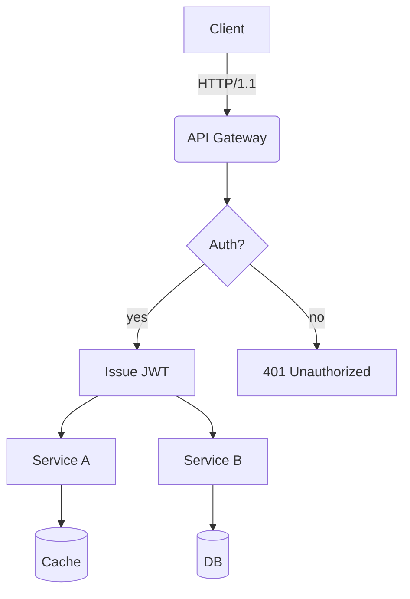
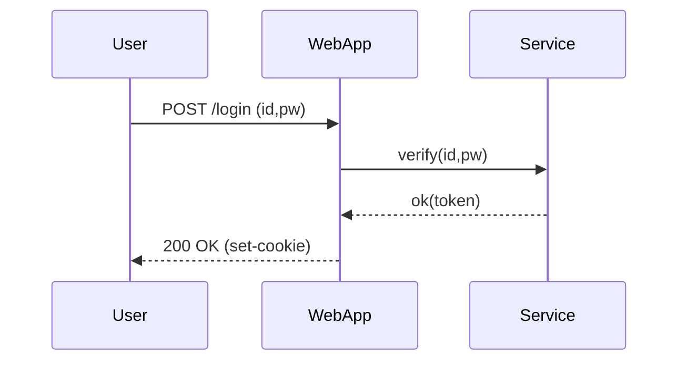
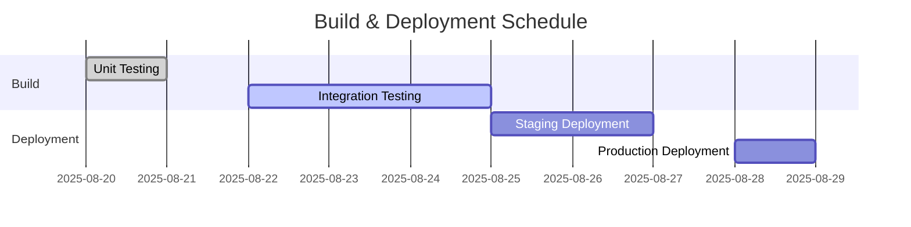
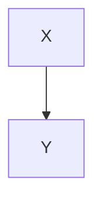

# Translation Test Document for **Rich Markdown**

This document is designed to exceed *4096 tokens* with a collection of various Korean content formats for testing **robustness** including translation engine/LLM context handling, format preservation, and rules for ignoring code/diagrams.

> **Guide**
> 1) Ensure code blocks and `mermaid` areas remain unchanged.
> 2) Verify preservation of numbers/units (e.g., 1.2GB, 3ms), slash paths (`/var/log/app.log`), and options (`--flag`).
> 3) Layouts should remain intact even with mixed tables, lists, quotations, checkboxes, equations, and emojis 😀.

## 1. Mixed Tables with Symbols/Units

| Item         | Value | Unit | Notes          |
|--------------|-------|------|----------------|
| Throughput   | 12,345| RPS  | Peak at 18,900 RPS |
| Latency (P50)| 3.2   | ms   | `--enable-cache` applied |
| Latency (P99)| 41.7  | ms   | Includes GC phase |
| Memory       | 1.5   | GB   | RSS based, cgroup limit 2GB |
| Disk I/O     | 220   | MB/s | Via NVMe-oF(TCP) |

## 2. Task List

- [x] Accuracy of Markdown header translation
- [x] Preservation of keywords within code blocks (`for`, `if`, `return`, etc.)
- [ ] Preservation of diagrams and ignoring comments for Mermaid diagrams
- [ ] Preservation of units (GB/ms/%), paths (`/etc/hosts`)
- [ ] Preservation of inline equations $O(n \log n)$

## 3. Code Blocks: Bash/Python/JSON/YAML

```bash
#!/usr/bin/env bash
set -euo pipefail

APP_ENV="${APP_ENV:-prod}"
INPUT="${1:-/data/input.txt}"
OUT="/var/tmp/result.json"

echo "[INFO] starting job on $(hostname) at $(date -Iseconds)"
if [[ ! -f "$INPUT" ]]; then
  echo "[ERROR] input not found: $INPUT" >&2
  exit 1
fi

lines=$(wc -l < "$INPUT")
echo "[DEBUG] line count: $lines"

curl -sS -X POST "http://127.0.0.1:8080/api" \  -H "Content-Type: application/json" \  -d "{"env":"$APP_ENV","count":$lines}" > "$OUT"

jq -r '.status' "$OUT" | grep -q success && echo "OK" || { echo "FAIL"; exit 2; }
```

```python
from __future__ import annotations

def rolling_avg(xs: list[float], k: int) -> list[float]:
    if k <= 0:
        raise ValueError("k must be > 0")
    out = []
    acc = 0.0
    for i, v in enumerate(xs):
        acc += v
        if i >= k:
            acc -= xs[i-k]
        if i >= k - 1:
            out.append(acc / k)
    return out

print(rolling_avg([1,2,3,4,5,6,7,8,9], 3))
```

```json
{
  "service": "analytics",
  "version": "1.4.2",
  "features": ["rollup", "compaction", "delta-index"],
  "limits": {
    "max_docs": 1000000,
    "max_payload_mb": 256
  }
}
```

```yaml
apiVersion: v1
kind: ConfigMap
metadata:
  name: test-config
data:
  APP_ENV: "staging"
  ENDPOINT: "https://api.example.com"
```

## 4. Mermaid Diagrams

### 4.1 Flowchart


### 4.2 Sequence Diagram


### 4.3 Gantt Chart


## 5. Images/Links/Quotations


- Document: <https://example.com/docs/guide>
- API Reference: [API Reference](https://example.com/api)
- Issue Tracker: https://example.com/issues

> “Translation quality is determined by the simultaneous preservation of layout and meaning.” — Anonymous

## 6. Mix of Equations and Text

- Average Time Complexity: $O(n \log n)$, Worst: $O(n^2)$
- Variance: $\sigma^2 = \frac{1}{n}\sum_{i=1}^{n}(x_i-\mu)^2$
- Sample Mean: $\bar{x} = \frac{1}{n}\sum x_i$

Paragraph Example: This paragraph serves as a sample to ensure proper preservation even when **bold**, *italic*, `code` are mixed during translation. Includes emojis 😀, Chinese characters 漢字, English CamelCase, snake_case, kebab-case.

### 7.1 Experimental Section — Variation Pattern
The following paragraph varies slightly in vocabulary and order each iteration to prevent repetitive translation:
- Scenario: Summary of conversation logs
- Condition: Includes 100k characters in Korean
- Expected Result: Summary accuracy over 90%

#### Procedure
1. Input Data: `/data/input_01.jsonl`
2. Options: `--batch 512 --timeout 3s --enable-cache`
3. Execution: `app run --job test-01 --qos high`
4. Verification: Check if `test-01 finished` is included in logs

#### Observations
- Longer GC cycles show an increasing trend in P99 latency
- Processing throughput decreases by ~7% when cache miss ratio increases by 10%
- Increasing connection pool size from 32 to 64 results in a decrease in retry rate per second from 1.2% to 0.6%

---

### 7.2 Experimental Section — Variation Pattern
The following paragraph varies slightly in vocabulary and order each iteration to prevent repetitive translation:
- Scenario: Summary of conversation logs
- Condition: Includes 100k characters in Korean
- Expected Result: Summary accuracy over 90%

#### Procedure
1. Input Data: `/data/input_02.jsonl`
2. Options: `--batch 512 --timeout 3s --enable-cache`
3. Execution: `app run --job test-02 --qos high`
4. Verification: Check if `test-02 finished` is included in logs

#### Observations
- Longer GC cycles show an increasing trend in P99 latency
- Processing throughput decreases by ~7% when cache miss ratio increases by 10%
- Increasing connection pool size from 32 to 64 results in a decrease in retry rate per second from 1.2% to 0.6%

---

### 7.3 Experimental Section — Variation Pattern
The following paragraph varies slightly in vocabulary and order each iteration to prevent repetitive translation:
- Scenario: Kubernetes Deployment
- Condition: HPA Enabled
- Expected Result: Scale within range 2~10 operates

#### Procedure
1. Input Data: `/data/input_03.jsonl`
2. Options: `--batch 512 --timeout 3s --enable-cache`
3. Execution: `app run --job test-03 --qos high`
4. Verification: Check if `test-03 finished` is included in logs

#### Observations
- Longer GC cycles show an increasing trend in P99 latency
- Processing throughput decreases by ~7% when cache miss ratio increases by 10%
- Increasing connection pool size from 32 to 64 results in a decrease in retry rate per second from 1.2% to 0.6%

---

### 7.4 Experimental Section — Variation Pattern
The following paragraph varies slightly in vocabulary and order each iteration to prevent repetitive translation:
- Scenario: Kubernetes Deployment
- Condition: HPA Enabled
- Expected Result: Scale within range 2~10 operates

#### Procedure
1. Input Data: `/data/input_04.jsonl`
2. Options: `--batch 512 --timeout 3s --enable-cache`
3. Execution: `app run --job test-04 --qos high`
4. Verification: Check if `test-04 finished` is included in logs

#### Observations
- Longer GC cycles show an increasing trend in P99 latency
```
### 7.10 실험 단락 — 변형 패턴

#### 절차
1. 입력 데이터: `/data/input_10.jsonl`
2. 옵션: `--batch 512 --timeout 3s --enable-cache`
3. 실행: `app run --job test-10 --qos high`
4. 검증: 로그에서 `test-10 finished` 포함 여부 확인

#### 관찰사항
- GC 주기가 길어질수록 P99 지연시간 증가 경향 관측
- 캐시 미스 비율이 10%p 증가할 때 처리량은 ~7% 감소
- 커넥션 풀 사이즈가 32 → 64로 증가 시 초당 재시도율이 1.2% → 0.6%로 감소

---

### 성능 지표
- 캐시 미스 비율 증가 시 처리량 감소: ~7%
- 커넥션 풀 크기 조정 시 재시도율 변화: 32 → 64 증가 시 1.2% → 0.6% 감소
### 7.10 Experiment Section — Variation Patterns

#### Observations
- **Observation**: As GC (Garbage Collection) cycles lengthen, there is a tendency towards increased P99 latency.
- Increased cache miss ratio by 10% leads to approximately a 7% decrease in throughput.
- When the connection pool size increases from 32 to 64, the retry rate per second decreases from 1.2% to 0.6%.

---

### 7.11 Experiment Section — Variation Patterns

#### Procedure
1. Input Data: `/data/input_11.jsonl`
2. Options: `--batch 512 --timeout 3s --enable-cache`
3. Execution: `app run --job test-11 --qos high`
4. Verification: Check if `test-11 finished` is included in the logs.

#### Observations
- **Observation**: As GC cycles lengthen, there is a tendency towards increased P99 latency.
- Increased cache miss ratio by 10% leads to approximately a 7% decrease in throughput.
- When the connection pool size increases from 32 to 64, the retry rate per second decreases from 1.2% to 0.6%.

---

### 7.12 Experiment Section — Variation Patterns

#### Procedure
1. Input Data: `/data/input_12.jsonl`
2. Options: `--batch 512 --timeout 3s --enable-cache`
3. Execution: `app run --job test-12 --qos high`
4. Verification: Check if `test-12 finished` is included in the logs.

#### Observations
- **Observation**: As GC cycles lengthen, there is a tendency towards increased P99 latency.
- Increased cache miss ratio by 10% leads to approximately a 7% decrease in throughput.
- When the connection pool size increases from 32 to 64, the retry rate per second decreases from 1.2% to 0.6%.

---

### 7.13 Experiment Section — Variation Patterns

#### Procedure
1. Input Data: `/data/input_13.jsonl`
2. Options: `--batch 512 --timeout 3s --enable-cache`
3. Execution: `app run --job test-13 --qos high`
4. Verification: Check if `test-13 finished` is included in the logs.

#### Observations
- **Observation**: As GC cycles lengthen, there is a tendency towards increased P99 latency.
- Increased cache miss ratio by 10% leads to approximately a 7% decrease in throughput.
- When the connection pool size increases from 32 to 64, the retry rate per second decreases from 1.2% to 0.6%.

---

### 7.14 Experiment Section — Variation Patterns

#### Procedure
1. Input Data: `/data/input_14.jsonl`
2. Options: `--batch 512 --timeout 3s --enable-cache`
3. Execution: `app run --job test-14 --qos high`
4. Verification: Check if `test-14 finished` is included in the logs.

#### Observations
- **Observation**: As GC cycles lengthen, there is a tendency towards increased P99 latency.
- Increased cache miss ratio by 10% leads to approximately a 7% decrease in throughput.
- When the connection pool size increases from 32 to 64, the retry rate per second decreases from 1.2% to 0.6%.

---

### 7.15 Experiment Section — Variation Patterns

#### Procedure
1. Input Data: `/data/input_15.jsonl`
2. Options: `--batch 512 --timeout 3s --enable-cache`
3. Execution: `app run --job test-15 --qos high`
4. Verification: Check if `test-15 finished` is included in the logs.

#### Observations
- **Observation**: As GC cycles lengthen, there is a tendency towards increased P99 latency.
- Scenario: NVMe-oF I/O retry testing under conditions of TCP RTT at 2ms with a loss rate of 0.1%, expecting retry rate below 1%.
### 7.16 Experiment Section — Variation Patterns
#### Observations
- As GC (Garbage Collection) cycles lengthen, there is a tendency towards increased P99 latency.
- When the cache miss ratio increases by 10%p, throughput decreases by ~7%.
- When the connection pool size increases from 32 to 64, the retry rate per second decreases from 1.2% to 0.6%.

---

### 7.17 Experiment Section — Variation Patterns
#### Observations
- As GC (Garbage Collection) cycles lengthen, there is a tendency towards increased P99 latency.
- When the cache miss ratio increases by 10%p, throughput decreases by ~7%.
- When the connection pool size increases from 32 to 64, the retry rate per second decreases from 1.2% to 0.6%.

---

### 7.18 Experiment Section — Variation Patterns
#### Observations
- As GC (Garbage Collection) cycles lengthen, there is a tendency towards increased P99 latency.
- When the cache miss ratio increases by 10%p, throughput decreases by ~7%.
- When the connection pool size increases from 32 to 64, the retry rate per second decreases from 1.2% to 0.6%.

---

### 7.19 Experiment Section — Variation Patterns
#### Observations
- As GC (Garbage Collection) cycles lengthen, there is a tendency towards increased P99 latency.
- When the cache miss ratio increases by 10%p, throughput decreases by ~7%.
- When the connection pool size increases from 32 to 64, the retry rate per second decreases from 1.2% to 0.6%.

---

### 7.20 Experiment Section — Variation Patterns
#### Observations
- As GC (Garbage Collection) cycles lengthen, there is a tendency towards increased P99 latency.
- When the cache miss ratio increases by 10%p, throughput decreases by ~7%.
- When the connection pool size increases from 32 to 64, the retry rate per second decreases from 1.2% to 0.6%.

---

### 7.21 Experiment Section — Variation Patterns
#### Observations
- As GC (Garbage Collection) cycles lengthen, there is a tendency towards increased P99 latency.
- When the cache miss ratio increases by 10%p, throughput decreases by ~7%.
- When the connection pool size increases from 32 to 64, the retry rate per second decreases from 1.2% to 0.6%.

---

### 7.22 Experiment Section — Variation Patterns
#### Observations
- **Observation**: As GC (Garbage Collection) cycles lengthen, there is a tendency towards increased P99 latency.
- When the connection pool size increases from 32 to 64, the retry rate per second decreases from 1.2% to 0.6%.
- Scenario: NVMe-oF I/O retry
  - Condition: TCP RTT 2ms, loss 0.1%
  - Expected Result: Retry rate ≤ 1%

---
### 7.27 Experiment Section — Variation Patterns

#### Procedure
1. Input Data: `/data/input_27.jsonl`
2. Options: `--batch 512 --timeout 3s --enable-cache`
3. Execution: `app run --job test-27 --qos high`
4. Verification: Check if `test-27 finished` is included in the logs

#### Observations
- As GC (Garbage Collection) cycles lengthen, there is a tendency towards increased P99 latency.
- When the cache miss ratio increases by 10%, throughput decreases by approximately 7%.
- When the connection pool size increases from 32 to 64, the retry rate per second decreases from 1.2% to 0.6%.

---

### 7.28 Experiment Section — Variation Patterns

#### Procedure
1. Input Data: `/data/input_28.jsonl`
2. Options: `--batch 512 --timeout 3s --enable-cache`
3. Execution: `app run --job test-28 --qos high`
4. Verification: Check if `test-28 finished` is included in the logs

#### Observations
- As GC (Garbage Collection) cycles lengthen, there is a tendency towards increased P99 latency.
- When the cache miss ratio increases by 10%, throughput decreases by approximately 7%.
- When the connection pool size increases from 32 to 64, the retry rate per second decreases from 1.2% to 0.6%.

---

### 7.29 Experiment Section — Variation Patterns

#### Procedure
1. Input Data: `/data/input_29.jsonl`
2. Options: `--batch 512 --timeout 3s --enable-cache`
3. Execution: `app run --job test-29 --qos high`
4. Verification: Check if `test-29 finished` is included in the logs

#### Observations
- As GC (Garbage Collection) cycles lengthen, there is a tendency towards increased P99 latency.
- When the cache miss ratio increases by 10%, throughput decreases by approximately 7%.
- When the connection pool size increases from 32 to 64, the retry rate per second decreases from 1.2% to 0.6%.

---

### 7.30 Experiment Section — Variation Patterns

#### Procedure
1. Input Data: `/data/input_30.jsonl`
2. Options: `--batch 512 --timeout 3s --enable-cache`
3. Execution: `app run --job test-30 --qos high`
4. Verification: Check if `test-30 finished` is included in the logs

#### Observations
- As GC (Garbage Collection) cycles lengthen, there is a tendency towards increased P99 latency.
- When the cache miss ratio increases by 10%, throughput decreases by approximately 7%.
- When the connection pool size increases from 32 to 64, the retry rate per second decreases from 1.2% to 0.6%.

---
### 7.27 Experiment Section — Variation Patterns

#### Observations
- **As connection pool size increases from 32 to 64, the retry rate per second decreases from 1.2% to 0.6%.**

---

### 7.28 Experiment Section — Variation Patterns

#### Observations
- **As connection pool size increases from 32 to 64, the retry rate per second decreases from 1.2% to 0.6%.**

---

### 7.29 Experiment Section — Variation Patterns

#### Observations
- **Observed an increasing trend in P99 latency delay as GC cycle lengthens.**
- **Processing throughput decreases by approximately 7% when cache miss ratio increases by 10%p.**
- **As connection pool size increases from 32 to 64, the retry rate per second decreases from 1.2% to 0.6%.**

---

### 7.30 Experiment Section — Variation Patterns

#### Observations
- **Observed an increasing trend in P99 latency delay as GC cycle lengthens.**
- **Processing throughput decreases by approximately 7% when cache miss ratio increases by 10%p.**
- **As connection pool size increases from 32 to 64, the retry rate per second decreases from 1.2% to 0.6%.**

---

### 7.31 Experiment Section — Variation Patterns

#### Observations
- **Observed an increasing trend in P99 latency delay as GC cycle lengthens.**
- **Processing throughput decreases by approximately 7% when cache miss ratio increases by 10%p.**
- **As connection pool size increases from 32 to 64, the retry rate per second decreases from 1.2% to 0.6%.**

---

### 7.32 Experiment Section — Variation Patterns

#### Observations
- **Observed an increasing trend in P99 latency delay as GC cycle lengthens.**
- **Processing throughput decreases by approximately 7% when cache miss ratio increases by 10%p.**
- **As connection pool size increases from 32 to 64, the retry rate per second decreases from 1.2% to 0.6%.**

---
### 7.32 Experiment Section — Variation Patterns

#### Procedure
3. Execution: `app run --job test-32 --qos high`
4. Verification: Check if `test-32 finished` is included in the logs

#### Observations
- Longer GC cycles show an increasing trend in P99 latency
- Processing throughput decreases by ~7% when cache miss ratio increases by 10%p
- When connection pool size increases from 32 to 64, retry rate per second decreases from 1.2% to 0.6%

---

### 7.33 Experiment Section — Variation Patterns

#### Observations
- Longer GC cycles show an increasing trend in P99 latency
- Processing throughput decreases by ~7% when cache miss ratio increases by 10%p
- When connection pool size increases from 32 to 64, retry rate per second decreases from 1.2% to 0.6%

---

### 7.34 Experiment Section — Variation Patterns

#### Observations
- Longer GC cycles show an increasing trend in P99 latency
- Processing throughput decreases by ~7% when cache miss ratio increases by 10%p
- When connection pool size increases from 32 to 64, retry rate per second decreases from 1.2% to 0.6%

---

### 7.35 Experiment Section — Variation Patterns

#### Observations
- Longer GC cycles show an increasing trend in P99 latency
- Processing throughput decreases by ~7% when cache miss ratio increases by 10%p
- When connection pool size increases from 32 to 64, retry rate per second decreases from 1.2% to 0.6%

---

### 7.36 Experiment Section — Variation Patterns

#### Observations
- Longer GC cycles show an increasing trend in P99 latency
- Processing throughput decreases by ~7% when cache miss ratio increases by 10%p
- When connection pool size increases from 32 to 64, retry rate per second decreases from 1.2% to 0.6%

---

### 7.37 Experiment Section — Variation Patterns

#### Procedure
1. Input Data: `/data/input_37.jsonl`
2. Options: `--batch 512 --timeout 3s --enable-cache`
3. Execution: `app run --job test-37 --qos high`
4. Verification: Check if `test-37 finished` is included in the logs

#### Observations
- Longer GC cycles show an increasing trend in P99 latency
- Processing throughput decreases by ~7% when cache miss ratio increases by 10%p
- When connection pool size increases from 32 to 64, retry rate per second decreases from 1.2% to 0.6%

---

### 7.38 Experiment Section — Variation Patterns

#### Observations
- Longer GC cycles show an increasing trend in P99 latency
- Processing throughput decreases by ~7% when cache miss ratio increases by 10%p
- When connection pool size increases from 32 to 64, retry rate per second decreases from 1.2% to 0.6%
### 7.39 Experiment Section — Variation Patterns

#### Observations
- **Observation:** Increased tendency of P99 latency with longer GC cycles observed.
- **Observation:** Throughput decreases by approximately 7% when cache miss ratio increases by 10%.
- **Observation:** Decrease in retry rate per second from 1.2% to 0.6% when connection pool size increases from 32 to 64.

---

### 7.40 Experiment Section — Variation Patterns

#### Observations
- **Observation:** Increased tendency of P99 latency with longer GC cycles observed.
- **Observation:** Throughput decreases by approximately 7% when cache miss ratio increases by 10%.
- **Observation:** Decrease in retry rate per second from 1.2% to 0.6% when connection pool size increases from 32 to 64.

---

## 8. Detailed Checklist

- **Case #001:** Consistent Error Handling
- **Case #002:** Performance Profiling
- **Case #003:** Accessibility (a11y)
- **Case #004:** Log Schema Stability
- **Case #005:** Cache Invalidation Scenarios
- **Case #006:** Performance Profiling
- **Case #007:** Performance Profiling
- **Case #008:** API Backward Compatibility
- **Case #009:** Log Schema Stability
- **Case #010:** Accessibility (a11y)
- **Case #011:** Cache Invalidation Scenarios
- **Case #012:** Performance Profiling
- **Case #013:** Security Header Implementation
- **Case #014:** Internationalization (i18n)
- **Case #015:** Resource Leak Inspection
- **Case #016:** Consistent Error Handling
- **Case #017:** Consistent Error Handling
- **Case #018:** Internationalization (i18n)
- **Case #019:** CORS Policy Validation
- **Case #020:** Performance Profiling
- **Case #021:** Security Header Implementation
- **Case #022:** Log Schema Stability
- **Case #023:** Performance Profiling
- **Case #024:** Cache Invalidation Scenarios
- **Case #025:** CORS Policy Validation
- **Case #026:** Performance Profiling
- **Case #027:** Accessibility (a11y)
- **Case #028:** Accessibility (a11y)
- **Case #029:** API Backward Compatibility
- **Case #030:** Cache Invalidation Scenarios
- **Case #031:** Cache Invalidation Scenarios
- **Case #032:** Performance Profiling
- **Case #033:** Resource Leak Inspection
- **Case #034:** Log Schema Stability
- **Case #035:** CORS Policy Validation
- **Case #036:** Consistent Error Handling
- **Case #037:** Resource Leak Inspection
- **Case #038:** Consistent Error Handling
- **Case #039:** Internationalization (i18n)
- **Case #040:** API Backward Compatibility
- **Case #041:** Cache Invalidation Scenarios
- **Case #042:** Cache Invalidation Scenarios
- **Case #043:** Cache Invalidation Scenarios
### Performance Profiling — Case #044
### Performance Profiling — Case #045
### CORS Policy Verification — Case #046
### Resource Leak Check — Case #047
### Cache Invalidation Scenario — Case #048
### Error Handling Consistency — Case #049
### Log Schema Stability — Case #050
### Resource Leak Check — Case #051
### Internationalization (i18n) — Case #052
### Log Schema Stability — Case #053
### Resource Leak Check — Case #054
### Security Header Application — Case #055
### Internationalization (i18n) — Case #056
### API Backward Compatibility — Case #057
### Accessibility (a11y) — Case #058
### API Backward Compatibility — Case #059
### Performance Profiling — Case #060
### Accessibility (a11y) — Case #061
### API Backward Compatibility — Case #062
### Internationalization (i18n) — Case #063
### Security Header Application — Case #064
### Performance Profiling — Case #066
### Accessibility (a11y) — Case #067
### Error Handling Consistency — Case #068
### Performance Profiling — Case #069
### Resource Leak Check — Case #070
### Accessibility (a11y) — Case #071
### Internationalization (i18n) — Case #072
### Error Handling Consistency — Case #073
### Internationalization (i18n) — Case #074
### Performance Profiling — Case #075
### Security Header Application — Case #076
### CORS Policy Verification — Case #077
### Resource Leak Check — Case #078
### Resource Leak Check — Case #079
### Performance Profiling — Case #080
### Accessibility (a11y) — Case #081
### Accessibility (a11y) — Case #082
### Performance Profiling — Case #083
### Resource Leak Check — Case #084
### Accessibility (a11y) — Case #085
### Cache Invalidation Scenario — Case #086
### CORS Policy Verification — Case #087
### Log Schema Stability — Case #088
### CORS Policy Verification — Case #089
### Security Header Application — Case #090
### API Backward Compatibility — Case #091
### Accessibility (a11y) — Case #092
### Performance Profiling — Case #093
### Performance Profiling — Case #094
### Log Schema Stability — Case #095
### Internationalization (i18n) — Case #096
### API Backward Compatibility — Case #097
### Error Handling Consistency — Case #098
### Cache Invalidation Scenario — Case #099
### Accessibility (a11y) — Case #100
### Accessibility (a11y) — Case #101
### Internationalization (i18n) — Case #102
### Accessibility (a11y) — Case #103
### API Backward Compatibility — Case #104
### Accessibility (a11y) — Case #105
### Performance Profiling — Case #106
### Security Header Application — Case #107
### API Backward Compatibility — Case #108
### Security Header Application — Case #109
### Error Handling Consistency — Case #110
### Performance Profiling — Case #111
### Resource Leak Check — Case #112
### CORS Policy Verification — Case #113
### Accessibility (a11y) — Case #114
### Error Handling Consistency — Case #115
### Error Handling Consistency — Case #116
### Performance Profiling — Case #117
### CORS Policy Verification — Case #118
### Resource Leak Check — Case #119
### Cache Invalidation Scenario — Case #120
### CORS Policy Verification — Case #121
### Performance Profiling — Case #122
### Error Handling Consistency — Case #123
### Performance Profiling — Case #124
### Performance Profiling — Case #125
### Accessibility (a11y) — Case #126
### Accessibility (a11y) — Case #127
### Error Handling Consistency — Case #128
### Error Handling Consistency — Case #129
### API Backward Compatibility — Case #130
### Accessibility (a11y) — Case #131
### API Backward Compatibility — Case #132
### Cache Invalidation Scenario — Case #133
### Security Header Implementation — Case #134
### Internationalization (i18n) — Case #135
### Security Header Implementation — Case #136
### Performance Profiling — Case #137
### Performance Profiling — Case #138
### CORS Policy Verification — Case #139
### Internationalization (i18n) — Case #140
### Log Schema Stability — Case #141
### CORS Policy Verification — Case #142
### Accessibility (a11y) — Case #143
### Security Header Implementation — Case #144
### Log Schema Stability — Case #145
### Performance Profiling — Case #146
### Performance Profiling — Case #147
### API Backward Compatibility — Case #148
### Resource Leak Check — Case #149
### Performance Profiling — Case #150
### Resource Leak Check — Case #151
### Accessibility (a11y) — Case #152
### API Backward Compatibility — Case #153
### Accessibility (a11y) — Case #154
### Security Header Implementation — Case #155
### Accessibility (a11y) — Case #156
### Performance Profiling — Case #157
### Cache Invalidation Scenario — Case #158
### Security Header Implementation — Case #159
### Error Handling Consistency — Case #160
### Log Schema Stability — Case #161
### Performance Profiling — Case #162
### Accessibility (a11y) — Case #163
### Error Handling Consistency — Case #164
### Resource Leak Check — Case #165
### Log Schema Stability — Case #166
### Internationalization (i18n) — Case #167
### Cache Invalidation Scenario — Case #168
### Internationalization (i18n) — Case #169
### Cache Invalidation Scenario — Case #170
### Resource Leak Check — Case #171
### Security Header Implementation — Case #172
### Resource Leak Check — Case #173
### Error Handling Consistency — Case #174
### Resource Leak Check — Case #175
### Log Schema Stability — Case #176
### CORS Policy Verification — Case #177
### Security Header Implementation — Case #178
### Log Schema Stability — Case #179
### Performance Profiling — Case #180
### Resource Leak Check — Case #181
### Internationalization (i18n) — Case #182
### Log Schema Stability — Case #183
### Accessibility (a11y) — Case #184
### Security Header Implementation — Case #185
### Resource Leak Check — Case #186
### Resource Leak Check — Case #187
### Accessibility (a11y) — Case #188
### Cache Invalidation Scenario — Case #189
### Accessibility (a11y) — Case #190
### Cache Invalidation Scenario — Case #191
### Error Handling Consistency — Case #192
### Error Handling Consistency — Case #193
### Resource Leak Check — Case #194
### Error Handling Consistency — Case #195
### CORS Policy Verification — Case #196
### Performance Profiling — Case #197
### Resource Leak Check — Case #198
### Accessibility (a11y) — Case #199
### Resource Leak Check — Case #200
### Cache Invalidation Scenario — Case #201
### Internationalization (i18n) — Case #202
### Log Schema Stability — Case #203
### Error Handling Consistency — Case #204
### Resource Leak Check — Case #205
### Security Header Implementation — Case #206
### Resource Leak Check — Case #207
### Cache Invalidation Scenario — Case #208
### Performance Profiling — Case #209
### Security Header Implementation — Case #210
### Internationalization (i18n) — Case #211
### Log Schema Stability — Case #212
### Error Handling Consistency — Case #213
### Cache Invalidation Scenario — Case #214
### Security Header Implementation — Case #215
### Internationalization (i18n) — Case #216
### Security Header Implementation — Case #217
### Performance Profiling — Case #218
### Error Handling Consistency — Case #219
### Security Header Implementation — Case #220
### Performance Profiling — Case #221
### API Backward Compatibility — Case #222
### Resource Leak Inspection — Case #223
### Internationalization (i18n) — Case #224
### Security Header Implementation — Case #225
### Internationalization (i18n) — Case #226
### Performance Profiling — Case #227
### Log Schema Stability — Case #228
### CORS Policy Verification — Case #229
### Performance Profiling — Case #230
### API Backward Compatibility — Case #231
### CORS Policy Verification — Case #232
### Internationalization (i18n) — Case #233
### Error Handling Consistency — Case #234
### Performance Profiling — Case #235
### Error Handling Consistency — Case #236
### Performance Profiling — Case #237
### Security Header Implementation — Case #238
### Error Handling Consistency — Case #239
### CORS Policy Verification — Case #240
### API Backward Compatibility — Case #241
### Performance Profiling — Case #242
### Cache Invalidation Scenario — Case #243
### Performance Profiling — Case #244
### Security Header Implementation — Case #245
### Error Handling Consistency — Case #246
### Internationalization (i18n) — Case #247
### Log Schema Stability — Case #248
### Security Header Implementation — Case #249
### Accessibility (a11y) — Case #250
### Accessibility (a11y) — Case #251
### Internationalization (i18n) — Case #252
### Internationalization (i18n) — Case #253
### CORS Policy Verification — Case #254
### Log Schema Stability — Case #255
### CORS Policy Verification — Case #256
### Security Header Implementation — Case #257
### Cache Invalidation Scenario — Case #258
### Error Handling Consistency — Case #259
### Accessibility (a11y) — Case #260
### Resource Leak Inspection — Case #261
### Resource Leak Inspection — Case #262
### Performance Profiling — Case #263
### Accessibility (a11y) — Case #264
### Cache Invalidation Scenario — Case #265
### Security Header Implementation — Case #266
### Resource Leak Inspection — Case #267
### Security Header Implementation — Case #268
### Performance Profiling — Case #269
### Error Handling Consistency — Case #270
### Internationalization (i18n) — Case #271
### API Backward Compatibility — Case #272
### Error Handling Consistency — Case #273
### Accessibility (a11y) — Case #274
### API Backward Compatibility — Case #275
### Internationalization (i18n) — Case #276
### CORS Policy Verification — Case #277
### Security Header Implementation — Case #278
### Cache Invalidation Scenario — Case #279
### Log Schema Stability — Case #280
### Resource Leak Inspection — Case #281
### Resource Leak Inspection — Case #282
### Accessibility (a11y) — Case #283
### Accessibility (a11y) — Case #284
### Error Handling Consistency — Case #285
### API Backward Compatibility — Case #286
### Cache Invalidation Scenario — Case #287
### Accessibility (a11y) — Case #288
### Accessibility (a11y) — Case #289
### Security Header Implementation — Case #290
### Internationalization (i18n) — Case #291
### Security Header Implementation — Case #292
### CORS Policy Verification — Case #293
### Resource Leak Inspection — Case #294
### Security Header Implementation — Case #295
### CORS Policy Verification — Case #296
### Log Schema Stability — Case #297
### Cache Invalidation Scenario — Case #298
### API Backward Compatibility — Case #299
### Cache Invalidation Scenario — Case #300
### Internationalization (i18n) — Case #301
### Accessibility (a11y) — Case #302
### Performance Profiling — Case #303
### API Backward Compatibility — Case #304
### Error Handling Consistency — Case #305
### Accessibility (a11y) — Case #306
### Resource Leak Inspection — Case #307
### API Backward Compatibility — Case #308
### Security Header Implementation — Case #309
### CORS Policy Verification — Case #293
### API Backward Compatibility — Case #311
### API Backward Compatibility — Case #322
### Accessibility (a11y) — Case #323
### API Backward Compatibility — Case #324
### Internationalization (i18n) — Case #325
### Resource Leak Inspection — Case #326
### Internationalization (i18n) — Case #327
### Log Schema Stability — Case #328
### Security Header Implementation — Case #329
### Log Schema Stability — Case #330
### Error Handling Consistency — Case #331
### Performance Profiling — Case #332
### Accessibility (a11y) — Case #333
### Security Header Implementation — Case #334
### API Backward Compatibility — Case #335
### CORS Policy Verification — Case #336
### Resource Leak Inspection — Case #337
### CORS Policy Verification — Case #338
### CORS Policy Verification — Case #339
### API Backward Compatibility — Case #340
### Accessibility (a11y) — Case #341
### Performance Profiling — Case #342
### Accessibility (a11y) — Case #343
### Error Handling Consistency — Case #344
### Internationalization (i18n) — Case #345
### Cache Invalidation Scenario — Case #346
### API Backward Compatibility — Case #347
### Cache Invalidation Scenario — Case #348
### CORS Policy Verification — Case #349
### Resource Leak Inspection — Case #350
### Performance Profiling — Case #351
### Accessibility (a11y) — Case #352
### Error Handling Consistency — Case #353
### Internationalization (i18n) — Case #354
### Resource Leak Inspection — Case #355
### Accessibility (a11y) — Case #356
### Security Header Implementation — Case #357
### Resource Leak Inspection — Case #358
### Performance Profiling — Case #359
### Resource Leak Inspection — Case #360
### Log Schema Stability — Case #361
### Error Handling Consistency — Case #362
### Cache Invalidation Scenario — Case #363
### Internationalization (i18n) — Case #364
### Resource Leak Inspection — Case #365
### Accessibility (a11y) — Case #366
### Log Schema Stability — Case #367
### Resource Leak Inspection — Case #368
### Performance Profiling — Case #369
### API Backward Compatibility — Case #370
### Accessibility (a11y) — Case #371
### Performance Profiling — Case #372
### CORS Policy Verification — Case #373
### Cache Invalidation Scenario — Case #374
### Security Header Implementation — Case #375
### Accessibility (a11y) — Case #376
### API Backward Compatibility — Case #377
### Accessibility (a11y) — Case #378
### Security Header Implementation — Case #379
### CORS Policy Verification — Case #380
### Log Schema Stability — Case #381
### Log Schema Stability — Case #382
### Performance Profiling — Case #383
### Error Handling Consistency — Case #384
### Performance Profiling — Case #385
### Log Schema Stability — Case #386
### Resource Leak Inspection — Case #387
### Accessibility (a11y) — Case #388
### API Backward Compatibility — Case #389
### Performance Profiling — Case #390
### CORS Policy Verification — Case #391
### API Backward Compatibility — Case #392
### Resource Leak Inspection — Case #393
### Security Header Implementation — Case #394
### Cache Invalidation Scenario — Case #395
### Resource Leak Inspection — Case #396
### Performance Profiling — Case #397
### Performance Profiling — Case #456
### Security Header Implementation — Case #458
### Resource Leak Inspection — Case #459
### Performance Profiling — Case #460
### Accessibility (a11y) — Case #461
### Error Handling Consistency — Case #462
### Error Handling Consistency — Case #463
### Error Handling Consistency — Case #464
### Cache Invalidation Scenario — Case #465
### Internationalization (i18n) — Case #466
### Accessibility (a11y) — Case #467
### Log Schema Stability — Case #468
### Internationalization (i18n) — Case #469
### API Backward Compatibility — Case #470
### Security Header Implementation — Case #471
### API Backward Compatibility — Case #472
### Error Handling Consistency — Case #473
### Log Schema Stability — Case #474
### Performance Profiling — Case #475
### CORS Policy Validation — Case #476
### CORS Policy Validation — Case #477
### Internationalization (i18n) — Case #478
### Internationalization (i18n) — Case #479
### CORS Policy Validation — Case #480
### API Backward Compatibility — Case #481
### Performance Profiling — Case #482
### Log Schema Stability — Case #483
### API Backward Compatibility — Case #484
### Cache Invalidation Scenario — Case #485
### Error Handling Consistency — Case #486
### Performance Profiling — Case #487
### Error Handling Consistency — Case #488
### Cache Invalidation Scenario — Case #489
### Security Header Implementation — Case #490
### Cache Invalidation Scenario — Case #491
### Error Handling Consistency — Case #492
### Resource Leak Inspection — Case #493
### Resource Leak Inspection — Case #494
### Error Handling Consistency — Case #495
### Internationalization (i18n) — Case #496
### Security Header Implementation — Case #497
### API Backward Compatibility — Case #498
### Accessibility (a11y) — Case #499
### Cache Invalidation Scenario — Case #500
### Cache Invalidation Scenario — Case #501
### API Backward Compatibility — Case #502
### Internationalization (i18n) — Case #503
### Internationalization (i18n) — Case #504
### Resource Leak Inspection — Case #505
### Resource Leak Inspection — Case #506
### Internationalization (i18n) — Case #507
### Cache Invalidation Scenario — Case #508
### Accessibility (a11y) — Case #509
### Performance Profiling — Case #510
### Resource Leak Inspection — Case #511
### Accessibility (a11y) — Case #512
### CORS Policy Validation — Case #513
### Cache Invalidation Scenario — Case #514
### API Backward Compatibility — Case #515
### CORS Policy Validation — Case #516
### API Backward Compatibility — Case #517
### API Backward Compatibility — Case #518
### Performance Profiling — Case #519
### Accessibility (a11y) — Case #520
### CORS Policy Validation — Case #521
### Security Header Implementation — Case #522
### Cache Invalidation Scenario — Case #523
### Log Schema Stability — Case #524
### CORS Policy Validation — Case #525
### Internationalization (i18n) — Case #526
### Log Schema Stability — Case #527
### Resource Leak Inspection — Case #528
### Internationalization (i18n) — Case #529
### Error Handling Consistency — Case #530
### Error Handling Consistency — Case #531
### Log Schema Stability — Case #532
### Performance Profiling — Case #533
### Performance Profiling — Case #534
### API Backward Compatibility — Case #535
### Internationalization (i18n) — Case #536
### CORS Policy Validation — Case #537
### API Backward Compatibility — Case #538
### API Backward Compatibility — Case #539
### Cache Invalidation Scenario — Case #540
### Cache Invalidation Scenario — Case #541
### Security Header Implementation — Case #542
### Cache Invalidation Scenario — Case #543
### Security Header Implementation — Case #544
### Security Header Implementation — Case #545
### Performance Profiling — Case #546
### CORS Policy Validation — Case #547
### Internationalization (i18n) — Case #548
### Resource Leak Inspection — Case #549
### Performance Profiling — Case #550
### Performance Profiling — Case #551
### Internationalization (i18n) — Case #552
### Error Handling Consistency — Case #553
### Internationalization (i18n) — Case #554
### Security Header Implementation — Case #555
### Security Header Implementation — Case #556
### Internationalization (i18n) — Case #557
### API Backward Compatibility — Case #558
### API Backward Compatibility — Case #559
### Log Schema Stability — Case #560
### Security Header Implementation — Case #561
### Error Handling Consistency — Case #562
### Security Header Implementation — Case #563
### Cache Invalidation Scenario — Case #564
### Error Handling Consistency — Case #565
### Log Schema Stability — Case #566
### Internationalization (i18n) — Case #567
### Internationalization (i18n) — Case #568
### Performance Profiling — Case #569
### API Backward Compatibility — Case #570
### Performance Profiling — Case #571
### API Backward Compatibility — Case #572
### Security Header Implementation — Case #573
### CORS Policy Validation — Case #574
### Resource Leak Inspection — Case #575
### CORS Policy Validation — Case #576
### Resource Leak Inspection — Case #577
### Error Handling Consistency — Case #578
### Log Schema Stability — Case #579
### Error Handling Consistency — Case #580
### Performance Profiling — Case #581
### Internationalization (i18n) — Case #582
### Log Schema Stability — Case #583
### Resource Leak Inspection — Case #584
### API Backward Compatibility — Case #585
### CORS Policy Validation — Case #586
### CORS Policy Validation — Case #587
### Cache Invalidation Scenario — Case #588
### Log Schema Stability — Case #589
### API Backward Compatibility — Case #590
### Security Header Implementation — Case #591
### Security Header Implementation — Case #592
### Error Handling Consistency — Case #593
### Internationalization (i18n) — Case #594
### API Backward Compatibility — Case #595
### Internationalization (i18n) — Case #596
### CORS Policy Validation — Case #597
### Cache Invalidation Scenario — Case #598
### Internationalization (i18n) — Case #599
### Resource Leak Inspection — Case #600
### Resource Leak Inspection — Case #601
### Cache Invalidation Scenario — Case #602
### Resource Leak Inspection — Case #603
### Cache Invalidation Scenario — Case #604
### Log Schema Stability — Case #605
### API Backward Compatibility — Case #606
### Security Header Implementation — Case #607
### Performance Profiling — Case #608
### API Backward Compatibility — Case #609
### Error Handling Consistency — Case #610
### CORS Policy Validation — Case #611
### CORS Policy Validation — Case #612
### Performance Profiling — Case #613
### Cache Invalidation Scenario — Case #614
### Performance Profiling — Case #615
### Error Handling Consistency — Case #616
### Performance Profiling — Case #617
### Performance Profiling — Case #618
### Performance Profiling — Case #619
### Internationalization (i18n) — Case #620
### Performance Profiling — Case #621
### Log Schema Stability — Case #622
### API Backward Compatibility — Case #623
### Security Header Implementation — Case #624
### Error Handling Consistency — Case #625
### Log Schema Stability — Case #626
### Performance Profiling — Case #627
### Error Handling Consistency — Case #628
### Security Header Implementation — Case #629
### Security Header Implementation — Case #630
### Performance Profiling — Case #631
### Log Schema Stability — Case #632
### Resource Leak Inspection — Case #633
### Resource Leak Inspection — Case #634
### Accessibility (a11y) — Case #635
### Accessibility (a11y) — Case #636
### Resource Leak Inspection — Case #637
### Cache Invalidation Scenario — Case #638
### Cache Invalidation Scenario — Case #639
### Internationalization (i18n) — Case #640
### Error Handling Consistency — Case #641
### API Backward Compatibility — Case #642
### Performance Profiling — Case #643
### Cache Invalidation Scenario — Case #644
### Cache Invalidation Scenario — Case #645
### Internationalization (i18n) — Case #646
### Log Schema Stability — Case #647
### CORS Policy Validation — Case #648
### Log Schema Stability — Case #649
### Resource Leak Inspection — Case #650
### Accessibility (a11y) — Case #651
### Security Header Implementation — Case #652
### Log Schema Stability — Case #653
### Performance Profiling — Case #654
### Security Header Implementation — Case #655
### Log Schema Stability — Case #656
### Security Header Implementation — Case #657
### CORS Policy Validation — Case #658
### Log Schema Stability — Case #659
### API Backward Compatibility — Case #659
### CORS Policy Validation — Case #660
### API Backward Compatibility — Case #661
### Performance Profiling — Case #662
### Log Schema Stability — Case #663
### Cache Invalidation Scenario — Case #664
### CORS Policy Validation — Case #665
### Resource Leak Inspection — Case #666
### Security Header Implementation — Case #667
### Cache Invalidation Scenario — Case #668
### Cache Invalidation Scenario — Case #669
### Performance Profiling — Case #670
### API Backward Compatibility — Case #671
### Accessibility (a11y) — Case #672
### CORS Policy Validation — Case #673
### Security Header Implementation — Case #674
### Resource Leak Inspection — Case #675
### Accessibility (a11y) — Case #676
### Internationalization (i18n) — Case #677
### Resource Leak Inspection — Case #678
### Cache Invalidation Scenario — Case #679
### Cache Invalidation Scenario — Case #680
### Log Schema Stability — Case #681
### Accessibility (a11y) — Case #682
### CORS Policy Validation — Case #683
### Resource Leak Inspection — Case #684
### Performance Profiling — Case #685
### Log Schema Stability — Case #686
### Performance Profiling — Case #687
### CORS Policy Validation — Case #688
### CORS Policy Validation — Case #689
### Cache Invalidation Scenario — Case #690
### API Backward Compatibility — Case #691
### API Backward Compatibility — Case #692
### Internationalization (i18n) — Case #693
### Internationalization (i18n) — Case #694
### API Backward Compatibility — Case #695
### Performance Profiling — Case #696
### Cache Invalidation Scenario — Case #697
### Performance Profiling — Case #698
### API Backward Compatibility — Case #699
### Security Header Implementation — Case #700
### Cache Invalidation Scenario — Case #701
### Error Handling Consistency — Case #702
### Performance Profiling — Case #703
### Security Header Implementation — Case #704
### Log Schema Stability — Case #705
### Accessibility (a11y) — Case #706
### API Backward Compatibility — Case #707
### Cache Invalidation Scenario — Case #708
### Log Schema Stability — Case #709
### Error Handling Consistency — Case #710
### Resource Leak Inspection — Case #711
### Internationalization (i18n) — Case #712
### Resource Leak Inspection — Case #713
### CORS Policy Validation — Case #714
### Log Schema Stability — Case #715
### Accessibility (a11y) — Case #716
### Error Handling Consistency — Case #717
### Performance Profiling — Case #718
### Accessibility (a11y) — Case #719
### CORS Policy Validation — Case #720
### Log Schema Stability — Case #721
### Accessibility (a11y) — Case #722
### Resource Leak Inspection — Case #723
### Cache Invalidation Scenario — Case #724
### Cache Invalidation Scenario — Case #725
### Performance Profiling — Case #726
### Resource Leak Inspection — Case #727
### CORS Policy Validation — Case #728
### Performance Profiling — Case #729
### Log Schema Stability — Case #730
### Resource Leak Inspection — Case #731
### Accessibility (a11y) — Case #732
### Performance Profiling — Case #733
### API Backward Compatibility — Case #734
### CORS Policy Validation — Case #735
### Resource Leak Inspection — Case #736
### Security Header Implementation — Case #737
### Log Schema Stability — Case #738
### Accessibility (a11y) — Case #739
### CORS Policy Validation — Case #740
### Security Header Implementation — Case #741
### CORS Policy Validation — Case #742
### Security Header Implementation — Case #743
### Internationalization (i18n) — Case #744
### Internationalization (i18n) — Case #745
### 9. Conclusion
This document serves as a sample for evaluating whether the translation engine adheres to **format preservation**, **term consistency**, and **rules for ignoring code/formulas/paths**.  
Additional sections with the same pattern can be added to extend beyond 100,000 characters if needed.

## Extended Section 1

### Repeated Block 1-1

- This paragraph was added to create a very long document.

- Mixed various grammar and Korean text.

- Check translation quality, token limit, context loss, etc.

```bash
echo 'section 1-1' >> /tmp/out.log
```



### Repeated Block 1-2

- This paragraph was added to create a very long document.

- Mixed various grammar and Korean text.

- Check translation quality, token limit, context loss, etc.

```bash
echo 'section 1-2' >> /tmp/out.log
```


### Repeated Block 1-3

- This paragraph was added to create a very long document.

- Mixed various grammar and Korean text.

- Check translation quality, token limit, context loss, etc.

```bash
echo 'section 1-3' >> /tmp/out.log
```


### Repeated Block 1-4

- This paragraph was added to create a very long document.

- Mixed various grammar and Korean text.

- Check translation quality, token limit, context loss, etc.

```bash
echo 'section 1-4' >> /tmp/out.log
```


### Repeated Block 1-5

- This paragraph was added to create a very long document.

- Mixed various grammar and Korean text.

- Check translation quality, token limit, context loss, etc.
## Repeated Block 1-1

- This paragraph was added to create a very long document.

- Mixed various grammar and Korean text.

- Check translation quality, token limit, context loss, etc.

```bash

echo 'section 1-1' >> /tmp/out.log

```


## Repeated Block 1-2

- This paragraph was added to create a very long document.

- Mixed various grammar and Korean text.

- Check translation quality, token limit, context loss, etc.

```bash

echo 'section 1-2' >> /tmp/out.log

```


## Repeated Block 1-3

- This paragraph was added to create a very long document.

- Mixed various grammar and Korean text.

- Check translation quality, token limit, context loss, etc.

```bash

echo 'section 1-3' >> /tmp/out.log

```


## Repeated Block 1-4

- This paragraph was added to create a very long document.

- Mixed various grammar and Korean text.

- Check translation quality, token limit, context loss, etc.

```bash

echo 'section 1-4' >> /tmp/out.log

```


## Repeated Block 1-5

- This paragraph was added to create a very long document.

- Mixed various grammar and Korean text.

- Check translation quality, token limit, context loss, etc.

```bash

echo 'section 1-5' >> /tmp/out.log

```


## Repeated Block 1-6

- This paragraph was added to create a very long document.

- Mixed various grammar and Korean text.

- Check translation quality, token limit, context loss, etc.

```bash

echo 'section 1-6' >> /tmp/out.log

```


## Repeated Block 1-7

- This paragraph was added to create a very long document.

- Mixed various grammar and Korean text.

- Check translation quality, token limit, context loss, etc.

```bash

echo 'section 1-7' >> /tmp/out.log

```


## Repeated Block 1-8

- This paragraph was added to create a very long document.

- Mixed various grammar and Korean text.

- Check translation quality, token limit, context loss, etc.

```bash

echo 'section 1-8' >> /tmp/out.log

```


## Repeated Block 1-9

- This paragraph was added to create a very long document.

- Mixed various grammar and Korean text.

- Check translation quality, token limit, context loss, etc.

```bash

echo 'section 1-9' >> /tmp/out.log

```


## Repeated Block 1-10

- This paragraph was added to create a very long document.

- Mixed various grammar and Korean text.

- Check translation quality, token limit, context loss, etc.

```bash

echo 'section 1-10' >> /tmp/out.log

```

## Extended Section 1

Additional sections with the same pattern can be added to extend beyond 100,000 characters if needed.

---

> **⚠️ 이 문서는 AI로 번역된 문서입니다.**
>
> **⚠️ This document has been translated by AI.**