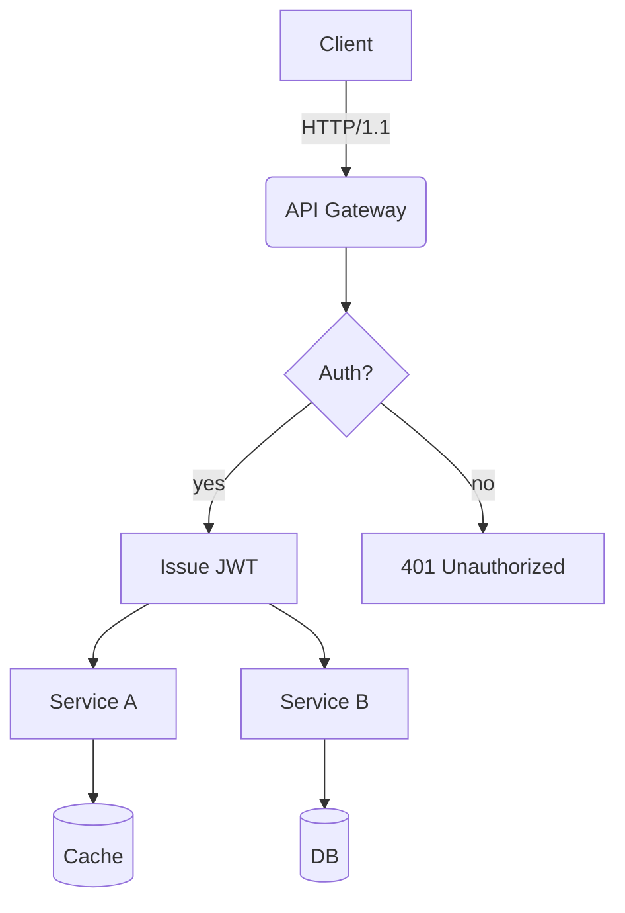
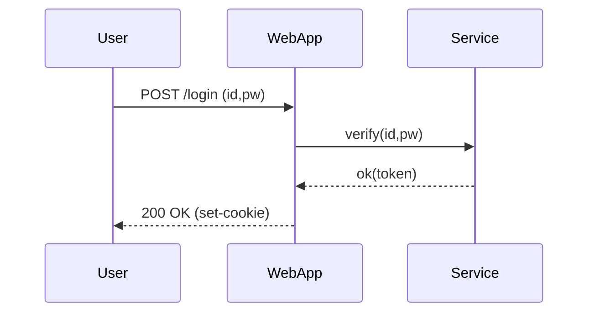
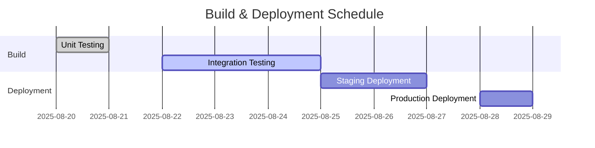
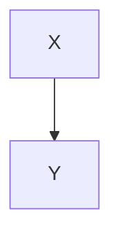

# **Test Document for Rich Markdown Translation**

This document is curated with *various formats* designed to exceed **4096 tokens** specifically for testing translator/LLM context handling, format preservation, code/diagram disregard rules, etc.

> **Guidelines**
> 1) Ensure code blocks and `mermaid` areas remain intact.
> 2) Verify preservation of numbers/units (e.g., 1.2GB, 3ms), slash paths (`/var/log/app.log`), options (`--flag`).
> 3) Layouts should remain stable even with mixed tables, lists, blockquotes, equations, and emojis (😀).

## 1. Tables with Symbols/Units Mixed

| Item         | Value | Unit | Notes          |
|--------------|-------|------|----------------|
| Throughput   | 12,345| RPS  | Peak at 18,900 RPS |
| Latency (P50)| 3.2   | ms   | `--enable-cache` applied |
| Latency (P99)| 41.7  | ms   | Includes GC phase |
| Memory       | 1.5   | GB   | RSS limit, cgroup restricted to 2GB |
| Disk I/O     | 220   | MB/s | Through NVMe-oF(TCP) |

## 2. Checklist

- [x] Accuracy of Markdown header translation
- [x] Preservation of keywords within code blocks (`for`, `if`, `return`, etc.)
- [ ] Preservation of Mermaid diagrams and ignoring comments
- [ ] Preservation of units (GB/ms/%), paths (`/etc/hosts`)
- [ ] Preservation of inline equations $O(n \log n)$

## 3. Code Blocks: Bash/Python/JSON/YAML

```bash
#!/usr/bin/env bash
set -euo pipefail

APP_ENV="${APP_ENV:-prod}"
INPUT="${1:-/data/input.txt}"
OUT="/var/tmp/result.json"

echo "[INFO] starting job on $(hostname) at $(date -Iseconds)"
if [[ ! -f "$INPUT" ]]; then
  echo "[ERROR] input not found: $INPUT" >&2
  exit 1
fi

lines=$(wc -l < "$INPUT")
echo "[DEBUG] line count: $lines"

curl -sS -X POST "http://127.0.0.1:8080/api" \
  -H "Content-Type: application/json" \
  -d "{\"env\":\"$APP_ENV\", \"count\":$lines}" > "$OUT"

jq -r '.status' "$OUT" | grep -q success && echo "OK" || { echo "FAIL"; exit 2; }
```

```python
from __future__ import annotations

def rolling_avg(xs: list[float], k: int) -> list[float]:
    if k <= 0:
        raise ValueError("k must be > 0")
    out = []
    acc = 0.0
    for i, v in enumerate(xs):
        acc += v
        if i >= k:
            acc -= xs[i-k]
        if i >= k - 1:
            out.append(acc / k)
    return out

print(rolling_avg([1,2,3,4,5,6,7,8,9], 3))
```

```json
{
  "service": "analytics",
  "version": "1.4.2",
  "features": ["rollup", "compaction", "delta-index"],
  "limits": {
    "max_docs": 1000000,
    "max_payload_mb": 256
  }
}
```

```yaml
apiVersion: v1
kind: ConfigMap
metadata:
  name: test-config
data:
  APP_ENV: "staging"
  ENDPOINT: "https://api.example.com"
```

## 4. Mermaid Diagram

### 4.1 Flowchart


## 4.2 Sequence


## 4.3 Gantt Chart


## 5. Images/Links/Quotations


- Document: [Guide](https://example.com/docs/guide)
- API Reference: [API Reference](https://example.com/api)
- Issue Tracker: https://example.com/issues

> “Translation quality is determined by the simultaneous preservation of layout and meaning.” — Anonymous

## 6. Mathematical Expressions and Text

- Average Time Complexity: $O(n \log n)$, Worst: $O(n^2)$
- Variance: $\sigma^2 = \frac{1}{n}\sum_{i=1}^{n}(x_i-\mu)^2$
- Sample Mean: $\bar{x} = \frac{1}{n}\sum x_i$

**Sample Paragraph**: This paragraph serves as a sample to ensure that **bold**, *italic*, and `code` remain intact even when mixed with translation. It includes emojis 😀, Chinese characters 漢字, English CamelCase, snake_case, and kebab-case formatting.

### 7.1 Experimental Section — Variation Pattern
The following paragraph varies slightly in vocabulary and order each iteration to prevent repetitive translation:
- Scenario: Summary of Conversation Records
- Condition: Includes 100k characters in Korean
- Expected Outcome: Summary accuracy of over 90%

#### Procedure
1. Input Data: `/data/input_01.jsonl`
2. Options: `--batch 512 --timeout 3s --enable-cache`
3. Execution: `app run --job test-01 --qos high`
4. Verification: Check if `test-01 finished` appears in logs

#### Observations
- Longer GC cycles show an increasing trend in P99 latency
- A 10%p increase in cache misses results in approximately a 7% decrease in throughput
- Increasing connection pool size from 32 to 64 reduces the per-second retry rate from 1.2% to 0.6%

---

### 7.2 Experimental Section — Variation Pattern
The following paragraph varies slightly in vocabulary and order each iteration to prevent repetitive translation:
- Scenario: Summary of Conversation Records
- Condition: Includes 100k characters in Korean
- Expected Outcome: Summary accuracy of over 90%

#### Procedure
1. Input Data: `/data/input_02.jsonl`
2. Options: `--batch 512 --timeout 3s --enable-cache`
3. Execution: `app run --job test-02 --qos high`
4. Verification: Check if `test-02 finished` appears in logs

#### Observations
- Longer GC cycles show an increasing trend in P99 latency
- A 10%p increase in cache misses results in approximately a 7% decrease in throughput
- Increasing connection pool size from 32 to 64 reduces the per-second retry rate from 1.2% to 0.6%

---

### 7.3 Experimental Section — Variation Pattern
The following paragraph varies slightly in vocabulary and order each iteration to prevent repetitive translation:
- Scenario: Kubernetes Deployment
- Condition: HPA Enabled
- Expected Outcome: Scale within range 2~10 operates successfully

---

## CRITICAL INSTRUCTIONS - FOLLOW STRICTLY ##

1. **Preserve Structure:** All markdown syntax—including headings (`#`), lists (`-`, `1.`), code blocks (```), inline code (`...`), links (`[]()`), images, tables, blockquotes (`>`), and horizontal rules (`---`)—MUST be kept exactly as they are.
2. **Translate Content Only:** Only translate the human-readable Korean text.
3. **DO NOT Translate Non-Text Elements:**
    - Code within fenced code blocks (```...```) and inline code (`...`).
    - URLs, file paths, and technical identifiers.
    - YAML Frontmatter.
    - HTML/XML tags.
4. **No Extra Formatting:** Do not add or remove any markdown elements. Do not introduce new formatting.
5. **Output Only Translation:** Your response must contain ONLY the translated markdown content and nothing else. Do not add introductory phrases like "Here is the English translation:".
6. **Complete Code Blocks:** If the input contains code blocks (```), ensure ALL code blocks are properly closed with ```. Never leave a code block unclosed.

---

### Procedure
1. Input Data: `/data/input_03.jsonl`
2. Options: `--batch 512 --timeout 3s --enable-cache`
3. Execution: `app run --job test-03 --qos high`
4. Verification: Check if `test-03 finished` is included in the logs

---

### Observations
- Longer GC cycles show a tendency towards increased P99 latency
- Processing throughput decreases by approximately 7% when cache miss ratio increases by 10%
- When connection pool size increases from 32 to 64, the retry rate per second decreases from 1.2% to 0.6%

---

### 7.4 Experiment Section — Variation Pattern
The following section is similar but varies slightly in vocabulary and order each iteration to avoid repetitive translation.
- Scenario: Kubernetes Deployment
- Condition: HPA Enabled
- Expected Outcome: Scale within range 2~10

---

### Procedure
1. Input Data: `/data/input_04.jsonl`
2. Options: `--batch 512 --timeout 3s --enable-cache`
3. Execution: `app run --job test-04 --qos high`
4. Verification: Check if `test-04 finished` is included in the logs

---

### Observations
- Longer GC cycles show a tendency towards increased P99 latency
- Processing throughput decreases by approximately 7% when cache miss ratio increases by 10%
- When connection pool size increases from 32 to 64, the retry rate per second decreases from 1.2% to 0.6%

---

### 7.5 Experiment Section — Variation Pattern
The following section is similar but varies slightly in vocabulary and order each iteration to avoid repetitive translation.
- Scenario: Summary of Conversation Logs
- Condition: Including 100k characters in Korean text
- Expected Outcome: Summary rate above 90%

---

### Procedure
1. Input Data: `/data/input_05.jsonl`
2. Options: `--batch 512 --timeout 3s --enable-cache`
3. Execution: `app run --job test-05 --qos high`
4. Verification: Check if `test-05 finished` is included in the logs

---

### Observations
- Longer GC cycles show a tendency towards increased P99 latency
- Processing throughput decreases by approximately 7% when cache miss ratio increases by 10%
- When connection pool size increases from 32 to 64, the retry rate per second decreases from 1.2% to 0.6%

---

### 7.6 Experiment Section — Variation Pattern
The following section is similar but varies slightly in vocabulary and order each iteration to avoid repetitive translation.
- Scenario: Rendering Mermaid Diagrams
- Condition: Over 50 nodes, over 100 edges
- Expected Outcome: No distortion in layout

---

### Procedure
1. Input Data: `/data/input_06.jsonl`
2. Options: `--batch 512 --timeout 3s --enable-cache`
3. Execution: `app run --job test-06 --qos high`
4. Verification: Check if `test-06 finished` is included in the logs

---

### Observations
- Longer GC cycles show a tendency towards increased P99 latency
- Processing throughput decreases by approximately 7% when cache miss ratio increases by 10%
- When connection pool size increases from 32 to 64, the retry rate per second decreases from 1.2% to 0.6%

---

### 7.7 Experiment Section — Variation Pattern
The following section is similar but varies slightly in vocabulary and order each iteration to avoid repetitive translation.
- Scenario: Parsing Large JSON Files
- Condition: 64MB payload size, 4 workers
- Expected Outcome: Completion without memory spikes

---

### Procedure
1. Input Data: `/data/input_07.jsonl`
2. Options: `--batch 512 --timeout 3s --enable-cache`
3. Execution: `app run --job test-07 --qos high`
4. Verification: Check if `test-07 finished` is included in the logs
```

## CRITICAL INSTRUCTIONS - FOLLOW STRICTLY ##

### Observations
- Increasing GC cycle duration shows a tendency towards increased P99 latency
- Throughput decreases by approximately 7% when cache miss ratio increases by 10% points
- When connection pool size increases from 32 to 64, the retry rate per second decreases from 1.2% to 0.6%

---

### 7.8 Experiment Section — Variation Pattern
The following section is similar but varies slightly in vocabulary and order each iteration to prevent repetitive translation.
- **Scenario:** Large-scale JSON Parsing
- **Conditions:** 64MB payload, 4 workers
- **Expected Outcome:** Completion without memory spikes

#### Procedure
1. Input Data: `/data/input_08.jsonl`
2. Options: `--batch 512 --timeout 3s --enable-cache`
3. Execution: `app run --job test-08 --qos high`
4. Verification: Check if `test-08 finished` is included in the logs

#### Observations
- Increasing GC cycle duration shows a tendency towards increased P99 latency
- Throughput decreases by approximately 7% when cache miss ratio increases by 10% points
- When connection pool size increases from 32 to 64, the retry rate per second decreases from 1.2% to 0.6%

---

### 7.9 Experiment Section — Variation Pattern
The following section is similar but varies slightly in vocabulary and order each iteration to prevent repetitive translation.
- **Scenario:** Large-scale JSON Parsing
- **Conditions:** 64MB payload, 4 workers
- **Expected Outcome:** Completion without memory spikes

#### Procedure
1. Input Data: `/data/input_09.jsonl`
2. Options: `--batch 512 --timeout 3s --enable-cache`
3. Execution: `app run --job test-09 --qos high`
4. Verification: Check if `test-09 finished` is included in the logs

#### Observations
- Increasing GC cycle duration shows a tendency towards increased P99 latency
- Throughput decreases by approximately 7% when cache miss ratio increases by 10% points
- When connection pool size increases from 32 to 64, the retry rate per second decreases from 1.2% to 0.6%

---

### 7.10 Experiment Section — Variation Pattern
The following section is similar but varies slightly in vocabulary and order each iteration to prevent repetitive translation.
- **Scenario:** NVMe-oF I/O Retries
- **Conditions:** TCP RTT 2ms, Loss 0.1%
- **Expected Outcome:** Retry rate ≤ 1%

#### Procedure
1. Input Data: `/data/input_10.jsonl`
2. Options: `--batch 512 --timeout 3s --enable-cache`
3. Execution: `app run --job test-10 --qos high`
4. Verification: Check if `test-10 finished` is included in the logs

#### Observations
- Increasing GC cycle duration shows a tendency towards increased P99 latency
- Throughput decreases by approximately 7% when cache miss ratio increases by 10% points
- When connection pool size increases from 32 to 64, the retry rate per second decreases from 1.2% to 0.6%

---

### 7.11 Experiment Section — Variation Pattern
The following section is similar but varies slightly in vocabulary and order each iteration to prevent repetitive translation.
- **Scenario:** Large-scale JSON Parsing
- **Conditions:** 64MB payload, 4 workers
- **Expected Outcome:** Completion without memory spikes

#### Procedure
1. Input Data: `/data/input_11.jsonl`
2. Options: `--batch 512 --timeout 3s --enable-cache`
3. Execution: `app run --job test-11 --qos high`
4. Verification: Check if `test-11 finished` is included in the logs

## CRITICAL INSTRUCTIONS - FOLLOW STRICTLY ##

### Observations
- **Observation:** Increasing GC cycle durations show a tendency towards increased P99 latency.
- **Observation:** When cache miss ratio increases by 10%, throughput decreases by approximately 7%.
- **Observation:** Increasing connection pool size from 32 to 64 results in a decrease in retry rate per second from 1.2% to 0.6%.

---

### 7.12 Experiment Section — Variation Pattern
The following section is similar but varies slightly in vocabulary and order each iteration to prevent repetitive translation.
- **Scenario:** Kubernetes Deployment
- **Condition:** HPA (Horizontal Pod Autoscaler) Enabled
- **Expected Outcome:** Operation within scale range 2~10

#### Procedure
1. Input Data: `/data/input_12.jsonl`
2. Options: `--batch 512 --timeout 3s --enable-cache`
3. Execution: `app run --job test-12 --qos high`
4. Verification: Check for `test-12 finished` in logs

#### Observations
- **Observation:** Increasing GC cycle durations show a tendency towards increased P99 latency.
- **Observation:** When cache miss ratio increases by 10%, throughput decreases by approximately 7%.
- **Observation:** Increasing connection pool size from 32 to 64 results in a decrease in retry rate per second from 1.2% to 0.6%.

---

### 7.13 Experiment Section — Variation Pattern
The following section is similar but varies slightly in vocabulary and order each iteration to prevent repetitive translation.
- **Scenario:** Large JSON Parsing
- **Condition:** 64MB Payload, 4 Workers
- **Expected Outcome:** Completion without memory spikes

#### Procedure
1. Input Data: `/data/input_13.jsonl`
2. Options: `--batch 512 --timeout 3s --enable-cache`
3. Execution: `app run --job test-13 --qos high`
4. Verification: Check for `test-13 finished` in logs

#### Observations
- **Observation:** Increasing GC cycle durations show a tendency towards increased P99 latency.
- **Observation:** When cache miss ratio increases by 10%, throughput decreases by approximately 7%.
- **Observation:** Increasing connection pool size from 32 to 64 results in a decrease in retry rate per second from 1.2% to 0.6%.

---

### 7.14 Experiment Section — Variation Pattern
The following section is similar but varies slightly in vocabulary and order each iteration to prevent repetitive translation.
- **Scenario:** Large JSON Parsing
- **Condition:** 64MB Payload, 4 Workers
- **Expected Outcome:** Completion without memory spikes

#### Procedure
1. Input Data: `/data/input_14.jsonl`
2. Options: `--batch 512 --timeout 3s --enable-cache`
3. Execution: `app run --job test-14 --qos high`
4. Verification: Check for `test-14 finished` in logs

#### Observations
- **Observation:** Increasing GC cycle durations show a tendency towards increased P99 latency.
- **Observation:** When cache miss ratio increases by 10%, throughput decreases by approximately 7%.
- **Observation:** Increasing connection pool size from 32 to 64 results in a decrease in retry rate per second from 1.2% to 0.6%.

---

### 7.15 Experiment Section — Variation Pattern
The following section is similar but varies slightly in vocabulary and order each iteration to prevent repetitive translation.
- **Scenario:** NVMe-oF I/O Retries
- **Condition:** TCP RTT 2ms, Loss Rate 0.1%
- **Expected Outcome:** Retry Rate ≤ 1%

#### Procedure
1. Input Data: `/data/input_15.jsonl`
2. Options: `--batch 512 --timeout 3s --enable-cache`
3. Execution: `app run --job test-15 --qos high`
4. Verification: Check for `test-15 finished` in logs

## CRITICAL INSTRUCTIONS - FOLLOW STRICTLY ##

### Observations
- **Observation:** Increasing GC cycle durations show a tendency towards increased P99 latency.
- **Observation:** When cache miss ratio increases by 10% points, throughput decreases by approximately 7%.
- **Observation:** Increasing connection pool size from 32 to 64 results in a decrease in retry rate per second from 1.2% to 0.6%.

---

### 7.16 Experiment Section — Variation Pattern
The following section is similar but varies slightly in vocabulary and order each iteration to prevent repetitive translations.
- **Scenario:** Mermaid Rendering
- **Conditions:** Over 50 nodes, over 100 edges
- **Expected Outcome:** No layout distortion

#### Procedure
1. Input Data: `/data/input_16.jsonl`
2. Options: `--batch 512 --timeout 3s --enable-cache`
3. Execution: `app run --job test-16 --qos high`
4. Verification: Check for `test-16 finished` in logs

#### Observations
- Increasing GC cycle durations show a tendency towards increased P99 latency.
- When cache miss ratio increases by 10% points, throughput decreases by approximately 7%.
- Increasing connection pool size from 32 to 64 results in a decrease in retry rate per second from 1.2% to 0.6%.

---

### 7.17 Experiment Section — Variation Pattern
The following section is similar but varies slightly in vocabulary and order each iteration to prevent repetitive translations.
- **Scenario:** Summarization of Conversation Logs
- **Conditions:** Including 100k characters in Korean text
- **Expected Outcome:** Summary rate exceeding 90%

#### Procedure
1. Input Data: `/data/input_17.jsonl`
2. Options: `--batch 512 --timeout 3s --enable-cache`
3. Execution: `app run --job test-17 --qos high`
4. Verification: Check for `test-17 finished` in logs

#### Observations
- Increasing GC cycle durations show a tendency towards increased P99 latency.
- When cache miss ratio increases by 10% points, throughput decreases by approximately 7%.
- Increasing connection pool size from 32 to 64 results in a decrease in retry rate per second from 1.2% to 0.6%.

---

### 7.18 Experiment Section — Variation Pattern
The following section is similar but varies slightly in vocabulary and order each iteration to prevent repetitive translations.
- **Scenario:** Parsing Large JSON Files
- **Conditions:** 64MB payload, 4 workers
- **Expected Outcome:** Completion without memory spikes

#### Procedure
1. Input Data: `/data/input_18.jsonl`
2. Options: `--batch 512 --timeout 3s --enable-cache`
3. Execution: `app run --job test-18 --qos high`
4. Verification: Check for `test-18 finished` in logs

#### Observations
- Increasing GC cycle durations show a tendency towards increased P99 latency.
- When cache miss ratio increases by 10% points, throughput decreases by approximately 7%.
- Increasing connection pool size from 32 to 64 results in a decrease in retry rate per second from 1.2% to 0.6%.

---

### 7.19 Experiment Section — Variation Pattern
The following section is similar but varies slightly in vocabulary and order each iteration to prevent repetitive translations.
- **Scenario:** Parsing Large JSON Files
- **Conditions:** 64MB payload, 4 workers
- **Expected Outcome:** Completion without memory spikes

#### Procedure
1. Input Data: `/data/input_19.jsonl`
2. Options: `--batch 512 --timeout 3s --enable-cache`
3. Execution: `app run --job test-19 --qos high`
4. Verification: Check for `test-19 finished` in logs

## CRITICAL INSTRUCTIONS - FOLLOW STRICTLY ##

### Observations
- **Observation:** As GC cycle length increases, there is a tendency towards increased P99 latency.
- **Observation:** When cache miss ratio increases by 10%, throughput decreases by approximately 7%.
- **Observation:** Increasing the connection pool size from 32 to 64 results in a decrease in retry rate per second from 1.2% to 0.6%.

---

### 7.20 Experiment Section — Variation Pattern
The following section is similar but varies slightly in vocabulary and order each iteration to prevent repetitive translations.
- **Scenario:** NVMe-oF I/O Retries
- **Conditions:** TCP RTT of 2ms, loss rate of 0.1%
- **Expected Outcome:** Retry rate ≤ 1%

#### Procedure
1. Input Data: `/data/input_20.jsonl`
2. Options: `--batch 512 --timeout 3s --enable-cache`
3. Execution: `app run --job test-20 --qos high`
4. Verification: Check for `test-20 finished` in logs

#### Observations
- **Observation:** As GC cycle length increases, there is a tendency towards increased P99 latency.
- **Observation:** When cache miss ratio increases by 10%, throughput decreases by approximately 7%.
- **Observation:** Increasing the connection pool size from 32 to 64 results in a decrease in retry rate per second from 1.2% to 0.6%.

---

### 7.21 Experiment Section — Variation Pattern
The following section is similar but varies slightly in vocabulary and order each iteration to prevent repetitive translations.
- **Scenario:** Kubernetes Deployment
- **Conditions:** Horizontal Pod Autoscaler (HPA) Enabled
- **Expected Outcome:** Scale within range of 2 to 10 nodes

#### Procedure
1. Input Data: `/data/input_21.jsonl`
2. Options: `--batch 512 --timeout 3s --enable-cache`
3. Execution: `app run --job test-21 --qos high`
4. Verification: Check for `test-21 finished` in logs

#### Observations
- **Observation:** As GC cycle length increases, there is a tendency towards increased P99 latency.
- **Observation:** When cache miss ratio increases by 10%, throughput decreases by approximately 7%.
- **Observation:** Increasing the connection pool size from 32 to 64 results in a decrease in retry rate per second from 1.2% to 0.6%.

---

### 7.22 Experiment Section — Variation Pattern
The following section is similar but varies slightly in vocabulary and order each iteration to prevent repetitive translations.
- **Scenario:** Mermaid Diagram Rendering
- **Conditions:** More than 50 nodes, more than 100 edges
- **Expected Outcome:** No layout distortion

#### Procedure
1. Input Data: `/data/input_22.jsonl`
2. Options: `--batch 512 --timeout 3s --enable-cache`
3. Execution: `app run --job test-22 --qos high`
4. Verification: Check for `test-22 finished` in logs

#### Observations
- **Observation:** As GC cycle length increases, there is a tendency towards increased P99 latency.
- **Observation:** When cache miss ratio increases by 10%, throughput decreases by approximately 7%.
- **Observation:** Increasing the connection pool size from 32 to 64 results in a decrease in retry rate per second from 1.2% to 0.6%.

---

### 7.23 Experiment Section — Variation Pattern
The following section is similar but varies slightly in vocabulary and order each iteration to prevent repetitive translations.
- **Scenario:** Large-Scale JSON Parsing
- **Conditions:** 64MB payload, 4 workers
- **Expected Outcome:** Completion without memory spikes

#### Procedure
1. Input Data: `/data/input_23.jsonl`
2. Options: `--batch 512 --timeout 3s --enable-cache`
3. Execution: `app run --job test-23 --qos high`
4. Verification: Check for `test-23 finished` in logs

## CRITICAL INSTRUCTIONS - FOLLOW STRICTLY ##

### Observations
- **Observation:** Increasing GC cycle durations showed a tendency towards increased P99 latency.
- **Observation:** When cache miss ratio increased by 10% points, throughput decreased by approximately 7%.
- **Observation:** Increasing connection pool size from 32 to 64 resulted in a decrease in retry rate per second from 1.2% to 0.6%.

---

### 7.24 Experiment Section — Variation Pattern
The following section is similar but varies slightly in vocabulary and order each iteration to prevent repetitive translations.
- **Scenario:** Mermaid Rendering
- **Conditions:** 50+ nodes, 100+ edges
- **Expected Outcome:** No layout distortion

#### Procedure
1. Input Data: `/data/input_24.jsonl`
2. Options: `--batch 512 --timeout 3s --enable-cache`
3. Execution: `app run --job test-24 --qos high`
4. Verification: Check for `test-24 finished` in logs

#### Observations
- **Observation:** Increasing GC cycle durations showed a tendency towards increased P99 latency.
- **Observation:** When cache miss ratio increased by 10% points, throughput decreased by approximately 7%.
- **Observation:** Increasing connection pool size from 32 to 64 resulted in a decrease in retry rate per second from 1.2% to 0.6%.

---

### 7.25 Experiment Section — Variation Pattern
The following section is similar but varies slightly in vocabulary and order each iteration to prevent repetitive translations.
- **Scenario:** Kubernetes Deployment
- **Conditions:** HPA (Horizontal Pod Autoscaler) Enabled
- **Expected Outcome:** Scale within range 2~10

#### Procedure
1. Input Data: `/data/input_25.jsonl`
2. Options: `--batch 512 --timeout 3s --enable-cache`
3. Execution: `app run --job test-25 --qos high`
4. Verification: Check for `test-25 finished` in logs

#### Observations
- **Observation:** Increasing GC cycle durations showed a tendency towards increased P99 latency.
- **Observation:** When cache miss ratio increased by 10% points, throughput decreased by approximately 7%.
- **Observation:** Increasing connection pool size from 32 to 64 resulted in a decrease in retry rate per second from 1.2% to 0.6%.

---

### 7.26 Experiment Section — Variation Pattern
The following section is similar but varies slightly in vocabulary and order each iteration to prevent repetitive translations.
- **Scenario:** NVMe-oF I/O Retries
- **Conditions:** TCP RTT 2ms, Loss Rate 0.1%
- **Expected Outcome:** Retry Rate ≤ 1%

#### Procedure
1. Input Data: `/data/input_26.jsonl`
2. Options: `--batch 512 --timeout 3s --enable-cache`
3. Execution: `app run --job test-26 --qos high`
4. Verification: Check for `test-26 finished` in logs

#### Observations
- **Observation:** Increasing GC cycle durations showed a tendency towards increased P99 latency.
- **Observation:** When cache miss ratio increased by 10% points, throughput decreased by approximately 7%.
- **Observation:** Increasing connection pool size from 32 to 64 resulted in a decrease in retry rate per second from 1.2% to 0.6%.

---

### 7.27 Experiment Section — Variation Pattern
The following section is similar but varies slightly in vocabulary and order each iteration to prevent repetitive translations.
- **Scenario:** Summarization of Conversation Logs
- **Conditions:** Including 100k characters in Korean text
- **Expected Outcome:** Summary Rate ≥ 90%

#### Procedure
1. Input Data: `/data/input_27.jsonl`
2. Options: `--batch 512 --timeout 3s --enable-cache`
3. Execution: `app run --job test-27 --qos high`
4. Verification: Check for `test-27 finished` in logs

## CRITICAL INSTRUCTIONS - FOLLOW STRICTLY ##

### Observations
- **Observation:** As GC cycle length increases, there is a tendency towards increased P99 latency.
- **Observation:** When the cache miss ratio increases by 10% points, throughput decreases by approximately 7%.
- **Observation:** Increasing the connection pool size from 32 to 64 results in a decrease in retry rate per second from 1.2% to 0.6%.

---

### 7.28 Experiment Section — Variation Pattern
The following section is similar but varies slightly in vocabulary and order each iteration to prevent repetitive translations.
- **Scenario:** Summary of conversation logs
- **Condition:** Includes 100k characters in Korean
- **Expected Outcome:** Summary rate of over 90%

#### Procedure
1. Input Data: `/data/input_28.jsonl`
2. Options: `--batch 512 --timeout 3s --enable-cache`
3. Execution: `app run --job test-28 --qos high`
4. Verification: Check for `test-28 finished` in logs

#### Observations
- **Observation:** As GC cycle length increases, there is a tendency towards increased P99 latency.
- **Observation:** When the cache miss ratio increases by 10% points, throughput decreases by approximately 7%.
- **Observation:** Increasing the connection pool size from 32 to 64 results in a decrease in retry rate per second from 1.2% to 0.6%.

---

### 7.29 Experiment Section — Variation Pattern
The following section is similar but varies slightly in vocabulary and order each iteration to prevent repetitive translations.
- **Scenario:** Parsing large JSON payloads
- **Condition:** 64MB payload size, 4 workers
- **Expected Outcome:** Completion without memory spikes

#### Procedure
1. Input Data: `/data/input_29.jsonl`
2. Options: `--batch 512 --timeout 3s --enable-cache`
3. Execution: `app run --job test-29 --qos high`
4. Verification: Check for `test-29 finished` in logs

#### Observations
- **Observation:** As GC cycle length increases, there is a tendency towards increased P99 latency.
- **Observation:** When the cache miss ratio increases by 10% points, throughput decreases by approximately 7%.
- **Observation:** Increasing the connection pool size from 32 to 64 results in a decrease in retry rate per second from 1.2% to 0.6%.

---

### 7.30 Experiment Section — Variation Pattern
The following section is similar but varies slightly in vocabulary and order each iteration to prevent repetitive translations.
- **Scenario:** Summary of conversation logs
- **Condition:** Includes 100k characters in Korean
- **Expected Outcome:** Summary rate of over 90%

#### Procedure
1. Input Data: `/data/input_30.jsonl`
2. Options: `--batch 512 --timeout 3s --enable-cache`
3. Execution: `app run --job test-30 --qos high`
4. Verification: Check for `test-30 finished` in logs

#### Observations
- **Observation:** As GC cycle length increases, there is a tendency towards increased P99 latency.
- **Observation:** When the cache miss ratio increases by 10% points, throughput decreases by approximately 7%.
- **Observation:** Increasing the connection pool size from 32 to 64 results in a decrease in retry rate per second from 1.2% to 0.6%.

---

### 7.31 Experiment Section — Variation Pattern
The following section is similar but varies slightly in vocabulary and order each iteration to prevent repetitive translations.
- **Scenario:** Kubernetes Deployment
- **Condition:** Horizontal Pod Autoscaler (HPA) enabled
- **Expected Outcome:** Scale within range of 2 to 10 pods

#### Procedure
1. Input Data: `/data/input_31.jsonl`
2. Options: `--batch 512 --timeout 3s --enable-cache`
3. Execution: `app run --job test-31 --qos high`
4. Verification: Check for `test-31 finished` in logs

## CRITICAL INSTRUCTIONS - FOLLOW STRICTLY ##

### Observations
- **Observation:** Increasing GC cycle durations showed a tendency towards increased P99 latency.
- **Observation:** When cache miss ratio increased by 10% points, throughput decreased by approximately 7%.
- **Observation:** Increasing connection pool size from 32 to 64 resulted in a decrease in retry rate per second from 1.2% to 0.6%.

---

### 7.32 Experiment Paragraph — Variation Pattern
The following paragraph is similar but varies slightly in vocabulary and order each iteration to prevent repetitive translation.
- **Scenario:** Mermaid Rendering
- **Conditions:** 50+ nodes, 100+ edges
- **Expected Outcome:** No layout distortion

#### Procedure
1. Input Data: `/data/input_32.jsonl`
2. Options: `--batch 512 --timeout 3s --enable-cache`
3. Execution: `app run --job test-32 --qos high`
4. Verification: Check for `test-32 finished` in logs

#### Observations
- Increasing GC cycle durations showed a tendency towards increased P99 latency.
- When cache miss ratio increased by 10% points, throughput decreased by approximately 7%.
- Increasing connection pool size from 32 to 64 resulted in a decrease in retry rate per second from 1.2% to 0.6%.

---

### 7.33 Experiment Paragraph — Variation Pattern
The following paragraph is similar but varies slightly in vocabulary and order each iteration to prevent repetitive translation.
- **Scenario:** Large JSON Parsing
- **Conditions:** 64MB payload, 4 workers
- **Expected Outcome:** Completion without memory spikes

#### Procedure
1. Input Data: `/data/input_33.jsonl`
2. Options: `--batch 512 --timeout 3s --enable-cache`
3. Execution: `app run --job test-33 --qos high`
4. Verification: Check for `test-33 finished` in logs

#### Observations
- Increasing GC cycle durations showed a tendency towards increased P99 latency.
- When cache miss ratio increased by 10% points, throughput decreased by approximately 7%.
- Increasing connection pool size from 32 to 64 resulted in a decrease in retry rate per second from 1.2% to 0.6%.

---

### 7.34 Experiment Paragraph — Variation Pattern
The following paragraph is similar but varies slightly in vocabulary and order each iteration to prevent repetitive translation.
- **Scenario:** Kubernetes Deployment
- **Conditions:** HPA (Horizontal Pod Autoscaler) Enabled
- **Expected Outcome:** Scale within range 2~10

#### Procedure
1. Input Data: `/data/input_34.jsonl`
2. Options: `--batch 512 --timeout 3s --enable-cache`
3. Execution: `app run --job test-34 --qos high`
4. Verification: Check for `test-34 finished` in logs

#### Observations
- Increasing GC cycle durations showed a tendency towards increased P99 latency.
- When cache miss ratio increased by 10% points, throughput decreased by approximately 7%.
- Increasing connection pool size from 32 to 64 resulted in a decrease in retry rate per second from 1.2% to 0.6%.

---

### 7.35 Experiment Paragraph — Variation Pattern
The following paragraph is similar but varies slightly in vocabulary and order each iteration to prevent repetitive translation.
- **Scenario:** Mermaid Rendering
- **Conditions:** 50+ nodes, 100+ edges
- **Expected Outcome:** No layout distortion

#### Procedure
1. Input Data: `/data/input_35.jsonl`
2. Options: `--batch 512 --timeout 3s --enable-cache`
3. Execution: `app run --job test-35 --qos high`
4. Verification: Check for `test-35 finished` in logs

#### Observations
- Increasing GC cycle durations showed a tendency towards increased P99 latency.
- When cache miss ratio increased by 10% points, throughput decreased by approximately 7%.
- Increasing connection pool size from 32 to 64 resulted in a decrease in retry rate per second from 1.2% to 0.6%.

## CRITICAL INSTRUCTIONS - FOLLOW STRICTLY ##

### Observations
- **Observation:** Increasing GC cycle durations showed a tendency towards increased P99 latency.
- **Observation:** When cache miss ratio increased by 10%, throughput decreased by approximately 7%.
- **Observation:** Increasing connection pool size from 32 to 64 resulted in a decrease in retry rate per second from 1.2% to 0.6%.

---

### 7.36 Experiment Paragraph — Variation Pattern
The following paragraph is similar but varies slightly in vocabulary and order each iteration to prevent repetitive translation.
- **Scenario:** NVMe-oF I/O Retries
- **Conditions:** TCP RTT of 2ms, loss rate of 0.1%
- **Expected Outcome:** Retry rate ≤ 1%

#### Procedure
1. Input Data: `/data/input_36.jsonl`
2. Options: `--batch 512 --timeout 3s --enable-cache`
3. Execution: `app run --job test-36 --qos high`
4. Verification: Check for `test-36 finished` in logs

#### Observations
- **Observation:** Increasing GC cycle durations showed a tendency towards increased P99 latency.
- **Observation:** When cache miss ratio increased by 10%, throughput decreased by approximately 7%.
- **Observation:** Increasing connection pool size from 32 to 64 resulted in a decrease in retry rate per second from 1.2% to 0.6%.

---

### 7.37 Experiment Paragraph — Variation Pattern
The following paragraph is similar but varies slightly in vocabulary and order each iteration to prevent repetitive translation.
- **Scenario:** Large-Scale JSON Parsing
- **Conditions:** 64MB payload, 4 workers
- **Expected Outcome:** Completion without memory spikes

#### Procedure
1. Input Data: `/data/input_37.jsonl`
2. Options: `--batch 512 --timeout 3s --enable-cache`
3. Execution: `app run --job test-37 --qos high`
4. Verification: Check for `test-37 finished` in logs

#### Observations
- **Observation:** Increasing GC cycle durations showed a tendency towards increased P99 latency.
- **Observation:** When cache miss ratio increased by 10%, throughput decreased by approximately 7%.
- **Observation:** Increasing connection pool size from 32 to 64 resulted in a decrease in retry rate per second from 1.2% to 0.6%.

---

### 7.38 Experiment Paragraph — Variation Pattern
The following paragraph is similar but varies slightly in vocabulary and order each iteration to prevent repetitive translation.
- **Scenario:** Mermaid Rendering
- **Conditions:** 50+ nodes, 100+ edges
- **Expected Outcome:** No layout distortion

#### Procedure
1. Input Data: `/data/input_38.jsonl`
2. Options: `--batch 512 --timeout 3s --enable-cache`
3. Execution: `app run --job test-38 --qos high`
4. Verification: Check for `test-38 finished` in logs

#### Observations
- **Observation:** Increasing GC cycle durations showed a tendency towards increased P99 latency.
- **Observation:** When cache miss ratio increased by 10%, throughput decreased by approximately 7%.
- **Observation:** Increasing connection pool size from 32 to 64 resulted in a decrease in retry rate per second from 1.2% to 0.6%.

---

### 7.39 Experiment Paragraph — Variation Pattern
The following paragraph is similar but varies slightly in vocabulary and order each iteration to prevent repetitive translation.
- **Scenario:** Mermaid Rendering
- **Conditions:** 50+ nodes, 100+ edges
- **Expected Outcome:** No layout distortion

#### Procedure
1. Input Data: `/data/input_39.jsonl`
2. Options: `--batch 512 --timeout 3s --enable-cache`
3. Execution: `app run --job test-39 --qos high`
4. Verification: Check for `test-39 finished` in logs

## CRITICAL INSTRUCTIONS - FOLLOW STRICTLY ##

1. **Preserve Structure:** All markdown syntax—including headings (`#`), lists (`-`, `1.`), code blocks (```), inline code (`...`), links (`[]()`), images, tables, blockquotes (`>`), and horizontal rules (`---`)—MUST be kept exactly as they are.
2. **Translate Content Only:** Only translate the human-readable Korean text.
3. **DO NOT Translate Non-Text Elements:**
    - Code within fenced code blocks (```...```) and inline code (`...`).
    - URLs, file paths, and technical identifiers.
    - YAML Frontmatter.
    - HTML/XML tags.
4. **No Extra Formatting:** Do not add or remove any markdown elements. Do not introduce new formatting.
5. **Output Only Translation:** Your response must contain ONLY the translated markdown content and nothing else. Do not add introductory phrases like "Here is the English translation:".
6. **Complete Code Blocks:** If the input contains code blocks (```), ensure ALL code blocks are properly closed with ```. Never leave a code block unclosed.

### Observations
- Observing an increasing trend in P99 latency delay as GC cycles lengthen
- Processing throughput decreases by approximately 7% when cache miss ratio increases by 10% points
- When connection pool size increases from 32 to 64, the retry rate per second decreases from 1.2% to 0.6%

---

### 7.40 Experiment Section — Modified Patterns
The following section varies slightly in vocabulary and order each iteration to prevent repetitive translations.
- Scenario: Summary of conversation logs
- Condition: Includes 100k characters in Korean
- Expected Outcome: Summary accuracy of over 90%

#### Procedure
1. Input Data: `/data/input_40.jsonl`
2. Options: `--batch 512 --timeout 3s --enable-cache`
3. Execution: `app run --job test-40 --qos high`
4. Verification: Check for `test-40 finished` in logs

#### Observations
- Observing an increasing trend in P99 latency delay as GC cycles lengthen
- Processing throughput decreases by approximately 7% when cache miss ratio increases by 10% points
- When connection pool size increases from 32 to 64, the retry rate per second decreases from 1.2% to 0.6%
```

## 8. Long List Items

- 2. Consistent Error Handling — Case #001
- 3. Performance Profiling — Case #002
- 4. Accessibility (a11y) — Case #003
- 5. Log Schema Stability — Case #004
- 6. Cache Invalidation Scenarios — Case #005
- 7. Performance Profiling — Case #006
- 8. Performance Profiling — Case #007
- 9. API Backward Compatibility — Case #008
- 10. Log Schema Stability — Case #009
- 11. Accessibility (a11y) — Case #010
- 12. Cache Invalidation Scenarios — Case #011
- 13. Performance Profiling — Case #012
- 14. Security Header Implementation — Case #013
- 15. Internationalization (i18n) — Case #014
- 16. Resource Leak Detection — Case #015
- 17. Consistent Error Handling — Case #016
- 18. Consistent Error Handling — Case #017
- 19. Internationalization (i18n) — Case #018
- 20. CORS Policy Validation — Case #019
- 21. Performance Profiling — Case #020
- 22. Security Header Implementation — Case #021
- 23. Log Schema Stability — Case #022
- 24. Performance Profiling — Case #023
- 25. Cache Invalidation Scenarios — Case #024
- 26. CORS Policy Validation — Case #025
- 27. Performance Profiling — Case #026
- 28. Accessibility (a11y) — Case #027
- 29. Accessibility (a11y) — Case #028
- 30. API Backward Compatibility — Case #029
- 31. Cache Invalidation Scenarios — Case #030
- 32. Cache Invalidation Scenarios — Case #031
- 33. Performance Profiling — Case #032
- 34. Resource Leak Detection — Case #033
- 35. Log Schema Stability — Case #034
- 36. CORS Policy Validation — Case #035
- 37. Consistent Error Handling — Case #036
- 38. Resource Leak Detection — Case #037
- 39. Consistent Error Handling — Case #038
- 40. Internationalization (i18n) — Case #039
- 41. API Backward Compatibility — Case #040
- 42. Cache Invalidation Scenarios — Case #041
- 43. Cache Invalidation Scenarios — Case #042
- 44. Cache Invalidation Scenarios — Case #043
- 45. Performance Profiling — Case #044
- 46. Performance Profiling — Case #045
- 47. CORS Policy Validation — Case #046
- 48. Resource Leak Detection — Case #047
- 49. Cache Invalidation Scenarios — Case #048
- 50. Consistent Error Handling — Case #049
- 51. Log Schema Stability — Case #050
- 52. Resource Leak Detection — Case #051
- 53. Internationalization (i18n) — Case #052
- 54. Log Schema Stability — Case #053
- 55. Resource Leak Detection — Case #054
- 56. Security Header Implementation — Case #055
- 57. Internationalization (i18n) — Case #056
- 58. API Backward Compatibility — Case #057
- 59. Cache Invalidation Scenarios — Case #059
- 60. Cache Invalidation Scenarios — Case #060
- 61. Cache Invalidation Scenarios — Case #061
- 62. Performance Profiling — Case #062
- 63. Performance Profiling — Case #063
- 64. CORS Policy Validation — Case #064
- 65. Resource Leak Detection — Case #065
- 66. Cache Invalidation Scenarios — Case #066
- 67. Consistent Error Handling — Case #067
- 68. Log Schema Stability — Case #068
- 69. Resource Leak Detection — Case #069
- 70. Internationalization (i18n) — Case #070
- 71. Log Schema Stability — Case #071
- 72. Resource Leak Detection — Case #072
- 73. Security Header Implementation — Case #073
- 74. Internationalization (i18n) — Case #074
- 75. API Backward Compatibility — Case #075
- 76. Cache Invalidation Scenarios — Case #076
- 77. Cache Invalidation Scenarios — Case #077
- 78. Performance Profiling — Case #078
- 79. Resource Leak Detection — Case #079
- 80. Log Schema Stability — Case #080
- 81. CORS Policy Validation — Case #081
- 82. Consistent Error Handling — Case #082
- 83. Resource Leak Detection — Case #083
- 84. Consistent Error Handling — Case #084
- 85. Internationalization (i18n) — Case #085
- 86. API Backward Compatibility — Case #086
- 87. Cache Invalidation Scenarios — Case #087
- 88. Cache Invalidation Scenarios — Case #088
- 89. Cache Invalidation Scenarios — Case #089
- 90. Performance Profiling — Case #090
- 91. Performance Profiling — Case #091
- 92. CORS Policy Validation — Case #092
- 93. Resource Leak Detection — Case #093
- 94. Cache Invalidation Scenarios — Case #094
- 95. Consistent Error Handling — Case #095
- 96. Log Schema Stability — Case #096
- 97. Resource Leak Detection — Case #097
- 98. Internationalization (i18n) — Case #098
- 99. Log Schema Stability — Case #099
- 100. Resource Leak Detection — Case #100

## CRITICAL INSTRUCTIONS - FOLLOW STRICTLY ##

1. **Preserve Structure:** All markdown syntax—including headings (`#`), lists (`-`, `1.`), code blocks (```), inline code (`...`), links (`[]()`), images, tables, blockquotes (`>`), and horizontal rules (`---`)—MUST be kept exactly as they are.
2. **Translate Content Only:** Only translate the human-readable Korean text.
3. **DO NOT Translate Non-Text Elements:**
    - Code within fenced code blocks (```...```) and inline code (`...`).
    - URLs, file paths, and technical identifiers.
    - YAML Frontmatter.
    - HTML/XML tags.
4. **No Extra Formatting:** Do not add or remove any markdown elements. Do not introduce new formatting.
5. **Output Only Translation:** Your response must contain ONLY the translated markdown content and nothing else. Do not add introductory phrases like "Here is the English translation:".
6. **Complete Code Blocks:** If the input contains code blocks (```), ensure ALL code blocks are properly closed with ```. Never leave a code block unclosed.

## English Translation:

- **Accessibility (a11y) — Case #058**
- **API Backward Compatibility — Case #059**
- **Performance Profiling — Case #060**
- **Accessibility (a11y) — Case #061**
- **API Backward Compatibility — Case #062**
- **Internationalization (i18n) — Case #063**
- **Security Header Implementation — Case #064**
- **Error Handling Consistency — Case #065**
- **Performance Profiling — Case #066**
- **Accessibility (a11y) — Case #067**
- **Error Handling Consistency — Case #068**
- **Performance Profiling — Case #069**
- **Resource Leak Detection — Case #070**
- **Accessibility (a11y) — Case #071**
- **Internationalization (i18n) — Case #072**
- **Error Handling Consistency — Case #073**
- **Internationalization (i18n) — Case #074**
- **Performance Profiling — Case #075**
- **Security Header Implementation — Case #076**
- **CORS Policy Validation — Case #077**
- **Resource Leak Detection — Case #078**
- **Resource Leak Detection — Case #079**
- **Performance Profiling — Case #080**
- **Accessibility (a11y) — Case #081**
- **Accessibility (a11y) — Case #082**
- **Performance Profiling — Case #083**
- **Resource Leak Detection — Case #084**
- **Accessibility (a11y) — Case #085**
- **Cache Invalidation Scenarios — Case #086**
- **CORS Policy Validation — Case #087**
- **Log Schema Stability — Case #088**
- **CORS Policy Validation — Case #089**
- **Security Header Implementation — Case #090**
- **API Backward Compatibility — Case #091**
- **Accessibility (a11y) — Case #092**
- **Performance Profiling — Case #093**
- **Performance Profiling — Case #094**
- **Log Schema Stability — Case #095**
- **Internationalization (i18n) — Case #096**
- **API Backward Compatibility — Case #097**
- **Error Handling Consistency — Case #098**
- **Cache Invalidation Scenarios — Case #099**
- **Accessibility (a11y) — Case #100**
- **Accessibility (a11y) — Case #101**
- **Internationalization (i18n) — Case #102**
- **Accessibility (a11y) — Case #103**
- **API Backward Compatibility — Case #104**
- **Accessibility (a11y) — Case #105**
- **Performance Profiling — Case #106**
- **Security Header Implementation — Case #107**
- **API Backward Compatibility — Case #108**
- **Security Header Implementation — Case #109**
- **Error Handling Consistency — Case #110**
- **Performance Profiling — Case #111**
- **Resource Leak Detection — Case #112**
- **CORS Policy Validation — Case #113**
- **Accessibility (a11y) — Case #114**
- **Error Handling Consistency — Case #115**
- **Error Handling Consistency — Case #116**
- **Performance Profiling — Case #117**
- **CORS Policy Validation — Case #118**
- **Resource Leak Detection — Case #119**
- **Cache Invalidation Scenarios — Case #120**
- **CORS Policy Validation — Case #121**
- **Performance Profiling — Case #122**
- **Error Handling Consistency — Case #123**
- **Performance Profiling — Case #124**
- **Performance Profiling — Case #125**
- **Accessibility (a11y) — Case #126**
- **Accessibility (a11y) — Case #127**
- **Error Handling Consistency — Case #128**
- **Error Handling Consistency — Case #129**
- **API Backward Compatibility — Case #130**
- **Accessibility (a11y) — Case #131**
- **API Backward Compatibility — Case #132**
- **Accessibility (a11y) — Case #131**
- **API Backward Compatibility — Case #132**
- **Accessibility (a11y) — Case #131**
- **Error Handling Consistency — Case #128**
- **Error Handling Consistency — Case #129**
```

## CRITICAL INSTRUCTIONS - FOLLOW STRICTLY ##

1. **Preserve Structure:** All markdown syntax—including headings (`#`), lists (`-`, `1.`), code blocks (```), inline code (`...`), links (`[]()`), images, tables, blockquotes (`>`), and horizontal rules (`---`)—MUST be kept exactly as they are.
2. **Translate Content Only:** Only translate the human-readable Korean text.
3. **DO NOT Translate Non-Text Elements:**
    - Code within fenced code blocks (```...```) and inline code (`...`).
    - URLs, file paths, and technical identifiers.
    - YAML Frontmatter.
    - HTML/XML tags.
4. **No Extra Formatting:** Do not add or remove any markdown elements. Do not introduce new formatting.
5. **Output Only Translation:** Your response must contain ONLY the translated markdown content and nothing else. Do not add introductory phrases like "Here is the English translation:".
6. **Complete Code Blocks:** If the input contains code blocks (```), ensure ALL code blocks are properly closed with ```. Never leave a code block unclosed.

### English Translation:

- **134. Cache Invalidation Scenario — Case #133**
- **135. Implementing Security Headers — Case #134**
- **136. Internationalization (i18n) — Case #135**
- **137. Implementing Security Headers — Case #136**
- **138. Performance Profiling — Case #137**
- **139. Performance Profiling — Case #138**
- **140. CORS Policy Validation — Case #139**
- **141. Internationalization (i18n) — Case #140**
- **142. Log Schema Stability — Case #141**
- **143. CORS Policy Validation — Case #142**
- **144. Accessibility (a11y) — Case #143**
- **145. Implementing Security Headers — Case #144**
- **146. Log Schema Stability — Case #145**
- **147. Performance Profiling — Case #146**
- **148. Performance Profiling — Case #147**
- **149. API Backward Compatibility — Case #148**
- **150. Resource Leak Inspection — Case #149**
- **151. Performance Profiling — Case #150**
- **152. Resource Leak Inspection — Case #151**
- **153. Accessibility (a11y) — Case #152**
- **154. API Backward Compatibility — Case #153**
- **155. Accessibility (a11y) — Case #154**
- **156. Implementing Security Headers — Case #155**
- **157. Accessibility (a11y) — Case #156**
- **158. Performance Profiling — Case #157**
- **159. Cache Invalidation Scenario — Case #158**
- **160. Implementing Security Headers — Case #159**
- **161. Error Handling Consistency — Case #160**
- **162. Log Schema Stability — Case #161**
- **163. Performance Profiling — Case #162**
- **164. Accessibility (a11y) — Case #163**
- **165. Error Handling Consistency — Case #164**
- **166. Resource Leak Inspection — Case #165**
- **167. Log Schema Stability — Case #166**
- **168. Internationalization (i18n) — Case #167**
- **169. Cache Invalidation Scenario — Case #168**
- **170. Internationalization (i18n) — Case #169**
- **171. Cache Invalidation Scenario — Case #170**
- **172. Resource Leak Inspection — Case #171**
- **173. Implementing Security Headers — Case #172**
- **174. Resource Leak Inspection — Case #173**
- **175. Error Handling Consistency — Case #174**
- **176. Resource Leak Inspection — Case #175**
- **177. Log Schema Stability — Case #176**
- **178. CORS Policy Validation — Case #177**
- **179. Implementing Security Headers — Case #178**
- **180. Log Schema Stability — Case #179**
- **181. Performance Profiling — Case #180**
- **182. Resource Leak Inspection — Case #181**
- **183. Internationalization (i18n) — Case #182**
- **184. Log Schema Stability — Case #183**
- **185. Accessibility (a11y) — Case #184**
- **186. Implementing Security Headers — Case #185**
- **187. Resource Leak Inspection — Case #186**
- **188. Resource Leak Inspection — Case #187**
- **189. Accessibility (a11y) — Case #188**
- **190. Cache Invalidation Scenario — Case #189**
- **191. Accessibility (a11y) — Case #190**
- **192. Cache Invalidation Scenario — Case #191**
- **193. Error Handling Consistency — Case #192**
- **194. Error Handling Consistency — Case #193**
- **195. Resource Leak Inspection — Case #194**
- **196. Error Handling Consistency — Case #195**
- **197. CORS Policy Validation — Case #196**
- **198. Performance Profiling — Case #197**
- **199. Resource Leak Inspection — Case #198**
- **200. Accessibility (a11y) — Case #199**
- **201. Resource Leak Inspection — Case #200**
- **202. Cache Invalidation Scenario — Case #201**
- **203. Internationalization (i18n) — Case #202**
- **204. Log Schema Stability — Case #203**
```

## CRITICAL INSTRUCTIONS - FOLLOW STRICTLY ##

1. **Preserve Structure:** All markdown syntax—including headings (`#`), lists (`-`, `1.`), code blocks (```), inline code (`...`), links (`[]()`), images, tables, blockquotes (`>`), and horizontal rules (`---`)—MUST be kept exactly as they are.
2. **Translate Content Only:** Only translate the human-readable Korean text.
3. **DO NOT Translate Non-Text Elements:**
    - Code within fenced code blocks (```...```) and inline code (`...`).
    - URLs, file paths, and technical identifiers.
    - YAML Frontmatter.
    - HTML/XML tags.
4. **No Extra Formatting:** Do not add or remove any markdown elements. Do not introduce new formatting.
5. **Output Only Translation:** Your response must contain ONLY the translated markdown content and nothing else. Do not add introductory phrases like "Here is the English translation:".
6. **Complete Code Blocks:** If the input contains code blocks (```), ensure ALL code blocks are properly closed with ```. Never leave a code block unclosed.

### English Translation:

- **205. Consistent Error Handling — Case #204**
- **206. Resource Leak Inspection — Case #205**
- **207. Applying Security Headers — Case #206**
- **208. Resource Leak Inspection — Case #207**
- **209. Cache Invalidation Scenario — Case #208**
- **210. Performance Profiling — Case #209**
- **211. Applying Security Headers — Case #210**
- **212. Log Schema Stability — Case #211**
- **213. Consistent Error Handling — Case #212**
- **214. Cache Invalidation Scenario — Case #213**
- **215. Applying Security Headers — Case #214**
- **216. Internationalization (i18n) — Case #215**
- **217. Log Schema Stability — Case #216**
- **218. Performance Profiling — Case #217**
- **219. Consistent Error Handling — Case #218**
- **220. Applying Security Headers — Case #219**
- **221. Performance Profiling — Case #220**
- **222. API Backward Compatibility — Case #221**
- **223. Resource Leak Inspection — Case #222**
- **224. Internationalization (i18n) — Case #223**
- **225. Applying Security Headers — Case #224**
- **226. Internationalization (i18n) — Case #225**
- **227. Performance Profiling — Case #226**
- **228. Log Schema Stability — Case #227**
- **229. CORS Policy Validation — Case #228**
- **230. Performance Profiling — Case #229**
- **231. API Backward Compatibility — Case #230**
- **232. CORS Policy Validation — Case #231**
- **233. Internationalization (i18n) — Case #232**
- **234. Consistent Error Handling — Case #233**
- **235. Performance Profiling — Case #234**
- **236. Consistent Error Handling — Case #235**
- **237. Performance Profiling — Case #236**
- **238. Applying Security Headers — Case #237**
- **239. Consistent Error Handling — Case #238**
- **240. CORS Policy Validation — Case #239**
- **241. API Backward Compatibility — Case #240**
- **242. Performance Profiling — Case #241**
- **243. Cache Invalidation Scenario — Case #242**
- **244. Performance Profiling — Case #243**
- **245. Applying Security Headers — Case #244**
- **246. Consistent Error Handling — Case #245**
- **247. Internationalization (i18n) — Case #246**
- **248. Log Schema Stability — Case #247**
- **249. Applying Security Headers — Case #248**
- **250. Accessibility (a11y) — Case #249**
- **251. Accessibility (a11y) — Case #250**
- **252. Internationalization (i18n) — Case #251**
- **253. Internationalization (i18n) — Case #252**
- **254. CORS Policy Validation — Case #253**
- **255. Log Schema Stability — Case #254**
- **256. CORS Policy Validation — Case #255**
- **257. Applying Security Headers — Case #256**
- **258. Cache Invalidation Scenario — Case #257**
- **259. Consistent Error Handling — Case #258**
- **260. Accessibility (a11y) — Case #259**
- **261. Resource Leak Inspection — Case #260**
- **262. Resource Leak Inspection — Case #261**
- **263. Performance Profiling — Case #262**
- **264. Accessibility (a11y) — Case #263**
- **265. Cache Invalidation Scenario — Case #264**
- **266. Applying Security Headers — Case #265**
- **267. Resource Leak Inspection — Case #266**
- **268. Applying Security Headers — Case #267**
- **269. Performance Profiling — Case #268**
- **270. Consistent Error Handling — Case #269**
- **271. Internationalization (i18n) — Case #270**
- **272. API Backward Compatibility — Case #271**
- **273. Consistent Error Handling — Case #272**
- **274. Accessibility (a11y) — Case #273**
- **275. API Backward Compatibility — Case #274**
- **276. Internationalization (i18n) — Case #275**
- **277. CORS Policy Validation — Case #276**
- **278. Log Schema Stability — Case #277**
- **279. CORS Policy Validation — Case #278**
- **280. Applying Security Headers — Case #279**
- **281. Cache Invalidation Scenario — Case #280**
- **282. Consistent Error Handling — Case #281**
- **283. Internationalization (i18n) — Case #282**
- **284. Accessibility (a11y) — Case #283**
- **285. Resource Leak Inspection — Case #284**
- **286. Resource Leak Inspection — Case #285**
- **287. Performance Profiling — Case #286**
- **288. Accessibility (a11y) — Case #287**
- **289. Cache Invalidation Scenario — Case #288**
- **290. Applying Security Headers — Case #289**
- **291. Consistent Error Handling — Case #290**
- **292. CORS Policy Validation — Case #291**
- **293. API Backward Compatibility — Case #292**
- **294. Performance Profiling — Case #293**
- **295. Cache Invalidation Scenario — Case #294**
- **296. Applying Security Headers — Case #295**
- **297. Consistent Error Handling — Case #296**
- **298. Internationalization (i18n) — Case #297**
- **299. Log Schema Stability — Case #298**
- **300. Applying Security Headers — Case #299**
```

## CRITICAL INSTRUCTIONS - FOLLOW STRICTLY ##

1. **Preserve Structure:** All markdown syntax—including headings (`#`), lists (`-`, `1.`), code blocks (```), inline code (`...`), links (`[]()`), images, tables, blockquotes (`>`), and horizontal rules (`---`)—MUST be kept exactly as they are.
2. **Translate Content Only:** Only translate the human-readable Korean text.
3. **DO NOT Translate Non-Text Elements:**
    - Code within fenced code blocks (```...```) and inline code (`...`).
    - URLs, file paths, and technical identifiers.
    - YAML Frontmatter.
    - HTML/XML tags.
4. **No Extra Formatting:** Do not add or remove any markdown elements. Do not introduce new formatting.
5. **Output Only Translation:** Your response must contain ONLY the translated markdown content and nothing else. Do not add introductory phrases like "Here is the English translation:".
6. **Complete Code Blocks:** If the input contains code blocks (```), ensure ALL code blocks are properly closed with ```. Never leave a code block unclosed.

## English Translation

- **278. CORS Policy Validation — Case #277**
- **279. Security Header Implementation — Case #278**
- **280. Cache Invalidation Scenario — Case #279**
- **281. Log Schema Stability — Case #280**
- **282. Resource Leak Check — Case #281**
- **283. Accessibility (a11y) — Case #282**
- **284. Accessibility (a11y) — Case #283**
- **285. Error Handling Consistency — Case #284**
- **286. API Backward Compatibility — Case #285**
- **287. Cache Invalidation Scenario — Case #286**
- **288. Accessibility (a11y) — Case #287**
- **289. Accessibility (a11y) — Case #288**
- **290. Security Header Implementation — Case #289**
- **291. Internationalization (i18n) — Case #290**
- **292. Security Header Implementation — Case #291**
- **293. CORS Policy Validation — Case #292**
- **294. Resource Leak Check — Case #293**
- **295. Security Header Implementation — Case #294**
- **296. CORS Policy Validation — Case #295**
- **297. Log Schema Stability — Case #296**
- **298. Cache Invalidation Scenario — Case #297**
- **299. API Backward Compatibility — Case #298**
- **300. Cache Invalidation Scenario — Case #299**
- **301. Internationalization (i18n) — Case #300**
- **302. Accessibility (a11y) — Case #301**
- **303. Performance Profiling — Case #302**
- **304. API Backward Compatibility — Case #303**
- **305. Error Handling Consistency — Case #304**
- **306. Accessibility (a11y) — Case #305**
- **307. Resource Leak Check — Case #306**
- **308. API Backward Compatibility — Case #307**
- **309. Security Header Implementation — Case #308**
- **310. CORS Policy Validation — Case #309**
- **311. API Backward Compatibility — Case #310**
- **312. Accessibility (a11y) — Case #311**
- **313. CORS Policy Validation — Case #312**
- **314. Internationalization (i18n) — Case #313**
- **315. Resource Leak Check — Case #314**
- **316. Internationalization (i18n) — Case #315**
- **317. Log Schema Stability — Case #316**
- **318. Security Header Implementation — Case #317**
- **319. Log Schema Stability — Case #318**
- **320. Error Handling Consistency — Case #319**
- **321. Performance Profiling — Case #320**
- **322. Accessibility (a11y) — Case #321**
- **323. Security Header Implementation — Case #322**
- **324. API Backward Compatibility — Case #323**
- **325. CORS Policy Validation — Case #324**
- **326. Resource Leak Check — Case #325**
- **327. CORS Policy Validation — Case #326**
- **328. CORS Policy Validation — Case #327**
- **329. CORS Policy Validation — Case #328**
- **330. API Backward Compatibility — Case #329**
- **331. Accessibility (a11y) — Case #330**
- **332. Performance Profiling — Case #331**
- **333. CORS Policy Validation — Case #332**
- **334. Resource Leak Check — Case #333**
- **335. Performance Profiling — Case #334**
- **336. Resource Leak Check — Case #335**
- **337. Error Handling Consistency — Case #336**
- **338. Internationalization (i18n) — Case #337**
- **339. Cache Invalidation Scenario — Case #338**
- **340. API Backward Compatibility — Case #339**
- **341. Cache Invalidation Scenario — Case #340**
- **342. CORS Policy Validation — Case #341**
- **343. Internationalization (i18n) — Case #342**
- **344. Performance Profiling — Case #343**
- **345. Performance Profiling — Case #344**
- **346. Log Schema Stability — Case #345**
- **347. Error Handling Consistency — Case #346**
- **348. API Backward Compatibility — Case #347**
- **349. Error Handling Consistency — Case #348**
- **350. Accessibility (a11y) — Case #349**
```

## CRITICAL INSTRUCTIONS - FOLLOW STRICTLY ##

1. **Preserve Structure:** All markdown syntax—including headings (`#`), lists (`-`, `1.`), code blocks (```), inline code (`...`), links (`[]()`), images, tables, blockquotes (`>`), and horizontal rules (`---`)—MUST be kept exactly as they are.
2. **Translate Content Only:** Only translate the human-readable Korean text.
3. **DO NOT Translate Non-Text Elements:**
    - Code within fenced code blocks (```...```) and inline code (`...`).
    - URLs, file paths, and technical identifiers.
    - YAML Frontmatter.
    - HTML/XML tags.
4. **No Extra Formatting:** Do not add or remove any markdown elements. Do not introduce new formatting.
5. **Output Only Translation:** Your response must contain ONLY the translated markdown content and nothing else. Do not add introductory phrases like "Here is the English translation:".
6. **Complete Code Blocks:** If the input contains code blocks (```), ensure ALL code blocks are properly closed with ```. Never leave a code block unclosed.

### English Translation:

- **351. Performance Profiling — Case #350**
- **352. Accessibility (a11y) — Case #351**
- **353. Consistent Error Handling — Case #352**
- **354. Cache Invalidation Scenarios — Case #353**
- **355. Internationalization (i18n) — Case #354**
- **356. Resource Leak Inspection — Case #355**
- **357. Accessibility (a11y) — Case #356**
- **358. Security Header Implementation — Case #357**
- **359. Performance Profiling — Case #358**
- **360. Resource Leak Inspection — Case #359**
- **361. Log Schema Stability — Case #360**
- **362. Internationalization (i18n) — Case #361**
- **363. Consistent Error Handling — Case #362**
- **364. Resource Leak Inspection — Case #363**
- **365. Accessibility (a11y) — Case #364**
- **366. Log Schema Stability — Case #365**
- **367. Resource Leak Inspection — Case #366**
- **368. Performance Profiling — Case #367**
- **369. API Backward Compatibility — Case #368**
- **370. Accessibility (a11y) — Case #370**
- **371. Performance Profiling — Case #371**
- **372. Cross-Origin Resource Sharing (CORS) Policy Validation — Case #372**
- **373. Cache Invalidation Scenarios — Case #373**
- **374. Security Header Implementation — Case #374**
- **375. Accessibility (a11y) — Case #375**
- **376. API Backward Compatibility — Case #376**
- **377. Accessibility (a11y) — Case #377**
- **378. Security Header Implementation — Case #378**
- **379. CORS Policy Validation — Case #379**
- **380. Accessibility (a11y) — Case #380**
- **381. CORS Policy Validation — Case #381**
- **382. Log Schema Stability — Case #382**
- **383. Performance Profiling — Case #383**
- **384. Consistent Error Handling — Case #384**
- **385. Performance Profiling — Case #385**
- **386. Log Schema Stability — Case #386**
- **387. Resource Leak Inspection — Case #387**
- **388. Accessibility (a11y) — Case #388**
- **389. API Backward Compatibility — Case #389**
- **390. Performance Profiling — Case #390**
- **391. CORS Policy Validation — Case #391**
- **392. API Backward Compatibility — Case #392**
- **393. Resource Leak Inspection — Case #393**
- **394. Security Header Implementation — Case #394**
- **395. Cache Invalidation Scenarios — Case #395**
- **396. Resource Leak Inspection — Case #396**
- **397. Performance Profiling — Case #397**
- **398. Performance Profiling — Case #398**
- **399. Consistent Error Handling — Case #399**
- **400. Cache Invalidation Scenarios — Case #400**
- **401. API Backward Compatibility — Case #401**
- **402. Log Schema Stability — Case #402**
- **403. Resource Leak Inspection — Case #403**
- **404. Consistent Error Handling — Case #404**
- **405. Accessibility (a11y) — Case #405**
- **406. API Backward Compatibility — Case #406**
- **407. API Backward Compatibility — Case #407**
- **408. CORS Policy Validation — Case #408**
- **409. Resource Leak Inspection — Case #409**
- **410. Cache Invalidation Scenarios — Case #410**
- **411. Security Header Implementation — Case #411**
- **412. Security Header Implementation — Case #412**
- **413. Security Header Implementation — Case #413**
- **414. Accessibility (a11y) — Case #414**
- **415. Internationalization (i18n) — Case #415**
- **416. API Backward Compatibility — Case #416**
- **417. Performance Profiling — Case #417**
- **418. Cache Invalidation Scenarios — Case #418**
- **419. Resource Leak Inspection — Case #419**
- **420. Resource Leak Inspection — Case #420**
- **421. Log Schema Stability — Case #421**
- **422. API Backward Compatibility — Case #422**
- **423. Accessibility (a11y) — Case #423**
- **424. Cache Invalidation Scenarios — Case #424**
- **425. Security Header Implementation — Case #425**
- **426. Resource Leak Inspection — Case #426**
- **427. Performance Profiling — Case #427**
- **428. Consistent Error Handling — Case #428**
- **429. Log Schema Stability — Case #429**
- **430. API Backward Compatibility — Case #430**
- **431. Resource Leak Inspection — Case #431**
- **432. Accessibility (a11y) — Case #432**
- **433. API Backward Compatibility — Case #433**
- **434. CORS Policy Validation — Case #434**
- **435. Cache Invalidation Scenarios — Case #435**
- **436. Security Header Implementation — Case #436**
- **437. Resource Leak Inspection — Case #437**
- **438. Performance Profiling — Case #438**
- **439. Performance Profiling — Case #439**
- **440. Consistent Error Handling — Case #440**
```

## CRITICAL INSTRUCTIONS - FOLLOW STRICTLY ##

1. **Preserve Structure:** All markdown syntax—including headings (`#`), lists (`-`, `1.`), code blocks (```), inline code (`...`), links (`[]()`), images, tables, blockquotes (`>`), and horizontal rules (`---`)—MUST be kept exactly as they are.
2. **Translate Content Only:** Only translate the human-readable Korean text.
3. **DO NOT Translate Non-Text Elements:**
    - Code within fenced code blocks (```...```) and inline code (`...`).
    - URLs, file paths, and technical identifiers.
    - YAML Frontmatter.
    - HTML/XML tags.
4. **No Extra Formatting:** Do not add or remove any markdown elements. Do not introduce new formatting.
5. **Output Only Translation:** Your response must contain ONLY the translated markdown content and nothing else. Do not add introductory phrases like "Here is the English translation:".
6. **Complete Code Blocks:** If the input contains code blocks (```), ensure ALL code blocks are properly closed with ```. Never leave a code block unclosed.

### English Translation:

- **424. Accessibility (a11y) — Case #423**
- **425. Log Schema Stability — Case #424**
- **426. Cache Invalidation Scenarios — Case #425**
- **427. Log Schema Stability — Case #426**
- **428. Internationalization (i18n) — Case #427**
- **429. Performance Profiling — Case #428**
- **430. Security Header Implementation — Case #429**
- **431. Error Handling Consistency — Case #430**
- **432. Resource Leak Detection — Case #431**
- **433. Error Handling Consistency — Case #432**
- **434. Cache Invalidation Scenarios — Case #433**
- **435. Performance Profiling — Case #434**
- **436. API Backward Compatibility — Case #435**
- **437. Log Schema Stability — Case #436**
- **438. Cache Invalidation Scenarios — Case #437**
- **439. Security Header Implementation — Case #438**
- **440. Accessibility (a11y) — Case #439**
- **441. API Backward Compatibility — Case #440**
- **442. API Backward Compatibility — Case #441**
- **443. Security Header Implementation — Case #442**
- **444. Accessibility (a11y) — Case #443**
- **445. Log Schema Stability — Case #444**
- **446. Internationalization (i18n) — Case #446**
- **447. API Backward Compatibility — Case #447**
- **448. Internationalization (i18n) — Case #448**
- **449. Performance Profiling — Case #449**
- **450. Cache Invalidation Scenarios — Case #450**
- **451. Cross-Origin Resource Sharing (CORS) Policy Validation — Case #451**
- **452. Security Header Implementation — Case #452**
- **453. CORS Policy Validation — Case #453**
- **454. Internationalization (i18n) — Case #454**
- **455. Log Schema Stability — Case #455**
- **456. Performance Profiling — Case #456**
- **457. Performance Profiling — Case #457**
- **458. Security Header Implementation — Case #458**
- **459. Resource Leak Detection — Case #459**
- **460. Performance Profiling — Case #460**
- **461. Accessibility (a11y) — Case #461**
- **462. Error Handling Consistency — Case #462**
- **463. Error Handling Consistency — Case #463**
- **464. Error Handling Consistency — Case #464**
- **465. Cache Invalidation Scenarios — Case #465**
- **466. Internationalization (i18n) — Case #466**
- **467. Accessibility (a11y) — Case #467**
- **468. Log Schema Stability — Case #468**
- **469. Internationalization (i18n) — Case #469**
- **470. API Backward Compatibility — Case #470**
- **471. Security Header Implementation — Case #471**
- **472. API Backward Compatibility — Case #472**
- **473. Error Handling Consistency — Case #473**
- **474. Log Schema Stability — Case #474**
- **475. Performance Profiling — Case #475**
- **476. CORS Policy Validation — Case #476**
- **477. CORS Policy Validation — Case #477**
- **478. Internationalization (i18n) — Case #478**
- **479. Internationalization (i18n) — Case #479**
- **480. CORS Policy Validation — Case #480**
- **481. API Backward Compatibility — Case #481**
- **482. Performance Profiling — Case #482**
- **483. Log Schema Stability — Case #483**
- **484. API Backward Compatibility — Case #484**
- **485. Cache Invalidation Scenarios — Case #485**
- **486. Error Handling Consistency — Case #486**
- **487. Performance Profiling — Case #487**
- **488. Error Handling Consistency — Case #488**
- **489. Cache Invalidation Scenarios — Case #489**
- **490. Security Header Implementation — Case #490**
- **491. Cache Invalidation Scenarios — Case #491**
- **492. Error Handling Consistency — Case #492**
- **493. Resource Leak Detection — Case #493**
- **494. Resource Leak Detection — Case #494**
```

## CRITICAL INSTRUCTIONS - FOLLOW STRICTLY ##

1. **Preserve Structure:** All markdown syntax—including headings (`#`), lists (`-`, `1.`), code blocks (```), inline code (`...`), links (`[]()`), images, tables, blockquotes (`>`), and horizontal rules (`---`)—MUST be kept exactly as they are.
2. **Translate Content Only:** Only translate the human-readable Korean text.
3. **DO NOT Translate Non-Text Elements:**
    - Code within fenced code blocks (```...```) and inline code (`...`).
    - URLs, file paths, and technical identifiers.
    - YAML Frontmatter.
    - HTML/XML tags.
4. **No Extra Formatting:** Do not add or remove any markdown elements. Do not introduce new formatting.
5. **Output Only Translation:** Your response must contain ONLY the translated markdown content and nothing else. Do not add introductory phrases like "Here is the English translation:".
6. **Complete Code Blocks:** If the input contains code blocks (```), ensure ALL code blocks are properly closed with ```. Never leave a code block unclosed.

### English Translation:

- **Consistent Error Handling — Case #495**
- **Internationalization (i18n) — Case #496**
- **Applying Security Headers — Case #497**
- **API Backward Compatibility — Case #498**
- **Accessibility (a11y) — Case #499**
- **Cache Invalidation Scenarios — Case #500**
- **Cache Invalidation Scenarios — Case #501**
- **API Backward Compatibility — Case #502**
- **Internationalization (i18n) — Case #503**
- **Internationalization (i18n) — Case #504**
- **Resource Leak Inspection — Case #505**
- **Resource Leak Inspection — Case #506**
- **Internationalization (i18n) — Case #507**
- **Cache Invalidation Scenarios — Case #508**
- **Accessibility (a11y) — Case #509**
- **Performance Profiling — Case #510**
- **Resource Leak Inspection — Case #511**
- **Accessibility (a11y) — Case #512**
- **CORS Policy Validation — Case #513**
- **Cache Invalidation Scenarios — Case #514**
- **API Backward Compatibility — Case #515**
- **CORS Policy Validation — Case #516**
- **API Backward Compatibility — Case #517**
- **API Backward Compatibility — Case #518**
- **Performance Profiling — Case #519**
- **Accessibility (a11y) — Case #520**
- **CORS Policy Validation — Case #521**
- **Security Header Implementation — Case #522**
- **Cache Invalidation Scenarios — Case #523**
- **Log Schema Stability — Case #524**
- **CORS Policy Validation — Case #525**
- **Internationalization (i18n) — Case #526**
- **Log Schema Stability — Case #527**
- **Resource Leak Inspection — Case #528**
- **Internationalization (i18n) — Case #529**
- **Consistent Error Handling — Case #530**
- **Consistent Error Handling — Case #531**
- **Log Schema Stability — Case #532**
- **Performance Profiling — Case #533**
- **Performance Profiling — Case #534**
- **API Backward Compatibility — Case #535**
- **Internationalization (i18n) — Case #536**
- **CORS Policy Validation — Case #537**
- **API Backward Compatibility — Case #538**
- **API Backward Compatibility — Case #539**
- **Cache Invalidation Scenarios — Case #540**
- **Cache Invalidation Scenarios — Case #541**
- **Security Header Implementation — Case #542**
- **Cache Invalidation Scenarios — Case #543**
- **Security Header Implementation — Case #544**
- **Security Header Implementation — Case #545**
- **Performance Profiling — Case #546**
- **CORS Policy Validation — Case #547**
- **Internationalization (i18n) — Case #548**
- **Resource Leak Inspection — Case #549**
- **Performance Profiling — Case #550**
- **Performance Profiling — Case #551**
- **Internationalization (i18n) — Case #552**
- **Consistent Error Handling — Case #553**
- **Internationalization (i18n) — Case #554**
- **Security Header Implementation — Case #555**
- **Security Header Implementation — Case #556**
- **Internationalization (i18n) — Case #557**
- **API Backward Compatibility — Case #558**
- **API Backward Compatibility — Case #559**
- **Log Schema Stability — Case #560**
- **Security Header Implementation — Case #561**
- **Consistent Error Handling — Case #562**
- **Security Header Implementation — Case #563**
- **Cache Invalidation Scenarios — Case #564**
- **Consistent Error Handling — Case #565**
- **Log Schema Stability — Case #566**
- **Internationalization (i18n) — Case #567**
```

## CRITICAL INSTRUCTIONS - FOLLOW STRICTLY ##

1. **Preserve Structure:** All markdown syntax—including headings (`#`), lists (`-`, `1.`), code blocks (```), inline code (`...`), links (`[]()`), images, tables, blockquotes (`>`), and horizontal rules (`---`)—MUST be kept exactly as they are.
2. **Translate Content Only:** Only translate the human-readable Korean text.
3. **DO NOT Translate Non-Text Elements:**
    - Code within fenced code blocks (```...```) and inline code (`...`).
    - URLs, file paths, and technical identifiers.
    - YAML Frontmatter.
    - HTML/XML tags.
4. **No Extra Formatting:** Do not add or remove any markdown elements. Do not introduce new formatting.
5. **Output Only Translation:** Your response must contain ONLY the translated markdown content and nothing else. Do not add introductory phrases like "Here is the English translation:".
6. **Complete Code Blocks:** If the input contains code blocks (```), ensure ALL code blocks are properly closed with ```. Never leave a code block unclosed.

## English Translation

- **Internationalization (i18n) — Case #569**
- **Performance Profiling — Case #570**
- **API Backward Compatibility — Case #571**
- **Performance Profiling — Case #572**
- **API Backward Compatibility — Case #573**
- **Security Header Implementation — Case #574**
- **CORS Policy Validation — Case #575**
- **Resource Leak Detection — Case #576**
- **CORS Policy Validation — Case #577**
- **Resource Leak Detection — Case #578**
- **Error Handling Consistency — Case #579**
- **Log Schema Stability — Case #580**
- **Error Handling Consistency — Case #581**
- **Performance Profiling — Case #582**
- **Internationalization (i18n) — Case #583**
- **Log Schema Stability — Case #584**
- **Resource Leak Detection — Case #585**
- **API Backward Compatibility — Case #586**
- **CORS Policy Validation — Case #587**
- **CORS Policy Validation — Case #588**
- **Cache Invalidation Scenarios — Case #589**
- **Log Schema Stability — Case #590**
- **API Backward Compatibility — Case #591**
- **Security Header Implementation — Case #592**
- **Error Handling Consistency — Case #593**
- **Internationalization (i18n) — Case #594**
- **API Backward Compatibility — Case #595**
- **Internationalization (i18n) — Case #596**
- **CORS Policy Validation — Case #597**
- **Cache Invalidation Scenarios — Case #598**
- **Internationalization (i18n) — Case #599**
- **Resource Leak Detection — Case #600**
- **Resource Leak Detection — Case #601**
- **Cache Invalidation Scenarios — Case #602**
- **Resource Leak Detection — Case #603**
- **Cache Invalidation Scenarios — Case #604**
- **Log Schema Stability — Case #605**
- **API Backward Compatibility — Case #606**
- **Security Header Implementation — Case #607**
- **Performance Profiling — Case #608**
- **API Backward Compatibility — Case #609**
- **Error Handling Consistency — Case #610**
- **CORS Policy Validation — Case #611**
- **CORS Policy Validation — Case #612**
- **Performance Profiling — Case #613**
- **Cache Invalidation Scenarios — Case #614**
- **Performance Profiling — Case #615**
- **Error Handling Consistency — Case #616**
- **Performance Profiling — Case #617**
- **Performance Profiling — Case #618**
- **Performance Profiling — Case #619**
- **Internationalization (i18n) — Case #620**
- **Performance Profiling — Case #621**
- **Log Schema Stability — Case #622**
- **API Backward Compatibility — Case #623**
- **Security Header Implementation — Case #624**
- **Error Handling Consistency — Case #625**
- **Log Schema Stability — Case #626**
- **Performance Profiling — Case #627**
- **Error Handling Consistency — Case #628**
- **Security Header Implementation — Case #629**
- **Security Header Implementation — Case #630**
- **Performance Profiling — Case #631**
- **Log Schema Stability — Case #632**
- **Resource Leak Detection — Case #633**
- **Resource Leak Detection — Case #634**
- **Accessibility (a11y) — Case #635**
- **Accessibility (a11y) — Case #636**
- **Resource Leak Detection — Case #637**
- **Cache Invalidation Scenarios — Case #638**
- **Cache Invalidation Scenarios — Case #639**
```

## CRITICAL INSTRUCTIONS - FOLLOW STRICTLY ##

1. **Preserve Structure:** All markdown syntax—including headings (`#`), lists (`-`, `1.`), code blocks (```), inline code (`...`), links (`[]()`), images, tables, blockquotes (`>`), and horizontal rules (`---`)—MUST be kept exactly as they are.
2. **Translate Content Only:** Only translate the human-readable Korean text.
3. **DO NOT Translate Non-Text Elements:**
    - Code within fenced code blocks (```...```) and inline code (`...`).
    - URLs, file paths, and technical identifiers.
    - YAML Frontmatter.
    - HTML/XML tags.
4. **No Extra Formatting:** Do not add or remove any markdown elements. Do not introduce new formatting.
5. **Output Only Translation:** Your response must contain ONLY the translated markdown content and nothing else. Do not add introductory phrases like "Here is the English translation:".
6. **Complete Code Blocks:** If the input contains code blocks (```), ensure ALL code blocks are properly closed with ```. Never leave a code block unclosed.

### Internationalization (i18n) — Case #641
### Consistent Error Handling — Case #642
### API Backward Compatibility — Case #643
### Performance Profiling — Case #644
### Cache Invalidation Scenarios — Case #645
### Cache Invalidation Scenarios — Case #646
### Internationalization (i18n) — Case #647
### Log Schema Stability — Case #648
### CORS Policy Validation — Case #649
### Log Schema Stability — Case #650
### Resource Leak Inspection — Case #651
### Accessibility (a11y) — Case #652
### Security Header Implementation — Case #653
### Log Schema Stability — Case #654
### Performance Profiling — Case #655
### Security Header Implementation — Case #656
### Log Schema Stability — Case #657
### Security Header Implementation — Case #658
### CORS Policy Validation — Case #659
### API Backward Compatibility — Case #660
### CORS Policy Validation — Case #661
### API Backward Compatibility — Case #662
### Performance Profiling — Case #663
### Log Schema Stability — Case #664
### CORS Policy Validation — Case #665
### Resource Leak Inspection — Case #666
### Security Header Implementation — Case #667
### Cache Invalidation Scenarios — Case #668
### Cache Invalidation Scenarios — Case #669
### Performance Profiling — Case #670
### API Backward Compatibility — Case #671
### Accessibility (a11y) — Case #672
### CORS Policy Validation — Case #673
### Security Header Implementation — Case #674
### Resource Leak Inspection — Case #675
### Accessibility (a11y) — Case #676
### Internationalization (i18n) — Case #677
### Resource Leak Inspection — Case #678
### Cache Invalidation Scenarios — Case #679
### Cache Invalidation Scenarios — Case #680
### Log Schema Stability — Case #681
### Accessibility (a11y) — Case #682
### CORS Policy Validation — Case #683
### Resource Leak Inspection — Case #684
### Performance Profiling — Case #685
### Log Schema Stability — Case #686
### Performance Profiling — Case #687
### CORS Policy Validation — Case #688
### CORS Policy Validation — Case #689
### Cache Invalidation Scenarios — Case #690
### API Backward Compatibility — Case #691
### API Backward Compatibility — Case #692
### Internationalization (i18n) — Case #693
### Internationalization (i18n) — Case #694
### API Backward Compatibility — Case #695
### Performance Profiling — Case #696
### Cache Invalidation Scenarios — Case #697
### Performance Profiling — Case #698
### API Backward Compatibility — Case #699
### Security Header Implementation — Case #700
### Cache Invalidation Scenarios — Case #701
### Consistent Error Handling — Case #702
### Performance Profiling — Case #703
### Security Header Implementation — Case #704
### Log Schema Stability — Case #705
### Accessibility (a11y) — Case #706
### API Backward Compatibility — Case #707
### Cache Invalidation Scenarios — Case #708
### Log Schema Stability — Case #709
### Consistent Error Handling — Case #710
### Resource Leak Inspection — Case #711
```

## CRITICAL INSTRUCTIONS - FOLLOW STRICTLY ##

1. **Preserve Structure:** All markdown syntax—including headings (`#`), lists (`-`, `1.`), code blocks (```), inline code (`...`), links (`[]()`), images, tables, blockquotes (`>`), and horizontal rules (`---`)—MUST be kept exactly as they are.
2. **Translate Content Only:** Only translate the human-readable Korean text.
3. **DO NOT Translate Non-Text Elements:**
    - Code within fenced code blocks (```...```) and inline code (`...`).
    - URLs, file paths, and technical identifiers.
    - YAML Frontmatter.
    - HTML/XML tags.
4. **No Extra Formatting:** Do not add or remove any markdown elements. Do not introduce new formatting.
5. **Output Only Translation:** Your response must contain ONLY the translated markdown content and nothing else. Do not add introductory phrases like "Here is the English translation:".
6. **Complete Code Blocks:** If the input contains code blocks (```), ensure ALL code blocks are properly closed with ```. Never leave a code block unclosed.

### Internationalization (i18n) — Case #712
### Resource Leak Inspection — Case #713
### CORS Policy Verification — Case #714
### Log Schema Stability — Case #715
### Accessibility (a11y) — Case #716
### Error Handling Consistency — Case #717
### Performance Profiling — Case #718
### Accessibility (a11y) — Case #719
### CORS Policy Verification — Case #720
### Log Schema Stability — Case #721
### Accessibility (a11y) — Case #722
### Resource Leak Inspection — Case #723
### Cache Invalidation Scenario — Case #724
### Cache Invalidation Scenario — Case #725
### Performance Profiling — Case #726
### Resource Leak Inspection — Case #727
### Cache Invalidation Scenario — Case #728
### Performance Profiling — Case #729
### Log Schema Stability — Case #730
### Resource Leak Inspection — Case #731
### Accessibility (a11y) — Case #732
### Performance Profiling — Case #733
### API Backward Compatibility — Case #734
### CORS Policy Verification — Case #735
### Resource Leak Inspection — Case #736
### Security Header Implementation — Case #737
### Log Schema Stability — Case #738
### Accessibility (a11y) — Case #739
### CORS Policy Verification — Case #740
### Security Header Implementation — Case #741
### CORS Policy Verification — Case #742
### Security Header Implementation — Case #743
### Internationalization (i18n) — Case #744
### Internationalization (i18n) — Case #745
### Log Schema Stability — Case #746
### Cache Invalidation Scenario — Case #747
### Performance Profiling — Case #748
### Cache Invalidation Scenario — Case #749
### Performance Profiling — Case #750
### Log Schema Stability — Case #751
### CORS Policy Verification — Case #752
### Accessibility (a11y) — Case #753
### CORS Policy Verification — Case #754
### Cache Invalidation Scenario — Case #755
### Internationalization (i18n) — Case #756
### Internationalization (i18n) — Case #757
### Accessibility (a11y) — Case #758
### Performance Profiling — Case #759
### Resource Leak Inspection — Case #760
### Internationalization (i18n) — Case #761
### Cache Invalidation Scenario — Case #762
### Internationalization (i18n) — Case #763
### Accessibility (a11y) — Case #764
### Performance Profiling — Case #765
### Resource Leak Inspection — Case #766
### Accessibility (a11y) — Case #767
### Error Handling Consistency — Case #768
### CORS Policy Verification — Case #769
### Accessibility (a11y) — Case #770
### Resource Leak Inspection — Case #771
### Error Handling Consistency — Case #772
### Performance Profiling — Case #773
### Log Schema Stability — Case #774
### Error Handling Consistency — Case #775
### Resource Leak Inspection — Case #776
### Accessibility (a11y) — Case #777
### Performance Profiling — Case #778
### Error Handling Consistency — Case #779
### Internationalization (i18n) — Case #780
### API Backward Compatibility — Case #781
### Log Schema Stability — Case #782
### Accessibility (a11y) — Case #783
```

## 9. Conclusion
This document serves as a sample for evaluating whether the translation engine handles **format preservation**, **term consistency**, and **rules for ignoring code/equations/paths** properly.  
Additional sections following the same pattern can be added to extend this beyond 100,000 characters if needed.

# Extended Section 1

## Repeated Block 1-1

- This paragraph was added to create an extremely long document.

- Mixed various grammatical structures and Korean text.

- Allows checking translation quality, token limits, and context loss.

```bash
echo 'section 1-1' >> /tmp/out.log
```



## Repeated Block 1-2

- This paragraph was added to create an extremely long document.

- Mixed various grammatical structures and Korean text.

- Allows checking translation quality, token limits, and context loss.

```bash
echo 'section 1-2' >> /tmp/out.log
```


## Repeated Block 1-3

- This paragraph was added to create an extremely long document.

- Mixed various grammatical structures and Korean text.

- Allows checking translation quality, token limits, and context loss.

```bash
echo 'section 1-3' >> /tmp/out.log
```


## Repeated Block 1-4

- This paragraph was added to create an extremely long document.

- Mixed various grammatical structures and Korean text.

- Allows checking translation quality, token limits, and context loss.

```bash
echo 'section 1-4' >> /tmp/out.log
```


## Repeated Block 1-5

- This paragraph was added to create an extremely long document.

- Mixed various grammatical structures and Korean text.

- Allows checking translation quality, token limits, and context loss.

```bash
echo 'section 1-5' >> /tmp/out.log
```


## Repeated Block 1-6

- This paragraph was added to create an extremely long document.

- Mixed various grammatical structures and Korean text.

- Allows checking translation quality, token limits, and context loss.

```bash
echo 'section 1-6' >> /tmp/out.log
```


## Repeated Block 1-7

- This paragraph was added to create an extremely long document.

- Mixed various grammatical structures and Korean text.

- Allows checking translation quality, token limits, and context loss.

```bash
echo 'section 1-7' >> /tmp/out.log
```


echo 'section 1-7' >> /tmp/out.log


## Repeated Block 1-8

- This paragraph was added to create a very long document.

- Mixed with various grammatical structures and Korean text.

- Check translation quality, token limits, context loss, etc.

```bash

echo 'section 1-8' >> /tmp/out.log


## Repeated Block 1-9

- This paragraph was added to create a very long document.

- Mixed with various grammatical structures and Korean text.

- Check translation quality, token limits, context loss, etc.

```bash

echo 'section 1-9' >> /tmp/out.log


## Repeated Block 1-10

- This paragraph was added to create a very long document.

- Mixed with various grammatical structures and Korean text.

- Check translation quality, token limits, context loss, etc.

```bash

echo 'section 1-10' >> /tmp/out.log

```mermaid
flowchart TD
  X-->Y

---

> **⚠️ 이 문서는 AI로 번역된 문서입니다.**
>
> **⚠️ This document has been translated by AI.**