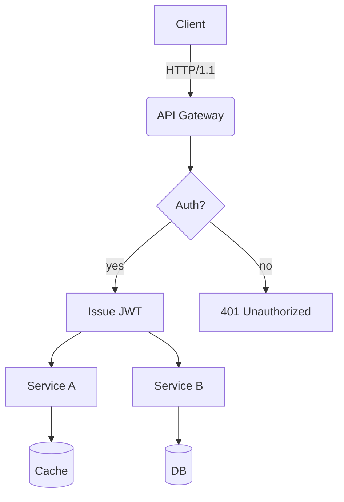
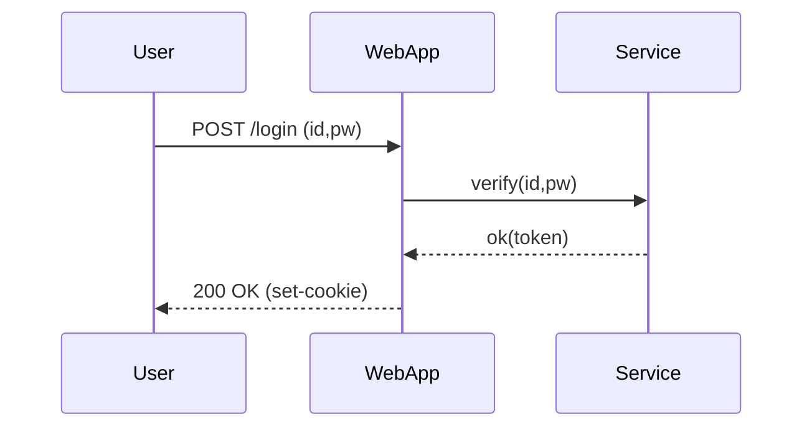
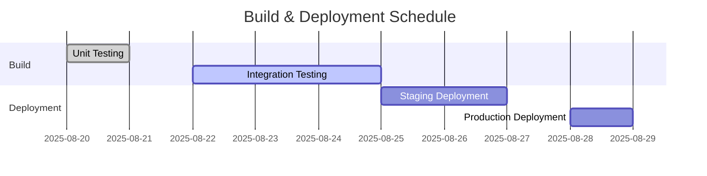
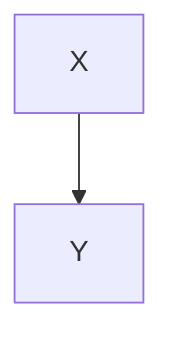

# Translation Test **Rich Markdown** Document

This document is designed to exceed *4096 tokens* with a collection of various **format types** of Korean content.  
The purpose is to rigorously test the translator/LLM's context handling, format preservation, code/diagram disregard rules, etc.

> **Guide**
> 1) Ensure code blocks and `mermaid` areas remain unchanged.
> 2) Verify preservation of numbers/units (e.g., 1.2GB, 3ms), slash paths (`/var/log/app.log`), and options (`--flag`).
> 3) Layouts should remain intact even when mixed with tables, lists, quotes, checkboxes, equations, and emojis 😀.

## 1. Mixed Table with Symbols/Units

| Item       | Value | Unit | Comment          |
|------------|-------|------|------------------|
| Throughput | 12,345| RPS  | Peak at 18,900 RPS|
| Latency (P50) | 3.2  | ms   | `--enable-cache` applied |
| Latency (P99) | 41.7 | ms   | Includes GC phase |
| Memory     | 1.5   | GB   | RSS based, cgroup limit 2GB |
| Disk I/O   | 220   | MB/s | Via NVMe-oF(TCP) |

## 2. Task List

- [x] Accuracy of Markdown header translation
- [x] Preservation of keywords within code blocks (`for`, `if`, `return`, etc.)
- [ ] Preservation of Mermaid diagrams and ignoring comments
- [ ] Preservation of units (GB/ms/%), paths (`/etc/hosts`)
- [ ] Preservation of inline equations $O(n \log n)$

## 3. Code Blocks: Bash/Python/JSON/YAML

```bash
#!/usr/bin/env bash
set -euo pipefail

APP_ENV="${APP_ENV:-prod}"
INPUT="${1:-/data/input.txt}"
OUT="/var/tmp/result.json"

echo "[INFO] starting job on $(hostname) at $(date -Iseconds)"
if [[ ! -f "$INPUT" ]]; then
  echo "[ERROR] input not found: $INPUT" >&2
  exit 1
fi

lines=$(wc -l < "$INPUT")
echo "[DEBUG] line count: $lines"

curl -sS -X POST "http://127.0.0.1:8080/api" \  -H "Content-Type: application/json" \  -d "{"env":"$APP_ENV","count":$lines}" > "$OUT"

jq -r '.status' "$OUT" | grep -q success && echo "OK" || { echo "FAIL"; exit 2; }
```

```python
from __future__ import annotations

def rolling_avg(xs: list[float], k: int) -> list[float]:
    if k <= 0:
        raise ValueError("k must be > 0")
    out = []
    acc = 0.0
    for i, v in enumerate(xs):
        acc += v
        if i >= k:
            acc -= xs[i-k]
        if i >= k - 1:
            out.append(acc / k)
    return out

print(rolling_avg([1,2,3,4,5,6,7,8,9], 3))
```

```json
{
  "service": "analytics",
  "version": "1.4.2",
  "features": ["rollup", "compaction", "delta-index"],
  "limits": {
    "max_docs": 1000000,
    "max_payload_mb": 256
  }
}
```

```yaml
apiVersion: v1
kind: ConfigMap
metadata:
  name: test-config
data:
  APP_ENV: "staging"
  ENDPOINT: "https://api.example.com"
```

## 4. Mermaid Diagrams

### 4.1 Flowchart


### 4.2 Sequence


### 4.3 Gantt


## 5. Images/Links/Quotes


- Documentation: <https://example.com/docs/guide>
- API Reference: [API Reference](https://example.com/api)
- Issue Tracker: https://example.com/issues

> “The quality of translation is determined by the simultaneous preservation of layout and meaning.” — Anonymous

## 6. Mathematical Expressions and Text Mixing

- Average Time Complexity: $O(n \log n)$, Worst: $O(n^2)$
- Variance: $\sigma^2 = \frac{1}{n}\sum_{i=1}^{n}(x_i-\mu)^2$
- Sample Mean: $\bar{x} = \frac{1}{n}\sum x_i$

Paragraph Example: This paragraph serves as a sample to ensure that **bold**, *italic*, `code` snippets are preserved correctly even when mixed with text during translation.  
Includes emojis 😀, Chinese characters 漢字, English CamelCase, snake_case, kebab-case.

### 7.1 Experiment Section — Variation Pattern
The following section is similar but varies slightly in vocabulary and order each iteration to prevent repetitive translation:
- Scenario: Summary of Conversation Logs
- Condition: Includes 100k characters in Korean
- Expected Outcome: Summary accuracy of over 90%

#### Procedure
1. Input Data: `/data/input_01.jsonl`
2. Options: `--batch 512 --timeout 3s --enable-cache`
3. Execution: `app run --job test-01 --qos high`
4. Verification: Check if `test-01 finished` is included in logs

#### Observations
- Longer GC cycles show an increasing trend in P99 latency
- Processing throughput decreases by ~7% when cache miss ratio increases by 10%
- Increasing connection pool size from 32 to 64 results in a decrease in retry rate per second from 1.2% to 0.6%

---

### 7.2 Experiment Section — Variation Pattern
The following section is similar but varies slightly in vocabulary and order each iteration to prevent repetitive translation:
- Scenario: Summary of Conversation Logs
- Condition: Includes 100k characters in Korean
- Expected Outcome: Summary accuracy of over 90%

#### Procedure
1. Input Data: `/data/input_02.jsonl`
2. Options: `--batch 512 --timeout 3s --enable-cache`
3. Execution: `app run --job test-02 --qos high`
4. Verification: Check if `test-02 finished` is included in logs

#### Observations
- Longer GC cycles show an increasing trend in P99 latency
- Processing throughput decreases by ~7% when cache miss ratio increases by 10%
- Increasing connection pool size from 32 to 64 results in a decrease in retry rate per second from 1.2% to 0.6%

---

### 7.3 Experiment Section — Variation Pattern
The following section is similar but varies slightly in vocabulary and order each iteration to prevent repetitive translation:
- Scenario: Kubernetes Deployment
- Condition: HPA Enabled
- Expected Outcome: Scale within range 2~10 operates successfully

---

#### Procedure
1. Input Data: `/data/input_03.jsonl`
2. Options: `--batch 512 --timeout 3s --enable-cache`
3. Execution: `app run --job test-03 --qos high`
4. Verification: Check for inclusion of `test-03 finished` in logs

#### Observations
- Longer GC cycles show a tendency towards increased P99 latency
- Processing throughput decreases by approximately 7% when cache miss ratio increases by 10%
- When connection pool size increases from 32 to 64, the rate of retries per second decreases from 1.2% to 0.6%

---

### 7.4 Experiment Section — Variation Pattern
The following section is similar but varies slightly in vocabulary and order each iteration to prevent repetitive translation.
- Scenario: Kubernetes Deployment
- Condition: HPA (Horizontal Pod Autoscaler) Enabled
- Expected Outcome: Scale within range 2~10

#### Procedure
1. Input Data: `/data/input_04.jsonl`
2. Options: `--batch 512 --timeout 3s --enable-cache`
3. Execution: `app run --job test-04 --qos high`
4. Verification: Check for inclusion of `test-04 finished` in logs

#### Observations
- Longer GC cycles show a tendency towards increased P99 latency
- Processing throughput decreases by approximately 7% when cache miss ratio increases by 10%
- When connection pool size increases from 32 to 64, the rate of retries per second decreases from 1.2% to 0.6%

---

### 7.5 Experiment Section — Variation Pattern
The following section is similar but varies slightly in vocabulary and order each iteration to prevent repetitive translation.
- Scenario: Summary of Conversation Logs
- Condition: Includes 100k characters in Korean text
- Expected Outcome: Summary rate of at least 90%

#### Procedure
1. Input Data: `/data/input_05.jsonl`
2. Options: `--batch 512 --timeout 3s --enable-cache`
3. Execution: `app run --job test-05 --qos high`
4. Verification: Check for inclusion of `test-05 finished` in logs

#### Observations
- Longer GC cycles show a tendency towards increased P99 latency
- Processing throughput decreases by approximately 7% when cache miss ratio increases by 10%
- When connection pool size increases from 32 to 64, the rate of retries per second decreases from 1.2% to 0.6%

---

### 7.6 Experiment Section — Variation Pattern
The following section is similar but varies slightly in vocabulary and order each iteration to prevent repetitive translation.
- Scenario: Mermaid Diagram Rendering
- Condition: More than 50 nodes, more than 100 edges
- Expected Outcome: No distortion in layout

#### Procedure
1. Input Data: `/data/input_06.jsonl`
2. Options: `--batch 512 --timeout 3s --enable-cache`
3. Execution: `app run --job test-06 --qos high`
4. Verification: Check for inclusion of `test-06 finished` in logs

#### Observations
- Longer GC cycles show a tendency towards increased P99 latency
- Processing throughput decreases by approximately 7% when cache miss ratio increases by 10%
- When connection pool size increases from 32 to 64, the rate of retries per second decreases from 1.2% to 0.6%

---

### 7.7 Experiment Section — Variation Pattern
The following section is similar but varies slightly in vocabulary and order each iteration to prevent repetitive translation.
- Scenario: Large JSON Parsing
- Condition: 64MB payload, 4 workers
- Expected Outcome: Completion without memory spikes

#### Procedure
1. Input Data: `/data/input_07.jsonl`
2. Options: `--batch 512 --timeout 3s --enable-cache`
3. Execution: `app run --job test-07 --qos high`
4. Verification: Check for inclusion of `test-07 finished` in logs

#### Observations
- Longer GC cycles exhibit a tendency towards increased P99 latency.
- Processing throughput decreases by approximately 7% when cache miss ratio increases by 10% points.
- Increasing the connection pool size from 32 to 64 results in a decrease in retry rate per second from 1.2% to 0.6%.

---

### 7.8 Experiment Section — Variation Pattern
The following section is similar but varies slightly in vocabulary and order each iteration to prevent redundant translations.
- **Scenario**: Large JSON Parsing
- **Conditions**: 64MB payload, 4 workers
- **Expected Outcome**: Completion without memory spikes

#### Procedure
1. Input Data: `/data/input_08.jsonl`
2. Options: `--batch 512 --timeout 3s --enable-cache`
3. Execution: `app run --job test-08 --qos high`
4. Verification: Check for `test-08 finished` in logs

#### Observations
- Longer GC cycles exhibit a tendency towards increased P99 latency.
- Processing throughput decreases by approximately 7% when cache miss ratio increases by 10% points.
- Increasing the connection pool size from 32 to 64 results in a decrease in retry rate per second from 1.2% to 0.6%.

---

### 7.9 Experiment Section — Variation Pattern
The following section is similar but varies slightly in vocabulary and order each iteration to prevent redundant translations.
- **Scenario**: Large JSON Parsing
- **Conditions**: 64MB payload, 4 workers
- **Expected Outcome**: Completion without memory spikes

#### Procedure
1. Input Data: `/data/input_09.jsonl`
2. Options: `--batch 512 --timeout 3s --enable-cache`
3. Execution: `app run --job test-09 --qos high`
4. Verification: Check for `test-09 finished` in logs

#### Observations
- Longer GC cycles exhibit a tendency towards increased P99 latency.
- Processing throughput decreases by approximately 7% when cache miss ratio increases by 10% points.
- Increasing the connection pool size from 32 to 64 results in a decrease in retry rate per second from 1.2% to 0.6%.

---

### 7.10 Experiment Section — Variation Pattern
The following section is similar but varies slightly in vocabulary and order each iteration to prevent redundant translations.
- **Scenario**: NVMe-oF I/O Retries
- **Conditions**: TCP RTT 2ms, Loss 0.1%
- **Expected Outcome**: Retry rate ≤ 1%

#### Procedure
1. Input Data: `/data/input_10.jsonl`
2. Options: `--batch 512 --timeout 3s --enable-cache`
3. Execution: `app run --job test-10 --qos high`
4. Verification: Check for `test-10 finished` in logs

#### Observations
- Longer GC cycles exhibit a tendency towards increased P99 latency.
- Processing throughput decreases by approximately 7% when cache miss ratio increases by 10% points.
- Increasing the connection pool size from 32 to 64 results in a decrease in retry rate per second from 1.2% to 0.6%.

---

### 7.11 Experiment Section — Variation Pattern
The following section is similar but varies slightly in vocabulary and order each iteration to prevent redundant translations.
- **Scenario**: Large JSON Parsing
- **Conditions**: 64MB payload, 4 workers
- **Expected Outcome**: Completion without memory spikes

#### Procedure
1. Input Data: `/data/input_11.jsonl`
2. Options: `--batch 512 --timeout 3s --enable-cache`
3. Execution: `app run --job test-11 --qos high`
4. Verification: Check for `test-11 finished` in logs

#### Observations
- Longer GC cycles exhibit a tendency towards increased P99 latency.
- Processing throughput decreases by approximately 7% when cache miss ratio increases by 10% points.
- Increasing the connection pool size from 32 to 64 results in a decrease in retry rate per second from 1.2% to 0.6%.

#### Observations
- Longer GC cycles exhibit a tendency towards increased P99 latency.
- Processing throughput decreases by approximately 7% when cache miss ratio increases by 10% points.
- Increasing the connection pool size from 32 to 64 results in a decrease in retry rate per second from 1.2% to 0.6%.

---

### 7.12 Experiment Section — Variation Pattern
The following section is similar but varies slightly in vocabulary and order each iteration to prevent redundant translations.
- Scenario: Kubernetes Deployment
- Condition: HPA (Horizontal Pod Autoscaler) Enabled
- Expected Outcome: Operation within scale range 2~10

#### Procedure
1. Input Data: `/data/input_12.jsonl`
2. Options: `--batch 512 --timeout 3s --enable-cache`
3. Execution: `app run --job test-12 --qos high`
4. Verification: Check for `test-12 finished` in logs

#### Observations
- Longer GC cycles exhibit a tendency towards increased P99 latency.
- Processing throughput decreases by approximately 7% when cache miss ratio increases by 10% points.
- Increasing the connection pool size from 32 to 64 results in a decrease in retry rate per second from 1.2% to 0.6%.

---

### 7.13 Experiment Section — Variation Pattern
The following section is similar but varies slightly in vocabulary and order each iteration to prevent redundant translations.
- Scenario: Large JSON Parsing
- Condition: 64MB Payload, 4 Workers
- Expected Outcome: Completion without memory spikes

#### Procedure
1. Input Data: `/data/input_13.jsonl`
2. Options: `--batch 512 --timeout 3s --enable-cache`
3. Execution: `app run --job test-13 --qos high`
4. Verification: Check for `test-13 finished` in logs

#### Observations
- Longer GC cycles exhibit a tendency towards increased P99 latency.
- Processing throughput decreases by approximately 7% when cache miss ratio increases by 10% points.
- Increasing the connection pool size from 32 to 64 results in a decrease in retry rate per second from 1.2% to 0.6%.

---

### 7.14 Experiment Section — Variation Pattern
The following section is similar but varies slightly in vocabulary and order each iteration to prevent redundant translations.
- Scenario: Large JSON Parsing
- Condition: 64MB Payload, 4 Workers
- Expected Outcome: Completion without memory spikes

#### Procedure
1. Input Data: `/data/input_14.jsonl`
2. Options: `--batch 512 --timeout 3s --enable-cache`
3. Execution: `app run --job test-14 --qos high`
4. Verification: Check for `test-14 finished` in logs

#### Observations
- Longer GC cycles exhibit a tendency towards increased P99 latency.
- Processing throughput decreases by approximately 7% when cache miss ratio increases by 10% points.
- Increasing the connection pool size from 32 to 64 results in a decrease in retry rate per second from 1.2% to 0.6%.

---

### 7.15 Experiment Section — Variation Pattern
The following section is similar but varies slightly in vocabulary and order each iteration to prevent redundant translations.
- Scenario: NVMe-oF I/O Retries
- Condition: TCP RTT 2ms, Loss Rate 0.1%
- Expected Outcome: Retry Rate ≤ 1%

#### Procedure
1. Input Data: `/data/input_15.jsonl`
2. Options: `--batch 512 --timeout 3s --enable-cache`
3. Execution: `app run --job test-15 --qos high`
4. Verification: Check for `test-15 finished` in logs

#### Observations
- Longer GC cycles show a tendency towards increased P99 latency
- Processing throughput decreases by approximately 7% when cache miss ratio increases by 10% points
- Increasing connection pool size from 32 to 64 results in a decrease in retry rate per second from 1.2% to 0.6%

---

### 7.16 Experiment Section — Variation Pattern
The following section is similar but varies slightly in vocabulary and order each iteration to prevent redundant translations.
- Scenario: Mermaid rendering
- Conditions: Over 50 nodes, over 100 edges
- Expected Result: No layout distortion

#### Procedure
1. Input Data: `/data/input_16.jsonl`
2. Options: `--batch 512 --timeout 3s --enable-cache`
3. Execution: `app run --job test-16 --qos high`
4. Verification: Check for `test-16 finished` in logs

#### Observations
- Longer GC cycles show a tendency towards increased P99 latency
- Processing throughput decreases by approximately 7% when cache miss ratio increases by 10% points
- Increasing connection pool size from 32 to 64 results in a decrease in retry rate per second from 1.2% to 0.6%

---

### 7.17 Experiment Section — Variation Pattern
The following section is similar but varies slightly in vocabulary and order each iteration to prevent redundant translations.
- Scenario: Summarization of conversational logs
- Conditions: Including 100k characters in Korean text
- Expected Result: Summary rate of over 90%

#### Procedure
1. Input Data: `/data/input_17.jsonl`
2. Options: `--batch 512 --timeout 3s --enable-cache`
3. Execution: `app run --job test-17 --qos high`
4. Verification: Check for `test-17 finished` in logs

#### Observations
- Longer GC cycles show a tendency towards increased P99 latency
- Processing throughput decreases by approximately 7% when cache miss ratio increases by 10% points
- Increasing connection pool size from 32 to 64 results in a decrease in retry rate per second from 1.2% to 0.6%

---

### 7.18 Experiment Section — Variation Pattern
The following section is similar but varies slightly in vocabulary and order each iteration to prevent redundant translations.
- Scenario: Parsing Large JSON Files
- Conditions: 64MB payload, 4 workers
- Expected Result: Completion without memory spikes

#### Procedure
1. Input Data: `/data/input_18.jsonl`
2. Options: `--batch 512 --timeout 3s --enable-cache`
3. Execution: `app run --job test-18 --qos high`
4. Verification: Check for `test-18 finished` in logs

#### Observations
- Longer GC cycles show a tendency towards increased P99 latency
- Processing throughput decreases by approximately 7% when cache miss ratio increases by 10% points
- Increasing connection pool size from 32 to 64 results in a decrease in retry rate per second from 1.2% to 0.6%

---

### 7.19 Experiment Section — Variation Pattern
The following section is similar but varies slightly in vocabulary and order each iteration to prevent redundant translations.
- Scenario: Parsing Large JSON Files
- Conditions: 64MB payload, 4 workers
- Expected Result: Completion without memory spikes

#### Procedure
1. Input Data: `/data/input_19.jsonl`
2. Options: `--batch 512 --timeout 3s --enable-cache`
3. Execution: `app run --job test-19 --qos high`
4. Verification: Check for `test-19 finished` in logs

#### Observations
- Longer GC cycles show a tendency towards increased P99 latency
- Processing throughput decreases by approximately 7% when cache miss ratio increases by 10% points
- Increasing connection pool size from 32 to 64 results in a decrease in retry rate per second from 1.2% to 0.6%

#### Observations
- Longer GC cycles exhibit a tendency towards increased P99 latency
- Throughput decreases by approximately 7% when cache miss ratio increases by 10% points
- When connection pool size increases from 32 to 64, the retry rate per second decreases from 1.2% to 0.6%

---

### 7.20 Experiment Section — Variation Pattern
The following section is similar but varies slightly in vocabulary and order each iteration to prevent redundant translations.
- Scenario: NVMe-oF I/O Retries
- Conditions: TCP RTT of 2ms, loss rate of 0.1%
- Expected Result: Retry rate ≤ 1%

#### Procedure
1. Input Data: `/data/input_20.jsonl`
2. Options: `--batch 512 --timeout 3s --enable-cache`
3. Execution: `app run --job test-20 --qos high`
4. Verification: Check for `test-20 finished` in logs

#### Observations
- Longer GC cycles exhibit a tendency towards increased P99 latency
- Throughput decreases by approximately 7% when cache miss ratio increases by 10% points
- When connection pool size increases from 32 to 64, the retry rate per second decreases from 1.2% to 0.6%

---

### 7.21 Experiment Section — Variation Pattern
The following section is similar but varies slightly in vocabulary and order each iteration to prevent redundant translations.
- Scenario: Kubernetes Deployment
- Conditions: HPA (Horizontal Pod Autoscaler) Enabled
- Expected Result: Scale within range 2~10

#### Procedure
1. Input Data: `/data/input_21.jsonl`
2. Options: `--batch 512 --timeout 3s --enable-cache`
3. Execution: `app run --job test-21 --qos high`
4. Verification: Check for `test-21 finished` in logs

#### Observations
- Longer GC cycles exhibit a tendency towards increased P99 latency
- Throughput decreases by approximately 7% when cache miss ratio increases by 10% points
- When connection pool size increases from 32 to 64, the retry rate per second decreases from 1.2% to 0.6%

---

### 7.22 Experiment Section — Variation Pattern
The following section is similar but varies slightly in vocabulary and order each iteration to prevent redundant translations.
- Scenario: Mermaid Rendering
- Conditions: Over 50 nodes, Over 100 edges
- Expected Result: No layout distortion

#### Procedure
1. Input Data: `/data/input_22.jsonl`
2. Options: `--batch 512 --timeout 3s --enable-cache`
3. Execution: `app run --job test-22 --qos high`
4. Verification: Check for `test-22 finished` in logs

#### Observations
- Longer GC cycles exhibit a tendency towards increased P99 latency
- Throughput decreases by approximately 7% when cache miss ratio increases by 10% points
- When connection pool size increases from 32 to 64, the retry rate per second decreases from 1.2% to 0.6%

---

### 7.23 Experiment Section — Variation Pattern
The following section is similar but varies slightly in vocabulary and order each iteration to prevent redundant translations.
- Scenario: Large JSON Parsing
- Conditions: 64MB payload, 4 workers
- Expected Result: Completion without memory spikes

#### Procedure
1. Input Data: `/data/input_23.jsonl`
2. Options: `--batch 512 --timeout 3s --enable-cache`
3. Execution: `app run --job test-23 --qos high`
4. Verification: Check for `test-23 finished` in logs

#### Observations
- Longer GC cycles show a tendency towards increased P99 latency
- Processing throughput decreases by approximately 7% when cache miss ratio increases by 10% points
- Increasing connection pool size from 32 to 64 results in a decrease in retry rate per second from 1.2% to 0.6%

---

### 7.24 Experiment Section — Variation Pattern
The following section is similar but varies slightly in vocabulary and order each iteration to prevent redundant translations.
- Scenario: Mermaid rendering
- Conditions: 50+ nodes, 100+ edges
- Expected Result: No layout distortion

#### Procedure
1. Input Data: `/data/input_24.jsonl`
2. Options: `--batch 512 --timeout 3s --enable-cache`
3. Execution: `app run --job test-24 --qos high`
4. Verification: Check for `test-24 finished` in logs

#### Observations
- Longer GC cycles show a tendency towards increased P99 latency
- Processing throughput decreases by approximately 7% when cache miss ratio increases by 10% points
- Increasing connection pool size from 32 to 64 results in a decrease in retry rate per second from 1.2% to 0.6%

---

### 7.25 Experiment Section — Variation Pattern
The following section is similar but varies slightly in vocabulary and order each iteration to prevent redundant translations.
- Scenario: Kubernetes deployment
- Conditions: HPA (Horizontal Pod Autoscaler) enabled
- Expected Result: Scale within range 2~10

#### Procedure
1. Input Data: `/data/input_25.jsonl`
2. Options: `--batch 512 --timeout 3s --enable-cache`
3. Execution: `app run --job test-25 --qos high`
4. Verification: Check for `test-25 finished` in logs

#### Observations
- Longer GC cycles show a tendency towards increased P99 latency
- Processing throughput decreases by approximately 7% when cache miss ratio increases by 10% points
- Increasing connection pool size from 32 to 64 results in a decrease in retry rate per second from 1.2% to 0.6%

---

### 7.26 Experiment Section — Variation Pattern
The following section is similar but varies slightly in vocabulary and order each iteration to prevent redundant translations.
- Scenario: NVMe-oF I/O retry
- Conditions: TCP RTT of 2ms, loss rate of 0.1%
- Expected Result: Retry rate ≤ 1%

#### Procedure
1. Input Data: `/data/input_26.jsonl`
2. Options: `--batch 512 --timeout 3s --enable-cache`
3. Execution: `app run --job test-26 --qos high`
4. Verification: Check for `test-26 finished` in logs

#### Observations
- Longer GC cycles show a tendency towards increased P99 latency
- Processing throughput decreases by approximately 7% when cache miss ratio increases by 10% points
- Increasing connection pool size from 32 to 64 results in a decrease in retry rate per second from 1.2% to 0.6%

---

### 7.27 Experiment Section — Variation Pattern
The following section is similar but varies slightly in vocabulary and order each iteration to prevent redundant translations.
- Scenario: Summary of conversation records
- Conditions: Including 100k characters in Korean text
- Expected Result: Summary accuracy ≥ 90%

#### Procedure
1. Input Data: `/data/input_27.jsonl`
2. Options: `--batch 512 --timeout 3s --enable-cache`
3. Execution: `app run --job test-27 --qos high`
4. Verification: Check for `test-27 finished` in logs

#### Observations
- Longer GC cycles show a tendency towards increased P99 latency
- Processing throughput decreases by approximately 7% when cache miss ratio increases by 10% points
- Increasing connection pool size from 32 to 64 results in a decrease in retry rate per second from 1.2% to 0.6%

---

### 7.28 Experiment Section — Variation Pattern
The following section is similar but varies slightly in vocabulary and order each iteration to prevent redundant translations.
- Scenario: Summary of conversation logs
- Condition: Includes 100k characters in Korean text
- Expected Result: Summary accuracy of over 90%

#### Procedure
1. Input Data: `/data/input_28.jsonl`
2. Options: `--batch 512 --timeout 3s --enable-cache`
3. Execution: `app run --job test-28 --qos high`
4. Verification: Check for `test-28 finished` in logs

#### Observations
- Longer GC cycles show a tendency towards increased P99 latency
- Processing throughput decreases by approximately 7% when cache miss ratio increases by 10% points
- Increasing connection pool size from 32 to 64 results in a decrease in retry rate per second from 1.2% to 0.6%

---

### 7.29 Experiment Section — Variation Pattern
The following section is similar but varies slightly in vocabulary and order each iteration to prevent redundant translations.
- Scenario: Parsing large JSON payloads
- Condition: 64MB payload size, 4 workers
- Expected Result: Completion without memory spikes

#### Procedure
1. Input Data: `/data/input_29.jsonl`
2. Options: `--batch 512 --timeout 3s --enable-cache`
3. Execution: `app run --job test-29 --qos high`
4. Verification: Check for `test-29 finished` in logs

#### Observations
- Longer GC cycles show a tendency towards increased P99 latency
- Processing throughput decreases by approximately 7% when cache miss ratio increases by 10% points
- Increasing connection pool size from 32 to 64 results in a decrease in retry rate per second from 1.2% to 0.6%

---

### 7.30 Experiment Section — Variation Pattern
The following section is similar but varies slightly in vocabulary and order each iteration to prevent redundant translations.
- Scenario: Summary of conversation logs
- Condition: Includes 100k characters in Korean text
- Expected Result: Summary accuracy of over 90%

#### Procedure
1. Input Data: `/data/input_30.jsonl`
2. Options: `--batch 512 --timeout 3s --enable-cache`
3. Execution: `app run --job test-30 --qos high`
4. Verification: Check for `test-30 finished` in logs

#### Observations
- Longer GC cycles show a tendency towards increased P99 latency
- Processing throughput decreases by approximately 7% when cache miss ratio increases by 10% points
- Increasing connection pool size from 32 to 64 results in a decrease in retry rate per second from 1.2% to 0.6%

---

### 7.31 Experiment Section — Variation Pattern
The following section is similar but varies slightly in vocabulary and order each iteration to prevent redundant translations.
- Scenario: Kubernetes Deployment
- Condition: HPA (Horizontal Pod Autoscaler) enabled
- Expected Result: Scale within range of 2 to 10 pods

#### Procedure
1. Input Data: `/data/input_31.jsonl`
2. Options: `--batch 512 --timeout 3s --enable-cache`
3. Execution: `app run --job test-31 --qos high`
4. Verification: Check for `test-31 finished` in logs

#### Observations
- Longer GC cycles show a tendency towards increased P99 latency
- Processing throughput decreases by approximately 7% when cache miss ratio increases by 10% points
- When connection pool size increases from 32 to 64, the retry rate per second decreases from 1.2% to 0.6%

---

### 7.32 Experiment Section — Variation Pattern
The following section is similar but varies slightly in vocabulary and order each iteration to prevent redundant translations.
- Scenario: Mermaid Rendering
- Conditions: Over 50 nodes, Over 100 edges
- Expected Result: No layout distortion

#### Procedure
1. Input Data: `/data/input_32.jsonl`
2. Options: `--batch 512 --timeout 3s --enable-cache`
3. Execution: `app run --job test-32 --qos high`
4. Verification: Check for `test-32 finished` in logs

#### Observations
- Longer GC cycles show a tendency towards increased P99 latency
- Processing throughput decreases by approximately 7% when cache miss ratio increases by 10% points
- When connection pool size increases from 32 to 64, the retry rate per second decreases from 1.2% to 0.6%

---

### 7.33 Experiment Section — Variation Pattern
The following section is similar but varies slightly in vocabulary and order each iteration to prevent redundant translations.
- Scenario: Large JSON Parsing
- Conditions: 64MB payload, 4 workers
- Expected Result: Completion without memory spikes

#### Procedure
1. Input Data: `/data/input_33.jsonl`
2. Options: `--batch 512 --timeout 3s --enable-cache`
3. Execution: `app run --job test-33 --qos high`
4. Verification: Check for `test-33 finished` in logs

#### Observations
- Longer GC cycles show a tendency towards increased P99 latency
- Processing throughput decreases by approximately 7% when cache miss ratio increases by 10% points
- When connection pool size increases from 32 to 64, the retry rate per second decreases from 1.2% to 0.6%

---

### 7.34 Experiment Section — Variation Pattern
The following section is similar but varies slightly in vocabulary and order each iteration to prevent redundant translations.
- Scenario: Kubernetes Deployment
- Conditions: HPA (Horizontal Pod Autoscaler) Enabled
- Expected Result: Scale within range 2~10 operates smoothly

#### Procedure
1. Input Data: `/data/input_34.jsonl`
2. Options: `--batch 512 --timeout 3s --enable-cache`
3. Execution: `app run --job test-34 --qos high`
4. Verification: Check for `test-34 finished` in logs

#### Observations
- Longer GC cycles show a tendency towards increased P99 latency
- Processing throughput decreases by approximately 7% when cache miss ratio increases by 10% points
- When connection pool size increases from 32 to 64, the retry rate per second decreases from 1.2% to 0.6%

---

### 7.35 Experiment Section — Variation Pattern
The following section is similar but varies slightly in vocabulary and order each iteration to prevent redundant translations.
- Scenario: Mermaid Rendering
- Conditions: Over 50 nodes, Over 100 edges
- Expected Result: No layout distortion

#### Procedure
1. Input Data: `/data/input_35.jsonl`
2. Options: `--batch 512 --timeout 3s --enable-cache`
3. Execution: `app run --job test-35 --qos high`
4. Verification: Check for `test-35 finished` in logs

#### Observations
- Longer GC cycles show a tendency towards increased P99 latency
- Processing throughput decreases by approximately 7% when cache miss ratio increases by 10% points
- When connection pool size increases from 32 to 64, the retry rate per second decreases from 1.2% to 0.6%

#### Observations
- Longer GC cycles exhibit a tendency towards increased P99 latency
- Throughput decreases by approximately 7% when cache miss ratio increases by 10% points
- When connection pool size increases from 32 to 64, the retry rate per second decreases from 1.2% to 0.6%

---

### 7.36 Experiment Section — Variation Pattern
The following section is similar but varies slightly in vocabulary and order each iteration to prevent redundant translations.
- Scenario: NVMe-oF I/O Retries
- Conditions: TCP RTT of 2ms, loss rate of 0.1%
- Expected Outcome: Retry rate ≤ 1%

#### Procedure
1. Input Data: `/data/input_36.jsonl`
2. Options: `--batch 512 --timeout 3s --enable-cache`
3. Execution: `app run --job test-36 --qos high`
4. Verification: Check for `test-36 finished` in logs

#### Observations
- Longer GC cycles exhibit a tendency towards increased P99 latency
- Throughput decreases by approximately 7% when cache miss ratio increases by 10% points
- When connection pool size increases from 32 to 64, the retry rate per second decreases from 1.2% to 0.6%

---

### 7.37 Experiment Section — Variation Pattern
The following section is similar but varies slightly in vocabulary and order each iteration to prevent redundant translations.
- Scenario: Large JSON Parsing
- Conditions: 64MB payload, 4 workers
- Expected Outcome: Completion without memory spikes

#### Procedure
1. Input Data: `/data/input_37.jsonl`
2. Options: `--batch 512 --timeout 3s --enable-cache`
3. Execution: `app run --job test-37 --qos high`
4. Verification: Check for `test-37 finished` in logs

#### Observations
- Longer GC cycles exhibit a tendency towards increased P99 latency
- Throughput decreases by approximately 7% when cache miss ratio increases by 10% points
- When connection pool size increases from 32 to 64, the retry rate per second decreases from 1.2% to 0.6%

---

### 7.38 Experiment Section — Variation Pattern
The following section is similar but varies slightly in vocabulary and order each iteration to prevent redundant translations.
- Scenario: Mermaid Rendering
- Conditions: 50+ nodes, 100+ edges
- Expected Outcome: No layout distortion

#### Procedure
1. Input Data: `/data/input_38.jsonl`
2. Options: `--batch 512 --timeout 3s --enable-cache`
3. Execution: `app run --job test-38 --qos high`
4. Verification: Check for `test-38 finished` in logs

#### Observations
- Longer GC cycles exhibit a tendency towards increased P99 latency
- Throughput decreases by approximately 7% when cache miss ratio increases by 10% points
- When connection pool size increases from 32 to 64, the retry rate per second decreases from 1.2% to 0.6%

---

### 7.39 Experiment Section — Variation Pattern
The following section is similar but varies slightly in vocabulary and order each iteration to prevent redundant translations.
- Scenario: Mermaid Rendering
- Conditions: 50+ nodes, 100+ edges
- Expected Outcome: No layout distortion

#### Procedure
1. Input Data: `/data/input_39.jsonl`
2. Options: `--batch 512 --timeout 3s --enable-cache`
3. Execution: `app run --job test-39 --qos high`
4. Verification: Check for `test-39 finished` in logs

#### Observations
- Longer GC cycles show a tendency towards increased P99 latency
- Processing throughput decreases by approximately 7% when cache miss ratio increases by 10% points
- Increasing connection pool size from 32 to 64 results in a decrease in retry rate per second from 1.2% to 0.6%

---

### 7.40 Experiment Section — Modified Patterns
The following section varies slightly in vocabulary and order each iteration to prevent redundant translations.
- Scenario: Summary of conversation logs
- Condition: Includes 100k characters in Korean text
- Expected Outcome: Summary accuracy of over 90%

#### Procedure
1. Input Data: `/data/input_40.jsonl`
2. Options: `--batch 512 --timeout 3s --enable-cache`
3. Execution: `app run --job test-40 --qos high`
4. Verification: Check for `test-40 finished` inclusion in logs

#### Observations
- Longer GC cycles show a tendency towards increased P99 latency
- Processing throughput decreases by approximately 7% when cache miss ratio increases by 10% points
- Increasing connection pool size from 32 to 64 results in a decrease in retry rate per second from 1.2% to 0.6%

## 8. Long-form List

- 2. Consistent Error Handling — Case #001
- 3. Performance Profiling — Case #002
- 4. Accessibility (a11y) — Case #003
- 5. Log Schema Stability — Case #004
- 6. Cache Invalidation Scenarios — Case #005
- 7. Performance Profiling — Case #006
- 8. Performance Profiling — Case #007
- 9. API Backward Compatibility — Case #008
- 10. Log Schema Stability — Case #009
- 11. Accessibility (a11y) — Case #010
- 12. Cache Invalidation Scenarios — Case #011
- 13. Performance Profiling — Case #012
- 14. Security Header Implementation — Case #013
- 15. Resource Leak Detection — Case #015
- 16. Consistent Error Handling — Case #016
- 17. Consistent Error Handling — Case #017
- 18. Internationalization (i18n) — Case #018
- 19. CORS Policy Validation — Case #019
- 20. Performance Profiling — Case #020
- 21. Security Header Implementation — Case #021
- 22. Log Schema Stability — Case #022
- 23. Performance Profiling — Case #023
- 24. Cache Invalidation Scenarios — Case #024
- 25. CORS Policy Validation — Case #025
- 26. Performance Profiling — Case #026
- 27. Accessibility (a11y) — Case #027
- 28. Accessibility (a11y) — Case #028
- 29. API Backward Compatibility — Case #029
- 30. Cache Invalidation Scenarios — Case #030
- 31. Cache Invalidation Scenarios — Case #031
- 32. Performance Profiling — Case #032
- 33. Resource Leak Detection — Case #033
- 34. Log Schema Stability — Case #034
- 35. CORS Policy Validation — Case #035
- 36. Consistent Error Handling — Case #036
- 37. Resource Leak Detection — Case #037
- 38. Consistent Error Handling — Case #038
- 39. Internationalization (i18n) — Case #039
- 40. API Backward Compatibility — Case #040
- 41. Cache Invalidation Scenarios — Case #041
- 42. Cache Invalidation Scenarios — Case #042
- 43. Cache Invalidation Scenarios — Case #043
- 44. Performance Profiling — Case #044
- 45. Performance Profiling — Case #045
- 46. CORS Policy Validation — Case #046
- 47. Resource Leak Detection — Case #047
- 48. Cache Invalidation Scenarios — Case #048
- 49. Consistent Error Handling — Case #049
- 50. Log Schema Stability — Case #050
- 51. Resource Leak Detection — Case #051
- 52. Internationalization (i18n) — Case #052
- 53. Log Schema Stability — Case #053
- 54. Resource Leak Detection — Case #054
- 55. Security Header Implementation — Case #055
- 56. Internationalization (i18n) — Case #056
- 57. API Backward Compatibility — Case #057

(Note: The structure and markdown formatting have been preserved as requested, including retaining all code block tags and specific content elements like case numbers and terminology such as "a11y" and "i18n".)

- **Accessibility (a11y) — Case #058**
- **API Backward Compatibility — Case #059**
- **Performance Profiling — Case #060**
- **Accessibility (a11y) — Case #061**
- **API Backward Compatibility — Case #062**
- **Internationalization (i18n) — Case #063**
- **Security Header Implementation — Case #064**
- **Error Handling Consistency — Case #065**
- **Performance Profiling — Case #066**
- **Accessibility (a11y) — Case #067**
- **Error Handling Consistency — Case #068**
- **Performance Profiling — Case #069**
- **Resource Leak Detection — Case #070**
- **Accessibility (a11y) — Case #071**
- **Internationalization (i18n) — Case #072**
- **Error Handling Consistency — Case #073**
- **Internationalization (i18n) — Case #074**
- **Performance Profiling — Case #075**
- **Security Header Implementation — Case #076**
- **CORS Policy Validation — Case #077**
- **Resource Leak Detection — Case #078**
- **Resource Leak Detection — Case #079**
- **Performance Profiling — Case #080**
- **Accessibility (a11y) — Case #081**
- **Accessibility (a11y) — Case #082**
- **Performance Profiling — Case #083**
- **Resource Leak Detection — Case #084**
- **Caching Invalidation Scenarios — Case #086**
- **CORS Policy Validation — Case #087**
- **Log Schema Stability — Case #088**
- **CORS Policy Validation — Case #089**
- **Security Header Implementation — Case #090**
- **API Backward Compatibility — Case #091**
- **Accessibility (a11y) — Case #092**
- **Performance Profiling — Case #093**
- **Performance Profiling — Case #094**
- **Log Schema Stability — Case #095**
- **Internationalization (i18n) — Case #096**
- **API Backward Compatibility — Case #097**
- **Error Handling Consistency — Case #098**
- **Caching Invalidation Scenarios — Case #099**
- **Accessibility (a11y) — Case #100**
- **Accessibility (a11y) — Case #101**
- **Internationalization (i18n) — Case #102**
- **Accessibility (a11y) — Case #103**
- **API Backward Compatibility — Case #104**
- **Accessibility (a11y) — Case #105**
- **Performance Profiling — Case #106**
- **Security Header Implementation — Case #107**
- **API Backward Compatibility — Case #108**
- **Security Header Implementation — Case #109**
- **Error Handling Consistency — Case #110**
- **Performance Profiling — Case #111**
- **Resource Leak Detection — Case #112**
- **CORS Policy Validation — Case #113**
- **Accessibility (a11y) — Case #114**
- **Error Handling Consistency — Case #115**
- **Error Handling Consistency — Case #116**
- **Performance Profiling — Case #117**
- **CORS Policy Validation — Case #118**
- **Resource Leak Detection — Case #119**
- **Caching Invalidation Scenarios — Case #120**
- **CORS Policy Validation — Case #121**
- **Performance Profiling — Case #122**
- **Error Handling Consistency — Case #123**
- **Performance Profiling — Case #124**
- **Performance Profiling — Case #125**
- **Accessibility (a11y) — Case #126**
- **Accessibility (a11y) — Case #127**
- **Error Handling Consistency — Case #128**
- **Error Handling Consistency — Case #129**
- **API Backward Compatibility — Case #130**
- **Accessibility (a11y) — Case #131**
- **API Backward Compatibility — Case #132**

- 134. Cache Invalidation Scenario — Case #133
- 135. Security Headers Implementation — Case #134
- 136. Internationalization (i18n) — Case #135
- 137. Security Headers Implementation — Case #136
- 138. Performance Profiling — Case #137
- 139. Performance Profiling — Case #138
- 140. CORS Policy Validation — Case #139
- 141. Internationalization (i18n) — Case #140
- 142. Log Schema Stability — Case #141
- 143. CORS Policy Validation — Case #142
- 144. Accessibility (a11y) — Case #143
- 145. Security Headers Implementation — Case #144
- 146. Log Schema Stability — Case #145
- 147. Performance Profiling — Case #146
- 148. Resource Leak Detection — Case #147
- 149. Performance Profiling — Case #148
- 150. Resource Leak Detection — Case #149
- 151. Accessibility (a11y) — Case #150
- 152. API Backward Compatibility — Case #151
- 153. Accessibility (a11y) — Case #152
- 154. Security Headers Implementation — Case #153
- 155. Accessibility (a11y) — Case #154
- 156. Performance Profiling — Case #155
- 157. Cache Invalidation Scenario — Case #156
- 158. Security Headers Implementation — Case #157
- 159. Error Handling Consistency — Case #158
- 160. Log Schema Stability — Case #159
- 161. Performance Profiling — Case #160
- 162. Accessibility (a11y) — Case #161
- 163. Error Handling Consistency — Case #162
- 164. Resource Leak Detection — Case #163
- 165. Log Schema Stability — Case #164
- 166. Internationalization (i18n) — Case #167
- 167. Cache Invalidation Scenario — Case #168
- 168. Internationalization (i18n) — Case #169
- 169. Cache Invalidation Scenario — Case #170
- 170. Resource Leak Detection — Case #171
- 171. Security Headers Implementation — Case #172
- 172. Resource Leak Detection — Case #173
- 173. Error Handling Consistency — Case #174
- 174. Resource Leak Detection — Case #175
- 175. Log Schema Stability — Case #176
- 176. Cross-Origin Resource Sharing (CORS) Policy Validation — Case #177
- 177. Security Headers Implementation — Case #178
- 178. Log Schema Stability — Case #179
- 179. Performance Profiling — Case #180
- 180. Resource Leak Detection — Case #181
- 181. Internationalization (i18n) — Case #182
- 182. Log Schema Stability — Case #183
- 183. Accessibility (a11y) — Case #184
- 184. Security Headers Implementation — Case #185
- 185. Resource Leak Detection — Case #186
- 186. Resource Leak Detection — Case #187
- 187. Accessibility (a11y) — Case #188
- 188. Cache Invalidation Scenario — Case #189
- 189. Accessibility (a11y) — Case #190
- 190. Cache Invalidation Scenario — Case #191
- 191. Error Handling Consistency — Case #192
- 192. Error Handling Consistency — Case #193
- 193. Resource Leak Detection — Case #194
- 194. Error Handling Consistency — Case #195
- 195. Cross-Origin Resource Sharing (CORS) Policy Validation — Case #196
- 196. Performance Profiling — Case #197
- 197. Resource Leak Detection — Case #198
- 198. Accessibility (a11y) — Case #199
- 199. Resource Leak Detection — Case #200
- 200. Cache Invalidation Scenario — Case #201
- 201. Internationalization (i18n) — Case #202
- 202. Log Schema Stability — Case #203

- 205. Consistent Error Handling — Case #204
- 206. Resource Leak Detection — Case #205
- 207. Applying Security Headers — Case #206
- 208. Resource Leak Detection — Case #207
- 209. Cache Invalidation Scenarios — Case #208
- 210. Performance Profiling — Case #209
- 211. Applying Security Headers — Case #210
- 212. Internationalization (i18n) — Case #211
- 213. Log Schema Stability — Case #212
- 214. Consistent Error Handling — Case #213
- 215. Cache Invalidation Scenarios — Case #214
- 216. Applying Security Headers — Case #215
- 217. Internationalization (i18n) — Case #216
- 218. Applying Security Headers — Case #217
- 219. Performance Profiling — Case #218
- 220. Consistent Error Handling — Case #219
- 221. Applying Security Headers — Case #220
- 222. API Backward Compatibility — Case #222
- 223. Resource Leak Detection — Case #223
- 224. Internationalization (i18n) — Case #224
- 225. Applying Security Headers — Case #225
- 227. Internationalization (i18n) — Case #226
- 228. Performance Profiling — Case #227
- 229. Log Schema Stability — Case #228
- 230. CORS Policy Validation — Case #229
- 231. Performance Profiling — Case #230
- 232. API Backward Compatibility — Case #231
- 233. CORS Policy Validation — Case #232
- 234. Internationalization (i18n) — Case #233
- 235. Consistent Error Handling — Case #234
- 236. Performance Profiling — Case #235
- 237. Consistent Error Handling — Case #236
- 238. Performance Profiling — Case #237
- 239. Applying Security Headers — Case #238
- 240. Consistent Error Handling — Case #239
- 241. CORS Policy Validation — Case #240
- 242. API Backward Compatibility — Case #241
- 243. Performance Profiling — Case #242
- 244. Cache Invalidation Scenarios — Case #243
- 245. Performance Profiling — Case #244
- 246. Applying Security Headers — Case #245
- 247. Internationalization (i18n) — Case #247
- 248. Log Schema Stability — Case #248
- 249. Applying Security Headers — Case #249
- 250. Accessibility (a11y) — Case #250
- 251. Accessibility (a11y) — Case #251
- 252. Internationalization (i18n) — Case #252
- 253. Internationalization (i18n) — Case #253
- 254. CORS Policy Validation — Case #254
- 255. Log Schema Stability — Case #255
- 256. CORS Policy Validation — Case #256
- 257. Applying Security Headers — Case #257
- 258. Cache Invalidation Scenarios — Case #258
- 259. Consistent Error Handling — Case #259
- 260. Accessibility (a11y) — Case #260
- 261. Resource Leak Detection — Case #261
- 262. Resource Leak Detection — Case #262
- 263. Performance Profiling — Case #263
- 264. Accessibility (a11y) — Case #264
- 265. Cache Invalidation Scenarios — Case #265
- 266. Applying Security Headers — Case #266
- 267. Resource Leak Detection — Case #267
- 268. Applying Security Headers — Case #268
- 269. Performance Profiling — Case #269
- 270. Consistent Error Handling — Case #270
- 271. Internationalization (i18n) — Case #271
- 272. API Backward Compatibility — Case #272
- 273. Consistent Error Handling — Case #273
- 274. Accessibility (a11y) — Case #274
- 275. API Backward Compatibility — Case #275
- 276. Internationalization (i18n) — Case #276

- 278. Cross-Origin Resource Sharing (CORS) Policy Validation — Case #277
- 279. Security Header Implementation — Case #278
- 280. Cache Invalidation Scenarios — Case #279
- 281. Log Schema Stability — Case #280
- 282. Resource Leak Detection — Case #281
- 283. Accessibility (a11y) — Case #283
- 284. Accessibility (a11y) — Case #284
- 285. Error Handling Consistency — Case #285
- 286. API Backward Compatibility — Case #286
- 287. Cache Invalidation Scenarios — Case #287
- 288. Accessibility (a11y) — Case #288
- 289. Accessibility (a11y) — Case #289
- 290. Security Header Implementation — Case #290
- 291. Internationalization (i18n) — Case #291
- 292. Security Header Implementation — Case #292
- 293. Cross-Origin Resource Sharing (CORS) Policy Validation — Case #293
- 294. Resource Leak Detection — Case #294
- 295. Security Header Implementation — Case #295
- 296. Cross-Origin Resource Sharing (CORS) Policy Validation — Case #296
- 297. Log Schema Stability — Case #297
- 298. Cache Invalidation Scenarios — Case #298
- 299. API Backward Compatibility — Case #299
- 300. Cache Invalidation Scenarios — Case #300
- 301. Internationalization (i18n) — Case #301
- 302. Accessibility (a11y) — Case #302
- 303. Performance Profiling — Case #303
- 304. API Backward Compatibility — Case #304
- 305. Error Handling Consistency — Case #305
- 306. Accessibility (a11y) — Case #306
- 307. Resource Leak Detection — Case #307
- 308. API Backward Compatibility — Case #308
- 309. Security Header Implementation — Case #309
- 310. Cross-Origin Resource Sharing (CORS) Policy Validation — Case #310
- 311. API Backward Compatibility — Case #311
- 312. Accessibility (a11y) — Case #312
- 313. Cross-Origin Resource Sharing (CORS) Policy Validation — Case #313
- 314. Internationalization (i18n) — Case #314
- 315. Resource Leak Detection — Case #315
- 316. Internationalization (i18n) — Case #316
- 317. Log Schema Stability — Case #317
- 318. Security Header Implementation — Case #318
- 319. Log Schema Stability — Case #319
- 320. Error Handling Consistency — Case #320
- 321. Performance Profiling — Case #321
- 322. Accessibility (a11y) — Case #322
- 323. Security Header Implementation — Case #323
- 324. API Backward Compatibility — Case #324
- 325. Cross-Origin Resource Sharing (CORS) Policy Validation — Case #325
- 326. Resource Leak Detection — Case #326
- 327. Cross-Origin Resource Sharing (CORS) Policy Validation — Case #327
- 328. Cross-Origin Resource Sharing (CORS) Policy Validation — Case #328
- 329. API Backward Compatibility — Case #329
- 330. Accessibility (a11y) — Case #330
- 331. Performance Profiling — Case #331
- 332. Cross-Origin Resource Sharing (CORS) Policy Validation — Case #332
- 333. Resource Leak Detection — Case #333
- 334. Performance Profiling — Case #334
- 335. Resource Leak Detection — Case #335
- 336. Error Handling Consistency — Case #336
- 337. Internationalization (i18n) — Case #337
- 338. Cache Invalidation Scenarios — Case #338
- 339. API Backward Compatibility — Case #339
- 340. Cache Invalidation Scenarios — Case #340
- 341. Cross-Origin Resource Sharing (CORS) Policy Validation — Case #341
- 342. Internationalization (i18n) — Case #342
- 343. Performance Profiling — Case #343
- 344. Performance Profiling — Case #344
- 345. Log Schema Stability — Case #345
- 346. Error Handling Consistency — Case #346
- 347. API Backward Compatibility — Case #347
- 348. Error Handling Consistency — Case #348
- 349. Accessibility (a11y) — Case #349

- 351. Performance Profiling — Case #350
- 352. Accessibility (a11y) — Case #351
- 353. Consistent Error Handling — Case #352
- 354. Cache Invalidation Scenarios — Case #353
- 355. Internationalization (i18n) — Case #354
- 356. Resource Leak Detection — Case #355
- 357. Accessibility (a11y) — Case #356
- 358. Security Header Implementation — Case #357
- 359. Resource Leak Detection — Case #358
- 360. Performance Profiling — Case #359
- 361. Resource Leak Detection — Case #360
- 362. Log Schema Stability — Case #361
- 363. Internationalization (i18n) — Case #362
- 364. Consistent Error Handling — Case #363
- 365. Resource Leak Detection — Case #364
- 366. Accessibility (a11y) — Case #365
- 367. Log Schema Stability — Case #366
- 368. Resource Leak Detection — Case #367
- 369. Performance Profiling — Case #368
- 370. API Backward Compatibility — Case #369
- 371. Accessibility (a11y) — Case #370
- 372. Performance Profiling — Case #371
- 373. CORS Policy Validation — Case #372
- 374. Cache Invalidation Scenarios — Case #373
- 375. Security Header Implementation — Case #374
- 376. Accessibility (a11y) — Case #375
- 377. API Backward Compatibility — Case #376
- 378. Accessibility (a11y) — Case #377
- 379. Security Header Implementation — Case #378
- 380. CORS Policy Validation — Case #379
- 381. CORS Policy Validation — Case #380
- 382. Log Schema Stability — Case #381
- 383. Log Schema Stability — Case #382
- 383. Performance Profiling — Case #383
- 384. Consistent Error Handling — Case #384
- 385. Performance Profiling — Case #385
- 386. Log Schema Stability — Case #386
- 387. Resource Leak Detection — Case #387
- 388. Accessibility (a11y) — Case #388
- 389. API Backward Compatibility — Case #389
- 390. Performance Profiling — Case #390
- 391. CORS Policy Validation — Case #391
- 392. API Backward Compatibility — Case #392
- 393. Resource Leak Detection — Case #393
- 394. Security Header Implementation — Case #394
- 395. Cache Invalidation Scenarios — Case #395
- 396. Resource Leak Detection — Case #396
- 397. Performance Profiling — Case #397
- 398. Performance Profiling — Case #398
- 399. Consistent Error Handling — Case #399
- 400. Cache Invalidation Scenarios — Case #400
- 401. API Backward Compatibility — Case #401
- 402. Log Schema Stability — Case #402
- 403. Resource Leak Detection — Case #403
- 404. Consistent Error Handling — Case #404
- 405. Accessibility (a11y) — Case #405
- 406. API Backward Compatibility — Case #406
- 407. API Backward Compatibility — Case #407
- 408. CORS Policy Validation — Case #408
- 409. Resource Leak Detection — Case #409
- 410. Cache Invalidation Scenarios — Case #410
- 411. Security Header Implementation — Case #411
- 412. Security Header Implementation — Case #412
- 413. Security Header Implementation — Case #413
- 414. Accessibility (a11y) — Case #414
- 415. Internationalization (i18n) — Case #415
- 416. API Backward Compatibility — Case #416
- 417. Performance Profiling — Case #417
- 418. Cache Invalidation Scenarios — Case #418
- 419. Resource Leak Detection — Case #419
- 420. Resource Leak Detection — Case #420
- 421. Log Schema Stability — Case #421
- 422. API Backward Compatibility — Case #422

- 424. Accessibility (a11y) — Case #423
- 425. Log Schema Stability — Case #424
- 426. Cache Invalidation Scenarios — Case #425
- 427. Log Schema Stability — Case #426
- 428. Internationalization (i18n) — Case #427
- 429. Performance Profiling — Case #428
- 430. Security Header Implementation — Case #429
- 431. Error Handling Consistency — Case #430
- 432. Resource Leak Detection — Case #431
- 433. Error Handling Consistency — Case #432
- 434. Cache Invalidation Scenarios — Case #433
- 435. Performance Profiling — Case #434
- 436. API Backward Compatibility — Case #435
- 437. Log Schema Stability — Case #436
- 438. Cache Invalidation Scenarios — Case #437
- 439. Security Header Implementation — Case #438
- 440. Accessibility (a11y) — Case #439
- 441. API Backward Compatibility — Case #440
- 442. API Backward Compatibility — Case #441
- 443. Security Header Implementation — Case #442
- 444. Accessibility (a11y) — Case #443
- 445. Log Schema Stability — Case #444
- 446. Internationalization (i18n) — Case #446
- 447. API Backward Compatibility — Case #447
- 448. Internationalization (i18n) — Case #448
- 449. Performance Profiling — Case #449
- 450. Cache Invalidation Scenarios — Case #450
- 451. Cross-Origin Resource Sharing (CORS) Policy Validation — Case #451
- 452. Security Header Implementation — Case #452
- 453. Cross-Origin Resource Sharing (CORS) Policy Validation — Case #453
- 454. Internationalization (i18n) — Case #454
- 455. Log Schema Stability — Case #455
- 456. Performance Profiling — Case #456
- 457. Performance Profiling — Case #457
- 458. Security Header Implementation — Case #458
- 459. Resource Leak Detection — Case #459
- 460. Performance Profiling — Case #460
- 461. Accessibility (a11y) — Case #461
- 462. Error Handling Consistency — Case #462
- 463. Error Handling Consistency — Case #463
- 464. Error Handling Consistency — Case #464
- 465. Cache Invalidation Scenarios — Case #465
- 466. Internationalization (i18n) — Case #466
- 467. Accessibility (a11y) — Case #467
- 468. Log Schema Stability — Case #468
- 469. Internationalization (i18n) — Case #469
- 470. API Backward Compatibility — Case #470
- 471. Security Header Implementation — Case #471
- 472. API Backward Compatibility — Case #472
- 473. Error Handling Consistency — Case #473
- 474. Log Schema Stability — Case #474
- 475. Performance Profiling — Case #475
- 476. Cross-Origin Resource Sharing (CORS) Policy Validation — Case #476
- 477. Cross-Origin Resource Sharing (CORS) Policy Validation — Case #477
- 478. Internationalization (i18n) — Case #478
- 479. Internationalization (i18n) — Case #479
- 480. Cross-Origin Resource Sharing (CORS) Policy Validation — Case #480
- 481. API Backward Compatibility — Case #481
- 482. Performance Profiling — Case #482
- 483. Log Schema Stability — Case #483
- 484. API Backward Compatibility — Case #484
- 485. Cache Invalidation Scenarios — Case #485
- 486. Error Handling Consistency — Case #486
- 487. Performance Profiling — Case #487
- 488. Error Handling Consistency — Case #488
- 489. Cache Invalidation Scenarios — Case #489
- 490. Security Header Implementation — Case #490
- 491. Cache Invalidation Scenarios — Case #491
- 492. Error Handling Consistency — Case #492
- 493. Resource Leak Detection — Case #493
- 494. Resource Leak Detection — Case #494

- 496. Consistent Error Handling — Case #495
- 497. Internationalization (i18n) — Case #496
- 498. Applying Security Headers — Case #497
- 499. API Backward Compatibility — Case #498
- 500. Cache Invalidation Scenarios — Case #500
- 501. Cache Invalidation Scenarios — Case #501
- 502. API Backward Compatibility — Case #502
- 503. Internationalization (i18n) — Case #503
- 504. Internationalization (i18n) — Case #504
- 505. Resource Leak Detection — Case #505
- 506. Resource Leak Detection — Case #506
- 507. Internationalization (i18n) — Case #507
- 508. Cache Invalidation Scenarios — Case #508
- 509. Accessibility (a11y) — Case #509
- 510. Performance Profiling — Case #510
- 511. Resource Leak Detection — Case #511
- 512. Accessibility (a11y) — Case #512
- 513. CORS Policy Validation — Case #513
- 514. Cache Invalidation Scenarios — Case #514
- 515. API Backward Compatibility — Case #515
- 516. CORS Policy Validation — Case #516
- 517. API Backward Compatibility — Case #517
- 518. API Backward Compatibility — Case #518
- 519. Performance Profiling — Case #519
- 520. Accessibility (a11y) — Case #520
- 521. CORS Policy Validation — Case #521
- 522. Security Header Application — Case #522
- 523. Cache Invalidation Scenarios — Case #523
- 524. Log Schema Stability — Case #524
- 525. CORS Policy Validation — Case #525
- 526. Internationalization (i18n) — Case #526
- 527. Log Schema Stability — Case #527
- 528. Resource Leak Detection — Case #528
- 529. Internationalization (i18n) — Case #529
- 530. Consistent Error Handling — Case #530
- 531. Consistent Error Handling — Case #531
- 532. Log Schema Stability — Case #532
- 533. Performance Profiling — Case #533
- 534. Performance Profiling — Case #534
- 535. API Backward Compatibility — Case #535
- 536. Internationalization (i18n) — Case #536
- 537. CORS Policy Validation — Case #537
- 538. API Backward Compatibility — Case #538
- 539. API Backward Compatibility — Case #539
- 540. Cache Invalidation Scenarios — Case #540
- 541. Cache Invalidation Scenarios — Case #541
- 542. Security Header Application — Case #542
- 543. Cache Invalidation Scenarios — Case #543
- 544. Security Header Application — Case #544
- 545. Security Header Application — Case #545
- 546. Performance Profiling — Case #546
- 547. CORS Policy Validation — Case #547
- 548. Internationalization (i18n) — Case #548
- 549. Resource Leak Detection — Case #549
- 550. Performance Profiling — Case #550
- 551. Performance Profiling — Case #551
- 552. Internationalization (i18n) — Case #552
- 553. Consistent Error Handling — Case #553
- 554. Internationalization (i18n) — Case #554
- 555. Security Header Application — Case #555
- 556. Security Header Application — Case #556
- 557. Internationalization (i18n) — Case #557
- 558. API Backward Compatibility — Case #558
- 559. API Backward Compatibility — Case #559
- 560. Log Schema Stability — Case #560
- 561. Security Header Application — Case #561
- 562. Consistent Error Handling — Case #562
- 563. Security Header Application — Case #563
- 564. Cache Invalidation Scenarios — Case #564
- 565. Consistent Error Handling — Case #565
- 566. Log Schema Stability — Case #566
- 567. Internationalization (i18n) — Case #567

- **569. Internationalization (i18n) — Case #568**
- **570. Performance Profiling — Case #569**
- **571. API Backward Compatibility — Case #570**
- **572. Performance Profiling — Case #571**
- **573. API Backward Compatibility — Case #572**
- **574. Security Header Implementation — Case #573**
- **575. CORS Policy Validation — Case #574**
- **576. Resource Leak Detection — Case #575**
- **577. CORS Policy Validation — Case #576**
- **578. Resource Leak Detection — Case #577**
- **579. Error Handling Consistency — Case #578**
- **580. Log Schema Stability — Case #579**
- **581. Error Handling Consistency — Case #580**
- **582. Performance Profiling — Case #581**
- **583. Internationalization (i18n) — Case #582**
- **584. Log Schema Stability — Case #583**
- **585. Resource Leak Detection — Case #584**
- **586. API Backward Compatibility — Case #585**
- **587. CORS Policy Validation — Case #586**
- **588. CORS Policy Validation — Case #587**
- **589. Cache Invalidation Scenarios — Case #588**
- **590. Log Schema Stability — Case #589**
- **591. API Backward Compatibility — Case #590**
- **592. Security Header Implementation — Case #591**
- **593. Security Header Implementation — Case #592**
- **594. Error Handling Consistency — Case #593**
- **595. Internationalization (i18n) — Case #594**
- **596. API Backward Compatibility — Case #595**
- **597. Internationalization (i18n) — Case #596**
- **598. CORS Policy Validation — Case #597**
- **599. Cache Invalidation Scenarios — Case #598**
- **600. Internationalization (i18n) — Case #599**
- **601. Resource Leak Detection — Case #600**
- **602. Resource Leak Detection — Case #601**
- **603. Cache Invalidation Scenarios — Case #602**
- **604. Resource Leak Detection — Case #603**
- **605. Cache Invalidation Scenarios — Case #604**
- **606. Log Schema Stability — Case #605**
- **607. API Backward Compatibility — Case #606**
- **608. Security Header Implementation — Case #607**
- **609. Performance Profiling — Case #608**
- **610. API Backward Compatibility — Case #609**
- **611. Error Handling Consistency — Case #610**
- **612. CORS Policy Validation — Case #611**
- **613. CORS Policy Validation — Case #612**
- **614. Performance Profiling — Case #613**
- **615. Cache Invalidation Scenarios — Case #614**
- **616. Performance Profiling — Case #615**
- **617. Error Handling Consistency — Case #616**
- **618. Performance Profiling — Case #617**
- **619. Performance Profiling — Case #618**
- **620. Performance Profiling — Case #619**
- **621. Internationalization (i18n) — Case #620**
- **622. Performance Profiling — Case #621**
- **623. Log Schema Stability — Case #622**
- **624. API Backward Compatibility — Case #623**
- **625. Security Header Implementation — Case #624**
- **626. Error Handling Consistency — Case #625**
- **627. Log Schema Stability — Case #626**
- **628. Performance Profiling — Case #627**
- **629. Error Handling Consistency — Case #628**
- **630. Security Header Implementation — Case #629**
- **631. Security Header Implementation — Case #630**
- **632. Performance Profiling — Case #631**
- **633. Log Schema Stability — Case #632**
- **634. Resource Leak Detection — Case #633**
- **635. Accessibility (a11y) — Case #634**
- **636. Accessibility (a11y) — Case #635**
- **637. Resource Leak Detection — Case #636**
- **638. Cache Invalidation Scenarios — Case #637**
- **639. Cache Invalidation Scenarios — Case #638**

- 641. Internationalization (i18n) — Case #640
- 642. Error Handling Consistency — Case #641
- 643. API Backward Compatibility — Case #642
- 644. Performance Profiling — Case #643
- 645. Cache Invalidation Scenarios — Case #644
- 646. Cache Invalidation Scenarios — Case #645
- 647. Internationalization (i18n) — Case #646
- 648. Log Schema Stability — Case #647
- 649. CORS Policy Validation — Case #648
- 650. Log Schema Stability — Case #649
- 651. Resource Leak Detection — Case #650
- 652. Accessibility (a11y) — Case #651
- 653. Security Header Implementation — Case #652
- 654. Log Schema Stability — Case #653
- 655. Performance Profiling — Case #654
- 656. Security Header Implementation — Case #655
- 657. Log Schema Stability — Case #656
- 658. CORS Policy Validation — Case #657
- 659. API Backward Compatibility — Case #658
- 660. CORS Policy Validation — Case #659
- 661. API Backward Compatibility — Case #660
- 662. Performance Profiling — Case #661
- 663. Log Schema Stability — Case #662
- 664. Cache Invalidation Scenarios — Case #663
- 665. CORS Policy Validation — Case #664
- 666. Resource Leak Detection — Case #665
- 667. Security Header Implementation — Case #666
- 668. Cache Invalidation Scenarios — Case #667
- 669. Cache Invalidation Scenarios — Case #668
- 670. Performance Profiling — Case #669
- 671. API Backward Compatibility — Case #670
- 672. Accessibility (a11y) — Case #671
- 673. CORS Policy Validation — Case #672
- 674. Security Header Implementation — Case #673
- 675. Resource Leak Detection — Case #674
- 676. Accessibility (a11y) — Case #675
- 677. Internationalization (i18n) — Case #676
- 678. Resource Leak Detection — Case #677
- 679. Cache Invalidation Scenarios — Case #678
- 680. Cache Invalidation Scenarios — Case #679
- 681. Log Schema Stability — Case #680
- 682. Accessibility (a11y) — Case #681
- 683. CORS Policy Validation — Case #682
- 684. Resource Leak Detection — Case #683
- 685. Performance Profiling — Case #684
- 686. Log Schema Stability — Case #685
- 687. Performance Profiling — Case #686
- 688. CORS Policy Validation — Case #687
- 689. CORS Policy Validation — Case #688
- 690. Cache Invalidation Scenarios — Case #689
- 691. API Backward Compatibility — Case #690
- 692. API Backward Compatibility — Case #691
- 693. Internationalization (i18n) — Case #692
- 694. Internationalization (i18n) — Case #693
- 695. API Backward Compatibility — Case #694
- 696. Performance Profiling — Case #695
- 697. Cache Invalidation Scenarios — Case #696
- 698. Performance Profiling — Case #697
- 699. API Backward Compatibility — Case #698
- 700. Security Header Implementation — Case #699
- 701. Cache Invalidation Scenarios — Case #700
- 702. Error Handling Consistency — Case #701
- 703. Performance Profiling — Case #702
- 704. Security Header Implementation — Case #703
- 705. Log Schema Stability — Case #704
- 706. Accessibility (a11y) — Case #705
- 707. API Backward Compatibility — Case #706
- 708. Cache Invalidation Scenarios — Case #707
- 709. Log Schema Stability — Case #708
- 710. Error Handling Consistency — Case #709
- 711. Resource Leak Detection — Case #710

- **713. Internationalization (i18n) — Case #712**
- **714. Resource Leak Detection — Case #713**
- **715. CORS Policy Validation — Case #714**
- **716. Log Schema Stability — Case #715**
- **717. Accessibility (a11y) — Case #716**
- **718. Error Handling Consistency — Case #717**
- **719. Performance Profiling — Case #718**
- **720. Accessibility (a11y) — Case #719**
- **721. CORS Policy Validation — Case #720**
- **722. Log Schema Stability — Case #721**
- **723. Resource Leak Detection — Case #722**
- **724. Cache Invalidation Scenarios — Case #723**
- **725. Cache Invalidation Scenarios — Case #724**
- **726. Performance Profiling — Case #725**
- **727. Resource Leak Detection — Case #726**
- **728. CORS Policy Validation — Case #727**
- **729. Performance Profiling — Case #728**
- **730. Log Schema Stability — Case #729**
- **731. Resource Leak Detection — Case #730**
- **732. Accessibility (a11y) — Case #731**
- **733. Performance Profiling — Case #732**
- **734. API Backward Compatibility — Case #733**
- **735. CORS Policy Validation — Case #734**
- **736. Resource Leak Detection — Case #735**
- **737. Security Header Implementation — Case #736**
- **738. Log Schema Stability — Case #737**
- **739. Accessibility (a11y) — Case #738**
- **740. CORS Policy Validation — Case #739**
- **741. Security Header Implementation — Case #740**
- **742. CORS Policy Validation — Case #741**
- **743. Security Header Implementation — Case #742**
- **744. Internationalization (i18n) — Case #743**
- **745. Internationalization (i18n) — Case #744**
- **746. Log Schema Stability — Case #745**
- **747. Cache Invalidation Scenarios — Case #746**
- **748. Performance Profiling — Case #747**
- **749. Cache Invalidation Scenarios — Case #748**
- **750. Performance Profiling — Case #749**
- **751. Log Schema Stability — Case #750**
- **752. CORS Policy Validation — Case #751**
- **753. Accessibility (a11y) — Case #752**
- **754. CORS Policy Validation — Case #753**
- **755. Cache Invalidation Scenarios — Case #754**
- **756. Internationalization (i18n) — Case #755**
- **757. Internationalization (i18n) — Case #756**
- **758. Accessibility (a11y) — Case #757**
- **759. Performance Profiling — Case #758**
- **760. Resource Leak Detection — Case #759**
- **761. Internationalization (i18n) — Case #760**
- **762. Cache Invalidation Scenarios — Case #761**
- **763. Internationalization (i18n) — Case #762**
- **764. Accessibility (a11y) — Case #763**
- **765. Performance Profiling — Case #764**
- **766. Resource Leak Detection — Case #765**
- **767. Accessibility (a11y) — Case #766**
- **768. Error Handling Consistency — Case #767**
- **769. CORS Policy Validation — Case #768**
- **770. Accessibility (a11y) — Case #769**
- **771. Resource Leak Detection — Case #770**
- **772. Error Handling Consistency — Case #771**
- **773. Performance Profiling — Case #772**
- **774. Log Schema Stability — Case #773**
- **775. Error Handling Consistency — Case #774**
- **776. Resource Leak Detection — Case #775**
- **777. Accessibility (a11y) — Case #776**
- **778. Performance Profiling — Case #777**
- **779. Error Handling Consistency — Case #778**
- **780. Internationalization (i18n) — Case #779**
- **781. API Backward Compatibility — Case #780**
- **782. Log Schema Stability — Case #781**
- **783. Accessibility (a11y) — Case #782**

## 9. Conclusion
This document serves as a sample for evaluating how well a translation engine handles **format preservation**, **term consistency**, and **rules for ignoring code/equations/paths**.  
Additional sections following the same pattern can be added to extend this beyond 100,000 characters if needed.

# Extended Section 1

## Repeated Block 1-1

- This paragraph was added to create a very long document.

- Mixed various grammatical structures and Korean text.

- Allows checking translation quality, token limitations, and context loss.

```bash
echo 'section 1-1' >> /tmp/out.log
```



## Repeated Block 1-2

- This paragraph was added to create a very long document.

- Mixed various grammatical structures and Korean text.

- Allows checking translation quality, token limitations, and context loss.

```bash
echo 'section 1-2' >> /tmp/out.log
```


## Repeated Block 1-3

- This paragraph was added to create a very long document.

- Mixed various grammatical structures and Korean text.

- Allows checking translation quality, token limitations, and context loss.

```bash
echo 'section 1-3' >> /tmp/out.log
```


## Repeated Block 1-4

- This paragraph was added to create a very long document.

- Mixed various grammatical structures and Korean text.

- Allows checking translation quality, token limitations, and context loss.

```bash
echo 'section 1-4' >> /tmp/out.log
```


## Repeated Block 1-5

- This paragraph was added to create a very long document.

- Mixed various grammatical structures and Korean text.

- Allows checking translation quality, token limitations, and context loss.

```bash
echo 'section 1-5' >> /tmp/out.log
```


## Repeated Block 1-6

- This paragraph was added to create a very long document.

- Mixed various grammatical structures and Korean text.

- Allows checking translation quality, token limitations, and context loss.

```bash
echo 'section 1-6' >> /tmp/out.log
```


## Repeated Block 1-7

- This paragraph was added to create a very long document.

- Mixed various grammatical structures and Korean text.

- Allows checking translation quality, token limitations, and context loss.

```bash
echo 'section 1-7' >> /tmp/out.log
```


```bash
echo 'section 1-7' >> /tmp/out.log
```


## Repeated Block 1-8

- This paragraph was added to create a very long document.

- Mixed with various grammatical structures and Korean text.

- You can check translation quality, token limits, and context loss.

```bash

echo 'section 1-8' >> /tmp/out.log

```


## Repeated Block 1-9

- This paragraph was added to create a very long document.

- Mixed with various grammatical structures and Korean text.

- You can check translation quality, token limits, and context loss.

```bash

echo 'section 1-9' >> /tmp/out.log

```


## Repeated Block 1-10

- This paragraph was added to create a very long document.

- Mixed with various grammatical structures and Korean text.

- You can check translation quality, token limits, and context loss.

```bash

echo 'section 1-10' >> /tmp/out.log

```


---

> **⚠️ 이 문서는 AI로 번역된 문서입니다.**
>
> **⚠️ This document has been translated by AI.**