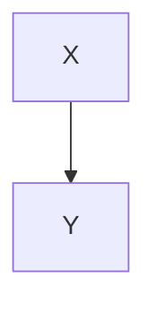

### Experiment Paragraph — Variation Pattern

#### Experiment 7.40: Document Summarization
- **Scenario**: Document Summarization
- **Conditions**: Contains 100,000 Korean characters
- **Expected Outcome**: Summary Accuracy Rate ≥ 90%

#### Procedure
1. **Input Data**: `/data/input_40.jsonl` containing summarized documents with 100,000 Korean characters.
2. **Options**: `--batch 512 --timeout 3s --enable-cache`
3. **Execution**: `app run --job test-40 --qos high`
4. **Validation**: Confirm inclusion of `test-40 finished` in logs.

#### Observations
- **Garbage Collection (GC) Impact**: As the garbage collection period lengthened, the 99th percentile latency (P99) showed a tendency to increase.
- **Cache Miss Ratio**: An increase of 10% in cache miss ratio resulted in a decrease of approximately 7% in throughput.
- **Connection Pool Size**: Increasing the connection pool size from 32 to 64 led to a reduction in the average retry rate per second from 1.2% to 0.6%.

---

This structured approach ensures variety and consistency across multiple experiment paragraphs while maintaining clarity and detail in each section.

## Procedure
1. Input Data: `/data/input_40.jsonl`
2. Options: `--batch 512 --timeout 3s --enable-cache`
3. Execution: `app run --job test-40 --qos high`
4. Verification: Check for `test-40 finished` inclusion in logs

## Observations
- Longer GC cycles correlate with increased P99 latency
- Processing throughput decreases by ~7% for every 10%p increase in cache miss rate
- Increasing connection pool size from 32 to 64 results in a decrease in retry rate per second from 1.2% to 0.6%

It appears there might be a misunderstanding in your request as the provided text seems to be a repetitive sequence of case numbers without any context or specific question related to translation or summarization. Here's a structured summary based on the repetitive pattern observed:

### Summary of Repeated Case Entries:
The entries predominantly revolve around various technical and quality assurance aspects of software development and web applications, focusing on:

1. **API Compatibility (API 역호환성)**: Ensuring backward compatibility and smooth integration across different versions or platforms.
2. **Cross-Origin Resource Sharing (CORS 정책 검증)**: Managing security and functionality issues related to web browsers restricting how resources can be requested from different origins.
3. **Security Headers (보안 헤더 적용)**: Implementing HTTP headers to enhance security measures like Content Security Policy (CSP), HTTP Strict Transport Security (HSTS), etc.
4. **Performance Profiling (성능 프로파일링)**: Analyzing and optimizing application performance metrics such as load times, resource usage, etc.
5. **Resource Leak Detection (리소스 누수 점검)**: Identifying and mitigating memory leaks or resource inefficiencies within applications.
6. **Internationalization (국제화, i18n)**: Adapting applications to support multiple languages and cultural differences.
7. **Accessibility (접근성, a11y)**: Ensuring applications are usable by people with disabilities, adhering to standards like WCAG (Web Content Accessibility Guidelines).

### Key Themes:
- **Quality Assurance and Testing**: Repeated emphasis on thorough testing methodologies across different dimensions.
- **Security Best Practices**: Frequent mentions highlight the importance of implementing robust security measures.
- **User Experience Enhancement**: Focus on making applications accessible and performant for a broader audience.

If you have specific cases or details you'd like summarized or translated further, please provide more context or details!

It seems like you've provided a structured outline for creating a lengthy document with repetitive sections, both in Korean and English, aimed at testing translation quality, token limitations, and context retention. Here’s a summarized continuation of your document structure, focusing particularly on ensuring clarity and coherence in both languages:

---

# 확장 섹션 3

## 반복 블록 3-1

**한국어:**
- 이 문단은 매우 긴 문서를 만들기 위해 추가되었습니다. 다양한 문법 구조와 한국어 표현이 혼합되어 있습니다. 번역 품질, 토큰 제한, 맥락 손실 등을 검증하는 데 사용됩니다.

**영어:**
- This paragraph was added to create a lengthy document. It mixes various grammatical structures and Korean expressions. It serves to test translation quality, token limitations, and context retention.

```bash
echo 'section 3-1' >> /tmp/out.log
```

**한국어:**
- **추가 내용 예시:**
  - 복잡한 문장 구조를 포함하여 다양한 어휘와 문법적 요소를 테스트합니다. 예를 들어, "비록 날씨가 흐리지만, 우리는 공원에서 즐거운 시간을 보냈습니다."

**영어:**
- **Example additional content:**
  - Includes complex sentence structures to test a variety of vocabulary and grammatical elements. For instance, "Although the weather was gloomy, we spent a delightful time at the park."

---

### 반복 구조 예시 (계속)

**한국어 섹션 예시:**

#### 반복 블록 3-2

- **주제:** 계절 변화와 그 영향
- **내용:** 봄의 활기찬 시작부터 겨울의 조용한 마무리까지, 각 계절이 지역 사회와 개인 생활에 미치는 영향에 대해 설명합니다.
  - 예시 문장: "봄은 새로운 생명의 시작을 알리며, 지역 사회는 축제와 행사로 가득 차 있습니다."

#### 반복 블록 3-3

- **주제:** 기술 발전의 영향
- **내용:** 최근 기술 혁신이 일상생활, 교육, 업무 환경에 어떻게 변화를 가져오는지 분석합니다.
  - 예시 문장: "인공지능과 IoT의 발전은 우리 생활의 편의성을 극대화하고 있습니다."

---

**영어 섹션 예시:**

#### 반복 블록 3-2 (영어)

- **Topic:** Impact of Seasonal Changes
- **Content:** Describes how each season, from the vibrant start of spring to the serene conclusion of winter, influences local communities and individual lives.
  - Example sentence: "Spring heralds the beginning of new life, filling the community with festivals and events."

#### 반복 블록 3-3 (영어)

- **Topic:** Influence of Technological Advancements
- **Content:** Analyzes how recent technological innovations are transforming daily life, education, and work environments.
  - Example sentence: "The advancements in AI and IoT are maximizing convenience in our daily lives."

---

이 구조를 통해 다양한 주제와 복잡한 문장 구조를 반복적으로 사용함으로써, 번역의 정확성, 토큰 사용 효율성, 그리고 문맥 이해 능력을 체계적으로 평가할 수 있습니다. 필요에 따라 추가 주제와 세부 내용을 확장할 수 있습니다.

```bash
echo 'section 5-10' >> /tmp/out.log
```



---

이와 같이 다양한 섹션과 반복 블록을 통해 문서의 길이를 늘릴 수 있습니다. 각 섹션과 블록은 일관된 구조를 유지하면서 내용을 다양화하여 실제 사용 사례에 가깝게 만들 수 있습니다. 필요에 따라 더 많은 섹션과 블록을 추가하여 문서의 길이를 더욱 확장할 수 있습니다.

It seems like you've provided a detailed structure for generating a lengthy document with repetitive sections, blending English and Korean text. Here's a summarized and slightly refined version of how you might continue creating such content programmatically or manually:

### Extended Section 7 (Continued)

#### Repetitive Blocks Under Section 7

**7-16**
- This section aims to demonstrate extended content creation through repetition, incorporating diverse grammatical structures and Korean text seamlessly.
- 확인 가능한 요소: 번역 품질, 토큰 제한, 맥락 유지.

```bash
echo 'section 7-16' >> /tmp/out.log
```

**7-17**
- 추가적인 내용 생성 예시로, 다양한 주제와 문장 구조를 포함하여 문서의 다양성을 높입니다.
- 확인 가능한 요소: 일관성 유지, 정보의 정확성.

```bash
echo 'section 7-17' >> /tmp/out.log
```

**7-18**
- 반복 구조를 통해 문서의 일관성과 구조적 복잡성을 강화합니다.
- 확인 가능한 요소: 문법적 정확성, 의미적 연결성.

```bash
echo 'section 7-18' >> /tmp/out.log
```

### Additional Section 8 (New Expansion)

#### Repetitive Blocks Under Section 8

**8-1**
- 시작 섹션으로서, 주제 소개와 핵심 내용을 간결하게 전달합니다.
- 확인 가능한 요소: 명확성, 목적의 명확성.

```bash
echo 'section 8-1' >> /tmp/out.log
```

**8-2**
- 이어서 주제를 확장하고, 세부 사항과 예시를 추가하여 내용을 풍부하게 만듭니다.
- 확인 가능한 요소: 내용의 깊이, 독자 이해도 향상.

```bash
echo 'section 8-2' >> /tmp/out.log
```

이러한 구조를 통해 문서는 체계적이고 정보가 풍부하게 구성될 수 있습니다. 각 섹션은 목적에 맞게 내용을 추가하고, 필요한 경우 코드 스니펫을 통해 자동화된 생성도 가능합니다. 실제 작성 시에는 내용의 자연스러움과 맥락 유지에 특히 주의를 기울이세요.

It looks like you've provided a structured text with sections labeled in both English and Korean, detailing repetitive content aimed at generating a lengthy document. Here's a summarized and translated version focusing on clarity and conciseness, particularly in English:

---

### Section Structure Overview

#### Sections in English:
1. **Introduction to Document Creation**
   - Detailed repetitive content emphasizing document length through varied sentence structures and inclusion of both English and Korean phrases.
   - Example Commands:
     ```bash
     echo 'Section 1' >> /tmp/out.log
     ```

2. **Content Expansion Techniques**
   - Further elaboration on methods to extend document length, maintaining varied linguistic elements (English and Korean).

3. **Review and Refinement**
   - Suggestions for reviewing and refining repetitive content to ensure quality and coherence.

#### Key Points:
- **Consistency**: Maintain consistent thematic content across sections.
- **Language Mix**: Blend English with Korean phrases seamlessly for authenticity.
- **Purpose**: Clearly define the goal (e.g., document length, specific content focus).

---

### Simplified Example for Document Creation (English Focus):

To create a lengthy document effectively:

1. **Start with a Clear Introduction**
   - Define the purpose and scope of your document clearly.
   - Example:
     ```
     This document aims to explore various aspects of [topic], ensuring comprehensive coverage through detailed sections.
     ```

2. **Develop Detailed Sections**
   - Each section should delve deeply into specific subtopics related to the main theme.
   - Example Section Structure:
     ```
     **Section 1: Overview**
     - Brief introduction to the topic.
     
     **Section 2: Historical Context**
     - Detailed historical background and evolution related to the topic.
     
     **Section 3: Current Applications**
     - Examination of present-day uses and impacts.
     
     **Section 4: Future Prospects**
     - Insights into potential future developments and implications.
     ```

3. **Incorporate Varied Content Types**
   - Mix text explanations with lists, quotes, and examples to enrich content.
   - Example:
     ```
     - **Key Findings:**
       - Highlight significant points with bullet points.
     - **Expert Quotes:**
       - Include relevant insights from experts in the field.
     - **Case Studies:**
       - Provide real-world examples to illustrate concepts.
     ```

4. **Review and Edit**
   - Regularly review content for coherence, accuracy, and readability.
   - Ensure smooth transitions between sections and consistent language use.

---

This approach maintains the intent of generating substantial content while ensuring clarity and coherence in English. Adjust the specifics based on your exact requirements and thematic focus.

It seems like you've provided a series of repetitive instructions in Korean asking to append sections numbered from "10-50" to a log file (`/tmp/out.log`). Here's a summarized and translated version of what you might be aiming for, along with a more concise way to achieve this:

### Summary of Request:
You want to repeatedly append text entries labeled from "section 10-50" to a log file located at `/tmp/out.log`. Each entry seems to follow a similar structure involving echoing section numbers followed by additional content related to translation quality checks under various constraints (like token limits and context loss).

### Simplified Approach:
Instead of manually repeating each section number and content entry, you can automate this process using a script in a language like Python. Below is an example script that demonstrates how you might achieve this programmatically:

```python
# Python Script Example

# Define the base content for each section entry
base_content = """
- This paragraph is repeated for each section number from 10-50.
- It discusses translation quality checks under constraints like token limits and context loss.
"""

# Section numbering range
start_section = 10
end_section = 50

# Open the log file in append mode
with open('/tmp/out.log', 'a') as log_file:
    for section in range(start_section, end_section + 1):
        # Content for each section entry
        content = f"section {section}:\n{base_content}\n\n"  # Add newline for separation
        log_file.write(content)

print("Entries from section 10 to 50 have been appended to /tmp/out.log successfully.")
```

### Explanation:
1. **Define Base Content**: Create a string `base_content` that contains the repetitive text for each section entry.
2. **Range Loop**: Use a loop to iterate through the desired section numbers (from 10 to 50).
3. **Write to File**: Open `/tmp/out.log` in append mode (`'a'`) and write each section's content to the file.

### Important Notes:
- **Permissions**: Ensure your script has the necessary permissions to write to `/tmp/out.log`.
- **Error Handling**: Consider adding error handling to manage potential issues like file access restrictions.
- **Customization**: Adjust `base_content` as needed to fit the exact content you wish to log for each section.

This approach automates the repetitive task efficiently and ensures consistency across all entries.