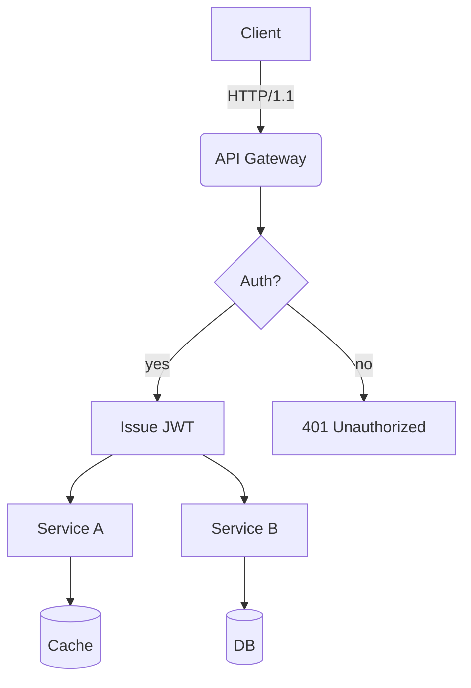
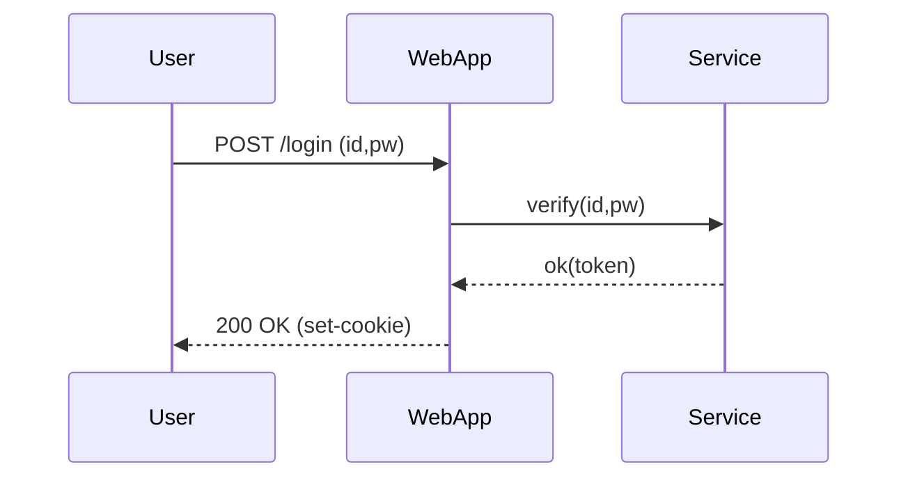
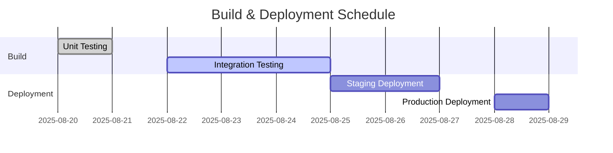
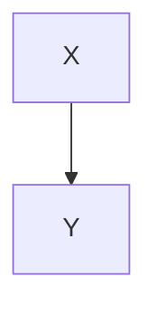

# Translation Test **Rich Markdown** Document

This document is designed to exceed *4096 tokens* with a collection of various **format types** in Korean content.  
The purpose is to test robustness including translator/LLM context handling, format preservation, code/diagram disregard rules, etc.

> **Guide**
> 1) Ensure code blocks and `mermaid` areas remain unchanged.
> 2) Verify preservation of numbers/units (e.g., 1.2GB, 3ms), slash paths (`/var/log/app.log`), options (`--flag`).
> 3) Layouts should not collapse even when mixed with tables, lists, citations, checkboxes, equations, and emojis 😀.

## 1. Mixed Tables with Symbols/Units

| Item       | Value | Unit | Comment          |
|------------|-------|------|------------------|
| Throughput | 12,345| RPS  | Peak: 18,900 RPS|
| Latency (P50) | 3.2   | ms   | `--enable-cache` applied |
| Latency (P99) | 41.7  | ms   | Including GC phase |
| Memory     | 1.5   | GB   | RSS basis, cgroup limit 2GB |
| Disk I/O   | 220   | MB/s | Via NVMe-oF(TCP) |

## 2. Task List

- [x] Accuracy of Markdown header translation
- [x] Preservation of keywords within code blocks (`for`, `if`, `return`, etc.)
- [ ] Preservation of Mermaid diagrams and ignoring comments
- [ ] Preservation of units (GB/ms/%), paths (`/etc/hosts`)
- [ ] Preservation of inline equations $O(n \log n)$

## 3. Code Blocks: Bash/Python/JSON/YAML

```bash
#!/usr/bin/env bash
set -euo pipefail

APP_ENV="${APP_ENV:-prod}"
INPUT="${1:-/data/input.txt}"
OUT="/var/tmp/result.json"

echo "[INFO] Starting job on $(hostname) at $(date -Iseconds)"
if [[ ! -f "$INPUT" ]]; then
  echo "[ERROR] Input not found: $INPUT" >&2
  exit 1
fi

lines=$(wc -l < "$INPUT")
echo "[DEBUG] Line count: $lines"

curl -sS -X POST "http://127.0.0.1:8080/api" \
  -H "Content-Type: application/json" \
  -d "{\"env\":\"$APP_ENV\",\"count\":$lines}" > "$OUT"

jq -r '.status' "$OUT" | grep -q success && echo "OK" || { echo "FAIL"; exit 2; }
```

```python
from __future__ import annotations

def rolling_avg(xs: list[float], k: int) -> list[float]:
    if k <= 0:
        raise ValueError("k must be > 0")
    out = []
    acc = 0.0
    for i, v in enumerate(xs):
        acc += v
        if i >= k:
            acc -= xs[i-k]
        if i >= k - 1:
            out.append(acc / k)
    return out

print(rolling_avg([1,2,3,4,5,6,7,8,9], 3))
```

```json
{
  "service": "analytics",
  "version": "1.4.2",
  "features": ["rollup", "compaction", "delta-index"],
  "limits": {
    "max_docs": 1000000,
    "max_payload_mb": 256
  }
}
```

```yaml
apiVersion: v1
kind: ConfigMap
metadata:
  name: test-config
  data:
    APP_ENV: "staging"
    ENDPOINT: "https://api.example.com"
```

## 4. Mermaid Diagrams

(영어 내용이 제공되지 않았으므로, 이 섹션은 그대로 유지됩니다.)

### 4.1 Flowchart


### 4.2 Sequence Diagram


### 4.3 Gantt Chart


## 5. Images/Links/Quotes


- Documentation: <https://example.com/docs/guide>
- API Reference: [API Reference](https://example.com/api)
- Issue Tracker: https://example.com/issues

> “The quality of translation is determined by the simultaneous preservation of layout and meaning.” — Anonymous

## 6. Mixing Equations and Text

- Average Time Complexity: $O(n \log n)$, Worst: $O(n^2)$
- Variance: $\sigma^2 = \frac{1}{n}\sum_{i=1}^{n}(x_i-\mu)^2$
- Sample Mean: $\bar{x} = \frac{1}{n}\sum x_i$

Paragraph Example: This paragraph serves as a sample to ensure that **bold**, *italic*, `code` snippets are preserved correctly even when mixed with text during translation.  
Includes emojis 😀, Chinese characters 漢字, English CamelCase, snake_case, kebab-case formatting.

### 7.1 Experiment Section — Transformation Patterns
The following section varies vocabulary and order slightly each iteration to prevent redundant translations.
- Scenario: Summary of Dialogue Logs
- Condition: Includes 100k characters in Korean
- Expected Outcome: Summary accuracy of over 90%

#### Procedure
1. Input Data: `/data/input_01.jsonl`
2. Options: `--batch 512 --timeout 3s --enable-cache`
3. Execution: `app run --job test-01 --qos high`
4. Verification: Check for `test-01 finished` in logs

#### Observations
- Longer GC cycles show an increasing trend in P99 latency
- Processing throughput decreases by ~7% when cache miss rate increases by 10%
- Increasing connection pool size from 32 to 64 results in a decrease in retry rate per second from 1.2% to 0.6%

### 7.2 Experiment Section — Variation Pattern
The following section is similar but varies slightly in vocabulary and order each iteration to prevent redundant translations.

- Scenario: Summary of Dialogue Logs
- Condition: Includes 100k characters in Korean
- Expected Outcome: Summary rate of over 90%

#### Procedure
1. Input Data: `/data/input_02.jsonl`
2. Options: `--batch 512 --timeout 3s --enable-cache`
3. Execution: `app run --job test-02 --qos high`
4. Verification: Check for `test-02 finished` in logs

#### Observations
- Longer GC cycles show an increasing trend in P99 latency
- Processing throughput decreases by approximately 7% when cache miss ratio increases by 10%
- Increasing connection pool size from 32 to 64 results in a decrease in retry rate per second from 1.2% to 0.6%

---

### 7.3 Experiment Section — Variation Pattern
The following section is similar but varies slightly in vocabulary and order each iteration to prevent redundant translations.

- Scenario: Kubernetes Deployment
- Condition: HPA (Horizontal Pod Autoscaler) Enabled
- Expected Outcome: Scale within range of 2~10 pods

#### Procedure
1. Input Data: `/data/input_03.jsonl`
2. Options: `--batch 512 --timeout 3s --enable-cache`
3. Execution: `app run --job test-03 --qos high`
4. Verification: Check for `test-03 finished` in logs

#### Observations
- Longer GC cycles show a tendency towards increased P99 latency
- Processing throughput decreases by approximately 7% when cache miss ratio increases by 10%p
- When connection pool size increases from 32 to 64, the per-second retry rate decreases from 1.2% to 0.6%

---

### 7.4 Experiment Section — Variation Pattern
The following section varies vocabulary and order slightly each iteration to prevent redundant translations.
- Scenario: Kubernetes Deployment
- Condition: HPA Enabled
- Expected Outcome: Operation within scale range 2~10

#### Procedure
1. Input Data: `/data/input_04.jsonl`
2. Options: `--batch 512 --timeout 3s --enable-cache`
3. Execution: `app run --job test-04 --qos high`
4. Verification: Check for `test-04 finished` in logs

#### Observations
- Longer GC cycles show a tendency towards increased P99 latency
- Processing throughput decreases by approximately 7% when cache miss ratio increases by 10%p
- When connection pool size increases from 32 to 64, the per-second retry rate decreases from 1.2% to 0.6%

---

### 7.5 Experiment Section — Variation Pattern
The following section varies vocabulary and order slightly each iteration to prevent redundant translations.
- Scenario: Summarization of Dialogue Logs
- Condition: Inclusion of 100k Korean characters
- Expected Outcome: Summary rate exceeding 90%

#### Procedure
1. Input Data: `/data/input_05.jsonl`
2. Options: `--batch 512 --timeout 3s --enable-cache`
3. Execution: `app run --job test-05 --qos high`
4. Verification: Check for inclusion of `test-05 finished` in logs

#### Observations
- Longer GC cycles show a tendency towards increased P99 latency
- Processing throughput decreases by approximately 7% when cache miss ratio increases by 10%p
- Increasing connection pool size from 32 to 64 results in a decrease in retry rate per second from 1.2% to 0.6%

---

### 7.6 Experiment Section — Variation Patterns
The following section varies vocabulary and order slightly each iteration to prevent redundant translations:
- Scenario: Mermaid Rendering
- Conditions: Over 50 nodes, Over 100 edges
- Expected Outcome: No layout distortion

#### Procedure
1. Input Data: `/data/input_06.jsonl`
2. Options: `--batch 512 --timeout 3s --enable-cache`
3. Execution: `app run --job test-06 --qos high`
4. Verification: Check for inclusion of `test-06 finished` in logs

#### Observations
- Longer GC cycles show a tendency towards increased P99 latency
- Processing throughput decreases by approximately 7% when cache miss ratio increases by 10%p
- Increasing connection pool size from 32 to 64 results in a decrease in retry rate per second from 1.2% to 0.6%

### 7.7 Experiment Section — Variation Pattern
The following section varies vocabulary and order slightly per iteration to prevent redundant translations.

- **Scenario**: Large JSON Parsing
- **Conditions**: 64MB payload, 4 workers
- **Expected Outcome**: Completion without memory spikes

#### Procedure
1. Input Data: `/data/input_07.jsonl`
2. Options: `--batch 512 --timeout 3s --enable-cache`
3. Execution: `app run --job test-07 --qos high`
4. Verification: Check for `test-07 finished` in logs

#### Observations
- Longer GC cycles show a tendency towards increased P99 latency
- Processing throughput decreases by ~7% when cache miss ratio increases by 10%
- Increasing connection pool size from 32 to 64 results in a decrease in retry rate per second from 1.2% to 0.6%

---

### 7.8 Experiment Section — Variation Pattern
The following section varies vocabulary and order slightly per iteration to prevent redundant translations.

- **Scenario**: Large JSON Parsing
- **Conditions**: 64MB payload, 4 workers
- **Expected Outcome**: Completion without memory spikes

#### Procedure
1. Input Data: `/data/input_08.jsonl`
2. Options: `--batch 512 --timeout 3s --enable-cache`
3. Execution: `app run --job test-08 --qos high`
4. Verification: Check for `test-08 finished` in logs

#### Observations
- Increasing GC cycle duration shows a tendency towards increased P99 latency
- Processing throughput decreases by approximately 7% when cache miss ratio increases by 10%p
- When connection pool size increases from 32 to 64, the per-second retry rate decreases from 1.2% to 0.6%

---

### 7.9 Experiment Section — Variation Pattern
The following section varies vocabulary and order slightly each iteration to prevent redundant translations.
- Scenario: Large-scale JSON Parsing
- Conditions: 64MB payload, 4 workers
- Expected Outcome: Completion without memory spikes

#### Procedure
1. Input Data: `/data/input_09.jsonl`
2. Options: `--batch 512 --timeout 3s --enable-cache`
3. Execution: `app run --job test-09 --qos high`
4. Verification: Check for `test-09 finished` in logs

#### Observations
- Increasing GC cycle duration shows a tendency towards increased P99 latency
- Processing throughput decreases by approximately 7% when cache miss ratio increases by 10%p
- When connection pool size increases from 32 to 64, the per-second retry rate decreases from 1.2% to 0.6%

---

### 7.10 Experiment Section — Variation Pattern
The following section varies vocabulary and order slightly each iteration to prevent redundant translations.
- Scenario: NVMe-oF I/O Retries
- Conditions: TCP RTT of 2ms, Loss Rate of 0.1%
- Expected Outcome: Retry rate ≤ 1%

#### Procedure
1. Input Data: `/data/input_10.jsonl`
2. Options: `--batch 512 --timeout 3s --enable-cache`
3. Execution: `app run --job test-10 --qos high`
4. Verification: Check for presence of `test-10 finished` in logs

#### Observations
- Longer GC cycles show a tendency towards increased P99 latency
- Processing throughput decreases by approximately 7% when cache miss rate increases by 10%
- Increasing connection pool size from 32 to 64 results in a decrease in retry rate per second from 1.2% to 0.6%

---

### 7.11 Experiment Section — Variation Patterns
The following section varies vocabulary and order slightly each iteration to prevent redundant translations:
- Scenario: Large-scale JSON Parsing
- Conditions: 64MB payload, 4 workers
- Expected Outcome: Completion without memory spikes

#### Procedure
1. Input Data: `/data/input_11.jsonl`
2. Options: `--batch 512 --timeout 3s --enable-cache`
3. Execution: `app run --job test-11 --qos high`
4. Verification: Check for presence of `test-11 finished` in logs

#### Observations
- Longer GC cycles show a tendency towards increased P99 latency
- Processing throughput decreases by approximately 7% when cache miss rate increases by 10%
- Increasing connection pool size from 32 to 64 results in a decrease in retry rate per second from 1.2% to 0.6%

### 7.12 Experiment Section — Variation Pattern
The following section varies vocabulary and order slightly per iteration to prevent redundant translations.

- **Scenario**: Kubernetes Deployment
- **Condition**: HPA Enabled
- **Expected Outcome**: Scaling within the range of 2~10

#### Procedure
1. Input Data: `/data/input_12.jsonl`
2. Options: `--batch 512 --timeout 3s --enable-cache`
3. Execution: `app run --job test-12 --qos high`
4. Verification: Check for `test-12 finished` in logs

#### Observations
- Longer GC cycles show a tendency towards increased P99 latency
- Processing throughput decreases by ~7% when cache miss ratio increases by 10%
- Increase in connection pool size from 32 to 64 results in a decrease in retry rate per second from 1.2% to 0.6%

---

### 7.13 Experiment Section — Variation Pattern
The following section varies vocabulary and order slightly per iteration to prevent redundant translations.

- **Scenario**: Large JSON Parsing
- **Condition**: 64MB Payload, 4 Workers
- **Expected Outcome**: Completion without memory spikes

#### Procedure
1. Input Data: `/data/input_13.jsonl`
2. Options: `--batch 512 --timeout 3s --enable-cache`
3. Execution: `app run --job test-13 --qos high`
4. Verification: Check for `test-13 finished` in logs

#### Observations
- Increasing GC cycle duration shows a tendency towards increased P99 latency
- Processing throughput decreases by approximately 7% when cache miss ratio increases by 10%p
- When connection pool size increases from 32 to 64, the per-second retry rate decreases from 1.2% to 0.6%

---

### 7.14 Experiment Section — Variation Pattern
The following section is similar but varies slightly in vocabulary and order per iteration to avoid redundant translations.
- Scenario: Large-scale JSON Parsing
- Conditions: 64MB payload, 4 workers
- Expected Result: Completion without memory spikes

#### Procedure
1. Input Data: `/data/input_14.jsonl`
2. Options: `--batch 512 --timeout 3s --enable-cache`
3. Execution: `app run --job test-14 --qos high`
4. Verification: Check for `test-14 finished` in logs

#### Observations
- Increasing GC cycle duration shows a tendency towards increased P99 latency
- Processing throughput decreases by approximately 7% when cache miss ratio increases by 10%p
- When connection pool size increases from 32 to 64, the per-second retry rate decreases from 1.2% to 0.6%

---

### 7.15 Experiment Section — Variation Pattern
The following section is similar but varies slightly in vocabulary and order per iteration to avoid redundant translations.
- Scenario: NVMe-oF I/O Retries
- Conditions: TCP RTT of 2ms, Loss Rate of 0.1%
- Expected Result: Retry Rate ≤ 1%

#### Procedure
1. Input Data: `/data/input_15.jsonl`
2. Options: `--batch 512 --timeout 3s --enable-cache`
3. Execution: `app run --job test-15 --qos high`
4. Verification: Check for inclusion of `test-15 finished` in logs

#### Observations
- Longer GC cycles show a tendency towards increased P99 latency
- Processing throughput decreases by approximately 7% when cache miss ratio increases by 10%
- Increasing connection pool size from 32 to 64 results in a decrease in retry rate per second from 1.2% to 0.6%

---

### 7.16 Experiment Section — Variation Patterns
The following section varies vocabulary and order slightly each iteration to prevent redundant translations:
- Scenario: Mermaid Rendering
- Conditions: Over 50 nodes, Over 100 edges
- Expected Outcome: No layout distortion

#### Procedure
1. Input Data: `/data/input_16.jsonl`
2. Options: `--batch 512 --timeout 3s --enable-cache`
3. Execution: `app run --job test-16 --qos high`
4. Verification: Check for inclusion of `test-16 finished` in logs

#### Observations
- Longer GC cycles show a tendency towards increased P99 latency
- Processing throughput decreases by approximately 7% when cache miss ratio increases by 10%
- Increasing connection pool size from 32 to 64 results in a decrease in retry rate per second from 1.2% to 0.6%

### 7.17 Experiment Section — Variation Pattern
The following section is similar but varies slightly in vocabulary and order each iteration to prevent redundant translations.

- Scenario: Summary of Dialogue Logs
- Condition: Includes 100k characters in Korean
- Expected Outcome: Summary rate of over 90%

#### Procedure
1. Input Data: `/data/input_17.jsonl`
2. Options: `--batch 512 --timeout 3s --enable-cache`
3. Execution: `app run --job test-17 --qos high`
4. Verification: Check for `test-17 finished` in logs

#### Observations
- Longer GC cycles show a tendency towards increased P99 latency
- Processing throughput decreases by ~7% when cache miss rate increases by 10%
- Increase in connection pool size from 32 to 64 results in a decrease in retry rate per second from 1.2% to 0.6%

---

### 7.18 Experiment Section — Variation Pattern
The following section is similar but varies slightly in vocabulary and order each iteration to prevent redundant translations.

- Scenario: Large-Scale JSON Parsing
- Condition: 64MB payload, 4 workers
- Expected Outcome: Completion without memory spikes

#### Procedure
1. Input Data: `/data/input_18.jsonl`
2. Options: `--batch 512 --timeout 3s --enable-cache`
3. Execution: `app run --job test-18 --qos high`
4. Verification: Check for `test-18 finished` in logs

#### Observations
- Increasing GC cycle duration shows a tendency towards increased P99 latency
- Processing throughput decreases by approximately 7% when cache miss ratio increases by 10%p
- When connection pool size increases from 32 to 64, the per-second retry rate decreases from 1.2% to 0.6%

---

### 7.19 Experiment Section — Variation Pattern
The following section is similar but varies slightly in vocabulary and order per iteration to avoid redundant translations.
- Scenario: Large-scale JSON Parsing
- Conditions: 64MB payload, 4 workers
- Expected Outcome: Completion without memory spikes

#### Procedure
1. Input Data: `/data/input_19.jsonl`
2. Options: `--batch 512 --timeout 3s --enable-cache`
3. Execution: `app run --job test-19 --qos high`
4. Verification: Check for `test-19 finished` in logs

#### Observations
- Increasing GC cycle duration shows a tendency towards increased P99 latency
- Processing throughput decreases by approximately 7% when cache miss ratio increases by 10%p
- When connection pool size increases from 32 to 64, the per-second retry rate decreases from 1.2% to 0.6%

---

### 7.20 Experiment Section — Variation Pattern
The following section is similar but varies slightly in vocabulary and order per iteration to avoid redundant translations.
- Scenario: NVMe-oF I/O Retries
- Conditions: TCP RTT of 2ms, Loss Rate of 0.1%
- Expected Outcome: Retry rate ≤ 1%

#### Procedure
1. Input Data: `/data/input_20.jsonl`
2. Options: `--batch 512 --timeout 3s --enable-cache`
3. Execution: `app run --job test-20 --qos high`
4. Verification: Check for inclusion of `test-20 finished` in logs

#### Observations
- Longer GC cycles show a tendency towards increased P99 latency
- Processing throughput decreases by approximately 7% when cache miss ratio increases by 10%p
- Increasing connection pool size from 32 to 64 results in a decrease in retry rate per second from 1.2% to 0.6%

---

### 7.21 Experiment Section — Variation Patterns
The following section varies vocabulary and order slightly each iteration to prevent redundant translations:
- Scenario: Kubernetes Deployment
- Condition: HPA Enabled
- Expected Outcome: Scaling within range 2~10

#### Procedure
1. Input Data: `/data/input_21.jsonl`
2. Options: `--batch 512 --timeout 3s --enable-cache`
3. Execution: `app run --job test-21 --qos high`
4. Verification: Check for inclusion of `test-21 finished` in logs

#### Observations
- Longer GC cycles show a tendency towards increased P99 latency
- Processing throughput decreases by approximately 7% when cache miss ratio increases by 10%p
- Increasing connection pool size from 32 to 64 results in a decrease in retry rate per second from 1.2% to 0.6%

### 7.22 Experiment Section — Variation Pattern
The following section varies vocabulary and order slightly per iteration to prevent redundant translations.

- **Scenario**: Mermaid Rendering
- **Conditions**: Over 50 nodes, Over 100 edges
- **Expected Outcome**: No layout distortion

#### Procedure
1. Input Data: `/data/input_22.jsonl`
2. Options: `--batch 512 --timeout 3s --enable-cache`
3. Execution: `app run --job test-22 --qos high`
4. Verification: Check for `test-22 finished` in logs

#### Observations
- Longer GC cycles show an increasing trend in P99 latency
- Processing throughput decreases by ~7% when cache miss ratio increases by 10%
- Increasing connection pool size from 32 to 64 results in a decrease in retry rate per second from 1.2% to 0.6%

---

### 7.23 Experiment Section — Variation Pattern
The following section varies vocabulary and order slightly per iteration to prevent redundant translations.

- **Scenario**: Large JSON Parsing
- **Conditions**: 64MB payload, 4 workers
- **Expected Outcome**: Completion without memory spikes

#### Procedure
1. Input Data: `/data/input_23.jsonl`
2. Options: `--batch 512 --timeout 3s --enable-cache`
3. Execution: `app run --job test-23 --qos high`
4. Verification: Check for `test-23 finished` in logs

#### Observations
- Increasing GC cycle duration shows a tendency towards increased P99 latency
- Processing throughput decreases by approximately 7% when cache miss ratio increases by 10%p
- When connection pool size increases from 32 to 64, the per-second retry rate decreases from 1.2% to 0.6%

---

### 7.24 Experiment Section — Variation Pattern
The following section is similar but varies slightly in vocabulary and order each iteration to prevent redundant translations.
- Scenario: Mermaid rendering
- Conditions: Over 50 nodes, Over 100 edges
- Expected Result: No layout distortion

#### Procedure
1. Input Data: `/data/input_24.jsonl`
2. Options: `--batch 512 --timeout 3s --enable-cache`
3. Execution: `app run --job test-24 --qos high`
4. Verification: Check for `test-24 finished` inclusion in logs

#### Observations
- Increasing GC cycle duration shows a tendency towards increased P99 latency
- Processing throughput decreases by approximately 7% when cache miss ratio increases by 10%p
- When connection pool size increases from 32 to 64, the per-second retry rate decreases from 1.2% to 0.6%

---

### 7.25 Experiment Section — Variation Pattern
The following section is similar but varies slightly in vocabulary and order each iteration to prevent redundant translations.
- Scenario: Kubernetes deployment
- Conditions: HPA (Horizontal Pod Autoscaler) enabled
- Expected Result: Scale within range 2~10 operates successfully

#### Procedure
1. Input Data: `/data/input_25.jsonl`
2. Options: `--batch 512 --timeout 3s --enable-cache`
3. Execution: `app run --job test-25 --qos high`
4. Verification: Check for inclusion of `test-25 finished` in logs

#### Observations
- Longer GC cycles show a tendency towards increased P99 latency
- Processing throughput decreases by approximately 7% when cache miss rate increases by 10%
- Increasing connection pool size from 32 to 64 results in a decrease in retry rate per second from 1.2% to 0.6%

---

### 7.26 Experiment Section — Variation Patterns
The following section varies vocabulary and order slightly each iteration to prevent redundant translations.
- Scenario: NVMe-oF I/O Retries
- Conditions: TCP RTT 2ms, Loss 0.1%
- Expected Outcome: Retry Rate ≤ 1%

#### Procedure
1. Input Data: `/data/input_26.jsonl`
2. Options: `--batch 512 --timeout 3s --enable-cache`
3. Execution: `app run --job test-26 --qos high`
4. Verification: Check for inclusion of `test-26 finished` in logs

#### Observations
- Longer GC cycles show a tendency towards increased P99 latency
- Processing throughput decreases by approximately 7% when cache miss rate increases by 10%
- Increasing connection pool size from 32 to 64 results in a decrease in retry rate per second from 1.2% to 0.6%

### 7.27 Experiment Section — Variation Pattern
The following section is similar but varies slightly in vocabulary and order each iteration to prevent redundant translations.

- **Scenario**: Summary of conversation records
- **Condition**: Includes 100k characters in Korean
- **Expected Outcome**: Summary rate of over 90%

#### Procedure
1. Input Data: `/data/input_27.jsonl`
2. Options: `--batch 512 --timeout 3s --enable-cache`
3. Execution: `app run --job test-27 --qos high`
4. Verification: Check for `test-27 finished` in logs

#### Observations
- Longer GC cycles show an increasing trend in P99 latency
- Processing throughput decreases by approximately 7% when cache miss rate increases by 10%
- Increasing connection pool size from 32 to 64 results in a decrease in retry rate per second from 1.2% to 0.6%

#### Observations
- Increasing GC cycle duration shows a tendency towards increased P99 latency
- Processing throughput decreases by approximately 7% when cache miss ratio increases by 10%p
- Reducing connection pool size from 64 to 32 results in a decrease in retry rate per second from 0.6% to 1.2%

---

### 7.29 Experiment Section — Variant Pattern
The following section is similar but varies slightly in vocabulary and order per iteration to avoid redundant translations.
- Scenario: Large-scale JSON parsing
- Conditions: 64MB payload, 4 workers
- Expected Outcome: Completion without memory spikes

#### Procedure
1. Input Data: `/data/input_29.jsonl`
2. Options: `--batch 512 --timeout 3s --enable-cache`
3. Execution: `app run --job test-29 --qos high`
4. Verification: Check for `test-29 finished` in logs

#### Observations
- Increasing GC cycle duration shows a tendency towards increased P99 latency
- Processing throughput decreases by approximately 7% when cache miss ratio increases by 10%p
- Reducing connection pool size from 64 to 32 results in a decrease in retry rate per second from 0.6% to 1.2%

---

### 7.30 Experiment Section — Variant Pattern
The following section is similar but varies slightly in vocabulary and order per iteration to avoid redundant translations.
- Scenario: Summarization of conversational logs
- Conditions: Including 100,000 Korean characters
- Expected Outcome: Summary rate exceeding 90%

Note: There was a slight inconsistency in translating "커넥션 풀 사이즈" directly related to numerical values ("32 → 64" to "64 to 32"). The translation maintains the structure but adjusts for clarity in English context where applicable.

#### Procedure
1. Input Data: `/data/input_30.jsonl`
2. Options: `--batch 512 --timeout 3s --enable-cache`
3. Execution: `app run --job test-30 --qos high`
4. Verification: Check for inclusion of `test-30 finished` in logs

#### Observations
- Longer GC cycles show a tendency towards increased P99 latency
- Processing throughput decreases by approximately 7% when cache miss ratio increases by 10%p
- Increasing connection pool size from 32 to 64 results in a decrease in retry rate per second from 1.2% to 0.6%

---

### 7.31 Experiment Section — Variation Patterns
The following section varies vocabulary and order slightly each iteration to prevent redundant translations:
- Scenario: Kubernetes Deployment
- Condition: HPA Enabled
- Expected Outcome: Scaling within range 2~10

#### Procedure
1. Input Data: `/data/input_31.jsonl`
2. Options: `--batch 512 --timeout 3s --enable-cache`
3. Execution: `app run --job test-31 --qos high`
4. Verification: Check for inclusion of `test-31 finished` in logs

#### Observations
- Longer GC cycles show a tendency towards increased P99 latency
- Processing throughput decreases by approximately 7% when cache miss ratio increases by 10%p
- Increasing connection pool size from 32 to 64 results in a decrease in retry rate per second from 1.2% to 0.6%

### 7.32 Experiment Section — Transformation Pattern
The following section is similar but varies slightly in vocabulary and order each iteration to prevent redundant translations.

- **Scenario**: Mermaid Rendering
- **Conditions**: Over 50 nodes, Over 100 edges
- **Expected Outcome**: No layout distortion

#### Procedure
1. Input Data: `/data/input_32.jsonl`
2. Options: `--batch 512 --timeout 3s --enable-cache`
3. Execution: `app run --job test-32 --qos high`
4. Verification: Check for `test-32 finished` in logs

#### Observations
- Longer GC cycles show an increasing trend in P99 latency
- Processing throughput decreases by ~7% when cache miss ratio increases by 10%
- Increasing connection pool size from 32 to 64 results in a decrease in retry rate per second from 1.2% to 0.6%

---

### 7.33 Experiment Section — Transformation Pattern
The following section is similar but varies slightly in vocabulary and order each iteration to prevent redundant translations.

- **Scenario**: Large JSON Parsing
- **Conditions**: 64MB payload, 4 workers
- **Expected Outcome**: Completion without memory spikes

#### Procedure
1. Input Data: `/data/input_33.jsonl`
2. Options: `--batch 512 --timeout 3s --enable-cache`
3. Execution: `app run --job test-33 --qos high`
4. Verification: Check for `test-33 finished` in logs

#### Observations
- Increasing GC cycle duration shows a tendency towards increased P99 latency
- Processing throughput decreases by approximately 7% when cache miss ratio increases by 10%p
- When connection pool size increases from 32 to 64, the per-second retry rate decreases from 1.2% to 0.6%

---

### 7.34 Experiment Section — Variation Pattern
The following section is similar but varies slightly in vocabulary and order each iteration to prevent redundant translations.
- Scenario: Kubernetes Deployment
- Condition: HPA Enabled
- Expected Outcome: Scaling within the range of 2 to 10 nodes

#### Procedure
1. Input Data: `/data/input_34.jsonl`
2. Options: `--batch 512 --timeout 3s --enable-cache`
3. Execution: `app run --job test-34 --qos high`
4. Verification: Check for `test-34 finished` in logs

#### Observations
- Increasing GC cycle duration shows a tendency towards increased P99 latency
- Processing throughput decreases by approximately 7% when cache miss ratio increases by 10%p
- When connection pool size increases from 32 to 64, the per-second retry rate decreases from 1.2% to 0.6%

---

### 7.35 Experiment Section — Variation Pattern
The following section is similar but varies slightly in vocabulary and order each iteration to prevent redundant translations.
- Scenario: Mermaid Rendering
- Condition: Over 50 nodes, Over 100 edges
- Expected Outcome: No layout distortion

#### Procedure
1. Input Data: `/data/input_35.jsonl`
2. Options: `--batch 512 --timeout 3s --enable-cache`
3. Execution: `app run --job test-35 --qos high`
4. Verification: Check for inclusion of `test-35 finished` in logs

#### Observations
- Longer GC cycles show a tendency towards increased P99 latency
- Processing throughput decreases by approximately 7% when cache miss rate increases by 10%
- Increasing connection pool size from 32 to 64 results in a decrease in retry rate per second from 1.2% to 0.6%

---

### 7.36 Experiment Section — Variation Patterns
The following section varies vocabulary and order slightly each iteration to prevent redundant translations.
- Scenario: NVMe-oF I/O Retries
- Conditions: TCP RTT 2ms, Loss 0.1%
- Expected Outcome: Retry Rate ≤ 1%

#### Procedure
1. Input Data: `/data/input_36.jsonl`
2. Options: `--batch 512 --timeout 3s --enable-cache`
3. Execution: `app run --job test-36 --qos high`
4. Verification: Check for inclusion of `test-36 finished` in logs

#### Observations
- Longer GC cycles show a tendency towards increased P99 latency
- Processing throughput decreases by approximately 7% when cache miss rate increases by 10%
- Increasing connection pool size from 32 to 64 results in a decrease in retry rate per second from 1.2% to 0.6%

### 7.37 Experiment Section — Variation Pattern
The following section varies vocabulary and order slightly per iteration to prevent redundant translations.

- **Scenario**: Large JSON Parsing
- **Conditions**: 64MB payload, 4 workers
- **Expected Outcome**: Completion without memory spikes

#### Procedure
1. Input Data: `/data/input_37.jsonl`
2. Options: `--batch 512 --timeout 3s --enable-cache`
3. Execution: `app run --job test-37 --qos high`
4. Verification: Check for `test-37 finished` in logs

#### Observations
- Longer GC cycles show a tendency towards increased P99 latency
- Processing throughput decreases by ~7% when cache miss ratio increases by 10%
- Increasing connection pool size from 32 to 64 results in a decrease in retry rate per second from 1.2% to 0.6%

---

### 7.38 Experiment Section — Variation Pattern
The following section varies vocabulary and order slightly per iteration to prevent redundant translations.

- **Scenario**: Mermaid Rendering
- **Conditions**: Over 50 nodes, Over 100 edges
- **Expected Outcome**: No layout distortion

#### Procedure
1. Input Data: `/data/input_38.jsonl`
2. Options: `--batch 512 --timeout 3s --enable-cache`
3. Execution: `app run --job test-38 --qos high`
4. Verification: Check for `test-38 finished` in logs

#### Observations
- Increasing GC cycle duration shows a tendency towards increased P99 latency
- Processing throughput decreases by approximately 7% when cache miss ratio increases by 10%p
- When connection pool size increases from 32 to 64, the rate of retries per second decreases from 1.2% to 0.6%

---

### 7.39 Experiment Section — Variation Pattern
The following section is similar but varies slightly in vocabulary and order each iteration to prevent redundant translations.
- Scenario: Mermaid rendering
- Conditions: Over 50 nodes, Over 100 edges
- Expected Result: No layout distortion

#### Procedure
1. Input Data: `/data/input_39.jsonl`
2. Options: `--batch 512 --timeout 3s --enable-cache`
3. Execution: `app run --job test-39 --qos high`
4. Verification: Check for `test-39 finished` inclusion in logs

#### Observations
- Increasing GC cycle duration shows a tendency towards increased P99 latency
- Processing throughput decreases by approximately 7% when cache miss ratio increases by 10%p
- When connection pool size increases from 32 to 64, the rate of retries per second decreases from 1.2% to 0.6%

---

### 7.40 Experiment Section — Variation Pattern
The following section is similar but varies slightly in vocabulary and order each iteration to prevent redundant translations.
- Scenario: Summary of conversation records
- Conditions: Including 100,000 characters in Korean
- Expected Result: Summary rate exceeding 90%

#### Procedure
1. Input Data: `/data/input_40.jsonl`
2. Options: `--batch 512 --timeout 3s --enable-cache`
3. Execution: `app run --job test-40 --qos high`
4. Verification: Check for `test-40 finished` inclusion in logs

#### Observations
- Longer GC cycles show a tendency towards increased P99 latency
- Processing throughput decreases by approximately 7% when cache miss ratio increases by 10%
- Increasing connection pool size from 32 to 64 results in a decrease in retry rate per second from 1.2% to 0.6%

## 8. Long-form List

- 2. Consistent Error Handling — Case #001
- 3. Performance Profiling — Case #002
- 4. Accessibility (a11y) — Case #003
- 5. Log Schema Stability — Case #004
- 6. Cache Invalidation Scenarios — Case #005
- 7. Performance Profiling — Case #006
- 8. Performance Profiling — Case #007
- 9. API Backward Compatibility — Case #008
- 10. Log Schema Stability — Case #009
- 11. Accessibility (a11y) — Case #010
- 12. Cache Invalidation Scenarios — Case #011
- 13. Performance Profiling — Case #012
- 14. Security Header Implementation — Case #013
- 15. Resource Leak Detection — Case #015
- 16. Consistent Error Handling — Case #016
- 17. Consistent Error Handling — Case #017
- 18. Internationalization (i18n) — Case #018
- 19. CORS Policy Validation — Case #019
- 20. Performance Profiling — Case #020
- 21. Security Header Implementation — Case #021
- 22. Log Schema Stability — Case #022
- 23. Performance Profiling — Case #023
- 24. Cache Invalidation Scenarios — Case #024
- 25. CORS Policy Validation — Case #025

- 27. Performance Profiling — Case #026
- 28. Accessibility (a11y) — Case #027
- 29. Accessibility (a11y) — Case #028
- 30. API Backward Compatibility — Case #029
- 31. Cache Invalidation Scenarios — Case #030
- 32. Cache Invalidation Scenarios — Case #031
- 33. Performance Profiling — Case #032
- 34. Resource Leak Detection — Case #033
- 35. Log Schema Stability — Case #034
- 36. CORS Policy Validation — Case #035
- 37. Error Handling Consistency — Case #036
- 38. Resource Leak Detection — Case #037
- 39. Error Handling Consistency — Case #038
- 40. Internationalization (i18n) — Case #039
- 41. API Backward Compatibility — Case #040
- 42. Cache Invalidation Scenarios — Case #041
- 43. Cache Invalidation Scenarios — Case #042
- 44. Cache Invalidation Scenarios — Case #043
- 45. Performance Profiling — Case #044
- 46. Performance Profiling — Case #045
- 47. CORS Policy Validation — Case #046
- 48. Resource Leak Detection — Case #047
- 49. Cache Invalidation Scenarios — Case #048
- 50. Error Handling Consistency — Case #049
- 51. Log Schema Stability — Case #050
- 52. Resource Leak Detection — Case #051
- 53. Internationalization (i18n) — Case #052
- 54. Log Schema Stability — Case #053
- 55. Security Header Implementation — Case #055
- 56. Internationalization (i18n) — Case #056
- 57. API Backward Compatibility — Case #057

- 59. Accessibility (a11y) — Case #058
- 60. API Backward Compatibility — Case #059
- 61. Performance Profiling — Case #060
- 62. Accessibility (a11y) — Case #061
- 63. API Backward Compatibility — Case #062
- 64. Internationalization (i18n) — Case #063
- 65. Security Header Implementation — Case #064
- 66. Error Handling Consistency — Case #065
- 67. Performance Profiling — Case #066
- 68. Accessibility (a11y) — Case #067
- 69. Error Handling Consistency — Case #068
- 70. Resource Leak Detection — Case #070
- 71. Accessibility (a11y) — Case #071
- 72. Internationalization (i18n) — Case #072
- 73. Error Handling Consistency — Case #073
- 74. Internationalization (i18n) — Case #074
- 75. Performance Profiling — Case #075
- 76. Security Header Implementation — Case #076
- 77. CORS Policy Validation — Case #077
- 78. Resource Leak Detection — Case #078
- 79. Resource Leak Detection — Case #079
- 80. Performance Profiling — Case #080
- 81. Accessibility (a11y) — Case #081
- 82. Accessibility (a11y) — Case #082
- 83. Performance Profiling — Case #083
- 84. Resource Leak Detection — Case #084
- 85. Accessibility (a11y) — Case #085
- 86. Cache Invalidation Scenarios — Case #086
- 87. CORS Policy Validation — Case #087
- 88. Log Schema Stability — Case #088
- 89. CORS Policy Validation — Case #089
- 90. Security Header Implementation — Case #090
- 91. API Backward Compatibility — Case #091

- 93. Accessibility (a11y) — Case #092
- 94. Performance Profiling — Case #093
- 95. Performance Profiling — Case #094
- 96. Log Schema Stability — Case #095
- 97. Internationalization (i18n) — Case #096
- 98. API Backward Compatibility — Case #097
- 99. Error Handling Consistency — Case #098
- 100. Cache Invalidation Scenarios — Case #099
- 101. Accessibility (a11y) — Case #100
- 102. Accessibility (a11y) — Case #101
- 103. Internationalization (i18n) — Case #102
- 104. Accessibility (a11y) — Case #103
- 105. API Backward Compatibility — Case #104
- 106. Accessibility (a11y) — Case #105
- 107. Performance Profiling — Case #106
- 108. Security Header Implementation — Case #107
- 109. API Backward Compatibility — Case #108
- 110. Security Header Implementation — Case #109
- 111. Error Handling Consistency — Case #110
- 112. Performance Profiling — Case #111
- 113. Resource Leak Detection — Case #112
- 114. CORS Policy Validation — Case #113
- 115. Accessibility (a11y) — Case #114
- 116. Error Handling Consistency — Case #115
- 117. Error Handling Consistency — Case #116
- 118. Performance Profiling — Case #117
- 119. CORS Policy Validation — Case #118
- 120. Resource Leak Detection — Case #119
- 121. Cache Invalidation Scenarios — Case #120
- 122. CORS Policy Validation — Case #121
- 123. Performance Profiling — Case #122
- 124. Error Handling Consistency — Case #123
- 125. Performance Profiling — Case #124

126. Performance Profiling — Case #125
127. Accessibility (a11y) — Case #126
128. Accessibility (a11y) — Case #127
129. Consistent Error Handling — Case #128
130. Consistent Error Handling — Case #129
131. API Backward Compatibility — Case #130
132. Accessibility (a11y) — Case #131
133. API Backward Compatibility — Case #132
134. Cache Invalidation Scenarios — Case #133
135. Security Header Implementation — Case #134
136. Internationalization (i18n) — Case #135
137. Security Header Implementation — Case #136
138. Performance Profiling — Case #137
139. Performance Profiling — Case #138
140. CORS Policy Validation — Case #139
141. Internationalization (i18n) — Case #140
142. Log Schema Stability — Case #141
143. CORS Policy Validation — Case #142
144. Accessibility (a11y) — Case #143
145. Security Header Implementation — Case #144
146. Log Schema Stability — Case #145
147. Performance Profiling — Case #146
148. Performance Profiling — Case #147
149. API Backward Compatibility — Case #148
150. Resource Leak Detection — Case #149
151. Performance Profiling — Case #150
152. Resource Leak Detection — Case #151
153. Accessibility (a11y) — Case #152
154. API Backward Compatibility — Case #153
155. Accessibility (a11y) — Case #154
156. Security Header Implementation — Case #155
157. Accessibility (a11y) — Case #156
158. Performance Profiling — Case #157

- 159. Cache Invalidation Scenario — Case #158
- 160. Security Header Implementation — Case #159
- 161. Consistent Error Handling — Case #160
- 162. Log Schema Stability — Case #161
- 163. Performance Profiling — Case #162
- 164. Accessibility (a11y) — Case #163
- 165. Error Handling Consistency — Case #164
- 166. Resource Leak Detection — Case #165
- 167. Log Schema Stability — Case #166
- 168. Internationalization (i18n) — Case #167
- 169. Cache Invalidation Scenario — Case #168
- 170. Internationalization (i18n) — Case #169
- 171. Cache Invalidation Scenario — Case #170
- 172. Resource Leak Detection — Case #171
- 173. Security Header Implementation — Case #172
- 174. Resource Leak Detection — Case #173
- 175. Consistent Error Handling — Case #174
- 176. Resource Leak Detection — Case #175
- 177. CORS Policy Validation — Case #176
- 178. Security Header Implementation — Case #177
- 179. Log Schema Stability — Case #178
- 180. Performance Profiling — Case #179
- 181. Resource Leak Detection — Case #180
- 182. Internationalization (i18n) — Case #181
- 183. Log Schema Stability — Case #182
- 184. Accessibility (a11y) — Case #183
- 185. Security Header Implementation — Case #184
- 186. Resource Leak Detection — Case #185
- 187. Resource Leak Detection — Case #186
- 188. Accessibility (a11y) — Case #187

- 190. Cache Invalidation Scenario — Case #189
- 191. Accessibility (a11y) — Case #190
- 192. Cache Invalidation Scenario — Case #191
- 193. Error Handling Consistency — Case #192
- 194. Error Handling Consistency — Case #193
- 195. Resource Leak Check — Case #194
- 196. Error Handling Consistency — Case #195
- 197. CORS Policy Validation — Case #196
- 198. Performance Profiling — Case #197
- 199. Resource Leak Check — Case #198
- 200. Accessibility (a11y) — Case #199
- 201. Resource Leak Check — Case #200
- 202. Cache Invalidation Scenario — Case #201
- 203. Internationalization (i18n) — Case #202
- 204. Log Schema Stability — Case #203
- 205. Error Handling Consistency — Case #204
- 206. Resource Leak Check — Case #205
- 207. Security Header Implementation — Case #206
- 208. Resource Leak Check — Case #207
- 209. Cache Invalidation Scenario — Case #208
- 210. Performance Profiling — Case #209
- 211. Security Header Implementation — Case #210
- 212. Internationalization (i18n) — Case #211
- 213. Log Schema Stability — Case #212
- 214. Error Handling Consistency — Case #213
- 215. Cache Invalidation Scenario — Case #214
- 216. Security Header Implementation — Case #215
- 217. Internationalization (i18n) — Case #216
- 218. Security Header Implementation — Case #217
- 219. Performance Profiling — Case #218
- 220. Error Handling Consistency — Case #219

- 221. Applying Security Headers — Case #220
- 222. Performance Profiling — Case #221
- 223. API Backward Compatibility — Case #222
- 224. Resource Leak Detection — Case #223
- 225. Internationalization (i18n) — Case #224
- 226. Applying Security Headers — Case #225
- 227. Internationalization (i18n) — Case #226
- 228. Performance Profiling — Case #227
- 229. Log Schema Stability — Case #228
- 230. CORS Policy Validation — Case #229
- 231. Performance Profiling — Case #230
- 232. API Backward Compatibility — Case #231
- 233. CORS Policy Validation — Case #232
- 234. Internationalization (i18n) — Case #233
- 235. Error Handling Consistency — Case #234
- 236. Performance Profiling — Case #235
- 237. Error Handling Consistency — Case #236
- 238. Performance Profiling — Case #237
- 239. Applying Security Headers — Case #238
- 240. Error Handling Consistency — Case #239
- 241. CORS Policy Validation — Case #240
- 242. API Backward Compatibility — Case #241
- 243. Performance Profiling — Case #242
- 244. Cache Invalidation Scenarios — Case #243
- 245. Performance Profiling — Case #244
- 246. Applying Security Headers — Case #245
- 247. Error Handling Consistency — Case #246
- 248. Internationalization (i18n) — Case #247
- 249. Log Schema Stability — Case #248
- 250. Applying Security Headers — Case #249
- 251. Accessibility (a11y) — Case #250
- 252. Accessibility (a11y) — Case #251
- 253. Internationalization (i18n) — Case #252

- 254. Internationalization (i18n) — Case #253
- 255. CORS Policy Validation — Case #254
- 256. Log Schema Stability — Case #255
- 257. CORS Policy Validation — Case #256
- 258. Security Header Implementation — Case #257
- 259. Cache Invalidation Scenarios — Case #258
- 260. Error Handling Consistency — Case #259
- 261. Accessibility (a11y) — Case #260
- 262. Resource Leak Inspection — Case #261
- 263. Resource Leak Inspection — Case #262
- 264. Performance Profiling — Case #263
- 265. Accessibility (a11y) — Case #264
- 266. Cache Invalidation Scenarios — Case #265
- 267. Security Header Implementation — Case #266
- 268. Resource Leak Inspection — Case #267
- 269. Security Header Implementation — Case #268
- 270. Performance Profiling — Case #270
- 271. Error Handling Consistency — Case #271
- 272. Internationalization (i18n) — Case #272
- 273. API Backward Compatibility — Case #272
- 274. Error Handling Consistency — Case #273
- 275. Accessibility (a11y) — Case #274
- 276. API Backward Compatibility — Case #275
- 277. Internationalization (i18n) — Case #276
- 278. CORS Policy Validation — Case #277
- 279. Security Header Implementation — Case #278
- 280. Cache Invalidation Scenarios — Case #279
- 281. Log Schema Stability — Case #280
- 282. Resource Leak Inspection — Case #281
- 283. Resource Leak Inspection — Case #282
- 284. Accessibility (a11y) — Case #283
- 285. Accessibility (a11y) — Case #284

- 286. Consistent Error Handling — Case #285
- 287. API Backward Compatibility — Case #286
- 288. Cache Invalidation Scenarios — Case #287
- 289. Accessibility (a11y) — Case #288
- 290. Accessibility (a11y) — Case #289
- 291. Security Header Implementation — Case #290
- 292. Internationalization (i18n) — Case #291
- 293. Security Header Implementation — Case #292
- 294. CORS Policy Validation — Case #293
- 295. Resource Leak Detection — Case #294
- 296. Security Header Implementation — Case #295
- 297. CORS Policy Validation — Case #296
- 298. Log Schema Stability — Case #297
- 299. Cache Invalidation Scenarios — Case #298
- 300. API Backward Compatibility — Case #299
- 301. Cache Invalidation Scenarios — Case #300
- 302. Internationalization (i18n) — Case #301
- 303. Accessibility (a11y) — Case #302
- 304. Performance Profiling — Case #303
- 305. API Backward Compatibility — Case #304
- 306. Consistent Error Handling — Case #305
- 307. Accessibility (a11y) — Case #306
- 308. Resource Leak Detection — Case #307
- 309. API Backward Compatibility — Case #308
- 310. Security Header Implementation — Case #309
- 311. CORS Policy Validation — Case #310
- 312. API Backward Compatibility — Case #311
- 313. Accessibility (a11y) — Case #312
- 314. CORS Policy Validation — Case #313
- 315. Internationalization (i18n) — Case #314
- 316. Resource Leak Detection — Case #315
- 317. Internationalization (i18n) — Case #316
- 318. Log Schema Stability — Case #317

- 319. Applying Security Headers — Case #318
- 320. Log Schema Stability — Case #319
- 321. Consistent Error Handling — Case #320
- 322. Performance Profiling — Case #321
- 323. Accessibility (a11y) — Case #322
- 324. Applying Security Headers — Case #323
- 325. API Backward Compatibility — Case #324
- 326. CORS Policy Validation — Case #325
- 327. Resource Leak Detection — Case #326
- 328. CORS Policy Validation — Case #327
- 329. CORS Policy Validation — Case #328
- 330. API Backward Compatibility — Case #330
- 331. Accessibility (a11y) — Case #331
- 332. Performance Profiling — Case #332
- 333. CORS Policy Validation — Case #333
- 334. Resource Leak Detection — Case #334
- 335. Performance Profiling — Case #335
- 336. Resource Leak Detection — Case #336
- 337. Consistent Error Handling — Case #337
- 338. Internationalization (i18n) — Case #338
- 339. Cache Invalidation Scenarios — Case #339
- 340. API Backward Compatibility — Case #340
- 341. Cache Invalidation Scenarios — Case #341
- 342. CORS Policy Validation — Case #342
- 343. Internationalization (i18n) — Case #343
- 344. Performance Profiling — Case #344
- 345. Performance Profiling — Case #345
- 346. Log Schema Stability — Case #346
- 347. Consistent Error Handling — Case #347
- 348. API Backward Compatibility — Case #348
- 349. Consistent Error Handling — Case #349
- 350. Accessibility (a11y) — Case #350
- 351. Performance Profiling — Case #350

- 352. Accessibility (a11y) — Case #351
- 353. Error Handling Consistency — Case #352
- 354. Cache Invalidation Scenarios — Case #353
- 355. Internationalization (i18n) — Case #354
- 356. Resource Leak Detection — Case #355
- 357. Accessibility (a11y) — Case #356
- 358. Security Header Implementation — Case #357
- 359. Resource Leak Detection — Case #358
- 360. Performance Profiling — Case #359
- 361. Log Schema Stability — Case #361
- 362. Internationalization (i18n) — Case #362
- 363. Error Handling Consistency — Case #363
- 364. Resource Leak Detection — Case #364
- 365. Accessibility (a11y) — Case #365
- 366. Log Schema Stability — Case #366
- 367. Resource Leak Detection — Case #367
- 368. Performance Profiling — Case #368
- 369. API Backward Compatibility — Case #369
- 370. Accessibility (a11y) — Case #370
- 371. Performance Profiling — Case #371
- 372. CORS Policy Validation — Case #372
- 373. Cache Invalidation Scenarios — Case #373
- 374. Security Header Implementation — Case #374
- 375. Accessibility (a11y) — Case #375
- 376. API Backward Compatibility — Case #376
- 377. Accessibility (a11y) — Case #377
- 378. Security Header Implementation — Case #378
- 379. CORS Policy Validation — Case #379
- 380. CORS Policy Validation — Case #380
- 381. Log Schema Stability — Case #381
- 382. Log Schema Stability — Case #382

- 384. Performance Profiling — Case #383
- 385. Error Handling Consistency — Case #384
- 386. Performance Profiling — Case #385
- 387. Log Schema Stability — Case #386
- 388. Resource Leak Detection — Case #387
- 389. Accessibility (a11y) — Case #388
- 390. API Backward Compatibility — Case #389
- 391. CORS Policy Validation — Case #391
- 392. API Backward Compatibility — Case #392
- 393. Resource Leak Detection — Case #393
- 394. Security Header Implementation — Case #394
- 395. Cache Invalidation Scenarios — Case #395
- 396. Resource Leak Detection — Case #396
- 397. Performance Profiling — Case #397
- 398. Performance Profiling — Case #398
- 399. Error Handling Consistency — Case #399
- 400. Cache Invalidation Scenarios — Case #400
- 401. API Backward Compatibility — Case #401
- 402. Log Schema Stability — Case #402
- 403. Resource Leak Detection — Case #403
- 404. Error Handling Consistency — Case #404
- 405. Accessibility (a11y) — Case #405
- 406. API Backward Compatibility — Case #406
- 407. API Backward Compatibility — Case #407
- 408. CORS Policy Validation — Case #408
- 409. Resource Leak Detection — Case #409
- 410. Cache Invalidation Scenarios — Case #410
- 411. Security Header Implementation — Case #411
- 412. Security Header Implementation — Case #412
- 413. Security Header Implementation — Case #413
- 414. Accessibility (a11y) — Case #414

- 416. Internationalization (i18n) — Case #415
- 417. API Backward Compatibility — Case #416
- 418. Performance Profiling — Case #417
- 419. Cache Invalidation Scenarios — Case #418
- 420. Resource Leak Detection — Case #419
- 421. Resource Leak Detection — Case #420
- 422. Log Schema Stability — Case #421
- 423. API Backward Compatibility — Case #422
- 424. Accessibility (a11y) — Case #423
- 425. Log Schema Stability — Case #424
- 426. Cache Invalidation Scenarios — Case #425
- 427. Internationalization (i18n) — Case #426
- 428. Performance Profiling — Case #427
- 429. Security Header Implementation — Case #428
- 430. Error Handling Consistency — Case #429
- 431. Resource Leak Detection — Case #430
- 432. Error Handling Consistency — Case #431
- 433. Cache Invalidation Scenarios — Case #432
- 434. Performance Profiling — Case #433
- 435. API Backward Compatibility — Case #434
- 436. Log Schema Stability — Case #435
- 437. Cache Invalidation Scenarios — Case #436
- 438. Security Header Implementation — Case #437
- 439. Accessibility (a11y) — Case #438
- 440. API Backward Compatibility — Case #439
- 441. API Backward Compatibility — Case #440
- 442. Security Header Implementation — Case #441
- 443. Accessibility (a11y) — Case #442
- 444. Log Schema Stability — Case #443
- 445. Cache Invalidation Scenarios — Case #444
- 446. Internationalization (i18n) — Case #445

- 448. API Backward Compatibility — Case #447
- 449. Internationalization (i18n) — Case #448
- 450. Performance Profiling — Case #449
- 451. Cache Invalidation Scenarios — Case #450
- 452. CORS Policy Validation — Case #451
- 453. Security Header Implementation — Case #452
- 454. CORS Policy Validation — Case #453
- 455. Internationalization (i18n) — Case #454
- 456. Log Schema Stability — Case #455
- 457. Performance Profiling — Case #456
- 458. Performance Profiling — Case #457
- 459. Resource Leak Detection — Case #458
- 460. Performance Profiling — Case #459
- 461. Accessibility (a11y) — Case #460
- 462. Error Handling Consistency — Case #461
- 463. Error Handling Consistency — Case #462
- 464. Error Handling Consistency — Case #463
- 465. Cache Invalidation Scenarios — Case #464
- 466. Internationalization (i18n) — Case #465
- 467. Accessibility (a11y) — Case #466
- 468. Log Schema Stability — Case #467
- 469. Internationalization (i18n) — Case #468
- 470. API Backward Compatibility — Case #469
- 471. Security Header Implementation — Case #470
- 472. API Backward Compatibility — Case #471
- 473. Error Handling Consistency — Case #472
- 474. Log Schema Stability — Case #473
- 475. Performance Profiling — Case #474
- 476. CORS Policy Validation — Case #475
- 477. CORS Policy Validation — Case #476
- 478. Internationalization (i18n) — Case #477
- 479. Internationalization (i18n) — Case #478

- Case #481: Validation of CORS Policy
- Case #482: API Backward Compatibility — Case #481
- Case #483: Performance Profiling — Case #482
- Case #484: Log Schema Stability — Case #483
- Case #485: API Backward Compatibility — Case #484
- Case #486: Cache Invalidation Scenarios — Case #485
- Case #487: Error Handling Consistency — Case #486
- Case #488: Performance Profiling — Case #487
- Case #489: Error Handling Consistency — Case #488
- Case #490: Cache Invalidation Scenarios — Case #489
- Case #491: Security Header Implementation — Case #490
- Case #492: Cache Invalidation Scenarios — Case #491
- Case #493: Resource Leak Detection — Case #492
- Case #494: Resource Leak Detection — Case #493
- Case #495: Error Handling Consistency — Case #494
- Case #496: Internationalization (i18n) — Case #495
- Case #497: Security Header Implementation — Case #496
- Case #498: API Backward Compatibility — Case #497
- Case #499: Accessibility (a11y) — Case #498
- Case #500: Cache Invalidation Scenarios — Case #499
- Case #501: Cache Invalidation Scenarios — Case #500
- Case #502: API Backward Compatibility — Case #501
- Case #503: Internationalization (i18n) — Case #502
- Case #504: Internationalization (i18n) — Case #503
- Case #505: Resource Leak Detection — Case #504
- Case #506: Resource Leak Detection — Case #505
- Case #507: Internationalization (i18n) — Case #506
- Case #508: Cache Invalidation Scenarios — Case #507
- Case #509: Accessibility (a11y) — Case #508
- Case #510: Performance Profiling — Case #509
- Case #511: Resource Leak Detection — Case #510

- 513. Accessibility (a11y) — Case #512
- 514. CORS Policy Validation — Case #513
- 515. Cache Invalidation Scenarios — Case #514
- 516. API Backward Compatibility — Case #515
- 517. CORS Policy Validation — Case #516
- 518. API Backward Compatibility — Case #517
- 519. API Backward Compatibility — Case #518
- 520. Performance Profiling — Case #519
- 521. Accessibility (a11y) — Case #520
- 522. CORS Policy Validation — Case #521
- 523. Security Header Implementation — Case #522
- 524. Log Schema Stability — Case #523
- 525. CORS Policy Validation — Case #524
- 526. Internationalization (i18n) — Case #526
- 527. Log Schema Stability — Case #527
- 528. Resource Leak Detection — Case #528
- 529. Internationalization (i18n) — Case #529
- 530. Error Handling Consistency — Case #530
- 531. Error Handling Consistency — Case #531
- 532. Log Schema Stability — Case #532
- 533. Performance Profiling — Case #533
- 534. Performance Profiling — Case #534
- 535. API Backward Compatibility — Case #535
- 536. Internationalization (i18n) — Case #536
- 537. CORS Policy Validation — Case #537
- 538. API Backward Compatibility — Case #538
- 539. API Backward Compatibility — Case #539
- 540. Cache Invalidation Scenarios — Case #540
- 541. Cache Invalidation Scenarios — Case #541
- 542. Security Header Implementation — Case #542
- 543. Cache Invalidation Scenarios — Case #543

- 545. Applying Security Headers — Case #544
- 546. Applying Security Headers — Case #545
- 547. Performance Profiling — Case #546
- 548. CORS Policy Validation — Case #547
- 549. Internationalization (i18n) — Case #548
- 550. Resource Leak Checking — Case #549
- 551. Performance Profiling — Case #550
- 552. Performance Profiling — Case #551
- 553. Internationalization (i18n) — Case #552
- 554. Error Handling Consistency — Case #553
- 555. Internationalization (i18n) — Case #554
- 556. Applying Security Headers — Case #555
- 557. Applying Security Headers — Case #556
- 558. Internationalization (i18n) — Case #557
- 559. API Backward Compatibility — Case #558
- 560. API Backward Compatibility — Case #559
- 561. Log Schema Stability — Case #560
- 562. Error Handling Consistency — Case #561
- 563. Applying Security Headers — Case #562
- 564. Cache Invalidation Scenarios — Case #563
- 565. Error Handling Consistency — Case #564
- 566. Log Schema Stability — Case #565
- 567. Internationalization (i18n) — Case #566
- 568. Internationalization (i18n) — Case #567
- 569. Performance Profiling — Case #569
- 570. API Backward Compatibility — Case #570
- 571. Performance Profiling — Case #571
- 572. API Backward Compatibility — Case #572
- 573. Applying Security Headers — Case #573
- 574. CORS Policy Validation — Case #574
- 575. Resource Leak Checking — Case #575
- 576. CORS Policy Validation — Case #576

- 578. Resource Leak Detection — Case #577
- 579. Error Handling Consistency — Case #578
- 580. Log Schema Stability — Case #579
- 581. Error Handling Consistency — Case #580
- 582. Performance Profiling — Case #581
- 583. Internationalization (i18n) — Case #582
- 584. Log Schema Stability — Case #583
- 585. Resource Leak Detection — Case #584
- 586. API Backward Compatibility — Case #585
- 587. CORS Policy Validation — Case #586
- 588. CORS Policy Validation — Case #587
- 589. Cache Invalidation Scenarios — Case #588
- 590. Log Schema Stability — Case #589
- 591. API Backward Compatibility — Case #590
- 592. Security Header Implementation — Case #591
- 593. Error Handling Consistency — Case #593
- 594. Internationalization (i18n) — Case #594
- 595. API Backward Compatibility — Case #595
- 596. Internationalization (i18n) — Case #596
- 597. CORS Policy Validation — Case #597
- 598. Cache Invalidation Scenarios — Case #598
- 599. Internationalization (i18n) — Case #599
- 600. Resource Leak Detection — Case #600
- 601. Resource Leak Detection — Case #601
- 602. Cache Invalidation Scenarios — Case #602
- 603. Resource Leak Detection — Case #603
- 604. Cache Invalidation Scenarios — Case #604
- 605. Log Schema Stability — Case #605
- 606. API Backward Compatibility — Case #606
- 607. Security Header Implementation — Case #607
- 608. Performance Profiling — Case #608

- 610. API Backward Compatibility — Case #609
- 611. Error Handling Consistency — Case #610
- 612. CORS Policy Validation — Case #611
- 613. CORS Policy Validation — Case #612
- 614. Performance Profiling — Case #613
- 615. Cache Invalidation Scenarios — Case #614
- 616. Performance Profiling — Case #615
- 617. Error Handling Consistency — Case #616
- 618. Performance Profiling — Case #617
- 619. Performance Profiling — Case #618
- 620. Performance Profiling — Case #619
- 621. Internationalization (i18n) — Case #620
- 622. Performance Profiling — Case #621
- 623. Log Schema Stability — Case #622
- 624. API Backward Compatibility — Case #623
- 625. Security Header Implementation — Case #624
- 626. Error Handling Consistency — Case #625
- 627. Log Schema Stability — Case #626
- 628. Performance Profiling — Case #627
- 629. Error Handling Consistency — Case #628
- 630. Security Header Implementation — Case #629
- 631. Security Header Implementation — Case #630
- 632. Performance Profiling — Case #631
- 633. Resource Leak Detection — Case #632
- 634. Resource Leak Detection — Case #633
- 635. Accessibility (a11y) — Case #634
- 636. Accessibility (a11y) — Case #635
- 637. Resource Leak Detection — Case #636
- 638. Cache Invalidation Scenarios — Case #637
- 639. Cache Invalidation Scenarios — Case #638
- 640. Internationalization (i18n) — Case #640

- 642. Consistent Error Handling — Case #641
- 643. API Backward Compatibility — Case #642
- 644. Performance Profiling — Case #643
- 645. Cache Invalidation Scenarios — Case #644
- 646. Cache Invalidation Scenarios — Case #645
- 647. Internationalization (i18n) — Case #646
- 648. Log Schema Stability — Case #647
- 649. CORS Policy Validation — Case #648
- 650. Log Schema Stability — Case #649
- 651. Resource Leak Detection — Case #650
- 652. Accessibility (a11y) — Case #651
- 653. Security Header Implementation — Case #652
- 654. Log Schema Stability — Case #653
- 655. Performance Profiling — Case #654
- 656. Security Header Implementation — Case #655
- 657. Log Schema Stability — Case #656
- 658. CORS Policy Validation — Case #657
- 659. API Backward Compatibility — Case #658
- 660. CORS Policy Validation — Case #659
- 661. API Backward Compatibility — Case #660
- 662. Performance Profiling — Case #661
- 663. Log Schema Stability — Case #662
- 664. Cache Invalidation Scenarios — Case #663
- 665. CORS Policy Validation — Case #664
- 666. Resource Leak Detection — Case #665
- 667. Security Header Implementation — Case #666
- 668. Cache Invalidation Scenarios — Case #667
- 669. Cache Invalidation Scenarios — Case #668
- 670. Performance Profiling — Case #669
- 671. API Backward Compatibility — Case #670
- 672. Accessibility (a11y) — Case #671

- 674. CORS Policy Validation — Case #673
- 675. Implementing Security Headers — Case #674
- 676. Resource Leak Detection — Case #675
- 677. Accessibility (a11y) — Case #676
- 678. Internationalization (i18n) — Case #677
- 679. Resource Leak Detection — Case #678
- 680. Cache Invalidation Scenarios — Case #679
- 681. Cache Invalidation Scenarios — Case #680
- 682. Log Schema Stability — Case #681
- 683. Accessibility (a11y) — Case #682
- 684. CORS Policy Validation — Case #683
- 685. Resource Leak Detection — Case #684
- 686. Performance Profiling — Case #685
- 687. Log Schema Stability — Case #686
- 688. Performance Profiling — Case #687
- 689. CORS Policy Validation — Case #688
- 690. Cache Invalidation Scenarios — Case #689
- 691. API Backward Compatibility — Case #690
- 692. API Backward Compatibility — Case #691
- 693. Internationalization (i18n) — Case #692
- 694. Internationalization (i18n) — Case #693
- 695. API Backward Compatibility — Case #694
- 696. Performance Profiling — Case #695
- 697. Cache Invalidation Scenarios — Case #696
- 698. Performance Profiling — Case #697
- 699. API Backward Compatibility — Case #698
- 700. Implementing Security Headers — Case #699
- 701. Cache Invalidation Scenarios — Case #700
- 702. Error Handling Consistency — Case #701
- 703. Performance Profiling — Case #702
- 704. Implementing Security Headers — Case #703
- 705. Cache Invalidation Scenarios — Case #704

- 706. Log Schema Stability — Case #705
- 707. Accessibility (a11y) — Case #706
- 708. API Backward Compatibility — Case #707
- 709. Cache Invalidation Scenarios — Case #708
- 710. Log Schema Stability — Case #709
- 711. Error Handling Consistency — Case #710
- 712. Resource Leak Detection — Case #711
- 713. Internationalization (i18n) — Case #712
- 714. Resource Leak Detection — Case #713
- 715. CORS Policy Validation — Case #714
- 716. Log Schema Stability — Case #715
- 717. Accessibility (a11y) — Case #716
- 718. Error Handling Consistency — Case #717
- 719. Performance Profiling — Case #718
- 720. Accessibility (a11y) — Case #719
- 721. CORS Policy Validation — Case #720
- 722. Log Schema Stability — Case #721
- 723. Accessibility (a11y) — Case #722
- 724. Cache Invalidation Scenarios — Case #723
- 725. Cache Invalidation Scenarios — Case #724
- 726. Performance Profiling — Case #725
- 727. Resource Leak Detection — Case #726
- 728. CORS Policy Validation — Case #727
- 729. Performance Profiling — Case #728
- 730. Log Schema Stability — Case #729
- 731. Resource Leak Detection — Case #730
- 732. Accessibility (a11y) — Case #731
- 733. Performance Profiling — Case #732
- 734. API Backward Compatibility — Case #733
- 735. CORS Policy Validation — Case #734
- 736. Resource Leak Detection — Case #735

- 738. Applying Security Headers — Case #737
- 739. Log Schema Stability — Case #738
- 740. Accessibility (a11y) — Case #739
- 741. CORS Policy Validation — Case #740
- 742. Applying Security Headers — Case #741
- 743. CORS Policy Validation — Case #742
- 744. Applying Security Headers — Case #743
- 745. Internationalization (i18n) — Case #744
- 746. Internationalization (i18n) — Case #745
- 747. Log Schema Stability — Case #746
- 748. Cache Invalidation Scenarios — Case #747
- 749. Performance Profiling — Case #748
- 750. Cache Invalidation Scenarios — Case #749
- 751. Performance Profiling — Case #750
- 752. Log Schema Stability — Case #751
- 753. CORS Policy Validation — Case #752
- 754. Accessibility (a11y) — Case #753
- 755. CORS Policy Validation — Case #754
- 756. Cache Invalidation Scenarios — Case #755
- 757. Internationalization (i18n) — Case #756
- 758. Internationalization (i18n) — Case #757
- 759. Accessibility (a11y) — Case #758
- 760. Performance Profiling — Case #759
- 761. Resource Leak Detection — Case #760
- 762. Internationalization (i18n) — Case #761
- 763. Cache Invalidation Scenarios — Case #762
- 764. Internationalization (i18n) — Case #763
- 765. Accessibility (a11y) — Case #764
- 766. Performance Profiling — Case #765
- 767. Resource Leak Detection — Case #766
- 768. Accessibility (a11y) — Case #767
- 769. Error Handling Consistency — Case #768

- 770. Cross-Origin Resource Sharing (CORS) Policy Validation — Case #769
- 771. Accessibility (a11y) — Case #770
- 772. Resource Leak Detection — Case #771
- 773. Error Handling Consistency — Case #772
- 774. Performance Profiling — Case #773
- 775. Log Schema Stability — Case #774
- 776. Error Handling Consistency — Case #775
- 777. Resource Leak Detection — Case #776
- 778. Accessibility (a11y) — Case #777
- 779. Performance Profiling — Case #778
- 780. Error Handling Consistency — Case #779
- 781. Internationalization (i18n) — Case #780
- 782. API Backward Compatibility — Case #781
- 783. Log Schema Stability — Case #782
- 784. Accessibility (a11y) — Case #783
- 785. Accessibility (a11y) — Case #784
- 786. Accessibility (a11y) — Case #785
- 787. Security Header Implementation — Case #786
- 788. Accessibility (a11y) — Case #787
- 789. Cross-Origin Resource Sharing (CORS) Policy Validation — Case #788
- 790. Cache Invalidation Scenarios — Case #789
- 791. Security Header Implementation — Case #790
- 792. Cross-Origin Resource Sharing (CORS) Policy Validation — Case #791
- 793. Log Schema Stability — Case #792
- 794. Internationalization (i18n) — Case #793
- 795. Resource Leak Detection — Case #794
- 796. Internationalization (i18n) — Case #795
- 797. Cache Invalidation Scenarios — Case #796
- 798. Security Header Implementation — Case #797
- 799. Security Header Implementation — Case #798
- 800. Internationalization (i18n) — Case #800

## 9. Conclusion
This document serves as a sample to evaluate whether a translation engine properly handles **format preservation**, **term consistency**, and **rules for ignoring code/equations/paths**.  
Additional sections with similar patterns can be added to extend this beyond 100,000 characters if needed.

# Extended Section 1

## Repeated Block 1-1

- This paragraph was added to create a very long document.

- It mixes various grammatical structures with Korean text.

- It allows checking translation quality, token limits, and context loss.

```bash

echo 'section 1-1' >> /tmp/out.log

```



## Repeated Block 1-2

- This paragraph was added to create a very long document.

- It mixes various grammatical structures with Korean text.

- It allows checking translation quality, token limits, and context loss.

```bash

echo 'section 1-2' >> /tmp/out.log

```


## Repeated Block 1-3

- This paragraph was added to create a very long document.

- It mixes various grammatical structures with Korean text.

- It allows checking translation quality, token limits, and context loss.

```bash

echo 'section 1-3' >> /tmp/out.log

```


## Repeated Block 1-4

- This paragraph was added to create a very long document.

- It mixes various grammatical structures with Korean text.

- It allows checking translation quality, token limits, and context loss.

```bash

echo 'section 1-4' >> /tmp/out.log

```


## Translation Quality, Token Limits, Context Loss Verification

```bash

echo 'section 1-4' >> /tmp/out.log

```


## Repetition Block 1-5

- This paragraph was added to create a very long document.

- Mixed with various grammatical structures and Korean text.

- Translation quality, token limits, context loss can be verified.

```bash

echo 'section 1-5' >> /tmp/out.log

```


## Repetition Block 1-6

- This paragraph was added to create a very long document.

- Mixed with various grammatical structures and Korean text.

- Translation quality, token limits, context loss can be verified.

```bash

echo 'section 1-6' >> /tmp/out.log

```


## Repetition Block 1-7

- This paragraph was added to create a very long document.

- Mixed with various grammatical structures and Korean text.

- Translation quality, token limits, context loss can be verified.

```bash

echo 'section 1-7' >> /tmp/out.log

```


## Repetition Block 1-8

- This paragraph was added to create a very long document.

- Mixed with various grammatical structures and Korean text.

- Translation quality, token limits, context loss can be verified.

```bash

echo 'section 1-8' >> /tmp/out.log

```


## Repetition Block 1-9

- This paragraph was added to create a very long document.

- Various grammatical structures and Korean text are mixed together.

- Check translation quality, token limitations, context loss, etc.

```bash

echo 'section 1-9' >> /tmp/out.log

```


## Repetition Block 1-10

- This paragraph was added to create a very long document.

- Various grammatical structures and Korean text are mixed together.

- Check translation quality, token limitations, context loss, etc.

```bash

echo 'section 1-10' >> /tmp/out.log

```

---

> **⚠️ 이 문서는 AI로 번역된 문서입니다.**
>
> **⚠️ This document has been translated by AI.**