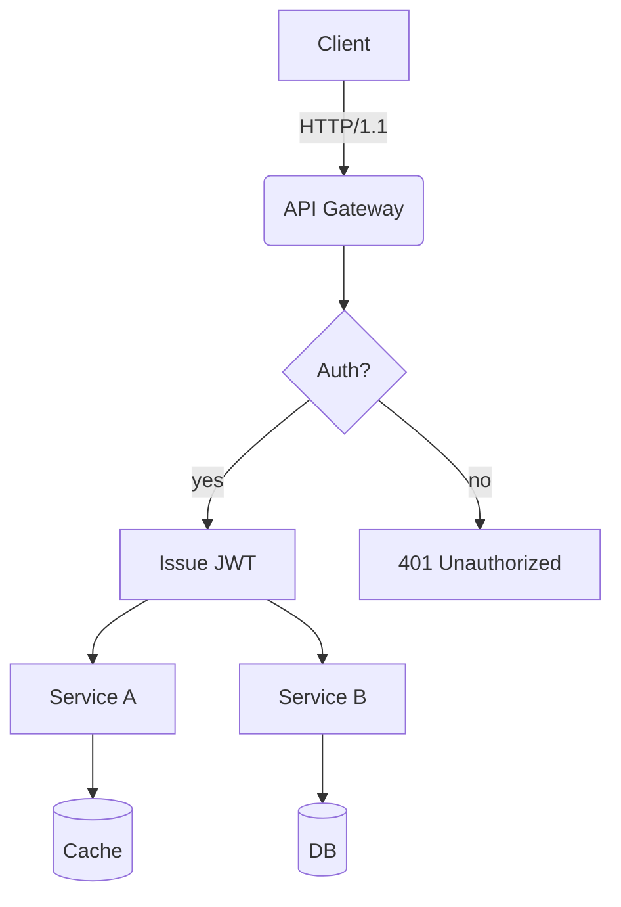
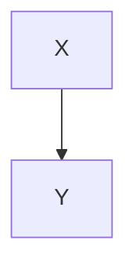

# Translation Test Document for **Rich Markdown**

This document is designed to exceed *4096 tokens* with a collection of various Korean content formats for testing **robustness** including translation engine/LLM context handling, format preservation, and rules for ignoring code/diagrams.

> **Guide**
> 1) Ensure code blocks and `mermaid` areas remain unchanged.
> 2) Verify preservation of numbers/units (e.g., 1.2GB, 3ms), slash paths (`/var/log/app.log`), and options (`--flag`).
> 3) Layouts should remain intact even with mixed tables, lists, quotations, checkboxes, equations, and emojis 😀.

## 1. Mixed Tables with Symbols/Units

| Item         | Value | Unit | Notes          |
|--------------|-------|------|----------------|
| Throughput   | 12,345| RPS  | Peak at 18,900 RPS |
| Latency (P50)| 3.2   | ms   | `--enable-cache` applied |
| Latency (P99)| 41.7  | ms   | Includes GC phase |
| Memory       | 1.5   | GB   | RSS based, cgroup limit 2GB |
| Disk I/O     | 220   | MB/s | Via NVMe-oF(TCP) |

## 2. Task List

- [x] Accuracy of Markdown header translation
- [x] Preservation of keywords within code blocks (`for`, `if`, `return`, etc.)
- [ ] Preservation of diagrams and ignoring comments for Mermaid diagrams
- [ ] Preservation of units (GB/ms/%), paths (`/etc/hosts`)
- [ ] Preservation of inline equations $O(n \log n)$

## 3. Code Blocks: Bash/Python/JSON/YAML

```bash
#!/usr/bin/env bash
set -euo pipefail

APP_ENV="${APP_ENV:-prod}"
INPUT="${1:-/data/input.txt}"
OUT="/var/tmp/result.json"

echo "[INFO] starting job on $(hostname) at $(date -Iseconds)"
if [[ ! -f "$INPUT" ]]; then
  echo "[ERROR] input not found: $INPUT" >&2
  exit 1
fi

lines=$(wc -l < "$INPUT")
echo "[DEBUG] line count: $lines"

curl -sS -X POST "http://127.0.0.1:8080/api" \  -H "Content-Type: application/json" \  -d "{"env":"$APP_ENV","count":$lines}" > "$OUT"

jq -r '.status' "$OUT" | grep -q success && echo "OK" || { echo "FAIL"; exit 2; }
```

```python
from __future__ import annotations

def rolling_avg(xs: list[float], k: int) -> list[float]:
    if k <= 0:
        raise ValueError("k must be > 0")
    out = []
    acc = 0.0
    for i, v in enumerate(xs):
        acc += v
        if i >= k:
            acc -= xs[i-k]
        if i >= k - 1:
            out.append(acc / k)
    return out

print(rolling_avg([1,2,3,4,5,6,7,8,9], 3))
```

```json
{
  "service": "analytics",
  "version": "1.4.2",
  "features": ["rollup", "compaction", "delta-index"],
  "limits": {
    "max_docs": 1000000,
    "max_payload_mb": 256
  }
}
```

```yaml
apiVersion: v1
kind: ConfigMap
metadata:
  name: test-config
data:
  APP_ENV: "staging"
  ENDPOINT: "https://api.example.com"
```

## 4. Mermaid Diagrams

### 4.1 Flowchart


### 4.2 Sequence Diagram
```mermaid
sequenceDiagram
  participant U as User
  participant W as WebApp
  participant S as Service
  U->>W: POST /login (id,pw)
  W->>S: verify(id,pw)
  S-->>W: ok(token)
  W-->>U: 200 OK (set-cookie)
## 4. Mermaid Diagrams

### 4.1 Flowchart
```mermaid
flowchart TD
  A[Client] -->|HTTP/1.1| B(API Gateway)
  B --> C{Auth?}
  C -- yes --> D[Issue JWT]
  C -- no  --> E[401 Unauthorized]
  D --> F[Service A]
  D --> G[Service B]
  F --> H[(Cache)]
  G --> I[(DB)]
```

### 4.2 Sequence Diagram
```mermaid
sequenceDiagram
  participant U as User
  participant W as WebApp
  participant S as Service
  U->>W: POST /login (id,pw)
  W->>S: verify(id,pw)
  S-->>W: ok(token)
  W-->>U: 200 OK (set-cookie)

### 4.3 Gantt Chart
```mermaid
gantt
  title Build & Deployment Schedule
  dateFormat  YYYY-MM-DD
  section Build
  Unit Testing       :done,    des1, 2025-08-20,2025-08-21
  Integration Testing :active,  des2, 2025-08-22, 3d
  section Deployment
  Staging Deployment  :         des3, after des2, 2d
  Production Deployment:         des4, 2025-08-28, 1d

## 5. Images/Links/Quotes


- Document: [https://example.com/docs/guide](https://example.com/docs/guide)
- API Reference: [API Reference](https://example.com/api)
- Issue Tracker: https://example.com/issues

> “Translation quality hinges on preserving layout and meaning simultaneously.” — Anonymous

## 6. Equations and Text

- Average Time Complexity: $O(n \log n)$, Worst: $O(n^2)$
- Variance: $\sigma^2 = \frac{1}{n}\sum_{i=1}^{n}(x_i-\mu)^2$
- Sample Mean: $\bar{x} = \frac{1}{n}\sum x_i$

Paragraph Example: This paragraph serves as a sample to ensure proper preservation of **bold**, *italic*, and `code` even when mixed within text. It includes emojis 😀, Chinese characters 漢字, CamelCase, snake_case, and kebab-case formatting.

### 7.1 Experiment Section — Variation Pattern
The following section is similar but varies slightly in vocabulary and order each iteration to prevent repetitive translations.
- Scenario: Summary of Conversation Logs
- Condition: Includes 100k characters in Korean
- Expected Outcome: Summary accuracy of over 90%

#### Procedure
1. Input Data: `/data/input_01.jsonl`
2. Options: `--batch 512 --timeout 3s --enable-cache`
3. Execution: `app run --job test-01 --qos high`
4. Verification: Check for `test-01 finished` in logs

#### Observations
- Longer GC cycles correlate with increased P99 latency
- A 10%p increase in cache misses results in approximately a 7% decrease in throughput
- Increasing connection pool size from 32 to 64 reduces per-second retry rate from 1.2% to 0.6%

---

### 7.2 Experiment Section — Variation Pattern
The following section is similar but varies slightly in vocabulary and order each iteration to prevent repetitive translations.
- Scenario: Summary of Conversation Logs
- Condition: Includes 100k characters in Korean
- Expected Outcome: Summary accuracy of over 90%

#### Procedure
1. Input Data: `/data/input_02.jsonl`
2. Options: `--batch 512 --timeout 3s --enable-cache`
3. Execution: `app run --job test-02 --qos high`
4. Verification: Check for `test-02 finished` in logs

#### Observations
- Longer GC cycles correlate with increased P99 latency
- A 10%p increase in cache misses results in approximately a 7% decrease in throughput
- Increasing connection pool size from 32 to 64 reduces per-second retry rate from 1.2% to 0.6%

---

### 7.3 Experiment Section — Variation Pattern
The following section is similar but varies slightly in vocabulary and order each iteration to prevent repetitive translations.
- Scenario: Kubernetes Deployment
- Condition: HPA Enabled
- Expected Outcome: Scale within range 2~10 operates correctly

#### Procedure
1. Input Data: `/data/input_03.jsonl`
2. Options: `--batch 512 --timeout 3s --enable-cache`
3. Execution: `app run --job test-03 --qos high`
4. Verification: Check for `test-03 finished` in logs

#### Observations
- Longer GC cycles correlate with increased P99 latency
- A 10%p increase in cache misses results in approximately a 7% decrease in throughput
- Increasing connection pool size from 32 to 64 reduces per-second retry rate from 1.2% to 0.6%

---

### 7.4 Experiment Section — Variation Pattern
The following section is similar but varies slightly in vocabulary and order each iteration to prevent repetitive translations.
- Scenario: Kubernetes Deployment
- Condition: HPA Enabled
- Expected Outcome: Scale within range 2~10 operates correctly

#### Procedure
1. Input Data: `/data/input_04.jsonl`
2. Options: `--batch 512 --timeout 3s --enable-cache`
3. Execution: `app run --job test-04 --qos high`
4. Verification: Check for `test-04 finished` in logs

#### Observations
- Longer GC cycles correlate with increased P99 latency
### 7.10 Experiment Section — Variation Pattern
The following section is similar but varies slightly in vocabulary and order each iteration to prevent repetitive translations.
- Scenario: NVMe-oF I/O Retries
- Condition: TCP RTT 2ms, Loss 0.1%
- Expected Outcome: Retry Rate ≤ 1%

#### Procedure
1. Input Data: `/data/input_10.jsonl`
2. Options: `--batch 512 --timeout 3s --enable-cache`
3. Execution: `app run --job test-10 --qos high`
4. Verification: Check for `test-10 finished` in logs

#### Observations
- Longer GC cycles correlate with increased P99 latency
- Cache miss ratio increases by 10%p, leading to ~7% decrease in throughput
- Connection pool size increase from 32 to 64 results in retry rate decreasing from 1.2% to 0.6% per second
### 7.10 Experiment Section — Variation Pattern
The following section is similar but varies slightly in vocabulary and order each iteration to prevent repetitive translation.

- Scenario: NVMe-oF I/O Retries
- Conditions: TCP RTT 2ms, Loss 0.1%
- Expected Outcome: Retry Rate ≤ 1%

#### Procedure
1. Input Data: `/data/input_10.jsonl`
2. Options: `--batch 512 --timeout 3s --enable-cache`
3. Execution: `app run --job test-10 --qos high`
4. Verification: Check for `test-10 finished` in logs

#### Observations
- Longer GC cycles correlate with increased P99 latency
- Cache miss ratio increases by 10%p, leading to ~7% decrease in throughput
- Connection pool size increase from 32 to 64 results in retry rate decreasing from 1.2% to 0.6% per second

---

### 7.11 Experiment Section — Variation Pattern
The following section is similar but varies slightly in vocabulary and order each iteration to prevent repetitive translation.

- Scenario: Large JSON Parsing
- Conditions: 64MB Payload, 4 Workers
- Expected Outcome: Completion without Memory Spike

#### Procedure
1. Input Data: `/data/input_11.jsonl`
2. Options: `--batch 512 --timeout 3s --enable-cache`
3. Execution: `app run --job test-11 --qos high`
4. Verification: Check for `test-11 finished` in logs

#### Observations
- Longer GC cycles correlate with increased P99 latency
- Cache miss ratio increases by 10%p, leading to ~7% decrease in throughput
- Connection pool size increase from 32 to 64 results in retry rate decreasing from 1.2% to 0.6% per second

---

### 7.12 Experiment Section — Variation Pattern
The following section is similar but varies slightly in vocabulary and order each iteration to prevent repetitive translation.

- Scenario: Kubernetes Deployment
- Conditions: HPA Enabled
- Expected Outcome: Scale within Range 2~10

#### Procedure
1. Input Data: `/data/input_12.jsonl`
2. Options: `--batch 512 --timeout 3s --enable-cache`
3. Execution: `app run --job test-12 --qos high`
4. Verification: Check for `test-12 finished` in logs

#### Observations
- Longer GC cycles correlate with increased P99 latency
- Cache miss ratio increases by 10%p, leading to ~7% decrease in throughput
- Connection pool size increase from 32 to 64 results in retry rate decreasing from 1.2% to 0.6% per second

---

### 7.13 Experiment Section — Variation Pattern
The following section is similar but varies slightly in vocabulary and order each iteration to prevent repetitive translation.

- Scenario: Large JSON Parsing
- Conditions: 64MB Payload, 4 Workers
- Expected Outcome: Completion without Memory Spike

#### Procedure
1. Input Data: `/data/input_13.jsonl`
2. Options: `--batch 512 --timeout 3s --enable-cache`
3. Execution: `app run --job test-13 --qos high`
4. Verification: Check for `test-13 finished` in logs

#### Observations
- Longer GC cycles correlate with increased P99 latency
- Cache miss ratio increases by 10%p, leading to ~7% decrease in throughput
- Connection pool size increase from 32 to 64 results in retry rate decreasing from 1.2% to 0.6% per second

---

### 7.14 Experiment Section — Variation Pattern
The following section is similar but varies slightly in vocabulary and order each iteration to prevent repetitive translation.

- Scenario: Large JSON Parsing
- Conditions: 64MB Payload, 4 Workers
- Expected Outcome: Completion without Memory Spike

#### Procedure
1. Input Data: `/data/input_14.jsonl`
2. Options: `--batch 512 --timeout 3s --enable-cache`
3. Execution: `app run --job test-14 --qos high`
4. Verification: Check for `test-14 finished` in logs

#### Observations
- Longer GC cycles correlate with increased P99 latency
- Cache miss ratio increases by 10%p, leading to ~7% decrease in throughput
- Connection pool size increase from 32 to 64 results in retry rate decreasing from 1.2% to 0.6% per second

---

### 7.15 Experiment Section — Variation Pattern
The following section is similar but varies slightly in vocabulary and order each iteration to prevent repetitive translation.

- Scenario: NVMe-oF I/O Retries
- Conditions: TCP RTT 2ms, Loss 0.1%
- Expected Outcome: Retry Rate ≤ 1%

#### Procedure
1. Input Data: `/data/input_15.jsonl`
2. Options: `--batch 512 --timeout 3s --enable-cache`
3. Execution: `app run --job test-15 --qos high`
4. Verification: Check for `test-15 finished` in logs

#### Observations
- Longer GC cycles correlate with increased P99 latency
### Observations
- Increased cache miss ratio by 10%p leads to approximately a 7% decrease in throughput
- Increase in connection pool size from 32 to 64 results in a decrease in retry rate per second from 1.2% to 0.6%

---

### 7.16 Experiment Section — Variation Pattern
The following section is similar but varies slightly in vocabulary and order each iteration to prevent repetitive translation.
- Scenario: Mermaid Rendering
- Conditions: 50+ nodes, 100+ edges
- Expected Outcome: No layout distortion

#### Procedure
1. Input Data: `/data/input_16.jsonl`
2. Options: `--batch 512 --timeout 3s --enable-cache`
3. Execution: `app run --job test-16 --qos high`
4. Verification: Check for `test-16 finished` in logs

#### Observations
- Longer GC cycles correlate with increased P99 latency
- Increased cache miss ratio by 10%p leads to approximately a 7% decrease in throughput
- Increase in connection pool size from 32 to 64 results in a decrease in retry rate per second from 1.2% to 0.6%

---

### 7.17 Experiment Section — Variation Pattern
The following section is similar but varies slightly in vocabulary and order each iteration to prevent repetitive translation.
- Scenario: Conversation Record Summarization
- Conditions: Including 100k characters in Korean text
- Expected Outcome: Summary rate ≥ 90%

#### Procedure
1. Input Data: `/data/input_17.jsonl`
2. Options: `--batch 512 --timeout 3s --enable-cache`
3. Execution: `app run --job test-17 --qos high`
4. Verification: Check for `test-17 finished` in logs

#### Observations
- Longer GC cycles correlate with increased P99 latency
- Increased cache miss ratio by 10%p leads to approximately a 7% decrease in throughput
- Increase in connection pool size from 32 to 64 results in a decrease in retry rate per second from 1.2% to 0.6%

---

### 7.18 Experiment Section — Variation Pattern
The following section is similar but varies slightly in vocabulary and order each iteration to prevent repetitive translation.
- Scenario: Large JSON Parsing
- Conditions: 64MB payload, 4 workers
- Expected Outcome: Completion without memory spikes

#### Procedure
1. Input Data: `/data/input_18.jsonl`
2. Options: `--batch 512 --timeout 3s --enable-cache`
3. Execution: `app run --job test-18 --qos high`
4. Verification: Check for `test-18 finished` in logs

#### Observations
- Longer GC cycles correlate with increased P99 latency
- Increased cache miss ratio by 10%p leads to approximately a 7% decrease in throughput
- Increase in connection pool size from 32 to 64 results in a decrease in retry rate per second from 1.2% to 0.6%

---

### 7.19 Experiment Section — Variation Pattern
The following section is similar but varies slightly in vocabulary and order each iteration to prevent repetitive translation.
- Scenario: Large JSON Parsing
- Conditions: 64MB payload, 4 workers
- Expected Outcome: Completion without memory spikes

#### Procedure
1. Input Data: `/data/input_19.jsonl`
2. Options: `--batch 512 --timeout 3s --enable-cache`
3. Execution: `app run --job test-19 --qos high`
4. Verification: Check for `test-19 finished` in logs

#### Observations
- Longer GC cycles correlate with increased P99 latency
- Increased cache miss ratio by 10%p leads to approximately a 7% decrease in throughput
- Increase in connection pool size from 32 to 64 results in a decrease in retry rate per second from 1.2% to 0.6%

---

### 7.20 Experiment Section — Variation Pattern
The following section is similar but varies slightly in vocabulary and order each iteration to prevent repetitive translation.
- Scenario: NVMe-oF I/O Retries
- Conditions: TCP RTT 2ms, Loss 0.1%
- Expected Outcome: Retry Rate ≤ 1%

#### Procedure
1. Input Data: `/data/input_20.jsonl`
2. Options: `--batch 512 --timeout 3s --enable-cache`
3. Execution: `app run --job test-20 --qos high`
4. Verification: Check for `test-20 finished` in logs

#### Observations
- Longer GC cycles correlate with increased P99 latency
- Increased cache miss ratio by 10%p leads to approximately a 7% decrease in throughput
- Increase in connection pool size from 32 to 64 results in a decrease in retry rate per second from 1.2% to 0.6%
### 7.26 Experiment Section — Variation Pattern
The following section is similar but varies slightly in vocabulary and order each iteration to prevent redundant translations.

- Scenario: NVMe-oF I/O Retries
- Conditions: TCP RTT 2ms, loss 0.1%
- Expected Result: Retry Rate ≤ 1%

#### Procedure
1. Input Data: `/data/input_26.jsonl`
2. Options: `--batch 512 --timeout 3s --enable-cache`
3. Execution: `app run --job test-26 --qos high`
4. Verification: Check for `test-26 finished` in logs

#### Observations
- Longer GC cycles correlate with increased P99 latency
- Increased cache miss ratio by 10%p leads to approximately a 7% decrease in throughput
### 7.32 Experiment Section — Variation Pattern
The following section is similar but varies slightly in vocabulary and order each iteration to prevent redundant translations.

- Scenario: Mermaid Rendering
- Conditions: 50+ nodes, 100+ edges
- Expected Result: No layout distortion

#### Procedure
1. Input Data: `/data/input_32.jsonl`
2. Options: `--batch 512 --timeout 3s --enable-cache`

#### Observations
- Longer GC cycles correlate with increased P99 latency
- Increased cache miss ratio by 10%p leads to approximately a 7% decrease in throughput
- Connection pool size increase from 32 to 64 results in retry rate decreasing from 1.2% to 0.6% per second
### 7.32 Experiment Section — Variation Pattern
The following section is similar but varies slightly in vocabulary and order each iteration to prevent redundant translations.
- Scenario: Mermaid Rendering
- Conditions: 50+ nodes, 100+ edges
- Expected Result: No layout distortion

#### Procedure
1. Input Data: `/data/input_32.jsonl`
2. Options: `--batch 512 --timeout 3s --enable-cache`
3. Execution: `app run --job test-32 --qos high`
4. Verification: Check if `test-32 finished` is included in the logs

#### Observations
- Longer GC cycles correlate with increased P99 latency
- A 10%p increase in cache miss ratio leads to approximately a 7% decrease in throughput
- Increasing the connection pool size from 32 to 64 results in a retry rate decreasing from 1.2% to 0.6% per second

---

### 7.33 Experiment Section — Variation Pattern
The following section is similar but varies slightly in vocabulary and order each iteration to prevent redundant translations.
- Scenario: Large JSON Parsing
- Conditions: 64MB payload, 4 workers
- Expected Result: Completion without memory spikes

#### Procedure
1. Input Data: `/data/input_33.jsonl`
2. Options: `--batch 512 --timeout 3s --enable-cache`
3. Execution: `app run --job test-33 --qos high`
4. Verification: Check if `test-33 finished` is included in the logs

#### Observations
- Longer GC cycles correlate with increased P99 latency
- A 10%p increase in cache miss ratio leads to approximately a 7% decrease in throughput
- Increasing the connection pool size from 32 to 64 results in a retry rate decreasing from 1.2% to 0.6% per second

---

### 7.34 Experiment Section — Variation Pattern
The following section is similar but varies slightly in vocabulary and order each iteration to prevent redundant translations.
- Scenario: Kubernetes Deployment
- Conditions: HPA (Horizontal Pod Autoscaler) enabled
- Expected Result: Scale within range 2~10

#### Procedure
1. Input Data: `/data/input_34.jsonl`
2. Options: `--batch 512 --timeout 3s --enable-cache`
3. Execution: `app run --job test-34 --qos high`
4. Verification: Check if `test-34 finished` is included in the logs

#### Observations
- Longer GC cycles correlate with increased P99 latency
- A 10%p increase in cache miss ratio leads to approximately a 7% decrease in throughput
- Increasing the connection pool size from 32 to 64 results in a retry rate decreasing from 1.2% to 0.6% per second

---

### 7.35 Experiment Section — Variation Pattern
The following section is similar but varies slightly in vocabulary and order each iteration to prevent redundant translations.
- Scenario: Mermaid Rendering
- Conditions: 50+ nodes, 100+ edges
- Expected Result: No layout distortion

#### Procedure
1. Input Data: `/data/input_35.jsonl`
2. Options: `--batch 512 --timeout 3s --enable-cache`
3. Execution: `app run --job test-35 --qos high`
4. Verification: Check if `test-35 finished` is included in the logs

#### Observations
- Longer GC cycles correlate with increased P99 latency
- A 10%p increase in cache miss ratio leads to approximately a 7% decrease in throughput
- Increasing the connection pool size from 32 to 64 results in a retry rate decreasing from 1.2% to 0.6% per second

---

### 7.36 Experiment Section — Variation Pattern
The following section is similar but varies slightly in vocabulary and order each iteration to prevent redundant translations.
- Scenario: NVMe-oF I/O Retries
- Conditions: TCP RTT 2ms, Loss Rate 0.1%
- Expected Result: Retry Rate ≤ 1%

#### Procedure
1. Input Data: `/data/input_36.jsonl`
2. Options: `--batch 512 --timeout 3s --enable-cache`
3. Execution: `app run --job test-36 --qos high`
4. Verification: Check if `test-36 finished` is included in the logs

#### Observations
- Longer GC cycles correlate with increased P99 latency
- A 10%p increase in cache miss ratio leads to approximately a 7% decrease in throughput
- Increasing the connection pool size from 32 to 64 results in a retry rate decreasing from 1.2% to 0.6% per second

---

### 7.37 Experiment Section — Variation Pattern
The following section is similar but varies slightly in vocabulary and order each iteration to prevent redundant translations.
- Scenario: Large JSON Parsing
- Conditions: 64MB payload, 4 workers
- Expected Result: Completion without memory spikes

#### Procedure
1. Input Data: `/data/input_37.jsonl`
2. Options: `--batch 512 --timeout 3s --enable-cache`
3. Execution: `app run --job test-37 --qos high`
4. Verification: Check if `test-37 finished` is included in the logs

#### Observations
- Longer GC cycles correlate with increased P99 latency
- A 10%p increase in cache miss ratio leads to approximately a 7% decrease in throughput
- Increasing the connection pool size from 32 to 64 results in a retry rate decreasing from 1.2% to 0.6% per second

---

### 7.38 Experiment Section — Variation Pattern
The following section is similar but varies slightly in vocabulary and order each iteration to prevent redundant translations.
- Scenario: Mermaid Rendering
- Conditions: 50+ nodes, 100+ edges
- Expected Result: No layout distortion

#### Procedure
1. Input Data: `/data/input_38.jsonl`
2. Options: `--batch 512 --timeout 3s --enable-cache`
3. Execution: `app run --job test-38 --qos high`
4. Verification: Check if `test-38 finished` is included in the logs

#### Observations
- Longer GC cycles correlate with increased P99 latency
- A 10%p increase in cache miss ratio leads to approximately a 7% decrease in throughput
- Increasing the connection pool size from 32 to 64 results in a retry rate decreasing from 1.2% to 0.6% per second

---
### 7.39 Experimental Section — Variation Pattern
The following section is similar but varies slightly in vocabulary and order per iteration to prevent redundant translations.
- Scenario: Mermaid Rendering
- Conditions: 50+ nodes, 100+ edges
- Expected Result: No layout distortion

#### Procedure
1. Input Data: `/data/input_39.jsonl`
2. Options: `--batch 512 --timeout 3s --enable-cache`
3. Execution: `app run --job test-39 --qos high`
4. Verification: Check if `test-39 finished` is included in the logs

#### Observations
- Longer GC cycles correlate with increased P99 latency
- A 10%p increase in cache miss ratio leads to approximately a 7% decrease in throughput
- Increasing the connection pool size from 32 to 64 results in a retry rate decreasing from 1.2% to 0.6% per second

---

### 7.40 Experimental Section — Variation Pattern
The following section is similar but varies slightly in vocabulary and order per iteration to prevent redundant translations.
- Scenario: Conversation Record Summarization
- Conditions: Including 100k characters in Korean
- Expected Result: Summary rate of over 90%

#### Procedure
1. Input Data: `/data/input_40.jsonl`
2. Options: `--batch 512 --timeout 3s --enable-cache`
3. Execution: `app run --job test-40 --qos high`
4. Verification: Check if `test-40 finished` is included in the logs

#### Observations
- Longer GC cycles correlate with increased P99 latency
- A 10%p increase in cache miss ratio leads to approximately a 7% decrease in throughput
- Increasing the connection pool size from 32 to 64 results in a retry rate decreasing from 1.2% to 0.6% per second

---

## 8. Long List of Topics

1. Consistent Error Handling — Case #001
2. Performance Profiling — Case #002
3. Accessibility (a11y) — Case #003
4. Log Schema Stability — Case #004
5. Cache Invalidation Scenarios — Case #005
6. Performance Profiling — Case #006
7. Performance Profiling — Case #007
8. API Backward Compatibility — Case #008
9. Log Schema Stability — Case #009
10. Accessibility (a11y) — Case #010
11. Cache Invalidation Scenarios — Case #011
12. Performance Profiling — Case #012
13. Security Header Implementation — Case #013
14. Internationalization (i18n) — Case #014
15. Resource Leak Inspection — Case #015
16. Consistent Error Handling — Case #016
17. Consistent Error Handling — Case #017
18. Internationalization (i18n) — Case #018
19. CORS Policy Validation — Case #019
20. Performance Profiling — Case #020
21. Security Header Implementation — Case #021
22. Log Schema Stability — Case #022
23. Performance Profiling — Case #023
24. Cache Invalidation Scenarios — Case #024
25. CORS Policy Validation — Case #025
26. Performance Profiling — Case #026
27. Accessibility (a11y) — Case #027
28. Accessibility (a11y) — Case #028
29. API Backward Compatibility — Case #029
30. Cache Invalidation Scenarios — Case #030
31. Cache Invalidation Scenarios — Case #031
32. Performance Profiling — Case #032
33. Resource Leak Inspection — Case #033
34. Log Schema Stability — Case #034
35. CORS Policy Validation — Case #035
36. Consistent Error Handling — Case #036
37. Resource Leak Inspection — Case #037
38. Consistent Error Handling — Case #038
39. Internationalization (i18n) — Case #039
40. API Backward Compatibility — Case #040
41. Cache Invalidation Scenarios — Case #041
42. Cache Invalidation Scenarios — Case #042
43. Cache Invalidation Scenarios — Case #043
- 45. Performance Profiling — Case #044
- 46. Performance Profiling — Case #045
- 47. CORS Policy Validation — Case #046
- 48. Resource Leak Inspection — Case #047
- 49. Cache Invalidation Scenarios — Case #048
- 50. Consistent Error Handling — Case #049
- 51. Log Schema Stability — Case #050
- 52. Resource Leak Inspection — Case #051
- 53. Internationalization (i18n) — Case #052
- 54. Log Schema Stability — Case #053
- 55. Security Header Implementation — Case #055
- 56. Internationalization (i18n) — Case #056
- 57. API Backward Compatibility — Case #057
- 58. Accessibility (a11y) — Case #058
- 59. API Backward Compatibility — Case #059
- 60. Performance Profiling — Case #060
- 61. Accessibility (a11y) — Case #061
- 62. API Backward Compatibility — Case #062
- 63. Internationalization (i18n) — Case #063
- 64. Security Header Implementation — Case #064
- 65. Consistent Error Handling — Case #065
- 66. Performance Profiling — Case #066
- 67. Accessibility (a11y) — Case #067
- 68. Consistent Error Handling — Case #068
- 69. Performance Profiling — Case #069
- 70. Resource Leak Inspection — Case #070
- 71. Accessibility (a11y) — Case #071
- 72. Internationalization (i18n) — Case #072
- 73. Consistent Error Handling — Case #073
- 74. Internationalization (i18n) — Case #074
- 75. Performance Profiling — Case #075
- 76. Security Header Implementation — Case #076
- 77. CORS Policy Validation — Case #077
- 78. Resource Leak Inspection — Case #078
- 79. Resource Leak Inspection — Case #079
- 80. Performance Profiling — Case #080
- 81. Accessibility (a11y) — Case #081
- 82. Accessibility (a11y) — Case #082
- 83. Performance Profiling — Case #083
- 84. Resource Leak Inspection — Case #084
- 85. Accessibility (a11y) — Case #085
- 86. Cache Invalidation Scenarios — Case #086
- 87. CORS Policy Validation — Case #087
- 88. Log Schema Stability — Case #088
- 89. CORS Policy Validation — Case #089
- 90. Security Header Implementation — Case #090
- 91. API Backward Compatibility — Case #091
- 92. Accessibility (a11y) — Case #092
- 93. Performance Profiling — Case #093
- 94. Performance Profiling — Case #094
- 95. Log Schema Stability — Case #095
- 96. Internationalization (i18n) — Case #096
- 97. API Backward Compatibility — Case #097
- 98. Consistent Error Handling — Case #098
- 99. Cache Invalidation Scenarios — Case #099
- 100. Accessibility (a11y) — Case #100
- 101. Accessibility (a11y) — Case #101
- 102. Internationalization (i18n) — Case #102
- 103. Accessibility (a11y) — Case #103
- 104. API Backward Compatibility — Case #104
- 105. Accessibility (a11y) — Case #105
- 106. Performance Profiling — Case #106
- 107. Security Header Implementation — Case #107
- 108. API Backward Compatibility — Case #108
- 109. Security Header Implementation — Case #109
- 110. Consistent Error Handling — Case #110
- 111. Performance Profiling — Case #111
- 112. Resource Leak Inspection — Case #112
- 113. CORS Policy Validation — Case #113
- 114. Accessibility (a11y) — Case #114
- 115. Consistent Error Handling — Case #115
- 116. Consistent Error Handling — Case #116
- 117. Performance Profiling — Case #117
- 118. CORS Policy Validation — Case #118
- 119. Resource Leak Inspection — Case #119
- 120. Cache Invalidation Scenarios — Case #120
- 121. CORS Policy Validation — Case #121
- 122. Performance Profiling — Case #122
- 123. Consistent Error Handling — Case #123
- 124. Performance Profiling — Case #124
- 125. Performance Profiling — Case #125
- 126. Accessibility (a11y) — Case #126
- 127. Accessibility (a11y) — Case #127
- 128. Consistent Error Handling — Case #128
- 129. Consistent Error Handling — Case #129
- 130. API Backward Compatibility — Case #130
- 131. Accessibility (a11y) — Case #131
- 132. API Backward Compatibility — Case #132
- 133. Cache Invalidation Scenarios — Case #133
- 135. Security Header Implementation — Case #134
- 136. Internationalization (i18n) — Case #135
- 137. Security Header Implementation — Case #136
- 138. Performance Profiling — Case #137
- 139. Performance Profiling — Case #138
- 140. CORS Policy Validation — Case #139
- 141. Internationalization (i18n) — Case #140
- 142. Log Schema Stability — Case #141
- 143. CORS Policy Validation — Case #142
- 144. Accessibility (a11y) — Case #143
- 145. Security Header Implementation — Case #144
- 146. Log Schema Stability — Case #145
- 147. Performance Profiling — Case #146
- 148. Performance Profiling — Case #147
- 149. API Backward Compatibility — Case #148
- 150. Resource Leak Detection — Case #149
- 151. Performance Profiling — Case #150
- 152. Resource Leak Detection — Case #151
- 153. Accessibility (a11y) — Case #152
- 154. API Backward Compatibility — Case #153
- 155. Accessibility (a11y) — Case #154
- 156. Security Header Implementation — Case #155
- 157. Accessibility (a11y) — Case #156
- 158. Performance Profiling — Case #157
- 159. Cache Invalidation Scenarios — Case #158
- 160. Security Header Implementation — Case #159
- 161. Error Handling Consistency — Case #160
- 162. Log Schema Stability — Case #161
- 163. Performance Profiling — Case #162
- 164. Accessibility (a11y) — Case #163
- 165. Error Handling Consistency — Case #164
- 166. Resource Leak Detection — Case #165
- 167. Log Schema Stability — Case #166
- 168. Internationalization (i18n) — Case #167
- 169. Cache Invalidation Scenarios — Case #168
- 170. Internationalization (i18n) — Case #169
- 171. Cache Invalidation Scenarios — Case #170
- 172. Resource Leak Detection — Case #171
- 173. Security Header Implementation — Case #172
- 174. Resource Leak Detection — Case #173
- 175. Error Handling Consistency — Case #174
- 176. Resource Leak Detection — Case #175
- 177. Log Schema Stability — Case #176
- 178. CORS Policy Validation — Case #177
- 179. Security Header Implementation — Case #178
- 180. Log Schema Stability — Case #179
- 181. Performance Profiling — Case #180
- 182. Resource Leak Detection — Case #181
- 183. Internationalization (i18n) — Case #182
- 184. Log Schema Stability — Case #183
- 185. Accessibility (a11y) — Case #184
- 186. Security Header Implementation — Case #185
- 187. Resource Leak Detection — Case #186
- 188. Resource Leak Detection — Case #187
- 189. Accessibility (a11y) — Case #188
- 190. Cache Invalidation Scenarios — Case #189
- 191. Accessibility (a11y) — Case #190
- 192. Cache Invalidation Scenarios — Case #191
- 193. Error Handling Consistency — Case #192
- 194. Error Handling Consistency — Case #193
- 195. Resource Leak Detection — Case #194
- 196. Error Handling Consistency — Case #195
- 197. CORS Policy Validation — Case #196
- 198. Performance Profiling — Case #197
- 199. Resource Leak Detection — Case #198
- 200. Accessibility (a11y) — Case #199
- 201. Resource Leak Detection — Case #200
- 202. Cache Invalidation Scenarios — Case #201
- 203. Internationalization (i18n) — Case #202
- 204. Log Schema Stability — Case #203
- 205. Error Handling Consistency — Case #204
- 206. Resource Leak Detection — Case #205
- 207. Security Header Implementation — Case #206
- 208. Resource Leak Detection — Case #207
- 209. Cache Invalidation Scenarios — Case #208
- 210. Performance Profiling — Case #210
- 211. Security Header Implementation — Case #211
- 212. Internationalization (i18n) — Case #212
- 213. Log Schema Stability — Case #213
- 214. Error Handling Consistency — Case #214
- 215. Cache Invalidation Scenarios — Case #214
- 216. Security Header Implementation — Case #215
- 217. Internationalization (i18n) — Case #216
- 218. Security Header Implementation — Case #217
- 219. Performance Profiling — Case #218
- 220. Error Handling Consistency — Case #219
- 221. Security Header Implementation — Case #220
- 222. Performance Profiling — Case #221
- 223. API Backward Compatibility — Case #222
- 224. Resource Leak Check — Case #223
- 225. Internationalization (i18n) — Case #224
- 226. Security Header Implementation — Case #225
- 227. Internationalization (i18n) — Case #226
- 228. Performance Profiling — Case #227
- 229. Log Schema Stability — Case #228
- 230. CORS Policy Validation — Case #229
- 231. Performance Profiling — Case #230
- 232. API Backward Compatibility — Case #231
- 233. CORS Policy Validation — Case #232
- 234. Internationalization (i18n) — Case #233
- 235. Error Handling Consistency — Case #234
- 236. Performance Profiling — Case #235
- 237. Error Handling Consistency — Case #236
- 238. Performance Profiling — Case #237
- 239. Security Header Implementation — Case #238
- 240. Error Handling Consistency — Case #239
- 241. CORS Policy Validation — Case #240
- 242. API Backward Compatibility — Case #241
- 243. Performance Profiling — Case #242
- 244. Cache Invalidation Scenarios — Case #243
- 245. Performance Profiling — Case #244
- 246. Security Header Implementation — Case #245
- 247. Error Handling Consistency — Case #246
- 248. Internationalization (i18n) — Case #247
- 249. Log Schema Stability — Case #248
- 250. Accessibility (a11y) — Case #250
- 251. Accessibility (a11y) — Case #251
- 252. Internationalization (i18n) — Case #252
- 253. Internationalization (i18n) — Case #253
- 254. CORS Policy Validation — Case #254
- 255. Log Schema Stability — Case #255
- 256. CORS Policy Validation — Case #256
- 257. Security Header Implementation — Case #257
- 258. Cache Invalidation Scenarios — Case #258
- 259. Error Handling Consistency — Case #259
- 260. Accessibility (a11y) — Case #260
- 261. Resource Leak Check — Case #261
- 262. Resource Leak Check — Case #262
- 263. Performance Profiling — Case #263
- 264. Accessibility (a11y) — Case #264
- 265. Cache Invalidation Scenarios — Case #265
- 266. Security Header Implementation — Case #266
- 267. Resource Leak Check — Case #267
- 268. Security Header Implementation — Case #268
- 269. Performance Profiling — Case #269
- 270. Error Handling Consistency — Case #270
- 271. Internationalization (i18n) — Case #271
- 272. API Backward Compatibility — Case #272
- 273. Error Handling Consistency — Case #273
- 274. Accessibility (a11y) — Case #274
- 275. API Backward Compatibility — Case #275
- 276. Internationalization (i18n) — Case #276
- 277. CORS Policy Validation — Case #277
- 278. Security Header Implementation — Case #278
- 279. Cache Invalidation Scenarios — Case #279
- 280. Log Schema Stability — Case #280
- 281. Resource Leak Check — Case #281
- 282. Resource Leak Check — Case #282
- 283. Accessibility (a11y) — Case #283
- 284. Accessibility (a11y) — Case #284
- 285. Error Handling Consistency — Case #285
- 286. API Backward Compatibility — Case #286
- 287. Cache Invalidation Scenarios — Case #287
- 288. Accessibility (a11y) — Case #288
- 289. Accessibility (a11y) — Case #289
- 290. Security Header Implementation — Case #290
- 291. Internationalization (i18n) — Case #291
- 292. Security Header Implementation — Case #292
- 293. CORS Policy Validation — Case #293
- 294. Resource Leak Check — Case #294
- 295. Security Header Implementation — Case #295
- 296. CORS Policy Validation — Case #296
- 297. Log Schema Stability — Case #297
- 298. Cache Invalidation Scenarios — Case #298
- 299. API Backward Compatibility — Case #299
- 300. Cache Invalidation Scenarios — Case #300
- 301. Internationalization (i18n) — Case #301
- 302. Accessibility (a11y) — Case #302
- 303. Performance Profiling — Case #303
- 304. API Backward Compatibility — Case #304
- 305. Error Handling Consistency — Case #305
- 306. Accessibility (a11y) — Case #306
- 307. Resource Leak Check — Case #307
- 308. API Backward Compatibility — Case #308
- 309. Security Header Implementation — Case #309
- 310. CORS Policy Validation — Case #310
- 311. Log Schema Stability — Case #311
- 312. Resource Leak Check — Case #312
- 313. Accessibility (a11y) — Case #313
- 314. API Backward Compatibility — Case #314
- 315. Security Header Implementation — Case #315
- 316. Cache Invalidation Scenarios — Case #316
- 317. Accessibility (a11y) — Case #317
- 318. CORS Policy Validation — Case #318
- 319. Security Header Implementation — Case #319
- 320. Resource Leak Check — Case #320
```markdown
- 311. CORS Policy Validation — Case #310
- 312. API Backward Compatibility — Case #311
- 313. Accessibility (a11y) — Case #312
- 314. CORS Policy Validation — Case #313
- 315. Internationalization (i18n) — Case #314
- 316. Resource Leak Check — Case #315
- 317. Internationalization (i18n) — Case #316
- 318. Log Schema Stability — Case #317
- 319. Security Header Implementation — Case #318
- 320. Log Schema Stability — Case #319
- 321. Error Handling Consistency — Case #320
- 322. Performance Profiling — Case #321
- 323. Accessibility (a11y) — Case #322
- 324. Security Header Implementation — Case #323
- 325. CORS Policy Validation — Case #324
- 326. Resource Leak Check — Case #325
- 327. CORS Policy Validation — Case #326
- 328. CORS Policy Validation — Case #327
- 329. API Backward Compatibility — Case #328
- 330. Accessibility (a11y) — Case #330
- 331. Performance Profiling — Case #331
- 332. CORS Policy Validation — Case #332
- 333. Resource Leak Check — Case #333
- 334. Performance Profiling — Case #334
- 335. Resource Leak Check — Case #335
- 336. Error Handling Consistency — Case #336
- 337. Internationalization (i18n) — Case #337
- 338. Cache Invalidation Scenarios — Case #338
- 339. API Backward Compatibility — Case #339
- 340. Cache Invalidation Scenarios — Case #340
- 341. CORS Policy Validation — Case #341
- 342. Internationalization (i18n) — Case #342
- 343. Performance Profiling — Case #343
- 344. Performance Profiling — Case #344
- 345. Log Schema Stability — Case #345
- 346. Error Handling Consistency — Case #346
- 347. API Backward Compatibility — Case #347
- 348. Error Handling Consistency — Case #348
- 349. Accessibility (a11y) — Case #349
- 350. Performance Profiling — Case #350
- 351. Accessibility (a11y) — Case #351
- 352. Error Handling Consistency — Case #352
- 353. Cache Invalidation Scenarios — Case #353
- 354. Internationalization (i18n) — Case #354
- 355. Resource Leak Check — Case #355
- 356. Accessibility (a11y) — Case #356
- 357. Security Header Implementation — Case #357
- 358. Resource Leak Check — Case #358
- 359. Performance Profiling — Case #359
- 360. Resource Leak Check — Case #360
- 361. Log Schema Stability — Case #361
- 362. Internationalization (i18n) — Case #362
- 363. Error Handling Consistency — Case #363
- 364. Resource Leak Check — Case #364
- 365. Accessibility (a11y) — Case #365
- 366. Log Schema Stability — Case #366
- 367. Resource Leak Check — Case #367
- 368. Performance Profiling — Case #368
- 369. API Backward Compatibility — Case #369
- 370. Accessibility (a11y) — Case #370
- 371. Performance Profiling — Case #371
- 372. CORS Policy Validation — Case #372
- 373. Cache Invalidation Scenarios — Case #373
- 374. Security Header Implementation — Case #374
- 375. Accessibility (a11y) — Case #375
- 376. API Backward Compatibility — Case #376
- 377. Accessibility (a11y) — Case #377
- 378. Security Header Implementation — Case #378
- 379. CORS Policy Validation — Case #379
- 380. CORS Policy Validation — Case #380
- 381. Log Schema Stability — Case #381
- 382. Log Schema Stability — Case #382
- 383. Performance Profiling — Case #383
- 384. Error Handling Consistency — Case #384
- 385. Performance Profiling — Case #385
- 386. Log Schema Stability — Case #386
- 387. Resource Leak Check — Case #387
- 388. Accessibility (a11y) — Case #388
- 389. API Backward Compatibility — Case #389
- 390. Performance Profiling — Case #390
- 391. CORS Policy Validation — Case #391
- 392. API Backward Compatibility — Case #392
- 393. Resource Leak Check — Case #393
- 394. Security Header Implementation — Case #394
- 395. Cache Invalidation Scenarios — Case #395
- 396. Resource Leak Check — Case #396
- 397. Performance Profiling — Case #397
```
```markdown
- 399. Performance Profiling — Case #398
- 400. Error Handling Consistency — Case #399
- 401. Cache Invalidation Scenarios — Case #400
- 402. API Backward Compatibility — Case #401
- 403. Log Schema Stability — Case #402
- 404. Resource Leak Check — Case #403
- 405. Error Handling Consistency — Case #404
- 406. Accessibility (a11y) — Case #405
- 407. API Backward Compatibility — Case #406
- 408. API Backward Compatibility — Case #407
- 409. CORS Policy Validation — Case #408
- 410. Resource Leak Check — Case #409
- 411. Cache Invalidation Scenarios — Case #410
- 412. Security Header Implementation — Case #411
- 413. Security Header Implementation — Case #412
- 414. Security Header Implementation — Case #413
- 415. Accessibility (a11y) — Case #414
- 416. Internationalization (i18n) — Case #415
- 417. API Backward Compatibility — Case #416
- 418. Performance Profiling — Case #417
- 419. Cache Invalidation Scenarios — Case #418
- 420. Resource Leak Check — Case #419
- 421. Resource Leak Check — Case #420
- 422. Log Schema Stability — Case #421
- 423. API Backward Compatibility — Case #422
- 424. Accessibility (a11y) — Case #423
- 425. Log Schema Stability — Case #424
- 426. Cache Invalidation Scenarios — Case #425
- 427. Log Schema Stability — Case #426
- 428. Internationalization (i18n) — Case #427
- 429. Performance Profiling — Case #428
- 430. Security Header Implementation — Case #429
- 431. Error Handling Consistency — Case #430
- 432. Resource Leak Check — Case #431
- 433. Cache Invalidation Scenarios — Case #433
- 434. Performance Profiling — Case #434
- 435. API Backward Compatibility — Case #435
- 436. Log Schema Stability — Case #436
- 437. Cache Invalidation Scenarios — Case #437
- 438. Security Header Implementation — Case #438
- 439. Accessibility (a11y) — Case #439
- 440. API Backward Compatibility — Case #440
- 441. API Backward Compatibility — Case #441
- 442. Security Header Implementation — Case #442
- 443. Accessibility (a11y) — Case #443
- 444. Log Schema Stability — Case #444
- 445. Cache Invalidation Scenarios — Case #445
- 446. Internationalization (i18n) — Case #446
- 447. API Backward Compatibility — Case #447
- 448. Internationalization (i18n) — Case #448
- 449. Performance Profiling — Case #449
- 450. Cache Invalidation Scenarios — Case #450
- 451. CORS Policy Validation — Case #451
- 452. Security Header Implementation — Case #452
- 453. CORS Policy Validation — Case #453
- 454. Internationalization (i18n) — Case #454
- 455. Log Schema Stability — Case #455
- 456. Performance Profiling — Case #456
- 457. Performance Profiling — Case #457
- 458. Security Header Implementation — Case #458
- 459. Resource Leak Check — Case #459
- 460. Performance Profiling — Case #460
- 461. Accessibility (a11y) — Case #461
- 462. Error Handling Consistency — Case #462
- 463. Error Handling Consistency — Case #463
- 464. Error Handling Consistency — Case #464
- 465. Cache Invalidation Scenarios — Case #465
- 466. Internationalization (i18n) — Case #466
- 467. Accessibility (a11y) — Case #467
- 468. Log Schema Stability — Case #468
- 469. Internationalization (i18n) — Case #469
- 470. API Backward Compatibility — Case #470
- 471. Security Header Implementation — Case #471
- 472. API Backward Compatibility — Case #472
- 473. Error Handling Consistency — Case #473
- 474. Log Schema Stability — Case #474
- 475. Performance Profiling — Case #475
- 476. CORS Policy Validation — Case #476
- 477. CORS Policy Validation — Case #477
- 478. Internationalization (i18n) — Case #478
- 479. Internationalization (i18n) — Case #479
- 480. CORS Policy Validation — Case #480
- 481. API Backward Compatibility — Case #481
- 482. Performance Profiling — Case #482
- 483. Log Schema Stability — Case #483
- 484. API Backward Compatibility — Case #484
```
```markdown
- 486. Cache Invalidation Scenario — Case #485
- 487. Error Handling Consistency — Case #486
- 488. Performance Profiling — Case #487
- 489. Error Handling Consistency — Case #488
- 490. Cache Invalidation Scenario — Case #489
- 491. Security Header Implementation — Case #490
- 492. Cache Invalidation Scenario — Case #491
- 493. Resource Leak Check — Case #492
- 494. Resource Leak Check — Case #493
- 495. Error Handling Consistency — Case #495
- 496. Internationalization (i18n) — Case #496
- 497. Security Header Implementation — Case #497
- 498. API Backward Compatibility — Case #498
- 499. Accessibility (a11y) — Case #499
- 500. Cache Invalidation Scenario — Case #500
- 501. Cache Invalidation Scenario — Case #501
- 502. API Backward Compatibility — Case #502
- 503. Internationalization (i18n) — Case #503
- 504. Internationalization (i18n) — Case #504
- 505. Resource Leak Check — Case #505
- 506. Resource Leak Check — Case #506
- 507. Internationalization (i18n) — Case #507
- 508. Cache Invalidation Scenario — Case #508
- 509. Accessibility (a11y) — Case #509
- 510. Performance Profiling — Case #510
- 511. Resource Leak Check — Case #511
- 512. Accessibility (a11y) — Case #512
- 513. CORS Policy Validation — Case #513
- 514. Cache Invalidation Scenario — Case #514
- 515. API Backward Compatibility — Case #515
- 516. CORS Policy Validation — Case #516
- 517. API Backward Compatibility — Case #517
- 518. API Backward Compatibility — Case #518
- 519. Performance Profiling — Case #519
- 520. Accessibility (a11y) — Case #520
- 521. CORS Policy Validation — Case #521
- 522. Security Header Implementation — Case #522
- 523. Cache Invalidation Scenario — Case #523
- 524. Log Schema Stability — Case #524
- 525. CORS Policy Validation — Case #525
- 526. Internationalization (i18n) — Case #526
- 527. Log Schema Stability — Case #527
- 528. Resource Leak Check — Case #528
- 529. Internationalization (i18n) — Case #529
- 530. Error Handling Consistency — Case #530
- 531. Error Handling Consistency — Case #531
- 532. Log Schema Stability — Case #532
- 533. Performance Profiling — Case #533
- 534. Performance Profiling — Case #534
- 535. API Backward Compatibility — Case #535
- 536. Internationalization (i18n) — Case #536
- 537. CORS Policy Validation — Case #537
- 538. API Backward Compatibility — Case #538
- 539. API Backward Compatibility — Case #539
- 540. Cache Invalidation Scenario — Case #540
- 541. Cache Invalidation Scenario — Case #541
- 542. Security Header Implementation — Case #542
- 543. Cache Invalidation Scenario — Case #543
- 544. Security Header Implementation — Case #544
- 545. Security Header Implementation — Case #545
- 546. Performance Profiling — Case #546
- 547. CORS Policy Validation — Case #547
- 548. Internationalization (i18n) — Case #548
- 549. Resource Leak Check — Case #549
- 550. Performance Profiling — Case #550
- 551. Performance Profiling — Case #551
- 552. Internationalization (i18n) — Case #552
- 553. Error Handling Consistency — Case #553
- 554. Internationalization (i18n) — Case #554
- 555. Security Header Implementation — Case #555
- 556. Security Header Implementation — Case #556
- 557. Internationalization (i18n) — Case #557
- 558. API Backward Compatibility — Case #558
- 559. API Backward Compatibility — Case #559
- 560. Log Schema Stability — Case #560
- 561. Security Header Implementation — Case #561
- 562. Error Handling Consistency — Case #562
- 563. Security Header Implementation — Case #563
- 564. Cache Invalidation Scenario — Case #564
- 565. Error Handling Consistency — Case #565
- 566. Log Schema Stability — Case #566
- 567. Internationalization (i18n) — Case #567
- 568. Internationalization (i18n) — Case #568
- 569. Performance Profiling — Case #569
- 570. API Backward Compatibility — Case #570
- 571. Performance Profiling — Case #571
```
### Previous Translation Context (Continued)

- 573. API Backward Compatibility — Case #572
- 574. Security Header Implementation — Case #573
- 575. CORS Policy Validation — Case #574
- 576. Resource Leak Check — Case #575
- 577. CORS Policy Validation — Case #576
- 578. Resource Leak Check — Case #577
- 579. Error Handling Consistency — Case #578
- 580. Log Schema Stability — Case #579
- 581. Error Handling Consistency — Case #580
- 582. Performance Profiling — Case #581
- 583. Internationalization (i18n) — Case #582
- 584. Log Schema Stability — Case #583
- 585. Resource Leak Check — Case #584
- 586. API Backward Compatibility — Case #585
- 587. CORS Policy Validation — Case #586
- 588. CORS Policy Validation — Case #587
- 589. Cache Invalidation Scenario — Case #588
- 590. Log Schema Stability — Case #589
- 591. API Backward Compatibility — Case #590
- 592. Security Header Implementation — Case #591
- 593. Security Header Implementation — Case #592
- 594. Error Handling Consistency — Case #593
- 595. Internationalization (i18n) — Case #594
- 596. API Backward Compatibility — Case #595
- 597. Internationalization (i18n) — Case #596
- 598. CORS Policy Validation — Case #597
- 599. Cache Invalidation Scenario — Case #598
- 600. Internationalization (i18n) — Case #599
- 601. Resource Leak Check — Case #600
- 602. Resource Leak Check — Case #601
- 603. Cache Invalidation Scenario — Case #602
- 604. Resource Leak Check — Case #603
- 605. Cache Invalidation Scenario — Case #604
- 606. Log Schema Stability — Case #605
- 607. API Backward Compatibility — Case #606
- 608. Security Header Implementation — Case #607
- 609. Performance Profiling — Case #608
- 610. API Backward Compatibility — Case #609
- 611. Error Handling Consistency — Case #610
- 612. CORS Policy Validation — Case #611
- 613. CORS Policy Validation — Case #612
- 614. Performance Profiling — Case #613
- 615. Cache Invalidation Scenario — Case #614
- 616. Performance Profiling — Case #615
- 617. Error Handling Consistency — Case #616
- 618. Performance Profiling — Case #617
- 619. Performance Profiling — Case #618
- 620. Performance Profiling — Case #619
- 621. Internationalization (i18n) — Case #620
- 622. Performance Profiling — Case #621
- 623. Log Schema Stability — Case #622
- 624. API Backward Compatibility — Case #623
- 625. Security Header Implementation — Case #624
- 626. Error Handling Consistency — Case #625
- 627. Log Schema Stability — Case #626
- 628. Performance Profiling — Case #627
- 629. Error Handling Consistency — Case #628
- 630. Security Header Implementation — Case #629
- 631. Security Header Implementation — Case #630
- 632. Performance Profiling — Case #631
- 633. Log Schema Stability — Case #632
- 634. Resource Leak Check — Case #633
- 635. Accessibility (a11y) — Case #635
- 636. Accessibility (a11y) — Case #636
- 637. Resource Leak Check — Case #637
- 638. Cache Invalidation Scenario — Case #638
- 639. Cache Invalidation Scenario — Case #639
- 640. Internationalization (i18n) — Case #640
- 641. Error Handling Consistency — Case #641
- 642. API Backward Compatibility — Case #642
- 643. Performance Profiling — Case #643
- 644. Cache Invalidation Scenario — Case #644
- 645. Cache Invalidation Scenario — Case #645
- 646. Internationalization (i18n) — Case #646
- 647. Log Schema Stability — Case #647
- 648. CORS Policy Validation — Case #648
- 649. Log Schema Stability — Case #649
- 650. Resource Leak Check — Case #650
- 651. Accessibility (a11y) — Case #651
- 652. Security Header Implementation — Case #652
- 653. Log Schema Stability — Case #653
- 654. Performance Profiling — Case #654
- 655. Security Header Implementation — Case #655
- 656. Log Schema Stability — Case #656
- 657. Security Header Implementation — Case #657
- 658. CORS Policy Validation — Case #658
- 659. Performance Profiling — Case #659
- 660. Log Schema Stability — Case #660
- 661. Resource Leak Check — Case #661
- 662. Accessibility (a11y) — Case #662
- 663. Cache Invalidation Scenario — Case #663
- 664. Cache Invalidation Scenario — Case #664
- 665. Internationalization (i18n) — Case #665
- 666. Error Handling Consistency — Case #666
- 667. API Backward Compatibility — Case #667
- 668. Performance Profiling — Case #668
- 669. Cache Invalidation Scenario — Case #669
- 670. Cache Invalidation Scenario — Case #670
- 671. Internationalization (i18n) — Case #671
- 672. Log Schema Stability — Case #672
- 673. CORS Policy Validation — Case #673
- 674. Log Schema Stability — Case #674
- 675. Resource Leak Check — Case #675
- 676. Accessibility (a11y) — Case #676
- 660. API Backward Compatibility — Case #659
- 661. CORS Policy Validation — Case #660
- 662. API Backward Compatibility — Case #661
- 663. Performance Profiling — Case #662
- 664. Log Schema Stability — Case #663
- 665. Cache Invalidation Scenario — Case #664
- 666. CORS Policy Validation — Case #665
- 667. Resource Leak Check — Case #666
- 668. Security Headers Application — Case #667
- 669. Cache Invalidation Scenario — Case #668
- 670. Cache Invalidation Scenario — Case #669
- 671. Performance Profiling — Case #670
- 672. API Backward Compatibility — Case #671
- 673. Accessibility (a11y) — Case #672
- 674. CORS Policy Validation — Case #673
- 675. Security Headers Application — Case #674
- 676. Resource Leak Check — Case #675
- 677. Internationalization (i18n) — Case #676
- 678. Resource Leak Check — Case #677
- 679. Cache Invalidation Scenario — Case #678
- 680. Cache Invalidation Scenario — Case #679
- 681. Log Schema Stability — Case #681
- 682. Accessibility (a11y) — Case #682
- 683. CORS Policy Validation — Case #683
- 684. Resource Leak Check — Case #684
- 685. Performance Profiling — Case #685
- 686. Log Schema Stability — Case #686
- 687. Performance Profiling — Case #687
- 688. CORS Policy Validation — Case #688
- 689. CORS Policy Validation — Case #689
- 690. Cache Invalidation Scenario — Case #690
- 691. API Backward Compatibility — Case #691
- 692. API Backward Compatibility — Case #692
- 693. Internationalization (i18n) — Case #693
- 694. Internationalization (i18n) — Case #694
- 695. API Backward Compatibility — Case #695
- 696. Performance Profiling — Case #696
- 697. Cache Invalidation Scenario — Case #697
- 698. Performance Profiling — Case #698
- 699. API Backward Compatibility — Case #699
- 700. Security Headers Application — Case #700
- 701. Cache Invalidation Scenario — Case #701
- 702. Error Handling Consistency — Case #702
- 703. Performance Profiling — Case #703
- 704. Security Headers Application — Case #704
- 705. Log Schema Stability — Case #705
- 706. Accessibility (a11y) — Case #706
- 707. API Backward Compatibility — Case #707
- 708. Cache Invalidation Scenario — Case #708
- 709. Log Schema Stability — Case #709
- 710. Error Handling Consistency — Case #710
- 711. Resource Leak Check — Case #711
- 712. Internationalization (i18n) — Case #712
- 713. Resource Leak Check — Case #713
- 714. CORS Policy Validation — Case #714
- 715. Log Schema Stability — Case #715
- 716. Accessibility (a11y) — Case #716
- 717. Error Handling Consistency — Case #717
- 718. Performance Profiling — Case #718
- 719. Accessibility (a11y) — Case #719
- 720. CORS Policy Validation — Case #720
- 721. Log Schema Stability — Case #721
- 722. Accessibility (a11y) — Case #722
- 723. Resource Leak Check — Case #723
- 724. Cache Invalidation Scenario — Case #724
- 725. Cache Invalidation Scenario — Case #725
- 726. Performance Profiling — Case #726
- 727. Resource Leak Check — Case #727
- 728. CORS Policy Validation — Case #728
- 729. Performance Profiling — Case #729
- 730. Log Schema Stability — Case #730
- 731. Resource Leak Check — Case #731
- 732. Internationalization (i18n) — Case #732
- 733. Performance Profiling — Case #733
- 734. API Backward Compatibility — Case #734
- 735. CORS Policy Validation — Case #735
- 736. Resource Leak Check — Case #736
- 737. Security Headers Application — Case #737
- 738. Log Schema Stability — Case #738
- 739. Accessibility (a11y) — Case #739
- 740. CORS Policy Validation — Case #740
- 741. Security Headers Application — Case #741
- 742. CORS Policy Validation — Case #742
- 743. Security Headers Application — Case #743
- 744. Internationalization (i18n) — Case #744
- 745. Internationalization (i18n) — Case #745
### 9. Conclusion
This document serves as a sample for evaluating whether the translation engine adheres to **format preservation**, **term consistency**, and **rules for ignoring code/formulas/paths**.  
Additional sections with similar patterns can be added to extend beyond 100,000 characters if needed.

## Extended Section 1

### Repeated Block 1-1

- This paragraph was added to create a very long document.
- Mixed usage of various grammar structures and Korean text.
- Allows verification of translation quality, token limitations, and context loss.

```bash
echo 'section 1-1' >> /tmp/out.log
```



### Repeated Block 1-2

- This paragraph was added to create a very long document.
- Mixed usage of various grammar structures and Korean text.
- Allows verification of translation quality, token limitations, and context loss.

```bash
echo 'section 1-2' >> /tmp/out.log
```


### Repeated Block 1-3

- This paragraph was added to create a very long document.
- Mixed usage of various grammar structures and Korean text.
- Allows verification of translation quality, token limitations, and context loss.

```bash
echo 'section 1-3' >> /tmp/out.log
```


### Repeated Block 1-4

- This paragraph was added to create a very long document.
- Mixed usage of various grammar structures and Korean text.
- Allows verification of translation quality, token limitations, and context loss.

```bash
echo 'section 1-4' >> /tmp/out.log
```


### Repeated Block 1-5

- This paragraph was added to create a very long document.
- Mixed usage of various grammar structures and Korean text.
- Allows verification of translation quality, token limitations, and context loss.

```bash
echo 'section 1-5' >> /tmp/out.log
```


### Translated List Items

- **747. Log Schema Stability** — Case #746
- **748. Cache Invalidation Scenarios** — Case #747
- **749. Performance Profiling** — Case #748
- **750. Cache Invalidation Scenarios** — Case #749
- **751. Performance Profiling** — Case #750
- **752. CORS Policy Validation** — Case #752
- **753. Accessibility (a11y)** — Case #753
- **754. CORS Policy Validation** — Case #754
- **755. Cache Invalidation Scenarios** — Case #755
- **756. Internationalization (i18n)** — Case #756
- **757. Internationalization (i18n)** — Case #757
- **758. Accessibility (a11y)** — Case #758
- **759. Performance Profiling** — Case #759
- **760. Resource Leak Check** — Case #760
- **761. Internationalization (i18n)** — Case #761
- **762. Cache Invalidation Scenarios** — Case #762
- **763. Internationalization (i18n)** — Case #763
- **764. Accessibility (a11y)** — Case #764
- **765. Performance Profiling** — Case #765
- **766. Resource Leak Check** — Case #766
- **767. Accessibility (a11y)** — Case #767
- **768. Error Handling Consistency** — Case #768
- **769. CORS Policy Validation** — Case #769
- **770. Accessibility (a11y)** — Case #770
- **771. Resource Leak Check** — Case #771
- **772. Error Handling Consistency** — Case #772
- **773. Performance Profiling** — Case #773
- **774. Log Schema Stability** — Case #774
- **775. Error Handling Consistency** — Case #775
- **776. Resource Leak Check** — Case #776
- **777. Accessibility (a11y)** — Case #777
- **778. Performance Profiling** — Case #778
- **779. Error Handling Consistency** — Case #779
- **780. Internationalization (i18n)** — Case #780
- **781. API Backward Compatibility** — Case #781
- **782. Log Schema Stability** — Case #782
- **783. Accessibility (a11y)** — Case #783
- **784. Accessibility (a11y)** — Case #784
- **785. Accessibility (a11y)** — Case #785
- **786. Security Headers Application** — Case #786
- **787. Accessibility (a11y)** — Case #787
- **788. CORS Policy Validation** — Case #788
- **789. CORS Policy Validation** — Case #789
- **790. Cache Invalidation Scenarios** — Case #790
- **791. Security Headers Application** — Case #791
- **792. CORS Policy Validation** — Case #792
- **793. Log Schema Stability** — Case #793
- **794. Internationalization (i18n)** — Case #794
- **795. Resource Leak Check** — Case #795
- **796. Internationalization (i18n)** — Case #796
- **797. Cache Invalidation Scenarios** — Case #797
- **798. Security Headers Application** — Case #798
- **799. Security Headers Application** — Case #799
- **800. Internationalization (i18n)** — Case #800
### Repeated Block 1-9

- This paragraph was added to create a very long document.

- Mixed grammar and Korean text are present.

- Translation quality, token limitations, context loss can be verified.

```bash

echo 'section 1-9' >> /tmp/out.log

```


## Repeated Block 1-10

- This paragraph was added to create a very long document.

- Mixed grammar and Korean text are present.

- Translation quality, token limitations, context loss can be verified.

```bash

echo 'section 1-10' >> /tmp/out.log

```


---

> **⚠️ 이 문서는 AI로 번역된 문서입니다.**
>
> **⚠️ This document has been translated by AI.**