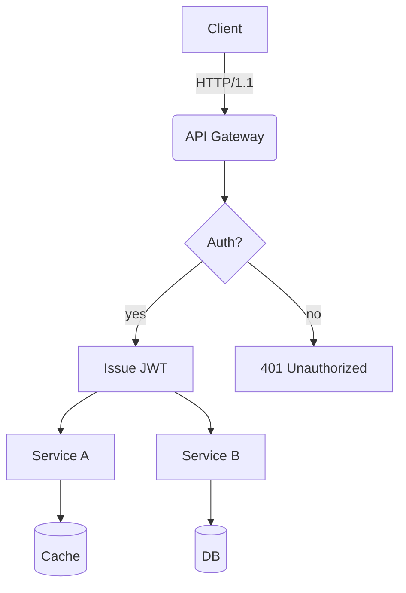
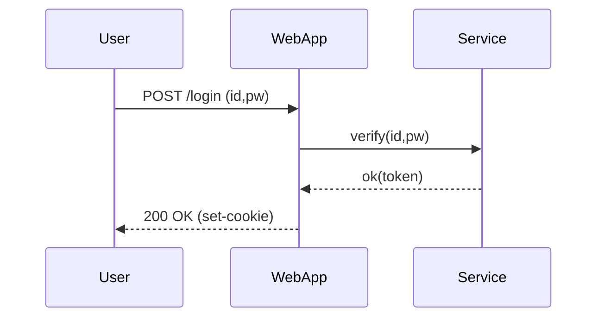
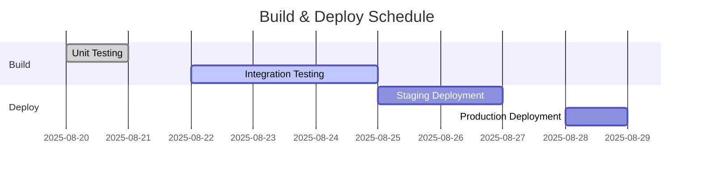
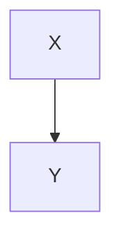

# Translation Test Document for **Rich Markdown**

This document is designed to exceed **4096 tokens** and includes various formats of Korean content. It aims to test the robustness of translation engines/LLMs in terms of context processing, format preservation, and code/table ignoring rules.

> **Guide**
> 1) Code blocks and `mermaid` areas must be preserved.
> 2) Numbers/units (e.g., 1.2GB, 3ms), slash paths (`/var/log/app.log`), options (`--flag`) must retain their integrity.
> 3) Tables, lists, quotes, checklists, syntax, and emojis 😀 should not disrupt the layout.

## 1. Table and Symbol/Unit Mixture

| Item | Value | Unit | Note |
|---|---:|:---:|---|
| Throughput | 12,345 | RPS | Peak at 18,900 RPS |
| Latency (P50) | 3.2 | ms | `--enable-cache` applied |
| Latency (P99) | 41.7 | ms | Includes GC intervals |
| Memory | 1.5 | GB | RSS-based, cgroup limit 2GB |
| Disk I/O | 220 | MB/s | NVMe-oF(TCP) routed |

## 2. Checklist

- [x] Translate markdown headers accurately
- [x] Preserve keywords in code blocks (`for`, `if`, `return`)
- [ ] Preserve Mermaid diagrams and ignore comments
- [ ] Retain units (GB/ms/%), paths (`/etc/hosts`)
- [ ] Preserve inline syntax $O(n \log n)$

## 3. Code Blocks: Bash/Python/JSON/YAML

```bash
#!/usr/bin/env bash
set -euo pipefail

APP_ENV="${APP_ENV:-prod}"
INPUT="${1:-/data/input.txt}"
OUT="/var/tmp/result.json"

echo "[INFO] starting job on $(hostname) at $(date -Iseconds)"
if [[ ! -f "$INPUT" ]]; then
  echo "[ERROR] input not found: $INPUT" >&2
  exit 1
fi

lines=$(wc -l < "$INPUT")
echo "[DEBUG] line count: $lines"

curl -sS -X POST "http://127.0.0.1:8080/api" \  
  -H "Content-Type: application/json" \  
  -d "{\"env\":\"$APP_ENV\",\"count\":$lines}" > "$OUT"

jq -r '.status' "$OUT" | grep -q success && echo "OK" || { echo "FAIL"; exit 2; }
```

```python
from __future__ import annotations

def rolling_avg(xs: list[float], k: int) -> list[float]:
    if k <= 0:
        raise ValueError("k must be > 0")
    out = []
    acc = 0.0
    for i, v in enumerate(xs):
        acc += v
        if i >= k:
            acc -= xs[i-k]
        if i >= k - 1:
            out.append(acc / k)
    return out

print(rolling_avg([1,2,3,4,5,6,7,8,9], 3))
```

```json
{
  "service": "analytics",
  "version": "1.4.2",
  "features": ["rollup", "compaction", "delta-index"],
  "limits": {
    "max_docs": 1000000,
    "max_payload_mb": 256
  }
}
```

```yaml
apiVersion: v1
kind: ConfigMap
metadata:
  name: test-config
data:
  APP_ENV: "staging"
  ENDPOINT: "https://api.example.com"
```

## 4. Mermaid Diagram

### 4.1 Flowchart


English Markdown document:

### 4.2 Sequence


### 4.3 Gantt



## 5. Image/Link/Quote


- Document: <https://example.com/docs/guide>
- API Reference: [API Reference](https://example.com/api)
- Issue Tracker: https://example.com/issues

> “Translation quality is determined by the simultaneous preservation of layout and meaning.” — Anonymous


## 6. Formulae and Text Mix

- Average Time Complexity: O(n log n), Worst Case: O(n^2)
- Variance: σ^2 = (1/n) \* Σ(x_i - μ)^2
- Sample Mean: \bar{x} = (1/n) \* Σ x_i

Example Sentence: This sentence is a sample for checking whether bold, italic, `code` can be preserved normally. It includes emojis 😀, Chinese characters 漢字, English CamelCase, snake_case, kebab-case.

### 7.1 Experimental Paragraph — Transformation Pattern
This paragraph is similar but translated differently each time to avoid duplication.
- Scenario: Dialogue Record Summary
- Condition: Korean text length of 100k characters
- Expected Result: Summary rate of 90% or higher

#### Steps
1. Input Data: `/data/input_01.jsonl`
2. Options: `--batch 512 --timeout 3s --enable-cache`
3. Execution: `app run --job test-01 --qos high`
4. Verification: Check for `test-01 finished` in logs

#### Observations
- GC intervals increasing P99 latency trend observed
- Cache miss rate increasing by 10% results in ~7% decrease in throughput
- Connection pool size increased from 32 to 64, resulting in a 1.2% → 0.6% reduction in retries per second

---

### 7.2 Experimental Paragraph — Transformation Pattern
This paragraph is similar but translated differently each time to avoid duplication.
- Scenario: Dialogue Record Summary
- Condition: Korean text length of 100k characters
- Expected Result: Summary rate of 90% or higher

#### Steps
1. Input Data: `/data/input_02.jsonl`
2. Options: `--batch 512 --timeout 3s --enable-cache`
3. Execution: `app run --job test-02 --qos high`
4. Verification: Check for `test-02 finished` in logs

#### Observations
- GC intervals increasing P99 latency trend observed
- Cache miss rate increasing by 10% results in ~7% decrease in throughput
- Connection pool size increased from 32 to 64, resulting in a 1.2% → 0.6% reduction in retries per second

---

### 7.3 Experimental Paragraph — Transformation Pattern
This paragraph is similar but translated differently each time to avoid duplication.
- Scenario: Kubernetes Deployment
- Condition: HPA enabled
- Expected Result: Scale range of 2 to 10 operational

#### Steps
1. Input Data: `/data/input_03.jsonl`
2. Options: `--batch 512 --timeout 3s --enable-cache`
3. Execution: `app run --job test-03 --qos high`
4. Verification: Check for `test-03 finished` in logs

#### Observations
- GC intervals increasing P99 latency trend observed
- Cache miss rate increasing by 10% results in ~7% decrease in throughput
- Connection pool size increased from 32 to 64, resulting in a 1.2% → 0.6% reduction in retries per second

---

### 7.4 Experiment Note — Pattern Variation
This section varies slightly each time to avoid duplication.

- Scenario: Kubernetes deployment
- Condition: HPA enabled
- Expected outcome: Scale range 2–10 in action

#### Steps
1. Input data: `/data/input_04.jsonl`
2. Options: `--batch 512 --timeout 3s --enable-cache`
3. Execution: `app run --job test-04 --qos high`
4. Verification: Check for `test-04 finished` in logs

#### Observations
- Longer GC intervals tend to increase P99 latency
- A 10% cache miss rate results in a ~7% decrease in throughput
- Increasing connection pool size from 32 to 64 reduces the retry rate per second by 1.2% → 0.6%

---


### 7.5 Experiment Note — Pattern Variation
This section varies slightly each time to avoid duplication.

- Scenario: Dialogue summary
- Condition: Includes 100k characters in Korean
- Expected outcome: Summary rate above 90%

#### Steps
1. Input data: `/data/input_05.jsonl`
2. Options: `--batch 512 --timeout 3s --enable-cache`
3. Execution: `app run --job test-05 --qos high`
4. Verification: Check for `test-05 finished` in logs

#### Observations
- Longer GC intervals tend to increase P99 latency
- A 10% cache miss rate results in a ~7% decrease in throughput
- Increasing connection pool size from 32 to 64 reduces the retry rate per second by 1.2% → 0.6%

---


### 7.6 Experiment Note — Pattern Variation
This section varies slightly each time to avoid duplication.

- Scenario: Mermaid rendering
- Condition: 50+ nodes, 100+ edges
- Expected outcome: No layout distortion

#### Steps
1. Input data: `/data/input_06.jsonl`
2. Options: `--batch 512 --timeout 3s --enable-cache`
3. Execution: `app run --job test-06 --qos high`
4. Verification: Check for `test-06 finished` in logs

#### Observations
- Longer GC intervals tend to increase P99 latency
- A 10% cache miss rate results in a ~7% decrease in throughput
- Increasing connection pool size from 32 to 64 reduces the retry rate per second by 1.2% → 0.6%

---


### 7.7 Experiment Note — Pattern Variation
This section varies slightly each time to avoid duplication.

- Scenario: Large JSON parsing
- Condition: 64MB payload, 4 workers
- Expected outcome: No memory spike

#### Steps
1. Input data: `/data/input_07.jsonl`
2. Options: `--batch 512 --timeout 3s --enable-cache`
3. Execution: `app run --job test-07 --qos high`
4. Verification: Check for `test-07 finished` in logs

#### Observations
- Longer GC intervals tend to increase P99 latency
- A 10% cache miss rate results in a ~7% decrease in throughput
- Increasing connection pool size from 32 to 64 reduces the retry rate per second by 1.2% → 0.6%

---


### 7.8 Experiment Note — Pattern Variation
This section varies slightly each time to avoid duplication.

- Scenario: Large JSON parsing
- Condition: 64MB payload, 4 workers
- Expected outcome: No memory spike

#### Steps
1. Input data: `/data/input_08.jsonl`
2. Options: `--batch 512 --timeout 3s --enable-cache`
3. Execution: `app run --job test-08 --qos high`
4. Verification: Check for `test-08 finished` in logs

#### Observations
- Longer GC intervals tend to increase P99 latency
- A 10% cache miss rate results in a ~7% decrease in throughput
- Increasing connection pool size from 32 to 64 reduces the retry rate per second by 1.2% → 0.6%

---


### 7.9 Experiment Note — Pattern Variation
This section varies slightly each time to avoid duplication.

- Scenario: Large JSON parsing
- Condition: 64MB payload, 4 workers
- Expected outcome: No memory spike

#### Steps
1. Input data: `/data/input_09.jsonl`
2. Options: `--batch 512 --timeout 3s --enable-cache`
3. Execution: `app run --job test-09 --qos high`
4. Verification: Check for `test-09 finished` in logs

#### Observations
- Longer GC intervals tend to increase P99 latency
- A 10% cache miss rate results in a ~7% decrease in throughput
- Increasing connection pool size from 32 to 64 reduces the retry rate per second by 1.2% → 0.6%

---

#### Procedure
1. Input Data: `/data/input_09.jsonl`
2. Options: `--batch 512 --timeout 3s --enable-cache`
3. Execution: `app run --job test-09 --qos high`
4. Verification: Check for `test-09 finished` in logs

#### Observations
- Longer GC intervals tend to increase P99 latency
- A 10% increase in cache misses results in a ~7% decrease in throughput
- Increasing connection pool size from 32 to 64 reduces the retry rate per second from 1.2% to 0.6%

---

### 7.10 Experiment Note — Pattern Variation
Each iteration has slightly different vocabulary and sequence to avoid duplication.
- Scenario: NVMe-oF I/O Retry
- Conditions: TCP RTT 2ms, loss 0.1%
- Expected Result: Retry rate below 1%

#### Procedure
1. Input Data: `/data/input_10.jsonl`
2. Options: `--batch 512 --timeout 3s --enable-cache`
3. Execution: `app run --job test-10 --qos high`
4. Verification: Check for `test-10 finished` in logs

#### Observations
- Longer GC intervals tend to increase P99 latency
- A 10% increase in cache misses results in a ~7% decrease in throughput
- Increasing connection pool size from 32 to 64 reduces the retry rate per second from 1.2% to 0.6%

---

### 7.11 Experiment Note — Pattern Variation
Each iteration has slightly different vocabulary and sequence to avoid duplication.
- Scenario: Large JSON Parsing
- Conditions: 64MB payload, 4 workers
- Expected Result: Memory spike-free completion

#### Procedure
1. Input Data: `/data/input_11.jsonl`
2. Options: `--batch 512 --timeout 3s --enable-cache`
3. Execution: `app run --job test-11 --qos high`
4. Verification: Check for `test-11 finished` in logs

#### Observations
- Longer GC intervals tend to increase P99 latency
- A 10% increase in cache misses results in a ~7% decrease in throughput
- Increasing connection pool size from 32 to 64 reduces the retry rate per second from 1.2% to 0.6%

---

### 7.12 Experiment Note — Pattern Variation
Each iteration has slightly different vocabulary and sequence to avoid duplication.
- Scenario: Kubernetes Deployment
- Conditions: HPA enabled
- Expected Result: Scale range 2–10

#### Procedure
1. Input Data: `/data/input_12.jsonl`
2. Options: `--batch 512 --timeout 3s --enable-cache`
3. Execution: `app run --job test-12 --qos high`
4. Verification: Check for `test-12 finished` in logs

#### Observations
- Longer GC intervals tend to increase P99 latency
- A 10% increase in cache misses results in a ~7% decrease in throughput
- Increasing connection pool size from 32 to 64 reduces the retry rate per second from 1.2% to 0.6%

---

### 7.13 Experiment Note — Pattern Variation
Each iteration has slightly different vocabulary and sequence to avoid duplication.
- Scenario: Large JSON Parsing
- Conditions: 64MB payload, 4 workers
- Expected Result: Memory spike-free completion

#### Procedure
1. Input Data: `/data/input_13.jsonl`
2. Options: `--batch 512 --timeout 3s --enable-cache`
3. Execution: `app run --job test-13 --qos high`
4. Verification: Check for `test-13 finished` in logs

#### Observations
- Longer GC intervals tend to increase P99 latency
- A 10% increase in cache misses results in a ~7% decrease in throughput
- Increasing connection pool size from 32 to 64 reduces the retry rate per second from 1.2% to 0.6%

---

### 7.14 Experiment Note — Pattern Variation
Each iteration has slightly different vocabulary and sequence to avoid duplication.
- Scenario: Large JSON Parsing
- Conditions: 64MB payload, 4 workers
- Expected Result: Memory spike-free completion

#### Procedure
1. Input Data: `/data/input_14.jsonl`
2. Options: `--batch 512 --timeout 3s --enable-cache`
3. Execution: `app run --job test-14 --qos high`
4. Verification: Check for `test-14 finished` in logs

#### Observations
- Longer GC intervals tend to increase P99 latency
- A 10% increase in cache misses results in a ~7% decrease in throughput
- Increasing connection pool size from 32 to 64 reduces the retry rate per second from 1.2% to 0.6%

---

#### Observations
- As GC intervals increase, a trend of increasing P99 latency is observed.
- When the cache miss ratio increases by 10%, throughput decreases by approximately 7%.
- Upon increasing the connection pool size from 32 to 64, the retry rate per second decreases from 1.2% to 0.6%.

---


### 7.15 Experiment Summary — Variation Pattern
Each summary is similar but with slight changes in vocabulary and order to avoid duplication.
- Scenario: NVMe-oF I/O Retry
- Conditions: TCP RTT 2ms, loss 0.1%
- Expected Result: Retry rate below 1%

#### Procedure
1. Input Data: `/data/input_15.jsonl`
2. Options: `--batch 512 --timeout 3s --enable-cache`
3. Execution: `app run --job test-15 --qos high`
4. Verification: Check for `test-15 finished` in logs

#### Observations
- As GC intervals increase, a trend of increasing P99 latency is observed.
- When the cache miss ratio increases by 10%, throughput decreases by approximately 7%.
- Upon increasing the connection pool size from 32 to 64, the retry rate per second decreases from 1.2% to 0.6%.

---


### 7.16 Experiment Summary — Variation Pattern
Each summary is similar but with slight changes in vocabulary and order to avoid duplication.
- Scenario: Mermaid Rendering
- Conditions: 50+ nodes, 100+ edges
- Expected Result: No layout distortion

#### Procedure
1. Input Data: `/data/input_16.jsonl`
2. Options: `--batch 512 --timeout 3s --enable-cache`
3. Execution: `app run --job test-16 --qos high`
4. Verification: Check for `test-16 finished` in logs

#### Observations
- As GC intervals increase, a trend of increasing P99 latency is observed.
- When the cache miss ratio increases by 10%, throughput decreases by approximately 7%.
- Upon increasing the connection pool size from 32 to 64, the retry rate per second decreases from 1.2% to 0.6%.

---


### 7.17 Experiment Summary — Variation Pattern
Each summary is similar but with slight changes in vocabulary and order to avoid duplication.
- Scenario: Dialogue Record Summarization
- Conditions: Includes 100k Korean characters
- Expected Result: Summary rate above 90%

#### Procedure
1. Input Data: `/data/input_17.jsonl`
2. Options: `--batch 512 --timeout 3s --enable-cache`
3. Execution: `app run --job test-17 --qos high`
4. Verification: Check for `test-17 finished` in logs

#### Observations
- As GC intervals increase, a trend of increasing P99 latency is observed.
- When the cache miss ratio increases by 10%, throughput decreases by approximately 7%.
- Upon increasing the connection pool size from 32 to 64, the retry rate per second decreases from 1.2% to 0.6%.

---


### 7.18 Experiment Summary — Variation Pattern
Each summary is similar but with slight changes in vocabulary and order to avoid duplication.
- Scenario: Large JSON Parsing
- Conditions: 64MB payload, 4 workers
- Expected Result: No memory spike

#### Procedure
1. Input Data: `/data/input_18.jsonl`
2. Options: `--batch 512 --timeout 3s --enable-cache`
3. Execution: `app run --job test-18 --qos high`
4. Verification: Check for `test-18 finished` in logs

#### Observations
- As GC intervals increase, a trend of increasing P99 latency is observed.
- When the cache miss ratio increases by 10%, throughput decreases by approximately 7%.
- Upon increasing the connection pool size from 32 to 64, the retry rate per second decreases from 1.2% to 0.6%.

---


### 7.19 Experiment Summary — Variation Pattern
Each summary is similar but with slight changes in vocabulary and order to avoid duplication.
- Scenario: Large JSON Parsing
- Conditions: 64MB payload, 4 workers
- Expected Result: No memory spike

#### Procedure
1. Input Data: `/data/input_19.jsonl`
2. Options: `--batch 512 --timeout 3s --enable-cache`
3. Execution: `app run --job test-19 --qos high`
4. Verification: Check for `test-19 finished` in logs

#### Observations
- As GC intervals increase, a trend of increasing P99 latency is observed.
- When the cache miss ratio increases by 10%, throughput decreases by approximately 7%.
- Upon increasing the connection pool size from 32 to 64, the retry rate per second decreases from 1.2% to 0.6%.

---

### 7.20 Experiment Note — Pattern Variation
This section is similar but varies in vocabulary and sequence to prevent duplication.

- Scenario: NVMe-oF I/O retry
- Condition: TCP RTT 2ms, loss 0.1%
- Expected result: retry rate ≤ 1%

#### Procedure
1. Input data: `/data/input_20.jsonl`
2. Options: `--batch 512 --timeout 3s --enable-cache`
3. Execution: `app run --job test-20 --qos high`
4. Verification: Check for `test-20 finished` in logs

#### Observations
- Longer GC intervals tend to increase P99 latency
- Cache miss rate increasing by 10% results in ~7% throughput decrease
- Connection pool size increased from 32 to 64, resulting in a retry rate reduction of 1.2% → 0.6%

---


### 7.21 Experiment Note — Pattern Variation
This section is similar but varies in vocabulary and sequence to prevent duplication.

- Scenario: Kubernetes deployment
- Condition: HPA enabled
- Expected result: scale range 2~10 operation

#### Procedure
1. Input data: `/data/input_21.jsonl`
2. Options: `--batch 512 --timeout 3s --enable-cache`
3. Execution: `app run --job test-21 --qos high`
4. Verification: Check for `test-21 finished` in logs

#### Observations
- Longer GC intervals tend to increase P99 latency
- Cache miss rate increasing by 10% results in ~7% throughput decrease
- Connection pool size increased from 32 to 64, resulting in a retry rate reduction of 1.2% → 0.6%

---


### 7.22 Experiment Note — Pattern Variation
This section is similar but varies in vocabulary and sequence to prevent duplication.

- Scenario: Mermaid rendering
- Condition: 50+ nodes, 100+ edges
- Expected result: no layout distortion

#### Procedure
1. Input data: `/data/input_22.jsonl`
2. Options: `--batch 512 --timeout 3s --enable-cache`
3. Execution: `app run --job test-22 --qos high`
4. Verification: Check for `test-22 finished` in logs

#### Observations
- Longer GC intervals tend to increase P99 latency
- Cache miss rate increasing by 10% results in ~7% throughput decrease
- Connection pool size increased from 32 to 64, resulting in a retry rate reduction of 1.2% → 0.6%

---


### 7.23 Experiment Note — Pattern Variation
This section is similar but varies in vocabulary and sequence to prevent duplication.

- Scenario: Large JSON parsing
- Condition: 64MB payload, 4 workers
- Expected result: no memory spike

#### Procedure
1. Input data: `/data/input_23.jsonl`
2. Options: `--batch 512 --timeout 3s --enable-cache`
3. Execution: `app run --job test-23 --qos high`
4. Verification: Check for `test-23 finished` in logs

#### Observations
- Longer GC intervals tend to increase P99 latency
- Cache miss rate increasing by 10% results in ~7% throughput decrease
- Connection pool size increased from 32 to 64, resulting in a retry rate reduction of 1.2% → 0.6%

---


### 7.24 Experiment Note — Pattern Variation
This section is similar but varies in vocabulary and sequence to prevent duplication.

- Scenario: Mermaid rendering
- Condition: 50+ nodes, 100+ edges
- Expected result: no layout distortion

#### Procedure
1. Input data: `/data/input_24.jsonl`
2. Options: `--batch 512 --timeout 3s --enable-cache`
3. Execution: `app run --job test-24 --qos high`
4. Verification: Check for `test-24 finished` in logs

#### Observations
- Longer GC intervals tend to increase P99 latency
- Cache miss rate increasing by 10% results in ~7% throughput decrease
- Connection pool size increased from 32 to 64, resulting in a retry rate reduction of 1.2% → 0.6%

---


### 7.25 Experiment Note — Pattern Variation
This section is similar but varies in vocabulary and sequence to prevent duplication.

- Scenario: Kubernetes deployment
- Condition: HPA enabled
- Expected result: scale range 2~10 operation

#### Procedure
1. Input data: `/data/input_25.jsonl`
2. Options: `--batch 512 --timeout 3s --enable-cache`
3. Execution: `app run --job test-25 --qos high`
4. Verification: Check for `test-25 finished` in logs

#### Observations
- Longer GC intervals tend to increase P99 latency
- Cache miss rate increasing by 10% results in ~7% throughput decrease
- Connection pool size increased from 32 to 64, resulting in a retry rate reduction of 1.2% → 0.6%

---

#### Procedure
1. Input Data: `/data/input_25.jsonl`
2. Options: `--batch 512 --timeout 3s --enable-cache`
3. Execution: `app run --job test-25 --qos high`
4. Verification: Check for `test-25 finished` in logs

#### Observations
- Longer GC intervals tend to increase P99 latency
- A 10% increase in cache misses results in a ~7% decrease in throughput
- Increasing connection pool size from 32 to 64 reduces the retry rate per second from 1.2% to 0.6%

---

### 7.26 Experiment Note — Pattern Variation
This note is similar but with slight changes in vocabulary and sequence to avoid duplication.
- Scenario: NVMe-oF I/O Retry
- Conditions: TCP RTT 2ms, loss 0.1%
- Expected Result: Retry rate below 1%

#### Procedure
1. Input Data: `/data/input_26.jsonl`
2. Options: `--batch 512 --timeout 3s --enable-cache`
3. Execution: `app run --job test-26 --qos high`
4. Verification: Check for `test-26 finished` in logs

#### Observations
- Longer GC intervals tend to increase P99 latency
- A 10% increase in cache misses results in a ~7% decrease in throughput
- Increasing connection pool size from 32 to 64 reduces the retry rate per second from 1.2% to 0.6%

---

### 7.27 Experiment Note — Pattern Variation
This note is similar but with slight changes in vocabulary and sequence to avoid duplication.
- Scenario: Dialogue Record Summarization
- Conditions: Korean text 100k characters
- Expected Result: Summary rate above 90%

#### Procedure
1. Input Data: `/data/input_27.jsonl`
2. Options: `--batch 512 --timeout 3s --enable-cache`
3. Execution: `app run --job test-27 --qos high`
4. Verification: Check for `test-27 finished` in logs

#### Observations
- Longer GC intervals tend to increase P99 latency
- A 10% increase in cache misses results in a ~7% decrease in throughput
- Increasing connection pool size from 32 to 64 reduces the retry rate per second from 1.2% to 0.6%

---

### 7.28 Experiment Note — Pattern Variation
This note is similar but with slight changes in vocabulary and sequence to avoid duplication.
- Scenario: Dialogue Record Summarization
- Conditions: Korean text 100k characters
- Expected Result: Summary rate above 90%

#### Procedure
1. Input Data: `/data/input_28.jsonl`
2. Options: `--batch 512 --timeout 3s --enable-cache`
3. Execution: `app run --job test-28 --qos high`
4. Verification: Check for `test-28 finished` in logs

#### Observations
- Longer GC intervals tend to increase P99 latency
- A 10% increase in cache misses results in a ~7% decrease in throughput
- Increasing connection pool size from 32 to 64 reduces the retry rate per second from 1.2% to 0.6%

---

### 7.29 Experiment Note — Pattern Variation
This note is similar but with slight changes in vocabulary and sequence to avoid duplication.
- Scenario: Large JSON Parsing
- Conditions: 64MB payload, 4 workers
- Expected Result: Memory spike-free completion

#### Procedure
1. Input Data: `/data/input_29.jsonl`
2. Options: `--batch 512 --timeout 3s --enable-cache`
3. Execution: `app run --job test-29 --qos high`
4. Verification: Check for `test-29 finished` in logs

#### Observations
- Longer GC intervals tend to increase P99 latency
- A 10% increase in cache misses results in a ~7% decrease in throughput
- Increasing connection pool size from 32 to 64 reduces the retry rate per second from 1.2% to 0.6%

---

### 7.30 Experiment Note — Pattern Variation
This note is similar but with slight changes in vocabulary and sequence to avoid duplication.
- Scenario: Dialogue Record Summarization
- Conditions: Korean text 100k characters
- Expected Result: Summary rate above 90%

#### Procedure
1. Input Data: `/data/input_30.jsonl`
2. Options: `--batch 512 --timeout 3s --enable-cache`
3. Execution: `app run --job test-30 --qos high`
4. Verification: Check for `test-30 finished` in logs

#### Observations
- Longer GC intervals tend to increase P99 latency
- A 10% increase in cache misses results in a ~7% decrease in throughput
- Increasing connection pool size from 32 to 64 reduces the retry rate per second from 1.2% to 0.6%

---

#### Observations
- As GC intervals increase, a trend of increasing P99 latency is observed.
- When the cache miss ratio increases by 10%, throughput decreases by approximately 7%.
- Upon increasing the connection pool size from 32 to 64, the retry rate per second decreases from 1.2% to 0.6%.

---


### 7.31 Experiment Summary — Variation Pattern
This section varies slightly each time to avoid duplication.
- Scenario: Kubernetes deployment
- Condition: HPA enabled
- Expected outcome: Scale range 2–10 operation

#### Procedure
1. Input data: `/data/input_31.jsonl`
2. Options: `--batch 512 --timeout 3s --enable-cache`
3. Execution: `app run --job test-31 --qos high`
4. Verification: Check for `test-31 finished` in logs

#### Observations
- As GC intervals increase, a trend of increasing P99 latency is observed.
- When the cache miss ratio increases by 10%, throughput decreases by approximately 7%.
- Upon increasing the connection pool size from 32 to 64, the retry rate per second decreases from 1.2% to 0.6%.

---


### 7.32 Experiment Summary — Variation Pattern
This section varies slightly each time to avoid duplication.
- Scenario: Mermaid rendering
- Condition: 50+ nodes, 100+ edges
- Expected outcome: No layout distortion

#### Procedure
1. Input data: `/data/input_32.jsonl`
2. Options: `--batch 512 --timeout 3s --enable-cache`
3. Execution: `app run --job test-32 --qos high`
4. Verification: Check for `test-32 finished` in logs

#### Observations
- As GC intervals increase, a trend of increasing P99 latency is observed.
- When the cache miss ratio increases by 10%, throughput decreases by approximately 7%.
- Upon increasing the connection pool size from 32 to 64, the retry rate per second decreases from 1.2% to 0.6%.

---


### 7.33 Experiment Summary — Variation Pattern
This section varies slightly each time to avoid duplication.
- Scenario: Large JSON parsing
- Condition: 64MB payload, 4 workers
- Expected outcome: No memory spikes

#### Procedure
1. Input data: `/data/input_33.jsonl`
2. Options: `--batch 512 --timeout 3s --enable-cache`
3. Execution: `app run --job test-33 --qos high`
4. Verification: Check for `test-33 finished` in logs

#### Observations
- As GC intervals increase, a trend of increasing P99 latency is observed.
- When the cache miss ratio increases by 10%, throughput decreases by approximately 7%.
- Upon increasing the connection pool size from 32 to 64, the retry rate per second decreases from 1.2% to 0.6%.

---


### 7.34 Experiment Summary — Variation Pattern
This section varies slightly each time to avoid duplication.
- Scenario: Kubernetes deployment
- Condition: HPA enabled
- Expected outcome: Scale range 2–10 operation

#### Procedure
1. Input data: `/data/input_34.jsonl`
2. Options: `--batch 512 --timeout 3s --enable-cache`
3. Execution: `app run --job test-34 --qos high`
4. Verification: Check for `test-34 finished` in logs

#### Observations
- As GC intervals increase, a trend of increasing P99 latency is observed.
- When the cache miss ratio increases by 10%, throughput decreases by approximately 7%.
- Upon increasing the connection pool size from 32 to 64, the retry rate per second decreases from 1.2% to 0.6%.

---


### 7.35 Experiment Summary — Variation Pattern
This section varies slightly each time to avoid duplication.
- Scenario: Mermaid rendering
- Condition: 50+ nodes, 100+ edges
- Expected outcome: No layout distortion

#### Procedure
1. Input data: `/data/input_35.jsonl`
2. Options: `--batch 512 --timeout 3s --enable-cache`
3. Execution: `app run --job test-35 --qos high`
4. Verification: Check for `test-35 finished` in logs

#### Observations
- As GC intervals increase, a trend of increasing P99 latency is observed.
- When the cache miss ratio increases by 10%, throughput decreases by approximately 7%.
- Upon increasing the connection pool size from 32 to 64, the retry rate per second decreases from 1.2% to 0.6%.

---

### 7.36 Experiment Note — Pattern Variation
This section is similar but translated to prevent duplication, with slight changes in vocabulary and sequence each time.

- Scenario: NVMe-oF I/O retry
- Condition: TCP RTT 2ms, loss 0.1%
- Expected result: retry rate ≤ 1%

#### Procedure
1. Input data: `/data/input_36.jsonl`
2. Option: `--batch 512 --timeout 3s --enable-cache`
3. Execution: `app run --job test-36 --qos high`
4. Verification: Check for `test-36 finished` in logs

#### Observations
- Longer GC intervals tend to increase P99 latency
- Cache miss rate increases by 10% → processing throughput decreases by ~7%
- Connection pool size increasing from 32 to 64 reduces retry rate per second from 1.2% to 0.6%

---

### 7.37 Experiment Note — Pattern Variation
This section is similar but translated to prevent duplication, with slight changes in vocabulary and sequence each time.

- Scenario: Large JSON parsing
- Condition: 64MB payload, 4 workers
- Expected result: no memory spikes

#### Procedure
1. Input data: `/data/input_37.jsonl`
2. Option: `--batch 512 --timeout 3s --enable-cache`
3. Execution: `app run --job test-37 --qos high`
4. Verification: Check for `test-37 finished` in logs

#### Observations
- Longer GC intervals tend to increase P99 latency
- Cache miss rate increases by 10% → processing throughput decreases by ~7%
- Connection pool size increasing from 32 to 64 reduces retry rate per second from 1.2% to 0.6%

---

### 7.38 Experiment Note — Pattern Variation
This section is similar but translated to prevent duplication, with slight changes in vocabulary and sequence each time.

- Scenario: Mermaid rendering
- Condition: 50+ nodes, 100+ edges
- Expected result: no layout distortion

#### Procedure
1. Input data: `/data/input_38.jsonl`
2. Option: `--batch 512 --timeout 3s --enable-cache`
3. Execution: `app run --job test-38 --qos high`
4. Verification: Check for `test-38 finished` in logs

#### Observations
- Longer GC intervals tend to increase P99 latency
- Cache miss rate increases by 10% → processing throughput decreases by ~7%
- Connection pool size increasing from 32 to 64 reduces retry rate per second from 1.2% to 0.6%

---

### 7.39 Experiment Note — Pattern Variation
This section is similar but translated to prevent duplication, with slight changes in vocabulary and sequence each time.

- Scenario: Mermaid rendering
- Condition: 50+ nodes, 100+ edges
- Expected result: no layout distortion

#### Procedure
1. Input data: `/data/input_39.jsonl`
2. Option: `--batch 512 --timeout 3s --enable-cache`
3. Execution: `app run --job test-39 --qos high`
4. Verification: Check for `test-39 finished` in logs

#### Observations
- Longer GC intervals tend to increase P99 latency
- Cache miss rate increases by 10% → processing throughput decreases by ~7%
- Connection pool size increasing from 32 to 64 reduces retry rate per second from 1.2% to 0.6%

---

### 7.40 Experiment Note — Pattern Variation
This section is similar but translated to prevent duplication, with slight changes in vocabulary and sequence each time.

- Scenario: Dialogue summary
- Condition: includes 100k Korean characters
- Expected result: summarization rate ≥ 90%

#### Procedure
1. Input data: `/data/input_40.jsonl`
2. Option: `--batch 512 --timeout 3s --enable-cache`
3. Execution: `app run --job test-40 --qos high`
4. Verification: Check for `test-40 finished` in logs

#### Observations
- Longer GC intervals tend to increase P99 latency
- Cache miss rate increases by 10% → processing throughput decreases by ~7%
- Connection pool size increasing from 32 to 64 reduces retry rate per second from 1.2% to 0.6%

---

## 8. Long List

English Markdown document:

2. Error Handling Consistency — Case #001
3. Performance Profiling — Case #002
4. Accessibility (a11y) — Case #003
5. Log Schema Stability — Case #004
6. Cache Invalidation Scenarios — Case #005
7. Performance Profiling — Case #006
8. Performance Profiling — Case #007
9. API Incompatibility — Case #008
10. Log Schema Stability — Case #009
11. Accessibility (a11y) — Case #010
12. Cache Invalidation Scenarios — Case #011
13. Performance Profiling — Case #012
14. Security Headers Applied — Case #013
15. Internationalization (i18n) — Case #014
16. Resource Leak Detection — Case #015
17. Error Handling Consistency — Case #016
18. Error Handling Consistency — Case #017
19. Internationalization (i18n) — Case #018
20. CORS Policy Verification — Case #019
21. Performance Profiling — Case #020
22. Security Headers Applied — Case #021
23. Log Schema Stability — Case #022
24. Performance Profiling — Case #023
25. Cache Invalidation Scenarios — Case #024
26. CORS Policy Verification — Case #025
27. Performance Profiling — Case #026
28. Accessibility (a11y) — Case #027
29. Accessibility (a11y) — Case #028
30. API Incompatibility — Case #029
31. Cache Invalidation Scenarios — Case #030
32. Cache Invalidation Scenarios — Case #031
33. Performance Profiling — Case #032
34. Resource Leak Detection — Case #033
35. Log Schema Stability — Case #034
36. CORS Policy Verification — Case #035
37. Error Handling Consistency — Case #036
38. Resource Leak Detection — Case #037
39. Error Handling Consistency — Case #038
40. Internationalization (i18n) — Case #039
41. API Incompatibility — Case #040
42. Cache Invalidation Scenarios — Case #041
43. Cache Invalidation Scenarios — Case #042
44. Cache Invalidation Scenarios — Case #043
45. Performance Profiling — Case #044
46. Performance Profiling — Case #045
47. CORS Policy Verification — Case #046
48. Resource Leak Detection — Case #047
49. Cache Invalidation Scenarios — Case #048
50. Error Handling Consistency — Case #049
51. Log Schema Stability — Case #050
52. Resource Leak Detection — Case #051
53. Internationalization (i18n) — Case #052
54. Log Schema Stability — Case #053
55. Resource Leak Detection — Case #054
56. Security Headers Applied — Case #055
57. Internationalization (i18n) — Case #056
58. API Incompatibility — Case #057
59. Accessibility (a11y) — Case #058
60. API Incompatibility — Case #059
61. Performance Profiling — Case #060
62. Accessibility (a11y) — Case #061
63. API Incompatibility — Case #062
64. Internationalization (i18n) — Case #063
65. Security Headers Applied — Case #064
66. Error Handling Consistency — Case #065
67. Performance Profiling — Case #066
68. Accessibility (a11y) — Case #067
69. Error Handling Consistency — Case #068
70. Performance Profiling — Case #069
71. Resource Leak Detection — Case #070
72. Accessibility (a11y) — Case #071
73. Internationalization (i18n) — Case #072
74. Error Handling Consistency — Case #073
75. Internationalization (i18n) — Case #074
76. Performance Profiling — Case #075
77. Security Headers Applied — Case #076
78. CORS Policy Verification — Case #077
79. Resource Leak Detection — Case #078
80. Resource Leak Detection — Case #079
81. Performance Profiling — Case #080
82. Accessibility (a11y) — Case #081
83. Accessibility (a11y) — Case #082
84. Performance Profiling — Case #083
85. Resource Leak Detection — Case #084
86. Accessibility (a11y) — Case #085
87. Cache Invalidation Scenarios — Case #086
88. CORS Policy Verification — Case #087
89. Log Schema Stability — Case #088
90. CORS Policy Verification — Case #089
91. Security Headers Applied — Case #090
92. API Incompatibility — Case #091
93. Accessibility (a11y) — Case #092

다음 한국어 마크다운 문서를 영어로 번역합니다:

94. Performance Profiling — Case #093
95. Performance Profiling — Case #094
96. Log Schema Stability — Case #095
97. Internationalization (i18n) — Case #096
98. API Backward Compatibility — Case #097
99. Consistent Error Handling — Case #098
100. Cache Invalid Scenario — Case #099
101. Accessibility (a11y) — Case #100
102. Accessibility (a11y) — Case #101
103. Internationalization (i18n) — Case #102
104. Accessibility (a11y) — Case #103
105. API Backward Compatibility — Case #104
106. Accessibility (a11y) — Case #105
107. Performance Profiling — Case #106
108. Security Headers Applied — Case #107
109. API Backward Compatibility — Case #108
110. Consistent Error Handling — Case #109
111. Performance Profiling — Case #110
112. Resource Leak Check — Case #111
113. CORS Policy Verification — Case #112
114. Accessibility (a11y) — Case #113
115. Consistent Error Handling — Case #114
116. Consistent Error Handling — Case #115
117. Performance Profiling — Case #116
118. CORS Policy Verification — Case #117
119. Resource Leak Check — Case #118
120. Cache Invalid Scenario — Case #119
121. CORS Policy Verification — Case #120
122. Performance Profiling — Case #121
123. Consistent Error Handling — Case #122
124. Performance Profiling — Case #123
125. Performance Profiling — Case #124
126. Accessibility (a11y) — Case #125
127. Accessibility (a11y) — Case #126
128. Consistent Error Handling — Case #127
129. Consistent Error Handling — Case #128
130. API Backward Compatibility — Case #129
131. Accessibility (a11y) — Case #130
132. API Backward Compatibility — Case #131
133. Cache Invalid Scenario — Case #132
134. Security Headers Applied — Case #133
135. Internationalization (i18n) — Case #134
136. Security Headers Applied — Case #135
137. Performance Profiling — Case #136
138. Performance Profiling — Case #137
139. CORS Policy Verification — Case #138
140. Internationalization (i18n) — Case #139
141. Log Schema Stability — Case #140
142. CORS Policy Verification — Case #141
143. Accessibility (a11y) — Case #142
144. Security Headers Applied — Case #143
145. Log Schema Stability — Case #144
146. Performance Profiling — Case #145
147. Performance Profiling — Case #146
148. API Backward Compatibility — Case #147
149. Resource Leak Check — Case #148
150. Performance Profiling — Case #149
151. Resource Leak Check — Case #150
152. Accessibility (a11y) — Case #151
153. API Backward Compatibility — Case #152
154. Accessibility (a11y) — Case #153
155. Security Headers Applied — Case #154
156. Accessibility (a11y) — Case #155
157. Performance Profiling — Case #156
158. Cache Invalid Scenario — Case #157
159. Security Headers Applied — Case #158
160. Consistent Error Handling — Case #159
161. Log Schema Stability — Case #160
162. Performance Profiling — Case #161
163. Accessibility (a11y) — Case #162
164. Consistent Error Handling — Case #163
165. Resource Leak Check — Case #164
166. Log Schema Stability — Case #165
167. Internationalization (i18n) — Case #166
168. Cache Invalid Scenario — Case #167
169. Internationalization (i18n) — Case #168
170. Cache Invalid Scenario — Case #169
171. Resource Leak Check — Case #170
172. Security Headers Applied — Case #171
173. Resource Leak Check — Case #172
174. Consistent Error Handling — Case #173
175. Resource Leak Check — Case #174
176. Log Schema Stability — Case #175
177. CORS Policy Verification — Case #176
178. Security Headers Applied — Case #177
179. Log Schema Stability — Case #178
180. Performance Profiling — Case #179
181. Resource Leak Check — Case #180

183. Internationalization (i18n) — Case #182
184. Log Schema Stability — Case #183
185. Accessibility (a11y) — Case #184
186. Security Headers Applied — Case #185
187. Resource Leak Check — Case #186
188. Resource Leak Check — Case #187
189. Accessibility (a11y) — Case #188
190. Cache Invalidated Scenario — Case #189
191. Accessibility (a11y) — Case #190
192. Consistent Error Handling — Case #191
193. Consistent Error Handling — Case #192
194. Resource Leak Check — Case #193
195. Consistent Error Handling — Case #194
196. CORS Policy Verification — Case #195
197. Performance Profiling — Case #196
198. Resource Leak Check — Case #197
199. Accessibility (a11y) — Case #198
200. Resource Leak Check — Case #199
201. Cache Invalidated Scenario — Case #200
202. Internationalization (i18n) — Case #201
203. Log Schema Stability — Case #202
204. Consistent Error Handling — Case #203
205. Resource Leak Check — Case #204
206. Security Headers Applied — Case #205
207. Resource Leak Check — Case #206
208. Cache Invalidated Scenario — Case #207
209. Performance Profiling — Case #208
210. Security Headers Applied — Case #209
211. Internationalization (i18n) — Case #210
212. Log Schema Stability — Case #211
213. Consistent Error Handling — Case #212
214. Cache Invalidated Scenario — Case #213
215. Security Headers Applied — Case #214
216. Internationalization (i18n) — Case #215
217. Security Headers Applied — Case #216
218. Performance Profiling — Case #217
219. Consistent Error Handling — Case #218
220. Security Headers Applied — Case #219
221. Performance Profiling — Case #220
222. API Incompatibility — Case #221
223. Resource Leak Check — Case #222
224. Internationalization (i18n) — Case #223
225. Security Headers Applied — Case #224
226. Internationalization (i18n) — Case #225
227. Performance Profiling — Case #226
228. Log Schema Stability — Case #227
229. CORS Policy Verification — Case #228
230. Performance Profiling — Case #229
231. API Incompatibility — Case #230
232. CORS Policy Verification — Case #231
233. Internationalization (i18n) — Case #232
234. Consistent Error Handling — Case #233
235. Performance Profiling — Case #234
236. Consistent Error Handling — Case #235
237. Performance Profiling — Case #236
238. Security Headers Applied — Case #237
239. Consistent Error Handling — Case #238
240. CORS Policy Verification — Case #239
241. API Incompatibility — Case #240
242. Performance Profiling — Case #241
243. Cache Invalidated Scenario — Case #242
244. Performance Profiling — Case #243
245. Security Headers Applied — Case #244
246. Consistent Error Handling — Case #245
247. Internationalization (i18n) — Case #246
248. Log Schema Stability — Case #247
249. Security Headers Applied — Case #248
250. Accessibility (a11y) — Case #249
251. Accessibility (a11y) — Case #250
252. Internationalization (i18n) — Case #251
253. Internationalization (i18n) — Case #252
254. CORS Policy Verification — Case #253
255. Log Schema Stability — Case #254
256. CORS Policy Verification — Case #255
257. Security Headers Applied — Case #256
258. Cache Invalidated Scenario — Case #257
259. Consistent Error Handling — Case #258
260. Accessibility (a11y) — Case #259
261. Resource Leak Check — Case #260
262. Resource Leak Check — Case #261
263. Performance Profiling — Case #262
264. Accessibility (a11y) — Case #263
265. Cache Invalidated Scenario — Case #264
266. Security Headers Applied — Case #265
267. Resource Leak Check — Case #266
268. Security Headers Applied — Case #267
269. Performance Profiling — Case #268
270. Consistent Error Handling — Case #269

272. Internationalization (i18n) — Case #271
273. API Incompatibility — Case #272
274. Consistent Error Handling — Case #273
275. Accessibility (a11y) — Case #274
276. API Incompatibility — Case #275
277. Internationalization (i18n) — Case #276
278. CORS Policy Verification — Case #277
279. Security Headers Applied — Case #278
280. Cache Invalidated Scenario — Case #279
281. Log Schema Stability — Case #280
282. Resource Leak Check — Case #281
283. Resource Leak Check — Case #282
284. Accessibility (a11y) — Case #283
285. Accessibility (a11y) — Case #284
286. Consistent Error Handling — Case #285
287. API Incompatibility — Case #286
288. Cache Invalidated Scenario — Case #287
289. Accessibility (a11y) — Case #288
290. Accessibility (a11y) — Case #289
291. Security Headers Applied — Case #290
292. Security Headers Applied — Case #291
293. CORS Policy Verification — Case #292
294. Resource Leak Check — Case #293
295. Security Headers Applied — Case #294
296. CORS Policy Verification — Case #295
297. Log Schema Stability — Case #296
298. Cache Invalidated Scenario — Case #297
299. API Incompatibility — Case #298
300. Cache Invalidated Scenario — Case #299
301. Internationalization (i18n) — Case #300
302. Accessibility (a11y) — Case #301
303. Performance Profiling — Case #302
304. API Incompatibility — Case #303
305. Consistent Error Handling — Case #304
306. Accessibility (a11y) — Case #305
307. Resource Leak Check — Case #306
308. API Incompatibility — Case #307
309. Security Headers Applied — Case #308
310. CORS Policy Verification — Case #309
311. API Incompatibility — Case #310
312. CORS Policy Verification — Case #311
313. Accessibility (a11y) — Case #312
314. Internationalization (i18n) — Case #313
315. Resource Leak Check — Case #314
316. Internationalization (i18n) — Case #315
317. Log Schema Stability — Case #316
318. Security Headers Applied — Case #317
319. Log Schema Stability — Case #318
320. Consistent Error Handling — Case #319
321. Performance Profiling — Case #320
322. Accessibility (a11y) — Case #321
323. Security Headers Applied — Case #322
324. API Incompatibility — Case #323
325. CORS Policy Verification — Case #324
326. Resource Leak Check — Case #325
327. CORS Policy Verification — Case #326
328. CORS Policy Verification — Case #327
329. API Incompatibility — Case #328
330. Accessibility (a11y) — Case #329
331. Performance Profiling — Case #330
332. CORS Policy Verification — Case #331
333. Resource Leak Check — Case #332
334. Performance Profiling — Case #333
335. Resource Leak Check — Case #334
336. Consistent Error Handling — Case #335
337. Internationalization (i18n) — Case #336
338. Cache Invalidated Scenario — Case #337
339. API Incompatibility — Case #338
340. Cache Invalidated Scenario — Case #339
341. CORS Policy Verification — Case #340
342. Internationalization (i18n) — Case #341
343. Performance Profiling — Case #342
344. Performance Profiling — Case #343
345. Log Schema Stability — Case #344
346. Consistent Error Handling — Case #345
347. API Incompatibility — Case #346
348. Consistent Error Handling — Case #347
349. Accessibility (a11y) — Case #348
350. Performance Profiling — Case #349
351. Accessibility (a11y) — Case #350
352. Consistent Error Handling — Case #351
353. Cache Invalidated Scenario — Case #352
354. Internationalization (i18n) — Case #353
355. Resource Leak Check — Case #354
356. Accessibility (a11y) — Case #355
357. Security Headers Applied — Case #356
358. Resource Leak Check — Case #357
359. Performance Profiling — Case #358

English Markdown Document:

361. Resource Leak Check — Case #360
362. Log Schema Stability — Case #361
363. Internationalization (i18n) — Case #362
364. Consistent Error Handling — Case #363
365. Resource Leak Check — Case #364
366. Accessibility (a11y) — Case #365
367. Log Schema Stability — Case #366
368. Resource Leak Check — Case #367
369. Performance Profiling — Case #368
370. API Incompatibility — Case #369
371. Accessibility (a11y) — Case #370
372. Performance Profiling — Case #371
373. CORS Policy Verification — Case #372
374. Cache Invalid Scenario — Case #373
375. Security Header Application — Case #374
376. Accessibility (a11y) — Case #375
377. API Incompatibility — Case #376
378. Accessibility (a11y) — Case #377
379. Security Header Application — Case #378
380. CORS Policy Verification — Case #379
381. CORS Policy Verification — Case #380
382. Log Schema Stability — Case #381
383. Log Schema Stability — Case #382
384. Performance Profiling — Case #383
385. Consistent Error Handling — Case #384
386. Performance Profiling — Case #385
387. Log Schema Stability — Case #386
388. Resource Leak Check — Case #387
389. Accessibility (a11y) — Case #388
390. API Incompatibility — Case #389
391. Performance Profiling — Case #390
392. CORS Policy Verification — Case #391
393. API Incompatibility — Case #392
394. Security Header Application — Case #393
395. Cache Invalid Scenario — Case #394
396. Resource Leak Check — Case #395
397. Performance Profiling — Case #396
398. Performance Profiling — Case #397
399. Consistent Error Handling — Case #398
400. Cache Invalid Scenario — Case #399
401. API Incompatibility — Case #400
402. Log Schema Stability — Case #401
403. Resource Leak Check — Case #402
404. Consistent Error Handling — Case #403
405. Accessibility (a11y) — Case #404
406. API Incompatibility — Case #405
407. API Incompatibility — Case #406
408. CORS Policy Verification — Case #407
409. Resource Leak Check — Case #408
410. Cache Invalid Scenario — Case #409
411. Security Header Application — Case #410
412. Security Header Application — Case #411
413. Security Header Application — Case #412
414. Accessibility (a11y) — Case #413
415. Internationalization (i18n) — Case #414
416. API Incompatibility — Case #415
417. Performance Profiling — Case #416
418. Cache Invalid Scenario — Case #417
419. Resource Leak Check — Case #418
420. Resource Leak Check — Case #419
421. Log Schema Stability — Case #420
422. API Incompatibility — Case #421
423. Accessibility (a11y) — Case #422
424. Log Schema Stability — Case #423
425. Cache Invalid Scenario — Case #424
426. Log Schema Stability — Case #425
427. Internationalization (i18n) — Case #426
428. Performance Profiling — Case #427
429. Security Header Application — Case #428
430. Consistent Error Handling — Case #429
431. Resource Leak Check — Case #430
432. Consistent Error Handling — Case #431
433. Cache Invalid Scenario — Case #432
434. Performance Profiling — Case #433
435. API Incompatibility — Case #434
436. Log Schema Stability — Case #435
437. Cache Invalid Scenario — Case #436
438. Security Header Application — Case #437
439. Accessibility (a11y) — Case #438
440. API Incompatibility — Case #439
441. API Incompatibility — Case #440
442. Security Header Application — Case #441
443. Accessibility (a11y) — Case #442
444. Log Schema Stability — Case #443
445. Cache Invalid Scenario — Case #444
446. Internationalization (i18n) — Case #445
447. API Incompatibility — Case #446
448. Internationalization (i18n) — Case #447

English Markdown Document:

450. Performance Profiling — Case #449
451. Cache Invalidations Scenario — Case #450
452. CORS Policy Verification — Case #451
453. Security Headers Application — Case #452
454. CORS Policy Verification — Case #453
455. Internationalization (i18n) — Case #454
456. Log Schema Stability — Case #455
457. Performance Profiling — Case #456
458. Performance Profiling — Case #457
459. Security Headers Application — Case #458
460. Resource Leak Detection — Case #459
461. Performance Profiling — Case #460
462. Accessibility (a11y) — Case #461
463. Consistent Error Handling — Case #462
464. Consistent Error Handling — Case #463
465. Cache Invalidations Scenario — Case #464
466. Internationalization (i18n) — Case #465
467. Accessibility (a11y) — Case #466
468. Log Schema Stability — Case #467
469. Internationalization (i18n) — Case #468
470. API Incompatibility — Case #469
471. Security Headers Application — Case #470
472. API Incompatibility — Case #471
473. Consistent Error Handling — Case #472
474. Log Schema Stability — Case #473
475. Performance Profiling — Case #474
476. CORS Policy Verification — Case #475
477. CORS Policy Verification — Case #476
478. Internationalization (i18n) — Case #477
479. Internationalization (i18n) — Case #478
480. CORS Policy Verification — Case #479
481. API Incompatibility — Case #480
482. Performance Profiling — Case #481
483. Log Schema Stability — Case #482
484. API Incompatibility — Case #483
485. Cache Invalidations Scenario — Case #484
486. Consistent Error Handling — Case #485
487. Performance Profiling — Case #486
488. Consistent Error Handling — Case #487
489. Cache Invalidations Scenario — Case #488
490. Security Headers Application — Case #489
491. Cache Invalidations Scenario — Case #490
492. Consistent Error Handling — Case #491
493. Resource Leak Detection — Case #492
494. Resource Leak Detection — Case #493
495. Consistent Error Handling — Case #494
496. Internationalization (i18n) — Case #495
497. Security Headers Application — Case #496
498. API Incompatibility — Case #497
499. Accessibility (a11y) — Case #498
500. Cache Invalidations Scenario — Case #499
501. Cache Invalidations Scenario — Case #500
502. API Incompatibility — Case #501
503. Internationalization (i18n) — Case #502
504. Internationalization (i18n) — Case #503
505. Resource Leak Detection — Case #504
506. Resource Leak Detection — Case #505
507. Internationalization (i18n) — Case #506
508. Cache Invalidations Scenario — Case #507
509. Accessibility (a11y) — Case #508
510. Performance Profiling — Case #509
511. Resource Leak Detection — Case #510
512. Accessibility (a11y) — Case #511
513. CORS Policy Verification — Case #512
514. Cache Invalidations Scenario — Case #513
515. API Incompatibility — Case #514
516. CORS Policy Verification — Case #515
517. API Incompatibility — Case #516
518. API Incompatibility — Case #517
519. Performance Profiling — Case #518
520. Accessibility (a11y) — Case #519
521. CORS Policy Verification — Case #520
522. Security Headers Application — Case #521
523. Cache Invalidations Scenario — Case #522
524. Log Schema Stability — Case #523
525. CORS Policy Verification — Case #524
526. Internationalization (i18n) — Case #525
527. Log Schema Stability — Case #526
528. Resource Leak Detection — Case #527
529. Internationalization (i18n) — Case #528
530. Consistent Error Handling — Case #529
531. Consistent Error Handling — Case #530
532. Log Schema Stability — Case #531
533. Performance Profiling — Case #532
534. Performance Profiling — Case #533
535. API Incompatibility — Case #534
536. Internationalization (i18n) — Case #535

538. CORS Policy Verification — Case #537
539. API Incompatibility — Case #538
540. API Incompatibility — Case #539
541. Cache Invalidations Scenario — Case #540
542. Cache Invalidations Scenario — Case #541
543. Security Headers Applied — Case #542
544. Cache Invalidations Scenario — Case #543
545. Security Headers Applied — Case #544
546. Performance Profiling — Case #545
547. CORS Policy Verification — Case #546
548. Internationalization (i18n) — Case #547
549. Resource Leak Detection — Case #548
550. Performance Profiling — Case #549
551. Performance Profiling — Case #550
552. Internationalization (i18n) — Case #551
553. Consistent Error Handling — Case #552
554. Internationalization (i18n) — Case #553
555. Security Headers Applied — Case #554
556. Security Headers Applied — Case #555
557. Internationalization (i18n) — Case #556
558. API Incompatibility — Case #557
559. API Incompatibility — Case #558
560. Log Schema Stability — Case #559
561. Security Headers Applied — Case #560
562. Consistent Error Handling — Case #561
563. Security Headers Applied — Case #562
564. Cache Invalidations Scenario — Case #563
565. Consistent Error Handling — Case #564
566. Log Schema Stability — Case #565
567. Internationalization (i18n) — Case #566
568. Internationalization (i18n) — Case #567
569. Performance Profiling — Case #568
570. API Incompatibility — Case #569
571. Performance Profiling — Case #570
572. API Incompatibility — Case #571
573. Security Headers Applied — Case #572
574. CORS Policy Verification — Case #573
575. Resource Leak Detection — Case #574
576. CORS Policy Verification — Case #575
577. Resource Leak Detection — Case #576
578. Consistent Error Handling — Case #577
579. Log Schema Stability — Case #578
580. Consistent Error Handling — Case #579
581. Performance Profiling — Case #580
582. Internationalization (i18n) — Case #581
583. Log Schema Stability — Case #582
584. Resource Leak Detection — Case #583
585. API Incompatibility — Case #584
586. CORS Policy Verification — Case #585
587. CORS Policy Verification — Case #586
588. Cache Invalidations Scenario — Case #587
589. Log Schema Stability — Case #588
590. API Incompatibility — Case #589
591. Security Headers Applied — Case #590
592. Security Headers Applied — Case #591
593. Consistent Error Handling — Case #592
594. Internationalization (i18n) — Case #593
595. API Incompatibility — Case #594
596. Internationalization (i18n) — Case #595
597. CORS Policy Verification — Case #596
598. Cache Invalidations Scenario — Case #597
599. Internationalization (i18n) — Case #598
600. Resource Leak Detection — Case #599
601. Resource Leak Detection — Case #600
602. Cache Invalidations Scenario — Case #601
603. Resource Leak Detection — Case #602
604. Cache Invalidations Scenario — Case #603
605. Log Schema Stability — Case #604
606. API Incompatibility — Case #605
607. Security Headers Applied — Case #606
608. Performance Profiling — Case #607
609. API Incompatibility — Case #608
610. Consistent Error Handling — Case #609
611. CORS Policy Verification — Case #610
612. CORS Policy Verification — Case #611
613. Performance Profiling — Case #612
614. Cache Invalidations Scenario — Case #613
615. Performance Profiling — Case #614
616. Consistent Error Handling — Case #615
617. Performance Profiling — Case #616
618. Performance Profiling — Case #617
619. Performance Profiling — Case #618
620. Internationalization (i18n) — Case #619
621. Performance Profiling — Case #620
622. Log Schema Stability — Case #621
623. API Incompatibility — Case #622
624. Security Headers Applied — Case #623
625. Consistent Error Handling — Case #624

627. Log Schema Stability — Case #626
628. Performance Profiling — Case #627
629. Consistent Error Handling — Case #628
630. Applying Security Headers — Case #629
631. Applying Security Headers — Case #630
632. Performance Profiling — Case #631
633. Log Schema Stability — Case #632
634. Resource Leak Detection — Case #633
635. Resource Leak Detection — Case #634
636. Accessibility (a11y) — Case #635
637. Accessibility (a11y) — Case #636
638. Resource Leak Detection — Case #637
639. Cache Invalidation Scenarios — Case #638
640. Cache Invalidation Scenarios — Case #639
641. Internationalization (i18n) — Case #640
642. Consistent Error Handling — Case #641
643. API Backward Compatibility — Case #642
644. Performance Profiling — Case #643
645. Cache Invalidation Scenarios — Case #644
646. Cache Invalidation Scenarios — Case #645
647. Internationalization (i18n) — Case #646
648. CORS Policy Verification — Case #647
649. Log Schema Stability — Case #648
650. Resource Leak Detection — Case #649
651. Accessibility (a11y) — Case #650
652. Applying Security Headers — Case #651
653. Log Schema Stability — Case #652
654. Performance Profiling — Case #653
655. Applying Security Headers — Case #654
656. Log Schema Stability — Case #655
657. Applying Security Headers — Case #656
658. CORS Policy Verification — Case #657
659. API Backward Compatibility — Case #658
660. CORS Policy Verification — Case #659
661. API Backward Compatibility — Case #660
662. Performance Profiling — Case #661
663. Log Schema Stability — Case #662
664. Cache Invalidation Scenarios — Case #663
665. CORS Policy Verification — Case #664
666. Resource Leak Detection — Case #665
667. Applying Security Headers — Case #666
668. Cache Invalidation Scenarios — Case #667
669. Cache Invalidation Scenarios — Case #668
670. Performance Profiling — Case #669
671. API Backward Compatibility — Case #670
672. Accessibility (a11y) — Case #671
673. CORS Policy Verification — Case #672
674. Applying Security Headers — Case #673
675. Resource Leak Detection — Case #674
676. Accessibility (a11y) — Case #675
677. Internationalization (i18n) — Case #676
678. Resource Leak Detection — Case #677
679. Cache Invalidation Scenarios — Case #678
680. Cache Invalidation Scenarios — Case #679
681. Log Schema Stability — Case #680
682. Accessibility (a11y) — Case #681
683. CORS Policy Verification — Case #682
684. Resource Leak Detection — Case #683
685. Performance Profiling — Case #684
686. Log Schema Stability — Case #685
687. Performance Profiling — Case #686
688. CORS Policy Verification — Case #687
689. CORS Policy Verification — Case #688
690. Cache Invalidation Scenarios — Case #689
691. API Backward Compatibility — Case #690
692. API Backward Compatibility — Case #691
693. Internationalization (i18n) — Case #692
694. Internationalization (i18n) — Case #693
695. API Backward Compatibility — Case #694
696. Performance Profiling — Case #695
697. Cache Invalidation Scenarios — Case #696
698. Performance Profiling — Case #697
699. API Backward Compatibility — Case #698
700. Applying Security Headers — Case #699
701. Cache Invalidation Scenarios — Case #700
702. Consistent Error Handling — Case #701
703. Performance Profiling — Case #702
704. Applying Security Headers — Case #703
705. Log Schema Stability — Case #704
706. Accessibility (a11y) — Case #705
707. API Backward Compatibility — Case #706
708. Cache Invalidation Scenarios — Case #707
709. Log Schema Stability — Case #708
710. Consistent Error Handling — Case #709
711. Resource Leak Detection — Case #710
712. Internationalization (i18n) — Case #711
713. Resource Leak Detection — Case #712

다음 한국어 마크다운 문서를 영어로 번역합니다:

- 715. CORS Policy Verification — Case #714
- 716. Log Schema Stability — Case #715
- 717. Accessibility (a11y) — Case #716
- 718. Consistent Error Handling — Case #717
- 719. Performance Profiling — Case #718
- 720. Accessibility (a11y) — Case #719
- 721. CORS Policy Verification — Case #720
- 722. Log Schema Stability — Case #721
- 723. Accessibility (a11y) — Case #722
- 724. Resource Leak Check — Case #723
- 725. Cache Invalid Scenario — Case #724
- 726. Cache Invalid Scenario — Case #725
- 727. Performance Profiling — Case #726
- 728. Resource Leak Check — Case #727
- 729. CORS Policy Verification — Case #728
- 730. Performance Profiling — Case #729
- 731. Log Schema Stability — Case #730
- 732. Resource Leak Check — Case #731
- 733. Accessibility (a11y) — Case #732
- 734. Performance Profiling — Case #733
- 735. API Incompatibility — Case #734
- 736. CORS Policy Verification — Case #735
- 737. Resource Leak Check — Case #736
- 738. Security Header Application — Case #737
- 739. Log Schema Stability — Case #738
- 740. Accessibility (a11y) — Case #739
- 741. CORS Policy Verification — Case #740
- 742. Security Header Application — Case #741
- 743. CORS Policy Verification — Case #742
- 744. Security Header Application — Case #743
- 745. Internationalization (i18n) — Case #744
- 746. Internationalization (i18n) — Case #745
- 747. Log Schema Stability — Case #746
- 748. Cache Invalid Scenario — Case #747
- 749. Performance Profiling — Case #748
- 750. Cache Invalid Scenario — Case #749
- 751. Performance Profiling — Case #750
- 752. Log Schema Stability — Case #751
- 753. CORS Policy Verification — Case #752
- 754. Accessibility (a11y) — Case #753
- 755. CORS Policy Verification — Case #754
- 756. Cache Invalid Scenario — Case #755
- 757. Internationalization (i18n) — Case #756
- 758. Internationalization (i18n) — Case #757
- 759. Accessibility (a11y) — Case #758
- 760. Performance Profiling — Case #759
- 761. Resource Leak Check — Case #760
- 762. Internationalization (i18n) — Case #761
- 763. Cache Invalid Scenario — Case #762
- 764. Internationalization (i18n) — Case #763
- 765. Accessibility (a11y) — Case #764
- 766. Performance Profiling — Case #765
- 767. Resource Leak Check — Case #766
- 768. Accessibility (a11y) — Case #767
- 769. Consistent Error Handling — Case #768
- 770. CORS Policy Verification — Case #769
- 771. Accessibility (a11y) — Case #770
- 772. Resource Leak Check — Case #771
- 773. Consistent Error Handling — Case #772
- 774. Performance Profiling — Case #773
- 775. Log Schema Stability — Case #774
- 776. Consistent Error Handling — Case #775
- 777. Resource Leak Check — Case #776
- 778. Accessibility (a11y) — Case #777
- 779. Performance Profiling — Case #778
- 780. Consistent Error Handling — Case #779
- 781. Internationalization (i18n) — Case #780
- 782. API Incompatibility — Case #781
- 783. Log Schema Stability — Case #782
- 784. Accessibility (a11y) — Case #783
- 785. Accessibility (a11y) — Case #784
- 786. Accessibility (a11y) — Case #785
- 787. Security Header Application — Case #786
- 788. Accessibility (a11y) — Case #787
- 789. CORS Policy Verification — Case #788
- 790. CORS Policy Verification — Case #789
- 791. Cache Invalid Scenario — Case #790
- 792. Security Header Application — Case #791
- 793. CORS Policy Verification — Case #792
- 794. Log Schema Stability — Case #793
- 795. Internationalization (i18n) — Case #794
- 796. Resource Leak Check — Case #795
- 797. Internationalization (i18n) — Case #796
- 798. Cache Invalid Scenario — Case #797
- 799. Security Header Application — Case #798
- 800. Security Header Application — Case #799
- 801. Internationalization (i18n) — Case #800

## 9. Conclusion
This document is a sample for evaluating whether the translation engine properly preserves **format**, maintains **vocabulary consistency**, and ignores **code/syntax/paths** rules. If necessary, additional sections can be added to expand it to over 10,000 characters.


# Expansion Section 1

## Repeat Block 1-1

- This paragraph was added to create a very long document.

- Various grammar and English text are mixed together.

- Translation quality, token limits, context loss can be checked.

```bash
echo 'section 1-1' >> /tmp/out.log
```



## Repeat Block 1-2

- This paragraph was added to create a very long document.

- Various grammar and English text are mixed together.

- Translation quality, token limits, context loss can be checked.

```bash
echo 'section 1-2' >> /tmp/out.log
```


## Repeat Block 1-3

- This paragraph was added to create a very long document.

- Various grammar and English text are mixed together.

- Translation quality, token limits, context loss can be checked.

```bash
echo 'section 1-3' >> /tmp/out.log
```


## Repeat Block 1-4

- This paragraph was added to create a very long document.

- Various grammar and English text are mixed together.

- Translation quality, token limits, context loss can be checked.

```bash
echo 'section 1-4' >> /tmp/out.log
```


## Repeat Block 1-5

- This paragraph was added to create a very long document.

- Various grammar and English text are mixed together.

- Translation quality, token limits, context loss can be checked.

```bash
echo 'section 1-5' >> /tmp/out.log
```


## Repeat Block 1-6

- This paragraph was added to create a very long document.

- Various grammar and English text are mixed together.

- Translation quality, token limits, context loss can be checked.

```bash
echo 'section 1-6' >> /tmp/out.log
```


## Repeat Block 1-7

- This paragraph was added to create a very long document.

- Various grammar and English text are mixed together.

- Translation quality, token limits, context loss can be checked.

```bash
echo 'section 1-7' >> /tmp/out.log
```


## Repeat Block 1-8

- This paragraph was added to create a very long document.

- Various grammar and English text are mixed together.

- Translation quality, token limits, context loss can be checked.

```bash
echo 'section 1-8' >> /tmp/out.log
```


## Repeat Block 1-9

- This paragraph was added to create a very long document.

- Various grammar and English text are mixed together.

- Translation quality, token limits, context loss can be checked.

```bash
echo 'section 1-9' >> /tmp/out.log
```


## Repeat Block 1-10

- This paragraph was added to create a very long document.

- Various grammar and English text are mixed together.

- Translation quality, token limits, context loss can be checked.

```bash
echo 'section 1-10' >> /tmp/out.log
```

---

> **⚠️ 이 문서는 AI로 번역된 문서입니다.**
>
> **⚠️ This document has been translated by AI.**