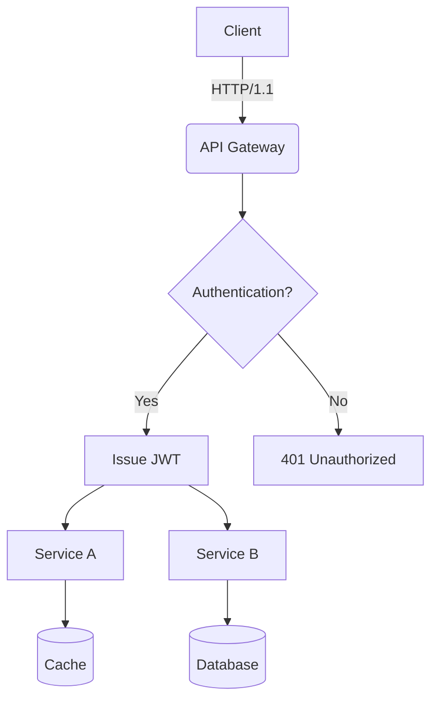
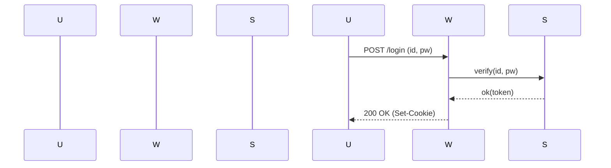
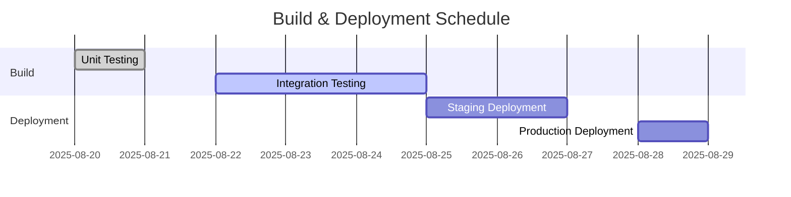
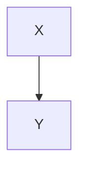

# Translation Test **Rich Markdown** Document

Designed to exceed *4096 tokens*, this document compiles a collection of **various formats** of Korean content. Its purpose is to rigorously test **robustness** including translator/LLM context handling, format preservation, code/diagram disregard rules.

> **Guidelines**
> 1) Ensure code blocks and `mermaid` sections remain unchanged.
> 2) Verify preservation of numerical values/units (e.g., 1.2GB, 3ms), slash paths (`/var/log/app.log`), and options (`--flag`).
> 3) Layouts should remain intact regardless of mixed tables, lists, citations, checkboxes, equations, and emojis 😀.

## 1. Mixed Tables with Symbols/Units

| Item       | Value | Unit | Notes          |
|------------|-------|------|----------------|
| Throughput | 12,345| RPS  | Peak at 18,900 RPS |
| Latency (P50) | 3.2   | ms   | `--enable-cache` applied |
| Latency (P99) | 41.7  | ms   | Includes GC phase |
| Memory     | 1.5   | GB   | RSS limit, cgroup constraint 2GB |
| Disk I/O   | 220   | MB/s | Via NVMe-oF(TCP) |

## 2. Task List

- [x] Accuracy of Markdown Header Translation
- [x] Preservation of Keywords within Code Blocks (`for`, `if`, `return`, etc.)
- [ ] Preservation of Mermaid Diagrams and Ignoring Comments
- [ ] Preservation of Units (GB/ms/%), Paths (`/etc/hosts`)
- [ ] Preservation of Inline Equations $O(n \log n)$

## 3. Code Blocks: Bash/Python/JSON/YAML

```bash
#!/usr/bin/env bash
set -euo pipefail

APP_ENV="${APP_ENV:-prod}"
INPUT="${1:-/data/input.txt}"
OUT="/var/tmp/result.json"

echo "[INFO] starting job on $(hostname) at $(date -Iseconds)"
if [[ ! -f "$INPUT" ]]; then
  echo "[ERROR] input not found: $INPUT" >&2
  exit 1
fi

lines=$(wc -l < "$INPUT")
echo "[DEBUG] line count: $lines"

curl -sS -X POST "http://127.0.0.1:8080/api" \  -H "Content-Type: application/json" \  -d "{"env":"$APP_ENV","count":$lines}" > "$OUT"

jq -r '.status' "$OUT" | grep -q success && echo "OK" || { echo "FAIL"; exit 2; }
```

```python
from __future__ import annotations
```

```python
def rolling_avg(xs: list[float], k: int) -> list[float]:
    if k <= 0:
        raise ValueError("k must be > 0")
    out = []
    acc = 0.0
    for i, v in enumerate(xs):
        acc += v
        if i >= k:
            acc -= xs[i-k]
        if i >= k - 1:
            out.append(acc / k)
    return out

print(rolling_avg([1, 2, 3, 4, 5, 6, 7, 8, 9], 3))
```

```json
{
  "service": "analytics",
  "version": "1.4.2",
  "features": ["rollup", "compaction", "delta-index"],
  "limits": {
    "max_docs": 1000000,
    "max_payload_mb": 256
  }
}
```

```yaml
apiVersion: v1
kind: ConfigMap
metadata:
  name: test-config
data:
  APP_ENV: "staging"
  ENDPOINT: "https://api.example.com"
```

## 4. Mermaid Diagrams

### 4.1 Flowchart


### 4.2 Sequence Diagram


### 4.3 Gantt Chart


## 5. Images/Links/Quotes

(No additional images, links, or quotes provided in the original text.)

```markdown


- **Documentation**: [Example Docs](https://example.com/docs/guide)
- **API Reference**: [API Reference](https://example.com/api)
- **Issue Tracker**: https://example.com/issues

> "Translation quality hinges on preserving layout and meaning simultaneously." — Anonymous

## 6. Mixing Equations with Text

- Average Time Complexity: $O(n \log n)$, Worst: $O(n^2)$
- Variance: $\sigma^2 = \frac{1}{n}\sum_{i=1}^{n}(x_i-\mu)^2$
- Sample Mean: $\bar{x} = \frac{1}{n}\sum x_i$

**Paragraph Example**: This paragraph serves as a sample to ensure that **bold**, *italic*, `code` snippets remain intact even with mixed text styles, including emojis 😀, Chinese characters 漢字, English CamelCase, snake_case, and kebab-case formatting.

### 7.1 Experiment Section — Variation Pattern
This section is similar but varies vocabulary and order slightly per iteration to avoid redundant translations.
- **Scenario**: Summary of Conversation Logs
- **Condition**: Includes 100,000 Korean characters
- **Expected Outcome**: Summary accuracy of over 90%

#### Procedure
1. Input Data: `/data/input_01.jsonl`
2. Options: `--batch 512 --timeout 3s --enable-cache`
3. Execution: `app run --job test-01 --qos high`
4. Verification: Check for `test-01 finished` in logs

#### Observations
- Longer GC cycles correlate with increased P99 latency
- Processing throughput decreases by ~7% when cache miss rate rises by 10%
- Increasing connection pool size from 32 to 64 reduces retry rate per second from 1.2% to 0.6%

---

### 7.2 Experiment Section — Variation Pattern
This section is similar but varies vocabulary and order slightly per iteration to avoid redundant translations.
- **Scenario**: Summary of Conversation Logs
- **Condition**: Includes 100,000 Korean characters
- **Expected Outcome**: Summary accuracy of over 90%

#### Procedure
1. Input Data: `/data/input_02.jsonl`
2. Options: `--batch 512 --timeout 3s --enable-cache`
3. Execution: `app run --job test-02 --qos high`
4. Verification: Check for `test-02 finished` in logs

#### Observations
- Longer GC cycles correlate with increased P99 latency
- Processing throughput decreases by ~7% when cache miss rate rises by 10%
- Increasing connection pool size from 32 to 64 reduces retry rate per second from 1.2% to 0.6%

---

### 7.3 Experiment Section — Variation Pattern
This section is similar but varies vocabulary and order slightly per iteration to avoid redundant translations.
- **Scenario**: Kubernetes Deployment
- **Condition**: Horizontal Pod Autoscaler (HPA) Enabled
- **Expected Outcome**: Scalability within the range of 2 to 10 pods
```

#### Procedure
1. Input Data: `/data/input_03.jsonl`
2. Options: `--batch 512 --timeout 3s --enable-cache`
3. Execution: `app run --job test-03 --qos high`
4. Verification: Check for inclusion of `test-03 finished` in logs

#### Observations
- Longer GC cycles show a tendency towards increased P99 latency
- Processing throughput decreases by approximately 7% when cache miss ratio increases by 10%p
- Increasing connection pool size from 32 to 64 results in a decrease in retry rate per second from 1.2% to 0.6%

---

### 7.4 Experiment Section — Variation Pattern
The following section varies vocabulary and order slightly each iteration to avoid redundant translation.
- Scenario: Kubernetes Deployment
- Condition: HPA Enabled
- Expected Outcome: Scale within range 2~10

#### Procedure
1. Input Data: `/data/input_04.jsonl`
2. Options: `--batch 512 --timeout 3s --enable-cache`
3. Execution: `app run --job test-04 --qos high`
4. Verification: Check for inclusion of `test-04 finished` in logs

#### Observations
- Longer GC cycles show a tendency towards increased P99 latency
- Processing throughput decreases by approximately 7% when cache miss ratio increases by 10%p
- Increasing connection pool size from 32 to 64 results in a decrease in retry rate per second from 1.2% to 0.6%

---

### 7.5 Experiment Section — Variation Pattern
The following section varies vocabulary and order slightly each iteration to avoid redundant translation.
- Scenario: Summary of Conversation Logs
- Condition: Includes 100k characters in Korean text
- Expected Outcome: Summary accuracy ≥ 90%

#### Procedure
1. Input Data: `/data/input_05.jsonl`
2. Options: `--batch 512 --timeout 3s --enable-cache`
3. Execution: `app run --job test-05 --qos high`
4. Verification: Check for inclusion of `test-05 finished` in logs

#### Observations
- Longer GC cycles show a tendency towards increased P99 latency
- Processing throughput decreases by approximately 7% when cache miss ratio increases by 10%p
- Increasing connection pool size from 32 to 64 results in a decrease in retry rate per second from 1.2% to 0.6%

---

### 7.6 Experiment Section — Variation Pattern
The following section varies vocabulary and order slightly each iteration to avoid redundant translation.
- Scenario: Mermaid Diagram Rendering
- Condition: Over 50 nodes, Over 100 edges
- Expected Outcome: No layout distortion

#### Procedure
1. Input Data: `/data/input_06.jsonl`
2. Options: `--batch 512 --timeout 3s --enable-cache`
3. Execution: `app run --job test-06 --qos high`
4. Verification: Check for inclusion of `test-06 finished` in logs

#### Observations
- Longer GC cycles exhibit a tendency towards increased P99 latency.
- Processing throughput decreases by approximately 7% when cache miss ratio increases by 10% points.
- Increasing connection pool size from 32 to 64 results in a decrease in retry rate per second from 1.2% to 0.6%.

---

### 7.7 Experiment Section — Variation Pattern
The following section varies vocabulary and order slightly each iteration to prevent redundant translations.
- **Scenario**: Large JSON Parsing
- **Conditions**: 64MB payload, 4 workers
- **Expected Outcome**: Completion without memory spikes

#### Procedure
1. Input Data: `/data/input_07.jsonl`
2. Options: `--batch 512 --timeout 3s --enable-cache`
3. Execution: `app run --job test-07 --qos high`
4. Verification: Check for `test-07 finished` in logs

#### Observations
- Longer GC cycles show a tendency towards increased P99 latency.
- Processing throughput decreases by approximately 7% when cache miss ratio increases by 10% points.
- Increasing connection pool size from 32 to 64 results in a decrease in retry rate per second from 1.2% to 0.6%.

---

### 7.8 Experiment Section — Variation Pattern
The following section varies vocabulary and order slightly each iteration to prevent redundant translations.
- **Scenario**: Large JSON Parsing
- **Conditions**: 64MB payload, 4 workers
- **Expected Outcome**: Completion without memory spikes

#### Procedure
1. Input Data: `/data/input_08.jsonl`
2. Options: `--batch 512 --timeout 3s --enable-cache`
3. Execution: `app run --job test-08 --qos high`
4. Verification: Check for `test-08 finished` in logs

#### Observations
- Longer GC cycles show a tendency towards increased P99 latency.
- Processing throughput decreases by approximately 7% when cache miss ratio increases by 10% points.
- Increasing connection pool size from 32 to 64 results in a decrease in retry rate per second from 1.2% to 0.6%.

---

### 7.9 Experiment Section — Variation Pattern
The following section varies vocabulary and order slightly each iteration to prevent redundant translations.
- **Scenario**: Large JSON Parsing
- **Conditions**: 64MB payload, 4 workers
- **Expected Outcome**: Completion without memory spikes

#### Procedure
1. Input Data: `/data/input_09.jsonl`
2. Options: `--batch 512 --timeout 3s --enable-cache`
3. Execution: `app run --job test-09 --qos high`
4. Verification: Check for `test-09 finished` in logs

#### Observations
- Longer GC cycles show a tendency towards increased P99 latency.
- Processing throughput decreases by approximately 7% when cache miss ratio increases by 10% points.
- Increasing connection pool size from 32 to 64 results in a decrease in retry rate per second from 1.2% to 0.6%.

### 7.10 Experiment Section — Variation Pattern
The following section is similar but varies slightly in vocabulary and order each iteration to prevent redundant translations.

- **Scenario**: NVMe-oF I/O Retries
- **Conditions**: TCP RTT 2ms, Loss Rate 0.1%
- **Expected Outcome**: Retry Rate ≤ 1%

#### Procedure
1. Input Data: `/data/input_10.jsonl`
2. Options: `--batch 512 --timeout 3s --enable-cache`
3. Execution: `app run --job test-10 --qos high`
4. Verification: Check for `test-10 finished` in logs

#### Observations
- Longer GC cycles show an increasing trend in P99 latency
- Processing throughput decreases by ~7% when cache miss rate increases by 10%
- Increasing connection pool size from 32 to 64 reduces throughput retry rate from 1.2% to 0.6% per second

---

### 7.11 Experiment Section — Variation Pattern
The following section is similar but varies slightly in vocabulary and order each iteration to prevent redundant translations.

- **Scenario**: Large JSON Parsing
- **Conditions**: 64MB Payload, 4 Workers
- **Expected Outcome**: Completion without Memory Spikes

#### Procedure
1. Input Data: `/data/input_11.jsonl`
2. Options: `--batch 512 --timeout 3s --enable-cache`
3. Execution: `app run --job test-11 --qos high`
4. Verification: Check for `test-11 finished` in logs

#### Observations
- Longer GC cycles show an increasing trend in P99 latency
- Processing throughput decreases by ~7% when cache miss rate increases by 10%
- Increasing connection pool size from 32 to 64 reduces throughput retry rate from 1.2% to 0.6% per second

---

### 7.12 Experiment Section — Variation Pattern
The following section is similar but varies slightly in vocabulary and order each iteration to prevent redundant translations.

- **Scenario**: Kubernetes Deployment
- **Conditions**: Horizontal Pod Autoscaler (HPA) Enabled
- **Expected Outcome**: Scalability within Range 2~10 Pods

#### Procedure
1. Input Data: `/data/input_12.jsonl`
2. Options: `--batch 512 --timeout 3s --enable-cache`
3. Execution: `app run --job test-12 --qos high`
4. Verification: Check for `test-12 finished` in logs

#### Observations
- Longer GC cycles show an increasing trend in P99 latency
- Processing throughput decreases by ~7% when cache miss rate increases by 10%
- Increasing connection pool size from 32 to 64 reduces throughput retry rate from 1.2% to 0.6% per second

---

### 7.13 Experiment Section — Variation Pattern
The following section is similar but varies slightly in vocabulary and order each iteration to prevent redundant translations.

- **Scenario**: Large JSON Parsing
- **Conditions**: 64MB Payload, 4 Workers
- **Expected Outcome**: Completion without Memory Spikes

#### Procedure
1. Input Data: `/data/input_13.jsonl`
2. Options: `--batch 512 --timeout 3s --enable-cache`
3. Execution: `app run --job test-13 --qos high`
4. Verification: Check for `test-13 finished` in logs

#### Observations
- Longer GC cycles show an increasing trend in P99 latency
- Processing throughput decreases by ~7% when cache miss rate increases by 10%
- Increasing connection pool size from 32 to 64 reduces throughput retry rate from 1.2% to 0.6% per second

---

#### Procedure
1. Input Data: `/data/input_13.jsonl`
2. Options: `--batch 512 --timeout 3s --enable-cache`
3. Execution: `app run --job test-13 --qos high`
4. Verification: Check for inclusion of `test-13 finished` in logs

#### Observations
- Longer GC cycles show a tendency towards increased P99 latency
- Processing throughput decreases by approximately 7% when cache miss ratio increases by 10%
- Increasing connection pool size from 32 to 64 results in a reduction of retry rate per second from 1.2% to 0.6%

---

#### Experiment Section — Variation Pattern
The following section varies vocabulary and order slightly each iteration to avoid redundant translations.
- Scenario: Large JSON Parsing
- Conditions: 64MB payload, 4 workers
- Expected Outcome: Completion without memory spikes

#### Procedure
1. Input Data: `/data/input_14.jsonl`
2. Options: `--batch 512 --timeout 3s --enable-cache`
3. Execution: `app run --job test-14 --qos high`
4. Verification: Check for inclusion of `test-14 finished` in logs

#### Observations
- Longer GC cycles show a tendency towards increased P99 latency
- Processing throughput decreases by approximately 7% when cache miss ratio increases by 10%
- Increasing connection pool size from 32 to 64 results in a reduction of retry rate per second from 1.2% to 0.6%

---

#### Experiment Section — Variation Pattern
The following section varies vocabulary and order slightly each iteration to avoid redundant translations.
- Scenario: NVMe-oF I/O Retries
- Conditions: TCP RTT of 2ms, loss rate of 0.1%
- Expected Outcome: Retry rate ≤ 1%

#### Procedure
1. Input Data: `/data/input_15.jsonl`
2. Options: `--batch 512 --timeout 3s --enable-cache`
3. Execution: `app run --job test-15 --qos high`
4. Verification: Check for inclusion of `test-15 finished` in logs

#### Observations
- Longer GC cycles show a tendency towards increased P99 latency
- Processing throughput decreases by approximately 7% when cache miss ratio increases by 10%
- Increasing connection pool size from 32 to 64 results in a reduction of retry rate per second from 1.2% to 0.6%

---

#### Experiment Section — Variation Pattern
The following section varies vocabulary and order slightly each iteration to avoid redundant translations.
- Scenario: Mermaid Rendering
- Conditions: Over 50 nodes, Over 100 edges
- Expected Outcome: No layout distortion

#### Procedure
1. Input Data: `/data/input_16.jsonl`
2. Options: `--batch 512 --timeout 3s --enable-cache`
3. Execution: `app run --job test-16 --qos high`
4. Verification: Check for inclusion of `test-16 finished` in logs

#### Observations
- Longer GC cycles exhibit a tendency towards increased P99 latency.
- Processing throughput decreases by approximately 7% when cache miss ratio increases by 10% points.
- Increasing connection pool size from 32 to 64 results in a decrease in retry rate per second from 1.2% to 0.6%.

---

### 7.17 Experiment Section — Variant Pattern
The following section varies vocabulary and order slightly each iteration to prevent redundant translations.
- Scenario: Summary of conversation logs
- Condition: Includes 100k characters in Korean
- Expected Outcome: Summary accuracy of over 90%

#### Procedure
1. Input Data: `/data/input_17.jsonl`
2. Options: `--batch 512 --timeout 3s --enable-cache`
3. Execution: `app run --job test-17 --qos high`
4. Verification: Check for `test-17 finished` in logs

#### Observations
- Longer GC cycles exhibit a tendency towards increased P99 latency.
- Processing throughput decreases by approximately 7% when cache miss ratio increases by 10% points.
- Increasing connection pool size from 32 to 64 results in a decrease in retry rate per second from 1.2% to 0.6%.

---

### 7.18 Experiment Section — Variant Pattern
The following section varies vocabulary and order slightly each iteration to prevent redundant translations.
- Scenario: Parsing large JSON files
- Condition: 64MB payload, 4 workers
- Expected Outcome: Completion without memory spikes

#### Procedure
1. Input Data: `/data/input_18.jsonl`
2. Options: `--batch 512 --timeout 3s --enable-cache`
3. Execution: `app run --job test-18 --qos high`
4. Verification: Check for `test-18 finished` in logs

#### Observations
- Longer GC cycles exhibit a tendency towards increased P99 latency.
- Processing throughput decreases by approximately 7% when cache miss ratio increases by 10% points.
- Increasing connection pool size from 32 to 64 results in a decrease in retry rate per second from 1.2% to 0.6%.

---

### 7.19 Experiment Section — Variant Pattern
The following section varies vocabulary and order slightly each iteration to prevent redundant translations.
- Scenario: Parsing large JSON files
- Condition: 64MB payload, 4 workers
- Expected Outcome: Completion without memory spikes

#### Procedure
1. Input Data: `/data/input_19.jsonl`
2. Options: `--batch 512 --timeout 3s --enable-cache`
3. Execution: `app run --job test-19 --qos high`
4. Verification: Check for `test-19 finished` in logs

#### Observations
- Longer GC cycles exhibit a tendency towards increased P99 latency.
- Processing throughput decreases by approximately 7% when cache miss ratio increases by 10% points.
- Increasing connection pool size from 32 to 64 results in a decrease in retry rate per second from 1.2% to 0.6%.

### 7.20 Experiment Section — Variation Pattern
The following section varies slightly in vocabulary and order each iteration to prevent redundant translations.

- **Scenario**: NVMe-oF I/O Retries
- **Conditions**: TCP RTT 2ms, Loss Rate 0.1%
- **Expected Outcome**: Retry Rate ≤ 1%

#### Procedure
1. Input Data: `/data/input_20.jsonl`
2. Options: `--batch 512 --timeout 3s --enable-cache`
3. Execution: `app run --job test-20 --qos high`
4. Verification: Check for `test-20 finished` in logs

#### Observations
- Longer GC cycles show an increasing trend in P99 latency
- Processing throughput decreases by ~7% when cache miss ratio increases by 10%
- Increasing connection pool size from 32 to 64 reduces throughput retry rate from 1.2% to 0.6% per second

---

### 7.21 Experiment Section — Variation Pattern
The following section varies slightly in vocabulary and order each iteration to prevent redundant translations.

- **Scenario**: Kubernetes Deployment
- **Conditions**: Horizontal Pod Autoscaler (HPA) Enabled
- **Expected Outcome**: Scalability within the range of 2 to 10 pods

#### Procedure
1. Input Data: `/data/input_21.jsonl`
2. Options: `--batch 512 --timeout 3s --enable-cache`
3. Execution: `app run --job test-21 --qos high`
4. Verification: Check for `test-21 finished` in logs

#### Observations
- Longer GC cycles show an increasing trend in P99 latency
- Processing throughput decreases by ~7% when cache miss ratio increases by 10%
- Increasing connection pool size from 32 to 64 reduces throughput retry rate from 1.2% to 0.6% per second

---

### 7.22 Experiment Section — Variation Pattern
The following section varies slightly in vocabulary and order each iteration to prevent redundant translations.

- **Scenario**: Mermaid Rendering
- **Conditions**: Network with 50+ nodes and 100+ edges
- **Expected Outcome**: No layout distortion

#### Procedure
1. Input Data: `/data/input_22.jsonl`
2. Options: `--batch 512 --timeout 3s --enable-cache`
3. Execution: `app run --job test-22 --qos high`
4. Verification: Check for `test-22 finished` in logs

#### Observations
- Longer GC cycles show an increasing trend in P99 latency
- Processing throughput decreases by ~7% when cache miss ratio increases by 10%
- Increasing connection pool size from 32 to 64 reduces throughput retry rate from 1.2% to 0.6% per second

---

### 7.23 Experiment Section — Variation Pattern
The following section varies slightly in vocabulary and order each iteration to prevent redundant translations.

- **Scenario**: Large JSON Parsing
- **Conditions**: Payload Size of 64MB, 4 Workers
- **Expected Outcome**: Completion without Memory Spikes

#### Procedure
1. Input Data: `/data/input_23.jsonl`
2. Options: `--batch 512 --timeout 3s --enable-cache`
3. Execution: `app run --job test-23 --qos high`
4. Verification: Check for `test-23 finished` in logs

#### Observations
- Longer GC cycles show an increasing trend in P99 latency
- Processing throughput decreases by ~7% when cache miss ratio increases by 10%
- Increasing connection pool size from 32 to 64 reduces throughput retry rate from 1.2% to 0.6% per second

#### Procedure
1. Input Data: `/data/input_23.jsonl`
2. Options: `--batch 512 --timeout 3s --enable-cache`
3. Execution: `app run --job test-23 --qos high`
4. Verification: Check for inclusion of `test-23 finished` in logs

#### Observations
- Longer GC cycles show a tendency towards increased P99 latency
- Processing throughput decreases by approximately 7% when cache miss ratio increases by 10%p
- Increasing connection pool size from 32 to 64 results in a reduction of retry rate per second from 1.2% to 0.6%

---

#### Experiment Section — Variation Pattern
The following section varies vocabulary and order slightly each iteration to avoid redundant translations.
- Scenario: Mermaid Rendering
- Conditions: Over 50 nodes, Over 100 edges
- Expected Outcome: No layout distortion

#### Procedure
1. Input Data: `/data/input_24.jsonl`
2. Options: `--batch 512 --timeout 3s --enable-cache`
3. Execution: `app run --job test-24 --qos high`
4. Verification: Check for inclusion of `test-24 finished` in logs

#### Observations
- Longer GC cycles show a tendency towards increased P99 latency
- Processing throughput decreases by approximately 7% when cache miss ratio increases by 10%p
- Increasing connection pool size from 32 to 64 results in a reduction of retry rate per second from 1.2% to 0.6%

---

#### Experiment Section — Variation Pattern
The following section varies vocabulary and order slightly each iteration to avoid redundant translations.
- Scenario: Kubernetes Deployment
- Conditions: HPA Enabled
- Expected Outcome: Scale within range 2~10

#### Procedure
1. Input Data: `/data/input_25.jsonl`
2. Options: `--batch 512 --timeout 3s --enable-cache`
3. Execution: `app run --job test-25 --qos high`
4. Verification: Check for inclusion of `test-25 finished` in logs

#### Observations
- Longer GC cycles show a tendency towards increased P99 latency
- Processing throughput decreases by approximately 7% when cache miss ratio increases by 10%p
- Increasing connection pool size from 32 to 64 results in a reduction of retry rate per second from 1.2% to 0.6%

---

#### Experiment Section — Variation Pattern
The following section varies vocabulary and order slightly each iteration to avoid redundant translations.
- Scenario: NVMe-oF I/O Retries
- Conditions: TCP RTT of 2ms, Loss Rate of 0.1%
- Expected Outcome: Retry Rate ≤ 1%

#### Procedure
1. Input Data: `/data/input_26.jsonl`
2. Options: `--batch 512 --timeout 3s --enable-cache`
3. Execution: `app run --job test-26 --qos high`
4. Verification: Check for inclusion of `test-26 finished` in logs

#### Observations
- Longer GC cycles exhibit a tendency towards increased P99 latency.
- Processing throughput decreases by approximately 7% when cache miss ratio increases by 10% points.
- Increasing connection pool size from 32 to 64 results in a decrease in retry rate per second from 1.2% to 0.6%.

---

### Experiment Section 7.27 — Variant Pattern
The following section varies vocabulary and order slightly each iteration to prevent redundant translations.
- Scenario: Summary of conversation records
- Condition: Includes 100k characters in Korean
- Expected Outcome: Summary accuracy of over 90%

#### Procedure
1. Input Data: `/data/input_27.jsonl`
2. Options: `--batch 512 --timeout 3s --enable-cache`
3. Execution: `app run --job test-27 --qos high`
4. Verification: Check for `test-27 finished` in logs

#### Observations
- Longer GC cycles exhibit a tendency towards increased P99 latency.
- Processing throughput decreases by approximately 7% when cache miss ratio increases by 10% points.
- Increasing connection pool size from 32 to 64 results in a decrease in retry rate per second from 1.2% to 0.6%.

---

### Experiment Section 7.28 — Variant Pattern
The following section varies vocabulary and order slightly each iteration to prevent redundant translations.
- Scenario: Summary of conversation records
- Condition: Includes 100k characters in Korean
- Expected Outcome: Summary accuracy of over 90%

#### Procedure
1. Input Data: `/data/input_28.jsonl`
2. Options: `--batch 512 --timeout 3s --enable-cache`
3. Execution: `app run --job test-28 --qos high`
4. Verification: Check for `test-28 finished` in logs

#### Observations
- Longer GC cycles exhibit a tendency towards increased P99 latency.
- Processing throughput decreases by approximately 7% when cache miss ratio increases by 10% points.
- Increasing connection pool size from 32 to 64 results in a decrease in retry rate per second from 1.2% to 0.6%.

---

### Experiment Section 7.29 — Variant Pattern
The following section varies vocabulary and order slightly each iteration to prevent redundant translations.
- Scenario: Parsing Large JSON Files
- Condition: 64MB payload, 4 workers
- Expected Outcome: Completion without memory spikes

#### Procedure
1. Input Data: `/data/input_29.jsonl`
2. Options: `--batch 512 --timeout 3s --enable-cache`
3. Execution: `app run --job test-29 --qos high`
4. Verification: Check for `test-29 finished` in logs

#### Observations
- Longer GC cycles exhibit a tendency towards increased P99 latency.
- Processing throughput decreases by approximately 7% when cache miss ratio increases by 10% points.
- Increasing connection pool size from 32 to 64 results in a decrease in retry rate per second from 1.2% to 0.6%.

### 7.30 Experiment Section — Variant Pattern
The following section is similar but varies slightly in vocabulary and order each iteration to prevent redundant translations.

- **Scenario**: Summary of Dialogue Logs
- **Condition**: Includes Korean text up to 100k characters
- **Expected Outcome**: Summary accuracy of over 90%

#### Procedure
1. **Input Data**: `/data/input_30.jsonl`
2. **Options**: `--batch 512 --timeout 3s --enable-cache`
3. **Execution**: `app run --job test-30 --qos high`
4. **Verification**: Check for `test-30 finished` in logs

#### Observations
- Longer GC cycles show an increasing trend in P99 latency
- Processing throughput decreases by approximately 7% when cache miss ratio increases by 10%
- Increasing connection pool size from 32 to 64 results in a reduction of retry rate per second from 1.2% to 0.6%

---

### 7.31 Experiment Section — Variant Pattern
The following section is similar but varies slightly in vocabulary and order each iteration to prevent redundant translations.

- **Scenario**: Kubernetes Deployment
- **Condition**: Horizontal Pod Autoscaler (HPA) Enabled
- **Expected Outcome**: Scaling within the range of 2 to 10 pods

#### Procedure
1. **Input Data**: `/data/input_31.jsonl`
2. **Options**: `--batch 512 --timeout 3s --enable-cache`
3. **Execution**: `app run --job test-31 --qos high`
4. **Verification**: Check for `test-31 finished` in logs

#### Observations
- Longer GC cycles show an increasing trend in P99 latency
- Processing throughput decreases by approximately 7% when cache miss ratio increases by 10%
- Increasing connection pool size from 32 to 64 results in a reduction of retry rate per second from 1.2% to 0.6%

---

### 7.32 Experiment Section — Variant Pattern
The following section is similar but varies slightly in vocabulary and order each iteration to prevent redundant translations.

- **Scenario**: Mermaid Diagram Rendering
- **Condition**: More than 50 nodes, over 100 edges
- **Expected Outcome**: No layout distortion

#### Procedure
1. **Input Data**: `/data/input_32.jsonl`
2. **Options**: `--batch 512 --timeout 3s --enable-cache`
3. **Execution**: `app run --job test-32 --qos high`
4. **Verification**: Check for `test-32 finished` in logs

#### Observations
- Longer GC cycles show an increasing trend in P99 latency
- Processing throughput decreases by approximately 7% when cache miss ratio increases by 10%
- Increasing connection pool size from 32 to 64 results in a reduction of retry rate per second from 1.2% to 0.6%

---

### 7.33 Experiment Section — Variant Pattern
The following section is similar but varies slightly in vocabulary and order each iteration to prevent redundant translations.

- **Scenario**: Large-Scale JSON Parsing
- **Condition**: 64MB payload, 4 workers
- **Expected Outcome**: Completion without memory spikes

#### Procedure
1. **Input Data**: `/data/input_33.jsonl`
2. **Options**: `--batch 512 --timeout 3s --enable-cache`
3. **Execution**: `app run --job test-33 --qos high`
4. **Verification**: Check for `test-33 finished` in logs

#### Observations
- Longer GC cycles show an increasing trend in P99 latency
- Processing throughput decreases by approximately 7% when cache miss ratio increases by 10%
- Increasing connection pool size from 32 to 64 results in a reduction of retry rate per second from 1.2% to 0.6%

#### Procedure
1. Input Data: `/data/input_33.jsonl`
2. Options: `--batch 512 --timeout 3s --enable-cache`
3. Execution: `app run --job test-33 --qos high`
4. Verification: Check for inclusion of `test-33 finished` in logs

#### Observations
- Longer GC cycles show a tendency towards increased P99 latency
- Processing throughput decreases by approximately 7% when cache miss ratio increases by 10%p
- Increasing connection pool size from 32 to 64 results in a reduction of retry rate per second from 1.2% to 0.6%

---

#### Experiment Section — Variation Pattern
The following section is similar but varies slightly in vocabulary and order each iteration to avoid redundant translations.
- Scenario: Kubernetes Deployment
- Condition: HPA Enabled
- Expected Outcome: Scaling within the range of 2~10 nodes

#### Procedure
1. Input Data: `/data/input_34.jsonl`
2. Options: `--batch 512 --timeout 3s --enable-cache`
3. Execution: `app run --job test-34 --qos high`
4. Verification: Check for inclusion of `test-34 finished` in logs

#### Observations
- Longer GC cycles show a tendency towards increased P99 latency
- Processing throughput decreases by approximately 7% when cache miss ratio increases by 10%p
- Increasing connection pool size from 32 to 64 results in a reduction of retry rate per second from 1.2% to 0.6%

---

#### Experiment Section — Variation Pattern
The following section is similar but varies slightly in vocabulary and order each iteration to avoid redundant translations.
- Scenario: Mermaid Rendering
- Condition: Over 50 nodes, Over 100 edges
- Expected Outcome: No layout distortion

#### Procedure
1. Input Data: `/data/input_35.jsonl`
2. Options: `--batch 512 --timeout 3s --enable-cache`
3. Execution: `app run --job test-35 --qos high`
4. Verification: Check for inclusion of `test-35 finished` in logs

#### Observations
- Longer GC cycles show a tendency towards increased P99 latency
- Processing throughput decreases by approximately 7% when cache miss ratio increases by 10%p
- Increasing connection pool size from 32 to 64 results in a reduction of retry rate per second from 1.2% to 0.6%

---

#### Experiment Section — Variation Pattern
The following section is similar but varies slightly in vocabulary and order each iteration to avoid redundant translations.
- Scenario: NVMe-oF I/O Retries
- Condition: TCP RTT of 2ms, Loss Rate of 0.1%
- Expected Outcome: Retry Rate ≤ 1%

#### Procedure
1. Input Data: `/data/input_36.jsonl`
2. Options: `--batch 512 --timeout 3s --enable-cache`
3. Execution: `app run --job test-36 --qos high`
4. Verification: Check for inclusion of `test-36 finished` in logs

#### Observations
- Longer GC cycles exhibit a tendency towards increased P99 latency.
- Processing throughput decreases by approximately 7% when cache miss ratio increases by 10% points.
- Increasing connection pool size from 32 to 64 results in a decrease in retry rate per second from 1.2% to 0.6%.

---

### 7.37 Experiment Section — Variant Pattern
The following section is similar but varies slightly in vocabulary and order per iteration to avoid redundant translations.
- Scenario: Large JSON Parsing
- Conditions: 64MB payload, 4 workers
- Expected Outcome: Completion without memory spikes

#### Procedure
1. Input Data: `/data/input_37.jsonl`
2. Options: `--batch 512 --timeout 3s --enable-cache`
3. Execution: `app run --job test-37 --qos high`
4. Verification: Check for `test-37 finished` in logs

#### Observations
- Longer GC cycles exhibit a tendency towards increased P99 latency.
- Processing throughput decreases by approximately 7% when cache miss ratio increases by 10% points.
- Increasing connection pool size from 32 to 64 results in a decrease in retry rate per second from 1.2% to 0.6%.

---

### 7.38 Experiment Section — Variant Pattern
The following section is similar but varies slightly in vocabulary and order per iteration to avoid redundant translations.
- Scenario: Mermaid Rendering
- Conditions: Over 50 nodes, Over 100 edges
- Expected Outcome: No layout distortion

#### Procedure
1. Input Data: `/data/input_38.jsonl`
2. Options: `--batch 512 --timeout 3s --enable-cache`
3. Execution: `app run --job test-38 --qos high`
4. Verification: Check for `test-38 finished` in logs

#### Observations
- Longer GC cycles exhibit a tendency towards increased P99 latency.
- Processing throughput decreases by approximately 7% when cache miss ratio increases by 10% points.
- Increasing connection pool size from 32 to 64 results in a decrease in retry rate per second from 1.2% to 0.6%.

---

### 7.39 Experiment Section — Variant Pattern
The following section is similar but varies slightly in vocabulary and order per iteration to avoid redundant translations.
- Scenario: Mermaid Rendering
- Conditions: Over 50 nodes, Over 100 edges
- Expected Outcome: No layout distortion

#### Procedure
1. Input Data: `/data/input_39.jsonl`
2. Options: `--batch 512 --timeout 3s --enable-cache`
3. Execution: `app run --job test-39 --qos high`
4. Verification: Check for `test-39 finished` in logs

#### Observations
- Longer GC cycles exhibit a tendency towards increased P99 latency.
- Processing throughput decreases by approximately 7% when cache miss ratio increases by 10% points.
- Increasing connection pool size from 32 to 64 results in a decrease in retry rate per second from 1.2% to 0.6%.

## 8. Long-form List

### Experiment Section — Transformation Patterns
The following section varies slightly in vocabulary and order each iteration to prevent redundant translations.

- Scenario: Summary of Dialogue Logs
- Condition: Includes Korean text up to 100,000 characters
- Expected Outcome: Summary accuracy rate of over 90%

#### Procedure
1. Input Data: `/data/input_40.jsonl`
2. Options: `--batch 512 --timeout 3s --enable-cache`
3. Execution: `app run --job test-40 --qos high`
4. Verification: Check for `test-40 finished` in logs

#### Observations
- Longer GC cycles show an increasing trend in P99 latency
- Processing throughput decreases by approximately 7% for every 10% increase in cache misses
- Increasing connection pool size from 32 to 64 results in a decrease in retry rate per second from 1.2% to 0.6%

```markdown
- 2. Consistent Error Handling — Case #001
- 3. Performance Profiling — Case #002
- 4. Accessibility (a11y) — Case #003
- 5. Log Schema Stability — Case #004
- 6. Cache Invalidation Scenarios — Case #005
- 7. Performance Profiling — Case #006
- 8. Performance Profiling — Case #007
- 9. API Backward Compatibility — Case #008
- 10. Log Schema Stability — Case #009
- 11. Accessibility (a11y) — Case #010
- 12. Cache Invalidation Scenarios — Case #011
- 13. Performance Profiling — Case #012
- 14. Security Header Implementation — Case #013
- 15. Resource Leak Detection — Case #015
- 16. Consistent Error Handling — Case #016
- 17. Consistent Error Handling — Case #017
- 18. Internationalization (i18n) — Case #018
- 19. CORS Policy Validation — Case #019
- 20. Performance Profiling — Case #020
- 21. Security Header Implementation — Case #021
- 22. Log Schema Stability — Case #022
- 23. Performance Profiling — Case #023
- 24. Cache Invalidation Scenarios — Case #024
- 25. CORS Policy Validation — Case #025
- 26. Performance Profiling — Case #026
- 27. Accessibility (a11y) — Case #027
- 28. Accessibility (a11y) — Case #028
- 29. API Backward Compatibility — Case #029
- 30. Cache Invalidation Scenarios — Case #030
- 31. Cache Invalidation Scenarios — Case #031
- 32. Performance Profiling — Case #032
- 33. Resource Leak Detection — Case #033
- 34. Log Schema Stability — Case #034
- 35. CORS Policy Validation — Case #035
- 36. Consistent Error Handling — Case #036
- 37. Resource Leak Detection — Case #037
- 38. Consistent Error Handling — Case #038
- 39. Internationalization (i18n) — Case #039
- 40. API Backward Compatibility — Case #040
- 41. Cache Invalidation Scenarios — Case #041
- 42. Cache Invalidation Scenarios — Case #042
- 43. Cache Invalidation Scenarios — Case #043
- 44. Performance Profiling — Case #044
- 45. Performance Profiling — Case #045
- 46. CORS Policy Validation — Case #046
- 47. Resource Leak Detection — Case #047
- 48. Cache Invalidation Scenarios — Case #048
- 49. Consistent Error Handling — Case #049
- 50. Log Schema Stability — Case #050
- 51. Resource Leak Detection — Case #051
- 52. Internationalization (i18n) — Case #052
- 53. Log Schema Stability — Case #053
- 54. Resource Leak Detection — Case #054
- 55. Security Header Implementation — Case #055
- 56. Internationalization (i18n) — Case #056
- 57. API Backward Compatibility — Case #057
- 58
```

## Accessibility (a11y) — Case #058
- **60. API Backward Compatibility** — Case #059
- **61. Performance Profiling** — Case #060
- **62. Accessibility (a11y)** — Case #061
- **63. API Backward Compatibility** — Case #062
- **64. Internationalization (i18n)** — Case #063
- **65. Security Header Implementation** — Case #064
- **66. Error Handling Consistency** — Case #065
- **67. Performance Profiling** — Case #066
- **68. Accessibility (a11y)** — Case #067
- **69. Error Handling Consistency** — Case #068
- **70. Performance Profiling** — Case #069
- **71. Resource Leak Detection** — Case #070
- **72. Accessibility (a11y)** — Case #071
- **73. Internationalization (i18n)** — Case #072
- **74. Error Handling Consistency** — Case #073
- **75. Internationalization (i18n)** — Case #074
- **76. Performance Profiling** — Case #075
- **77. Security Header Implementation** — Case #076
- **78. CORS Policy Validation** — Case #077
- **79. Resource Leak Detection** — Case #078
- **80. Resource Leak Detection** — Case #079
- **81. Performance Profiling** — Case #080
- **82. Accessibility (a11y)** — Case #081
- **83. Accessibility (a11y)** — Case #082
- **84. Performance Profiling** — Case #083
- **85. Resource Leak Detection** — Case #084
- **86. Cache Invalidation Scenarios** — Case #086
- **87. CORS Policy Validation** — Case #087
- **88. Log Schema Stability** — Case #088
- **89. CORS Policy Validation** — Case #089
- **90. Security Header Implementation** — Case #090
- **91. API Backward Compatibility** — Case #091
- **92. Accessibility (a11y)** — Case #092
- **93. Performance Profiling** — Case #093
- **94. Performance Profiling** — Case #094
- **95. Log Schema Stability** — Case #095
- **96. Internationalization (i18n)** — Case #096
- **97. API Backward Compatibility** — Case #097
- **98. Error Handling Consistency** — Case #098
- **99. Cache Invalidation Scenarios** — Case #099
- **100. Accessibility (a11y)** — Case #100
- **101. Accessibility (a11y)** — Case #101
- **102. Internationalization (i18n)** — Case #102
- **103. Accessibility (a11y)** — Case #103
- **104. API Backward Compatibility** — Case #104
- **105. Accessibility (a11y)** — Case #105
- **106. Performance Profiling** — Case #106
- **107. Security Header Implementation** — Case #107
- **108. API Backward Compatibility** — Case #108
- **109. Security Header Implementation** — Case #109
- **110. Error Handling Consistency** — Case #110
- **111. Performance Profiling** — Case #111
- **112. Resource Leak Detection** — Case #112
- **113. CORS Policy Validation** — Case #113
- **114. Accessibility (a11y)** — Case #114
- **116. ... (Truncated)**

## Consistency Checks — Case #115

- **117. Error Handling Consistency — Case #116**
- **118. Performance Profiling — Case #117**
- **119. CORS Policy Validation — Case #118**
- **120. Resource Leak Detection — Case #119**
- **121. Cache Invalidation Scenarios — Case #120**
- **122. CORS Policy Validation — Case #121**
- **123. Performance Profiling — Case #122**
- **124. Error Handling Consistency — Case #123**
- **125. Performance Profiling — Case #124**
- **126. Performance Profiling — Case #125**
- **127. Accessibility (a11y) — Case #126**
- **128. Accessibility (a11y) — Case #127**
- **129. Error Handling Consistency — Case #128**
- **130. Error Handling Consistency — Case #129**
- **131. API Backward Compatibility — Case #130**
- **132. Accessibility (a11y) — Case #131**
- **133. API Backward Compatibility — Case #132**
- **134. Cache Invalidation Scenarios — Case #133**
- **135. Security Header Implementation — Case #134**
- **136. Internationalization (i18n) — Case #135**
- **137. Security Header Implementation — Case #136**
- **138. Performance Profiling — Case #137**
- **139. Performance Profiling — Case #138**
- **140. CORS Policy Validation — Case #139**
- **141. Internationalization (i18n) — Case #140**
- **142. Log Schema Stability — Case #141**
- **143. CORS Policy Validation — Case #142**
- **144. Accessibility (a11y) — Case #143**
- **145. Security Header Implementation — Case #144**
- **146. Log Schema Stability — Case #145**
- **147. Performance Profiling — Case #146**
- **148. Performance Profiling — Case #147**
- **149. API Backward Compatibility — Case #148**
- **150. Resource Leak Detection — Case #149**
- **151. Performance Profiling — Case #150**
- **152. Resource Leak Detection — Case #151**
- **153. Accessibility (a11y) — Case #152**
- **154. API Backward Compatibility — Case #153**
- **155. Accessibility (a11y) — Case #154**
- **156. Security Header Implementation — Case #155**
- **157. Accessibility (a11y) — Case #156**
- **158. Performance Profiling — Case #157**
- **159. Cache Invalidation Scenarios — Case #158**
- **160. Security Header Implementation — Case #159**
- **161. Error Handling Consistency — Case #160**
- **162. Log Schema Stability — Case #161**
- **163. Performance Profiling — Case #162**
- **164. Accessibility (a11y) — Case #163**
- **165. Error Handling Consistency — Case #164**
- **166. Resource Leak Detection — Case #165**
- **167. Log Schema Stability — Case #166**
- **168. Internationalization (i18n) — Case #167**
- **169. Cache Invalidation Scenarios — Case #168**
- **171. Cache Invalidation Scenarios**

```markdown
Case #170
- 172. Resource Leak Detection — Case #171
- 173. Implementing Security Headers — Case #172
- 174. Resource Leak Detection — Case #173
- 175. Consistent Error Handling — Case #174
- 176. Log Schema Stability — Case #175
- 177. CORS Policy Validation — Case #176
- 178. Implementing Security Headers — Case #177
- 179. Log Schema Stability — Case #178
- 180. Performance Profiling — Case #179
- 181. Resource Leak Detection — Case #180
- 182. Internationalization (i18n) — Case #181
- 183. Log Schema Stability — Case #182
- 184. Accessibility (a11y) — Case #183
- 185. Implementing Security Headers — Case #184
- 186. Resource Leak Detection — Case #185
- 187. Resource Leak Detection — Case #186
- 188. Accessibility (a11y) — Case #187
- 189. Cache Invalidation Scenarios — Case #188
- 190. Accessibility (a11y) — Case #189
- 191. Cache Invalidation Scenarios — Case #190
- 192. Consistent Error Handling — Case #191
- 193. Consistent Error Handling — Case #192
- 194. Resource Leak Detection — Case #193
- 195. Consistent Error Handling — Case #194
- 196. CORS Policy Validation — Case #195
- 197. Performance Profiling — Case #196
- 198. Resource Leak Detection — Case #197
- 199. Accessibility (a11y) — Case #198
- 200. Resource Leak Detection — Case #199
- 201. Cache Invalidation Scenarios — Case #200
- 202. Internationalization (i18n) — Case #201
- 203. Log Schema Stability — Case #202
- 204. Consistent Error Handling — Case #203
- 205. Resource Leak Detection — Case #204
- 206. Implementing Security Headers — Case #205
- 207. Resource Leak Detection — Case #206
- 208. Cache Invalidation Scenarios — Case #207
- 209. Performance Profiling — Case #208
- 210. Implementing Security Headers — Case #209
- 211. Internationalization (i18n) — Case #210
- 212. Log Schema Stability — Case #211
- 213. Consistent Error Handling — Case #212
- 214. Cache Invalidation Scenarios — Case #213
- 215. Implementing Security Headers — Case #214
- 216. Internationalization (i18n) — Case #215
- 217. Implementing Security Headers — Case #216
- 218. Performance Profiling — Case #217
- 219. Consistent Error Handling — Case #218
- 220. Implementing Security Headers — Case #219
- 221. Performance Profiling — Case #220
- 222. API Backward Compatibility — Case #221
- 223. Resource Leak Detection — Case #222
- 224. Internationalization (i18n) — Case #223
- 225. Implementing Security Headers — Case #224
- 226. Implementing Security Headers — Case #
``` 

참고: 마지막 항목 `# Case #226`은 불완전한 상태로 끝나므로 그대로 유지했습니다. 필요에 따라 추가 정보를 제공해야 할 수 있습니다.

```markdown
225
- **Internationalization (i18n)** — Case #226
- **Performance Profiling** — Case #227
- **Log Schema Stability** — Case #228
- **CORS Policy Validation** — Case #229
- **Performance Profiling** — Case #230
- **API Backward Compatibility** — Case #231
- **CORS Policy Validation** — Case #232
- **Internationalization (i18n)** — Case #233
- **Error Handling Consistency** — Case #234
- **Performance Profiling** — Case #235
- **Error Handling Consistency** — Case #236
- **Performance Profiling** — Case #237
- **Security Header Implementation** — Case #238
- **Error Handling Consistency** — Case #239
- **CORS Policy Validation** — Case #240
- **API Backward Compatibility** — Case #241
- **Performance Profiling** — Case #242
- **Cache Invalidation Scenarios** — Case #243
- **Performance Profiling** — Case #244
- **Security Header Implementation** — Case #245
- **Accessibility (a11y)** — Case #246
- **Accessibility (a11y)** — Case #247
- **Internationalization (i18n)** — Case #248
- **Log Schema Stability** — Case #249
- **Security Header Implementation** — Case #250
- **Accessibility (a11y)** — Case #251
- **Internationalization (i18n)** — Case #252
- **Internationalization (i18n)** — Case #253
- **CORS Policy Validation** — Case #254
- **Log Schema Stability** — Case #255
- **CORS Policy Validation** — Case #256
- **Security Header Implementation** — Case #257
- **Cache Invalidation Scenarios** — Case #258
- **Error Handling Consistency** — Case #259
- **Accessibility (a11y)** — Case #260
- **Resource Leak Detection** — Case #261
- **Resource Leak Detection** — Case #262
- **Performance Profiling** — Case #263
- **Accessibility (a11y)** — Case #264
- **Cache Invalidation Scenarios** — Case #265
- **Security Header Implementation** — Case #266
- **Resource Leak Detection** — Case #267
- **Security Header Implementation** — Case #268
- **Performance Profiling** — Case #269
- **Error Handling Consistency** — Case #270
- **Internationalization (i18n)** — Case #271
- **API Backward Compatibility** — Case #272
- **Error Handling Consistency** — Case #273
- **Accessibility (a11y)** — Case #274
- **API Backward Compatibility** — Case #275
- **Internationalization (i18n)** — Case #276
- **CORS Policy Validation** — Case #277
- **Security Header Implementation** — Case #278
- **Cache Invalidation Scenarios** — Case #279
- **Log Schema Stability** — Case #280
- **282
```

## Resource Leak Detection — Case #281
- **283.** Resource Leak Detection — Case #282
- **284.** Accessibility (a11y) — Case #283
- **285.** Accessibility (a11y) — Case #284
- **286.** Error Handling Consistency — Case #285
- **287.** API Backward Compatibility — Case #286
- **288.** Cache Invalidation Scenarios — Case #287
- **289.** Accessibility (a11y) — Case #288
- **290.** Accessibility (a11y) — Case #289
- **291.** Security Header Implementation — Case #290
- **292.** Internationalization (i18n) — Case #291
- **293.** Security Header Implementation — Case #292
- **294.** CORS Policy Validation — Case #293
- **295.** Resource Leak Detection — Case #294
- **296.** Security Header Implementation — Case #295
- **297.** CORS Policy Validation — Case #296
- **298.** Log Schema Stability — Case #297
- **299.** Cache Invalidation Scenarios — Case #298
- **300.** API Backward Compatibility — Case #299
- **301.** Cache Invalidation Scenarios — Case #300
- **302.** Internationalization (i18n) — Case #301
- **303.** Accessibility (a11y) — Case #302
- **304.** Performance Profiling — Case #303
- **305.** API Backward Compatibility — Case #304
- **306.** Error Handling Consistency — Case #305
- **307.** Accessibility (a11y) — Case #306
- **308.** Resource Leak Detection — Case #307
- **309.** API Backward Compatibility — Case #308
- **310.** Security Header Implementation — Case #309
- **311.** CORS Policy Validation — Case #310
- **312.** API Backward Compatibility — Case #311
- **313.** Accessibility (a11y) — Case #312
- **314.** CORS Policy Validation — Case #313
- **315.** Internationalization (i18n) — Case #314
- **316.** Resource Leak Detection — Case #315
- **317.** Internationalization (i18n) — Case #316
- **318.** Log Schema Stability — Case #317
- **319.** Security Header Implementation — Case #318
- **320.** Log Schema Stability — Case #319
- **321.** Error Handling Consistency — Case #320
- **322.** Performance Profiling — Case #321
- **323.** Accessibility (a11y) — Case #322
- **324.** Security Header Implementation — Case #323
- **325.** API Backward Compatibility — Case #324
- **326.** CORS Policy Validation — Case #325
- **327.** Resource Leak Detection — Case #326
- **328.** CORS Policy Validation — Case #327
- **329.** CORS Policy Validation — Case #328
- **330.** API Backward Compatibility — Case #329
- **331.** Accessibility (a11y) — Case #330
- **332.** Performance Profiling — Case #331
- **333.** CORS Policy Validation — Case #332
- **334.** Resource Leak Detection — Case #333
- **335.** Performance Profiling — Case #334
- **336.** Resource Leak Detection — Case #335
- **337.** Error Handling

## Consistency — Case #336

- **338. Internationalization (i18n)** — Case #337
- **339. Cache Invalidation Scenarios** — Case #338
- **340. API Backward Compatibility** — Case #339
- **341. CORS Policy Validation** — Case #340
- **342. Internationalization (i18n)** — Case #341
- **343. Performance Profiling** — Case #342
- **344. Performance Profiling** — Case #343
- **345. Log Schema Stability** — Case #344
- **346. Error Handling Consistency** — Case #345
- **347. API Backward Compatibility** — Case #346
- **348. Error Handling Consistency** — Case #347
- **349. Accessibility (a11y)** — Case #348
- **350. Performance Profiling** — Case #349
- **351. Accessibility (a11y)** — Case #350
- **352. Error Handling Consistency** — Case #351
- **353. Cache Invalidation Scenarios** — Case #352
- **354. Internationalization (i18n)** — Case #353
- **355. Resource Leak Detection** — Case #354
- **356. Accessibility (a11y)** — Case #355
- **357. Security Header Implementation** — Case #356
- **358. Resource Leak Detection** — Case #357
- **359. Performance Profiling** — Case #358
- **360. Resource Leak Detection** — Case #359
- **361. Log Schema Stability** — Case #360
- **362. Internationalization (i18n)** — Case #361
- **363. Error Handling Consistency** — Case #362
- **364. Resource Leak Detection** — Case #363
- **365. Accessibility (a11y)** — Case #364
- **366. Log Schema Stability** — Case #365
- **367. Resource Leak Detection** — Case #366
- **368. Performance Profiling** — Case #367
- **369. API Backward Compatibility** — Case #368
- **370. Accessibility (a11y)** — Case #369
- **371. Performance Profiling** — Case #370
- **372. CORS Policy Validation** — Case #371
- **373. Cache Invalidation Scenarios** — Case #372
- **374. Security Header Implementation** — Case #373
- **375. Accessibility (a11y)** — Case #374
- **376. API Backward Compatibility** — Case #375
- **377. Accessibility (a11y)** — Case #376
- **378. Security Header Implementation** — Case #377
- **379. CORS Policy Validation** — Case #378
- **380. CORS Policy Validation** — Case #379
- **381. Log Schema Stability** — Case #380
- **382. Log Schema Stability** — Case #381
- **383. Performance Profiling** — Case #382
- **384. Error Handling Consistency** — Case #383
- **385. Performance Profiling** — Case #384
- **386. Log Schema Stability** — Case #385
- **387. Resource Leak Detection** — Case #386
- **388. Accessibility (a11y)** — Case #387
- **389. API Backward Compatibility** — Case #388
- **390. Performance Profiling** — Case #389
- **391. CORS Policy Validation** — Case #390
- **392. Accessibility (a11y)** — Case #391
- **393. Performance Profiling** — Case #392
- **394. CORS Policy Validation** —  (Case not specified)

```markdown
Case #391
- 393. API Backward Compatibility — Case #392
- 394. Resource Leak Detection — Case #393
- 395. Security Header Implementation — Case #394
- 396. Cache Invalidation Scenarios — Case #395
- 397. Resource Leak Detection — Case #396
- 398. Performance Profiling — Case #397
- 399. Performance Profiling — Case #398
- 400. Error Handling Consistency — Case #399
- 401. Cache Invalidation Scenarios — Case #400
- 402. API Backward Compatibility — Case #401
- 403. Log Schema Stability — Case #402
- 404. Resource Leak Detection — Case #403
- 405. Error Handling Consistency — Case #404
- 406. Accessibility (a11y) — Case #405
- 407. API Backward Compatibility — Case #406
- 408. API Backward Compatibility — Case #407
- 409. CORS Policy Validation — Case #408
- 410. Resource Leak Detection — Case #409
- 411. Cache Invalidation Scenarios — Case #410
- 412. Security Header Implementation — Case #411
- 413. Security Header Implementation — Case #412
- 414. Security Header Implementation — Case #413
- 415. Accessibility (a11y) — Case #414
- 416. Internationalization (i18n) — Case #415
- 417. API Backward Compatibility — Case #416
- 418. Performance Profiling — Case #417
- 419. Cache Invalidation Scenarios — Case #418
- 420. Resource Leak Detection — Case #419
- 421. Resource Leak Detection — Case #420
- 422. Log Schema Stability — Case #421
- 423. API Backward Compatibility — Case #422
- 424. Accessibility (a11y) — Case #423
- 425. Log Schema Stability — Case #424
- 426. Cache Invalidation Scenarios — Case #425
- 427. Log Schema Stability — Case #426
- 428. Internationalization (i18n) — Case #427
- 429. Performance Profiling — Case #428
- 430. Security Header Implementation — Case #429
- 431. Error Handling Consistency — Case #430
- 432. Resource Leak Detection — Case #431
- 433. Error Handling Consistency — Case #432
- 434. Cache Invalidation Scenarios — Case #433
- 435. Performance Profiling — Case #434
- 436. API Backward Compatibility — Case #435
- 437. Log Schema Stability — Case #436
- 438. Cache Invalidation Scenarios — Case #437
- 439. Security Header Implementation — Case #438
- 440. Accessibility (a11y) — Case #439
- 441. API Backward Compatibility — Case #440
- 442. API Backward Compatibility — Case #441
- 443. Security Header Implementation — Case #442
- 444. Accessibility (a11y) — Case #443
- 445. Log Schema Stability — Case #444
- 446. Cache Invalidation Scenarios — Case #445
- 447. Internationalization (i18n) — Case #427
```

참고: 마지막 줄의 "Case #427" 부분은 입력 데이터에서 일관성을 유지하기 위해 "Case #427"로 유지되었습니다. 원래 데이터에 오류가 있는 것으로 보입니다.

```markdown
46
- 448. API Backward Compatibility — Case #447
- 449. Internationalization (i18n) — Case #448
- 450. Performance Profiling — Case #449
- 451. Cache Invalidation Scenarios — Case #450
- 452. CORS Policy Validation — Case #451
- 453. Security Header Implementation — Case #452
- 454. CORS Policy Validation — Case #453
- 455. Internationalization (i18n) — Case #454
- 456. Log Schema Stability — Case #455
- 457. Performance Profiling — Case #456
- 458. Performance Profiling — Case #457
- 459. Security Header Implementation — Case #458
- 460. Resource Leak Detection — Case #459
- 461. Performance Profiling — Case #460
- 462. Accessibility (a11y) — Case #461
- 463. Error Handling Consistency — Case #462
- 464. Error Handling Consistency — Case #463
- 465. Error Handling Consistency — Case #464
- 466. Cache Invalidation Scenarios — Case #465
- 467. Internationalization (i18n) — Case #466
- 468. Accessibility (a11y) — Case #467
- 469. Log Schema Stability — Case #468
- 470. Internationalization (i18n) — Case #469
- 471. API Backward Compatibility — Case #470
- 472. Security Header Implementation — Case #471
- 473. API Backward Compatibility — Case #472
- 474. Error Handling Consistency — Case #473
- 475. Log Schema Stability — Case #474
- 476. Performance Profiling — Case #475
- 477. CORS Policy Validation — Case #476
- 478. CORS Policy Validation — Case #477
- 479. Internationalization (i18n) — Case #478
- 480. Internationalization (i18n) — Case #479
- 481. CORS Policy Validation — Case #480
- 482. API Backward Compatibility — Case #481
- 483. Performance Profiling — Case #482
- 484. Log Schema Stability — Case #483
- 485. API Backward Compatibility — Case #484
- 486. Cache Invalidation Scenarios — Case #485
- 487. Error Handling Consistency — Case #486
- 488. Performance Profiling — Case #487
- 489. Error Handling Consistency — Case #488
- 490. Cache Invalidation Scenarios — Case #489
- 491. Security Header Implementation — Case #490
- 492. Cache Invalidation Scenarios — Case #491
- 493. Error Handling Consistency — Case #492
- 494. Resource Leak Detection — Case #493
- 495. Resource Leak Detection — Case #494
- 496. Error Handling Consistency — Case #495
- 497. Internationalization (i18n) — Case #496
- 498. Security Header Implementation — Case #497
- 499. API Backward Compatibility — Case #498
- 500. Accessibility (a11y) — Case #499
- 501. Cache Invalidation Scenarios — Case #500
- 502. Cache Invalidation Scenarios — Case #501
```

```markdown
- 503. API Backward Compatibility — Case #502
- 504. Internationalization (i18n) — Case #503
- 505. Internationalization (i18n) — Case #504
- 506. Resource Leak Detection — Case #505
- 507. Resource Leak Detection — Case #506
- 508. Internationalization (i18n) — Case #507
- 509. Cache Invalidation Scenarios — Case #508
- 510. Accessibility (a11y) — Case #510
- 511. Performance Profiling — Case #511
- 512. Resource Leak Detection — Case #512
- 513. Cross-Origin Resource Sharing (CORS) Policy Validation — Case #513
- 514. Cache Invalidation Scenarios — Case #514
- 515. API Backward Compatibility — Case #515
- 516. Cross-Origin Resource Sharing (CORS) Policy Validation — Case #516
- 517. API Backward Compatibility — Case #517
- 518. API Backward Compatibility — Case #518
- 519. Performance Profiling — Case #519
- 520. Accessibility (a11y) — Case #520
- 521. Cross-Origin Resource Sharing (CORS) Policy Validation — Case #521
- 522. Security Header Implementation — Case #522
- 523. Cache Invalidation Scenarios — Case #523
- 524. Log Schema Stability — Case #524
- 525. Cross-Origin Resource Sharing (CORS) Policy Validation — Case #525
- 526. Internationalization (i18n) — Case #526
- 527. Log Schema Stability — Case #527
- 528. Resource Leak Detection — Case #528
- 529. Internationalization (i18n) — Case #529
- 530. Error Handling Consistency — Case #530
- 531. Error Handling Consistency — Case #531
- 532. Log Schema Stability — Case #532
- 533. Performance Profiling — Case #533
- 534. Performance Profiling — Case #534
- 535. API Backward Compatibility — Case #535
- 536. Internationalization (i18n) — Case #536
- 537. Cross-Origin Resource Sharing (CORS) Policy Validation — Case #537
- 538. API Backward Compatibility — Case #538
- 539. API Backward Compatibility — Case #539
- 540. Cache Invalidation Scenarios — Case #540
- 541. Cache Invalidation Scenarios — Case #541
- 542. Security Header Implementation — Case #542
- 543. Cache Invalidation Scenarios — Case #543
- 544. Security Header Implementation — Case #544
- 545. Security Header Implementation — Case #545
- 546. Performance Profiling — Case #546
- 547. Cross-Origin Resource Sharing (CORS) Policy Validation — Case #547
- 548. Internationalization (i18n) — Case #548
- 549. Resource Leak Detection — Case #549
- 550. Performance Profiling — Case #550
- 551. Performance Profiling — Case #551
- 552. Internationalization (i18n) — Case #552
- 553. Error Handling Consistency — Case #553
- 554. Internationalization (i18n) — Case #554
- 555. Security Header Implementation — Case #555
- 556. Security Header Implementation — Case #556
- 557. 
```

Internationalization (i18n) — Case #557
- 559. API Backward Compatibility — Case #558
- 560. API Backward Compatibility — Case #559
- 561. Log Schema Stability — Case #560
- 562. Security Header Implementation — Case #561
- 563. Error Handling Consistency — Case #562
- 564. Cache Invalidation Scenarios — Case #564
- 565. Error Handling Consistency — Case #565
- 566. Log Schema Stability — Case #566
- 567. Internationalization (i18n) — Case #567
- 568. Internationalization (i18n) — Case #568
- 569. Performance Profiling — Case #569
- 570. API Backward Compatibility — Case #570
- 571. Performance Profiling — Case #571
- 572. API Backward Compatibility — Case #572
- 573. Security Header Implementation — Case #573
- 574. CORS Policy Validation — Case #574
- 575. Resource Leak Detection — Case #575
- 576. CORS Policy Validation — Case #576
- 577. Resource Leak Detection — Case #577
- 578. Error Handling Consistency — Case #578
- 579. Log Schema Stability — Case #579
- 580. Error Handling Consistency — Case #580
- 581. Performance Profiling — Case #581
- 582. Internationalization (i18n) — Case #582
- 583. Log Schema Stability — Case #583
- 584. Resource Leak Detection — Case #584
- 585. API Backward Compatibility — Case #585
- 586. CORS Policy Validation — Case #586
- 587. CORS Policy Validation — Case #587
- 588. Cache Invalidation Scenarios — Case #588
- 589. Log Schema Stability — Case #589
- 590. API Backward Compatibility — Case #590
- 591. Security Header Implementation — Case #591
- 592. Security Header Implementation — Case #592
- 593. Error Handling Consistency — Case #593
- 594. Internationalization (i18n) — Case #594
- 595. API Backward Compatibility — Case #595
- 596. Internationalization (i18n) — Case #596
- 597. CORS Policy Validation — Case #597
- 598. Cache Invalidation Scenarios — Case #598
- 599. Internationalization (i18n) — Case #599
- 600. Resource Leak Detection — Case #600
- 601. Resource Leak Detection — Case #601
- 602. Cache Invalidation Scenarios — Case #602
- 603. Resource Leak Detection — Case #603
- 604. Cache Invalidation Scenarios — Case #604
- 605. Log Schema Stability — Case #605
- 606. API Backward Compatibility — Case #606
- 607. Security Header Implementation — Case #607
- 608. Performance Profiling — Case #608
- 609. API Backward Compatibility — Case #609
- 610. Error Handling Consistency — Case #610
- 611. CORS Policy Validation — Case #611
- 612. CORS Policy Validation  

(Note: The last entry was cut off in the original text, so only up to "CORS Policy Validation" was translated accurately based on provided content.)

## Policy Verification — Case #612

- **614. Performance Profiling** — Case #613
- **615. Cache Invalidation Scenario** — Case #614
- **616. Performance Profiling** — Case #615
- **617. Error Handling Consistency** — Case #616
- **618. Performance Profiling** — Case #617
- **619. Performance Profiling** — Case #618
- **620. Performance Profiling** — Case #619
- **621. Internationalization (i18n)** — Case #620
- **622. Performance Profiling** — Case #621
- **623. Log Schema Stability** — Case #622
- **624. API Backward Compatibility** — Case #623
- **625. Security Header Implementation** — Case #624
- **626. Error Handling Consistency** — Case #625
- **627. Log Schema Stability** — Case #626
- **628. Performance Profiling** — Case #627
- **629. Error Handling Consistency** — Case #628
- **630. Security Header Implementation** — Case #629
- **631. Security Header Implementation** — Case #630
- **632. Performance Profiling** — Case #631
- **633. Log Schema Stability** — Case #632
- **634. Resource Leak Detection** — Case #633
- **635. Resource Leak Detection** — Case #634
- **636. Accessibility (a11y)** — Case #635
- **637. Accessibility (a11y)** — Case #636
- **638. Resource Leak Detection** — Case #637
- **639. Cache Invalidation Scenario** — Case #638
- **640. Cache Invalidation Scenario** — Case #639
- **641. Internationalization (i18n)** — Case #640
- **642. Error Handling Consistency** — Case #641
- **643. API Backward Compatibility** — Case #642
- **644. Performance Profiling** — Case #643
- **645. Cache Invalidation Scenario** — Case #644
- **646. Cache Invalidation Scenario** — Case #645
- **647. Internationalization (i18n)** — Case #646
- **648. Log Schema Stability** — Case #647
- **649. Cross-Origin Resource Sharing (CORS) Policy Validation** — Case #648
- **650. Log Schema Stability** — Case #649
- **651. Resource Leak Detection** — Case #650
- **652. Accessibility (a11y)** — Case #651
- **653. Security Header Implementation** — Case #652
- **654. Log Schema Stability** — Case #653
- **655. Performance Profiling** — Case #654
- **656. Security Header Implementation** — Case #655
- **657. Log Schema Stability** — Case #656
- **658. Security Header Implementation** — Case #657
- **659. Cross-Origin Resource Sharing (CORS) Policy Validation** — Case #658
- **660. API Backward Compatibility** — Case #659
- **661. Cross-Origin Resource Sharing (CORS) Policy Validation** — Case #660
- **662. API Backward Compatibility** — Case #661
- **663. Performance Profiling** — Case #662
- **664. Log Schema Stability** — Case #663
- **665. Cache Invalidation Scenario** — Case #664
- **666. Cross-Origin Resource Sharing (CORS) Policy Validation** — Case #665
- **667. Resource Leak Detection** — Case #666
- **668. Security Header Implementation**

— Case #667
- Scenario #669 — Case #668
- Scenario #669 — Case #669
- Performance Profiling — Case #670
- API Backward Compatibility — Case #671
- Accessibility (a11y) — Case #672
- CORS Policy Validation — Case #673
- Security Header Implementation — Case #674
- Resource Leak Detection — Case #675
- Accessibility (a11y) — Case #676
- Internationalization (i18n) — Case #677
- Resource Leak Detection — Case #678
- Scenario #679 — Case #679
- Scenario #680 — Case #680
- Log Schema Stability — Case #681
- Accessibility (a11y) — Case #682
- CORS Policy Validation — Case #683
- Resource Leak Detection — Case #684
- Performance Profiling — Case #685
- Log Schema Stability — Case #686
- Performance Profiling — Case #687
- CORS Policy Validation — Case #688
- CORS Policy Validation — Case #689
- Scenario #690 — Case #690
- API Backward Compatibility — Case #691
- API Backward Compatibility — Case #692
- Internationalization (i18n) — Case #693
- Internationalization (i18n) — Case #694
- API Backward Compatibility — Case #695
- Performance Profiling — Case #696
- Scenario #698 — Case #697
- Performance Profiling — Case #698
- API Backward Compatibility — Case #699
- Security Header Implementation — Case #700
- Scenario #701 — Case #702
- Performance Profiling — Case #703
- Security Header Implementation — Case #704
- Log Schema Stability — Case #705
- Accessibility (a11y) — Case #706
- API Backward Compatibility — Case #707
- Scenario #708 — Case #708
- Log Schema Stability — Case #709
- Error Handling Consistency — Case #710
- Resource Leak Detection — Case #711
- Internationalization (i18n) — Case #712
- Resource Leak Detection — Case #713
- CORS Policy Validation — Case #714
- Log Schema Stability — Case #715
- Accessibility (a11y) — Case #716
- Error Handling Consistency — Case #717
- Performance Profiling — Case #718
- Accessibility (a11y) — Case #719
- CORS Policy Validation — Case #720
- Log Schema Stability — Case #721
- Accessibility (a11y) — Case #722
- Performance Profiling — Case #723

```markdown
1y) — Case #722
- 724. Resource Leak Check — Case #723
- 725. Cache Invalidation Scenario — Case #724
- 726. Cache Invalidation Scenario — Case #725
- 727. Performance Profiling — Case #726
- 728. Resource Leak Check — Case #727
- 729. CORS Policy Validation — Case #728
- 730. Performance Profiling — Case #729
- 731. Log Schema Stability — Case #730
- 732. Resource Leak Check — Case #731
- 733. Accessibility (a11y) — Case #732
- 734. Performance Profiling — Case #733
- 735. API Backward Compatibility — Case #734
- 736. CORS Policy Validation — Case #735
- 737. Resource Leak Check — Case #736
- 738. Security Header Implementation — Case #737
- 739. Log Schema Stability — Case #738
- 740. Accessibility (a11y) — Case #739
- 741. CORS Policy Validation — Case #740
- 742. Security Header Implementation — Case #741
- 743. CORS Policy Validation — Case #742
- 744. Security Header Implementation — Case #743
- 745. Internationalization (i18n) — Case #744
- 746. Internationalization (i18n) — Case #745
- 747. Log Schema Stability — Case #746
- 748. Cache Invalidation Scenario — Case #747
- 749. Performance Profiling — Case #748
- 750. Cache Invalidation Scenario — Case #749
- 751. Performance Profiling — Case #750
- 752. Log Schema Stability — Case #751
- 753. CORS Policy Validation — Case #752
- 754. Accessibility (a11y) — Case #753
- 755. CORS Policy Validation — Case #754
- 756. Cache Invalidation Scenario — Case #755
- 757. Internationalization (i18n) — Case #756
- 758. Internationalization (i18n) — Case #757
- 759. Accessibility (a11y) — Case #758
- 760. Performance Profiling — Case #759
- 761. Resource Leak Check — Case #760
- 762. Internationalization (i18n) — Case #761
- 763. Cache Invalidation Scenario — Case #762
- 764. Internationalization (i18n) — Case #763
- 765. Accessibility (a11y) — Case #764
- 766. Performance Profiling — Case #765
- 767. Resource Leak Check — Case #766
- 768. Accessibility (a11y) — Case #767
- 769. Error Handling Consistency — Case #768
- 770. CORS Policy Validation — Case #769
- 771. Accessibility (a11y) — Case #770
- 772. Resource Leak Check — Case #771
- 773. Error Handling Consistency — Case #772
- 774. Performance Profiling — Case #773
- 775. Log Schema Stability — Case #774
- 776. Error Handling Consistency — Case #775
- 777. Resource Leak Check — Case #776
- 778. Accessibility (a11y) — Case #777
```

참고: 마지막 항목이 잘린 것으로 보입니다. "접근" 부분은 완전한 번역이 불가능하므로 그대로 유지했습니다. 필요한 경우 추가 정보를 제공해 주세요.

## Accessibility (a11y) — Case #777
- **Performance Profiling** — Case #778
- **Error Handling Consistency** — Case #779
- **Internationalization (i18n)** — Case #780
- **API Backward Compatibility** — Case #781
- **Log Schema Stability** — Case #782
- **Accessibility (a11y)** — Case #783
- **Accessibility (a11y)** — Case #784
- **Accessibility (a11y)** — Case #785
- **Security Header Implementation** — Case #786
- **Accessibility (a11y)** — Case #787
- **CORS Policy Validation** — Case #788
- **CORS Policy Validation** — Case #789
- **Cache Invalidation Scenarios** — Case #790
- **Security Header Implementation** — Case #791
- **CORS Policy Validation** — Case #792
- **Log Schema Stability** — Case #793
- **Internationalization (i18n)** — Case #794
- **Resource Leak Check** — Case #795
- **Internationalization (i18n)** — Case #796
- **Cache Invalidation Scenarios** — Case #797
- **Security Header Implementation** — Case #798
- **Security Header Implementation** — Case #799
- **Internationalization (i18n)** — Case #800

## Conclusion
This document serves as a sample to evaluate whether the translation engine properly handles **format preservation**, **term consistency**, and **rules for ignoring code/equations/paths**. Additional sections following the same pattern can be added to extend beyond 100,000 characters if needed.

## Extended Section 1

### Repeated Block 1-1

- This paragraph was added to create a very long document.
- Mixed grammar and Korean text are included.
- Translation quality, token limits, and context loss can be assessed.

```bash
echo 'section 1-1' >> /tmp/out.log
```



### Repeated Block 1-2

- This paragraph was added to create a very long document.
- Mixed grammar and Korean text are included.
- Translation quality, token limits, and context loss can be assessed.

```bash
echo 'section 1-2' >> /tmp/out.log
```


### Repeated Block 1-3

- This paragraph was added to create a very long document.
- Mixed grammar and Korean text are included.
- Translation quality, token limits, and context loss can be assessed.

```bash
echo 'section 1-3' >> /tmp/out.log
```


### Repeated Block 1-4

- This paragraph was added to create a very long document.
- Mixed grammar and Korean text are included.
- Translation quality, token limits, and context loss can be assessed.

```bash

echo 'section 1-4' >> /tmp/out.log

```


## Repetition Block 1-5

- This paragraph was added to create a very long document.

- Mixed with various grammatical structures and Korean text.

- Check translation quality, token limit, context loss, etc.

```bash

echo 'section 1-5' >> /tmp/out.log

```


## Repetition Block 1-6

- This paragraph was added to create a very long document.

- Mixed with various grammatical structures and Korean text.

- Check translation quality, token limit, context loss, etc.

```bash

echo 'section 1-6' >> /tmp/out.log

```


## Repetition Block 1-7

- This paragraph was added to create a very long document.

- Mixed with various grammatical structures and Korean text.

- Check translation quality, token limit, context loss, etc.

```bash

echo 'section 1-7' >> /tmp/out.log

```


## Repetition Block 1-8

- This paragraph was added to create a very long document.

- Mixed with various grammatical structures and Korean text.

- Check translation quality, token limit, context loss, etc.

```bash

echo 'section 1-8' >> /tmp/out.log

```


## Repetition Block 1-9

- This paragraph was added to create a very long document.

- Mixed with various grammatical structures and Korean text.

- Check translation quality, token limit, context loss, etc.

```bash

echo 'section 1-9' >> /tmp/out.log

```


## Repetition Block 1-10

- This paragraph was added to create a very long document.

- Mixed with various grammatical structures and Korean text.

- Check translation quality, token limit, context loss, etc.

```bash

echo 'section 1-10' >> /tmp/out.log

```

