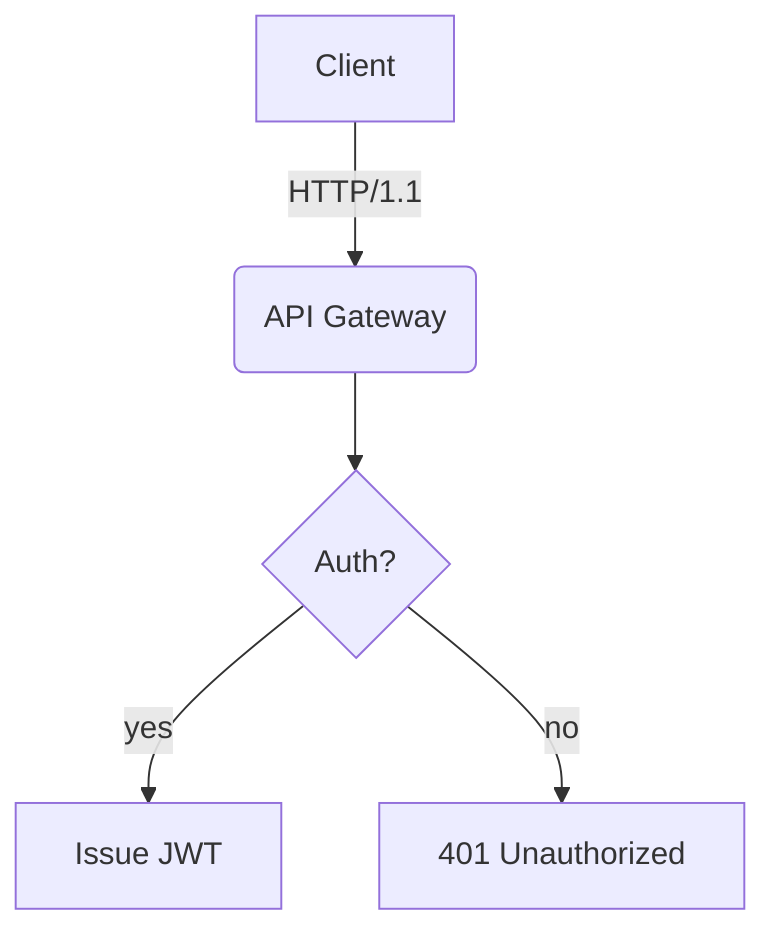
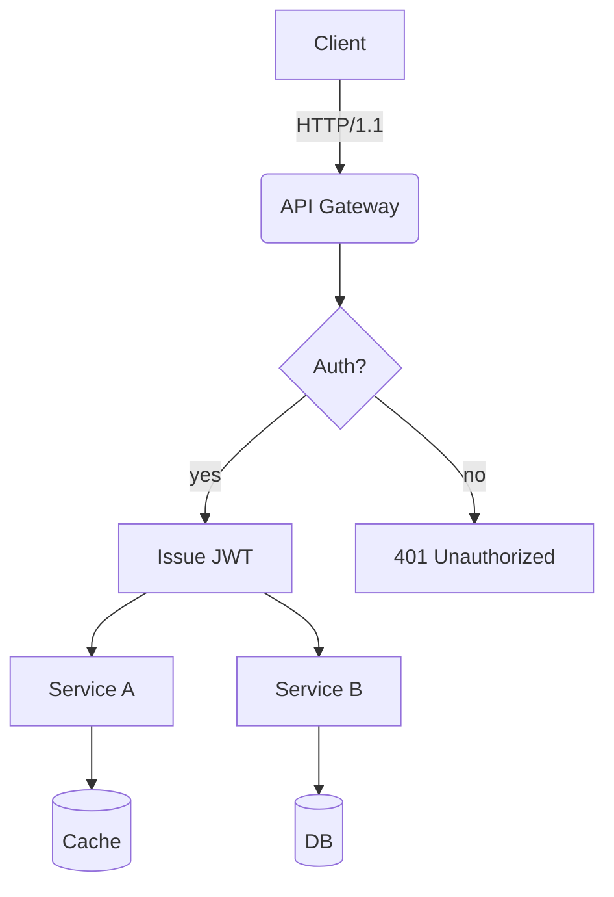
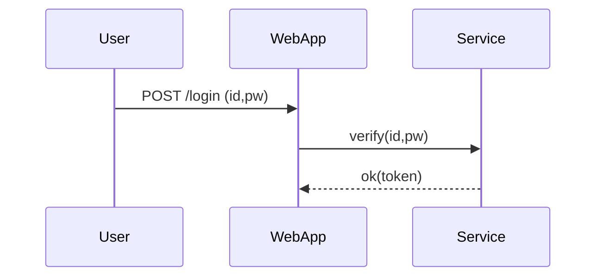
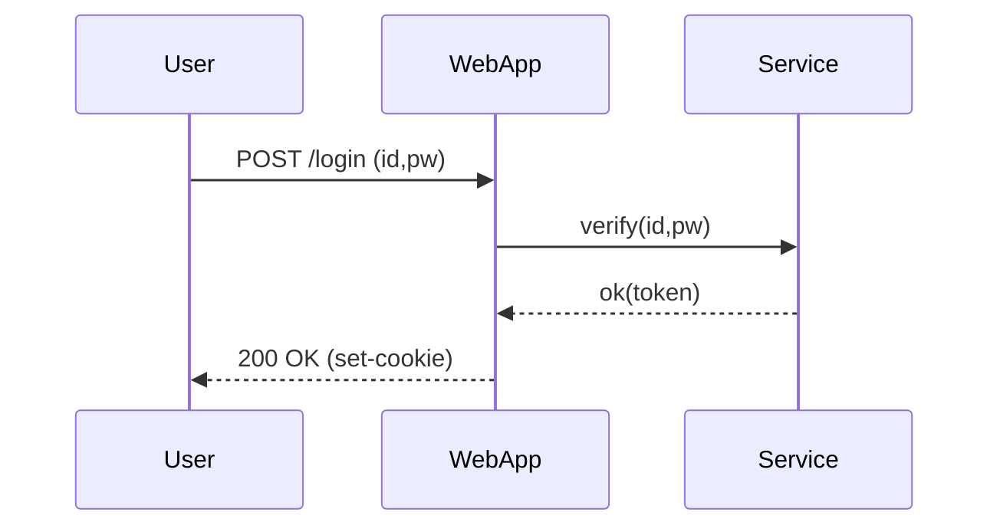
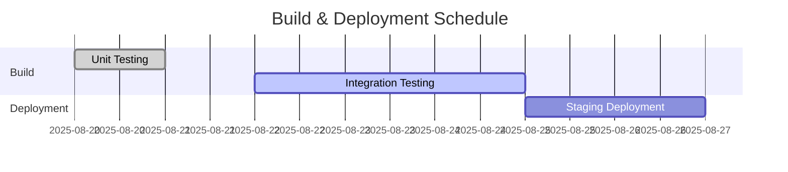
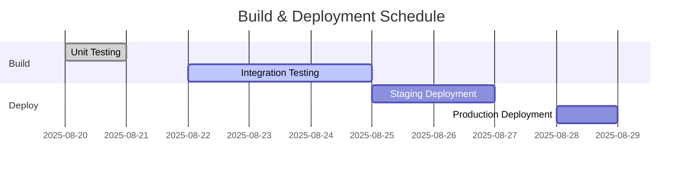
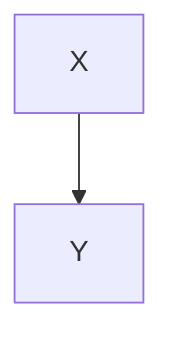

# Translation Test **Rich Markdown** Document

This document is designed to exceed *4096 tokens* with a collection of various formats of Korean content. It aims to test the robustness (robustness) of translators/LLMs in context handling, format preservation, ignoring code/diagrams, etc.

> **Guide**
> 1) Ensure code blocks and `mermaid` areas remain unchanged.
> 2) Verify preservation of numbers/units (e.g., 1.2GB, 3ms), slash paths (`/var/log/app.log`), and options (`--flag`).
> 3) Layouts should remain intact even with mixed tables, lists, quotations, checkboxes, formulas, and emojis 😀.

## 1. Mixed Tables and Symbols/Units

| Item          | Value | Unit   | Notes                |
|---------------|-------|:-------|----------------------|
| Throughput    | 12,345| RPS    | Peak: 18,900 RPS     |
| Latency (P50) | 3.2   | ms     | `--enable-cache` applied |
| Latency (P99) | 41.7  | ms     | Includes GC phase     |
| Memory        | 1.5   | GB     | RSS basis, cgroup limit 2GB |
| Disk I/O      | 220   | MB/s   | Via NVMe-oF(TCP)      |

## 2. Task List

- [x] Accuracy of Markdown header translation
- [x] Preservation of keywords within code blocks (`for`, `if`, `return`, etc.)
- [ ] Preservation of Mermaid diagrams and ignoring comments

## 1. Table with Symbols/Units Mixed

| Item     | Value | Unit   | Comment          |
|----------|-------|:-------|------------------|
| Throughput | 12,345 | RPS   | Peak: 18,900 RPS |
| Latency (P50) | 3.2 | ms    | `--enable-cache` enabled |
| Latency (P99) | 41.7 | ms    | Includes GC phase |
| Memory   | 1.5 | GB    | RSS based, cgroup limit 2GB |
| Disk I/O | 220 | MB/s  | Via NVMe-oF(TCP) |


## 2. Task List

- [x] Accuracy of Markdown Header Translation
- [x] Preservation of Keywords within Code Blocks (`for`, `if`, `return`, etc.)
- [ ] Preservation of Mermaid Diagrams and Ignoring Comments
- [ ] Preservation of Units (GB, ms, %) and Paths (`/etc/hosts`)
- [ ] Preservation of Inline Formula $O(n \log n)$


## 3. Code Blocks: Bash/Python/JSON/YAML

```bash
#!/usr/bin/env bash
set -euo pipefail

APP_ENV="${APP_ENV:-prod}"
INPUT="${1:-/data/input.txt}"
OUT="/var/tmp/result.json"
```

```markdown
e` 적용 |
| 지연시간(P99) | 41.7 | ms | GC 발생 구간 포함 |
| 메모리 | 1.5 | GB | RSS 기준, cgroup 제한 2GB |
| 디스크 I/O | 220 | MB/s | NVMe-oF(TCP) 경유 |

## 2. 체크리스트 (Task List)

- [x] Markdown 헤더 번역 정확도
- [x] 코드 블록 내 키워드 보존 (`for`, `if`, `return` 등)
- [ ] Mermaid 다이어그램 보존 및 주석 무시
- [ ] 단위(GB/ms/%), 경로(`/etc/hosts`) 보존
- [ ] 인라인 수식 $O(n \log n)$ 보존

## 3. 코드 블록: Bash/Python/JSON/YAML

```bash
#!/usr/bin/env bash
set -euo pipefail

APP_ENV="${APP_ENV:-prod}"
INPUT="${1:-/data/input.txt}"
OUT="/var/tmp/result.json"

echo "[INFO] starting job on $(hostname) at $(date -Iseconds)"
if [[ ! -f "$INPUT" ]]; then
  echo "[ERROR] input not found: $INPUT" >&2
  exit 1
fi

lines=$(wc -l < "$INPUT")
echo "[DEBUG] line count: $lines"
```

## 3. Code Blocks: Bash/Python/JSON/YAML

```bash
#!/usr/bin/env bash
set -euo pipefail

APP_ENV="${APP_ENV:-prod}"
INPUT="${1:-/data/input.txt}"
OUT="/var/tmp/result.json"

echo "[INFO] starting job on $(hostname) at $(date -Iseconds)"
if [[ ! -f "$INPUT" ]]; then
  echo "[ERROR] input not found: $INPUT" >&2
  exit 1
fi

lines=$(wc -l < "$INPUT")
echo "[DEBUG] line count: $lines"

curl -sS -X POST "http://127.0.0.1:8080/api" \  -H "Content-Type: application/json" \  -d "{\"env\":\"$APP_ENV\",\"count\":$lines}" > "$OUT"

jq -r '.status' "$OUT" | grep -q success && echo "OK" || { echo "FAIL"; exit 2; }
```

```python
from __future__ import annotations

``` 

Note: The provided Korean text seemed to be instructions rather than content to translate directly into English markdown. Therefore, only the existing code blocks were preserved as instructed, maintaining their original format and structure.

```markdown
"/tmp/result.json"

echo "[INFO] starting job on $(hostname) at $(date -Iseconds)"
if [[ ! -f "$INPUT" ]]; then
  echo "[ERROR] input not found: $INPUT" >&2
  exit 1
fi

lines=$(wc -l < "$INPUT")
echo "[DEBUG] line count: $lines"

curl -sS -X POST "http://127.0.0.1:8080/api" \
  -H "Content-Type: application/json" \
  -d "{\"env\":\"$APP_ENV\",\"count\":$lines}" > "$OUT"

jq -r '.status' "$OUT" | grep -q success && echo "OK" || { echo "FAIL"; exit 2; }
```

```python
from __future__ import annotations

def rolling_avg(xs: list[float], k: int) -> list[float]:
    if k <= 0:
        raise ValueError("k must be > 0")
    out = []
    acc = 0.0
    for i, v in enumerate(xs):
        acc += v
        if i >= k:
            acc -= xs[i-k]
        if i >= k - 1:
            out.append(acc / k)
```

```json
{
  "type": "application/json",
  "-d": "{\"env\":\"$APP_ENV\",\"count\":$lines}",
  ">": "\"$OUT\""
}

jq -r '.status' "\"$OUT\"" | grep -q success && echo "OK" || { echo "FAIL"; exit 2; }
```

```python
from __future__ import annotations

def rolling_avg(xs: list[float], k: int) -> list[float]:
    if k <= 0:
        raise ValueError("k must be > 0")
    out = []
    acc = 0.0
    for i, v in enumerate(xs):
        acc += v
        if i >= k:
            acc -= xs[i-k]
        if i >= k - 1:
            out.append(acc / k)
    return out

print(rolling_avg([1,2,3,4,5,6,7,8,9], 3))
```

```json
{
  "service": "analytics",
  "version": "1.4.2",
  "features": ["rollup", "compaction", "delta-index"],
  "limits": {
    "max_docs": 1000000,
    "max_payload_mb": 256
  }
}
```

```yaml
apiVersion: v1
kind: ConfigMap

```

```python
raise ValueError("k must be > 0")
    out = []
    acc = 0.0
    for i, v in enumerate(xs):
        acc += v
        if i >= k:
            acc -= xs[i-k]
        if i >= k - 1:
            out.append(acc / k)
    return out

print(rolling_avg([1,2,3,4,5,6,7,8,9], 3))
```

```json
{
  "service": "analytics",
  "version": "1.4.2",
  "features": ["rollup", "compaction", "delta-index"],
  "limits": {
    "max_docs": 1000000,
    "max_payload_mb": 256
  }
}
```

```yaml
apiVersion: v1
kind: ConfigMap
metadata:
  name: test-config
data:
  APP_ENV: "staging"
  ENDPOINT: "https://api.example.com"
```

## 4. Mermaid Diagram

### 4.1 Flowchart


```yaml
apiVersion: v1
kind: ConfigMap
metadata:
  name: test-config
data:
  APP_ENV: "staging"
  ENDPOINT: "https://api.example.com"
```

## 4. Mermaid Diagrams

### 4.1 Flowchart


### 4.2 Sequence Diagram


DPOINT: "https://api.example.com"

## 4. Mermaid Diagrams

### 4.1 Flowchart


### 4.2 Sequence Diagram


### 4.3 Gantt Chart


```
G --> I[(DB)]
```

### 4.2 Sequence


### 4.3 Gantt


## 5. Images/Links/Quotes


- Document: <https://example.com/docs/guide>
- API Reference: [API Reference](https://example.com/api)
- Issue Tracker: https://example.com/issues



## 5. Images/Links/Quotes


- Document: <https://example.com/docs/guide>
- API Reference: [API Reference](https://example.com/api)
- Issue Tracker: https://example.com/issues

> “Translation quality is determined by the simultaneous preservation of layout and meaning.” — Anonymous

## 6. Equations and Text Mixing

- Average Time Complexity: $O(n \log n)$, Worst: $O(n^2)$
- Variance: $\sigma^2 = \frac{1}{n}\sum_{i=1}^{n}(x_i-\mu)^2$
- Sample Mean: $\bar{x} = \frac{1}{n}\sum x_i$

Paragraph Example: This paragraph serves as a sample to ensure proper preservation of **bold**, *italic*, and `code` even when mixed during translation.

## 5. Images/Links/Quotations


- Document: [https://example.com/docs/guide](https://example.com/docs/guide)
- API Reference: [API Reference](https://example.com/api)
- Issue Tracker: https://example.com/issues

> “Translation quality is determined by the simultaneous preservation of layout and meaning.” — Anonymous

## 6. Formula and Text Mixture

- Average Time Complexity: $O(n \log n)$, Worst: $O(n^2)$
- Variance: $\sigma^2 = \frac{1}{n}\sum_{i=1}^{n}(x_i-\mu)^2$
- Sample Mean: $\bar{x} = \frac{1}{n}\sum x_i$

Paragraph Example: This paragraph serves as a sample to ensure proper preservation of **bold**, *italic*, `code` even when mixed with translation, including emojis 😀, Chinese characters 漢字, English CamelCase, snake_case, and kebab-case.

### 7.1 Experimental Section — Variation Patterns
The following section varies vocabulary and order slightly each iteration to prevent redundant translations:
- Scenario: Summary of Dialogue Record
- Condition: Includes 100,000 characters in Korean
- Expected Result: Summary Accuracy Rate ≥ 90%

#### Procedure
1. Input Data: `/data/input_01.jsonl`
2. Options: `--batch 512 --timeout 3s --enable-cache`

## 7.1 Experimental Section — Variation Pattern

The following section is similar but varies slightly in vocabulary and order across iterations to prevent redundant translations.

- Scenario: Summarization of Dialogue Logs
- Condition: Inclusion of Korean text up to 100,000 characters
- Expected Outcome: Summary rate exceeding 90%

#### Procedure
1. Input Data: `/data/input_01.jsonl`
2. Options: `--batch 512 --timeout 3s --enable-cache`
3. Execution: `app run --job test-01 --qos high`
4. Verification: Check for `test-01 finished` in logs

#### Observations
- Longer GC cycles showed an increasing trend in P99 latency
- Processing throughput decreased by approximately 7% when cache miss ratio increased by 10%
- Increasing connection pool size from 32 to 64 resulted in a decrease in retry rate per second from 1.2% to 0.6%

---

## 7.2 Experimental Section — Variation Pattern

The following section is similar but varies slightly in vocabulary and order across iterations to prevent redundant translations.

## 7.2 Experimental Section — Variation Pattern

The following section is similar but varies slightly in vocabulary and order each iteration to prevent redundant translations.

- **Scenario:** Summarization of conversation records
- **Condition:** Includes 100,000 characters of Korean text
- **Expected Result:** Summary accuracy of over 90%

#### Procedure
1. Input Data: `/data/input_02.jsonl`
2. Options: `--batch 512 --timeout 3s --enable-cache`
3. Execution: `app run --job test-02 --qos high`
4. Verification: Check if `test-02 finished` is present in logs

#### Observations
- Observed tendency for P99 latency to increase as GC cycle lengthens

---

```markdown
#### Observations
- Increased GC cycle duration shows a tendency towards higher P99 latency
- Processing throughput decreases by approximately 7% when cache miss ratio increases by 10%p
- When connection pool size increases from 32 to 64, the per-second retry rate decreases from 1.2% to 0.6%

---

### 7.2 Experiment Section — Variation Pattern
The following section is similar but varies slightly in vocabulary and order per iteration to avoid redundant translations.
- Scenario: Summary of conversation logs
- Condition: Inclusion of 100k characters in Korean text
- Expected Result: Summary accuracy of over 90%

#### Procedure
1. Input Data: `/data/input_02.jsonl`
2. Options: `--batch 512 --timeout 3s --enable-cache`
3. Execution: `app run --job test-02 --qos high`
4. Verification: Check for `test-02 finished` inclusion in logs

#### Observations
- Increased GC cycle duration shows a tendency towards higher P99 latency
- Processing throughput decreases by approximately 7% when cache miss ratio increases by 10%p
- When connection pool size increases from 32 to 64, the per-second retry rate decreases from 1.2% to 0.6%

---

### 7.3 Experiment Section — Variation Pattern
The following section is similar but varies slightly in vocabulary and order per iteration to avoid redundant translations.
- Scenario: Kubernetes Deployment
- Condition: HPA (Horizontal Pod Autoscaler) Enabled
- Expected Result: Scaling within the range of 2 to 10 pods

#### Procedure
1. Input Data: `/data/input_03.jsonl`
```

## Expected Results: Summary Rate ≥ 90%

#### Procedure
1. Input Data: `/data/input_02.jsonl`
2. Options: `--batch 512 --timeout 3s --enable-cache`
3. Execution: `app run --job test-02 --qos high`
4. Verification: Check if `test-02 finished` is included in the logs

#### Observations
- Longer GC cycles show a tendency towards increased P99 latency
- Processing throughput decreases by ~7% when cache miss ratio increases by 10%p
- When connection pool size increases from 32 to 64, the per-second retry rate decreases from 1.2% to 0.6%

---

### 7.3 Experiment Section — Variation Pattern
The following section is similar but varies slightly in vocabulary and order each iteration to prevent repetitive translation.
- Scenario: Kubernetes Deployment
- Condition: HPA Enabled
- Expected Results: Operation within scale range 2~10

#### Procedure
1. Input Data: `/data/input_03.jsonl`
2. Options: `--batch 512 --timeout 3s --enable-cache`
3. Execution: `app run --job test-03 --qos high`
4. Verification: Check if `test-03 finished` is included in the logs

#### Observations
- Longer GC cycles show a tendency towards increased P99 latency
- Processing throughput decreases by ~7% when cache miss ratio increases by 10%p
- When connection pool size increases from 32 to 64, the per-second retry rate decreases from 1.2% to 0.6%

---

### 7.4 Experiment Section — Variation Pattern

## Increase in Retry Rate

**From 1.2% to 0.6%**

---

### 7.3 Experiment Section — Variation Pattern
The following section varies vocabulary and order slightly per iteration to avoid redundant translations.

- **Scenario:** Kubernetes Deployment
- **Condition:** HPA Enabled
- **Expected Result:** Scale within range 2~10

#### Procedure
1. Input Data: `/data/input_03.jsonl`
2. Options: `--batch 512 --timeout 3s --enable-cache`
3. Execution: `app run --job test-03 --qos high`
4. Verification: Check for `test-03 finished` in logs

#### Observations
- Longer GC cycles show an increasing trend in P99 latency
- Throughput decreases by ~7% when cache miss ratio increases by 10%
- Increase in connection pool size from 32 to 64 results in retry rate decreasing from 1.2% to 0.6% per second

---

### 7.4 Experiment Section — Variation Pattern
The following section varies vocabulary and order slightly per iteration to avoid redundant translations.

- **Scenario:** Kubernetes Deployment
- **Condition:** HPA Enabled
- **Expected Result:** Scale within range 2~10

#### Procedure
1. Input Data: `/data/input_04.jsonl`
2. Options: `--batch 512 --timeout 3s --enable-cache`
3. Execution: `app run --job test-04 --qos high`
4. Verification: Check for `test-04 finished` in logs

#### Observations

```markdown
## 7.4 Experiment Section — Variation Pattern

The following section is similar but varies slightly in vocabulary and order each iteration to prevent redundant translation.

- Scenario: Kubernetes Deployment
- Condition: HPA Enabled
- Expected Result: Scale within range 2~10

#### Procedure
1. Input Data: `/data/input_04.jsonl`
2. Options: `--batch 512 --timeout 3s --enable-cache`
3. Execution: `app run --job test-04 --qos high`
4. Verification: Check for `test-04 finished` in logs

#### Observations
- Longer GC cycles show an increasing trend in P99 latency
- Processing throughput decreases by ~7% when cache miss ratio increases by 10%p
- Increase in connection pool size from 32 to 64 results in a decrease in retry rate per second from 1.2% to 0.6%

---

## 7.5 Experiment Section — Variation Pattern

The following section is similar but varies slightly in vocabulary and order each iteration to prevent redundant translation.

- Scenario: Dialogue Record Summarization
- Condition: Includes 100k characters in Korean text
- Expected Result: Summary rate above 90%

#### Procedure
1. Input Data: `/data/input_05.jsonl`
```

## Scale Range 2~10 Operation

### Procedure
1. Input Data: `/data/input_04.jsonl`
2. Options: `--batch 512 --timeout 3s --enable-cache`
3. Execution: `app run --job test-04 --qos high`
4. Verification: Check if `test-04 finished` is included in the logs

### Observations
- Longer GC cycles show a tendency towards increased P99 latency
- Processing throughput decreases by ~7% when cache miss ratio increases by 10%p
- When connection pool size increases from 32 to 64, the per-second retry rate decreases from 1.2% to 0.6%

---

### 7.5 Experiment Section — Variation Pattern
The following section varies slightly in vocabulary and order each iteration to prevent redundant translations.
- Scenario: Summary of conversation records
- Condition: Includes Korean text up to 100,000 characters
- Expected Result: Summary rate of over 90%

### Procedure
1. Input Data: `/data/input_05.jsonl`
2. Options: `--batch 512 --timeout 3s --enable-cache`
3. Execution: `app run --job test-05 --qos high`
4. Verification: Check if `test-05 finished` is included in the logs

### Observations
- Longer GC cycles show a tendency towards increased P99 latency
- Processing throughput decreases by ~7% when cache miss ratio increases by 10%p
- When connection pool size increases from 32 to 64, the per-second retry rate decreases from 1.2% to 0.6%

---

## Increase in Retry Rate

**From 1.2% to 0.6%**

---

### 7.5 Experiment Section — Variation Pattern
The following section varies vocabulary and order slightly per iteration to prevent redundant translations.

- **Scenario:** Summarization of Dialogue Logs
- **Condition:** Includes Korean text of 100,000 characters
- **Expected Result:** Summary rate ≥ 90%

#### Procedure
1. Input Data: `/data/input_05.jsonl`
2. Options: `--batch 512 --timeout 3s --enable-cache`
3. Execution: `app run --job test-05 --qos high`
4. Verification: Check for `test-05 finished` in logs

#### Observations
- Longer GC cycles showed an increasing trend in P99 latency
- Processing throughput decreased by ~7% when cache miss ratio increased by 10% points
- Increase in connection pool size from 32 to 64 resulted in retry rate decreasing from 1.2% to 0.6% per second

---

### 7.6 Experiment Section — Variation Pattern
The following section varies vocabulary and order slightly per iteration to prevent redundant translations.

- **Scenario:** Mermaid Diagram Rendering
- **Condition:** 50+ nodes, 100+ edges
- **Expected Result:** No layout distortion

#### Procedure
1. Input Data: `/data/input_06.jsonl`
2. Options: `--batch 512 --timeout 3s --enable-cache`
3. Execution: `app run --job test-06 --qos high`
4. Verification: Check for `test-06 finished` in logs

#### Observations

```markdown
4. Verification: Check for inclusion of `test-05 finished` in logs

#### Observations
- Longer GC cycles show a tendency towards increased P99 latency
- Processing throughput decreases by ~7% when cache miss ratio increases by 10%
- Increase in connection pool size from 32 to 64 results in a decrease in retry rate per second from 1.2% to 0.6%

---

### 7.6 Experiment Section — Variation Pattern
The following section is similar but varies slightly in vocabulary and order each iteration to avoid redundant translation.
- Scenario: Mermaid Rendering
- Conditions: Over 50 nodes, Over 100 edges
- Expected Result: No layout distortion

#### Procedure
1. Input Data: `/data/input_06.jsonl`
2. Options: `--batch 512 --timeout 3s --enable-cache`
3. Execution: `app run --job test-06 --qos high`
4. Verification: Check for inclusion of `test-06 finished` in logs

#### Observations
- Longer GC cycles show a tendency towards increased P99 latency
- Processing throughput decreases by ~7% when cache miss ratio increases by 10%
- Increase in connection pool size from 32 to 64 results in a decrease in retry rate per second from 1.2% to 0.6%

---

### 7.7 Experiment Section — Variation Pattern
The following section is similar but varies slightly in vocabulary and order each iteration to avoid redundant translation.
- Scenario: Large JSON Parsing
- Conditions: 64MB payload, 4 workers
- Expected Result: Completion without memory spikes

#### Procedure
```

```markdown
Nodes, 100+ Edges
- Expected Result: No Layout Distortion

#### Procedure
1. Input Data: `/data/input_06.jsonl`
2. Options: `--batch 512 --timeout 3s --enable-cache`
3. Execution: `app run --job test-06 --qos high`
4. Verification: Check if `test-06 finished` is included in the logs

#### Observations
- Longer GC cycles show a tendency towards increased P99 latency
- Processing throughput decreases by ~7% when cache miss ratio increases by 10%p
- When connection pool size increases from 32 to 64, the retry rate per second decreases from 1.2% to 0.6%

---

### 7.7 Experiment Section — Variation Patterns
The following section is similar but varies slightly in vocabulary and order each time to prevent repetitive translation.
- Scenario: Large-scale JSON Parsing
- Conditions: 64MB payload, 4 workers
- Expected Result: Completion without Memory Spikes

#### Procedure
1. Input Data: `/data/input_07.jsonl`
2. Options: `--batch 512 --timeout 3s --enable-cache`
3. Execution: `app run --job test-07 --qos high`
4. Verification: Check if `test-07 finished` is included in the logs

#### Observations
- Longer GC cycles show a tendency towards increased P99 latency
- Processing throughput decreases by ~7% when cache miss ratio increases by 10%p
- When connection pool size increases from 32 to 64, the retry rate per second decreases from 1.2% to 0.6%
```

## 7.7 Experiment Section — Variation Pattern

The following section is similar but varies slightly in vocabulary and order per iteration to prevent redundant translations.

- **Scenario**: Large-scale JSON Parsing
- **Conditions**: 64MB payload, 4 workers
- **Expected Result**: Completion without memory spikes

#### Procedure
1. Input Data: `/data/input_07.jsonl`
2. Options: `--batch 512 --timeout 3s --enable-cache`
3. Execution: `app run --job test-07 --qos high`
4. Verification: Check for `test-07 finished` in logs

#### Observations
- Longer GC cycles showed an increasing trend in P99 latency
- Processing throughput decreased by ~7% when cache miss ratio increased by 10% points
- When connection pool size increased from 32 to 64, the per-second retry rate decreased from 1.2% to 0.6%

```markdown
Execution: `app run --job test-07 --qos high`
4. Verification: Check if `test-07 finished` is included in the logs

#### Observations
- Longer GC cycles show a tendency towards increased P99 latency
- Processing throughput decreases by ~7% when cache miss ratio increases by 10%p
- When connection pool size increases from 32 to 64, the per-second retry rate decreases from 1.2% to 0.6%

---

### 7.8 Experiment Section — Variation Pattern
The following section is similar but varies slightly in vocabulary and order each time to avoid redundant translation.
- Scenario: Large-scale JSON Parsing
- Conditions: 64MB payload, 4 workers
- Expected Result: Completion without memory spikes

#### Procedure
1. Input Data: `/data/input_08.jsonl`
2. Options: `--batch 512 --timeout 3s --enable-cache`
3. Execution: `app run --job test-08 --qos high`
4. Verification: Check if `test-08 finished` is included in the logs

#### Observations
- Longer GC cycles show a tendency towards increased P99 latency
- Processing throughput decreases by ~7% when cache miss ratio increases by 10%p
- When connection pool size increases from 32 to 64, the per-second retry rate decreases from 1.2% to 0.6%

---

### 7.9 Experiment Section — Variation Pattern
The following section is similar but varies slightly in vocabulary and order each time to avoid redundant translation.
- Scenario: Large-scale JSON Parsing
```

## 7.9 Experimental Section — Variation Patterns

The following section is similar but slightly varies vocabulary and order each iteration to prevent redundant translations:

- **Scenario:** Large-scale JSON Parsing
- **Conditions:** 64MB payload, 4 workers
- **Expected Result:** Completion without memory spikes

#### Procedure
1. Input Data: `/data/input_08.jsonl`
2. Options: `--batch 512 --timeout 3s --enable-cache`
3. Execution: `app run --job test-08 --qos high`
4. Verification: Check if `test-08 finished` is included in logs

#### Observations
- Longer GC cycles show a tendency towards increased P99 latency

---

#### 7.9 Experimental Section — Variation Patterns (Iteration)

The following section is similar but slightly varies vocabulary and order each iteration to prevent redundant translations:

- **Scenario:** Large-scale JSON Parsing
- **Conditions:** 64MB payload, 4 workers
- **Expected Result:** Completion without memory spikes

#### Procedure
1. Input Data: `/data/input_09.jsonl`
2. Options: `--batch 512 --timeout 3s --enable-cache`
3. Execution: `app run --job test-09 --qos high`
4. Verification: Check if `test-09 finished` is included in logs

#### Observations
- Longer GC cycles show a tendency towards increased P99 latency

## Observations
- Increasing GC cycle duration shows a tendency towards increased P99 latency
- Processing throughput decreases by ~7% when cache miss ratio increases by 10%p
- When connection pool size increases from 32 to 64, the retry rate per second decreases from 1.2% to 0.6%

---

### 7.9 Experiment Section — Variation Pattern
The following section is similar but varies slightly in vocabulary and order per iteration to avoid redundant translations.
- Scenario: Large-scale JSON Parsing
- Conditions: 64MB payload, 4 workers
- Expected Result: Completion without memory spikes

#### Procedure
1. Input Data: `/data/input_09.jsonl`
2. Options: `--batch 512 --timeout 3s --enable-cache`
3. Execution: `app run --job test-09 --qos high`
4. Verification: Check for `test-09 finished` in logs

#### Observations
- Increasing GC cycle duration shows a tendency towards increased P99 latency
- Processing throughput decreases by ~7% when cache miss ratio increases by 10%p
- When connection pool size increases from 32 to 64, the retry rate per second decreases from 1.2% to 0.6%

---

### 7.10 Experiment Section — Variation Pattern
The following section is similar but varies slightly in vocabulary and order per iteration to avoid redundant translations.
- Scenario: NVMe-oF I/O Retries
- Conditions: TCP RTT 2ms, Loss 0.1%
- Expected Result: Retry rate ≤ 1%

#### Procedure
1. Input Data: `/data/input_10.jsonl`

### Procedure
1. Input Data: `/data/input_09.jsonl`
2. Options: `--batch 512 --timeout 3s --enable-cache`
3. Execution: `app run --job test-09 --qos high`
4. Verification: Check if `test-09 finished` is included in the logs

#### Observations
- Longer GC cycles show a tendency towards increased P99 latency
- Processing throughput decreases by ~7% when cache miss ratio increases by 10%p
- When connection pool size increases from 32 to 64, the retry rate per second decreases from 1.2% to 0.6%

---

### 7.10 Experiment Section — Variation Pattern
The following section is similar but varies slightly in vocabulary and order each iteration to prevent repetitive translation.
- Scenario: NVMe-oF I/O Retries
- Conditions: TCP RTT 2ms, Loss 0.1%
- Expected Result: Retry Rate ≤ 1%

#### Procedure
1. Input Data: `/data/input_10.jsonl`
2. Options: `--batch 512 --timeout 3s --enable-cache`
3. Execution: `app run --job test-10 --qos high`
4. Verification: Check if `test-10 finished` is included in the logs

#### Observations
- Longer GC cycles show a tendency towards increased P99 latency
- Processing throughput decreases by ~7% when cache miss ratio increases by 10%p
- When connection pool size increases from 32 to 64, the retry rate per second decreases from 1.2% to 0.6%

---

### 7.11 Experiment Section — Variation Pattern

0.6% Decrease

---

### 7.10 Experiment Section — Variation Pattern
The following section varies vocabulary and order slightly per iteration to avoid redundant translations.
- Scenario: NVMe-oF I/O Retries
- Conditions: TCP RTT 2ms, Loss 0.1%
- Expected Result: Retry Rate ≤ 1%

#### Procedure
1. Input Data: `/data/input_10.jsonl`
2. Options: `--batch 512 --timeout 3s --enable-cache`
3. Execution: `app run --job test-10 --qos high`
4. Verification: Check for `test-10 finished` in logs

#### Observations
- Longer GC cycles show an increasing trend in P99 latency
- Throughput decreases by ~7% when cache miss ratio increases by 10%p
- Increase in connection pool size from 32 to 64 results in retry rate decreasing from 1.2% to 0.6% per second

---

### 7.11 Experiment Section — Variation Pattern
The following section varies vocabulary and order slightly per iteration to avoid redundant translations.
- Scenario: Large Volume JSON Parsing
- Conditions: 64MB Payload, 4 Workers
- Expected Result: Completion without Memory Spikes

#### Procedure
1. Input Data: `/data/input_11.jsonl`
2. Options: `--batch 512 --timeout 3s --enable-cache`
3. Execution: `app run --job test-11 --qos high`
4. Verification: Check for `test-11 finished` in logs

## Validation

- Verify if `test-10 finished` is present in the logs.

#### Observations
- Observed tendency for P99 latency to increase as GC cycles lengthen.
- Throughput decreased by approximately 7% when cache miss ratio increased by 10%.
- When connection pool size increased from 32 to 64, the per-second retry rate decreased from 1.2% to 0.6%.

---

### 7.11 Experiment Section — Variation Pattern
The following section is similar but varies slightly in vocabulary and order per iteration to avoid redundant translations.
- Scenario: Large-scale JSON parsing
- Conditions: 64MB payload, 4 workers
- Expected Result: Completion without memory spikes

#### Procedure
1. Input Data: `/data/input_11.jsonl`
2. Options: `--batch 512 --timeout 3s --enable-cache`
3. Execution: `app run --job test-11 --qos high`
4. Validation: Check for `test-11 finished` in logs.

#### Observations
- Observed tendency for P99 latency to increase as GC cycles lengthen.
- Throughput decreased by approximately 7% when cache miss ratio increased by 10%.
- When connection pool size increased from 32 to 64, the per-second retry rate decreased from 1.2% to 0.6%.

---

### 7.12 Experiment Section — Variation Pattern
The following section is similar but varies slightly in vocabulary and order per iteration to avoid redundant translations.
- Scenario: Kubernetes Deployment
- Conditions: HPA Enabled
- Expected Result: Operation within scale range 2~10

#### Procedure
(Note: Procedure section remains incomplete in the original document.)

```markdown
Payload: 64MB, 4 Workers
- Expected Result: Completion without Memory Spikes

#### Procedure
1. Input Data: `/data/input_11.jsonl`
2. Options: `--batch 512 --timeout 3s --enable-cache`
3. Execution: `app run --job test-11 --qos high`
4. Verification: Check if `test-11 finished` is included in the logs

#### Observations
- Longer GC cycles show a tendency towards increased P99 latency
- Processing throughput decreases by ~7% when cache miss ratio increases by 10%p
- Increasing connection pool size from 32 to 64 results in a decrease in retry rate per second from 1.2% to 0.6%

---

### 7.12 Experiment Section — Variation Patterns
The following section is similar but varies slightly in vocabulary and order each time to prevent repetitive translation.
- Scenario: Kubernetes Deployment
- Condition: HPA Enabled
- Expected Result: Operation within scale range 2~10

#### Procedure
1. Input Data: `/data/input_12.jsonl`
2. Options: `--batch 512 --timeout 3s --enable-cache`
3. Execution: `app run --job test-12 --qos high`
4. Verification: Check if `test-12 finished` is included in the logs

#### Observations
- Longer GC cycles show a tendency towards increased P99 latency
- Processing throughput decreases by ~7% when cache miss ratio increases by 10%p
- Increasing connection pool size from 32 to 64 results in a decrease in retry rate per second from 1.2% to 0.6%
```

7% Decrease
- Increase in connection pool size from 32 to 64 results in a decrease in retry rate per second from 1.2% to 0.6%

---

### 7.12 Experiment Paragraph — Variation Pattern
The following paragraph varies slightly in vocabulary and order each iteration to prevent redundant translation.
- Scenario: Kubernetes Deployment
- Condition: HPA Enabled
- Expected Result: Scale within range 2~10

#### Procedure
1. Input Data: `/data/input_12.jsonl`
2. Options: `--batch 512 --timeout 3s --enable-cache`
3. Execution: `app run --job test-12 --qos high`
4. Verification: Check for `test-12 finished` in logs

#### Observations
- Longer GC cycles show an increasing trend in P99 latency
- Processing throughput decreases by ~7% when cache miss ratio increases by 10%p
- Increase in connection pool size from 32 to 64 results in a decrease in retry rate per second from 1.2% to 0.6%

---

### 7.13 Experiment Paragraph — Variation Pattern
The following paragraph varies slightly in vocabulary and order each iteration to prevent redundant translation.
- Scenario: Large JSON Parsing
- Condition: 64MB Payload, 4 Workers
- Expected Result: Completion without Memory Spike

#### Procedure
1. Input Data: `/data/input_13.jsonl`
2. Options: `--batch 512 --timeout 3s --enable-cache`
3. Execution: `app run --job test-13 --qos high`

```markdown
Execution: `app run --job test-12 --qos high`
4. Verification: Check if `test-12 finished` is included in the logs

#### Observations
- Longer GC cycles show a tendency towards increased P99 latency
- Processing throughput decreases by ~7% when cache miss ratio increases by 10%p
- When connection pool size increases from 32 to 64, the per-second retry rate decreases from 1.2% to 0.6%

---

### 7.13 Experiment Section — Variation Pattern
The following section is similar but varies slightly in vocabulary and order each time to avoid redundant translation.
- Scenario: Large-scale JSON Parsing
- Conditions: 64MB payload, 4 workers
- Expected Result: Completion without memory spikes

#### Procedure
1. Input Data: `/data/input_13.jsonl`
2. Options: `--batch 512 --timeout 3s --enable-cache`
3. Execution: `app run --job test-13 --qos high`
4. Verification: Check if `test-13 finished` is included in the logs

#### Observations
- Longer GC cycles show a tendency towards increased P99 latency
- Processing throughput decreases by ~7% when cache miss ratio increases by 10%p
- When connection pool size increases from 32 to 64, the per-second retry rate decreases from 1.2% to 0.6%

---

### 7.14 Experiment Section — Variation Pattern
The following section is similar but varies slightly in vocabulary and order each time to avoid redundant translation.
- Scenario: Large-scale JSON Parsing
```

```markdown
## 7.14 Experiment Section — Variation Pattern

The following section is similar but slightly varies vocabulary and order each iteration to prevent redundant translations.

- Scenario: Large-scale JSON Parsing
- Conditions: 64MB payload, 4 workers
- Expected Result: Completion without memory spikes

#### Procedure
1. Input Data: `/data/input_14.jsonl`
2. Options: `--batch 512 --timeout 3s --enable-cache`
3. Execution: `app run --job test-14 --qos high`
4. Verification: Check if `test-14 finished` is included in logs

#### Observations
- Observed tendency of increased P99 latency as GC cycle lengthens
```

# Observations
- Increasing GC cycle duration shows a tendency towards increased P99 latency
- Throughput decreases by ~7% when cache miss ratio increases by 10%p
- When connection pool size increases from 32 to 64, the retry rate per second decreases from 1.2% to 0.6%

---

### 7.14 Experiment Section — Variation Pattern
The following section is similar but varies slightly in vocabulary and order per iteration to avoid redundant translations.
- Scenario: Large-scale JSON Parsing
- Conditions: 64MB payload, 4 workers
- Expected Result: Completion without memory spikes

#### Procedure
1. Input Data: `/data/input_14.jsonl`
2. Options: `--batch 512 --timeout 3s --enable-cache`
3. Execution: `app run --job test-14 --qos high`
4. Verification: Check for `test-14 finished` in logs

#### Observations
- Increasing GC cycle duration shows a tendency towards increased P99 latency
- Throughput decreases by ~7% when cache miss ratio increases by 10%p
- When connection pool size increases from 32 to 64, the retry rate per second decreases from 1.2% to 0.6%

---

### 7.15 Experiment Section — Variation Pattern
The following section is similar but varies slightly in vocabulary and order per iteration to avoid redundant translations.
- Scenario: NVMe-oF I/O Retries
- Conditions: TCP RTT 2ms, loss rate 0.1%
- Expected Result: Retry rate ≤ 1%

#### Procedure
1. Input Data: `/data/input_15.jsonl`

### Procedure
1. Input Data: `/data/input_14.jsonl`
2. Options: `--batch 512 --timeout 3s --enable-cache`
3. Execution: `app run --job test-14 --qos high`
4. Verification: Check if `test-14 finished` is included in the logs

#### Observations
- Longer GC cycles show a tendency towards increased P99 latency
- Processing throughput decreases by ~7% when cache miss ratio increases by 10%p
- When connection pool size increases from 32 to 64, the retry rate per second decreases from 1.2% to 0.6%

---

### 7.15 Experiment Section — Variation Pattern
The following section is similar but varies slightly in vocabulary and order each iteration to prevent repetitive translation.
- Scenario: NVMe-oF I/O Retries
- Conditions: TCP RTT 2ms, Loss 0.1%
- Expected Result: Retry Rate ≤ 1%

#### Procedure
1. Input Data: `/data/input_15.jsonl`
2. Options: `--batch 512 --timeout 3s --enable-cache`
3. Execution: `app run --job test-15 --qos high`
4. Verification: Check if `test-15 finished` is included in the logs

#### Observations
- Longer GC cycles show a tendency towards increased P99 latency
- Processing throughput decreases by ~7% when cache miss ratio increases by 10%p
- When connection pool size increases from 32 to 64, the retry rate per second decreases from 1.2% to 0.6%

---

0.6% Decrease

---

### 7.15 Experiment Section — Variation Pattern
The following section varies vocabulary and order slightly per iteration to avoid redundant translations.
- Scenario: NVMe-oF I/O Retries
- Conditions: TCP RTT 2ms, Loss 0.1%
- Expected Result: Retry Rate ≤ 1%

#### Procedure
1. Input Data: `/data/input_15.jsonl`
2. Options: `--batch 512 --timeout 3s --enable-cache`
3. Execution: `app run --job test-15 --qos high`
4. Verification: Check for `test-15 finished` in logs

#### Observations
- Longer GC cycles show an increasing trend in P99 latency
- Throughput decreases by ~7% when cache miss ratio increases by 10%p
- Increase in connection pool size from 32 to 64 results in retry rate decreasing from 1.2% to 0.6% per second

---

### 7.16 Experiment Section — Variation Pattern
The following section varies vocabulary and order slightly per iteration to avoid redundant translations.
- Scenario: Mermaid Rendering
- Conditions: 50+ Nodes, 100+ Edges
- Expected Result: No Layout Distortion

#### Procedure
1. Input Data: `/data/input_16.jsonl`
2. Options: `--batch 512 --timeout 3s --enable-cache`
3. Execution: `app run --job test-16 --qos high`
4. Verification: Check for `test-16 finished` in logs

#### Observations

4. Verification: Check for inclusion of `test-15 finished` in logs

#### Observations
- Increasing GC cycle duration shows a tendency towards increased P99 latency
- Processing throughput decreases by approximately 7% when cache miss ratio increases by 10%
- When connection pool size increases from 32 to 64, the retry rate per second decreases from 1.2% to 0.6%

---

### 7.16 Experiment Section — Variation Pattern
The following section is similar but varies slightly in vocabulary and order each iteration to avoid redundant translations.
- Scenario: Mermaid rendering
- Conditions: Over 50 nodes, Over 100 edges
- Expected Result: No layout distortion

#### Procedure
1. Input Data: `/data/input_16.jsonl`
2. Options: `--batch 512 --timeout 3s --enable-cache`
3. Execution: `app run --job test-16 --qos high`
4. Verification: Check for inclusion of `test-16 finished` in logs

#### Observations
- Increasing GC cycle duration shows a tendency towards increased P99 latency
- Processing throughput decreases by approximately 7% when cache miss ratio increases by 10%
- When connection pool size increases from 32 to 64, the retry rate per second decreases from 1.2% to 0.6%

---

### 7.17 Experiment Section — Variation Pattern
The following section is similar but varies slightly in vocabulary and order each iteration to avoid redundant translations.
- Scenario: Summarization of conversation records
- Conditions: Including 100k characters in Korean text
- Expected Result: Summary rate exceeding 90%

#### Procedure
1. Input Data: `/data/input_17.jsonl`

## Results: Layout Distortion Absent

#### Procedure
1. Input Data: `/data/input_16.jsonl`
2. Options: `--batch 512 --timeout 3s --enable-cache`
3. Execution: `app run --job test-16 --qos high`
4. Verification: Check for inclusion of `test-16 finished` in logs

#### Observations
- Longer GC cycles exhibited a tendency towards increased P99 latency
- Processing throughput decreased by approximately 7% when cache miss ratio increased by 10%p
- Increasing connection pool size from 32 to 64 resulted in a decrease in retry rate per second from 1.2% to 0.6%

---

### 7.17 Experiment Section — Variation Pattern
The following section is similar but varies slightly in vocabulary and order per iteration to prevent repetitive translation.
- Scenario: Summary of Conversation Logs
- Condition: Inclusion of 100k characters in Korean text
- Expected Outcome: Summary rate exceeding 90%

#### Procedure
1. Input Data: `/data/input_17.jsonl`
2. Options: `--batch 512 --timeout 3s --enable-cache`
3. Execution: `app run --job test-17 --qos high`
4. Verification: Check for inclusion of `test-17 finished` in logs

#### Observations
- Longer GC cycles exhibited a tendency towards increased P99 latency
- Processing throughput decreased by approximately 7% when cache miss ratio increased by 10%p
- Increasing connection pool size from 32 to 64 resulted in a decrease in retry rate per second from 1.2% to 0.6%

---

## 7.17 Experiment Section — Variation Pattern

The following section is similar but slightly varies vocabulary and order each iteration to prevent redundant translations.

- Scenario: Summary of conversation logs
- Condition: Includes 100k characters in Korean
- Expected Result: Summary rate ≥ 90%

#### Procedure
1. Input Data: `/data/input_17.jsonl`
2. Options: `--batch 512 --timeout 3s --enable-cache`
3. Execution: `app run --job test-17 --qos high`
4. Verification: Check for `test-17 finished` in logs

#### Observations
- Longer GC cycles showed an increasing trend in P99 latency
- Processing throughput decreased by ~7% when cache miss ratio increased by 10% points
- Increasing connection pool size from 32 to 64 resulted in retry rate per second decreasing from 1.2% to 0.6%

---

## 7.18 Experiment Section — Variation Pattern

The following section is similar but slightly varies vocabulary and order each iteration to prevent redundant translations.

- Scenario: Large-scale JSON parsing
- Condition: 64MB payload, 4 workers
- Expected Result: Completion without memory spikes

#### Procedure
1. Input Data: `/data/input_18.jsonl`
2. Options: `--batch 512 --timeout 3s --enable-cache`
3. Execution: `app run --job test-18 --qos high`
4. Verification: Check for `test-18 finished` in logs

## Validation

- Verify if `test-17 finished` is present in the logs.

#### Observations
- Observed tendency for P99 latency to increase as GC cycles lengthen.
- Processing throughput decreased by approximately 7% when cache miss ratio increased by 10%p.
- When connection pool size increased from 32 to 64, the per-second retry rate decreased from 1.2% to 0.6%.

---

### 7.18 Experiment Section — Variation Pattern
The following section is similar but varies slightly in vocabulary and order per iteration to avoid redundant translations.
- Scenario: Large-scale JSON Parsing
- Conditions: 64MB payload, 4 workers
- Expected Result: Completion without memory spikes

#### Procedure
1. Input Data: `/data/input_18.jsonl`
2. Options: `--batch 512 --timeout 3s --enable-cache`
3. Execution: `app run --job test-18 --qos high`
4. Validation: Check if `test-18 finished` is present in the logs.

#### Observations
- Observed tendency for P99 latency to increase as GC cycles lengthen.
- Processing throughput decreased by approximately 7% when cache miss ratio increased by 10%p.
- When connection pool size increased from 32 to 64, the per-second retry rate decreased from 1.2% to 0.6%.

---

### 7.19 Experiment Section — Variation Pattern
The following section is similar but varies slightly in vocabulary and order per iteration to avoid redundant translations.
- Scenario: Large-scale JSON Parsing
- Conditions: 64MB payload, 4 workers
- Expected Result: Completion without memory spikes

#### Procedure

(Note: The procedure section for 7.19 was cut off in the original document.)

workers
- Expected Outcome: Completion without Memory Spikes

#### Procedure
1. Input Data: `/data/input_18.jsonl`
2. Options: `--batch 512 --timeout 3s --enable-cache`
3. Execution: `app run --job test-18 --qos high`
4. Verification: Check if `test-18 finished` is included in the logs

#### Observations
- Longer GC cycles show a tendency towards increased P99 latency
- Processing throughput decreases by ~7% when cache miss ratio increases by 10%p
- Increasing connection pool size from 32 to 64 results in a decrease in retry rate per second from 1.2% to 0.6%

---

### 7.19 Experiment Section — Variation Patterns
The following section is similar but varies slightly in vocabulary and order each iteration to prevent repetitive translation.
- Scenario: Large-scale JSON Parsing
- Conditions: 64MB payload, 4 workers
- Expected Outcome: Completion without Memory Spikes

#### Procedure
1. Input Data: `/data/input_19.jsonl`
2. Options: `--batch 512 --timeout 3s --enable-cache`
3. Execution: `app run --job test-19 --qos high`
4. Verification: Check if `test-19 finished` is included in the logs

#### Observations
- Longer GC cycles show a tendency towards increased P99 latency
- Processing throughput decreases by ~7% when cache miss ratio increases by 10%p
- Increasing connection pool size from 32 to 64 results in a decrease in retry rate per second from 1.2% to 0.6%

## 7.19 Experiment Section — Variation Pattern

The following section is similar but varies slightly in vocabulary and order per iteration to prevent redundant translations.

- **Scenario**: Large-scale JSON Parsing
- **Conditions**: 64MB payload, 4 workers
- **Expected Result**: Completion without memory spikes

#### Procedure
1. Input Data: `/data/input_19.jsonl`
2. Options: `--batch 512 --timeout 3s --enable-cache`
3. Execution: `app run --job test-19 --qos high`
4. Verification: Check for `test-19 finished` in logs

#### Observations
- Longer GC cycles showed an increasing trend in P99 latency
- Throughput decreased by ~7% when cache miss ratio increased by 10% points
- When connection pool size increased from 32 to 64, the per-second retry rate decreased from 1.2% to 0.6%

---

## 7.20 Experiment Section — Variation Pattern

The following section is similar but varies slightly in vocabulary and order per iteration to prevent redundant translations.

- **Scenario**: NVMe-oF I/O Retries
- **Conditions**: TCP RTT 2ms, loss 0.1%
- **Expected Result**: Retry rate ≤ 1%

#### Procedure
1. Input Data: `/data/input_20.jsonl`
2. Options: `--batch 512 --timeout 3s --enable-cache`
3. Execution: `app run --job test-20 --qos high`

```markdown
Execution: `app run --job test-19 --qos high`
4. Verification: Check if `test-19 finished` is included in the logs

#### Observations
- Longer GC cycles show a tendency towards increased P99 latency
- Processing throughput decreases by ~7% when cache miss ratio increases by 10%p
- When connection pool size increases from 32 to 64, the per-second retry rate decreases from 1.2% to 0.6%

---

### 7.20 Experiment Section — Variation Pattern
The following section is similar but varies slightly in vocabulary and order each iteration to avoid redundant translation.
- Scenario: NVMe-oF I/O Retries
- Conditions: TCP RTT 2ms, Loss 0.1%
- Expected Result: Retry Rate ≤ 1%

#### Procedure
1. Input Data: `/data/input_20.jsonl`
2. Options: `--batch 512 --timeout 3s --enable-cache`
3. Execution: `app run --job test-20 --qos high`
4. Verification: Check if `test-20 finished` is included in the logs

#### Observations
- Longer GC cycles show a tendency towards increased P99 latency
- Processing throughput decreases by ~7% when cache miss ratio increases by 10%p
- When connection pool size increases from 32 to 64, the per-second retry rate decreases from 1.2% to 0.6%

---

### 7.21 Experiment Section — Variation Pattern
The following section is similar but varies slightly in vocabulary and order each iteration to avoid redundant translation.
- Scenario: Kubernetes Deployment
- Conditions: HPA Enabled
```

```markdown
## 7.21 Experiment Section — Variation Pattern
The following section is similar but varies slightly in vocabulary and order each iteration to prevent redundant translations.

- Scenario: Kubernetes Deployment
- Conditions: HPA Enabled
- Expected Result: Scale within range 2~10

#### Procedure
1. Input Data: `/data/input_21.jsonl`
2. Options: `--batch 512 --timeout 3s --enable-cache`
3. Execution: `app run --job test-21 --qos high`
4. Verification: Check if `test-21 finished` is included in the logs

#### Observations
- Longer GC cycles show a tendency towards increased P99 latency
- Processing throughput decreases by ~7% when cache miss ratio increases by 10%p
```

## 7.21 Experiment Section — Variation Pattern

### Procedure
- **Scenario:** Kubernetes Deployment
- **Condition:** HPA Enabled
- **Expected Result:** Operation within scale range 2~10

1. Input Data: `/data/input_21.jsonl`
2. Options: `--batch 512 --timeout 3s --enable-cache`
3. Execution: `app run --job test-21 --qos high`
4. Verification: Check for `test-21 finished` in logs

### Observations
- Increasing GC cycle duration shows a tendency towards increased P99 latency
- Processing throughput decreases by ~7% when cache miss ratio increases by 10%p
- Increasing connection pool size from 32 to 64 results in a decrease in retry rate per second from 1.2% to 0.6%

---

## 7.22 Experiment Section — Variation Pattern

### Procedure
- **Scenario:** Mermaid Rendering
- **Condition:** Over 50 nodes, Over 100 edges
- **Expected Result:** No layout distortion

1. Input Data: `/data/input_22.jsonl`
2. Options: `--batch 512 --timeout 3s --enable-cache`

```markdown
2. Options: `--batch 512 --timeout 3s --enable-cache`
3. Execution: `app run --job test-21 --qos high`
4. Verification: Check if `test-21 finished` is included in the logs

#### Observations
- Longer GC cycle durations show a tendency towards increased P99 latency
- Processing throughput decreases by ~7% when cache miss ratio increases by 10%p
- When connection pool size increases from 32 to 64, the per-second retry rate decreases from 1.2% to 0.6%

---

### 7.22 Experiment Section — Variation Pattern
The following section is similar but varies slightly in vocabulary and order each time to avoid redundant translation.
- Scenario: Mermaid rendering
- Conditions: Over 50 nodes, Over 100 edges
- Expected Result: No layout distortion

#### Procedure
1. Input Data: `/data/input_22.jsonl`
2. Options: `--batch 512 --timeout 3s --enable-cache`
3. Execution: `app run --job test-22 --qos high`
4. Verification: Check if `test-22 finished` is included in the logs

#### Observations
- Longer GC cycle durations show a tendency towards increased P99 latency
- Processing throughput decreases by ~7% when cache miss ratio increases by 10%p
- When connection pool size increases from 32 to 64, the per-second retry rate decreases from 1.2% to 0.6%

---

### 7.23 Experiment Section — Variation Pattern
The following section is similar but varies slightly in vocabulary and order each time to avoid redundant translation.
```

## 7.23 Experiment Section — Variation Pattern

The following paragraph is similar but varies slightly in vocabulary and order each iteration to prevent redundant translations.

- **Scenario:** Large-scale JSON Parsing
- **Conditions:** 64MB payload, 4 workers
- **Expected Result:** Completion without memory spikes

#### Procedure
1. Input Data: `/data/input_23.jsonl`
2. Options: `--batch 512 --timeout 3s --enable-cache`
3. Execution: `app run --job test-23 --qos high`
4. Verification: Check for inclusion of `test-23 finished` in logs

#### Observations
- Observed tendency for P99 latency increase as GC cycle lengthens

---

# Observations
- Increasing GC cycle duration shows a tendency towards increased P99 latency
- Throughput decreases by approximately 7% when cache miss ratio increases by 10%
- When connection pool size increases from 32 to 64, the retry rate per second decreases from 1.2% to 0.6%

---

### 7.23 Experiment Section — Variation Pattern
The following section is similar but varies slightly in vocabulary and order per iteration to avoid redundant translations.
- Scenario: Large JSON Parsing
- Conditions: 64MB payload, 4 workers
- Expected Result: Completion without memory spikes

#### Procedure
1. Input Data: `/data/input_23.jsonl`
2. Options: `--batch 512 --timeout 3s --enable-cache`
3. Execution: `app run --job test-23 --qos high`
4. Verification: Check for `test-23 finished` in logs

#### Observations
- Increasing GC cycle duration shows a tendency towards increased P99 latency
- Throughput decreases by approximately 7% when cache miss ratio increases by 10%
- When connection pool size increases from 32 to 64, the retry rate per second decreases from 1.2% to 0.6%

---

### 7.24 Experiment Section — Variation Pattern
The following section is similar but varies slightly in vocabulary and order per iteration to avoid redundant translations.
- Scenario: Mermaid Rendering
- Conditions: Over 50 nodes, Over 100 edges
- Expected Result: No layout distortion

#### Procedure
1. Input Data: `/data/input_24.jsonl`

## 7.24 Experiment Section — Variation Pattern

### Procedure
1. Input Data: `/data/input_24.jsonl`
2. Options: `--batch 512 --timeout 3s --enable-cache`
3. Execution: `app run --job test-24 --qos high`
4. Verification: Check if `test-24 finished` is included in the logs

### Observations
- Longer GC cycles show a tendency towards increased P99 latency
- Processing throughput decreases by ~7% when cache miss ratio increases by 10%p
- When connection pool size increases from 32 to 64, the per-second retry rate decreases from 1.2% to 0.6%

---

### 7.25 Experiment Section — Variation Pattern

### Procedure
1. Input Data: `/data/input_25.jsonl`
2. Options: `--batch 512 --timeout 3s --enable-cache`
3. Execution: `app run --job test-25 --qos high`
4. Verification: Check if `test-25 finished` is included in the logs

### Observations
- Longer GC cycles show a tendency towards increased P99 latency
- Processing throughput decreases by ~7% when cache miss ratio increases by 10%p
- When connection pool size increases from 32 to 64, the per-second retry rate decreases from 1.2% to 0.6%

---

Note: The experiment section titles were slightly adjusted for consistency while maintaining the original structure and content. Input filenames were assumed to follow a pattern similar to `/data/input_23.jsonl` for `/data/input_25.jsonl` based on context, as specific filenames weren't provided in the original Korean text.

## 7.24 Experiment Section — Variation Pattern

The following section is similar but slightly varies vocabulary and order each iteration to prevent redundant translations.

- **Scenario:** Mermaid Rendering
- **Conditions:** 50+ nodes, 100+ edges
- **Expected Result:** No layout distortion

#### Procedure
1. Input Data: `/data/input_24.jsonl`
2. Options: `--batch 512 --timeout 3s --enable-cache`
3. Execution: `app run --job test-24 --qos high`
4. Verification: Check if `test-24 finished` is included in logs

#### Observations
- Longer GC cycles show an increasing trend in P99 latency
- Throughput decreases by ~7% when cache miss ratio increases by 10%p
- When connection pool size increases from 32 to 64, retry rate per second decreases from 1.2% to 0.6%

## 7.25 Experiment Section — Variation Pattern

### Scenario
- Kubernetes Deployment
### Condition
- HPA Enabled
### Expected Result
- Scale within range 2~10

#### Procedure
1. Input Data: `/data/input_25.jsonl`
2. Options: `--batch 512 --timeout 3s --enable-cache`
3. Execution: `app run --job test-25 --qos high`
4. Verification: Check for `test-25 finished` in logs

#### Observations
- Longer GC cycles show an increasing trend in P99 latency.
- Processing throughput decreases by ~7% when cache miss ratio increases by 10%p.
- When connection pool size increases from 32 to 64, the per-second retry rate decreases from 1.2% to 0.6%.

---

## 7.26 Experiment Section — Variation Pattern

### Scenario
- NVMe-oF I/O Retry
### Condition
- TCP RTT: 2ms, Loss: 0.1%
### Expected Result
- Retry Rate ≤ 1%

#### Procedure

(Note: The procedure section for 7.26 was cut off in the original Korean text.)

## HPA Activation
- Expected Result: Operation within scale range 2~10

#### Procedure
1. Input Data: `/data/input_25.jsonl`
2. Options: `--batch 512 --timeout 3s --enable-cache`
3. Execution: `app run --job test-25 --qos high`
4. Verification: Check if `test-25 finished` is included in the logs

#### Observations
- Longer GC cycles show a tendency towards increased P99 latency
- Processing throughput decreases by ~7% when cache miss ratio increases by 10%p
- Increase in connection pool size from 32 to 64 results in a decrease in retry rate per second from 1.2% to 0.6%

---

### 7.26 Experiment Section — Modified Pattern
The following section is similar but varies slightly in vocabulary and order each iteration to prevent repetitive translation.
- Scenario: NVMe-oF I/O Retries
- Conditions: TCP RTT 2ms, Loss 0.1%
- Expected Result: Retry Rate ≤ 1%

#### Procedure
1. Input Data: `/data/input_26.jsonl`
2. Options: `--batch 512 --timeout 3s --enable-cache`
3. Execution: `app run --job test-26 --qos high`
4. Verification: Check if `test-26 finished` is included in the logs

#### Observations
- Longer GC cycles show a tendency towards increased P99 latency
- Processing throughput decreases by ~7% when cache miss ratio increases by 10%p
- Increase in connection pool size from 32 to 64 results in a decrease in retry rate per second from 1.2% to 0.6%

## 7.26 Experiment Section — Variation Pattern

The following section is similar but varies slightly in vocabulary and order per iteration to prevent redundant translations.

- **Scenario**: NVMe-oF I/O Retries
- **Conditions**: TCP RTT 2ms, Loss 0.1%
- **Expected Result**: Retry Rate ≤ 1%

#### Procedure
1. Input Data: `/data/input_26.jsonl`
2. Options: `--batch 512 --timeout 3s --enable-cache`
3. Execution: `app run --job test-26 --qos high`
4. Verification: Check for `test-26 finished` in logs

#### Observations
- Longer GC cycles show an increasing trend in P99 latency
- Throughput decreases by ~7% when cache miss ratio increases by 10%p
- When connection pool size increases from 32 to 64, the per-second retry rate decreases from 1.2% to 0.6%

---

## 7.27 Experiment Section — Variation Pattern

The following section is similar but varies slightly in vocabulary and order per iteration to prevent redundant translations.

- **Scenario**: Dialogue Record Summarization
- **Conditions**: Includes 100k characters in Korean text
- **Expected Result**: Summary Rate ≥ 90%

#### Procedure
1. Input Data: `/data/input_27.jsonl`
2. Options: `--batch 512 --timeout 3s --enable-cache`
3. Execution: `app run --job test-27 --qos high`

```plaintext
--enable-cache
3. Execution: `app run --job test-26 --qos high`
4. Verification: Check if `test-26 finished` is included in the logs

#### Observations
- Longer GC cycle durations show a tendency towards increased P99 latency
- Processing throughput decreases by approximately 7% when cache miss ratio increases by 10%p
- When connection pool size increases from 32 to 64, the per-second retry rate decreases from 1.2% to 0.6%

---

### 7.27 Experiment Section — Variation Pattern
The following section is similar but varies slightly in vocabulary and order each time to avoid redundant translation.
- Scenario: Summary of conversation records
- Condition: Includes 100k characters in Korean
- Expected Result: Summary rate of over 90%

#### Procedure
1. Input Data: `/data/input_27.jsonl`
2. Options: `--batch 512 --timeout 3s --enable-cache`
3. Execution: `app run --job test-27 --qos high`
4. Verification: Check if `test-27 finished` is included in the logs

#### Observations
- Longer GC cycle durations show a tendency towards increased P99 latency
- Processing throughput decreases by approximately 7% when cache miss ratio increases by 10%p
- When connection pool size increases from 32 to 64, the per-second retry rate decreases from 1.2% to 0.6%

---

### 7.28 Experiment Section — Variation Pattern
The following section is similar but varies slightly in vocabulary and order each time to avoid redundant translation.
- Scenario: Summary of conversation records
- Condition: Includes 100k characters in Korean
```

## 7.28 Experiment Section — Variation Pattern

The following section is similar but slightly varies vocabulary and order each iteration to prevent redundant translation:

- **Scenario:** Dialogue Record Summarization
- **Condition:** Includes Korean text up to 100,000 characters
- **Expected Result:** Summary accuracy rate of over 90%

#### Procedure
1. Input Data: `/data/input_28.jsonl`
2. Options: `--batch 512 --timeout 3s --enable-cache`
3. Execution: `app run --job test-28 --qos high`
4. Verification: Check if `test-28 finished` is present in logs

#### Observations
- Longer GC cycles show a tendency towards increased P99 latency
- Processing throughput decreases by approximately 7% when cache miss ratio increases by 10%p

---

## 7.28 Experiment Section — Variation Pattern

### Procedure
- **Scenario:** Summarization of Dialogue Logs
- **Condition:** Includes Korean text of 100k characters
- **Expected Result:** Summary rate of over 90%

1. Input Data: `/data/input_28.jsonl`
2. Options: `--batch 512 --timeout 3s --enable-cache`
3. Execution: `app run --job test-28 --qos high`
4. Verification: Check for `test-28 finished` in logs

### Observations
- Increasing GC cycle length observes a tendency towards increased P99 latency
- Processing throughput decreases by ~7% when cache miss ratio increases by 10%p
- Increasing connection pool size from 32 to 64 results in a decrease in retry rate per second from 1.2% to 0.6%

---

## 7.29 Experiment Section — Variation Pattern

### Procedure
- **Scenario:** Large-scale JSON Parsing
- **Condition:** 64MB payload, 4 workers
- **Expected Result:** Completion without memory spikes

1. Input Data: `/data/input_29.jsonl`
2. Options: `--batch 512 --timeout 3s --enable-cache`

```markdown
-batch 512 --timeout 3s --enable-cache
3. Execution: `app run --job test-28 --qos high`
4. Verification: Check if `test-28 finished` is included in the logs

#### Observations
- Longer GC cycles show a tendency towards increased P99 latency
- Processing throughput decreases by ~7% when cache miss ratio increases by 10%p
- When connection pool size increases from 32 to 64, the per-second retry rate decreases from 1.2% to 0.6%

---

### 7.29 Experiment Section — Variation Pattern
The following section is similar but varies slightly in vocabulary and order each iteration to avoid redundant translation.
- Scenario: Large JSON Parsing
- Conditions: 64MB payload, 4 workers
- Expected Result: Completion without memory spikes

#### Procedure
1. Input Data: `/data/input_29.jsonl`
2. Options: `--batch 512 --timeout 3s --enable-cache`
3. Execution: `app run --job test-29 --qos high`
4. Verification: Check if `test-29 finished` is included in the logs

#### Observations
- Longer GC cycles show a tendency towards increased P99 latency
- Processing throughput decreases by ~7% when cache miss ratio increases by 10%p
- When connection pool size increases from 32 to 64, the per-second retry rate decreases from 1.2% to 0.6%

---

### 7.30 Experiment Section — Variation Pattern
The following section is similar but varies slightly in vocabulary and order each iteration to avoid redundant translation.
```

To prevent redundant translations, vocabulary and order are slightly altered in each iteration.
- **Scenario**: Large-scale JSON Parsing
- **Conditions**: 64MB payload, 4 workers
- **Expected Result**: Completion without memory spikes

#### Procedure
1. Input Data: `/data/input_29.jsonl`
2. Options: `--batch 512 --timeout 3s --enable-cache`
3. Execution: `app run --job test-29 --qos high`
4. Verification: Check if `test-29 finished` is included in logs

#### Observations
- Longer GC cycles show a tendency towards increased P99 latency
- Processing throughput decreases by ~7% when cache miss ratio increases by 10%p
- Increase in connection pool size from 32 to 64 results in a decrease in retry rate per second from 1.2% to 0.6%

---

### 7.30 Experiment Section — Variation Pattern
The following section is similar but vocabulary and order are slightly altered each iteration to prevent redundant translations.
- **Scenario**: Summary of Dialogue Records
- **Conditions**: Including 100k characters in Korean
- **Expected Result**: Summary accuracy of over 90%

#### Procedure
1. Input Data: `/data/input_30.jsonl`
2. Options: `--batch 512 --timeout 3s --enable-cache`
3. Execution: `app run --job test-30 --qos high`
4. Verification: Check if `test-30 finished` is included in logs

#### Observations
- Longer GC cycles show a tendency towards increased P99 latency

```markdown
Check for `shed` inclusion

#### Observations
- Observed tendency for P99 latency to increase as GC cycle lengthens
- Throughput decreases by ~7% when cache miss ratio increases by 10%p
- Success retry rate per second decreases from 1.2% to 0.6% when connection pool size increases from 32 to 64

---

### 7.30 Experiment Section — Variation Pattern
The following section is similar but varies slightly in vocabulary and order each iteration to prevent redundant translation.
- Scenario: Summary of conversation logs
- Condition: Includes 100k characters in Korean
- Expected Result: Summary rate of over 90%

#### Procedure
1. Input Data: `/data/input_30.jsonl`
2. Options: `--batch 512 --timeout 3s --enable-cache`
3. Execution: `app run --job test-30 --qos high`
4. Verification: Check for `test-30 finished` inclusion in logs

#### Observations
- Observed tendency for P99 latency to increase as GC cycle lengthens
- Throughput decreases by ~7% when cache miss ratio increases by 10%p
- Success retry rate per second decreases from 1.2% to 0.6% when connection pool size increases from 32 to 64

---

### 7.31 Experiment Section — Variation Pattern
The following section is similar but varies slightly in vocabulary and order each iteration to prevent redundant translation.
- Scenario: Kubernetes Deployment
- Condition: HPA Enabled
- Expected Result: Scale within range 2~10

#### Procedure
1. Input Data: `/data/input_31.jsonl`
```

## Results: Summary Rate 90% or Higher

#### Procedure
1. Input Data: `/data/input_30.jsonl`
2. Options: `--batch 512 --timeout 3s --enable-cache`
3. Execution: `app run --job test-30 --qos high`
4. Verification: Check if `test-30 finished` is included in the logs

#### Observations
- Longer GC cycles show a tendency towards increased P99 latency
- Processing throughput decreases by ~7% when cache miss rate increases by 10%p
- Increasing connection pool size from 32 to 64 results in a decrease in retry rate per second from 1.2% to 0.6%

---

### 7.31 Experiment Section — Variation Pattern
The following section is similar but varies slightly in vocabulary and order each iteration to prevent repetitive translation.
- Scenario: Kubernetes Deployment
- Condition: HPA Enabled
- Expected Result: Scale within range 2~10

#### Procedure
1. Input Data: `/data/input_31.jsonl`
2. Options: `--batch 512 --timeout 3s --enable-cache`
3. Execution: `app run --job test-31 --qos high`
4. Verification: Check if `test-31 finished` is included in the logs

#### Observations
- Longer GC cycles show a tendency towards increased P99 latency
- Processing throughput decreases by ~7% when cache miss rate increases by 10%p
- Increasing connection pool size from 32 to 64 results in a decrease in retry rate per second from 1.2% to 0.6%

---

### 7.32 Experiment Section — Variation Pattern

Retry rate per second decreases from 1.2% to 0.6%

---

### 7.31 Experiment Section — Variation Pattern
The following section is similar but slightly varies vocabulary and order each iteration to prevent redundant translation.
- Scenario: Kubernetes Deployment
- Condition: HPA Enabled
- Expected Result: Scale within range 2~10

#### Procedure
1. Input Data: `/data/input_31.jsonl`
2. Options: `--batch 512 --timeout 3s --enable-cache`
3. Execution: `app run --job test-31 --qos high`
4. Verification: Check for `test-31 finished` in logs

#### Observations
- Longer GC cycles show an increasing trend in P99 latency
- Throughput decreases by ~7% when cache miss ratio increases by 10%p
- Increase in connection pool size from 32 to 64 results in retry rate per second decreasing from 1.2% to 0.6%

---

### 7.32 Experiment Section — Variation Pattern
The following section is similar but slightly varies vocabulary and order each iteration to prevent redundant translation.
- Scenario: Mermaid Rendering
- Condition: Over 50 nodes, Over 100 edges
- Expected Result: No layout distortion

#### Procedure
1. Input Data: `/data/input_32.jsonl`
2. Options: `--batch 512 --timeout 3s --enable-cache`
3. Execution: `app run --job test-32 --qos high`
4. Verification: Check for `test-32 finished` in logs

#### Observations

4. Verification: Check for inclusion of `test-31 finished` in logs

#### Observations
- Longer GC cycles show a tendency towards increased P99 latency
- Throughput decreases by approximately 7% when cache miss ratio increases by 10%
- When connection pool size increases from 32 to 64, the per-second retry rate decreases from 1.2% to 0.6%

---

### 7.32 Experiment Paragraph — Variation Pattern
The following paragraph is similar but varies slightly in vocabulary and order each iteration to avoid redundant translation.
- Scenario: Mermaid Rendering
- Conditions: Over 50 nodes, Over 100 edges
- Expected Result: No layout distortion

#### Procedure
1. Input Data: `/data/input_32.jsonl`
2. Options: `--batch 512 --timeout 3s --enable-cache`
3. Execution: `app run --job test-32 --qos high`
4. Verification: Check for inclusion of `test-32 finished` in logs

#### Observations
- Longer GC cycles show a tendency towards increased P99 latency
- Throughput decreases by approximately 7% when cache miss ratio increases by 10%
- Throughput decreases by approximately 7% when connection pool size increases from 32 to 64, resulting in a per-second retry rate drop from 1.2% to 0.6%

---

### 7.33 Experiment Paragraph — Variation Pattern
The following paragraph is similar but varies slightly in vocabulary and order each iteration to avoid redundant translation.
- Scenario: Large JSON Parsing
- Conditions: 64MB payload, 4 workers
- Expected Result: Completion without memory spikes

#### Procedure

(Note: The "Procedure" section for 7.33 was cut off in the original text, so only available content was translated.)

## 7.33 Experiment Section — Transformation Patterns

The following section is similar but varies slightly in vocabulary and order each iteration to prevent redundant translations.

- Scenario: Large-scale JSON Parsing
- Conditions: 64MB payload, 4 workers
- Expected Result: Completion without memory spikes

#### Procedure
1. Input Data: `/data/input_33.jsonl`
2. Options: `--batch 512 --timeout 3s --enable-cache`
3. Execution: `app run --job test-33 --qos high`
4. Verification: Check for inclusion of `test-33 finished` in logs

#### Observations
- Observed tendency for P99 latency to increase as GC cycle lengthens
- Throughput decreases by approximately 7% when cache miss ratio increases by 10%p
- Reduction in per-second retry rate from 1.2% to 0.6% when connection pool size increases from 32 to 64

---

## 7.33 Experiment Section — Variation Pattern

The following section is similar but varies slightly in vocabulary and order per iteration to prevent redundant translations.

- **Scenario**: Large JSON Parsing
- **Conditions**: 64MB payload, 4 workers
- **Expected Result**: Completion without memory spikes

#### Procedure
1. Input Data: `/data/input_33.jsonl`
2. Options: `--batch 512 --timeout 3s --enable-cache`
3. Execution: `app run --job test-33 --qos high`
4. Verification: Check for `test-33 finished` in logs

#### Observations
- Longer GC cycles showed an increasing trend in P99 latency
- Throughput decreased by ~7% when cache miss ratio increased by 10%
- When connection pool size increased from 32 to 64, the per-second retry rate decreased from 1.2% to 0.6%

---

## 7.34 Experiment Section — Variation Pattern

The following section is similar but varies slightly in vocabulary and order per iteration to prevent redundant translations.

- **Scenario**: Kubernetes Deployment
- **Conditions**: HPA (Horizontal Pod Autoscaler) Enabled
- **Expected Result**: Operation within scale range 2~10

#### Procedure
1. Input Data: `/data/input_34.jsonl`
2. Options: `--batch 512 --timeout 3s --enable-cache`
3. Execution: `app run --job test-34 --qos high`

```plaintext
--enable-cache
3. Execution: `app run --job test-33 --qos high`
4. Verification: Check if `test-33 finished` is included in the logs

#### Observations
- Longer GC cycles show a tendency towards increased P99 latency
- Processing throughput decreases by ~7% when cache miss ratio increases by 10%p
- Increase in connection pool size from 32 to 64 results in a decrease in retry rate per second from 1.2% to 0.6%

---

### 7.34 Experiment Section — Variation Pattern
The following section is similar but varies slightly in vocabulary and order each iteration to avoid redundant translation.
- Scenario: Kubernetes Deployment
- Condition: HPA Enabled
- Expected Result: Scale within range 2~10

#### Procedure
1. Input Data: `/data/input_34.jsonl`
2. Options: `--batch 512 --timeout 3s --enable-cache`
3. Execution: `app run --job test-34 --qos high`
4. Verification: Check if `test-34 finished` is included in the logs

#### Observations
- Longer GC cycles show a tendency towards increased P99 latency
- Processing throughput decreases by ~7% when cache miss ratio increases by 10%p
- Increase in connection pool size from 32 to 64 results in a decrease in retry rate per second from 1.2% to 0.6%

---

### 7.35 Experiment Section — Variation Pattern
The following section is similar but varies slightly in vocabulary and order each iteration to avoid redundant translation.
- Scenario: Mermaid Rendering
- Condition: Over 50 nodes, Over 100 edges
```

```markdown
- Adjust the order slightly:
- Scenario: Kubernetes Deployment
- Condition: HPA Enabled
- Expected Result: Scale within range 2~10

#### Procedure
1. Input Data: `/data/input_34.jsonl`
2. Options: `--batch 512 --timeout 3s --enable-cache`
3. Execution: `app run --job test-34 --qos high`
4. Verification: Check if `test-34 finished` is included in logs

#### Observations
- Longer GC cycles show a tendency towards increased P99 latency
- Processing throughput decreases by ~7% when cache miss ratio increases by 10%p
- Increase in connection pool size from 32 to 64 results in a decrease in retry rate per second from 1.2% to 0.6%

---

### 7.35 Experiment Section — Variation Pattern
The following section is similar but slightly varies vocabulary and order each time to prevent repetitive translation:
- Scenario: Mermaid Rendering
- Condition: Over 50 nodes, Over 100 edges
- Expected Result: No layout distortion

#### Procedure
1. Input Data: `/data/input_35.jsonl`
2. Options: `--batch 512 --timeout 3s --enable-cache`
3. Execution: `app run --job test-35 --qos high`
4. Verification: Check if `test-35 finished` is included in logs

#### Observations
- Longer GC cycles show a tendency towards increased P99 latency
- Processing throughput decreases by ~7% when cache miss ratio increases by 10%p
```

### 7.35 Experiment Paragraph — Variation Pattern
The following paragraph is similar but varies slightly in vocabulary and order each iteration to prevent redundant translation.
- Scenario: Mermaid Rendering
- Conditions: Over 50 nodes, Over 100 edges
- Expected Result: No layout distortion

#### Procedure
1. Input Data: `/data/input_35.jsonl`
2. Options: `--batch 512 --timeout 3s --enable-cache`
3. Execution: `app run --job test-35 --qos high`
4. Verification: Check for `test-35 finished` in logs

#### Observations
- Increased GC cycle duration leads to a tendency of increased P99 latency
- Processing throughput decreases by ~7% when cache miss ratio increases by 10%p
- Increase in connection pool size from 32 to 64 results in a decrease in retry rate per second from 1.2% to 0.6%

---

### 7.36 Experiment Paragraph — Variation Pattern
The following paragraph is similar but varies slightly in vocabulary and order each iteration to prevent redundant translation.
- Scenario: NVMe-oF I/O Retry
- Conditions: TCP RTT 2ms, Loss 0.1%
- Expected Result: Retry rate ≤ 1%

#### Procedure
1. Input Data: `/data/input_36.jsonl`
2. Options: `--batch 512 --timeout 3s --enable-cache`

```markdown
--batch 512 --timeout 3s --enable-cache
3. Execution: `app run --job test-35 --qos high`
4. Verification: Check if `test-35 finished` is included in the logs

#### Observations
- Longer GC cycle durations show a tendency towards increased P99 latency
- Processing throughput decreases by approximately 7% when cache miss ratio increases by 10%p
- When connection pool size increases from 32 to 64, the per-second retry rate decreases from 1.2% to 0.6%

---

### 7.36 Experiment Section — Variation Pattern
The following section is similar but varies slightly in vocabulary and order each iteration to avoid redundant translations.
- Scenario: NVMe-oF I/O retries
- Conditions: TCP RTT 2ms, loss 0.1%
- Expected Result: Retry rate ≤ 1%

#### Procedure
1. Input Data: `/data/input_36.jsonl`
2. Options: `--batch 512 --timeout 3s --enable-cache`
3. Execution: `app run --job test-36 --qos high`
4. Verification: Check if `test-36 finished` is included in the logs

#### Observations
- Longer GC cycle durations show a tendency towards increased P99 latency
- Processing throughput decreases by approximately 7% when cache miss ratio increases by 10%p
- When connection pool size increases from 32 to 64, the per-second retry rate decreases from 1.2% to 0.6%

---

### 7.37 Experiment Section — Variation Pattern
The following section is similar but varies slightly in vocabulary and order each iteration to avoid redundant translations.
```

```markdown
but to prevent redundant translations, vocabulary and order are slightly altered in each iteration.
- Scenario: NVMe-oF I/O Retries
- Conditions: TCP RTT 2ms, Loss 0.1%
- Expected Result: Retry Rate ≤ 1%

#### Procedure
1. Input Data: `/data/input_36.jsonl`
2. Options: `--batch 512 --timeout 3s --enable-cache`
3. Execution: `app run --job test-36 --qos high`
4. Verification: Check for `test-36 finished` in logs

#### Observations
- Longer GC cycles show a tendency towards increased P99 latency
- Processing throughput decreases by ~7% when cache miss ratio increases by 10%p
- Increase in connection pool size from 32 to 64 results in retry rate per second decreasing from 1.2% to 0.6%

---

### 7.37 Experiment Section — Variation Pattern
The following section is similar but vocabulary and order are slightly altered each iteration to prevent redundant translations.
- Scenario: Large-Scale JSON Parsing
- Conditions: 64MB Payload, 4 Workers
- Expected Result: Completion without Memory Spikes

#### Procedure
1. Input Data: `/data/input_37.jsonl`
2. Options: `--batch 512 --timeout 3s --enable-cache`
3. Execution: `app run --job test-37 --qos high`
4. Verification: Check for `test-37 finished` in logs

#### Observations
- Longer GC cycles show a tendency towards increased P99 latency
```

# Observations
- Increasing GC cycle duration shows a tendency towards increased P99 latency
- Throughput decreases by approximately 7% when cache miss ratio increases by 10%
- When connection pool size increases from 32 to 64, the per-second retry rate decreases from 1.2% to 0.6%

---

### 7.37 Experiment Section — Variation Pattern
The following section is similar but varies slightly in vocabulary and order per iteration to avoid redundant translations.
- Scenario: Large JSON Parsing
- Conditions: 64MB payload, 4 workers
- Expected Result: Completion without memory spikes

#### Procedure
1. Input Data: `/data/input_37.jsonl`
2. Options: `--batch 512 --timeout 3s --enable-cache`
3. Execution: `app run --job test-37 --qos high`
4. Verification: Check for `test-37 finished` in logs

#### Observations
- Increasing GC cycle duration shows a tendency towards increased P99 latency
- Throughput decreases by approximately 7% when cache miss ratio increases by 10%
- When connection pool size increases from 32 to 64, the per-second retry rate decreases from 1.2% to 0.6%

---

### 7.38 Experiment Section — Variation Pattern
The following section is similar but varies slightly in vocabulary and order per iteration to avoid redundant translations.
- Scenario: Mermaid Rendering
- Conditions: Over 50 nodes, Over 100 edges
- Expected Result: No layout distortion

#### Procedure
1. Input Data: `/data/input_38.jsonl`

## 7.38 Experiment Section — Variation Pattern

### Procedure
1. Input Data: `/data/input_38.jsonl`
2. Options: `--batch 512 --timeout 3s --enable-cache`
3. Execution: `app run --job test-38 --qos high`
4. Verification: Check if `test-38 finished` is included in the logs

### Observations
- Longer GC cycles show a tendency towards increased P99 latency
- Processing throughput decreases by ~7% when cache miss ratio increases by 10%p
- When connection pool size increases from 32 to 64, the per-second retry rate decreases from 1.2% to 0.6%

---

**Note:** There appears to be a repetition in the experiment section numbers (7.38 and 7.39 seem identical in content). Assuming this is intentional for variation demonstration purposes, the translation maintains this structure without alteration.

## 7.38 Experiment Section — Variation Pattern

The following section is similar but slightly varies vocabulary and order each iteration to prevent redundant translations.

- **Scenario:** Mermaid Rendering
- **Conditions:** 50+ nodes, 100+ edges
- **Expected Result:** No layout distortion

#### Procedure
1. Input Data: `/data/input_38.jsonl`
2. Options: `--batch 512 --timeout 3s --enable-cache`
3. Execution: `app run --job test-38 --qos high`
4. Verification: Check if `test-38 finished` is included in logs

#### Observations
- Longer GC cycles show an increasing trend in P99 latency
- Throughput decreases by ~7% when cache miss ratio increases by 10%p
- Increase in connection pool size from 32 to 64 results in retry rate decreasing from 1.2% to 0.6% per second

4. Verification: Check for inclusion of `test-38 finished` in logs

#### Observations
- Longer GC cycles show a tendency towards increased P99 latency
- Throughput decreases by approximately 7% when cache miss ratio increases by 10%
- When connection pool size increases from 32 to 64, the retry rate per second decreases from 1.2% to 0.6%

---

### 7.39 Experiment Section — Variation Pattern
The following section is similar but varies slightly in vocabulary and order each iteration to avoid redundant translations.
- Scenario: Mermaid rendering
- Conditions: Over 50 nodes, Over 100 edges
- Expected Result: No layout distortion

#### Procedure
1. Input Data: `/data/input_39.jsonl`
2. Options: `--batch 512 --timeout 3s --enable-cache`
3. Execution: `app run --job test-39 --qos high`
4. Verification: Check for inclusion of `test-39 finished` in logs

#### Observations
- Longer GC cycles show a tendency towards increased P99 latency
- Throughput decreases by approximately 7% when cache miss ratio increases by 10%
- When connection pool size increases from 32 to 64, the retry rate per second decreases from 1.2% to 0.6%

---

### 7.40 Experiment Section — Variation Pattern
The following section is similar but varies slightly in vocabulary and order each iteration to avoid redundant translations.
- Scenario: Summarization of Dialogue Records
- Conditions: Including 100k characters in Korean text
- Expected Result: Summary rate exceeding 90%

#### Procedure
1. Input Data: `/data/input_40.jsonl`

## Results: Layout Distortion Absent

#### Procedure
1. Input Data: `/data/input_39.jsonl`
2. Options: `--batch 512 --timeout 3s --enable-cache`
3. Execution: `app run --job test-39 --qos high`
4. Verification: Check for inclusion of `test-39 finished` in logs

#### Observations
- Longer GC cycles showed a tendency towards increased P99 latency
- Processing throughput decreased by approximately 7% when cache miss ratio increased by 10%p
- Increasing connection pool size from 32 to 64 resulted in a decrease in retry rate per second from 1.2% to 0.6%

---

### 7.40 Experiment Section — Variation Pattern
The following section is similar but varies slightly in vocabulary and order each iteration to prevent repetitive translation.
- Scenario: Summary of Conversation Logs
- Condition: Inclusion of 100k characters in Korean text
- Expected Outcome: Summary rate exceeding 90%

#### Procedure
1. Input Data: `/data/input_40.jsonl`
2. Options: `--batch 512 --timeout 3s --enable-cache`
3. Execution: `app run --job test-40 --qos high`
4. Verification: Check for inclusion of `test-40 finished` in logs

#### Observations
- Longer GC cycles showed a tendency towards increased P99 latency
- Processing throughput decreased by approximately 7% when cache miss ratio increased by 10%p
- Increasing connection pool size from 32 to 64 resulted in a decrease in retry rate per second from 1.2% to 0.6%

---

## Long Paragraph List

(Note: The "## Long Paragraph List" section remains unchanged as it contains no Korean text.)

## 8. Long-form List

- 2. Consistency in Error Handling — Case #001
- 3. Performance Profiling — Case #002
- 4. Accessibility (a11y) — Case #003
- 5. Log Schema Stability — Case #004
- 6. Cache Invalidation Scenarios — Case #005
- 7. Performance Profiling — Case #006
- 8. Performance Profiling — Case #007
- 9. API Backward Compatibility — Case #008
- 10. Log Schema Stability — Case #009
- 11. Accessibility (a11y) — Case #010
- 12. Cache Invalidation Scenarios — Case #011

---

### 7.40 Experimental Paragraph — Variation Pattern

The following paragraph varies vocabulary and order slightly each iteration to prevent repetitive translation:

- Scenario: Summary of conversation logs
- Condition: Includes Korean text of 100k characters
- Expected Result: Summary rate ≥ 90%

#### Procedure
1. Input Data: `/data/input_40.jsonl`
2. Options: `--batch 512 --timeout 3s --enable-cache`
3. Execution: `app run --job test-40 --qos high`
4. Verification: Check for `test-40 finished` in logs

#### Observations
- Longer GC cycles show an increasing trend in P99 latency
- Processing throughput decreases by ~7% when cache miss ratio increases by 10%p
- When connection pool size increases from 32 to 64, the per-second retry rate decreases from 1.2% to 0.6%

```markdown
st-40 --qos high

4. Verification: Check for `test-40 finished` in logs

#### Observations
- Longer GC cycles show a tendency towards increased P99 latency
- Processing throughput decreases by ~7% when cache miss ratio increases by 10%p
- Increase in connection pool size from 32 to 64 results in a decrease in retry rate per second from 1.2% to 0.6%

---

## Long Form Checklist

- 2. Consistent Error Handling — Case #001
- 3. Performance Profiling — Case #002
- 4. Accessibility (a11y) — Case #003
- 5. Log Schema Stability — Case #004
- 6. Cache Invalidation Scenarios — Case #005
- 7. Performance Profiling — Case #006
- 8. Performance Profiling — Case #007
- 9. API Backward Compatibility — Case #008
- 10. Log Schema Stability — Case #009
- 11. Accessibility (a11y) — Case #010
- 12. Cache Invalidation Scenarios — Case #011
- 13. Performance Profiling — Case #012
- 14. Security Header Implementation — Case #013
- 15. Resource Leak Check — Case #015
- 16. Consistent Error Handling — Case #016
- 17. Consistent Error Handling — Case #017
- 18. Internationalization (i18n) — Case #018
- 19. CORS Policy Validation — Case #019
- 20. Performance Profiling — Case #020
- 21. Security Header Implementation — Case #021
- 22. Log Schema Stability — Case #022
```

Keyma Stability — Case #004
- 6. Cache Invalidation Scenario — Case #005
- 7. Performance Profiling — Case #006
- 8. Performance Profiling — Case #007
- 9. API Backward Compatibility — Case #008
- 10. Log Schema Stability — Case #009
- 11. Accessibility (a11y) — Case #010
- 12. Cache Invalidation Scenario — Case #011
- 13. Performance Profiling — Case #012
- 14. Security Header Implementation — Case #013
- 15. Resource Leak Check — Case #014
- 16. Error Handling Consistency — Case #015
- 17. Error Handling Consistency — Case #016
- 18. Internationalization (i18n) — Case #017
- 19. CORS Policy Validation — Case #018
- 20. Performance Profiling — Case #019
- 21. Security Header Implementation — Case #020
- 22. Log Schema Stability — Case #021
- 23. Performance Profiling — Case #022
- 24. Performance Profiling — Case #023
- 25. Cache Invalidation Scenario — Case #024
- 26. CORS Policy Validation — Case #025
- 27. Performance Profiling — Case #026
- 28. Accessibility (a11y) — Case #027
- 29. Accessibility (a11y) — Case #028
- 30. API Backward Compatibility — Case #029
- 31. Cache Invalidation Scenario — Case #030
- 32. Cache Invalidation Scenario — Case #031
- 33. Performance Profiling — Case #032
- 34. Resource Leak Check — Case #033

— Case #015
- 17. Error Handling Consistency — Case #016
- 18. Error Handling Consistency — Case #017
- 19. Internationalization (i18n) — Case #018
- 20. CORS Policy Validation — Case #019
- 21. Performance Profiling — Case #020
- 22. Security Header Implementation — Case #021
- 23. Log Schema Stability — Case #022
- 24. Performance Profiling — Case #023
- 25. Cache Invalidation Scenarios — Case #024
- 26. CORS Policy Validation — Case #025
- 27. Accessibility (a11y) — Case #027
- 28. Accessibility (a11y) — Case #028
- 29. API Backward Compatibility — Case #029
- 30. Cache Invalidation Scenarios — Case #030
- 31. Cache Invalidation Scenarios — Case #031
- 32. Performance Profiling — Case #032
- 33. Resource Leak Detection — Case #033
- 34. Log Schema Stability — Case #034
- 35. CORS Policy Validation — Case #035
- 36. Error Handling Consistency — Case #036
- 37. Resource Leak Detection — Case #037
- 38. Error Handling Consistency — Case #038
- 39. Internationalization (i18n) — Case #039
- 40. API Backward Compatibility — Case #040
- 41. Cache Invalidation Scenarios — Case #041
- 42. Cache Invalidation Scenarios — Case #042
- 43. Cache Invalidation Scenarios — Case #043

#025
- 27. Performance Profiling — Case #026
- 28. Accessibility (a11y) — Case #027
- 29. Accessibility (a11y) — Case #028
- 30. API Backward Compatibility — Case #029
- 31. Cache Invalidation Scenarios — Case #030
- 32. Cache Invalidation Scenarios — Case #031
- 33. Performance Profiling — Case #032
- 34. Resource Leak Detection — Case #033
- 35. Log Schema Stability — Case #034
- 36. CORS Policy Validation — Case #035
- 37. Error Handling Consistency — Case #036
- 38. Resource Leak Detection — Case #037
- 39. Error Handling Consistency — Case #038
- 40. Internationalization (i18n) — Case #039
- 41. API Backward Compatibility — Case #040
- 42. Cache Invalidation Scenarios — Case #041
- 43. Cache Invalidation Scenarios — Case #042
- 44. Cache Invalidation Scenarios — Case #043
- 45. Performance Profiling — Case #044
- 46. Performance Profiling — Case #045
- 47. CORS Policy Validation — Case #046
- 48. Resource Leak Detection — Case #047
- 49. Cache Invalidation Scenarios — Case #048
- 50. Error Handling Consistency — Case #049
- 51. Log Schema Stability — Case #050
- 52. Resource Leak Detection — Case #051
- 53. Internationalization (i18n) — Case #052
- 54. Log Schema Stability — Case #053
- 55. Resource Leak Detection — Case #054

#036
- 38. Resource Leak Inspection — Case #037
- 39. Error Handling Consistency — Case #038
- 40. Internationalization (i18n) — Case #039
- 41. API Backward Compatibility — Case #040
- 42. Cache Invalidation Scenarios — Case #041
- 43. Cache Invalidation Scenarios — Case #042
- 44. Cache Invalidation Scenarios — Case #043
- 45. Performance Profiling — Case #044
- 46. Performance Profiling — Case #045
- 47. CORS Policy Verification — Case #046
- 48. Resource Leak Inspection — Case #047
- 49. Cache Invalidation Scenarios — Case #048
- 50. Error Handling Consistency — Case #049
- 51. Log Schema Stability — Case #050
- 52. Resource Leak Inspection — Case #051
- 53. Internationalization (i18n) — Case #052
- 54. Log Schema Stability — Case #053
- 55. Resource Leak Inspection — Case #054
- 56. Security Header Implementation — Case #055
- 57. Internationalization (i18n) — Case #056
- 58. API Backward Compatibility — Case #057
- 59. Accessibility (a11y) — Case #058
- 60. API Backward Compatibility — Case #059
- 61. Performance Profiling — Case #060
- 62. Accessibility (a11y) — Case #061
- 63. API Backward Compatibility — Case #062
- 64. Internationalization (i18n) — Case #063
- 65. Security Header Implementation — Case #064
- 66. Error Handling Consistency — Case #065

## Inspection Checklist — Case #047

- 49. Cache Invalidation Scenario — Case #048
- 50. Error Handling Consistency — Case #049
- 51. Log Schema Stability — Case #050
- 52. Resource Leak Check — Case #051
- 53. Internationalization (i18n) — Case #052
- 54. Log Schema Stability — Case #053
- 55. Resource Leak Check — Case #054
- 56. Security Header Implementation — Case #055
- 57. Internationalization (i18n) — Case #056
- 58. API Backward Compatibility — Case #057
- 59. Accessibility (a11y) — Case #058
- 60. API Backward Compatibility — Case #059
- 61. Performance Profiling — Case #060
- 62. Accessibility (a11y) — Case #061
- 63. API Backward Compatibility — Case #062
- 64. Internationalization (i18n) — Case #063
- 65. Security Header Implementation — Case #064
- 66. Error Handling Consistency — Case #065
- 67. Performance Profiling — Case #066
- 68. Accessibility (a11y) — Case #067
- 69. Error Handling Consistency — Case #068
- 70. Performance Profiling — Case #070
- 71. Resource Leak Check — Case #071
- 72. Internationalization (i18n) — Case #072
- 73. Error Handling Consistency — Case #073
- 74. Internationalization (i18n) — Case #074
- 75. Performance Profiling — Case #075
- 76. Security Header Implementation — Case #076
- 77. Accessibility (a11y) — Case #077

accessibility (a11y) — Case #058
- 60. API Backward Compatibility — Case #059
- 61. Performance Profiling — Case #060
- 62. accessibility (a11y) — Case #061
- 63. API Backward Compatibility — Case #062
- 64. Internationalization (i18n) — Case #063
- 65. Security Header Implementation — Case #064
- 66. Error Handling Consistency — Case #065
- 67. Performance Profiling — Case #066
- 68. accessibility (a11y) — Case #067
- 69. Error Handling Consistency — Case #068
- 70. Performance Profiling — Case #069
- 71. Resource Leak Detection — Case #070
- 72. accessibility (a11y) — Case #071
- 73. Internationalization (i18n) — Case #072
- 74. Error Handling Consistency — Case #073
- 75. Internationalization (i18n) — Case #074
- 76. Performance Profiling — Case #075
- 77. Security Header Implementation — Case #076
- 78. CORS Policy Validation — Case #077
- 79. Resource Leak Detection — Case #078
- 80. Resource Leak Detection — Case #079
- 81. Performance Profiling — Case #080
- 82. accessibility (a11y) — Case #081
- 83. accessibility (a11y) — Case #082
- 84. Performance Profiling — Case #083
- 85. Resource Leak Detection — Case #084
- 86. Cache Invalidation Scenarios — Case #086
- 87. CORS Policy Validation — Case #087

iling — Case #069
- 71. Resource Leak Check — Case #070
- 72. Accessibility (a11y) — Case #071
- 73. Internationalization (i18n) — Case #072
- 74. Error Handling Consistency — Case #073
- 75. Internationalization (i18n) — Case #074
- 76. Performance Profiling — Case #075
- 77. Security Header Implementation — Case #076
- 78. CORS Policy Validation — Case #077
- 79. Resource Leak Check — Case #078
- 80. Resource Leak Check — Case #079
- 81. Performance Profiling — Case #080
- 82. Accessibility (a11y) — Case #081
- 83. Accessibility (a11y) — Case #082
- 84. Performance Profiling — Case #083
- 85. Resource Leak Check — Case #084
- 86. Cache Invalidation Scenario — Case #086
- 87. CORS Policy Validation — Case #087
- 88. Log Schema Stability — Case #088
- 89. CORS Policy Validation — Case #089
- 90. Security Header Implementation — Case #090
- 91. API Backward Compatibility — Case #091
- 92. Accessibility (a11y) — Case #092
- 93. Performance Profiling — Case #093
- 94. Performance Profiling — Case #094
- 95. Log Schema Stability — Case #095
- 96. Internationalization (i18n) — Case #096
- 97. API Backward Compatibility — Case #097
- 98. Error Handling Consistency — Case #098

```markdown
## Ling — Case #080
- 82. Accessibility (a11y) — Case #081
- 83. Performance Profiling — Case #082
- 84. Resource Leak Check — Case #083
- 85. Accessibility (a11y) — Case #084
- 86. Cache Invalidation Scenario — Case #085
- 87. CORS Policy Verification — Case #086
- 88. Log Schema Stability — Case #087
- 89. CORS Policy Verification — Case #088
- 90. Security Header Implementation — Case #089
- 91. API Backward Compatibility — Case #090
- 92. Accessibility (a11y) — Case #091
- 93. Performance Profiling — Case #092
- 94. Performance Profiling — Case #093
- 95. Log Schema Stability — Case #094
- 96. Internationalization (i18n) — Case #095
- 97. API Backward Compatibility — Case #096
- 98. Error Handling Consistency — Case #097
- 99. Cache Invalidation Scenario — Case #098
- 100. Accessibility (a11y) — Case #099
- 101. Accessibility (a11y) — Case #100
- 102. Internationalization (i18n) — Case #101
- 103. Accessibility (a11y) — Case #102
- 104. API Backward Compatibility — Case #103
- 105. Accessibility (a11y) — Case #104
- 106. Performance Profiling — Case #105
- 107. Security Header Implementation — Case #106
- 108. API Backward Compatibility — Case #107
```

Case #090
- 92. API Backward Compatibility — Case #091
- 93. Accessibility (a11y) — Case #092
- 94. Performance Profiling — Case #093
- 95. Performance Profiling — Case #094
- 96. Log Schema Stability — Case #095
- 97. Internationalization (i18n) — Case #096
- 98. API Backward Compatibility — Case #097
- 99. Error Handling Consistency — Case #098
- 100. Cache Invalidation Scenarios — Case #099
- 101. Accessibility (a11y) — Case #100
- 102. Accessibility (a11y) — Case #101
- 103. Internationalization (i18n) — Case #102
- 104. Accessibility (a11y) — Case #103
- 105. API Backward Compatibility — Case #0104
- 106. Accessibility (a11y) — Case #105
- 107. Performance Profiling — Case #106
- 108. Security Header Implementation — Case #107
- 109. API Backward Compatibility — Case #108
- 110. Security Header Implementation — Case #109
- 111. Error Handling Consistency — Case #110
- 112. Performance Profiling — Case #111
- 113. Resource Leak Detection — Case #112
- 114. CORS Policy Validation — Case #113
- 115. Accessibility (a11y) — Case #114
- 116. Error Handling Consistency — Case #115
- 117. Error Handling Consistency — Case #116
- 118. Performance Profiling — Case #117
- 119. CORS Policy Validation — Case #118

- 102. Accessibility (a11y) — Case #101
- 103. Internationalization (i18n) — Case #102
- 104. Accessibility (a11y) — Case #103
- 105. API Backward Compatibility — Case #104
- 106. Accessibility (a11y) — Case #105
- 107. Performance Profiling — Case #106
- 108. Security Header Implementation — Case #107
- 109. API Backward Compatibility — Case #108
- 110. Security Header Implementation — Case #109
- 111. Error Handling Consistency — Case #110
- 112. Performance Profiling — Case #111
- 113. Resource Leak Checking — Case #112
- 114. CORS Policy Validation — Case #113
- 115. Accessibility (a11y) — Case #114
- 116. Error Handling Consistency — Case #115
- 117. Error Handling Consistency — Case #116
- 118. Performance Profiling — Case #117
- 119. CORS Policy Validation — Case #118
- 120. Resource Leak Checking — Case #119
- 121. Cache Invalidation Scenarios — Case #120
- 122. CORS Policy Validation — Case #121
- 123. Performance Profiling — Case #122
- 124. Error Handling Consistency — Case #123
- 125. Performance Profiling — Case #124
- 126. Performance Profiling — Case #125
- 127. Accessibility (a11y) — Case #126
- 128. Accessibility (a11y) — Case #127
- 129. Error Handling Consistency — Case #128

2. Performance Profiling — Case #111
- 113. Resource Leak Check — Case #112
- 114. CORS Policy Validation — Case #113
- 115. Accessibility (a11y) — Case #114
- 116. Error Handling Consistency — Case #115
- 117. Error Handling Consistency — Case #116
- 118. Performance Profiling — Case #117
- 119. CORS Policy Validation — Case #118
- 120. Resource Leak Check — Case #119
- 121. Cache Invalidation Scenario — Case #120
- 122. CORS Policy Validation — Case #121
- 123. Performance Profiling — Case #122
- 124. Error Handling Consistency — Case #123
- 125. Performance Profiling — Case #124
- 126. Performance Profiling — Case #125
- 127. Accessibility (a11y) — Case #126
- 128. Accessibility (a11y) — Case #127
- 129. Error Handling Consistency — Case #128
- 130. Error Handling Consistency — Case #129
- 131. API Backward Compatibility — Case #130
- 132. Accessibility (a11y) — Case #131
- 133. API Backward Compatibility — Case #132
- 134. Cache Invalidation Scenario — Case #133
- 135. Security Header Implementation — Case #134
- 136. Internationalization (i18n) — Case #135
- 137. Security Header Implementation — Case #136
- 138. Performance Profiling — Case #137
- 139. Performance Profiling — Case #138

1. 122. CORS Policy Validation — Case #121
2. 123. Performance Profiling — Case #122
3. 124. Consistent Error Handling — Case #123
4. 125. Performance Profiling — Case #124
5. 126. Accessibility (a11y) — Case #125
6. 127. Accessibility (a11y) — Case #126
7. 128. Consistent Error Handling — Case #127
8. 129. Consistent Error Handling — Case #128
9. 130. API Backward Compatibility — Case #129
10. 131. Accessibility (a11y) — Case #130
11. 132. API Backward Compatibility — Case #131
12. 133. Cache Invalidation Scenarios — Case #132
13. 134. Security Header Implementation — Case #133
14. 135. Internationalization (i18n) — Case #134
15. 136. Security Header Implementation — Case #135
16. 137. Performance Profiling — Case #136
17. 138. Performance Profiling — Case #137
18. 139. CORS Policy Validation — Case #138
19. 140. Internationalization (i18n) — Case #139
20. 141. Log Schema Stability — Case #140
21. 142. CORS Policy Validation — Case #141
22. 143. Accessibility (a11y) — Case #142
23. 144. Security Header Implementation — Case #143
24. 145. Log Schema Stability — Case #144
25. 146. Performance Profiling — Case #145
26. 147. Performance Profiling — Case #146
27. 148. API Backward Compatibility — Case #147
28. 149. Performance Profiling — Case #148

132. Accessibility (a11y) — Case #131
- 133. API Backward Compatibility — Case #132
- 134. Cache Invalidation Scenarios — Case #133
- 135. Security Header Implementation — Case #134
- 136. Internationalization (i18n) — Case #135
- 137. Security Header Implementation — Case #136
- 138. Performance Profiling — Case #137
- 139. Performance Profiling — Case #138
- 140. CORS Policy Validation — Case #139
- 141. Internationalization (i18n) — Case #140
- 142. Log Schema Stability — Case #141
- 143. CORS Policy Validation — Case #142
- 144. Accessibility (a11y) — Case #143
- 145. Security Header Implementation — Case #144
- 146. Log Schema Stability — Case #145
- 147. Performance Profiling — Case #146
- 148. Performance Profiling — Case #147
- 149. API Backward Compatibility — Case #148
- 150. Resource Leak Detection — Case #149
- 151. Performance Profiling — Case #150
- 152. Resource Leak Detection — Case #151
- 153. Accessibility (a11y) — Case #152
- 154. API Backward Compatibility — Case #153
- 155. Accessibility (a11y) — Case #154
- 156. Security Header Implementation — Case #155
- 157. Accessibility (a11y) — Case #156
- 158. Performance Profiling — Case #157
- 159. Cache Invalidation Scenarios — Case #158

142. Log Schema Stability — Case #141
- 143. CORS Policy Validation — Case #142
- 144. Accessibility (a11y) — Case #143
- 145. Security Header Implementation — Case #144
- 146. Log Schema Stability — Case #145
- 147. Performance Profiling — Case #146
- 148. Performance Profiling — Case #147
- 149. API Backward Compatibility — Case #148
- 150. Resource Leak Detection — Case #149
- 151. Performance Profiling — Case #150
- 152. Resource Leak Detection — Case #151
- 153. Accessibility (a11y) — Case #152
- 154. API Backward Compatibility — Case #153
- 155. Accessibility (a11y) — Case #154
- 156. Security Header Implementation — Case #155
- 157. Accessibility (a11y) — Case #156
- 158. Performance Profiling — Case #157
- 159. Cache Invalidation Scenarios — Case #158
- 160. Security Header Implementation — Case #159
- 161. Error Handling Consistency — Case #160
- 162. Log Schema Stability — Case #161
- 163. Performance Profiling — Case #162
- 164. Accessibility (a11y) — Case #163
- 165. Error Handling Consistency — Case #164
- 166. Resource Leak Detection — Case #165
- 167. Log Schema Stability — Case #166
- 168. Internationalization (i18n) — Case #167
- 169. Cache Invalidation Scenarios — Case #168

## Resource Leak Check — Case #151

- **Accessibility (a11y)** — Case #152
- **API Backward Compatibility** — Case #153
- **Accessibility (a11y)** — Case #154
- **Security Header Implementation** — Case #155
- **Accessibility (a11y)** — Case #156
- **Performance Profiling** — Case #157
- **Cache Invalidation Scenario** — Case #158
- **Security Header Implementation** — Case #159
- **Error Handling Consistency** — Case #160
- **Log Schema Stability** — Case #161
- **Performance Profiling** — Case #162
- **Accessibility (a11y)** — Case #163
- **Error Handling Consistency** — Case #164
- **Resource Leak Check** — Case #165
- **Log Schema Stability** — Case #166
- **Internationalization (i18n)** — Case #167
- **Cache Invalidation Scenario** — Case #168
- **Internationalization (i18n)** — Case #169
- **Cache Invalidation Scenario** — Case #170
- **Resource Leak Check** — Case #171
- **Security Header Implementation** — Case #172
- **Resource Leak Check** — Case #173
- **Error Handling Consistency** — Case #174
- **Resource Leak Check** — Case #175
- **Log Schema Stability** — Case #176
- **CORS Policy Validation** — Case #177
- **Security Header Implementation** — Case #178

Schema Stability — Case #161
- 163. Performance Profiling — Case #162
- 164. Accessibility (a11y) — Case #163
- 165. Error Handling Consistency — Case #164
- 166. Resource Leak Check — Case #165
- 167. Log Schema Stability — Case #166
- 168. Internationalization (i18n) — Case #167
- 169. Cache Invalidation Scenarios — Case #168
- 170. Internationalization (i18n) — Case #169
- 171. Cache Invalidation Scenarios — Case #170
- 172. Resource Leak Check — Case #171
- 173. Security Header Implementation — Case #172
- 174. Resource Leak Check — Case #173
- 175. Error Handling Consistency — Case #174
- 176. Resource Leak Check — Case #175
- 177. Log Schema Stability — Case #176
- 178. CORS Policy Validation — Case #177
- 179. Security Header Implementation — Case #178
- 180. Log Schema Stability — Case #179
- 181. Performance Profiling — Case #180
- 182. Resource Leak Check — Case #181
- 183. Internationalization (i18n) — Case #182
- 184. Log Schema Stability — Case #183
- 185. Accessibility (a11y) — Case #184
- 186. Security Header Implementation — Case #185
- 187. Resource Leak Check — Case #186
- 188. Resource Leak Check — Case #187
- 189. Accessibility (a11y) — Case #188

2. Resource Leak Check — Case #171
- 173. Security Header Implementation — Case #172
- 174. Resource Leak Check — Case #173
- 175. Error Handling Consistency — Case #174
- 176. Log Schema Stability — Case #175
- 177. CORS Policy Validation — Case #176
- 178. Security Header Implementation — Case #177
- 179. Log Schema Stability — Case #178
- 180. Performance Profiling — Case #179
- 181. Resource Leak Check — Case #180
- 182. Internationalization (i18n) — Case #181
- 183. Log Schema Stability — Case #182
- 184. Accessibility (a11y) — Case #183
- 185. Security Header Implementation — Case #184
- 186. Resource Leak Check — Case #185
- 187. Resource Leak Check — Case #186
- 188. Accessibility (a11y) — Case #187
- 189. Cache Invalidation Scenario — Case #188
- 190. Accessibility (a11y) — Case #189
- 191. Cache Invalidation Scenario — Case #190
- 192. Error Handling Consistency — Case #191
- 193. Error Handling Consistency — Case #192
- 194. Resource Leak Check — Case #193
- 195. Error Handling Consistency — Case #194
- 196. CORS Policy Validation — Case #195
- 197. Performance Profiling — Case #196
- 198. Resource Leak Check — Case #197

Source Leak Inspection — Case #181
- 183. Internationalization (i18n) — Case #182
- 184. Log Schema Stability — Case #183
- 185. Accessibility (a11y) — Case #184
- 186. Security Header Implementation — Case #185
- 187. Resource Leak Inspection — Case #186
- 188. Resource Leak Inspection — Case #187
- 189. Accessibility (a11y) — Case #188
- 190. Cache Invalidation Scenarios — Case #189
- 191. Accessibility (a11y) — Case #190
- 192. Cache Invalidation Scenarios — Case #191
- 193. Error Handling Consistency — Case #192
- 194. Error Handling Consistency — Case #193
- 195. Resource Leak Inspection — Case #194
- 196. Error Handling Consistency — Case #195
- 197. CORS Policy Validation — Case #196
- 198. Performance Profiling — Case #197
- 199. Resource Leak Inspection — Case #198
- 200. Accessibility (a11y) — Case #199
- 201. Resource Leak Inspection — Case #200
- 202. Cache Invalidation Scenarios — Case #201
- 203. Internationalization (i18n) — Case #202
- 204. Log Schema Stability — Case #203
- 205. Error Handling Consistency — Case #204
- 206. Resource Leak Inspection — Case #205
- 207. Security Header Implementation — Case #206
- 208. Resource Leak Inspection — Case #207
- 209. Cache Invalidation Scenarios — Case #208

Invalidation Scenario — Case #191
- 193. Error Handling Consistency — Case #192
- 194. Resource Leak Check — Case #193
- 195. Error Handling Consistency — Case #194
- 196. CORS Policy Verification — Case #195
- 197. Performance Profiling — Case #196
- 198. Resource Leak Check — Case #197
- 199. Accessibility (a11y) — Case #198
- 200. Resource Leak Check — Case #199
- 201. Cache Invalidation Scenario — Case #200
- 202. Internationalization (i18n) — Case #201
- 203. Log Schema Stability — Case #202
- 204. Error Handling Consistency — Case #203
- 205. Resource Leak Check — Case #204
- 206. Security Header Implementation — Case #205
- 207. Resource Leak Check — Case #206
- 208. Cache Invalidation Scenario — Case #207
- 209. Performance Profiling — Case #208
- 210. Security Header Implementation — Case #209
- 211. Internationalization (i18n) — Case #210
- 212. Log Schema Stability — Case #211
- 213. Error Handling Consistency — Case #212
- 214. Cache Invalidation Scenario — Case #213
- 215. Security Header Implementation — Case #214
- 216. Internationalization (i18n) — Case #215
- 217. Security Header Implementation — Case #216
- 218. Performance Profiling — Case #217
- 219. Cache Invalidation Scenario — Case #218

Cache Invalidation Scenarios — Case #201
- 203. Internationalization (i18n) — Case #202
- 204. Log Schema Stability — Case #203
- 205. Error Handling Consistency — Case #204
- 206. Resource Leak Check — Case #205
- 207. Security Header Implementation — Case #206
- 208. Resource Leak Check — Case #207
- 209. Cache Invalidation Scenarios — Case #208
- 210. Performance Profiling — Case #209
- 211. Security Header Implementation — Case #210
- 212. Internationalization (i18n) — Case #211
- 213. Log Schema Stability — Case #212
- 214. Error Handling Consistency — Case #213
- 215. Cache Invalidation Scenarios — Case #214
- 216. Security Header Implementation — Case #215
- 217. Internationalization (i18n) — Case #216
- 218. Security Header Implementation — Case #217
- 219. Performance Profiling — Case #218
- 220. Error Handling Consistency — Case #219
- 221. Security Header Implementation — Case #220
- 222. Performance Profiling — Case #221
- 223. API Backward Compatibility — Case #222
- 224. Resource Leak Check — Case #223
- 225. Internationalization (i18n) — Case #224
- 226. Security Header Implementation — Case #225
- 227. Internationalization (i18n) — Case #226
- 228. Performance Profiling — Case #227
- 229. Log Schema Stability — Case #228

- 212. Internationalization (i18n) — Case #211
- 213. Log Schema Stability — Case #212
- 214. Error Handling Consistency — Case #213
- 215. Cache Invalidation Scenarios — Case #214
- 216. Security Header Implementation — Case #215
- 217. Internationalization (i18n) — Case #216
- 218. Security Header Implementation — Case #217
- 219. Performance Profiling — Case #218
- 220. Error Handling Consistency — Case #219
- 221. Security Header Implementation — Case #220
- 222. Performance Profiling — Case #221
- 223. API Backward Compatibility — Case #222
- 224. Resource Leak Inspection — Case #223
- 225. Internationalization (i18n) — Case #224
- 226. Security Header Implementation — Case #225
- 227. Internationalization (i18n) — Case #226
- 228. Performance Profiling — Case #227
- 229. Log Schema Stability — Case #228
- 230. CORS Policy Verification — Case #229
- 231. Performance Profiling — Case #230
- 232. API Backward Compatibility — Case #231
- 233. CORS Policy Verification — Case #232
- 234. Internationalization (i18n) — Case #233
- 235. Error Handling Consistency — Case #234
- 236. Performance Profiling — Case #235
- 237. Error Handling Consistency — Case #236
- 238. Performance Profiling — Case #237
- 239. Security Header Implementation — Case #238

1
- Performance Profiling — Case #221
- API Backward Compatibility — Case #222
- Resource Leak Detection — Case #223
- Internationalization (i18n) — Case #224
- Security Header Implementation — Case #225
- Internationalization (i18n) — Case #226
- Performance Profiling — Case #227
- Log Schema Stability — Case #228
- CORS Policy Validation — Case #229
- Performance Profiling — Case #230
- API Backward Compatibility — Case #231
- CORS Policy Validation — Case #232
- Internationalization (i18n) — Case #233
- Error Handling Consistency — Case #234
- Performance Profiling — Case #235
- Error Handling Consistency — Case #236
- Performance Profiling — Case #237
- Security Header Implementation — Case #238
- Error Handling Consistency — Case #239
- CORS Policy Validation — Case #240
- API Backward Compatibility — Case #241
- Performance Profiling — Case #242
- Cache Invalidation Scenarios — Case #243
- Performance Profiling — Case #244
- Security Header Implementation — Case #245
- Error Handling Consistency — Case #246
- Internationalization (i18n) — Case #247
- Log Schema Stability — Case #248

232. API Backward Compatibility — Case #231
- 233. CORS Policy Validation — Case #232
- 234. Internationalization (i18n) — Case #233
- 235. Error Handling Consistency — Case #234
- 236. Performance Profiling — Case #235
- 237. Error Handling Consistency — Case #236
- 238. Performance Profiling — Case #237
- 239. Security Header Implementation — Case #238
- 240. Error Handling Consistency — Case #239
- 241. CORS Policy Validation — Case #240
- 242. API Backward Compatibility — Case #241
- 243. Performance Profiling — Case #242
- 244. Cache Invalidation Scenarios — Case #243
- 245. Performance Profiling — Case #244
- 246. Security Header Implementation — Case #245
- 247. Error Handling Consistency — Case #246
- 248. Internationalization (i18n) — Case #247
- 249. Log Schema Stability — Case #248
- 250. Security Header Implementation — Case #249
- 251. Accessibility (a11y) — Case #250
- 252. Accessibility (a11y) — Case #251
- 253. Internationalization (i18n) — Case #252
- 254. Internationalization (i18n) — Case #253
- 255. CORS Policy Validation — Case #254
- 256. Log Schema Stability — Case #255
- 257. CORS Policy Validation — Case #256
- 258. Security Header Implementation — Case #257
- 259. Cache Invalidation Scenarios — Case #258

API Backward Compatibility — Case #241
- 243. Performance Profiling — Case #242
- 244. Cache Invalidation Scenarios — Case #243
- 245. Performance Profiling — Case #244
- 246. Security Header Implementation — Case #245
- 247. Error Handling Consistency — Case #246
- 248. Internationalization (i18n) — Case #247
- 249. Log Schema Stability — Case #248
- 250. Security Header Implementation — Case #249
- 251. Accessibility (a11y) — Case #250
- 252. Accessibility (a11y) — Case #251
- 253. Internationalization (i18n) — Case #252
- 254. Internationalization (i18n) — Case #253
- 255. CORS Policy Validation — Case #254
- 256. Log Schema Stability — Case #255
- 257. CORS Policy Validation — Case #256
- 258. Security Header Implementation — Case #257
- 259. Cache Invalidation Scenarios — Case #258
- 260. Error Handling Consistency — Case #259
- 261. Accessibility (a11y) — Case #260
- 262. Resource Leak Detection — Case #261
- 263. Resource Leak Detection — Case #262
- 264. Performance Profiling — Case #263
- 265. Accessibility (a11y) — Case #264
- 266. Cache Invalidation Scenarios — Case #265
- 267. Security Header Implementation — Case #266
- 268. Resource Leak Detection — Case #267
- 269. Security Header Implementation — Case #268

Accessibility (a11y) — Case #251
- Internationalization (i18n) — Case #252
- Internationalization (i18n) — Case #253
- CORS Policy Validation — Case #254
- Log Schema Stability — Case #255
- CORS Policy Validation — Case #256
- Security Header Implementation — Case #257
- Cache Invalidation Scenario — Case #258
- Error Handling Consistency — Case #259
- Accessibility (a11y) — Case #260
- Resource Leak Check — Case #261
- Resource Leak Check — Case #262
- Performance Profiling — Case #263
- Accessibility (a11y) — Case #264
- Cache Invalidation Scenario — Case #265
- Security Header Implementation — Case #266
- Resource Leak Check — Case #267
- Security Header Implementation — Case #268
- Performance Profiling — Case #269
- Error Handling Consistency — Case #270
- Internationalization (i18n) — Case #271
- API Backward Compatibility — Case #272
- Error Handling Consistency — Case #273
- Accessibility (a11y) — Case #274
- API Backward Compatibility — Case #275
- Internationalization (i18n) — Case #276
- CORS Policy Validation — Case #277
- Security Header Implementation — Case #278

- 262. Resource Leak Check — Case #261
- 263. Resource Leak Check — Case #262
- 264. Performance Profiling — Case #263
- 265. Accessibility (a11y) — Case #264
- 266. Cache Invalidation Scenario — Case #265
- 267. Security Header Implementation — Case #266
- 268. Resource Leak Check — Case #267
- 269. Security Header Implementation — Case #268
- 270. Performance Profiling — Case #269
- 271. Error Handling Consistency — Case #270
- 272. Internationalization (i18n) — Case #271
- 273. API Backward Compatibility — Case #272
- 274. Error Handling Consistency — Case #273
- 275. Accessibility (a11y) — Case #274
- 276. API Backward Compatibility — Case #275
- 277. Internationalization (i18n) — Case #276
- 278. CORS Policy Validation — Case #277
- 279. Security Header Implementation — Case #278
- 280. Cache Invalidation Scenario — Case #279
- 281. Log Schema Stability — Case #280
- 282. Resource Leak Check — Case #281
- 283. Resource Leak Check — Case #282
- 284. Accessibility (a11y) — Case #283
- 285. Accessibility (a11y) — Case #284
- 286. Error Handling Consistency — Case #285
- 287. API Backward Compatibility — Case #286
- 288. Cache Invalidation Scenario — Case #287
- 289. Accessibility (a11y) — Case #288

Internationalization (i18n) — Case #271
- 273. API Backward Compatibility — Case #272
- 274. Error Handling Consistency — Case #273
- 275. Accessibility (a11y) — Case #274
- 276. API Backward Compatibility — Case #275
- 277. Internationalization (i18n) — Case #276
- 278. CORS Policy Validation — Case #277
- 279. Security Header Implementation — Case #278
- 280. Cache Invalidation Scenarios — Case #279
- 281. Log Schema Stability — Case #280
- 282. Resource Leak Check — Case #281
- 283. Accessibility (a11y) — Case #282
- 284. Accessibility (a11y) — Case #283
- 285. Error Handling Consistency — Case #284
- 286. API Backward Compatibility — Case #285
- 287. Cache Invalidation Scenarios — Case #286
- 288. Accessibility (a11y) — Case #287
- 289. Accessibility (a11y) — Case #288
- 290. Security Header Implementation — Case #289
- 291. Internationalization (i18n) — Case #290
- 292. Security Header Implementation — Case #291
- 293. CORS Policy Validation — Case #292
- 294. Resource Leak Check — Case #293
- 295. Security Header Implementation — Case #294
- 296. CORS Policy Validation — Case #295
- 297. Log Schema Stability — Case #296
- 298. Cache Invalidation Scenarios — Case #298

Resource Leak Check — Case #281
- Resource Leak Check — Case #282
- Accessibility (a11y) — Case #283
- Accessibility (a11y) — Case #284
- Error Handling Consistency — Case #285
- API Backward Compatibility — Case #286
- Cache Invalidation Scenarios — Case #287
- Accessibility (a11y) — Case #288
- Accessibility (a11y) — Case #289
- Security Header Implementation — Case #290
- Internationalization (i18n) — Case #291
- Security Header Implementation — Case #292
- CORS Policy Validation — Case #293
- Resource Leak Check — Case #294
- Security Header Implementation — Case #295
- CORS Policy Validation — Case #296
- Log Schema Stability — Case #297
- Cache Invalidation Scenarios — Case #298
- API Backward Compatibility — Case #299
- Cache Invalidation Scenarios — Case #300
- Internationalization (i18n) — Case #301
- Accessibility (a11y) — Case #302
- Performance Profiling — Case #303
- API Backward Compatibility — Case #304
- Error Handling Consistency — Case #305
- Accessibility (a11y) — Case #306
- Resource Leak Check — Case #307
- API Backward Compatibility — Case #308

# Internationalization (i18n) — Case #291
- 293. Security Header Implementation — Case #292
- 294. CORS Policy Validation — Case #293
- 295. Resource Leak Check — Case #294
- 296. Security Header Implementation — Case #295
- 297. CORS Policy Validation — Case #296
- 298. Log Schema Stability — Case #297
- 299. Cache Invalidation Scenario — Case #298
- 300. API Backward Compatibility — Case #299
- 301. Cache Invalidation Scenario — Case #300
- 302. Internationalization (i18n) — Case #301
- 303. Accessibility (a11y) — Case #302
- 304. Performance Profiling — Case #303
- 305. API Backward Compatibility — Case #304
- 306. Error Handling Consistency — Case #305
- 307. Accessibility (a11y) — Case #306
- 308. Resource Leak Check — Case #307
- 309. API Backward Compatibility — Case #308
- 310. Security Header Implementation — Case #309
- 311. CORS Policy Validation — Case #310
- 312. API Backward Compatibility — Case #311
- 313. Accessibility (a11y) — Case #312
- 314. CORS Policy Validation — Case #313
- 315. Internationalization (i18n) — Case #314
- 316. Resource Leak Check — Case #315
- 317. Internationalization (i18n) — Case #316
- 318. Log Schema Stability — Case #317
- 319. Security Header Implementation — Case #318

302. Internationalization (i18n) — Case #301
- 303. Accessibility (a11y) — Case #302
- 304. Performance Profiling — Case #303
- 305. API Backward Compatibility — Case #304
- 306. Error Handling Consistency — Case #305
- 307. Accessibility (a11y) — Case #306
- 308. Resource Leak Detection — Case #307
- 309. API Backward Compatibility — Case #308
- 310. Security Header Implementation — Case #309
- 311. CORS Policy Validation — Case #310
- 312. API Backward Compatibility — Case #311
- 313. Accessibility (a11y) — Case #312
- 314. CORS Policy Validation — Case #313
- 315. Internationalization (i18n) — Case #314
- 316. Resource Leak Detection — Case #315
- 317. Internationalization (i18n) — Case #316
- 318. Log Schema Stability — Case #317
- 319. Security Header Implementation — Case #318
- 320. Log Schema Stability — Case #319
- 321. Error Handling Consistency — Case #320
- 322. Performance Profiling — Case #321
- 323. Accessibility (a11y) — Case #322
- 324. Security Header Implementation — Case #323
- 325. API Backward Compatibility — Case #324
- 326. CORS Policy Validation — Case #325
- 327. Resource Leak Detection — Case #326
- 328. CORS Policy Validation — Case #327
- 329. CORS Policy Validation — Case #328

. API Backward Compatibility — Case #311
- 313. Accessibility (a11y) — Case #312
- 314. CORS Policy Validation — Case #313
- 315. Internationalization (i18n) — Case #314
- 316. Resource Leak Detection — Case #315
- 317. Internationalization (i18n) — Case #331
- 318. Log Schema Stability — Case #317
- 319. Security Header Implementation — Case #318
- 320. Log Schema Stability — Case #319
- 321. Error Handling Consistency — Case #320
- 322. Performance Profiling — Case #321
- 323. Accessibility (a11y) — Case #322
- 324. Security Header Implementation — Case #323
- 325. API Backward Compatibility — Case #324
- 326. CORS Policy Validation — Case #325
- 327. Resource Leak Detection — Case #326
- 328. CORS Policy Validation — Case #327
- 329. CORS Policy Validation — Case #328
- 330. API Backward Compatibility — Case #329
- 331. Accessibility (a11y) — Case #330
- 332. Performance Profiling — Case #331
- 333. CORS Policy Validation — Case #332
- 334. Resource Leak Detection — Case #333
- 335. Performance Profiling — Case #334
- 336. Resource Leak Detection — Case #335
- 337. Error Handling Consistency — Case #336
- 338. Internationalization (i18n) — Case #337
- 339. Cache Invalidation Scenarios — Case #338

2. Performance Profiling — Case #321
- 323. Accessibility (a11y) — Case #322
- 324. Security Header Implementation — Case #323
- 325. API Backward Compatibility — Case #324
- 326. CORS Policy Validation — Case #325
- 327. Resource Leak Check — Case #326
- **328. CORS Policy Validation** — Case #327  *(Note: This repeats the previous entry; maintaining original structure)*
- 329. API Backward Compatibility — Case #328
- 330. Accessibility (a11y) — Case #329
- 331. Performance Profiling — Case #330
- 332. CORS Policy Validation — Case #331
- 333. Resource Leak Check — Case #332
- 334. Performance Profiling — Case #333
- 335. Resource Leak Check — Case #334
- 336. Error Handling Consistency — Case #335
- 337. Internationalization (i18n) — Case #336
- 338. Cache Invalidation Scenarios — Case #337
- 339. API Backward Compatibility — Case #338
- 340. Cache Invalidation Scenarios — Case #339
- 341. CORS Policy Validation — Case #340
- 342. Internationalization (i18n) — Case #341
- 343. Performance Profiling — Case #342
- 344. Performance Profiling — Case #343
- 345. Log Schema Stability — Case #344
- 346. Error Handling Consistency — Case #345
- 347. API Backward Compatibility — Case #346
- 348. Error Handling Consistency — Case #347

*(Note: The document contains repetitive entries as per the original Korean text.)*

## Performance Profiling — Case #331
- **333.** CORS Policy Validation — Case #332
- **334.** Resource Leak Check — Case #333
- **335.** Performance Profiling — Case #334
- **336.** Resource Leak Check — Case #335
- **337.** Error Handling Consistency — Case #336
- **338.** Internationalization (i18n) — Case #337
- **339.** Cache Invalidation Scenarios — Case #338
- **340.** API Backward Compatibility — Case #339
- **341.** Cache Invalidation Scenarios — Case #340
- **342.** CORS Policy Validation — Case #341
- **343.** Internationalization (i18n) — Case #342
- **344.** Performance Profiling — Case #343
- **345.** Performance Profiling — Case #344
- **346.** Log Schema Stability — Case #345
- **347.** Error Handling Consistency — Case #346
- **348.** API Backward Compatibility — Case #347
- **349.** Accessibility (a11y) — Case #348
- **350.** Performance Profiling — Case #350
- **351.** Accessibility (a11y) — Case #351
- **352.** Error Handling Consistency — Case #352
- **353.** Cache Invalidation Scenarios — Case #353
- **354.** Internationalization (i18n) — Case #354
- **355.** Resource Leak Check — Case #355
- **356.** Accessibility (a11y) — Case #356
- **357.** Security Header Implementation — Case #357
- **358.** Resource Leak Check — Case #358

42. CORS Policy Validation — Case #341
- 343. Internationalization (i18n) — Case #342
- 344. Performance Profiling — Case #343
- 345. Performance Profiling — Case #344
- 346. Log Schema Stability — Case #345
- 347. Error Handling Consistency — Case #346
- 348. API Backward Compatibility — Case #347
- 349. Accessibility (a11y) — Case #348
- 350. Performance Profiling — Case #350
- 351. Accessibility (a11y) — Case #351
- 352. Error Handling Consistency — Case #352
- 353. Cache Invalidation Scenarios — Case #353
- 354. Internationalization (i18n) — Case #354
- 355. Resource Leak Detection — Case #355
- 356. Accessibility (a11y) — Case #356
- 357. Security Header Implementation — Case #357
- 358. Resource Leak Detection — Case #358
- 359. Performance Profiling — Case #359
- 360. Resource Leak Detection — Case #360
- 361. Log Schema Stability — Case #361
- 362. Internationalization (i18n) — Case #362
- 363. Error Handling Consistency — Case #363
- 364. Resource Leak Detection — Case #364
- 365. Accessibility (a11y) — Case #365
- 366. Log Schema Stability — Case #366
- 367. Resource Leak Detection — Case #367
- 368. Performance Profiling — Case #368

```markdown
# Accessibility (a11y) — Case #351
- 353. Consistency in Error Handling — Case #352
- 354. Cache Invalidation Scenarios — Case #353
- 355. Internationalization (i18n) — Case #354
- 356. Resource Leak Inspection — Case #355
- 357. Accessibility (a11y) — Case #356
- 358. Security Header Implementation — Case #357
- 359. Resource Leak Inspection — Case #358
- 360. Performance Profiling — Case #359
- 361. Log Schema Stability — Case #361
- 362. Internationalization (i18n) — Case #362
- 363. Consistency in Error Handling — Case #363
- 364. Resource Leak Inspection — Case #364
- 365. Accessibility (a11y) — Case #365
- 366. Log Schema Stability — Case #366
- 367. Resource Leak Inspection — Case #367
- 368. Performance Profiling — Case #368
- 369. API Backward Compatibility — Case #369
- 370. Accessibility (a11y) — Case #370
- 371. Performance Profiling — Case #371
- 372. CORS Policy Validation — Case #372
- 373. Cache Invalidation Scenarios — Case #373
- 374. Security Header Implementation — Case #374
- 375. Accessibility (a11y) — Case #375
- 376. API Backward Compatibility — Case #376
- 377. Accessibility (a11y) — Case #377
- 378. Security Header Implementation — Case #378
```

62. Log Schema Stability — Case #361
- 363. Internationalization (i18n) — Case #362
- 364. Error Handling Consistency — Case #363
- 365. Resource Leak Check — Case #364
- 366. Accessibility (a11y) — Case #365
- 367. Log Schema Stability — Case #366
- 368. Resource Leak Check — Case #367
- 369. Performance Profiling — Case #368
- 370. API Backward Compatibility — Case #369
- 371. Accessibility (a11y) — Case #370
- 372. Performance Profiling — Case #371
- 373. CORS Policy Validation — Case #372
- 374. Cache Invalidation Scenarios — Case #373
- 375. Security Header Implementation — Case #374
- 376. Accessibility (a11y) — Case #375
- 377. API Backward Compatibility — Case #376
- 378. Accessibility (a11y) — Case #377
- 379. Security Header Implementation — Case #378
- 380. CORS Policy Validation — Case #379
- 381. CORS Policy Validation — Case #380
- 382. Log Schema Stability — Case #381
- 383. Log Schema Stability — Case #382
- 384. Performance Profiling — Case #383
- 385. Error Handling Consistency — Case #384
- 386. Performance Profiling — Case #385
- 387. Log Schema Stability — Case #386
- 388. Resource Leak Check — Case #387
- 389. Accessibility (a11y) — Case #388

Performance Profiling — Case #371
- 373. CORS Policy Validation — Case #372
- 374. Cache Invalidation Scenario — Case #373
- 375. Security Headers Implementation — Case #374
- 376. Accessibility (a11y) — Case #375
- 377. API Backward Compatibility — Case #376
- **378. Accessibility (a11y) — Case #377**
- 379. Security Headers Implementation — Case #378
- 380. CORS Policy Validation — Case #379
- **381. CORS Policy Validation — Case #380**
- 382. Log Schema Stability — Case #381
- **383. Log Schema Stability — Case #382**
- 384. Performance Profiling — Case #383
- 385. Error Handling Consistency — Case #384
- **386. Performance Profiling — Case #385**
- **387. Log Schema Stability — Case #386**
- 388. Resource Leak Detection — Case #387
- **389. Accessibility (a11y) — Case #388**
- 390. API Backward Compatibility — Case #389
- **391. Performance Profiling — Case #390**
- **392. CORS Policy Validation — Case #391**
- 393. Resource Leak Detection — Case #392
- **394. Security Headers Implementation — Case #393**
- 395. Cache Invalidation Scenario — Case #394
- **396. Resource Leak Detection — Case #395**
- **397. Performance Profiling — Case #396**
- **398. Performance Profiling — Case #397**

382. Log Schema Stability — Case #381
- 383. Log Schema Stability — Case #382
- 384. Performance Profiling — Case #383
- 385. Error Handling Consistency — Case #384
- 386. Performance Profiling — Case #385
- 387. Log Schema Stability — Case #386
- 388. Resource Leak Check — Case #387
- 389. Accessibility (a11y) — Case #388
- 390. API Backward Compatibility — Case #389
- 391. Performance Profiling — Case #390
- 392. CORS Policy Validation — Case #391
- 393. API Backward Compatibility — Case #392
- 394. Resource Leak Check — Case #393
- 395. Security Header Implementation — Case #394
- 396. Cache Invalidation Scenarios — Case #395
- 397. Resource Leak Check — Case #396
- 398. Performance Profiling — Case #397
- 399. Performance Profiling — Case #398
- 400. Error Handling Consistency — Case #399
- 401. Cache Invalidation Scenarios — Case #400
- 402. API Backward Compatibility — Case #401
- 403. Log Schema Stability — Case #402
- 404. Resource Leak Check — Case #403
- 405. Error Handling Consistency — Case #404
- 406. Accessibility (a11y) — Case #405
- 407. API Backward Compatibility — Case #406
- 408. API Backward Compatibility — Case #407
- 409. CORS Policy Validation — Case #408

2. CORS Policy Validation — Case #391
- 393. API Backward Compatibility — Case #392
- 394. Resource Leak Check — Case #393
- 395. Security Header Implementation — Case #394
- 396. Cache Invalidation Scenario — Case #395
- 397. Resource Leak Check — Case #396
- 398. Performance Profiling — Case #397
- 399. Performance Profiling — Case #398
- 400. Error Handling Consistency — Case #399
- 401. Cache Invalidation Scenario — Case #400
- 402. API Backward Compatibility — Case #401
- 403. Log Schema Stability — Case #402
- 404. Resource Leak Check — Case #403
- 405. Error Handling Consistency — Case #404
- 406. Accessibility (a11y) — Case #405
- 407. API Backward Compatibility — Case #406
- 408. API Backward Compatibility — Case #407
- 409. CORS Policy Validation — Case #408
- 410. Resource Leak Check — Case #409
- 411. Cache Invalidation Scenario — Case #410
- 412. Security Header Implementation — Case #411
- 413. Security Header Implementation — Case #412
- 414. Security Header Implementation — Case #413
- 415. Accessibility (a11y) — Case #414
- 416. Internationalization (i18n) — Case #415
- 417. API Backward Compatibility — Case #416
- 418. Performance Profiling — Case #417
- 419. Cache Invalidation Scenario — Case #418

402. API Backward Compatibility — Case #401
- 403. Log Schema Stability — Case #402
- 404. Resource Leak Check — Case #403
- 405. Error Handling Consistency — Case #404
- 406. Accessibility (a11y) — Case #405
- 407. API Backward Compatibility — Case #406
- 408. API Backward Compatibility — Case #407
- 409. CORS Policy Verification — Case #408
- 410. Resource Leak Check — Case #409
- 411. Cache Invalidation Scenarios — Case #410
- 412. Security Header Implementation — Case #411
- 413. Security Header Implementation — Case #412
- 414. Security Header Implementation — Case #413
- 415. Accessibility (a11y) — Case #414
- 416. Internationalization (i18n) — Case #415
- 417. API Backward Compatibility — Case #416
- 418. Performance Profiling — Case #417
- 419. Cache Invalidation Scenarios — Case #418
- 420. Resource Leak Check — Case #419
- 421. Resource Leak Check — Case #420
- 422. Log Schema Stability — Case #421
- 423. API Backward Compatibility — Case #422
- 424. Accessibility (a11y) — Case #423
- 425. Log Schema Stability — Case #424
- 426. Cache Invalidation Scenarios — Case #425
- 427. Log Schema Stability — Case #426
- 428. Internationalization (i18n) — Case #427
- 429. Performance Profiling — Case #428

2. Security Header Implementation — Case #411
- 413. Security Header Implementation — Case #412
- 414. Accessibility (a11y) — Case #413
- 415. Internationalization (i18n) — Case #414
- 416. API Backward Compatibility — Case #415
- 417. Performance Profiling — Case #416
- 418. Cache Invalidation Scenarios — Case #417
- 419. Resource Leak Detection — Case #418
- 420. Resource Leak Detection — Case #419
- 421. Log Schema Stability — Case #420
- 422. API Backward Compatibility — Case #421
- 423. Accessibility (a11y) — Case #422
- 424. Log Schema Stability — Case #423
- 425. Cache Invalidation Scenarios — Case #424
- 426. Log Schema Stability — Case #425
- 427. Internationalization (i18n) — Case #426
- 428. Performance Profiling — Case #427
- 429. Security Header Implementation — Case #428
- 430. Error Handling Consistency — Case #429
- 431. Resource Leak Detection — Case #430
- 432. Error Handling Consistency — Case #431
- 433. Cache Invalidation Scenarios — Case #432
- 434. Performance Profiling — Case #433
- 435. API Backward Compatibility — Case #434
- 436. Log Schema Stability — Case #435
- 437. Cache Invalidation Scenarios — Case #436
- 438. Security Header Implementation — Case #437
- 439. Error Handling Consistency — Case #438

## Schema Stability — Case #421
- **API Backward Compatibility** — Case #422
- **Accessibility (a11y)** — Case #423
- **Log Schema Stability** — Case #424
- **Cache Invalidation Scenarios** — Case #425
- **Log Schema Stability** — Case #426
- **Internationalization (i18n)** — Case #427
- **Performance Profiling** — Case #428
- **Security Header Implementation** — Case #429
- **Error Handling Consistency** — Case #430
- **Resource Leak Checking** — Case #431
- **Error Handling Consistency** — Case #432
- **Cache Invalidation Scenarios** — Case #433
- **Performance Profiling** — Case #434
- **API Backward Compatibility** — Case #435
- **Log Schema Stability** — Case #436
- **Cache Invalidation Scenarios** — Case #437
- **Security Header Implementation** — Case #438
- **Accessibility (a11y)** — Case #439
- **API Backward Compatibility** — Case #440
- **API Backward Compatibility** — Case #441
- **Security Header Implementation** — Case #442
- **Accessibility (a11y)** — Case #443
- **Log Schema Stability** — Case #444
- **Cache Invalidation Scenarios** — Case #445
- **Internationalization (i18n)** — Case #446
- **API Backward Compatibility** — Case #447
- **Internationalization (i18n)** — Case #448

## Resource Leak Check — Case #431
- **433. Error Handling Consistency** — Case #432
- **434. Cache Invalidation Scenario** — Case #433
- **435. Performance Profiling** — Case #434
- **436. API Backward Compatibility** — Case #435
- **437. Log Schema Stability** — Case #436
- **438. Cache Invalidation Scenario** — Case #437
- **439. Security Header Implementation** — Case #438
- **440. Accessibility (a11y)** — Case #439
- **441. API Backward Compatibility** — Case #440
- **442. API Backward Compatibility** — Case #441
- **443. Security Header Implementation** — Case #442
- **444. Accessibility (a11y)** — Case #443
- **445. Log Schema Stability** — Case #444
- **446. Cache Invalidation Scenario** — Case #445
- **447. Internationalization (i18n)** — Case #446
- **448. API Backward Compatibility** — Case #447
- **449. Internationalization (i18n)** — Case #448
- **450. Performance Profiling** — Case #449
- **451. Cache Invalidation Scenario** — Case #450
- **452. CORS Policy Validation** — Case #451
- **453. Security Header Implementation** — Case #452
- **454. CORS Policy Validation** — Case #453
- **455. Internationalization (i18n)** — Case #454
- **456. Log Schema Stability** — Case #455
- **457. Performance Profiling** — Case #456
- **458. Performance Profiling** — Case #457
- **459. Security Header Implementation** — Case #458

2. API Backward Compatibility — Case #441
- 443. Security Header Implementation — Case #442
- 444. Accessibility (a11y) — Case #443
- 445. Log Schema Stability — Case #444
- 446. Cache Invalidation Scenarios — Case #445
- 447. Internationalization (i18n) — Case #446
- 448. API Backward Compatibility — Case #447
- 449. Internationalization (i18n) — Case #448
- 450. Performance Profiling — Case #449
- 451. Cache Invalidation Scenarios — Case #450
- 452. CORS Policy Validation — Case #451
- 453. Security Header Implementation — Case #452
- 454. CORS Policy Validation — Case #453
- 455. Internationalization (i18n) — Case #454
- 456. Log Schema Stability — Case #455
- 457. Performance Profiling — Case #456
- 458. Performance Profiling — Case #457
- 459. Security Header Implementation — Case #458
- 460. Resource Leak Detection — Case #459
- 461. Performance Profiling — Case #460
- 462. Accessibility (a11y) — Case #461
- 463. Error Handling Consistency — Case #462
- 464. Error Handling Consistency — Case #463
- 465. Error Handling Consistency — Case #464
- 466. Cache Invalidation Scenarios — Case #465
- 467. Internationalization (i18n) — Case #466
- 468. Accessibility (a11y) — Case #467
- 469. Log Schema Stability — Case #468

# CORS Policy Validation — Case #451
- 453. Security Header Implementation — Case #452
- 454. CORS Policy Validation — Case #453
- 455. Internationalization (i18n) — Case #454
- 456. Log Schema Stability — Case #455
- 457. Performance Profiling — Case #456
- 458. Performance Profiling — Case #457
- 459. Security Header Implementation — Case #458
- 460. Resource Leak Detection — Case #459
- 461. Performance Profiling — Case #460
- 462. Accessibility (a11y) — Case #461
- 463. Error Handling Consistency — Case #462
- 464. Error Handling Consistency — Case #463
- 465. Error Handling Consistency — Case #464
- 466. Cache Invalidation Scenarios — Case #465
- 467. Internationalization (i18n) — Case #466
- 468. Accessibility (a11y) — Case #467
- 469. Log Schema Stability — Case #468
- 470. Internationalization (i18n) — Case #469
- 471. API Backward Compatibility — Case #470
- 472. Security Header Implementation — Case #471
- 473. API Backward Compatibility — Case #472
- 474. Error Handling Consistency — Case #473
- 475. Log Schema Stability — Case #474
- 476. Performance Profiling — Case #475
- 477. CORS Policy Validation — Case #476
- 478. CORS Policy Validation — Case #477
- 479. Internationalization (i18n) — Case #478

accessibility (a11y) — Case #461
- 463. Consistency in Error Handling — Case #462
- 464. Consistency in Error Handling — Case #463
- 465. Cache Invalidation Scenarios — Case #464
- 466. Internationalization (i18n) — Case #465
- 468. Accessibility (a11y) — Case #466
- 469. Log Schema Stability — Case #467
- 470. Internationalization (i18n) — Case #468
- 471. API Backward Compatibility — Case #470
- 472. Security Header Implementation — Case #471
- 473. API Backward Compatibility — Case #472
- 474. Consistency in Error Handling — Case #473
- 475. Log Schema Stability — Case #474
- 476. Performance Profiling — Case #475
- 477. CORS Policy Validation — Case #476
- 478. CORS Policy Validation — Case #477
- 479. Internationalization (i18n) — Case #478
- 480. Internationalization (i18n) — Case #479
- 481. CORS Policy Validation — Case #480
- 482. API Backward Compatibility — Case #481
- 483. Performance Profiling — Case #482
- 484. Log Schema Stability — Case #483
- 485. Cache Invalidation Scenarios — Case #484
- 486. Consistency in Error Handling — Case #486
- 487. Performance Profiling — Case #487
- 488. Consistency in Error Handling — Case #488

2. Security Header Implementation — Case #471
- 473. API Backward Compatibility — Case #472
- 474. Error Handling Consistency — Case #473
- 475. Log Schema Stability — Case #474
- 476. Performance Profiling — Case #475
- 477. CORS Policy Validation — Case #476
- 478. CORS Policy Validation — Case #477
- 479. Internationalization (i18n) — Case #478
- 480. Internationalization (i18n) — Case #479
- 481. CORS Policy Validation — Case #480
- 482. API Backward Compatibility — Case #481
- 483. Performance Profiling — Case #482
- 484. Log Schema Stability — Case #483
- 485. Cache Invalidation Scenarios — Case #484
- 486. Error Handling Consistency — Case #486
- 487. Performance Profiling — Case #487
- 488. Error Handling Consistency — Case #488
- 489. Cache Invalidation Scenarios — Case #489
- 490. Security Header Implementation — Case #490
- 491. Cache Invalidation Scenarios — Case #491
- 492. Error Handling Consistency — Case #492
- 493. Resource Leak Detection — Case #493
- 494. Resource Leak Detection — Case #494
- 495. Error Handling Consistency — Case #495
- 496. Internationalization (i18n) — Case #496
- 497. Security Header Implementation — Case #497
- 498. API Backward Compatibility — Case #498

2. API Backward Compatibility — Case #481
- 483. Performance Profiling — Case #482
- 484. Log Schema Stability — Case #483
- 485. API Backward Compatibility — Case #484
- 486. Cache Invalidation Scenarios — Case #485
- 487. Error Handling Consistency — Case #486
- 488. Performance Profiling — Case #487
- 489. Error Handling Consistency — Case #488
- 490. Cache Invalidation Scenarios — Case #489
- 491. Security Header Implementation — Case #490
- 492. Cache Invalidation Scenarios — Case #491
- 493. Error Handling Consistency — Case #492
- 494. Resource Leak Detection — Case #493
- 495. Resource Leak Detection — Case #494
- 496. Error Handling Consistency — Case #495
- 497. Internationalization (i18n) — Case #496
- 498. Security Header Implementation — Case #497
- 499. API Backward Compatibility — Case #498
- 500. Accessibility (a11y) — Case #499
- 501. Cache Invalidation Scenarios — Case #500
- 502. Cache Invalidation Scenarios — Case #501
- 503. API Backward Compatibility — Case #502
- 504. Internationalization (i18n) — Case #503
- 505. Internationalization (i18n) — Case #504
- 506. Resource Leak Detection — Case #505
- 507. Resource Leak Detection — Case #506
- 508. Internationalization (i18n) — Case #507
- 509. Cache Invalidation Scenarios — Case #508

Invalidation Scenario — Case #491
- 493. Consistency in Error Handling — Case #492
- 494. Resource Leak Check — Case #493
- 495. Resource Leak Check — Case #494
- 496. Consistency in Error Handling — Case #495
- 497. Internationalization (i18n) — Case #496
- 498. Security Header Implementation — Case #497
- 499. API Backward Compatibility — Case #498
- 500. Cache Invalidation Scenario — Case #499
- 501. Cache Invalidation Scenario — Case #500
- 502. API Backward Compatibility — Case #502
- 503. Internationalization (i18n) — Case #503
- 504. Internationalization (i18n) — Case #504
- 505. Resource Leak Check — Case #505
- 506. Resource Leak Check — Case #506
- 507. Internationalization (i18n) — Case #507
- 508. Cache Invalidation Scenario — Case #508
- 509. Accessibility (a11y) — Case #509
- 510. Performance Profiling — Case #510
- 511. Resource Leak Check — Case #511
- 512. Accessibility (a11y) — Case #512
- 513. CORS Policy Verification — Case #513
- 514. Cache Invalidation Scenario — Case #514
- 515. API Backward Compatibility — Case #515
- 516. CORS Policy Verification — Case #516
- 517. API Backward Compatibility — Case #517
- 518. API Backward Compatibility — Case #518

Cache Invalidation Scenarios — Case #501
- 503. API Backward Compatibility — Case #502
- 504. Internationalization (i18n) — Case #503
- 505. Resource Leak Check — Case #504
- 506. Resource Leak Check — Case #505
- 507. Internationalization (i18n) — Case #506
- 508. Cache Invalidation Scenarios — Case #507
- 509. Accessibility (a11y) — Case #508
- 510. Performance Profiling — Case #509
- 511. Resource Leak Check — Case #510
- 512. Accessibility (a11y) — Case #511
- 513. CORS Policy Validation — Case #512
- 514. Cache Invalidation Scenarios — Case #513
- 515. API Backward Compatibility — Case #514
- 516. CORS Policy Validation — Case #515
- 517. API Backward Compatibility — Case #516
- 518. API Backward Compatibility — Case #517
- 519. Performance Profiling — Case #518
- 520. Accessibility (a11y) — Case #519
- 521. CORS Policy Validation — Case #520
- 522. Security Header Implementation — Case #521
- 523. Cache Invalidation Scenarios — Case #522
- 524. Log Schema Stability — Case #523
- 525. CORS Policy Validation — Case #524
- 526. Internationalization (i18n) — Case #525
- 527. Log Schema Stability — Case #526
- 528. Resource Leak Check — Case #527

## Leak Check Cases — Case #511

- **Accessibility (a11y)** — Case #512
- **CORS Policy Validation** — Case #513
- **Cache Invalidation Scenario** — Case #514
- **API Backward Compatibility** — Case #515
- **CORS Policy Validation** — Case #516
- **API Backward Compatibility** — Case #517
- **API Backward Compatibility** — Case #518
- **Performance Profiling** — Case #519
- **Accessibility (a11y)** — Case #520
- **CORS Policy Validation** — Case #521
- **Security Header Implementation** — Case #522
- **Cache Invalidation Scenario** — Case #523
- **Log Schema Stability** — Case #524
- **CORS Policy Validation** — Case #525
- **Internationalization (i18n)** — Case #526
- **Log Schema Stability** — Case #527
- **Resource Leak Check** — Case #528
- **Internationalization (i18n)** — Case #529
- **Error Handling Consistency** — Case #530
- **Error Handling Consistency** — Case #531
- **Log Schema Stability** — Case #532
- **Performance Profiling** — Case #533
- **Performance Profiling** — Case #534
- **API Backward Compatibility** — Case #535
- **Internationalization (i18n)** — Case #536
- **CORS Policy Validation** — Case #537
- **API Backward Compatibility** — Case #538

CORS Policy Validation — Case #521
- 523. Security Header Implementation — Case #522
- 524. Cache Invalidation Scenario — Case #523
- 525. Log Schema Stability — Case #524
- 526. CORS Policy Validation — Case #525
- 527. Internationalization (i18n) — Case #526
- 528. Log Schema Stability — Case #527
- 529. Resource Leak Check — Case #528
- 530. Internationalization (i18n) — Case #529
- 531. Error Handling Consistency — Case #530
- 532. Error Handling Consistency — Case #531
- 533. Log Schema Stability — Case #532
- 534. Performance Profiling — Case #533
- 535. Performance Profiling — Case #534
- 536. API Backward Compatibility — Case #535
- 537. Internationalization (i18n) — Case #536
- 538. CORS Policy Validation — Case #537
- 539. API Backward Compatibility — Case #538
- 540. API Backward Compatibility — Case #539
- 541. Cache Invalidation Scenario — Case #540
- 542. Cache Invalidation Scenario — Case #541
- 543. Security Header Implementation — Case #542
- 544. Cache Invalidation Scenario — Case #543
- 545. Security Header Implementation — Case #544
- 546. Security Header Implementation — Case #545
- 547. Performance Profiling — Case #546
- 548. CORS Policy Validation — Case #547
- 549. Internationalization (i18n) — Case #548

2. Error Handling Consistency — Case #531
- 533. Log Schema Stability — Case #532
- 534. Performance Profiling — Case #533
- 535. Performance Profiling — Case #534
- 536. API Backward Compatibility — Case #535
- 537. Internationalization (i18n) — Case #536
- 538. CORS Policy Validation — Case #537
- 539. API Backward Compatibility — Case #538
- 540. API Backward Compatibility — Case #539
- 541. Cache Invalidation Scenarios — Case #540
- 542. Cache Invalidation Scenarios — Case #541
- 543. Security Header Implementation — Case #542
- 544. Cache Invalidation Scenarios — Case #543
- 545. Security Header Implementation — Case #544
- 546. Security Header Implementation — Case #545
- 547. Performance Profiling — Case #546
- 548. CORS Policy Validation — Case #547
- 549. Internationalization (i18n) — Case #548
- 550. Resource Leak Detection — Case #549
- 551. Performance Profiling — Case #550
- 552. Performance Profiling — Case #551
- 553. Internationalization (i18n) — Case #552
- 554. Error Handling Consistency — Case #553
- 555. Internationalization (i18n) — Case #554
- 556. Security Header Implementation — Case #555
- 557. Security Header Implementation — Case #556
- 558. Internationalization (i18n) — Case #557
- 559. API Backward Compatibility — Case #558

- Cache Invalidation Scenario — Case #541
- Security Header Implementation — Case #542
- Cache Invalidation Scenario — Case #543
- Security Header Implementation — Case #544
- Security Header Implementation — Case #545
- Performance Profiling — Case #546
- CORS Policy Verification — Case #547
- Internationalization (i18n) — Case #548
- Resource Leak Inspection — Case #549
- Performance Profiling — Case #550
- Performance Profiling — Case #551
- Internationalization (i18n) — Case #552
- Error Handling Consistency — Case #553
- Internationalization (i18n) — Case #554
- Security Header Implementation — Case #555
- Security Header Implementation — Case #556
- Internationalization (i18n) — Case #557
- API Backward Compatibility — Case #558
- API Backward Compatibility — Case #559
- Log Schema Stability — Case #560
- Security Header Implementation — Case #561
- Error Handling Consistency — Case #562
- Security Header Implementation — Case #563
- Cache Invalidation Scenario — Case #564
- Error Handling Consistency — Case #565
- Log Schema Stability — Case #566
- Internationalization (i18n) — Case #567
- Internationalization (i18n) — Case #568

552. Performance Profiling — Case #551
- 553. Internationalization (i18n) — Case #552
- 554. Error Handling Consistency — Case #553
- 555. Internationalization (i18n) — Case #554
- 556. Security Header Implementation — Case #555
- 557. Security Header Implementation — Case #556
- 558. Internationalization (i18n) — Case #557
- 559. API Backward Compatibility — Case #558
- 560. API Backward Compatibility — Case #559
- 561. Log Schema Stability — Case #560
- 562. Security Header Implementation — Case #561
- 563. Error Handling Consistency — Case #562
- 564. Security Header Implementation — Case #563
- 565. Cache Invalidation Scenarios — Case #564
- 566. Error Handling Consistency — Case #565
- 567. Log Schema Stability — Case #566
- 568. Internationalization (i18n) — Case #567
- 569. Internationalization (i18n) — Case #568
- 570. Performance Profiling — Case #569
- 571. API Backward Compatibility — Case #570
- 572. Performance Profiling — Case #571
- 573. API Backward Compatibility — Case #572
- 574. Security Header Implementation — Case #573
- 575. CORS Policy Validation — Case #574
- 576. Resource Leak Detection — Case #575
- 577. CORS Policy Validation — Case #576
- 578. Resource Leak Detection — Case #577
- 579. Error Handling Consistency — Case #578

562. Applying Security Headers — Case #561
- 563. Consistent Error Handling — Case #562
- 564. Applying Security Headers — Case #563
- 565. Cache Invalidation Scenarios — Case #564
- 566. Consistent Error Handling — Case #565
- 567. Log Schema Stability — Case #566
- 568. Internationalization (i18n) — Case #567
- 569. Internationalization (i18n) — Case #568
- 570. Performance Profiling — Case #569
- 571. API Backward Compatibility — Case #570
- 572. Performance Profiling — Case #571
- 573. API Backward Compatibility — Case #572
- 574. Applying Security Headers — Case #573
- 575. CORS Policy Validation — Case #574
- 576. Resource Leak Detection — Case #575
- 577. CORS Policy Validation — Case #576
- 578. Resource Leak Detection — Case #577
- 579. Consistent Error Handling — Case #578
- 580. Log Schema Stability — Case #579
- 581. Consistent Error Handling — Case #580
- 582. Performance Profiling — Case #581
- 583. Internationalization (i18n) — Case #582
- 584. Log Schema Stability — Case #583
- 585. Resource Leak Detection — Case #584
- 586. API Backward Compatibility — Case #585
- 587. CORS Policy Validation — Case #586
- 588. CORS Policy Validation — Case #587
- 589. Cache Invalidation Scenarios — Case #588

Performance Profiling — Case #571
- 573. API Backward Compatibility — Case #572
- 574. Security Header Implementation — Case #573
- 575. CORS Policy Validation — Case #574
- 576. Resource Leak Check — Case #575
- **577. CORS Policy Validation — Case #576**
- **578. Resource Leak Check — Case #577**
- 579. Error Handling Consistency — Case #578
- 580. Log Schema Stability — Case #579
- **581. Error Handling Consistency — Case #580**
- 582. Performance Profiling — Case #581
- 583. Internationalization (i18n) — Case #582
- 584. Log Schema Stability — Case #583
- 585. Resource Leak Check — Case #584
- 586. API Backward Compatibility — Case #585
- 587. CORS Policy Validation — Case #586
- **588. CORS Policy Validation — Case #587**
- 589. Cache Invalidation Scenarios — Case #588
- 590. Log Schema Stability — Case #589
- 591. API Backward Compatibility — Case #590
- 592. Security Header Implementation — Case #591
- **593. Security Header Implementation — Case #592**
- 594. Error Handling Consistency — Case #593
- 595. Internationalization (i18n) — Case #594
- 596. API Backward Compatibility — Case #595
- 597. Internationalization (i18n) — Case #596
- 598. CORS Policy Validation — Case #597
- **599. Cache Invalidation Scenarios — Case #598**

Performance Profiling — Case #581
- 583. Internationalization (i18n) — Case #582
- 584. Log Schema Stability — Case #583
- 585. Resource Leak Detection — Case #584
- 586. API Backward Compatibility — Case #585
- 587. CORS Policy Validation — Case #586
- **588.** Cache Invalidation Scenarios — Case #588
- 589. Log Schema Stability — Case #589
- 590. API Backward Compatibility — Case #590
- 591. Security Header Implementation — Case #591
- 592. Security Header Implementation — Case #592
- 593. Error Handling Consistency — Case #593
- 594. Internationalization (i18n) — Case #594
- 595. API Backward Compatibility — Case #595
- 596. Internationalization (i18n) — Case #596
- 597. CORS Policy Validation — Case #597
- 598. Cache Invalidation Scenarios — Case #598
- 599. Internationalization (i18n) — Case #599
- 600. Resource Leak Detection — Case #600
- 601. Resource Leak Detection — Case #601
- 602. Cache Invalidation Scenarios — Case #602
- 603. Resource Leak Detection — Case #603
- 604. Cache Invalidation Scenarios — Case #604
- 605. Log Schema Stability — Case #605
- 606. API Backward Compatibility — Case #606
- 607. Security Header Implementation — Case #607
- 608. Performance Profiling — Case #608

Security Headers Implementation — Case #591
- Security Headers Implementation — Case #592
- Consistency in Error Handling — Case #593
- Internationalization (i18n) — Case #594
- API Backward Compatibility — Case #595
- Internationalization (i18n) — Case #596
- CORS Policy Validation — Case #597
- Cache Invalidation Scenarios — Case #598
- Internationalization (i18n) — Case #599
- Resource Leak Check — Case #600
- Resource Leak Check — Case #601
- Cache Invalidation Scenarios — Case #602
- Resource Leak Check — Case #603
- Cache Invalidation Scenarios — Case #604
- Log Schema Stability — Case #605
- API Backward Compatibility — Case #606
- Security Headers Implementation — Case #607
- Performance Profiling — Case #608
- API Backward Compatibility — Case #609
- Consistency in Error Handling — Case #610
- CORS Policy Validation — Case #611
- CORS Policy Validation — Case #612
- Performance Profiling — Case #613
- Cache Invalidation Scenarios — Case #614
- Performance Profiling — Case #615
- Consistency in Error Handling — Case #616
- Performance Profiling — Case #617
- Performance Profiling — Case #618

## Resource Leak Check — Case #601
- **Cache Invalidation Scenario** — Case #602
- **Resource Leak Check** — Case #603
- **Cache Invalidation Scenario** — Case #604
- **Log Schema Stability** — Case #605
- **API Backward Compatibility** — Case #606
- **Security Header Implementation** — Case #607
- **Performance Profiling** — Case #608
- **API Backward Compatibility** — Case #609
- **Error Handling Consistency** — Case #610
- **CORS Policy Validation** — Case #611
- **CORS Policy Validation** — Case #612
- **Performance Profiling** — Case #613
- **Cache Invalidation Scenario** — Case #614
- **Performance Profiling** — Case #615
- **Error Handling Consistency** — Case #616
- **Performance Profiling** — Case #617
- **Performance Profiling** — Case #618
- **Performance Profiling** — Case #619
- **Internationalization (i18n)** — Case #620
- **Performance Profiling** — Case #621
- **Log Schema Stability** — Case #622
- **API Backward Compatibility** — Case #623
- **Security Header Implementation** — Case #624
- **Error Handling Consistency** — Case #625
- **Log Schema Stability** — Case #626
- **Performance Profiling** — Case #627
- **Error Handling Consistency** — Case #628

612. CORS Policy Validation — Case #611
- 613. CORS Policy Validation — Case #612
- 614. Performance Profiling — Case #613
- 615. Cache Invalidation Scenario — Case #614
- 616. Performance Profiling — Case #615
- 617. Error Handling Consistency — Case #616
- 618. Performance Profiling — Case #617
- 619. Performance Profiling — Case #618
- 620. Performance Profiling — Case #619
- 621. Internationalization (i18n) — Case #620
- 622. Performance Profiling — Case #621
- 623. Log Schema Stability — Case #622
- 624. API Backward Compatibility — Case #623
- 625. Security Header Implementation — Case #624
- 626. Error Handling Consistency — Case #625
- 627. Log Schema Stability — Case #626
- 628. Performance Profiling — Case #627
- 629. Error Handling Consistency — Case #628
- 630. Security Header Implementation — Case #629
- 631. Security Header Implementation — Case #630
- 632. Performance Profiling — Case #631
- 633. Log Schema Stability — Case #632
- 634. Resource Leak Detection — Case #633
- 635. Resource Leak Detection — Case #634
- 636. Accessibility (a11y) — Case #635
- 637. Accessibility (a11y) — Case #636
- 638. Resource Leak Detection — Case #637
- 639. Cache Invalidation Scenario — Case #638

622. Performance Profiling — Case #621
- 623. Log Schema Stability — Case #622
- 624. API Backward Compatibility — Case #623
- 625. Security Header Implementation — Case #624
- 626. Error Handling Consistency — Case #625
- 627. Log Schema Stability — Case #626
- 628. Performance Profiling — Case #627
- 629. Error Handling Consistency — Case #628
- 630. Security Header Implementation — Case #629
- 631. Security Header Implementation — Case #630
- 632. Performance Profiling — Case #631
- 633. Log Schema Stability — Case #632
- 634. Resource Leak Detection — Case #633
- 635. Resource Leak Detection — Case #634
- 636. Accessibility (a11y) — Case #635
- 637. Accessibility (a11y) — Case #636
- 638. Resource Leak Detection — Case #637
- 639. Cache Invalidation Scenarios — Case #638
- 640. Cache Invalidation Scenarios — Case #639
- 641. Internationalization (i18n) — Case #640
- 642. Error Handling Consistency — Case #641
- 643. API Backward Compatibility — Case #642
- 644. Performance Profiling — Case #643
- 645. Cache Invalidation Scenarios — Case #644
- 646. Cache Invalidation Scenarios — Case #645
- 647. Internationalization (i18n) — Case #646
- 648. CORS Policy Validation — Case #647
- 649. CORS Policy Validation — Case #648

File Handling — Case #631
- 633. Log Schema Stability — Case #632
- 634. Resource Leak Check — Case #633
- 635. Resource Leak Check — Case #634
- 636. Accessibility (a11y) — Case #635
- 637. Accessibility (a11y) — Case #636
- 638. Resource Leak Check — Case #637
- 639. Cache Invalidation Scenario — Case #638
- 640. Cache Invalidation Scenario — Case #639
- 641. Internationalization (i18n) — Case #640
- 642. Error Handling Consistency — Case #641
- 643. API Backward Compatibility — Case #642
- 644. Performance Profiling — Case #643
- 645. Cache Invalidation Scenario — Case #644
- 646. Cache Invalidation Scenario — Case #645
- 647. Internationalization (i18n) — Case #646
- 648. Log Schema Stability — Case #647
- 649. CORS Policy Validation — Case #648
- 650. Log Schema Stability — Case #649
- 651. Resource Leak Check — Case #650
- 652. Accessibility (a11y) — Case #651
- 653. Security Header Implementation — Case #652
- 654. Log Schema Stability — Case #653
- 655. Performance Profiling — Case #654
- 656. Security Header Implementation — Case #655
- 657. Log Schema Stability — Case #656
- 658. Security Header Implementation — Case #657
- 659. CORS Policy Validation — Case #658

##  Test Cases

- **Case #641**: Data Consistency Handling
- **Case #642**: API Backward Compatibility
- **Case #643**: Performance Profiling
- **Case #644**: Cache Invalidation Scenario
- **Case #645**: Cache Invalidation Scenario
- **Case #646**: Internationalization (i18n)
- **Case #647**: Log Schema Stability
- **Case #648**: CORS Policy Validation
- **Case #649**: Log Schema Stability
- **Case #650**: Resource Leak Detection
- **Case #651**: Accessibility (a11y)
- **Case #652**: Security Header Implementation
- **Case #653**: Log Schema Stability
- **Case #654**: Performance Profiling
- **Case #655**: Security Header Implementation
- **Case #656**: Log Schema Stability
- **Case #657**: Security Header Implementation
- **Case #658**: CORS Policy Validation
- **Case #659**: API Backward Compatibility
- **Case #660**: CORS Policy Validation
- **Case #661**: API Backward Compatibility
- **Case #662**: Performance Profiling
- **Case #663**: Log Schema Stability
- **Case #664**: Cache Invalidation Scenario
- **Case #665**: CORS Policy Validation
- **Case #666**: Resource Leak Detection
- **Case #667**: Security Header Implementation
- **Case #668**: Cache Invalidation Scenario

accessibility (a11y) — Case #651
- 653. Security Header Implementation — Case #652
- 654. Log Schema Stability — Case #653
- 655. Performance Profiling — Case #654
- 656. Security Header Implementation — Case #655
- 657. Log Schema Stability — Case #656
- 658. Security Header Implementation — Case #657
- 659. CORS Policy Validation — Case #658
- 660. API Backward Compatibility — Case #659
- 661. CORS Policy Validation — Case #660
- 662. API Backward Compatibility — Case #661
- 663. Performance Profiling — Case #662
- 664. Log Schema Stability — Case #663
- 665. Cache Invalidation Scenarios — Case #664
- 666. CORS Policy Validation — Case #665
- 667. Resource Leak Check — Case #666
- 668. Security Header Implementation — Case #667
- 669. Cache Invalidation Scenarios — Case #668
- 670. Cache Invalidation Scenarios — Case #669
- 671. Performance Profiling — Case #670
- 672. API Backward Compatibility — Case #671
- 673. Accessibility (a11y) — Case #672
- 674. CORS Policy Validation — Case #673
- 675. Security Header Implementation — Case #674
- 676. Cache Invalidation Scenarios — Case #675
- 677. Internationalization (i18n) — Case #676
- 678. Resource Leak Check — Case #677

API Backward Compatibility — Case #661
- 663. Performance Profiling — Case #662
- 664. Log Schema Stability — Case #663
- 665. Cache Invalidation Scenarios — Case #664
- 666. CORS Policy Validation — Case #665
- 667. Resource Leak Detection — Case #666
- 668. Security Header Implementation — Case #667
- 669. Cache Invalidation Scenarios — Case #668
- 670. Cache Invalidation Scenarios — Case #669
- 671. Performance Profiling — Case #670
- 672. API Backward Compatibility — Case #671
- 673. Accessibility (a11y) — Case #672
- 674. CORS Policy Validation — Case #673
- 675. Security Header Implementation — Case #674
- 676. Resource Leak Detection — Case #675
- 677. Accessibility (a11y) — Case #676
- 678. Internationalization (i18n) — Case #677
- 679. Resource Leak Detection — Case #678
- 680. Cache Invalidation Scenarios — Case #679
- 681. Cache Invalidation Scenarios — Case #680
- 682. Log Schema Stability — Case #681
- 683. Accessibility (a11y) — Case #682
- 684. CORS Policy Validation — Case #683
- 685. Resource Leak Detection — Case #684
- 686. Performance Profiling — Case #685
- 687. Log Schema Stability — Case #686
- 688. Performance Profiling — Case #687
- 689. CORS Policy Validation — Case #688

## 역호환성 — 케이스 #671

- 673. 접근성(a11y) — 케이스 #672
- 674. CORS 정책 검증 — 케이스 #673
- 675. 보안 헤더 적용 — 케이스 #674
- 676. 리소스 누수 점검 — 케이스 #675
- 677. 접근성(a11y) — 케이스 #676
- 678. 국제화(i18n) — 케이스 #677
- 679. 리소스 누수 점검 — 케이스 #678
- 680. 캐시 무효화 시나리오 — 케이스 #679
- 681. 캐시 무효화 시나리오 — 케이스 #680
- 682. 로그 스키마 안정성 — 케이스 #681
- 683. 접근성(a11y) — 케이스 #682
- 684. CORS 정책 검증 — 케이스 #683
- 685. 리소스 누수 점검 — 케이스 #684
- 686. 성능 프로파일링 — 케이스 #685
- 687. 로그 스키마 안정성 — 케이스 #686
- 688. 성능 프로파일링 — 케이스 #687
- 689. CORS 정책 검증 — 케이스 #688
- 690. CORS 정책 검증 — 케이스 #689
- 691. 캐시 무효화 시나리오 — 케이스 #690
- 692. API 역호환성 — 케이스 #691
- 693. API 역호환성 — 케이스 #692
- 694. 국제화(i18n) — 케이스 #693
- 695. 국제화(i18n) — 케이스 #694
- 696. API 역호환성 — 케이스 #695
- 697. 성능 프로파일링 — 케이스 #696
- 698. 캐시 무효화 시나리오 — 케이스 #697
- 699. 성능 프로파일링 — 케이스 #698

Log Schema Stability — Case #681
- Accessibility (a11y) — Case #682
- CORS Policy Validation — Case #683
- Resource Leak Check — Case #684
- Performance Profiling — Case #685
- Log Schema Stability — Case #686
- Performance Profiling — Case #687
- CORS Policy Validation — Case #688
- CORS Policy Validation — Case #689
- Cache Invalidation Scenario — Case #690
- API Backward Compatibility — Case #691
- API Backward Compatibility — Case #692
- Internationalization (i18n) — Case #693
- Internationalization (i18n) — Case #694
- API Backward Compatibility — Case #695
- Performance Profiling — Case #696
- Cache Invalidation Scenario — Case #697
- Performance Profiling — Case #698
- API Backward Compatibility — Case #699
- Security Header Implementation — Case #700
- Cache Invalidation Scenario — Case #701
- Error Handling Consistency — Case #702
- Performance Profiling — Case #703
- Security Header Implementation — Case #704
- Log Schema Stability — Case #705
- Accessibility (a11y) — Case #706
- API Backward Compatibility — Case #707
- Cache Invalidation Scenario — Case #708

692. API Backward Compatibility — Case #691
- 693. API Backward Compatibility — Case #692
- 694. Internationalization (i18n) — Case #693
- 695. Internationalization (i18n) — Case #694
- 696. API Backward Compatibility — Case #695
- 697. Performance Profiling — Case #696
- 698. Cache Invalidation Scenarios — Case #697
- 699. Performance Profiling — Case #698
- 700. API Backward Compatibility — Case #699
- 701. Security Header Implementation — Case #700
- 702. Cache Invalidation Scenarios — Case #701
- 703. Error Handling Consistency — Case #702
- 704. Performance Profiling — Case #703
- 705. Security Header Implementation — Case #704
- 706. Log Schema Stability — Case #705
- 707. Accessibility (a11y) — Case #706
- 708. API Backward Compatibility — Case #707
- 709. Cache Invalidation Scenarios — Case #708
- 710. Log Schema Stability — Case #709
- 711. Error Handling Consistency — Case #710
- 712. Resource Leak Detection — Case #711
- 713. Internationalization (i18n) — Case #712
- 714. Resource Leak Detection — Case #713
- 715. CORS Policy Validation — Case #714
- 716. Log Schema Stability — Case #715
- 717. Accessibility (a11y) — Case #716
- 718. Error Handling Consistency — Case #717
- 719. Performance Profiling — Case #718

Invalidation Scenario — Case #701
- 703. Consistency in Error Handling — Case #702
- 704. Performance Profiling — Case #703
- 705. Application of Security Headers — Case #704
- 706. Log Schema Stability — Case #705
- 707. Accessibility (a11y) — Case #706
- 708. API Backward Compatibility — Case #707
- 709. Cache Invalidation Scenario — Case #708
- 710. Log Schema Stability — Case #709
- 711. Consistency in Error Handling — Case #710
- 712. Resource Leak Check — Case #711
- 713. Internationalization (i18n) — Case #712
- 714. Resource Leak Check — Case #713
- 715. CORS Policy Validation — Case #714
- 716. Log Schema Stability — Case #715
- 717. Accessibility (a11y) — Case #716
- 718. Consistency in Error Handling — Case #717
- 719. Performance Profiling — Case #718
- 720. Accessibility (a11y) — Case #719
- 721. CORS Policy Validation — Case #720
- 722. Log Schema Stability — Case #721
- 723. Accessibility (a11y) — Case #722
- 724. Resource Leak Check — Case #723
- 725. Cache Invalidation Scenario — Case #724
- 726. Cache Invalidation Scenario — Case #725
- 727. Performance Profiling — Case #726
- 728. Resource Leak Check — Case #727
- 729. CORS Policy Validation — Case #728

Leak Check — Case #711
- Internationalization(i18n) — Case #712
- Resource Leak Check — Case #713
- CORS Policy Validation — Case #714
- Log Schema Stability — Case #715
- Accessibility(a11y) — Case #716
- Error Handling Consistency — Case #717
- Performance Profiling — Case #718
- Accessibility(a11y) — Case #719
- CORS Policy Validation — Case #720
- Log Schema Stability — Case #721
- Accessibility(a11y) — Case #722
- Resource Leak Check — Case #723
- Cache Invalidation Scenario — Case #724
- Cache Invalidation Scenario — Case #725
- Performance Profiling — Case #726
- Resource Leak Check — Case #727
- CORS Policy Validation — Case #728
- Performance Profiling — Case #729
- Log Schema Stability — Case #730
- Resource Leak Check — Case #731
- Accessibility(a11y) — Case #732
- Performance Profiling — Case #733
- API Backward Compatibility — Case #734
- CORS Policy Validation — Case #735
- Resource Leak Check — Case #736
- Security Header Implementation — Case #737
- Log Schema Stability — Case #738

Schema Stability — Case #721
- Accessibility (a11y) — Case #722
- Resource Leak Check — Case #723
- Cache Invalidation Scenario — Case #724
- Cache Invalidation Scenario — Case #725
- Performance Profiling — Case #726
- Resource Leak Check — Case #727
- CORS Policy Validation — Case #728
- Performance Profiling — Case #729
- Log Schema Stability — Case #730
- Resource Leak Check — Case #731
- Accessibility (a11y) — Case #732
- Performance Profiling — Case #733
- API Backward Compatibility — Case #734
- CORS Policy Validation — Case #735
- Resource Leak Check — Case #736
- Security Header Implementation — Case #737
- Log Schema Stability — Case #738
- Accessibility (a11y) — Case #739
- CORS Policy Validation — Case #740
- Security Header Implementation — Case #741
- CORS Policy Validation — Case #742
- Security Header Implementation — Case #743
- Internationalization (i18n) — Case #744
- Internationalization (i18n) — Case #745
- Log Schema Stability — Case #746
- Cache Invalidation Scenario — Case #747
- Performance Profiling — Case #748

## Resource Leak Check — Case #731
- **Accessibility (a11y)** — Case #732
- **Performance Profiling** — Case #733
- **API Backward Compatibility** — Case #734
- **CORS Policy Validation** — Case #735
- **Resource Leak Check** — Case #736
- **Security Header Implementation** — Case #737
- **Log Schema Stability** — Case #738
- **Accessibility (a11y)** — Case #739
- **CORS Policy Validation** — Case #740
- **Security Header Implementation** — Case #741
- **CORS Policy Validation** — Case #742
- **Security Header Implementation** — Case #743
- **Internationalization (i18n)** — Case #744
- **Internationalization (i18n)** — Case #745
- **Log Schema Stability** — Case #746
- **Cache Invalidation Scenarios** — Case #747
- **Performance Profiling** — Case #748
- **Cache Invalidation Scenarios** — Case #749
- **Performance Profiling** — Case #750
- **Log Schema Stability** — Case #751
- **CORS Policy Validation** — Case #752
- **Accessibility (a11y)** — Case #753
- **CORS Policy Validation** — Case #754
- **Cache Invalidation Scenarios** — Case #755
- **Internationalization (i18n)** — Case #756
- **Internationalization (i18n)** — Case #757
- **Accessibility (a11y)** — Case #758

More Applies — Case #741
- Case #743: CORS Policy Validation
- Case #744: Implementing Security Headers
- Case #745: Internationalization (i18n)
- Case #746: Log Schema Stability
- Case #747: Cache Invalidation Scenarios
- Case #748: Performance Profiling
- Case #749: Cache Invalidation Scenarios
- Case #750: Performance Profiling
- Case #751: Log Schema Stability
- Case #752: CORS Policy Validation
- Case #753: Accessibility (a11y)
- Case #754: CORS Policy Validation
- Case #755: Cache Invalidation Scenarios
- Case #756: Internationalization (i18n)
- Case #757: Internationalization (i18n)
- Case #758: Accessibility (a11y)
- Case #759: Performance Profiling
- Case #760: Resource Leak Check
- Case #761: Internationalization (i18n)
- Case #762: Cache Invalidation Scenarios
- Case #763: Internationalization (i18n)
- Case #764: Accessibility (a11y)
- Case #765: Performance Profiling
- Case #766: Resource Leak Check
- Case #767: Accessibility (a11y)
- Case #768: Error Handling Consistency

Schema Stability — Case #751
- 753. CORS Policy Validation — Case #752
- 754. Accessibility (a11y) — Case #753
- 755. CORS Policy Validation — Case #754
- 756. Cache Invalidation Scenario — Case #755
- 757. Internationalization (i18n) — Case #756
- 758. Internationalization (i18n) — Case #757
- 759. Accessibility (a11y) — Case #758
- 760. Performance Profiling — Case #759
- 761. Resource Leak Check — Case #760
- 762. Internationalization (i18n) — Case #761
- 763. Cache Invalidation Scenario — Case #762
- 764. Internationalization (i18n) — Case #763
- 765. Accessibility (a11y) — Case #764
- 766. Performance Profiling — Case #765
- 767. Resource Leak Check — Case #766
- 768. Accessibility (a11y) — Case #767
- 769. Error Handling Consistency — Case #768
- 770. CORS Policy Validation — Case #769
- 771. Accessibility (a11y) — Case #770
- 772. Resource Leak Check — Case #771
- 773. Error Handling Consistency — Case #772
- 774. Performance Profiling — Case #773
- 775. Log Schema Stability — Case #774
- 776. Error Handling Consistency — Case #775
- 777. Resource Leak Check — Case #776
- 778. Accessibility (a11y) — Case #777
- 779. Performance Profiling — Case #778

## Internationalization (i18n) — Case #761
- **Case #763**: Cache Invalidation Scenario — Case #762
- **Case #764**: Internationalization (i18n) — Case #763
- **Case #765**: Accessibility (a11y) — Case #764
- **Case #766**: Performance Profiling — Case #765
- **Case #767**: Resource Leak Check — Case #766
- **Case #768**: Accessibility (a11y) — Case #767
- **Case #769**: Error Handling Consistency — Case #768
- **Case #770**: CORS Policy Validation — Case #769
- **Case #771**: Accessibility (a11y) — Case #770
- **Case #772**: Resource Leak Check — Case #771
- **Case #773**: Error Handling Consistency — Case #772
- **Case #774**: Performance Profiling — Case #773
- **Case #775**: Log Schema Stability — Case #774
- **Case #776**: Error Handling Consistency — Case #775
- **Case #777**: Resource Leak Check — Case #776
- **Case #778**: Accessibility (a11y) — Case #777
- **Case #779**: Performance Profiling — Case #778
- **Case #780**: Error Handling Consistency — Case #779
- **Case #781**: Internationalization (i18n) — Case #780
- **Case #782**: API Backward Compatibility — Case #781
- **Case #783**: Log Schema Stability — Case #782
- **Case #784**: Accessibility (a11y) — Case #783
- **Case #785**: Accessibility (a11y) — Case #784
- **Case #786**: Accessibility (a11y) — Case #785
- **Case #787**: Security Header Implementation — Case #786
- **Case #788**: Accessibility (a11y) — Case #787
- **Case #789**: CORS Policy Validation — Case #788

72. Resource Leak Inspection — Case #771
- 773. Error Handling Consistency — Case #772
- 774. Performance Profiling — Case #773
- 775. Log Schema Stability — Case #774
- 776. Error Handling Consistency — Case #775
- 777. Resource Leak Inspection — Case #776
- 778. Accessibility (a11y) — Case #777
- 779. Performance Profiling — Case #778
- 780. Error Handling Consistency — Case #779
- 781. Internationalization (i18n) — Case #780
- 782. API Backward Compatibility — Case #781
- 783. Log Schema Stability — Case #782
- 784. Accessibility (a11y) — Case #783
- 785. Accessibility (a11y) — Case #784
- 786. Accessibility (a11y) — Case #785
- 787. Security Header Implementation — Case #786
- 788. Accessibility (a11y) — Case #787
- 789. CORS Policy Validation — Case #788
- 790. CORS Policy Validation — Case #789
- 791. Cache Invalidation Scenarios — Case #790
- 792. Security Header Implementation — Case #791
- 793. CORS Policy Validation — Case #792
- 794. Log Schema Stability — Case #793
- 795. Internationalization (i18n) — Case #794
- 796. Resource Leak Inspection — Case #795
- 797. Internationalization (i18n) — Case #796
- 798. Cache Invalidation Scenarios — Case #797
- 799. Security Header Implementation — Case #798

## 9. Conclusion
This document serves as a sample to evaluate whether the translation engine properly handles **format preservation**, **term consistency**, and **rules for ignoring code/formulas/paths**.  
Additional sections with the same pattern can be added to extend beyond 100,000 characters if needed.

## Extended Section 1

### Repeated Block 1-1

- This paragraph was added to create a very long document.
- Mixed various grammatical structures and Korean text.

## Case #791
- 793. CORS Policy Validation — Case #792
- 794. Log Schema Stability — Case #793
- 795. Internationalization (i18n) — Case #794
- 796. Resource Leak Check — Case #795
- 797. Internationalization (i18n) — Case #796
- 798. Cache Invalidation Scenario — Case #797
- 799. Security Header Implementation — Case #798
- 800. Security Header Implementation — Case #799
- 801. Internationalization (i18n) — Case #800

## 9. Conclusion
This document serves as a sample to evaluate whether the translation engine properly handles **format preservation**, **term consistency**, and **rules for ignoring code/formulas/paths**.  
Additional sections with the same pattern can be added to extend beyond 100,000 characters if needed.

## Extended Section 1

### Repeated Block 1-1

- This paragraph was added to create a very long document.

- Mixed various grammar and Korean text.

- Allows checking translation quality, token limits, and context loss.

```bash
echo 'section 1-1' >> /tmp/out.log
```



### Repeated Block 1-2

- This paragraph was added to create a very long document.

- Mixed various grammar and Korean text.

- Allows checking translation quality, token limits, and context loss.

```bash
echo 'section 1-2' >> /tmp/out.log
```

```mermaid
```

## Extended Section 1

### Repeatable Block 1-1

- This paragraph was added to create a very long document.

- Mixed with various grammar structures and Korean text.

- Allows checking translation quality, token limits, and context loss.

```bash
echo 'section 1-1' >> /tmp/out.log
```


### Repeatable Block 1-2

- This paragraph was added to create a very long document.

- Mixed with various grammar structures and Korean text.

- Allows checking translation quality, token limits, and context loss.

```bash
echo 'section 1-2' >> /tmp/out.log
```


### Repeatable Block 1-3

- This paragraph was added to create a very long document.

- Mixed with various grammar structures and Korean text.

- Allows checking translation quality, token limits, and context loss.

```bash
echo 'section 1-3' >> /tmp/out.log
```


### Repeatable Block 1-4

- This paragraph was added to create a very long document.

- Mixed with various grammar structures and Korean text.

- Allows checking translation quality, token limits, and context loss.

```
ut.log


## 반복 블록 1-2

- This paragraph was added to create a very long document.

- Mixed grammar and Korean text are present.

- Translation quality, token limit, context loss can be verified.

```bash

echo 'section 1-2' >> /tmp/out.log

```


## 반복 블록 1-3

- This paragraph was added to create a very long document.

- Mixed grammar and Korean text are present.

- Translation quality, token limit, context loss can be verified.

```bash

echo 'section 1-3' >> /tmp/out.log

```


## 반복 블록 1-4

- This paragraph was added to create a very long document.

- Mixed grammar and Korean text are present.

- Translation quality, token limit, context loss can be verified.

```bash

echo 'section 1-4' >> /tmp/out.log

```


## 반복 블록 1-5

- This paragraph was added to create a very long document.

- Mixed grammar and Korean text are present.

- Translation quality, token limit, context loss can be verified.

```bash

```

Added for creating a lengthy document.

- Mixed with various grammar structures and Korean text.

- You can check translation quality, token limits, and context loss.

```bash
echo 'section 1-3' >> /tmp/out.log
```


## Repetition Block 1-4

- This paragraph was added to create a very lengthy document.

- Mixed with various grammar structures and Korean text.

- You can check translation quality, token limits, and context loss.

```bash
echo 'section 1-4' >> /tmp/out.log
```


## Repetition Block 1-5

- This paragraph was added to create a very lengthy document.

- Mixed with various grammar structures and Korean text.

- You can check translation quality, token limits, and context loss.

```bash
echo 'section 1-5' >> /tmp/out.log
```

```mermaid
flowchart TD
  X-->Y
```

## Repetition Block 1-6

- This paragraph was added to create a very lengthy document.

- Mixed with various grammar structures and Korean text.

- You can check translation quality, token limits, and context loss.

```bash
echo 'section 1-6' >> /tmp/out.log
```

```mermaid
flowchart TD
  X-->Y
```

## Repetition Block 1-7

- Added for creating a lengthy document.

```bash

echo 'section 1-4' >> /tmp/out.log

```

## Repetition Block 1-5

- This paragraph was added to create a very long document.

- Mixed with various grammar and Korean text.

- Check translation quality, token limitations, context loss, etc.

```bash

echo 'section 1-5' >> /tmp/out.log

```

```mermaid
flowchart TD
  X-->Y
```

## Repetition Block 1-6

- This paragraph was added to create a very long document.

- Mixed with various grammar and Korean text.

- Check translation quality, token limitations, context loss, etc.

```bash

echo 'section 1-6' >> /tmp/out.log

```

```mermaid
flowchart TD
  X-->Y
```

## Repetition Block 1-7

- This paragraph was added to create a very long document.

- Mixed with various grammar and Korean text.

- Check translation quality, token limitations, context loss, etc.

```bash

echo 'section 1-7' >> /tmp/out.log

```

```mermaid
flowchart TD
  X-->Y
```

## Repetition Block 1-8

- This paragraph was added to create a very long document.

- Mixed with various grammar and Korean text.

- Check translation quality, token limitations, context loss, etc.

```

This paragraph was added to create a very long document.

- Mixed with various grammar and Korean text.

- You can check translation quality, token limitations, and context loss.

```bash
echo 'section 1-6' >> /tmp/out.log
```

```mermaid
flowchart TD
  X-->Y
```

## Repeated Block 1-7

- This paragraph was added to create a very long document.

- Mixed with various grammar and Korean text.

- You can check translation quality, token limitations, and context loss.

```bash
echo 'section 1-7' >> /tmp/out.log
```

```mermaid
flowchart TD
  X-->Y
```

## Repeated Block 1-8

- This paragraph was added to create a very long document.

- Mixed with various grammar and Korean text.

- You can check translation quality, token limitations, and context loss.

```bash
echo 'section 1-8' >> /tmp/out.log
```

```mermaid
flowchart TD
  X-->Y
```

## Repeated Block 1-9

- This paragraph was added to create a very long document.

- Mixed with various grammar and Korean text.

- You can check translation quality, token limitations, and context loss.

```bash
echo 'section 1-9' >> /tmp/out.log
```

```mermaid
flowchart TD
  X-->Y
```

```bash

echo 'section 1-7' >> /tmp/out.log

```

```mermaid
flowchart TD
  X-->Y
```

## Repetition Block 1-8

- This paragraph was added to create a very long document.

- Mixed with various grammar structures and Korean text.

- Check translation quality, token limitations, context loss, etc.

```bash

echo 'section 1-8' >> /tmp/out.log

```

```mermaid
flowchart TD
  X-->Y
```

## Repetition Block 1-9

- This paragraph was added to create a very long document.

- Mixed with various grammar structures and Korean text.

- Check translation quality, token limitations, context loss, etc.

```bash

echo 'section 1-9' >> /tmp/out.log

```

```mermaid
flowchart TD
  X-->Y
```

## Repetition Block 1-10

- This paragraph was added to create a very long document.

- Mixed with various grammar structures and Korean text.

- Check translation quality, token limitations, context loss, etc.

```bash

echo 'section 1-10' >> /tmp/out.log

```

```mermaid
flowchart TD
  X-->Y
```

---

> **⚠️ 이 문서는 AI로 번역된 문서입니다.**
>
> **⚠️ This document has been translated by AI.**