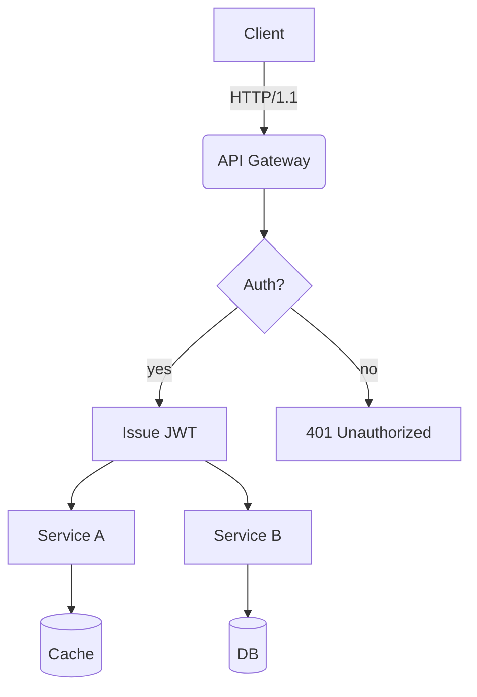
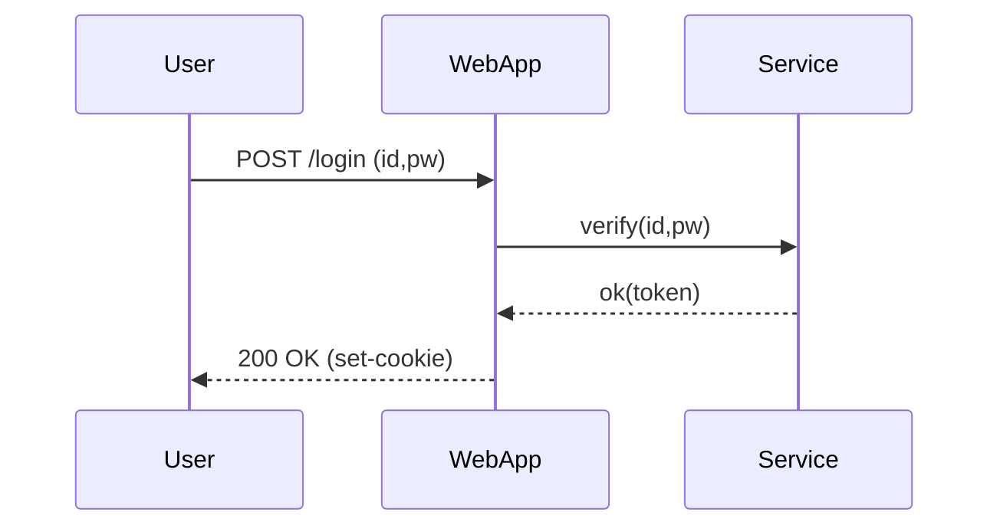
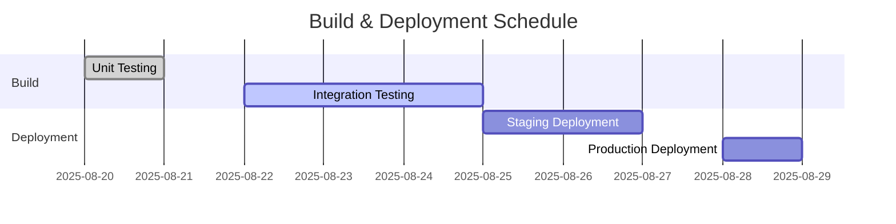
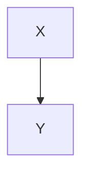

# Translation Test **Rich Markdown** Document

This document is designed to exceed *4096 tokens* with a collection of various formats of Korean content.  
The purpose is to test the robustness (robustness) including context handling, format preservation, ignoring rules for code/charts by translators/LLMs.

> **Guide**
> 1) Ensure code blocks and `mermaid` areas remain intact.
> 2) Verify preservation of numbers/units (e.g., 1.2GB, 3ms), slash paths (`/var/log/app.log`), and options (`--flag`).
> 3) Ensure layout stability even when mixed layouts of tables, lists, quotations, checkboxes, equations, and emojis 😀.

## 1. Mixed Table and Symbols/Units

| Item       | Value | Unit | Notes          |
|------------|-------|------|----------------|
| Throughput | 12,345| RPS  | Peak at 18,900 RPS |
| Latency (P50) | 3.2  | ms   | `--enable-cache` applied |
| Latency (P99) | 41.7 | ms   | Includes GC period |
| Memory     | 1.5   | GB   | RSS basis, cgroup limit 2GB |
| Disk I/O   | 220   | MB/s | Via NVMe-oF(TCP) |

## 2. Task List

- [x] Accuracy of Markdown Header Translation
- [x] Preservation of Keywords within Code Blocks (`for`, `if`, `return`, etc.)
- [ ] Preservation of Mermaid Diagrams and Ignoring Comments
- [ ] Preservation of Units (GB/ms/%), Paths (`/etc/hosts`)
- [ ] Preservation of Inline Equations $O(n \log n)$

## 3. Code Blocks: Bash/Python/JSON/YAML

```bash
#!/usr/bin/env bash
set -euo pipefail

APP_ENV="${APP_ENV:-prod}"
INPUT="${1:-/data/input.txt}"
OUT="/var/tmp/result.json"

echo "[INFO] starting job on $(hostname) at $(date -Iseconds)"
if [[ ! -f "$INPUT" ]]; then
  echo "[ERROR] input not found: $INPUT" >&2
  exit 1
fi

lines=$(wc -l < "$INPUT")
echo "[DEBUG] line count: $lines"

curl -sS -X POST "http://127.0.0.1:8080/api" \  -H "Content-Type: application/json" \  -d "{"env":"$APP_ENV","count":$lines}" > "$OUT"

jq -r '.status' "$OUT" | grep -q success && echo "OK" || { echo "FAIL"; exit 2; }
```

```python
from __future__ import annotations

def rolling_avg(xs: list[float], k: int) -> list[float]:
    if k <= 0:
        raise ValueError("k must be > 0")
    out = []
    acc = 0.0
    for i, v in enumerate(xs):
        acc += v
        if i >= k:
            acc -= xs[i-k]
        if i >= k - 1:
            out.append(acc / k)
    return out

print(rolling_avg([1,2,3,4,5,6,7,8,9], 3))
```

```json
{
  "service": "analytics",
  "version": "1.4.2",
  "features": ["rollup", "compaction", "delta-index"],
  "limits": {
    "max_docs": 1000000,
    "max_payload_mb": 256
  }
}
```

```yaml
apiVersion: v1
kind: ConfigMap
metadata:
  name: test-config
data:
  APP_ENV: "staging"
  ENDPOINT: "https://api.example.com"
```

## 4. Mermaid Diagrams

### 4.1 Flowchart


### 4.2 Sequence Diagram


### 4.3 Gantt Chart


## 5. Images/Links/Quotes


- Document: [https://example.com/docs/guide](https://example.com/docs/guide)
- API Reference: [API Reference](https://example.com/api)
- Issue Tracker: https://example.com/issues

> “Translation quality is determined by the simultaneous preservation of layout and meaning.” — Anonymous

## 6. Mixed Equations and Text

- Average Time Complexity: $O(n \log n)$, Worst: $O(n^2)$
- Variance: $\sigma^2 = \frac{1}{n}\sum_{i=1}^{n}(x_i-\mu)^2$
- Sample Mean: $\bar{x} = \frac{1}{n}\sum x_i$

Paragraph Example: This paragraph serves as a sample to ensure that **bold**, *italic*, and `code` snippets are preserved correctly even when mixed with translations.  
Includes emojis 😀, Chinese characters 漢字, English CamelCase, snake_case, kebab-case.

### 7.1 Experimental Section — Variation Patterns
The following section is similar but slightly varies in vocabulary and order each iteration to prevent repetitive translations.
- Scenario: Summary of Conversation Logs
- Condition: Includes 100k characters in Korean
- Expected Outcome: Summary accuracy of over 90%

#### Procedure
1. Input Data: `/data/input_01.jsonl`
2. Options: `--batch 512 --timeout 3s --enable-cache`
3. Execution: `app run --job test-01 --qos high`
4. Verification: Check for `test-01 finished` in logs

#### Observations
- Longer GC cycles show an increasing trend in P99 latency
- Cache miss rate increases by 10% leading to approximately a 7% decrease in throughput
- Increasing connection pool size from 32 to 64 results in a decrease in retry rate per second from 1.2% to 0.6%

---

### 7.2 Experiment Section — Variation Pattern
The following section is similar but varies slightly in vocabulary and order per iteration to prevent redundant translations.
- Scenario: Dialogue Record Summary
- Condition: Includes 100k characters in Korean
- Expected Outcome: Summary accuracy rate ≥ 90%

#### Procedure
1. Input Data: `/data/input_02.jsonl`
2. Options: `--batch 512 --timeout 3s --enable-cache`
3. Execution: `app run --job test-02 --qos high`
4. Verification: Check if `test-02 finished` is included in logs

#### Observations
- Longer GC cycles show an increasing trend in P99 latency
- Processing throughput decreases by ~7% when cache miss ratio increases by 10%p
- Increase in connection pool size from 32 to 64 results in a decrease in retry rate per second from 1.2% to 0.6%

---

### 7.3 Experiment Section — Variation Pattern
The following section is similar but varies slightly in vocabulary and order per iteration to prevent redundant translations.
- Scenario: Kubernetes Deployment
- Condition: HPA Enabled
- Expected Outcome: Scale within range 2~10 operates successfully

#### Procedure
1. Input Data: `/data/input_03.jsonl`
2. Options: `--batch 512 --timeout 3s --enable-cache`
3. Execution: `app run --job test-03 --qos high`
4. Verification: Check if `test-03 finished` is included in logs

#### Observations
- Longer GC cycles show an increasing trend in P99 latency
- Processing throughput decreases by ~7% when cache miss ratio increases by 10%p
- Increase in connection pool size from 32 to 64 results in a decrease in retry rate per second from 1.2% to 0.6%

---

### 7.4 Experiment Section — Variation Pattern
The following section is similar but varies slightly in vocabulary and order per iteration to prevent redundant translations.
- Scenario: Kubernetes Deployment
- Condition: HPA Enabled
- Expected Outcome: Scale within range 2~10 operates successfully

#### Procedure
1. Input Data: `/data/input_04.jsonl`
2. Options: `--batch 512 --timeout 3s --enable-cache`
3. Execution: `app run --job test-04 --qos high`
4. Verification: Check if `test-04 finished` is included in logs

#### Observations
- Longer GC cycles show an increasing trend in P99 latency
- Processing throughput decreases by ~7% when cache miss ratio increases by 10%p
- Increase in connection pool size from 32 to 64 results in a decrease in retry rate per second from 1.2% to 0.6%

---

### 7.5 Experiment Section — Variation Pattern
The following section is similar but varies slightly in vocabulary and order per iteration to prevent redundant translations.
- Scenario: Dialogue Record Summary
- Condition: Includes 100k characters in Korean
- Expected Outcome: Summary accuracy rate ≥ 90%

#### Procedure
1. Input Data: `/data/input_05.jsonl`
2. Options: `--batch 512 --timeout 3s --enable-cache`
3. Execution: `app run --job test-05 --qos high`
4. Verification: Check if `test-05 finished` is included in logs

#### Observations
- Longer GC cycles show an increasing trend in P99 latency
- Processing throughput decreases by ~7% when cache miss ratio increases by 10%p
- Increase in connection pool size from 32 to 64 results in a decrease in retry rate per second from 1.2% to 0.6%

### 7.6 Experiment Section — Variation Pattern
The following section is similar but varies slightly in vocabulary and order per iteration to prevent redundant translations.
- Scenario: Mermaid Rendering
- Conditions: 50+ nodes, 100+ edges
- Expected Result: No layout distortion

#### Procedure
1. Input Data: `/data/input_06.jsonl`
2. Options: `--batch 512 --timeout 3s --enable-cache`
3. Execution: `app run --job test-06 --qos high`
4. Verification: Check if `test-06 finished` is included in the logs

#### Observations
- Longer GC cycles show an increasing trend in P99 latency
- Processing throughput decreases by ~7% when cache miss ratio increases by 10%p
- Increase in connection pool size from 32 to 64 results in a decrease in retry rate per second from 1.2% to 0.6%

---

### 7.7 Experiment Section — Variation Pattern
The following section is similar but varies slightly in vocabulary and order per iteration to prevent redundant translations.
- Scenario: Large JSON Parsing
- Conditions: 64MB payload, 4 workers
- Expected Result: Completion without memory spikes

#### Procedure
1. Input Data: `/data/input_07.jsonl`
2. Options: `--batch 512 --timeout 3s --enable-cache`
3. Execution: `app run --job test-07 --qos high`
4. Verification: Check if `test-07 finished` is included in the logs

#### Observations
- Longer GC cycles show an increasing trend in P99 latency
- Processing throughput decreases by ~7% when cache miss ratio increases by 10%p
- Increase in connection pool size from 32 to 64 results in a decrease in retry rate per second from 1.2% to 0.6%

---

### 7.8 Experiment Section — Variation Pattern
The following section is similar but varies slightly in vocabulary and order per iteration to prevent redundant translations.
- Scenario: Large JSON Parsing
- Conditions: 64MB payload, 4 workers
- Expected Result: Completion without memory spikes

#### Procedure
1. Input Data: `/data/input_08.jsonl`
2. Options: `--batch 512 --timeout 3s --enable-cache`
3. Execution: `app run --job test-08 --qos high`
4. Verification: Check if `test-08 finished` is included in the logs

#### Observations
- Longer GC cycles show an increasing trend in P99 latency
- Processing throughput decreases by ~7% when cache miss ratio increases by 10%p
- Increase in connection pool size from 32 to 64 results in a decrease in retry rate per second from 1.2% to 0.6%

---

### 7.9 Experiment Section — Variation Pattern
The following section is similar but varies slightly in vocabulary and order per iteration to prevent redundant translations.
- Scenario: Large JSON Parsing
- Conditions: 64MB payload, 4 workers
- Expected Result: Completion without memory spikes

#### Procedure
1. Input Data: `/data/input_09.jsonl`
2. Options: `--batch 512 --timeout 3s --enable-cache`
3. Execution: `app run --job test-09 --qos high`
4. Verification: Check if `test-09 finished` is included in the logs

#### Observations
- Longer GC cycles show an increasing trend in P99 latency
- Processing throughput decreases by ~7% when cache miss ratio increases by 10%p
- Increase in connection pool size from 32 to 64 results in a decrease in retry rate per second from 1.2% to 0.6%

### 7.10 Experiment Section — Variation Pattern
The following section is similar but varies slightly in vocabulary and order per iteration to prevent redundant translations.
- Scenario: NVMe-oF I/O Retries
- Conditions: TCP RTT 2ms, Loss 0.1%
- Expected Result: Retry Rate ≤ 1%

#### Procedure
1. Input Data: `/data/input_10.jsonl`
2. Options: `--batch 512 --timeout 3s --enable-cache`
3. Execution: `app run --job test-10 --qos high`
4. Verification: Check for `test-10 finished` in logs

#### Observations
- Longer GC cycles show an increasing trend in P99 latency
- Processing throughput decreases by ~7% when cache miss ratio increases by 10%
- Increasing connection pool size from 32 to 64 results in retry rate dropping from 1.2% to 0.6% per second

---

### 7.11 Experiment Section — Variation Pattern
The following section is similar but varies slightly in vocabulary and order per iteration to prevent redundant translations.
- Scenario: Large JSON Parsing
- Conditions: 64MB Payload, 4 Workers
- Expected Result: Completion without Memory Spikes

#### Procedure
1. Input Data: `/data/input_11.jsonl`
2. Options: `--batch 512 --timeout 3s --enable-cache`
3. Execution: `app run --job test-11 --qos high`
4. Verification: Check for `test-11 finished` in logs

#### Observations
- Longer GC cycles show an increasing trend in P99 latency
- Processing throughput decreases by ~7% when cache miss ratio increases by 10%
- Increasing connection pool size from 32 to 64 results in retry rate dropping from 1.2% to 0.6% per second

---

### 7.12 Experiment Section — Variation Pattern
The following section is similar but varies slightly in vocabulary and order per iteration to prevent redundant translations.
- Scenario: Kubernetes Deployment
- Conditions: HPA Enabled
- Expected Result: Scale within Range 2~10

#### Procedure
1. Input Data: `/data/input_12.jsonl`
2. Options: `--batch 512 --timeout 3s --enable-cache`
3. Execution: `app run --job test-12 --qos high`
4. Verification: Check for `test-12 finished` in logs

#### Observations
- Longer GC cycles show an increasing trend in P99 latency
- Processing throughput decreases by ~7% when cache miss ratio increases by 10%
- Increasing connection pool size from 32 to 64 results in retry rate dropping from 1.2% to 0.6% per second

---

### 7.13 Experiment Section — Variation Pattern
The following section is similar but varies slightly in vocabulary and order per iteration to prevent redundant translations.
- Scenario: Large JSON Parsing
- Conditions: 64MB Payload, 4 Workers
- Expected Result: Completion without Memory Spikes

#### Procedure
1. Input Data: `/data/input_13.jsonl`
2. Options: `--batch 512 --timeout 3s --enable-cache`
3. Execution: `app run --job test-13 --qos high`
4. Verification: Check for `test-13 finished` in logs

#### Observations
- Longer GC cycles show an increasing trend in P99 latency
- Processing throughput decreases by ~7% when cache miss ratio increases by 10%
- Increasing connection pool size from 32 to 64 results in retry rate dropping from 1.2% to 0.6% per second

### 7.14 Experiment Section — Variation Pattern
The following section is similar but varies slightly in vocabulary and order per iteration to prevent repetitive translations.
- Scenario: Large JSON Parsing
- Conditions: 64MB payload, 4 workers
- Expected Result: Completion without memory spikes

#### Procedure
1. Input Data: `/data/input_14.jsonl`
2. Options: `--batch 512 --timeout 3s --enable-cache`
3. Execution: `app run --job test-14 --qos high`
4. Verification: Check for `test-14 finished` in logs

#### Observations
- Longer GC cycles show a tendency towards increased P99 latency
- Processing throughput decreases by ~7% when cache miss ratio increases by 10%
- Seconds per retry rate decreases from 1.2% to 0.6% when connection pool size increases from 32 to 64

---

### 7.15 Experiment Section — Variation Pattern
The following section is similar but varies slightly in vocabulary and order per iteration to prevent repetitive translations.
- Scenario: NVMe-oF I/O Retries
- Conditions: TCP RTT 2ms, loss 0.1%
- Expected Result: Retry rate ≤ 1%

#### Procedure
1. Input Data: `/data/input_15.jsonl`
2. Options: `--batch 512 --timeout 3s --enable-cache`
3. Execution: `app run --job test-15 --qos high`
4. Verification: Check for `test-15 finished` in logs

#### Observations
- Longer GC cycles show a tendency towards increased P99 latency
- Processing throughput decreases by ~7% when cache miss ratio increases by 10%
- Seconds per retry rate decreases from 1.2% to 0.6% when connection pool size increases from 32 to 64

---

### 7.16 Experiment Section — Variation Pattern
The following section is similar but varies slightly in vocabulary and order per iteration to prevent repetitive translations.
- Scenario: Mermaid Rendering
- Conditions: 50+ nodes, 100+ edges
- Expected Result: No layout distortion

#### Procedure
1. Input Data: `/data/input_16.jsonl`
2. Options: `--batch 512 --timeout 3s --enable-cache`
3. Execution: `app run --job test-16 --qos high`
4. Verification: Check for `test-16 finished` in logs

#### Observations
- Longer GC cycles show a tendency towards increased P99 latency
- Processing throughput decreases by ~7% when cache miss ratio increases by 10%
- Seconds per retry rate decreases from 1.2% to 0.6% when connection pool size increases from 32 to 64

---

### 7.17 Experiment Section — Variation Pattern
The following section is similar but varies slightly in vocabulary and order per iteration to prevent repetitive translations.
- Scenario: Conversation Record Summarization
- Conditions: Includes 100k characters in Korean
- Expected Result: Summary rate ≥ 90%

#### Procedure
1. Input Data: `/data/input_17.jsonl`
2. Options: `--batch 512 --timeout 3s --enable-cache`
3. Execution: `app run --job test-17 --qos high`
4. Verification: Check for `test-17 finished` in logs

#### Observations
- Longer GC cycles show a tendency towards increased P99 latency
- Processing throughput decreases by ~7% when cache miss ratio increases by 10%
- Seconds per retry rate decreases from 1.2% to 0.6% when connection pool size increases from 32 to 64

### 7.18 Experiment Section — Variation Pattern
The following section is similar but varies slightly in vocabulary and order per iteration to prevent repetitive translations.
- Scenario: Large JSON Parsing
- Conditions: 64MB payload, 4 workers
- Expected Result: Completion without memory spikes

#### Procedure
1. Input Data: `/data/input_18.jsonl`
2. Options: `--batch 512 --timeout 3s --enable-cache`
3. Execution: `app run --job test-18 --qos high`
4. Verification: Check if `test-18 finished` is included in the logs

#### Observations
- Longer GC cycles show a tendency towards increased P99 latency
- Processing throughput decreases by ~7% when cache miss ratio increases by 10%p
- Increase in connection pool size from 32 to 64 results in a decrease in retry rate per second from 1.2% to 0.6%

---

### 7.19 Experiment Section — Variation Pattern
The following section is similar but varies slightly in vocabulary and order per iteration to prevent repetitive translations.
- Scenario: Large JSON Parsing
- Conditions: 64MB payload, 4 workers
- Expected Result: Completion without memory spikes

#### Procedure
1. Input Data: `/data/input_19.jsonl`
2. Options: `--batch 512 --timeout 3s --enable-cache`
3. Execution: `app run --job test-19 --qos high`
4. Verification: Check if `test-19 finished` is included in the logs

#### Observations
- Longer GC cycles show a tendency towards increased P99 latency
- Processing throughput decreases by ~7% when cache miss ratio increases by 10%p
- Increase in connection pool size from 32 to 64 results in a decrease in retry rate per second from 1.2% to 0.6%

---

### 7.20 Experiment Section — Variation Pattern
The following section is similar but varies slightly in vocabulary and order per iteration to prevent repetitive translations.
- Scenario: NVMe-oF I/O Retries
- Conditions: TCP RTT 2ms, loss 0.1%
- Expected Result: Retry rate ≤ 1%

#### Procedure
1. Input Data: `/data/input_20.jsonl`
2. Options: `--batch 512 --timeout 3s --enable-cache`
3. Execution: `app run --job test-20 --qos high`
4. Verification: Check if `test-20 finished` is included in the logs

#### Observations
- Longer GC cycles show a tendency towards increased P99 latency
- Processing throughput decreases by ~7% when cache miss ratio increases by 10%p
- Increase in connection pool size from 32 to 64 results in a decrease in retry rate per second from 1.2% to 0.6%

---

### 7.21 Experiment Section — Variation Pattern
The following section is similar but varies slightly in vocabulary and order per iteration to prevent repetitive translations.
- Scenario: Kubernetes Deployment
- Conditions: HPA Enabled
- Expected Result: Operation within scale range 2~10

#### Procedure
1. Input Data: `/data/input_21.jsonl`
2. Options: `--batch 512 --timeout 3s --enable-cache`
3. Execution: `app run --job test-21 --qos high`
4. Verification: Check if `test-21 finished` is included in the logs

#### Observations
- Longer GC cycles show a tendency towards increased P99 latency
- Processing throughput decreases by ~7% when cache miss ratio increases by 10%p
- Increase in connection pool size from 32 to 64 results in a decrease in retry rate per second from 1.2% to 0.6%

### 7.22 Experiment Section — Variation Pattern
The following section is similar but varies slightly in vocabulary and order each iteration to prevent redundant translations.
- Scenario: Mermaid Rendering
- Conditions: 50+ nodes, 100+ edges
- Expected Result: No layout distortion

#### Procedure
1. Input Data: `/data/input_22.jsonl`
2. Options: `--batch 512 --timeout 3s --enable-cache`
3. Execution: `app run --job test-22 --qos high`
4. Verification: Check if `test-22 finished` is included in the logs

#### Observations
- Longer GC cycles show an increasing trend in P99 latency
- Processing throughput decreases by ~7% when cache miss ratio increases by 10%p
- Increase in connection pool size from 32 to 64 results in a decrease in retry rate per second from 1.2% to 0.6%

---

### 7.23 Experiment Section — Variation Pattern
The following section is similar but varies slightly in vocabulary and order each iteration to prevent redundant translations.
- Scenario: Large JSON Parsing
- Conditions: 64MB payload, 4 workers
- Expected Result: Completion without memory spikes

#### Procedure
1. Input Data: `/data/input_23.jsonl`
2. Options: `--batch 512 --timeout 3s --enable-cache`
3. Execution: `app run --job test-23 --qos high`
4. Verification: Check if `test-23 finished` is included in the logs

#### Observations
- Longer GC cycles show an increasing trend in P99 latency
- Processing throughput decreases by ~7% when cache miss ratio increases by 10%p
- Increase in connection pool size from 32 to 64 results in a decrease in retry rate per second from 1.2% to 0.6%

---

### 7.24 Experiment Section — Variation Pattern
The following section is similar but varies slightly in vocabulary and order each iteration to prevent redundant translations.
- Scenario: Mermaid Rendering
- Conditions: 50+ nodes, 100+ edges
- Expected Result: No layout distortion

#### Procedure
1. Input Data: `/data/input_24.jsonl`
2. Options: `--batch 512 --timeout 3s --enable-cache`
3. Execution: `app run --job test-24 --qos high`
4. Verification: Check if `test-24 finished` is included in the logs

#### Observations
- Longer GC cycles show an increasing trend in P99 latency
- Processing throughput decreases by ~7% when cache miss ratio increases by 10%p
- Increase in connection pool size from 32 to 64 results in a decrease in retry rate per second from 1.2% to 0.6%

---

### 7.25 Experiment Section — Variation Pattern
The following section is similar but varies slightly in vocabulary and order each iteration to prevent redundant translations.
- Scenario: Kubernetes Deployment
- Conditions: HPA (Horizontal Pod Autoscaler) Enabled
- Expected Result: Scale within range 2~10

#### Procedure
1. Input Data: `/data/input_25.jsonl`
2. Options: `--batch 512 --timeout 3s --enable-cache`
3. Execution: `app run --job test-25 --qos high`
4. Verification: Check if `test-25 finished` is included in the logs

#### Observations
- Longer GC cycles show an increasing trend in P99 latency
- Processing throughput decreases by ~7% when cache miss ratio increases by 10%p
- Increase in connection pool size from 32 to 64 results in a decrease in retry rate per second from 1.2% to 0.6%

### 7.26 Experiment Section — Variation Pattern
The following section is similar but varies slightly in vocabulary and order per iteration to prevent redundant translations.
- Scenario: NVMe-oF I/O Retries
- Conditions: TCP RTT 2ms, Loss 0.1%
- Expected Result: Retry Rate ≤ 1%

#### Procedure
1. Input Data: `/data/input_26.jsonl`
2. Options: `--batch 512 --timeout 3s --enable-cache`
3. Execution: `app run --job test-26 --qos high`
4. Verification: Check for `test-26 finished` in logs

#### Observations
- Longer GC cycles show an increasing trend in P99 latency
- Processing throughput decreases by ~7% when cache miss ratio increases by 10%p
- Increasing connection pool size from 32 to 64 results in retry rate per second decreasing from 1.2% to 0.6%

---

### 7.27 Experiment Section — Variation Pattern
The following section is similar but varies slightly in vocabulary and order per iteration to prevent redundant translations.
- Scenario: Conversation Record Summarization
- Conditions: Includes 100k characters in Korean text
- Expected Result: Summary Rate ≥ 90%

#### Procedure
1. Input Data: `/data/input_27.jsonl`
2. Options: `--batch 512 --timeout 3s --enable-cache`
3. Execution: `app run --job test-27 --qos high`
4. Verification: Check for `test-27 finished` in logs

#### Observations
- Longer GC cycles show an increasing trend in P99 latency
- Processing throughput decreases by ~7% when cache miss ratio increases by 10%p
- Increasing connection pool size from 32 to 64 results in retry rate per second decreasing from 1.2% to 0.6%

---

### 7.28 Experiment Section — Variation Pattern
The following section is similar but varies slightly in vocabulary and order per iteration to prevent redundant translations.
- Scenario: Conversation Record Summarization
- Conditions: Includes 100k characters in Korean text
- Expected Result: Summary Rate ≥ 90%

#### Procedure
1. Input Data: `/data/input_28.jsonl`
2. Options: `--batch 512 --timeout 3s --enable-cache`
3. Execution: `app run --job test-28 --qos high`
4. Verification: Check for `test-28 finished` in logs

#### Observations
- Longer GC cycles show an increasing trend in P99 latency
- Processing throughput decreases by ~7% when cache miss ratio increases by 10%p
- Increasing connection pool size from 32 to 64 results in retry rate per second decreasing from 1.2% to 0.6%

---

### 7.29 Experiment Section — Variation Pattern
The following section is similar but varies slightly in vocabulary and order per iteration to prevent redundant translations.
- Scenario: Large JSON Parsing
- Conditions: 64MB Payload, 4 Workers
- Expected Result: Completion without Memory Spikes

#### Procedure
1. Input Data: `/data/input_29.jsonl`
2. Options: `--batch 512 --timeout 3s --enable-cache`
3. Execution: `app run --job test-29 --qos high`
4. Verification: Check for `test-29 finished` in logs

#### Observations
- Longer GC cycles show an increasing trend in P99 latency
- Processing throughput decreases by ~7% when cache miss ratio increases by 10%p
- Increasing connection pool size from 32 to 64 results in retry rate per second decreasing from 1.2% to 0.6%

### 7.30 Experiment Section — Variation Pattern
The following paragraph is similar but varies slightly in vocabulary and order each iteration to prevent redundant translations.
- Scenario: Summary of conversation logs
- Condition: Includes 100k characters in Korean
- Expected Outcome: Summary accuracy rate of over 90%

#### Procedure
1. Input Data: `/data/input_30.jsonl`
2. Options: `--batch 512 --timeout 3s --enable-cache`
3. Execution: `app run --job test-30 --qos high`
4. Verification: Check if `test-30 finished` is included in the logs

#### Observations
- Longer GC cycles show an increasing trend in P99 latency
- Processing throughput decreases by ~7% when cache miss ratio increases by 10%
- Increase in connection pool size from 32 to 64 results in a decrease in retry rate per second from 1.2% to 0.6%

---

### 7.31 Experiment Section — Variation Pattern
The following paragraph is similar but varies slightly in vocabulary and order each iteration to prevent redundant translations.
- Scenario: Kubernetes deployment
- Condition: HPA (Horizontal Pod Autoscaler) enabled
- Expected Outcome: Scale within range of 2~10 pods

#### Procedure
1. Input Data: `/data/input_31.jsonl`
2. Options: `--batch 512 --timeout 3s --enable-cache`
3. Execution: `app run --job test-31 --qos high`
4. Verification: Check if `test-31 finished` is included in the logs

#### Observations
- Longer GC cycles show an increasing trend in P99 latency
- Processing throughput decreases by ~7% when cache miss ratio increases by 10%
- Increase in connection pool size from 32 to 64 results in a decrease in retry rate per second from 1.2% to 0.6%

---

### 7.32 Experiment Section — Variation Pattern
The following paragraph is similar but varies slightly in vocabulary and order each iteration to prevent redundant translations.
- Scenario: Mermaid diagram rendering
- Condition: More than 50 nodes, more than 100 edges
- Expected Outcome: No layout distortion

#### Procedure
1. Input Data: `/data/input_32.jsonl`
2. Options: `--batch 512 --timeout 3s --enable-cache`
3. Execution: `app run --job test-32 --qos high`
4. Verification: Check if `test-32 finished` is included in the logs

#### Observations
- Longer GC cycles show an increasing trend in P99 latency
- Processing throughput decreases by ~7% when cache miss ratio increases by 10%
- Increase in connection pool size from 32 to 64 results in a decrease in retry rate per second from 1.2% to 0.6%

---

### 7.33 Experiment Section — Variation Pattern
The following paragraph is similar but varies slightly in vocabulary and order each iteration to prevent redundant translations.
- Scenario: Parsing large JSON files
- Condition: 64MB payload, 4 workers
- Expected Outcome: Completion without memory spikes

#### Procedure
1. Input Data: `/data/input_33.jsonl`
2. Options: `--batch 512 --timeout 3s --enable-cache`
3. Execution: `app run --job test-33 --qos high`
4. Verification: Check if `test-33 finished` is included in the logs

#### Observations
- Longer GC cycles show an increasing trend in P99 latency
- Processing throughput decreases by ~7% when cache miss ratio increases by 10%
- Increase in connection pool size from 32 to 64 results in a decrease in retry rate per second from 1.2% to 0.6%

### 7.34 Experiment Section — Variation Pattern
The following section is similar but varies slightly in vocabulary and order per iteration to prevent repetitive translations.
- Scenario: Kubernetes Deployment
- Condition: HPA Enabled
- Expected Result: Scale within range of 2~10

#### Procedure
1. Input Data: `/data/input_34.jsonl`
2. Options: `--batch 512 --timeout 3s --enable-cache`
3. Execution: `app run --job test-34 --qos high`
4. Verification: Check for `test-34 finished` in logs

#### Observations
- Longer GC cycles show a tendency towards increased P99 latency
- Processing throughput decreases by ~7% when cache miss ratio increases by 10%p
- Seconds per retry rate decreases from 1.2% to 0.6% when connection pool size increases from 32 to 64

---

### 7.35 Experiment Section — Variation Pattern
The following section is similar but varies slightly in vocabulary and order per iteration to prevent repetitive translations.
- Scenario: Mermaid Rendering
- Condition: Over 50 nodes, Over 100 edges
- Expected Result: No layout distortion

#### Procedure
1. Input Data: `/data/input_35.jsonl`
2. Options: `--batch 512 --timeout 3s --enable-cache`
3. Execution: `app run --job test-35 --qos high`
4. Verification: Check for `test-35 finished` in logs

#### Observations
- Longer GC cycles show a tendency towards increased P99 latency
- Processing throughput decreases by ~7% when cache miss ratio increases by 10%p
- Seconds per retry rate decreases from 1.2% to 0.6% when connection pool size increases from 32 to 64

---

### 7.36 Experiment Section — Variation Pattern
The following section is similar but varies slightly in vocabulary and order per iteration to prevent repetitive translations.
- Scenario: NVMe-oF I/O Retries
- Condition: TCP RTT 2ms, Loss 0.1%
- Expected Result: Retry rate ≤ 1%

#### Procedure
1. Input Data: `/data/input_36.jsonl`
2. Options: `--batch 512 --timeout 3s --enable-cache`
3. Execution: `app run --job test-36 --qos high`
4. Verification: Check for `test-36 finished` in logs

#### Observations
- Longer GC cycles show a tendency towards increased P99 latency
- Processing throughput decreases by ~7% when cache miss ratio increases by 10%p
- Seconds per retry rate decreases from 1.2% to 0.6% when connection pool size increases from 32 to 64

---

### 7.37 Experiment Section — Variation Pattern
The following section is similar but varies slightly in vocabulary and order per iteration to prevent repetitive translations.
- Scenario: Large JSON Parsing
- Condition: 64MB Payload, 4 Workers
- Expected Result: Completion without memory spikes

#### Procedure
1. Input Data: `/data/input_37.jsonl`
2. Options: `--batch 512 --timeout 3s --enable-cache`
3. Execution: `app run --job test-37 --qos high`
4. Verification: Check for `test-37 finished` in logs

#### Observations
- Longer GC cycles show a tendency towards increased P99 latency
- Processing throughput decreases by ~7% when cache miss ratio increases by 10%p
- Seconds per retry rate decreases from 1.2% to 0.6% when connection pool size increases from 32 to 64

### 7.38 Experiment Paragraph — Variation Pattern
The following paragraph is similar but slightly alters vocabulary and order each iteration to prevent repetitive translations.
- Scenario: Mermaid Rendering
- Conditions: Over 50 nodes, Over 100 edges
- Expected Result: No layout distortion

#### Procedure
1. Input Data: `/data/input_38.jsonl`
2. Options: `--batch 512 --timeout 3s --enable-cache`
3. Execution: `app run --job test-38 --qos high`
4. Verification: Check for inclusion of `test-38 finished` in logs

#### Observations
- Longer GC cycles show an increasing trend in P99 latency
- Processing throughput decreases by ~7% when cache miss ratio increases by 10%p
- Increase in connection pool size from 32 to 64 results in a decrease in retry rate per second from 1.2% to 0.6%

---

### 7.39 Experiment Paragraph — Variation Pattern
The following paragraph is similar but slightly alters vocabulary and order each iteration to prevent repetitive translations.
- Scenario: Mermaid Rendering
- Conditions: Over 50 nodes, Over 100 edges
- Expected Result: No layout distortion

#### Procedure
1. Input Data: `/data/input_39.jsonl`
2. Options: `--batch 512 --timeout 3s --enable-cache`
3. Execution: `app run --job test-39 --qos high`
4. Verification: Check for inclusion of `test-39 finished` in logs

#### Observations
- Longer GC cycles show an increasing trend in P99 latency
- Processing throughput decreases by ~7% when cache miss ratio increases by 10%p
- Increase in connection pool size from 32 to 64 results in a decrease in retry rate per second from 1.2% to 0.6%

---

### 7.40 Experiment Paragraph — Variation Pattern
The following paragraph is similar but slightly alters vocabulary and order each iteration to prevent repetitive translations.
- Scenario: Summary of Conversation Records
- Conditions: Including 100k characters in Korean
- Expected Result: Summary accuracy over 90%

#### Procedure
1. Input Data: `/data/input_40.jsonl`
2. Options: `--batch 512 --timeout 3s --enable-cache`
3. Execution: `app run --job test-40 --qos high`
4. Verification: Check for inclusion of `test-40 finished` in logs

#### Observations
- Longer GC cycles show an increasing trend in P99 latency
- Processing throughput decreases by ~7% when cache miss ratio increases by 10%p
- Increase in connection pool size from 32 to 64 results in a decrease in retry rate per second from 1.2% to 0.6%

## 8. Long List Items

- 2. Error Handling Consistency — Case #001
- 3. Performance Profiling — Case #002
- 4. Accessibility (a11y) — Case #003
- 5. Log Schema Stability — Case #004
- 6. Cache Invalidation Scenarios — Case #005
- 7. Performance Profiling — Case #006
- 8. Performance Profiling — Case #007
- 9. API Backward Compatibility — Case #008
- 10. Log Schema Stability — Case #009
- 11. Accessibility (a11y) — Case #010
- 12. Cache Invalidation Scenarios — Case #011
- 13. Performance Profiling — Case #012
- 14. Security Header Implementation — Case #013
- 15. Resource Leak Detection — Case #015
- 16. Error Handling Consistency — Case #016
- 17. Error Handling Consistency — Case #017
- 18. Internationalization (i18n) — Case #018
- 19. CORS Policy Validation — Case #019
- 20. Performance Profiling — Case #020
- 21. Security Header Implementation — Case #021
- 22. Log Schema Stability — Case #022
- 23. Performance Profiling — Case #023
- 24. Cache Invalidation Scenarios — Case #024
- 25. CORS Policy Validation — Case #025
- 26. Performance Profiling — Case #026
- 27. Accessibility (a11y) — Case #027
- 28. Accessibility (a11y) — Case #028
- 29. API Backward Compatibility — Case #029
- 30. Cache Invalidation Scenarios — Case #030
- 31. Cache Invalidation Scenarios — Case #031
- 32. Performance Profiling — Case #032
- 33. Resource Leak Detection — Case #033
- 34. Log Schema Stability — Case #034
- 35. CORS Policy Validation — Case #035
- 36. Error Handling Consistency — Case #036
- 37. Resource Leak Detection — Case #037
- 38. Error Handling Consistency — Case #038
- 39. Internationalization (i18n) — Case #039
- 40. API Backward Compatibility — Case #040
- 41. Cache Invalidation Scenarios — Case #041
- 42. Cache Invalidation Scenarios — Case #042
- 43. Cache Invalidation Scenarios — Case #043
- 44. Performance Profiling — Case #044
- 45. Performance Profiling — Case #045
- 46. CORS Policy Validation — Case #046
- 47. Resource Leak Detection — Case #047
- 48. Cache Invalidation Scenarios — Case #048
- 49. Error Handling Consistency — Case #049
- 50. Log Schema Stability — Case #050
- 51. Resource Leak Detection — Case #051
- 52. Internationalization (i18n) — Case #052
- 53. Log Schema Stability — Case #053
- 54. Resource Leak Detection — Case #054
- 55. Security Header Implementation — Case #055
- 57. Internationalization (i18n) — Case #056
- 58. API Backward Compatibility — Case #057
- 59. Accessibility (a11y) — Case #058
- 60. API Backward Compatibility — Case #059
- 61. Performance Profiling — Case #060
- 62. Accessibility (a11y) — Case #061
- 63. API Backward Compatibility — Case #062
- 64. Internationalization (i18n) — Case #063
- 65. Security Header Implementation — Case #064
- 66. Error Handling Consistency — Case #065
- 67. Performance Profiling — Case #066
- 68. Accessibility (a11y) — Case #067
- 69. Error Handling Consistency — Case #068
- 70. Performance Profiling — Case #069
- 71. Resource Leak Detection — Case #070
- 72. Accessibility (a11y) — Case #071
- 73. Internationalization (i18n) — Case #072
- 74. Error Handling Consistency — Case #073
- 75. Internationalization (i18n) — Case #074
- 76. Performance Profiling — Case #075
- 77. Security Header Implementation — Case #076
- 78. CORS Policy Validation — Case #077
- 79. Resource Leak Detection — Case #078
- 80. Resource Leak Detection — Case #079
- 81. Performance Profiling — Case #080
- 82. Accessibility (a11y) — Case #081
- 83. Accessibility (a11y) — Case #082
- 84. Performance Profiling — Case #083
- 85. Resource Leak Detection — Case #084
- 86. Cache Invalidation Scenarios — Case #086
- 87. CORS Policy Validation — Case #087
- 88. Log Schema Stability — Case #088
- 89. CORS Policy Validation — Case #089
- 90. Security Header Implementation — Case #090
- 91. API Backward Compatibility — Case #091
- 92. Accessibility (a11y) — Case #092
- 93. Performance Profiling — Case #093
- 94. Performance Profiling — Case #094
- 95. Log Schema Stability — Case #095
- 96. Internationalization (i18n) — Case #096
- 97. API Backward Compatibility — Case #097
- 98. Error Handling Consistency — Case #098
- 99. Cache Invalidation Scenarios — Case #099
- 100. Accessibility (a11y) — Case #100
- 101. Accessibility (a11y) — Case #101
- 102. Internationalization (i18n) — Case #102
- 103. Accessibility (a11y) — Case #103
- 104. API Backward Compatibility — Case #104
- 105. Accessibility (a11y) — Case #105
- 106. Performance Profiling — Case #106
- 107. Security Header Implementation — Case #107
- 108. API Backward Compatibility — Case #108
- 109. Security Header Implementation — Case #109
- 110. Error Handling Consistency — Case #110
- 111. Performance Profiling — Case #111
- 112. Resource Leak Detection — Case #112
- 113. CORS Policy Validation — Case #113
- 114. Accessibility (a11y) — Case #114
- 115. Error Handling Consistency — Case #115
- 116. Error Handling Consistency — Case #116
- 117. Performance Profiling — Case #117
- 118. CORS Policy Validation — Case #118
- 119. Resource Leak Detection — Case #119
- 120. Cache Invalidation Scenarios — Case #120
- 121. CORS Policy Validation — Case #121
- 122. Performance Profiling — Case #122
- 123. Error Handling Consistency — Case #123
- 124. Performance Profiling — Case #124
- 125. Performance Profiling — Case #125
- 126. Accessibility (a11y) — Case #126
- 127. Accessibility (a11y) — Case #127
- 128. Error Handling Consistency — Case #128
- 129. Error Handling Consistency — Case #129
- 130. API Backward Compatibility — Case #130
- 132. Accessibility (a11y) — Case #131
- 133. API Backward Compatibility — Case #132
- 134. Cache Invalidation Scenarios — Case #133
- 135. Security Header Implementation — Case #134
- 136. Internationalization (i18n) — Case #135
- 137. Security Header Implementation — Case #136
- 138. Performance Profiling — Case #137
- 139. Performance Profiling — Case #138
- 140. CORS Policy Validation — Case #139
- 141. Internationalization (i18n) — Case #140
- 142. Log Schema Stability — Case #141
- 143. CORS Policy Validation — Case #142
- 144. Accessibility (a11y) — Case #143
- 145. Security Header Implementation — Case #144
- 146. Log Schema Stability — Case #145
- 147. Performance Profiling — Case #146
- 148. Performance Profiling — Case #147
- 149. API Backward Compatibility — Case #148
- 150. Resource Leak Detection — Case #149
- 151. Performance Profiling — Case #150
- 152. Resource Leak Detection — Case #151
- 153. Accessibility (a11y) — Case #152
- 154. API Backward Compatibility — Case #153
- 155. Accessibility (a11y) — Case #154
- 156. Security Header Implementation — Case #155
- 157. Accessibility (a11y) — Case #156
- 158. Performance Profiling — Case #157
- 159. Cache Invalidation Scenarios — Case #158
- 160. Security Header Implementation — Case #159
- 161. Error Handling Consistency — Case #160
- 162. Log Schema Stability — Case #161
- 163. Performance Profiling — Case #162
- 164. Accessibility (a11y) — Case #163
- 165. Error Handling Consistency — Case #164
- 166. Resource Leak Detection — Case #165
- 167. Log Schema Stability — Case #166
- 168. Internationalization (i18n) — Case #167
- 169. Cache Invalidation Scenarios — Case #168
- 170. Internationalization (i18n) — Case #169
- 171. Cache Invalidation Scenarios — Case #170
- 172. Resource Leak Detection — Case #171
- 173. Security Header Implementation — Case #172
- 174. Resource Leak Detection — Case #173
- 175. Error Handling Consistency — Case #174
- 176. Resource Leak Detection — Case #175
- 177. Log Schema Stability — Case #176
- 178. CORS Policy Validation — Case #177
- 179. Security Header Implementation — Case #178
- 180. Log Schema Stability — Case #179
- 181. Performance Profiling — Case #180
- 182. Resource Leak Detection — Case #181
- 183. Internationalization (i18n) — Case #182
- 184. Log Schema Stability — Case #183
- 185. Accessibility (a11y) — Case #184
- 186. Security Header Implementation — Case #185
- 187. Resource Leak Detection — Case #186
- 188. Resource Leak Detection — Case #187
- 189. Accessibility (a11y) — Case #188
- 190. Cache Invalidation Scenarios — Case #189
- 191. Accessibility (a11y) — Case #190
- 192. Cache Invalidation Scenarios — Case #191
- 193. Error Handling Consistency — Case #192
- 194. Error Handling Consistency — Case #193
- 195. Resource Leak Detection — Case #194
- 196. Error Handling Consistency — Case #195
- 197. CORS Policy Validation — Case #196
- 198. Performance Profiling — Case #197
- 199. Resource Leak Detection — Case #198
- 200. Accessibility (a11y) — Case #199
- 201. Resource Leak Detection — Case #200
- 202. Cache Invalidation Scenarios — Case #201
- 203. Internationalization (i18n) — Case #202
- 204. Log Schema Stability — Case #203
- 205. Accessibility (a11y) — Case #204
- 206. Security Header Implementation — Case #205
- 207. Resource Leak Detection — Case #206
- 208. Resource Leak Detection — Case #207
- 209. Accessibility (a11y) — Case #208
- 210. Cache Invalidation Scenarios — Case #209
- 211. Error Handling Consistency — Case #210
- 212. Error Handling Consistency — Case #211
- 213. Resource Leak Detection — Case #212
- 204. Log Schema Stability — Case #203
- 205. Error Handling Consistency — Case #204
- 206. Resource Leak Check — Case #205
- 207. Security Header Implementation — Case #206
- 208. Resource Leak Check — Case #207
- 209. Cache Invalidation Scenario — Case #208
- 210. Performance Profiling — Case #209
- 211. Security Header Implementation — Case #210
- 212. Internationalization (i18n) — Case #211
- 213. Log Schema Stability — Case #212
- 214. Error Handling Consistency — Case #213
- 215. Cache Invalidation Scenario — Case #214
- 216. Security Header Implementation — Case #215
- 217. Internationalization (i18n) — Case #216
- 218. Security Header Implementation — Case #217
- 219. Performance Profiling — Case #218
- 220. Error Handling Consistency — Case #219
- 221. Security Header Implementation — Case #220
- 222. Performance Profiling — Case #221
- 223. API Backward Compatibility — Case #222
- 224. Resource Leak Check — Case #223
- 225. Internationalization (i18n) — Case #224
- 226. Security Header Implementation — Case #225
- 227. Internationalization (i18n) — Case #226
- 228. Performance Profiling — Case #227
- 229. Security Header Implementation — Case #228
- 230. CORS Policy Validation — Case #229
- 231. Performance Profiling — Case #230
- 232. API Backward Compatibility — Case #231
- 233. CORS Policy Validation — Case #232
- 234. Internationalization (i18n) — Case #233
- 235. Error Handling Consistency — Case #234
- 236. Performance Profiling — Case #235
- 237. Error Handling Consistency — Case #236
- 238. Performance Profiling — Case #237
- 239. Security Header Implementation — Case #238
- 240. Error Handling Consistency — Case #239
- 241. CORS Policy Validation — Case #240
- 242. API Backward Compatibility — Case #241
- 243. Performance Profiling — Case #242
- 244. Cache Invalidation Scenario — Case #243
- 245. Performance Profiling — Case #244
- 246. Security Header Implementation — Case #245
- 247. Error Handling Consistency — Case #246
- 248. Internationalization (i18n) — Case #247
- 249. Log Schema Stability — Case #248
- 250. Accessibility (a11y) — Case #250
- 251. Accessibility (a11y) — Case #251
- 252. Internationalization (i18n) — Case #252
- 253. Internationalization (i18n) — Case #253
- 254. CORS Policy Validation — Case #254
- 255. Log Schema Stability — Case #255
- 256. CORS Policy Validation — Case #256
- 257. Security Header Implementation — Case #257
- 258. Cache Invalidation Scenario — Case #258
- 259. Error Handling Consistency — Case #259
- 260. Accessibility (a11y) — Case #260
- 261. Resource Leak Check — Case #261
- 262. Resource Leak Check — Case #262
- 263. Performance Profiling — Case #263
- 264. Accessibility (a11y) — Case #264
- 265. Cache Invalidation Scenario — Case #265
- 266. Security Header Implementation — Case #266
- 267. Resource Leak Check — Case #267
- 268. Security Header Implementation — Case #268
- 269. Performance Profiling — Case #269
- 270. Error Handling Consistency — Case #270
- 271. Internationalization (i18n) — Case #271
- 272. API Backward Compatibility — Case #272
- 273. Error Handling Consistency — Case #273
- 274. Accessibility (a11y) — Case #274
- 276. API Backward Compatibility — Case #275
- 277. Internationalization (i18n) — Case #276
- 278. CORS Policy Validation — Case #277
- 279. Security Header Implementation — Case #278
- 280. Cache Invalidation Scenario — Case #279
- 281. Log Schema Stability — Case #280
- 282. Resource Leak Inspection — Case #281
- 283. Accessibility (a11y) — Case #282
- 284. Accessibility (a11y) — Case #283
- 285. Error Handling Consistency — Case #284
- 286. API Backward Compatibility — Case #285
- 287. Cache Invalidation Scenario — Case #286
- 288. Accessibility (a11y) — Case #287
- 289. Accessibility (a11y) — Case #288
- 290. Security Header Implementation — Case #289
- 291. Internationalization (i18n) — Case #290
- 292. Security Header Implementation — Case #291
- 293. CORS Policy Validation — Case #292
- 294. Resource Leak Inspection — Case #293
- 295. Security Header Implementation — Case #294
- 296. CORS Policy Validation — Case #295
- 297. Log Schema Stability — Case #296
- 298. Cache Invalidation Scenario — Case #297
- 299. API Backward Compatibility — Case #298
- 300. Cache Invalidation Scenario — Case #299
- 301. Internationalization (i18n) — Case #300
- 302. Accessibility (a11y) — Case #301
- 303. Performance Profiling — Case #302
- 304. API Backward Compatibility — Case #303
- 305. Error Handling Consistency — Case #304
- 306. Accessibility (a11y) — Case #305
- 307. Resource Leak Inspection — Case #306
- 308. API Backward Compatibility — Case #307
- 309. Security Header Implementation — Case #308
- 310. CORS Policy Validation — Case #309
- 311. API Backward Compatibility — Case #310
- 312. Accessibility (a11y) — Case #311
- 313. CORS Policy Validation — Case #312
- 314. Internationalization (i18n) — Case #313
- 315. Resource Leak Inspection — Case #314
- 316. Internationalization (i18n) — Case #315
- 317. Log Schema Stability — Case #316
- 318. Security Header Implementation — Case #317
- 319. Log Schema Stability — Case #318
- 320. Error Handling Consistency — Case #319
- 321. Performance Profiling — Case #320
- 322. Accessibility (a11y) — Case #321
- 323. Security Header Implementation — Case #322
- 324. API Backward Compatibility — Case #323
- 325. CORS Policy Validation — Case #324
- 326. Resource Leak Inspection — Case #325
- 327. CORS Policy Validation — Case #326
- 328. CORS Policy Validation — Case #327
- 329. API Backward Compatibility — Case #328
- 330. Accessibility (a11y) — Case #329
- 331. Performance Profiling — Case #330
- 332. CORS Policy Validation — Case #331
- 333. Resource Leak Inspection — Case #332
- 334. Performance Profiling — Case #333
- 335. Resource Leak Inspection — Case #334
- 336. Error Handling Consistency — Case #335
- 337. Internationalization (i18n) — Case #336
- 338. Cache Invalidation Scenario — Case #337
- 339. API Backward Compatibility — Case #338
- 340. Cache Invalidation Scenario — Case #339
- 341. CORS Policy Validation — Case #340
- 342. Internationalization (i18n) — Case #341
- 343. Performance Profiling — Case #342
- 344. Performance Profiling — Case #343
- 345. Log Schema Stability — Case #344
- 346. Error Handling Consistency — Case #345
- 347. API Backward Compatibility — Case #346
- 348. Error Handling Consistency — Case #347
- 350. Accessibility (a11y) — Case #349
- 351. Performance Profiling — Case #350
- 352. Accessibility (a11y) — Case #351
- 353. Error Handling Consistency — Case #352
- 354. Cache Invalidation Scenarios — Case #353
- 355. Internationalization (i18n) — Case #354
- 356. Resource Leak Inspection — Case #355
- 357. Accessibility (a11y) — Case #356
- 358. Security Header Implementation — Case #357
- 359. Resource Leak Inspection — Case #358
- 360. Performance Profiling — Case #359
- 361. Resource Leak Inspection — Case #360
- 362. Log Schema Stability — Case #361
- 363. Internationalization (i18n) — Case #362
- 364. Error Handling Consistency — Case #363
- 365. Resource Leak Inspection — Case #364
- 366. Accessibility (a11y) — Case #365
- 367. Log Schema Stability — Case #366
- 368. Resource Leak Inspection — Case #367
- 369. Performance Profiling — Case #368
- 370. API Backward Compatibility — Case #369
- 371. Accessibility (a11y) — Case #370
- 372. Performance Profiling — Case #371
- 373. CORS Policy Validation — Case #372
- 374. Cache Invalidation Scenarios — Case #373
- 375. Security Header Implementation — Case #374
- 376. Accessibility (a11y) — Case #375
- 377. API Backward Compatibility — Case #376
- 378. Accessibility (a11y) — Case #377
- 379. Security Header Implementation — Case #378
- 380. CORS Policy Validation — Case #379
- 381. CORS Policy Validation — Case #380
- 382. Log Schema Stability — Case #381
- 383. Log Schema Stability — Case #382
- 384. Performance Profiling — Case #383
- 385. Error Handling Consistency — Case #384
- 386. Performance Profiling — Case #385
- 387. Log Schema Stability — Case #386
- 388. Resource Leak Inspection — Case #387
- 389. Accessibility (a11y) — Case #388
- 390. API Backward Compatibility — Case #389
- 391. Performance Profiling — Case #390
- 392. CORS Policy Validation — Case #391
- 393. API Backward Compatibility — Case #392
- 394. Resource Leak Inspection — Case #393
- 395. Security Header Implementation — Case #394
- 396. Cache Invalidation Scenarios — Case #395
- 397. Resource Leak Inspection — Case #396
- 398. Performance Profiling — Case #397
- 399. Performance Profiling — Case #398
- 400. Error Handling Consistency — Case #399
- 401. Cache Invalidation Scenarios — Case #400
- 402. API Backward Compatibility — Case #401
- 403. Log Schema Stability — Case #402
- 404. Resource Leak Inspection — Case #403
- 405. Error Handling Consistency — Case #404
- 406. Accessibility (a11y) — Case #405
- 407. API Backward Compatibility — Case #406
- 408. API Backward Compatibility — Case #407
- 409. CORS Policy Validation — Case #408
- 410. Resource Leak Inspection — Case #409
- 411. Cache Invalidation Scenarios — Case #410
- 412. Security Header Implementation — Case #411
- 413. Security Header Implementation — Case #412
- 414. Security Header Implementation — Case #413
- 415. Accessibility (a11y) — Case #414
- 416. Internationalization (i18n) — Case #415
- 417. API Backward Compatibility — Case #416
- 418. Performance Profiling — Case #417
- 419. Cache Invalidation Scenarios — Case #418
- 420. Resource Leak Inspection — Case #419
- 421. Resource Leak Inspection — Case #420
- 422. Log Schema Stability — Case #421
- 423. API Backward Compatibility — Case #422
- 424. Accessibility (a11y) — Case #423
- 425. Log Schema Stability — Case #424
- 426. Cache Invalidation Scenarios — Case #425
- 427. Internationalization (i18n) — Case #426
- 428. Performance Profiling — Case #427
- 429. Security Header Implementation — Case #428
- 430. Error Handling Consistency — Case #429
- 431. Resource Leak Inspection — Case #430
- 432. Error Handling Consistency — Case #431
- 433. Cache Invalidation Scenarios — Case #432
- 434. Performance Profiling — Case #433
- 435. API Backward Compatibility — Case #434
- 436. Log Schema Stability — Case #435
- 437. Cache Invalidation Scenarios — Case #436
- 438. Security Header Implementation — Case #437
- 439. Accessibility (a11y) — Case #438
- 440. API Backward Compatibility — Case #439
- 441. API Backward Compatibility — Case #440
- 442. Security Header Implementation — Case #441
- 443. Accessibility (a11y) — Case #442
- 444. Log Schema Stability — Case #443
- 445. Cache Invalidation Scenarios — Case #444
- 446. Internationalization (i18n) — Case #445
- 447. API Backward Compatibility — Case #446
- 448. Internationalization (i18n) — Case #447
- 449. Performance Profiling — Case #448
- 450. Cache Invalidation Scenarios — Case #449
- 451. CORS Policy Validation — Case #450
- 452. Security Header Implementation — Case #451
- 453. CORS Policy Validation — Case #452
- 454. Internationalization (i18n) — Case #453
- 455. Log Schema Stability — Case #454
- 456. Performance Profiling — Case #455
- 457. Performance Profiling — Case #456
- 458. Security Header Implementation — Case #457
- 459. Resource Leak Inspection — Case #458
- 460. Performance Profiling — Case #459
- 461. Accessibility (a11y) — Case #460
- 462. Error Handling Consistency — Case #461
- 463. Error Handling Consistency — Case #462
- 464. Error Handling Consistency — Case #463
- 465. Cache Invalidation Scenarios — Case #464
- 466. Internationalization (i18n) — Case #465
- 467. Accessibility (a11y) — Case #466
- 468. Log Schema Stability — Case #467
- 469. Internationalization (i18n) — Case #468
- 470. API Backward Compatibility — Case #469
- 471. Security Header Implementation — Case #470
- 472. API Backward Compatibility — Case #471
- 473. Error Handling Consistency — Case #472
- 474. Log Schema Stability — Case #473
- 475. Performance Profiling — Case #474
- 476. CORS Policy Validation — Case #475
- 477. CORS Policy Validation — Case #476
- 478. Internationalization (i18n) — Case #477
- 479. Internationalization (i18n) — Case #478
- 480. CORS Policy Validation — Case #479
- 481. API Backward Compatibility — Case #480
- 482. Performance Profiling — Case #481
- 483. Log Schema Stability — Case #482
- 484. API Backward Compatibility — Case #483
- 485. Cache Invalidation Scenarios — Case #484
- 486. Error Handling Consistency — Case #485
- 487. Performance Profiling — Case #486
- 488. Error Handling Consistency — Case #487
- 489. Cache Invalidation Scenarios — Case #488
- 490. Security Header Implementation — Case #489
- 491. Cache Invalidation Scenarios — Case #490
- 492. Error Handling Consistency — Case #491
- 493. CORS Policy Validation — Case #492
- 494. Resource Leak Inspection — Case #493
- 495. Resource Leak Inspection — Case #494
- 496. Error Handling Consistency — Case #495
- 497. Internationalization (i18n) — Case #496
- 498. Security Header Implementation — Case #497
- 499. API Backward Compatibility — Case #498
- 500. Cache Invalidation Scenarios — Case #499
- 501. Cache Invalidation Scenarios — Case #500
- 502. API Backward Compatibility — Case #501
- 503. Internationalization (i18n) — Case #502
- 504. Internationalization (i18n) — Case #503
- 505. Resource Leak Inspection — Case #504
- 506. Resource Leak Inspection — Case #505
- 507. Internationalization (i18n) — Case #506
- 508. Cache Invalidation Scenarios — Case #507
- 509. Accessibility (a11y) — Case #508
- 510. Performance Profiling — Case #509
- 511. Resource Leak Inspection — Case #510
- 512. Accessibility (a11y) — Case #511
- 513. CORS Policy Validation — Case #512
- 514. Cache Invalidation Scenarios — Case #513
- 515. API Backward Compatibility — Case #514
- 516. CORS Policy Validation — Case #515
- 517. API Backward Compatibility — Case #516
- 518. API Backward Compatibility — Case #517
- 519. Performance Profiling — Case #518
- 520. Accessibility (a11y) — Case #519
- 521. CORS Policy Validation — Case #520
- 522. Security Header Implementation — Case #521
- 523. Cache Invalidation Scenarios — Case #522
- 524. Log Schema Stability — Case #523
- 525. CORS Policy Validation — Case #524
- 526. Internationalization (i18n) — Case #525
- 527. Log Schema Stability — Case #526
- 528. Resource Leak Inspection — Case #527
- 529. Internationalization (i18n) — Case #528
- 530. Error Handling Consistency — Case #529
- 531. Error Handling Consistency — Case #530
- 532. Log Schema Stability — Case #531
- 533. Performance Profiling — Case #532
- 534. Performance Profiling — Case #533
- 535. API Backward Compatibility — Case #534
- 536. Internationalization (i18n) — Case #535
- 537. CORS Policy Validation — Case #536
- 538. API Backward Compatibility — Case #537
- 539. API Backward Compatibility — Case #538
- 540. Cache Invalidation Scenarios — Case #539
- 541. Cache Invalidation Scenarios — Case #540
- 542. Security Header Implementation — Case #541
- 543. Cache Invalidation Scenarios — Case #542
- 544. Security Header Implementation — Case #543
- 545. Security Header Implementation — Case #544
- 546. Performance Profiling — Case #545
- 547. CORS Policy Validation — Case #546
- 548. Internationalization (i18n) — Case #547
- 549. Resource Leak Inspection — Case #548
- 550. Performance Profiling — Case #549
- 551. Performance Profiling — Case #550
- 552. Internationalization (i18n) — Case #551
- 553. Error Handling Consistency — Case #552
- 554. Internationalization (i18n) — Case #553
- 555. Security Header Implementation — Case #554
- 556. Security Header Implementation — Case #555
- 557. Internationalization (i18n) — Case #556
- 558. API Backward Compatibility — Case #557
- 559. API Backward Compatibility — Case #558
- 560. Log Schema Stability — Case #559
- 561. Security Header Implementation — Case #560
- 562. Error Handling Consistency — Case #561
- 563. Security Header Implementation — Case #562
- 564. Cache Invalidation Scenarios — Case #563
- 565. Error Handling Consistency — Case #564
- 567. Log Schema Stability — Case #566
- 568. Internationalization (i18n) — Case #567
- 569. Internationalization (i18n) — Case #568
- 570. Performance Profiling — Case #569
- 571. API Backward Compatibility — Case #570
- 572. Performance Profiling — Case #571
- 573. API Backward Compatibility — Case #572
- 574. Security Header Implementation — Case #573
- 575. CORS Policy Validation — Case #574
- 576. Resource Leak Detection — Case #575
- 577. CORS Policy Validation — Case #576
- 578. Resource Leak Detection — Case #577
- 579. Error Handling Consistency — Case #578
- 580. Log Schema Stability — Case #579
- 581. Error Handling Consistency — Case #580
- 582. Performance Profiling — Case #581
- 583. Internationalization (i18n) — Case #582
- 584. Log Schema Stability — Case #583
- 585. Resource Leak Detection — Case #584
- 586. API Backward Compatibility — Case #585
- 587. CORS Policy Validation — Case #586
- 588. CORS Policy Validation — Case #587
- 589. Cache Invalidation Scenario — Case #588
- 590. Log Schema Stability — Case #589
- 591. API Backward Compatibility — Case #590
- 592. Security Header Implementation — Case #591
- 593. Security Header Implementation — Case #592
- 594. Error Handling Consistency — Case #593
- 595. Internationalization (i18n) — Case #594
- 596. API Backward Compatibility — Case #595
- 597. Internationalization (i18n) — Case #596
- 598. CORS Policy Validation — Case #597
- 599. Cache Invalidation Scenario — Case #598
- 600. Internationalization (i18n) — Case #599
- 601. Resource Leak Detection — Case #600
- 602. Resource Leak Detection — Case #601
- 603. Cache Invalidation Scenario — Case #602
- 604. Resource Leak Detection — Case #603
- 605. Cache Invalidation Scenario — Case #604
- 606. Log Schema Stability — Case #605
- 607. API Backward Compatibility — Case #606
- 608. Security Header Implementation — Case #607
- 609. Performance Profiling — Case #608
- 610. API Backward Compatibility — Case #609
- 611. Error Handling Consistency — Case #610
- 612. CORS Policy Validation — Case #611
- 613. CORS Policy Validation — Case #612
- 614. Performance Profiling — Case #613
- 615. Cache Invalidation Scenario — Case #614
- 616. Performance Profiling — Case #615
- 617. Error Handling Consistency — Case #616
- 618. Performance Profiling — Case #617
- 619. Performance Profiling — Case #618
- 620. Performance Profiling — Case #619
- 621. Internationalization (i18n) — Case #620
- 622. Performance Profiling — Case #621
- 623. Log Schema Stability — Case #622
- 624. API Backward Compatibility — Case #623
- 625. Security Header Implementation — Case #624
- 626. Error Handling Consistency — Case #625
- 627. Log Schema Stability — Case #626
- 628. Performance Profiling — Case #627
- 629. Error Handling Consistency — Case #628
- 630. Security Header Implementation — Case #629
- 631. Security Header Implementation — Case #630
- 632. Performance Profiling — Case #631
- 633. Log Schema Stability — Case #632
- 634. Resource Leak Detection — Case #633
- 635. Accessibility (a11y) — Case #635
- 636. Accessibility (a11y) — Case #636
- 637. Resource Leak Detection — Case #637
- 639. Cache Invalidation Scenario — Case #638
- 640. Internationalization (i18n) — Case #639
- 641. Error Handling Consistency — Case #640
- 642. API Backward Compatibility — Case #641
- 643. Performance Profiling — Case #642
- 644. Cache Invalidation Scenario — Case #643
- 645. Cache Invalidation Scenario — Case #644
- 646. Internationalization (i18n) — Case #645
- 647. Log Schema Stability — Case #646
- 648. CORS Policy Validation — Case #647
- 649. Log Schema Stability — Case #648
- 650. Resource Leak Check — Case #649
- 651. Accessibility (a11y) — Case #650
- 652. Security Header Implementation — Case #651
- 653. Log Schema Stability — Case #652
- 654. Performance Profiling — Case #653
- 655. Security Header Implementation — Case #654
- 656. Log Schema Stability — Case #655
- 657. Security Header Implementation — Case #656
- 658. CORS Policy Validation — Case #657
- 659. API Backward Compatibility — Case #658
- 660. CORS Policy Validation — Case #659
- 661. API Backward Compatibility — Case #660
- 662. Performance Profiling — Case #661
- 663. Log Schema Stability — Case #662
- 664. Cache Invalidation Scenario — Case #663
- 665. CORS Policy Validation — Case #664
- 666. Resource Leak Check — Case #665
- 667. Security Header Implementation — Case #666
- 668. Cache Invalidation Scenario — Case #667
- 669. Cache Invalidation Scenario — Case #668
- 670. Performance Profiling — Case #669
- 671. API Backward Compatibility — Case #670
- 672. Accessibility (a11y) — Case #671
- 673. CORS Policy Validation — Case #672
- 674. Security Header Implementation — Case #673
- 675. Resource Leak Check — Case #674
- 676. Accessibility (a11y) — Case #675
- 677. Internationalization (i18n) — Case #676
- 678. Resource Leak Check — Case #677
- 679. Cache Invalidation Scenario — Case #678
- 680. Cache Invalidation Scenario — Case #679
- 681. Log Schema Stability — Case #680
- 682. Accessibility (a11y) — Case #681
- 683. CORS Policy Validation — Case #682
- 684. Resource Leak Check — Case #683
- 685. Performance Profiling — Case #684
- 686. Log Schema Stability — Case #685
- 687. Performance Profiling — Case #686
- 688. CORS Policy Validation — Case #687
- 689. CORS Policy Validation — Case #688
- 690. Cache Invalidation Scenario — Case #689
- 691. API Backward Compatibility — Case #690
- 692. API Backward Compatibility — Case #691
- 693. Internationalization (i18n) — Case #692
- 694. Internationalization (i18n) — Case #693
- 695. API Backward Compatibility — Case #694
- 696. Performance Profiling — Case #695
- 697. Cache Invalidation Scenario — Case #696
- 698. Performance Profiling — Case #697
- 699. API Backward Compatibility — Case #698
- 700. Security Header Implementation — Case #699
- 701. Cache Invalidation Scenario — Case #700
- 702. Error Handling Consistency — Case #701
- 703. Performance Profiling — Case #702
- 704. Security Header Implementation — Case #703
- 705. Log Schema Stability — Case #704
- 706. Accessibility (a11y) — Case #705
- 707. API Backward Compatibility — Case #706
- 708. Cache Invalidation Scenario — Case #707
- 709. Cache Invalidation Scenario — Case #708
- 710. Log Schema Stability — Case #709
- 711. Accessibility (a11y) — Case #710
- 712. CORS Policy Validation — Case #711
- 713. Resource Leak Check — Case #712
- 714. Performance Profiling — Case #713
- 715. CORS Policy Validation — Case #714
- 716. CORS Policy Validation — Case #715
- 717. Cache Invalidation Scenario — Case #716
- 718. API Backward Compatibility — Case #717
- 719. API Backward Compatibility — Case #718
- 720. Internationalization (i18n) — Case #719
- 721. Resource Leak Check — Case #720
- 722. Cache Invalidation Scenario — Case #721
- 723. Performance Profiling — Case #722
- 724. API Backward Compatibility — Case #723
- 725. Security Header Implementation — Case #724
- 726. Cache Invalidation Scenario — Case #725
- 727. Error Handling Consistency — Case #726
- 728. Performance Profiling — Case #727
- 729. Security Header Implementation — Case #728
- 730. Log Schema Stability — Case #729
- 710. Log Schema Stability — Case #709
- 711. Error Handling Consistency — Case #710
- 712. Resource Leak Check — Case #711
- 713. Internationalization (i18n) — Case #712
- 714. Resource Leak Check — Case #713
- 715. CORS Policy Validation — Case #714
- 716. Log Schema Stability — Case #715
- 717. Accessibility (a11y) — Case #716
- 718. Performance Profiling — Case #717
- 719. Accessibility (a11y) — Case #718
- 720. CORS Policy Validation — Case #719
- 721. Log Schema Stability — Case #720
- 722. Accessibility (a11y) — Case #721
- 723. Resource Leak Check — Case #722
- 724. Cache Invalidation Scenario — Case #723
- 725. Cache Invalidation Scenario — Case #724
- 726. Performance Profiling — Case #725
- 727. Resource Leak Check — Case #726
- 728. CORS Policy Validation — Case #727
- 729. Performance Profiling — Case #728
- 730. Log Schema Stability — Case #729
- 731. Resource Leak Check — Case #730
- 732. Accessibility (a11y) — Case #731
- 733. Performance Profiling — Case #732
- 734. API Backward Compatibility — Case #733
- 735. CORS Policy Validation — Case #734
- 736. Resource Leak Check — Case #735
- 737. Security Header Implementation — Case #736
- 738. Log Schema Stability — Case #737
- 739. Accessibility (a11y) — Case #738
- 740. CORS Policy Validation — Case #739
- 741. Security Header Implementation — Case #740
- 742. CORS Policy Validation — Case #741
- 743. Security Header Implementation — Case #742
- 744. Internationalization (i18n) — Case #743
- 745. Internationalization (i18n) — Case #744
- 746. Log Schema Stability — Case #745
- 747. Cache Invalidation Scenario — Case #746
- 748. Performance Profiling — Case #747
- 749. Cache Invalidation Scenario — Case #748
- 750. Performance Profiling — Case #749
- 751. Log Schema Stability — Case #750
- 752. CORS Policy Validation — Case #751
- 753. Accessibility (a11y) — Case #752
- 754. CORS Policy Validation — Case #753
- 755. Cache Invalidation Scenario — Case #754
- 756. Internationalization (i18n) — Case #755
- 757. Internationalization (i18n) — Case #756
- 758. Accessibility (a11y) — Case #757
- 759. Performance Profiling — Case #758
- 760. Resource Leak Check — Case #759
- 761. Internationalization (i18n) — Case #760
- 762. Cache Invalidation Scenario — Case #761
- 763. Internationalization (i18n) — Case #762
- 764. Accessibility (a11y) — Case #763
- 765. Performance Profiling — Case #764
- 766. Resource Leak Check — Case #765
- 767. Accessibility (a11y) — Case #766
- 768. Error Handling Consistency — Case #767
- 769. CORS Policy Validation — Case #768
- 770. Accessibility (a11y) — Case #769
- 771. Resource Leak Check — Case #770
- 772. Error Handling Consistency — Case #771
- 773. Performance Profiling — Case #772
- 774. Log Schema Stability — Case #773
- 775. Error Handling Consistency — Case #774
- 776. Resource Leak Check — Case #775
- 777. Accessibility (a11y) — Case #776
- 778. Performance Profiling — Case #777
- 779. Error Handling Consistency — Case #778
- 780. Internationalization (i18n) — Case #779

## 9. Conclusion
This document serves as a sample to evaluate whether the translation engine handles **format preservation**, **term consistency**, and **rules for ignoring code/equations/paths** properly.  
Additional sections with the same pattern can be added to expand beyond 100,000 characters if needed.

# Extended Section 1

## Repeated Block 1-1

- This paragraph was added to create a very long document.

- Mixed usage of various grammatical structures and Korean text.

- Allows checking translation quality, token limitations, and context loss.

```bash

echo 'section 1-1' >> /tmp/out.log

```



## Repeated Block 1-2

- This paragraph was added to create a very long document.

- Mixed usage of various grammatical structures and Korean text.

- Allows checking translation quality, token limitations, and context loss.

```bash

echo 'section 1-2' >> /tmp/out.log

```


## Repeated Block 1-3

- This paragraph was added to create a very long document.

- Mixed usage of various grammatical structures and Korean text.

- Allows checking translation quality, token limitations, and context loss.

```bash

echo 'section 1-3' >> /tmp/out.log

```


### Case List (Translated)

- **API Backward Compatibility** — Case #781
- **Log Schema Stability** — Case #782
- **Accessibility (a11y)** — Case #783
- **Accessibility (a11y)** — Case #784
- **Accessibility (a11y)** — Case #785
- **Security Headers Implementation** — Case #786
- **Accessibility (a11y)** — Case #787
- **CORS Policy Validation** — Case #788
- **CORS Policy Validation** — Case #789
- **Cache Invalidation Scenarios** — Case #790
- **Security Headers Implementation** — Case #791
- **CORS Policy Validation** — Case #792
- **Log Schema Stability** — Case #793
- **Internationalization (i18n)** — Case #794
- **Resource Leak Inspection** — Case #795
- **Internationalization (i18n)** — Case #796
- **Cache Invalidation Scenarios** — Case #797
- **Security Headers Implementation** — Case #798
- **Security Headers Implementation** — Case #799
- **Internationalization (i18n)** — Case #800

## Repetition Block 1-4

- This paragraph was added to create a very long document.

- Various grammatical structures and Korean text are mixed together.

- You can check translation quality, token limitations, and context loss.

```bash
echo 'section 1-4' >> /tmp/out.log
```


## Repetition Block 1-5

- This paragraph was added to create a very long document.

- Various grammatical structures and Korean text are mixed together.

- You can check translation quality, token limitations, and context loss.

```bash
echo 'section 1-5' >> /tmp/out.log
```


## Repetition Block 1-6

- This paragraph was added to create a very long document.

- Various grammatical structures and Korean text are mixed together.

- You can check translation quality, token limitations, and context loss.

```bash
echo 'section 1-6' >> /tmp/out.log
```


## Repetition Block 1-7

- This paragraph was added to create a very long document.

- Various grammatical structures and Korean text are mixed together.

- You can check translation quality, token limitations, and context loss.

```bash
echo 'section 1-7' >> /tmp/out.log
```


## Repetition Block 1-8

- This paragraph was added to create a very long document.

- Various grammatical structures and Korean text are mixed together.

- You can check translation quality, token limitations, and context loss.

```bash
echo 'section 1-8' >> /tmp/out.log
```


## Repetition Block 1-9

- This paragraph was added to create a very long document.

- Various grammatical structures and Korean text are mixed together.

- You can check translation quality, token limitations, and context loss.

```bash
echo 'section 1-9' >> /tmp/out.log
```


## Repetition Block 1-10

- This paragraph was added to create a very long document.

- Various grammatical structures and Korean text are mixed together.

- You can check translation quality, token limitations, and context loss.

```bash
echo 'section 1-10' >> /tmp/out.log
```


---

> **⚠️ 이 문서는 AI로 번역된 문서입니다.**
>
> **⚠️ This document has been translated by AI.**