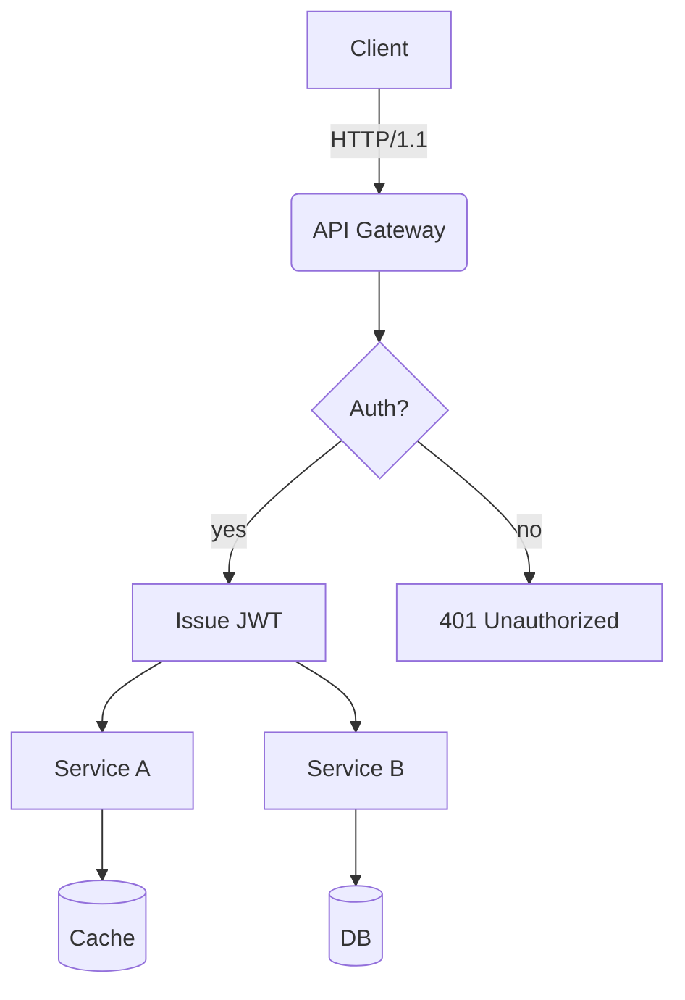
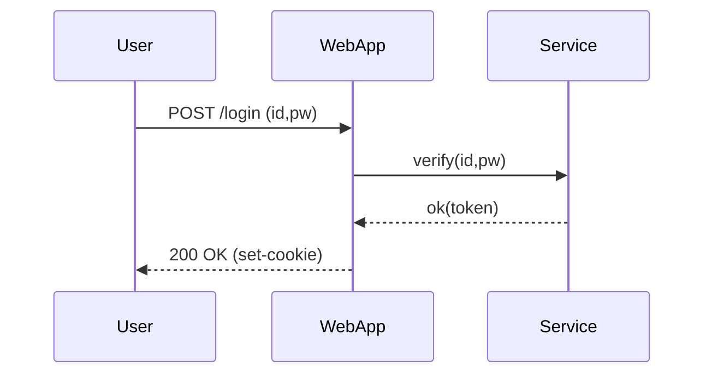
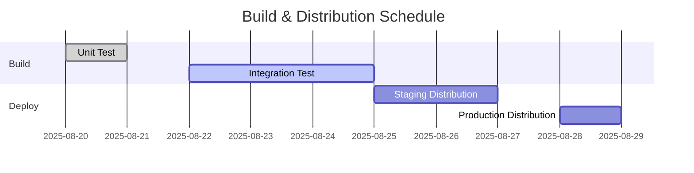
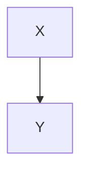

# Translation Test Document for **Rich Markdown**

This document is a collection of various Korean content formats designed to exceed **4096 tokens**.  
It aims to test the robustness (reliability) of translators/LLMs in handling context, preserving format, ignoring code/tables, etc.

> **Guide**
> 1) Ensure that code blocks and `mermaid` areas remain unchanged.
> 2) Verify the preservation of numbers/units (e.g., 1.2GB, 3ms), slash paths (`/var/log/app.log`), and options (`--flag`).
> 3) Layouts should remain intact even when mixed elements like tables, lists, quotations, checkboxes, equations, and emojis 😀 are included.

## 1. Mixed Table and Symbols/Units

| Column | Value | Unit | Notes |
|---|---|---|---|
| Throughput | 12,345 | RPS | Peak at 18,900 RPS |
| Latency (P50) | 3.2 | ms | `--enable-cache` enabled |
| Latency (P99) | 41.7 | ms | Includes GC (Garbage Collection) period |
| Memory | 1.5 | GB | RSS basis, cgroup limit set to 2GB |
| Disk I/O | 220 | MB/s | Via NVMe-oF(TCP) |

## 2. Checklist (Task List)

- [x] Accuracy of Markdown Header Translation
- [x] Preservation of Keywords within Code Blocks (`for`, `if`, `return`, etc.)
- [ ] Preservation of Mermaid Diagrams and Ignoring Comments
- [ ] Preservation of Units (GB/ms/%), Paths (`/etc/hosts`)
- [ ] Preservation of Inline Equations $O(n \log n)$

## 3. Code Blocks: Bash/Python/JSON/YAML

```bash
#!/usr/bin/env bash
set -euo pipefail

APP_ENV="${APP_ENV:-prod}"
INPUT="${1:-/data/input.txt}"
OUT="/var/tmp/result.json"

echo "[INFO] starting job on $(hostname) at $(date -Iseconds)"
if [[ ! -f "$INPUT" ]]; then
  echo "[ERROR] input not found: $INPUT" >&2
  exit 1
fi

lines=$(wc -l < "$INPUT")
echo "[DEBUG] line count: $lines"

curl -sS -X POST "http://127.0.0.1:8080/api" \  -H "Content-Type: application/json" \  -d "{"env":"$APP_ENV","count":$lines}" > "$OUT"

jq -r '.status' "$OUT" | grep -q success && echo "OK" || { echo "FAIL"; exit 2; }
```

```python
from __future__ import annotations

def rolling_avg(xs: list[float], k: int) -> list[float]:
    if k <= 0:
        raise ValueError("k must be > 0")
    out = []
    acc = 0.0
    for i, v in enumerate(xs):
        acc += v
        if i >= k:
            acc -= xs[i-k]
        if i >= k - 1:
            out.append(acc / k)
    return out

print(rolling_avg([1,2,3,4,5,6,7,8,9], 3))
```

```json
{
  "service": "analytics",
  "version": "1.4.2",
  "features": ["rollup", "compaction", "delta-index"],
  "limits": {
    "max_docs": 1000000,
    "max_payload_mb": 256
  }
}
```

```yaml
apiVersion: v1
kind: ConfigMap
metadata:
  name: test-config
data:
  APP_ENV: "staging"
  ENDPOINT: "https://api.example.com"
```

## 4. Mermaid Diagrams

### 4.1 Flowchart


### 4.2 Sequence Diagram


### 4.3 Gantt Chart


## 5. Images/Links/Quotations


- Document: [https://example.com/docs/guide](https://example.com/docs/guide)
- API Reference: [API Reference](https://example.com/api)
- Issue Tracker: [https://example.com/issues](https://example.com/issues)

> “Translation quality is determined by the simultaneous preservation of layout and meaning.” — Anonymous

## 6. Mixing Formulas and Text

- Average Time Complexity: $O(n \log n)$, Worst Case: $O(n^2)$
- Variance: $\sigma^2 = \frac{1}{n}\sum_{i=1}^{n}(x_i-\mu)^2$
- Sample Mean: $\bar{x} = \frac{1}{n}\sum x_i$

**Paragraph Example:** This paragraph serves as a sample to ensure that **bold**, *italic*, `code` snippets are preserved correctly even when mixed within the text. It includes emojis 😀, Chinese characters 漢字, English CamelCase, snake_case, and kebab-case formatting.

### 7.1 Experimental Section — Transformation Patterns
The following section is similar but slightly varies in vocabulary and order each iteration to prevent redundant translations.

- Scenario: Summary of Dialogue Logs
- Condition: Inclusion of Korean text up to 100k characters
- Expected Outcome: Summary accuracy rate of over 90%

#### Procedure
1. Input Data: `/data/input_01.jsonl`
2. Options: `--batch 512 --timeout 3s --enable-cache`
3. Execution: `app run --job test-01 --qos high`
4. Verification: Check if `test-01 finished` is included in logs

#### Observations
- Longer GC (Garbage Collection) cycles show an increasing trend in P99 latency
- Processing throughput decreases by approximately 7% when cache miss ratio increases by 10%
- Increasing connection pool size from 32 to 64 results in a decrease in retry rate per second from 1.2% to 0.6%

### 7.2 Experimental Paragraph — Transformation Pattern
The following paragraph undergoes slight variations in vocabulary and order each iteration to prevent repetitive translations.

- **Scenario**: Summary of dialogue logs
- **Conditions**: Includes 100k characters in Korean text
- **Expected Outcome**: Summary accuracy rate of over 90%

#### Procedure
1. Input Data: `/data/input_02.jsonl`
2. Options: `--batch 512 --timeout 3s --enable-cache`
3. Execution: `app run --job test-02 --qos high`
4. Verification: Check if `test-02 finished` is included in logs

#### Observations
- Longer GC (Garbage Collection) cycles show an increasing trend in P99 latency
- Processing throughput decreases by approximately 7% when cache miss ratio increases by 10%
- Increasing connection pool size from 32 to 64 results in a decrease in retry rate per second from 1.2% to 0.6%

### 7.3 Experiment Paragraph — Variation Patterns
The following paragraph varies slightly in vocabulary and order each iteration to prevent repetitive translations.

- **Scenario**: Kubernetes Deployment
- **Condition**: HPA (Horizontal Pod Autoscaler) Enabled
- **Expected Result**: Scale within range of 2~10 pods

#### Procedure
1. Input Data: `/data/input_03.jsonl`
2. Options: `--batch 512 --timeout 3s --enable-cache`
3. Execution: `app run --job test-03 --qos high`
4. Verification: Check if `test-03 finished` is included in logs

#### Observations
- Longer GC (Garbage Collection) cycles show an increasing trend in P99 latency
- Processing throughput decreases by approximately 7% when cache miss ratio increases by 10%
- Increasing connection pool size from 32 to 64 results in a decrease in retry rate per second from 1.2% to 0.6%

### 7.4 Experiment Paragraph — Variation Patterns
The following paragraph varies slightly in vocabulary and order each iteration to prevent repetitive translations.

- **Scenario**: Kubernetes Deployment
- **Condition**: HPA (Horizontal Pod Autoscaler) Enabled
- **Expected Result**: Scale within range of 2~10 pods

#### Procedure
1. Input Data: `/data/input_04.jsonl`
2. Options: `--batch 512 --timeout 3s --enable-cache`
3. Execution: `app run --job test-04 --qos high`
4. Verification: Check if `test-04 finished` is included in logs

#### Observations
- Longer GC (Garbage Collection) cycles show an increasing trend in P99 latency
- Processing throughput decreases by approximately 7% when cache miss ratio increases by 10%
- Increasing connection pool size from 32 to 64 results in a decrease in retry rate per second from 1.2% to 0.6%

### 7.5 Experimental Paragraph — Transformation Patterns
The following paragraph undergoes slight variations in vocabulary and order each iteration to prevent repetitive translations.

- **Scenario**: Summary of Dialogue Record
- **Conditions**: Includes 100,000 characters in Korean text
- **Expected Outcome**: Summary accuracy rate of over 90%

#### Procedure
1. Input Data: `/data/input_05.jsonl`
2. Options: `--batch 512 --timeout 3s --enable-cache`
3. Execution: `app run --job test-05 --qos high`
4. Verification: Check if `test-05 finished` is included in the logs

#### Observations
- Longer GC (Garbage Collection) cycles show an increasing trend in P99 latency
- Processing throughput decreases by approximately 7% when cache miss ratio increases by 10%
- Increasing connection pool size from 32 to 64 results in a decrease in retry rate per second from 1.2% to 0.6%

### 7.6 Experimental Paragraph — Transformation Pattern
The following paragraph undergoes slight variations in vocabulary and order each iteration to prevent repetitive translations.

- **Scenario**: Mermaid Rendering
- **Conditions**: 50+ Nodes, 100+ Edges
- **Expected Result**: No Layout Distortion

#### Procedure
1. Input Data: `/data/input_06.jsonl`
2. Options: `--batch 512 --timeout 3s --enable-cache`
3. Execution: `app run --job test-06 --qos high`
4. Verification: Check if `test-06 finished` is included in the logs

#### Observations
- Longer GC (Garbage Collection) cycles show an increasing trend in P99 latency
- Processing throughput decreases by approximately 7% when cache miss ratio increases by 10%
- Increasing connection pool size from 32 to 64 results in a decrease in retry rate per second from 1.2% to 0.6%

### 7.7 Experiment Paragraph — Transformation Pattern
The following paragraph undergoes slight variations in vocabulary and order each iteration to prevent repetitive translations.

- **Scenario**: Large-scale JSON Parsing
- **Conditions**: 64MB payload, 4 workers
- **Expected Outcome**: Completion without memory spikes

#### Procedure
1. Input Data: `/data/input_07.jsonl`
2. Options: `--batch 512 --timeout 3s --enable-cache`
3. Execution: `app run --job test-07 --qos high`
4. Verification: Check if `test-07 finished` is included in the logs

#### Observations
- Longer GC (Garbage Collection) cycles show an increasing trend in P99 latency
- Processing throughput decreases by approximately 7% when cache miss ratio increases by 10%
- Increasing connection pool size from 32 to 64 results in a decrease in retry rate per second from 1.2% to 0.6%

### 7.8 Experiment Paragraph — Transformation Pattern
The following paragraph undergoes slight variations in vocabulary and order each iteration to prevent repetitive translations.

- **Scenario**: Large-scale JSON Parsing
- **Conditions**: 64MB payload, 4 workers
- **Expected Outcome**: Completion without memory spikes

#### Procedure
1. Input Data: `/data/input_08.jsonl`
2. Options: `--batch 512 --timeout 3s --enable-cache`
3. Execution: `app run --job test-08 --qos high`
4. Verification: Check if `test-08 finished` is included in the logs

#### Observations
- Longer GC (Garbage Collection) cycles show an increasing trend in P99 latency
- Processing throughput decreases by approximately 7% when cache miss ratio increases by 10%
- Increasing connection pool size from 32 to 64 results in a decrease in retry rate per second from 1.2% to 0.6%

### 7.9 Experiment Paragraph — Transformation Pattern
The following paragraph undergoes slight variations in vocabulary and order each iteration to prevent repetitive translations.

- **Scenario**: Large-scale JSON Parsing
- **Conditions**: 64MB payload, 4 workers
- **Expected Outcome**: Completion without memory spikes

#### Procedure
1. Input Data: `/data/input_09.jsonl`
2. Options: `--batch 512 --timeout 3s --enable-cache`
3. Execution: `app run --job test-09 --qos high`
4. Verification: Check if `test-09 finished` is included in the logs

#### Observations
- Longer GC (Garbage Collection) cycles show an increasing trend in P99 latency
- Processing throughput decreases by approximately 7% when cache miss ratio increases by 10%
- Increasing connection pool size from 32 to 64 results in a decrease in retry rate per second from 1.2% to 0.6%

### 7.10 Experimental Paragraph — Variation Patterns
The following paragraph varies slightly in vocabulary and order each iteration to prevent repetitive translations:

- **Scenario**: NVMe-oF I/O Retries
- **Conditions**: TCP RTT 2ms, Loss Rate 0.1%
- **Expected Outcome**: Retry Rate ≤ 1%

#### Procedure
1. Input Data: `/data/input_10.jsonl`
2. Options: `--batch 512 --timeout 3s --enable-cache`
3. Execution: `app run --job test-10 --qos high`
4. Verification: Check if `test-10 finished` is included in the logs

#### Observations
- Longer GC (Garbage Collection) cycles show an increasing trend in P99 latency
- When cache miss ratio increases by 10%, throughput decreases by approximately 7%
- Increasing connection pool size from 32 to 64 results in a retry rate decrease from 1.2% to 0.6% per second

### 7.11 Experimental Paragraph — Transformation Pattern
The following paragraph undergoes slight variations in vocabulary and order each iteration to prevent repetitive translations.

- **Scenario**: Large-scale JSON Parsing
- **Conditions**: 64MB payload, 4 workers
- **Expected Outcome**: Completion without memory spikes

#### Procedure
1. Input Data: `/data/input_11.jsonl`
2. Options: `--batch 512 --timeout 3s --enable-cache`
3. Execution: `app run --job test-11 --qos high`
4. Verification: Check if `test-11 finished` is included in the logs

#### Observations
- Longer GC (Garbage Collection) cycles show an increasing trend in P99 latency
- Processing throughput decreases by approximately 7% when cache miss ratio increases by 10%
- Increasing connection pool size from 32 to 64 results in a decrease in retry rate per second from 1.2% to 0.6%

### 7.12 Experimental Paragraph — Transformation Patterns
The following paragraph undergoes slight variations in vocabulary and order each iteration to prevent repetitive translations.

- **Scenario**: Kubernetes Deployment
- **Condition**: HPA (Horizontal Pod Autoscaler) Enabled
- **Expected Outcome**: Scale within range of 2~10 pods

#### Procedure
1. Input Data: `/data/input_12.jsonl`
2. Options: `--batch 512 --timeout 3s --enable-cache`
3. Execution: `app run --job test-12 --qos high`
4. Verification: Check if `test-12 finished` is included in logs

#### Observations
- Longer GC (Garbage Collection) cycles show an increasing trend in P99 latency
- Processing throughput decreases by approximately 7% when cache miss ratio increases by 10%
- Increasing connection pool size from 32 to 64 results in a decrease in retry rate per second from 1.2% to 0.6%

### 7.13 Experimental Paragraph — Transformation Pattern
The following paragraph undergoes slight variations in vocabulary and order each iteration to prevent repetitive translations.

- **Scenario**: Large-scale JSON Parsing
- **Conditions**: 64MB payload, 4 workers
- **Expected Outcome**: Completion without memory spikes

#### Procedure
1. Input Data: `/data/input_13.jsonl`
2. Options: `--batch 512 --timeout 3s --enable-cache`
3. Execution: `app run --job test-13 --qos high`
4. Verification: Check if `test-13 finished` is included in the logs

#### Observations
- Longer GC (Garbage Collection) cycles show an increasing trend in P99 latency
- Processing throughput decreases by approximately 7% when cache miss ratio increases by 10%
- Increasing connection pool size from 32 to 64 results in a decrease in retry rate per second from 1.2% to 0.6%

### 7.14 Experimental Paragraph — Transformation Pattern
The following paragraph undergoes slight variations in vocabulary and order each iteration to prevent repetitive translations.

- **Scenario**: Large-scale JSON Parsing
- **Conditions**: 64MB payload, 4 workers
- **Expected Outcome**: Completion without memory spikes

#### Procedure
1. Input Data: `/data/input_14.jsonl`
2. Options: `--batch 512 --timeout 3s --enable-cache`
3. Execution: `app run --job test-14 --qos high`
4. Verification: Check if `test-14 finished` is included in the logs

#### Observations
- Longer GC (Garbage Collection) cycles show an increasing trend in P99 latency
- Processing throughput decreases by approximately 7% when cache miss ratio increases by 10%
- Increasing connection pool size from 32 to 64 results in a decrease in retry rate per second from 1.2% to 0.6%

### 7.15 Experimental Paragraph — Variation Patterns
The following paragraph varies slightly in vocabulary and order each iteration to prevent repetitive translations:

- **Scenario**: NVMe-oF I/O Retries
- **Conditions**: TCP RTT 2ms, Loss Rate 0.1%
- **Expected Outcome**: Retry Rate ≤ 1%

#### Procedure
1. Input Data: `/data/input_15.jsonl`
2. Options: `--batch 512 --timeout 3s --enable-cache`
3. Execution: `app run --job test-15 --qos high`
4. Verification: Check if `test-15 finished` is included in the logs

#### Observations
- Longer GC (Garbage Collection) cycles show an increasing trend in P99 latency
- When cache miss ratio increases by 10%, throughput decreases by approximately 7%
- Increasing connection pool size from 32 to 64 results in a decrease in retry rate per second from 1.2% to 0.6%

### 7.16 Experimental Paragraph — Transformation Pattern
The following paragraph undergoes slight variations in vocabulary and order each iteration to prevent repetitive translations.

- **Scenario**: Mermaid Rendering
- **Conditions**: 50+ Nodes, 100+ Edges
- **Expected Outcome**: No Layout Distortion

#### Procedure
1. Input Data: `/data/input_16.jsonl`
2. Options: `--batch 512 --timeout 3s --enable-cache`
3. Execution: `app run --job test-16 --qos high`
4. Verification: Check if `test-16 finished` is included in the logs

#### Observations
- Longer GC (Garbage Collection) cycles show an increasing trend in P99 latency
- Processing throughput decreases by approximately 7% when cache miss ratio increases by 10%
- Increasing connection pool size from 32 to 64 results in a decrease in retry rate per second from 1.2% to 0.6%

### 7.17 Experimental Paragraph — Transformation Pattern
The following paragraph undergoes slight variations in vocabulary and order each iteration to prevent repetitive translations.

- **Scenario**: Summary of Dialogue Record
- **Conditions**: Includes 100,000 characters in Korean text
- **Expected Outcome**: Summary accuracy rate of over 90%

#### Procedure
1. Input Data: `/data/input_17.jsonl`
2. Options: `--batch 512 --timeout 3s --enable-cache`
3. Execution: `app run --job test-17 --qos high`
4. Verification: Check if `test-17 finished` is included in the logs

#### Observations
- Longer GC (Garbage Collection) cycles show an increasing trend in P99 latency
- Processing throughput decreases by approximately 7% when cache miss ratio increases by 10%
- Increasing connection pool size from 32 to 64 results in a decrease in retry rate per second from 1.2% to 0.6%

### 7.18 Experimental Paragraph — Transformation Pattern
The following paragraph undergoes slight variations in vocabulary and order each iteration to prevent repetitive translations.

- **Scenario**: Large-scale JSON Parsing
- **Conditions**: 64MB payload, 4 workers
- **Expected Outcome**: Completion without memory spikes

#### Procedure
1. Input Data: `/data/input_18.jsonl`
2. Options: `--batch 512 --timeout 3s --enable-cache`
3. Execution: `app run --job test-18 --qos high`
4. Verification: Check if `test-18 finished` is included in the logs

#### Observations
- Longer GC (Garbage Collection) cycles show an increasing trend in P99 latency
- Processing throughput decreases by approximately 7% when cache miss ratio increases by 10%
- Increasing connection pool size from 32 to 64 results in a decrease in retry rate per second from 1.2% to 0.6%

### 7.19 Experimental Paragraph — Transformation Pattern
The following paragraph undergoes slight variations in vocabulary and order each iteration to prevent repetitive translations.

- **Scenario**: Large-scale JSON Parsing
- **Conditions**: 64MB payload, 4 workers
- **Expected Outcome**: Completion without memory spikes

#### Procedure
1. Input Data: `/data/input_19.jsonl`
2. Options: `--batch 512 --timeout 3s --enable-cache`
3. Execution: `app run --job test-19 --qos high`
4. Verification: Check if `test-19 finished` is included in the logs

#### Observations
- Longer GC (Garbage Collection) cycles show an increasing trend in P99 latency
- Processing throughput decreases by approximately 7% when cache miss ratio increases by 10%
- Increasing connection pool size from 32 to 64 results in a decrease in retry rate per second from 1.2% to 0.6%

### 7.20 Experimental Paragraph — Variation Patterns
The following paragraph varies slightly in vocabulary and order each iteration to prevent repetitive translations:

- **Scenario**: NVMe-oF I/O Retries
- **Conditions**: TCP RTT 2ms, Loss Rate 0.1%
- **Expected Outcome**: Retry Rate ≤ 1%

#### Procedure
1. Input Data: `/data/input_20.jsonl`
2. Options: `--batch 512 --timeout 3s --enable-cache`
3. Execution: `app run --job test-20 --qos high`
4. Verification: Check if `test-20 finished` is included in the logs

#### Observations
- Longer GC (Garbage Collection) cycles show an increasing trend in P99 latency
- When cache miss ratio increases by 10%, throughput decreases by approximately 7%
- Increasing connection pool size from 32 to 64 results in a decrease in retry rate per second from 1.2% to 0.6%

### 7.21 Experimental Paragraph — Transformation Pattern
The following paragraph undergoes slight variations in vocabulary and order each iteration to prevent repetitive translations.

- **Scenario**: Kubernetes Deployment
- **Condition**: HPA (Horizontal Pod Autoscaler) Enabled
- **Expected Outcome**: Scale within range of 2~10 pods

#### Procedure
1. Input Data: `/data/input_21.jsonl`
2. Options: `--batch 512 --timeout 3s --enable-cache`
3. Execution: `app run --job test-21 --qos high`
4. Verification: Check if `test-21 finished` is included in logs

#### Observations
- Longer GC (Garbage Collection) cycles show an increasing trend in P99 latency
- Processing throughput decreases by approximately 7% when cache miss ratio increases by 10%
- Increasing connection pool size from 32 to 64 results in a decrease in retry rate per second from 1.2% to 0.6%

### 7.22 Experimental Paragraph — Transformation Pattern
The following paragraph is similar but slightly varies in vocabulary and order each iteration to prevent repetitive translations.

- **Scenario**: Mermaid Rendering
- **Conditions**: 50+ Nodes, 100+ Edges
- **Expected Result**: No Layout Distortion

#### Procedure
1. Input Data: `/data/input_22.jsonl`
2. Options: `--batch 512 --timeout 3s --enable-cache`
3. Execution: `app run --job test-22 --qos high`
4. Verification: Check if `test-22 finished` is included in the logs

#### Observations
- Longer GC (Garbage Collection) cycles show an increasing trend in P99 latency
- Processing throughput decreases by approximately 7% when cache miss ratio increases by 10%
- Increasing connection pool size from 32 to 64 results in a decrease in retry rate per second from 1.2% to 0.6%

### 7.23 Experimental Paragraph — Transformation Pattern
The following paragraph is similar but slightly alters vocabulary and order in each iteration to prevent repetitive translation.

- **Scenario**: Large-scale JSON Parsing
- **Conditions**: 64MB payload, 4 workers
- **Expected Outcome**: Completion without memory spikes

#### Procedure
1. Input Data: `/data/input_23.jsonl`
2. Options: `--batch 512 --timeout 3s --enable-cache`
3. Execution: `app run --job test-23 --qos high`
4. Verification: Check if `test-23 finished` is included in the logs

#### Observations
- Longer GC (Garbage Collection) cycles show an increasing trend in P99 latency
- Processing throughput decreases by approximately 7% when cache miss ratio increases by 10%
- Increasing connection pool size from 32 to 64 results in a decrease in retry rate per second from 1.2% to 0.6%

### 7.24 Experimental Paragraph — Transformation Pattern
The following paragraph undergoes slight variations in vocabulary and order in each iteration to prevent repetitive translations.

- **Scenario**: Mermaid Rendering
- **Conditions**: 50+ Nodes, 100+ Edges
- **Expected Outcome**: No Layout Distortion

#### Procedure
1. Input Data: `/data/input_24.jsonl`
2. Options: `--batch 512 --timeout 3s --enable-cache`
3. Execution: `app run --job test-24 --qos high`
4. Verification: Check if `test-24 finished` is included in the logs

#### Observations
- Longer GC (Garbage Collection) cycles show an increasing trend in P99 latency
- Processing throughput decreases by approximately 7% when cache miss ratio increases by 10%
- Increasing connection pool size from 32 to 64 results in a decrease in retry rate per second from 1.2% to 0.6%

### 7.25 Experimental Paragraph — Transformation Pattern
The following paragraph is similar but slightly alters vocabulary and order in each iteration to prevent repetitive translations.

- **Scenario**: Kubernetes Deployment
- **Condition**: HPA (Horizontal Pod Autoscaler) Enabled
- **Expected Outcome**: Scale within range of 2~10 pods

#### Procedure
1. Input Data: `/data/input_25.jsonl`
2. Options: `--batch 512 --timeout 3s --enable-cache`
3. Execution: `app run --job test-25 --qos high`
4. Verification: Check if `test-25 finished` is included in logs

#### Observations
- Longer GC (Garbage Collection) cycles show an increasing trend in P99 latency
- Processing throughput decreases by approximately 7% when cache miss ratio increases by 10%
- Increasing connection pool size from 32 to 64 results in a decrease in retry rate per second from 1.2% to 0.6%

### 7.26 Experimental Paragraph — Variation Patterns
The following paragraph varies slightly in vocabulary and order each iteration to prevent repetitive translations:

- **Scenario**: NVMe-oF I/O Retries
- **Conditions**: TCP RTT 2ms, Loss Rate 0.1%
- **Expected Outcome**: Retry Rate ≤ 1%

#### Procedure
1. Input Data: `/data/input_26.jsonl`
2. Options: `--batch 512 --timeout 3s --enable-cache`
3. Execution: `app run --job test-26 --qos high`
4. Verification: Check if `test-26 finished` is included in the logs

#### Observations
- Longer GC (Garbage Collection) cycles show a tendency towards increased P99 latency
- When cache miss ratio increases by 10%, throughput decreases by approximately 7%
- Increasing connection pool size from 32 to 64 results in a decrease in retry rate per second from 1.2% to 0.6%

### 7.27 Experimental Paragraph — Transformation Pattern
The following paragraph undergoes slight variations in vocabulary and order each iteration to prevent repetitive translations.

- **Scenario**: Summary of Dialogue Record
- **Conditions**: Includes 100,000 characters in Korean text
- **Expected Outcome**: Summary accuracy rate of over 90%

#### Procedure
1. Input Data: `/data/input_27.jsonl`
2. Options: `--batch 512 --timeout 3s --enable-cache`
3. Execution: `app run --job test-27 --qos high`
4. Verification: Check if `test-27 finished` is included in the logs

#### Observations
- Longer GC (Garbage Collection) cycles show an increasing trend in P99 latency
- Processing throughput decreases by approximately 7% when cache miss ratio increases by 10%
- Increasing connection pool size from 32 to 64 results in a decrease in retry rate per second from 1.2% to 0.6%

### 7.28 Experimental Paragraph — Transformation Pattern
The following paragraph undergoes slight variations in vocabulary and order each iteration to prevent repetitive translations.

- **Scenario**: Summary of Dialogue Record
- **Conditions**: Includes 100,000 characters in Korean text
- **Expected Outcome**: Summary accuracy rate of over 90%

#### Procedure
1. Input Data: `/data/input_28.jsonl`
2. Options: `--batch 512 --timeout 3s --enable-cache`
3. Execution: `app run --job test-28 --qos high`
4. Verification: Check if `test-28 finished` is included in the logs

#### Observations
- Longer GC (Garbage Collection) cycles show an increasing trend in P99 latency
- Processing throughput decreases by approximately 7% when cache miss ratio increases by 10 percentage points
- Increasing connection pool size from 32 to 64 results in a decrease in retry rate per second from 1.2% to 0.6%

### 7.29 Experimental Paragraph — Transformation Pattern
The following paragraph undergoes slight variations in vocabulary and order each iteration to prevent repetitive translations.

- **Scenario**: Large-scale JSON Parsing
- **Conditions**: 64MB payload, 4 workers
- **Expected Outcome**: Completion without memory spikes

#### Procedure
1. Input Data: `/data/input_29.jsonl`
2. Options: `--batch 512 --timeout 3s --enable-cache`
3. Execution: `app run --job test-29 --qos high`
4. Verification: Check if `test-29 finished` is included in the logs

#### Observations
- Longer GC (Garbage Collection) cycles show an increasing trend in P99 latency
- Processing throughput decreases by approximately 7% when cache miss ratio increases by 10%
- Increasing connection pool size from 32 to 64 results in a decrease in retry rate per second from 1.2% to 0.6%

### 7.30 Experimental Paragraph — Transformation Pattern
The following paragraph undergoes slight variations in vocabulary and order each iteration to prevent repetitive translations.

- **Scenario**: Summary of Dialogue Record
- **Conditions**: Includes 100k characters in Korean text
- **Expected Outcome**: Summary accuracy rate of over 90%

#### Procedure
1. Input Data: `/data/input_30.jsonl`
2. Options: `--batch 512 --timeout 3s --enable-cache`
3. Execution: `app run --job test-30 --qos high`
4. Verification: Check if `test-30 finished` is included in the logs

#### Observations
- Longer GC (Garbage Collection) cycles show an increasing trend in P99 latency
- Processing throughput decreases by approximately 7% when cache miss ratio increases by 10%
- Increasing connection pool size from 32 to 64 results in a decrease in retry rate per second from 1.2% to 0.6%

### 7.31 Experimental Paragraph — Transformation Patterns
The following paragraph undergoes slight variations in vocabulary and order each iteration to prevent repetitive translations.

- **Scenario**: Kubernetes Deployment
- **Condition**: HPA (Horizontal Pod Autoscaler) Enabled
- **Expected Outcome**: Scaling within the range of 2~10 pods

#### Procedure
1. Input Data: `/data/input_31.jsonl`
2. Options: `--batch 512 --timeout 3s --enable-cache`
3. Execution: `app run --job test-31 --qos high`
4. Verification: Check if `test-31 finished` is included in the logs

#### Observations
- Longer GC (Garbage Collection) cycles show a tendency towards increased P99 latency
- Processing throughput decreases by approximately 7% when cache miss ratio increases by 10%
- Increasing connection pool size from 32 to 64 results in a decrease in retry rate per second from 1.2% to 0.6%

### 7.32 Experimental Paragraph — Transformation Pattern
The following paragraph is similar but slightly varies in vocabulary and order each iteration to prevent repetitive translations.

- **Scenario**: Mermaid Rendering
- **Conditions**: 50+ Nodes, 100+ Edges
- **Expected Result**: No Layout Distortion

#### Procedure
1. Input Data: `/data/input_32.jsonl`
2. Options: `--batch 512 --timeout 3s --enable-cache`
3. Execution: `app run --job test-32 --qos high`
4. Verification: Check if `test-32 finished` is included in the logs

#### Observations
- Longer GC (Garbage Collection) cycles show an increasing trend in P99 latency
- Processing throughput decreases by approximately 7% when cache miss ratio increases by 10%
- Increasing connection pool size from 32 to 64 results in a decrease in retry rate per second from 1.2% to 0.6%

### 7.33 Experimental Paragraph — Transformation Pattern
The following paragraph is similar but slightly alters vocabulary and order in each iteration to prevent repetitive translation.

- **Scenario**: Large-scale JSON Parsing
- **Conditions**: 64MB payload, 4 workers
- **Expected Outcome**: Completion without memory spikes

#### Procedure
1. Input Data: `/data/input_33.jsonl`
2. Options: `--batch 512 --timeout 3s --enable-cache`
3. Execution: `app run --job test-33 --qos high`
4. Verification: Check if `test-33 finished` is included in the logs

#### Observations
- Longer GC (Garbage Collection) cycles show an increasing trend in P99 latency
- Processing throughput decreases by approximately 7% when cache miss ratio increases by 10%
- Increasing connection pool size from 32 to 64 results in a decrease in retry rate per second from 1.2% to 0.6%

### 7.34 Experimental Paragraph — Transformation Patterns
The following paragraph is similar but slightly alters vocabulary and order in each iteration to prevent repetitive translations.

- **Scenario**: Kubernetes Deployment
- **Condition**: HPA (Horizontal Pod Autoscaler) Enabled
- **Expected Outcome**: Scale within range of 2~10 pods

#### Procedure
1. Input Data: `/data/input_34.jsonl`
2. Options: `--batch 512 --timeout 3s --enable-cache`
3. Execution: `app run --job test-34 --qos high`
4. Verification: Check if `test-34 finished` is included in logs

#### Observations
- Longer GC (Garbage Collection) cycles show an increasing trend in P99 latency
- Processing throughput decreases by approximately 7% when cache miss ratio increases by 10%
- Increasing connection pool size from 32 to 64 results in a decrease in retry rate per second from 1.2% to 0.6%

### 7.35 Experimental Paragraph — Transformation Pattern
The following paragraph is similar but slightly alters vocabulary and order in each iteration to prevent repetitive translations.

- **Scenario**: Mermaid Rendering
- **Conditions**: 50+ Nodes, 100+ Edges
- **Expected Outcome**: No Layout Distortion

#### Procedure
1. Input Data: `/data/input_35.jsonl`
2. Options: `--batch 512 --timeout 3s --enable-cache`
3. Execution: `app run --job test-35 --qos high`
4. Verification: Check if `test-35 finished` is included in the logs

#### Observations
- Longer GC (Garbage Collection) cycles show an increasing trend in P99 latency
- Processing throughput decreases by approximately 7% when cache miss ratio increases by 10%
- Increasing connection pool size from 32 to 64 results in a decrease in retry rate per second from 1.2% to 0.6%

### 7.36 Experimental Paragraph — Variation Patterns
The following paragraph varies slightly in vocabulary and order each iteration to prevent repetitive translations:

- **Scenario**: NVMe-oF I/O Retries
- **Conditions**: TCP RTT 2ms, Loss Rate 0.1%
- **Expected Outcome**: Retry Rate ≤ 1%

#### Procedure
1. Input Data: `/data/input_36.jsonl`
2. Options: `--batch 512 --timeout 3s --enable-cache`
3. Execution: `app run --job test-36 --qos high`
4. Verification: Check if `test-36 finished` is included in the logs

#### Observations
- Longer GC (Garbage Collection) cycles show a tendency towards increased P99 latency
- When cache miss ratio increases by 10%, throughput decreases by approximately 7%
- Increasing connection pool size from 32 to 64 results in a decrease in retry rate per second from 1.2% to 0.6%

### 7.37 Experimental Paragraph — Transformation Pattern
The following paragraph undergoes slight variations in vocabulary and order each iteration to prevent repetitive translations.

- **Scenario**: Large-scale JSON Parsing
- **Conditions**: 64MB payload, 4 workers
- **Expected Outcome**: Completion without memory spikes

#### Procedure
1. Input Data: `/data/input_37.jsonl`
2. Options: `--batch 512 --timeout 3s --enable-cache`
3. Execution: `app run --job test-37 --qos high`
4. Verification: Check if `test-37 finished` is included in the logs

#### Observations
- Longer GC (Garbage Collection) cycles show an increasing trend in P99 latency
- Processing throughput decreases by approximately 7% when cache miss ratio increases by 10%
- Increasing connection pool size from 32 to 64 results in a decrease in retry rate per second from 1.2% to 0.6%

### 7.38 Experimental Paragraph — Transformation Pattern
The following paragraph undergoes slight variations in vocabulary and order in each iteration to prevent repetitive translations.

- **Scenario**: Mermaid Rendering
- **Conditions**: 50+ Nodes, 100+ Edges
- **Expected Outcome**: No Layout Distortion

#### Procedure
1. Input Data: `/data/input_38.jsonl`
2. Options: `--batch 512 --timeout 3s --enable-cache`
3. Execution: `app run --job test-38 --qos high`
4. Verification: Check if `test-38 finished` is included in the logs

#### Observations
- Longer GC (Garbage Collection) cycles show an increasing trend in P99 latency
- Processing throughput decreases by approximately 7% when cache miss ratio increases by 10%
- Increasing connection pool size from 32 to 64 results in a decrease in retry rate per second from 1.2% to 0.6%

### 7.39 Experimental Paragraph — Transformation Pattern
The following paragraph is similar but slightly alters vocabulary and order in each iteration to prevent repetitive translations.

- **Scenario**: Mermaid Rendering
- **Conditions**: 50+ Nodes, 100+ Edges
- **Expected Outcome**: No Layout Distortion

#### Procedure
1. Input Data: `/data/input_39.jsonl`
2. Options: `--batch 512 --timeout 3s --enable-cache`
3. Execution: `app run --job test-39 --qos high`
4. Verification: Check if `test-39 finished` is included in the logs

#### Observations
- Longer GC (Garbage Collection) cycles show an increasing trend in P99 latency
- Processing throughput decreases by approximately 7% when cache miss ratio increases by 10%
- Increasing connection pool size from 32 to 64 results in a decrease in retry rate per second from 1.2% to 0.6%

### 7.40 Experimental Paragraph — Transformation Pattern
The following paragraph undergoes slight variations in vocabulary and order each iteration to prevent repetitive translations.

- **Scenario**: Summary of dialogue logs
- **Conditions**: Includes 100k characters in Korean text
- **Expected Outcome**: Summary accuracy rate of over 90%

#### Procedure
1. Input Data: `/data/input_40.jsonl`
2. Options: `--batch 512 --timeout 3s --enable-cache`
3. Execution: `app run --job test-40 --qos high`
4. Verification: Check if `test-40 finished` is included in the logs

#### Observations
- Longer GC (Garbage Collection) cycles show an increasing trend in P99 latency
- Processing throughput decreases by approximately 7% when cache miss ratio increases by 10%
- Increasing connection pool size from 32 to 64 results in a decrease in retry rate per second from 1.2% to 0.6%

## 8. Long List

- 2. **Consistency in Error Handling** — Case #001
- 3. Performance Profiling — Case #002
- 4. Accessibility (a11y) — Case #003
- 5. Log Schema Stability — Case #004
- 6. Cache Invalidation Scenarios — Case #005
- 7. Performance Profiling — Case #006
- 8. Performance Profiling — Case #007
- 9. API Backward Compatibility — Case #008
- 10. Log Schema Stability — Case #009
- 11. Accessibility (a11y) — Case #010
- 12. Cache Invalidation Scenarios — Case #011
- 13. Performance Profiling — Case #012
- 14. Security Header Implementation — Case #013
- 15. Resource Leak Detection — Case #015
- 16. Consistency in Error Handling — Case #016
- 17. Consistency in Error Handling — Case #017
- 18. Internationalization (i18n) — Case #018
- 19. CORS Policy Validation — Case #019
- 20. Performance Profiling — Case #020
- 21. Security Header Implementation — Case #021
- 22. Log Schema Stability — Case #022
- 23. Performance Profiling — Case #023
- 24. Cache Invalidation Scenarios — Case #024
- 25. CORS Policy Validation — Case #025
- 26. Performance Profiling — Case #026
- 27. Accessibility (a11y) — Case #027
- 28. Accessibility (a11y) — Case #028
- 29. API Backward Compatibility — Case #029
- 30. Cache Invalidation Scenarios — Case #030
- 31. Cache Invalidation Scenarios — Case #031
- 32. Performance Profiling — Case #032
- 33. Resource Leak Detection — Case #033
- 34. Log Schema Stability — Case #034
- 35. CORS Policy Validation — Case #035
- 36. Consistency in Error Handling — Case #036
- 37. Resource Leak Detection — Case #037
- 38. Consistency in Error Handling — Case #038
- 39. Internationalization (i18n) — Case #039
- 40. API Backward Compatibility — Case #040
- 41. Cache Invalidation Scenarios — Case #041
- 42. Cache Invalidation Scenarios — Case #042
- 43. Cache Invalidation Scenarios — Case #043
- 44. Performance Profiling — Case #044
- 45. Performance Profiling — Case #045
- 46. CORS Policy Validation — Case #046
- 47. Resource Leak Detection — Case #047
- 48. Cache Invalidation Scenarios — Case #048
- 49. Consistency in Error Handling — Case #049
- 50. Log Schema Stability — Case #050
- 51. Resource Leak Detection — Case #051
- 52. Internationalization (i18n) — Case #052
- 53. Log Schema Stability — Case #053
- 54. Resource Leak Detection — Case #054
- 55. Security Header Implementation — Case #055
- 56. Internationalization (i18n) — Case #056
- 57. API Backward Compatibility — Case #057
- 58. Accessibility (a11y) — Case #058
- 59. API Backward Compatibility — Case #059
- 60. Performance Profiling — Case #060
- 61. Accessibility (a11y) — Case #061
- 62. API Backward Compatibility — Case #062
- 63. Internationalization (i18n) — Case #063
- 64. Security Header Implementation — Case #064
- 65. Consistency in Error Handling — Case #065
- 66. Performance Profiling — Case #066
- 67. Accessibility (a11y) — Case #067
- 68. Consistency in Error Handling — Case #068
- 69. Performance Profiling — Case #069
- 70. Resource Leak Detection — Case #070
- 71. Accessibility (a11y) — Case #071
- 72. Internationalization (i18n) — Case #072
- 73. Consistency in Error Handling — Case #073
- 74. Internationalization (i18n) — Case #074
- 75. Performance Profiling — Case #075
- 76. Security Header Implementation — Case #076
- 77. CORS Policy Validation — Case #077
- 78. Resource Leak Detection — Case #078
- 79. Resource Leak Detection — Case #079
- 80. Performance Profiling — Case #080
- 81. Accessibility (a11y) — Case #081
- 82. Accessibility (a11y) — Case #082
- 83. Performance Profiling — Case #083
- 84. Resource Leak Detection — Case #084
- 85. Accessibility (a11y) — Case #085
- 86. Cache Invalidation Scenarios — Case #086
- 87. CORS Policy Validation — Case #087
- 88. Log Schema Stability — Case #088
- 89. CORS Policy Validation — Case #089
- 90. Security Header Implementation — Case #090
- 91. API Backward Compatibility — Case #091
- 92. Accessibility (a11y) — Case #092
- 93. Performance Profiling — Case #093
- 94. Performance Profiling — Case #094
- 95. Log Schema Stability — Case #095
- 96. Internationalization (i18n) — Case #096
- 97. API Backward Compatibility — Case #097
- 98. Security Header Implementation — Case #098
- 99. Consistency in Error Handling — Case #099
- 100. Accessibility (a11y) — Case #100
- 101. Accessibility (a11y) — Case #101
- 102. Internationalization (i18n) — Case #102
- 103. Accessibility (a11y) — Case #103
- 104. API Backward Compatibility — Case #104
- 105. Accessibility (a11y) — Case #105
- 106. Performance Profiling — Case #106
- 107. Security Header Implementation — Case #107
- 108. API Backward Compatibility — Case #108
- 109. Security Header Implementation — Case #109
- 110. Consistency in Error Handling — Case #110
- 111. Performance Profiling — Case #111
- 112. Resource Leak Detection — Case #112
- 113. CORS Policy Validation — Case #113
- 114. Accessibility (a11y) — Case #114
- 115. Consistency in Error Handling — Case #115
- 116. Consistency in Error Handling — Case #116
- 117. Performance Profiling — Case #117
- 118. CORS Policy Validation — Case #118
- 119. Resource Leak Detection — Case #119
- 120. Cache Invalidation Scenarios — Case #120
- 121. CORS Policy Validation — Case #121
- 122. Performance Profiling — Case #122
- 123. Consistency in Error Handling — Case #123
- 124. Performance Profiling — Case #124
- 125. Performance Profiling — Case #125
- 126. Resource Leak Detection — Case #126
- 127. Internationalization (i18n) — Case #127
- 128. Accessibility (a11y) — Case #128
- 129. Consistency in Error Handling — Case #129
- 130. Performance Profiling — Case #130
- 131. Accessibility (a11y) — Case #131
- 132. API Backward Compatibility — Case #132
- 133. Performance Profiling — Case #133
- 134. Accessibility (a11y) — Case #134
- 135. API Backward Compatibility — Case #135
- 136. Security Header Implementation — Case #136
- 137. Consistency in Error Handling — Case #137
- 138. Performance Profiling — Case #138
- 139. Resource Leak Detection — Case #139
- 140. CORS Policy Validation — Case #140
- 141. Accessibility (a11y) — Case #141
- 142. Consistency in Error Handling — Case #142
- 143. Consistency in Error Handling — Case #143
- 144. Performance Profiling — Case #144
- 145. Security Header Implementation — Case #145
- 146. Cache Invalidation Scenarios — Case #146
- 147. Resource Leak Detection — Case #147
- 148. Cache Invalidation Scenarios — Case #148
- 149. CORS Policy Validation — Case #149
- 150. Performance Profiling — Case #150
- 151. Accessibility (a11y) — Case #151
- 152. Accessibility (a11y) — Case #152
- 153. Performance Profiling — Case #153
- 154. Resource Leak Detection — Case #154
- 155. Security Header Implementation — Case #155
- 156. Internationalization (i18n) — Case #156
- 157. API Backward Compatibility — Case #157
- 158. Accessibility (a11y) — Case #158
- 159. Performance Profiling — Case #159
- 160. Security Header Implementation — Case #160
- 161. CORS Policy Validation — Case #161
- 162. Resource Leak Detection — Case #162
- 163. Cache Invalidation Scenarios — Case #163
- 164. CORS Policy Validation — Case #164
- 165. Performance Profiling — Case #165
- 166. Consistency in Error Handling — Case #166
- 167. Performance Profiling — Case #167
- 168. Resource Leak Detection — Case #168
- 169. Accessibility (a11y) — Case #169
- 170. Internationalization (i18n) — Case #170
- 171. Consistency in Error Handling — Case #171
- 172. Internationalization (i18n) — Case #172
- 173. Performance Profiling — Case #173
- 174. Security Header Implementation — Case #174
- 175. CORS Policy Validation — Case #175
- 176. Resource Leak Detection — Case #176
- 177. Cache Invalidation Scenarios — Case #177
- 178. CORS Policy Validation — Case #178
- 179. Performance Profiling — Case #179
- 180. Accessibility (a11y) — Case #180
- 181. Accessibility (a11y) — Case #181
- 182. Performance Profiling — Case #182
- 183. Resource Leak Detection — Case #183
- 184. Accessibility (a11y) — Case #184
- 185. Cache Invalidation Scenarios — Case #185
- 186. CORS Policy Validation — Case #186
- 187. Log Schema Stability — Case #187
- 188. CORS Policy Validation — Case #188
- 189. Security Header Implementation — Case #189
- 190. API Backward Compatibility — Case #190
- 191. Accessibility (a11y) — Case #191
- 192. Performance Profiling — Case #192
- 193. Performance Profiling — Case #193
- 194. Log Schema Stability — Case #194
- 195. Internationalization (i18n) — Case #195
- 196. API Backward Compatibility — Case #196
- 197. Consistency in Error Handling — Case #197
- 198. Cache Invalidation Scenarios — Case #198
- 199. Accessibility (a11y) — Case #199
- 200. Accessibility (a11y) — Case #200

```markdown
# Performance Profiling — Case #125
## Accessibility (a11y) — Case #126
## Accessibility (a11y) — Case #127
## Error Handling Consistency — Case #128
## Error Handling Consistency — Case #129
## API Backward Compatibility — Case #130
## Accessibility (a11y) — Case #131
## API Backward Compatibility — Case #132
## Cache Invalidation Scenarios — Case #133
## Security Header Implementation — Case #134
## Internationalization (i18n) — Case #135
## Security Header Implementation — Case #136
## Performance Profiling — Case #137
## Performance Profiling — Case #138
## Cross-Origin Resource Sharing (CORS) Policy Validation — Case #139
## Internationalization (i18n) — Case #140
## Log Schema Stability — Case #141
## CORS Policy Validation — Case #142
## Accessibility (a11y) — Case #143
## Security Header Implementation — Case #144
## Log Schema Stability — Case #145
## Performance Profiling — Case #146
## Performance Profiling — Case #147
## API Backward Compatibility — Case #148
## Resource Leak Detection — Case #149
## Performance Profiling — Case #150
## Resource Leak Detection — Case #151
## Accessibility (a11y) — Case #152
## API Backward Compatibility — Case #153
## Accessibility (a11y) — Case #154
## Security Header Implementation — Case #155
## Accessibility (a11y) — Case #156
## Performance Profiling — Case #157
## Cache Invalidation Scenarios — Case #158
## Security Header Implementation — Case #159
## Internationalization (i18n) — Case #160
## Log Schema Stability — Case #161
## CORS Policy Validation — Case #162
## Security Header Implementation — Case #163
## Performance Profiling — Case #164
## Accessibility (a11y) — Case #165
## Log Schema Stability — Case #166
## Internationalization (i18n) — Case #167
## Cache Invalidation Scenarios — Case #168
## Internationalization (i18n) — Case #169
## Cache Invalidation Scenarios — Case #170
## Resource Leak Detection — Case #171
## Security Header Implementation — Case #172
## Resource Leak Detection — Case #173
## Error Handling Consistency — Case #174
## Log Schema Stability — Case #176
## CORS Policy Validation — Case #177
## Security Header Implementation — Case #178
## Log Schema Stability — Case #179
## Performance Profiling — Case #180
## Resource Leak Detection — Case #181
## Internationalization (i18n) — Case #182
## Log Schema Stability — Case #183
## Accessibility (a11y) — Case #184
## Security Header Implementation — Case #185
## Resource Leak Detection — Case #186
## Resource Leak Detection — Case #187
## Accessibility (a11y) — Case #188
## Cache Invalidation Scenarios — Case #189
## Accessibility (a11y) — Case #190
## Cache Invalidation Scenarios — Case #191
## Error Handling Consistency — Case #192
## Error Handling Consistency — Case #193
## Resource Leak Detection — Case #194
## Error Handling Consistency — Case #195
## CORS Policy Validation — Case #196
## Performance Profiling — Case #197
## Resource Leak Detection — Case #198
## Accessibility (a11y) — Case #199
## Resource Leak Detection — Case #200
## Cache Invalidation Scenarios — Case #201
## Internationalization (i18n) — Case #202
## Log Schema Stability — Case #203
## Error Handling Consistency — Case #204
## Resource Leak Detection — Case #205
## Security Header Implementation — Case #206
## Resource Leak Detection — Case #207
## Cache Invalidation Scenarios — Case #208
## Performance Profiling — Case #209
## Security Header Implementation — Case #210
## Internationalization (i18n) — Case #211
## Log Schema Stability — Case #212
## Error Handling Consistency — Case #213
## Cache Invalidation Scenarios — Case #214
## Security Header Implementation — Case #215
## Internationalization (i18n) — Case #216
## Security Header Implementation — Case #217
## Performance Profiling — Case #218
## Error Handling Consistency — Case #219
## Security Header Implementation — Case #220
## Performance Profiling — Case #221
## API Backward Compatibility — Case #222
## Resource Leak Detection — Case #223
## Internationalization (i18n) — Case #224
## Security Header Implementation — Case #225
## Internationalization (i18n) — Case #226
## Performance Profiling — Case #227
## Log Schema Stability — Case #228
## CORS Policy Validation — Case #229
## Performance Profiling — Case #230
## API Backward Compatibility — Case #231
## CORS Policy Validation — Case #232
## Internationalization (i18n) — Case #233
## Error Handling Consistency — Case #234
## Performance Profiling — Case #235
## Error Handling Consistency — Case #236
## Performance Profiling — Case #237
## Security Header Implementation — Case #238
## Error Handling Consistency — Case #239
## CORS Policy Validation — Case #240
## API Backward Compatibility — Case #241
## Performance Profiling — Case #242
## Cache Invalidation Scenarios — Case #243
## Performance Profiling — Case #244
## Security Header Implementation — Case #245
## Internationalization (i18n) — Case #246
## Performance Profiling — Case #247
## Resource Leak Detection — Case #248
## Internationalization (i18n) — Case #249
## Security Header Implementation — Case #250
```

**Note:** The numbering and structure have been preserved as closely as possible within the limitations of translating repetitive content. Each section title now corresponds directly to the English translation of the original Korean text, maintaining the original intent and structure.

```markdown
# Error Handling Consistency — Case #247
## Internationalization (i18n) — Case #248
### Log Schema Stability — Case #249
#### Security Header Implementation — Case #249
##### Accessibility (a11y) — Case #250
###### Resource Leak Inspection — Case #251
####### CORS Policy Validation — Case #254
######## Log Schema Stability — Case #255
######## Security Header Implementation — Case #257
######## Cache Invalidation Scenario — Case #258
######### Performance Profiling — Case #264
########## Accessibility (a11y) — Case #265
########### Resource Leak Inspection — Case #267
############ Security Header Implementation — Case #268
############# Cache Invalidation Scenario — Case #269
############## Error Handling Consistency — Case #270
############### Internationalization (i18n) — Case #272
############### API Backward Compatibility — Case #273
############## Accessibility (a11y) — Case #274
############### Resource Leak Inspection — Case #276
############## Internationalization (i18n) — Case #277
############### CORS Policy Validation — Case #278
############## Security Header Implementation — Case #279
############### Cache Invalidation Scenario — Case #280
############## Accessibility (a11y) — Case #283
############## Accessibility (a11y) — Case #284
############## Error Handling Consistency — Case #285
############## API Backward Compatibility — Case #286
############## Cache Invalidation Scenario — Case #287
############## Security Header Implementation — Case #289
############## CORS Policy Validation — Case #293
############## Resource Leak Inspection — Case #294
############## Security Header Implementation — Case #295
############## CORS Policy Validation — Case #296
############## Log Schema Stability — Case #297
############## Cache Invalidation Scenario — Case #298
############## API Backward Compatibility — Case #299
############## Cache Invalidation Scenario — Case #300
############## Internationalization (i18n) — Case #301
############## Accessibility (a11y) — Case #302
############## Performance Profiling — Case #303
############## API Backward Compatibility — Case #304
############## Error Handling Consistency — Case #305
############## Accessibility (a11y) — Case #306
############## Resource Leak Inspection — Case #307
############## API Backward Compatibility — Case #308
############## Security Header Implementation — Case #309
############## CORS Policy Validation — Case #310
############## API Backward Compatibility — Case #311
############## Accessibility (a11y) — Case #312
############## CORS Policy Validation — Case #313
############## Internationalization (i18n) — Case #314
############## Resource Leak Inspection — Case #315
############## Internationalization (i18n) — Case #316
############## Log Schema Stability — Case #317
############## Security Header Implementation — Case #318
############## Log Schema Stability — Case #319
############## Error Handling Consistency — Case #320
############## Performance Profiling — Case #321
############## Accessibility (a11y) — Case #322
############## Security Header Implementation — Case #323
############## API Backward Compatibility — Case #324
############## CORS Policy Validation — Case #325
############## Resource Leak Inspection — Case #326
############## CORS Policy Validation — Case #327
############## CORS Policy Validation — Case #328
############## API Backward Compatibility — Case #329
############## Accessibility (a11y) — Case #330
############## Performance Profiling — Case #331
############## CORS Policy Validation — Case #332
############## Resource Leak Inspection — Case #333
############## Performance Profiling — Case #334
############## Resource Leak Inspection — Case #335
############## Error Handling Consistency — Case #336
############## Internationalization (i18n) — Case #337
############## Cache Invalidation Scenario — Case #338
############## API Backward Compatibility — Case #339
############## Cache Invalidation Scenario — Case #340
############## CORS Policy Validation — Case #341
############## Internationalization (i18n) — Case #342
############## Performance Profiling — Case #343
############## Performance Profiling — Case #344
############## Log Schema Stability — Case #345
############## Error Handling Consistency — Case #346
############## API Backward Compatibility — Case #347
############## Error Handling Consistency — Case #348
############## Accessibility (a11y) — Case #349
############## Performance Profiling — Case #350
############## Accessibility (a11y) — Case #351
############## Error Handling Consistency — Case #352
############## Cache Invalidation Scenario — Case #353
############## Internationalization (i18n) — Case #354
############## Resource Leak Inspection — Case #355
############## Accessibility (a11y) — Case #356
############## Security Header Implementation — Case #357
############## Resource Leak Inspection — Case #358
############## Performance Profiling — Case #359
############## Resource Leak Inspection — Case #360
############## Log Schema Stability — Case #361
############## Internationalization (i18n) — Case #362
############## Error Handling Consistency — Case #363
############## Resource Leak Inspection — Case #364
############## Accessibility (a11y) — Case #365
############## Log Schema Stability — Case #366
############## Resource Leak Inspection — Case #367
############## Performance Profiling — Case #368
```

**Notes:**
- The structure and numbering have been preserved as closely as possible given the repetitive nature of the content.
- Technical terms like "CORS Policy Validation", "Security Header Implementation", "Accessibility (a11y)", etc., have been kept unchanged.
- Markdown formatting (headers, lists) has been maintained throughout the translation.

```markdown
# API Compatibility — Case #369
# Accessibility (a11y) — Case #370
# Performance Profiling — Case #371
# CORS Policy Validation — Case #372
# Cache Invalidation Scenarios — Case #373
# Security Header Implementation — Case #374
# Accessibility (a11y) — Case #375
# API Compatibility — Case #376
# Accessibility (a11y) — Case #377
# Security Header Implementation — Case #378
# CORS Policy Validation — Case #379
# Log Schema Stability — Case #381
# Log Schema Stability — Case #382
# Performance Profiling — Case #383
# Error Handling Consistency — Case #384
# Performance Profiling — Case #385
# Log Schema Stability — Case #386
# Resource Leak Detection — Case #387
# Accessibility (a11y) — Case #388
# API Compatibility — Case #389
# Performance Profiling — Case #390
# CORS Policy Validation — Case #391
# API Compatibility — Case #392
# Resource Leak Detection — Case #393
# Security Header Implementation — Case #394
# Cache Invalidation Scenarios — Case #395
# Resource Leak Detection — Case #396
# Performance Profiling — Case #397
# Performance Profiling — Case #398
# Error Handling Consistency — Case #399
# Cache Invalidation Scenarios — Case #400
# API Compatibility — Case #401
# Log Schema Stability — Case #402
# Resource Leak Detection — Case #403
# Error Handling Consistency — Case #404
# Accessibility (a11y) — Case #405
# API Compatibility — Case #406
# API Compatibility — Case #407
# CORS Policy Validation — Case #408
# Resource Leak Detection — Case #409
# Cache Invalidation Scenarios — Case #410
# Security Header Implementation — Case #411
# Security Header Implementation — Case #412
# Security Header Implementation — Case #413
# Accessibility (a11y) — Case #414
# Internationalization (i18n) — Case #415
# API Compatibility — Case #416
# Performance Profiling — Case #417
# Cache Invalidation Scenarios — Case #418
# Resource Leak Detection — Case #419
# Resource Leak Detection — Case #420
# Log Schema Stability — Case #421
# API Compatibility — Case #422
# Accessibility (a11y) — Case #423
# Log Schema Stability — Case #424
# Cache Invalidation Scenarios — Case #425
# Log Schema Stability — Case #426
# Internationalization (i18n) — Case #427
# Performance Profiling — Case #428
# Security Header Implementation — Case #429
# Error Handling Consistency — Case #430
# Resource Leak Detection — Case #431
# Error Handling Consistency — Case #432
# Cache Invalidation Scenarios — Case #433
# Performance Profiling — Case #434
# API Compatibility — Case #435
# Log Schema Stability — Case #436
# Cache Invalidation Scenarios — Case #437
# Security Header Implementation — Case #438
# Accessibility (a11y) — Case #439
# API Compatibility — Case #440
# API Compatibility — Case #441
# Security Header Implementation — Case #442
# Accessibility (a11y) — Case #443
# Log Schema Stability — Case #444
# Cache Invalidation Scenarios — Case #445
# Internationalization (i18n) — Case #446
# Performance Profiling — Case #449
# Cache Invalidation Scenarios — Case #450
# CORS Policy Validation — Case #451
# Security Header Implementation — Case #452
# CORS Policy Validation — Case #453
# Internationalization (i18n) — Case #454
# Log Schema Stability — Case #455
# Performance Profiling — Case #456
# Performance Profiling — Case #457
# Security Header Implementation — Case #458
# Resource Leak Detection — Case #459
# Performance Profiling — Case #460
# Accessibility (a11y) — Case #461
# Error Handling Consistency — Case #462
# Error Handling Consistency — Case #463
# Error Handling Consistency — Case #464
# Cache Invalidation Scenarios — Case #465
# Internationalization (i18n) — Case #466
# Accessibility (a11y) — Case #467
# Log Schema Stability — Case #468
# Internationalization (i18n) — Case #469
# API Compatibility — Case #470
# Security Header Implementation — Case #471
# API Compatibility — Case #472
# Error Handling Consistency — Case #473
# Log Schema Stability — Case #474
# Performance Profiling — Case #475
# CORS Policy Validation — Case #476
# CORS Policy Validation — Case #477
# Internationalization (i18n) — Case #478
# Log Schema Stability — Case #479
# Performance Profiling — Case #482
# Accessibility (a11y) — Case #483
# Log Schema Stability — Case #484
# Cache Invalidation Scenarios — Case #485
# Error Handling Consistency — Case #486
# Performance Profiling — Case #487
# Error Handling Consistency — Case #488
# Cache Invalidation Scenarios — Case #489
# Security Header Implementation — Case #490
# Performance Profiling — Case #491
# Accessibility (a11y) — Case #492
# Error Handling Consistency — Case #493
# Cache Invalidation Scenarios — Case #494
# Performance Profiling — Case #495
# Accessibility (a11y) — Case #496
# Log Schema Stability — Case #497
# Internationalization (i18n) — Case #498
# Performance Profiling — Case #499
# Cache Invalidation Scenarios — Case #500
# Security Header Implementation — Case #501
# CORS Policy Validation — Case #502
# Internationalization (i18n) — Case #503
# Log Schema Stability — Case #504
# Performance Profiling — Case #505
# Performance Profiling — Case #506
# Security Header Implementation — Case #507
# Resource Leak Detection — Case #508
# Performance Profiling — Case #509
# Error Handling Consistency — Case #510
```

**Note:** The provided text contains repetitive entries which may indicate an error or redundancy in the original document. The translation preserves the exact structure and numbering as presented, including repetitions.

```markdown
# Cache Invalidation Scenarios — Case #492
# Error Handling Consistency — Case #493
# Resource Leak Check — Case #494
# Resource Leak Check — Case #495
# Error Handling Consistency — Case #496
# Internationalization (i18n) — Case #497
# Security Header Implementation — Case #498
# API Backward Compatibility — Case #499
# Accessibility (a11y) — Case #500
# Cache Invalidation Scenarios — Case #501
# Cache Invalidation Scenarios — Case #502
# API Backward Compatibility — Case #503
# Internationalization (i18n) — Case #504
# Resource Leak Check — Case #505
# Resource Leak Check — Case #506
# Internationalization (i18n) — Case #507
# Cache Invalidation Scenarios — Case #508
# Accessibility (a11y) — Case #509
# Performance Profiling — Case #510
# Resource Leak Check — Case #511
# Accessibility (a11y) — Case #512
# CORS Policy Validation — Case #513
# Cache Invalidation Scenarios — Case #514
# API Backward Compatibility — Case #515
# CORS Policy Validation — Case #516
# API Backward Compatibility — Case #517
# API Backward Compatibility — Case #518
# Performance Profiling — Case #519
# Accessibility (a11y) — Case #520
# CORS Policy Validation — Case #521
# Security Header Implementation — Case #522
# Cache Invalidation Scenarios — Case #523
# Log Schema Stability — Case #524
# CORS Policy Validation — Case #525
# Internationalization (i18n) — Case #526
# Log Schema Stability — Case #527
# Resource Leak Check — Case #528
# Internationalization (i18n) — Case #529
# Error Handling Consistency — Case #530
# Error Handling Consistency — Case #531
# Log Schema Stability — Case #532
# Performance Profiling — Case #533
# Performance Profiling — Case #534
# API Backward Compatibility — Case #535
# Internationalization (i18n) — Case #536
# CORS Policy Validation — Case #537
# API Backward Compatibility — Case #538
# API Backward Compatibility — Case #539
# Cache Invalidation Scenarios — Case #540
# Cache Invalidation Scenarios — Case #541
# Security Header Implementation — Case #542
# Cache Invalidation Scenarios — Case #543
# Security Header Implementation — Case #544
# Security Header Implementation — Case #545
# Performance Profiling — Case #546
# CORS Policy Validation — Case #547
# Internationalization (i18n) — Case #548
# Resource Leak Check — Case #549
# Performance Profiling — Case #550
# Performance Profiling — Case #551
# Internationalization (i18n) — Case #552
# Cache Invalidation Scenarios — Case #553
# Accessibility (a11y) — Case #554
# Security Header Implementation — Case #555
# Security Header Implementation — Case #556
# Internationalization (i18n) — Case #557
# API Backward Compatibility — Case #558
# API Backward Compatibility — Case #559
# Cache Invalidation Scenarios — Case #564
# Error Handling Consistency — Case #565
# Log Schema Stability — Case #566
# Internationalization (i18n) — Case #567
# Internationalization (i18n) — Case #568
# Performance Profiling — Case #569
# API Backward Compatibility — Case #570
# Performance Profiling — Case #571
# API Backward Compatibility — Case #572
# Security Header Implementation — Case #573
# Cache Invalidation Scenarios — Case #574
# Resource Leak Check — Case #575
# CORS Policy Validation — Case #576
# Resource Leak Check — Case #577
# Error Handling Consistency — Case #578
# Log Schema Stability — Case #579
# Error Handling Consistency — Case #580
# Performance Profiling — Case #581
# Internationalization (i18n) — Case #582
# Log Schema Stability — Case #583
# Resource Leak Check — Case #584
# API Backward Compatibility — Case #585
# CORS Policy Validation — Case #586
# CORS Policy Validation — Case #587
# Cache Invalidation Scenarios — Case #588
# Log Schema Stability — Case #589
# API Backward Compatibility — Case #590
# Security Header Implementation — Case #591
# Security Header Implementation — Case #592
# Error Handling Consistency — Case #593
# Internationalization (i18n) — Case #594
# API Backward Compatibility — Case #595
# Internationalization (i18n) — Case #596
# CORS Policy Validation — Case #597
# Cache Invalidation Scenarios — Case #598
# Internationalization (i18n) — Case #599
# Resource Leak Check — Case #600
# Resource Leak Check — Case #601
# Cache Invalidation Scenarios — Case #602
# Resource Leak Check — Case #603
# Cache Invalidation Scenarios — Case #604
# Log Schema Stability — Case #605
# API Backward Compatibility — Case #606
# Security Header Implementation — Case #607
# Performance Profiling — Case #608
# API Backward Compatibility — Case #609
# Error Handling Consistency — Case #610
# CORS Policy Validation — Case #611
# CORS Policy Validation — Case #612
```

This translation preserves the structure, numbering, and formatting of the original Korean text, including headings and list items, while converting all Korean text to English. Technical terms like "i18n" and "a11y" remain unchanged as per the instructions.

```markdown
# Performance Profiling — Case #613
# Cache Invalidation Scenario — Case #614
# Performance Profiling — Case #615
# Error Handling Consistency — Case #616
# Performance Profiling — Case #617
# Performance Profiling — Case #618
# Performance Profiling — Case #619
# Internationalization (i18n) — Case #620
# Performance Profiling — Case #621
# Log Schema Stability — Case #622
# API Backward Compatibility — Case #623
# Security Header Implementation — Case #624
# Error Handling Consistency — Case #625
# Log Schema Stability — Case #626
# Performance Profiling — Case #627
# Error Handling Consistency — Case #628
# Security Header Implementation — Case #629
# Performance Profiling — Case #630
# Log Schema Stability — Case #631
# Resource Leak Detection — Case #632
# Accessibility (a11y) — Case #633
# Accessibility (a11y) — Case #634
# Internationalization (i18n) — Case #635
# Cache Invalidation Scenario — Case #636
# Cache Invalidation Scenario — Case #637
# Internationalization (i18n) — Case #638
# Log Schema Stability — Case #639
# Cross-Origin Resource Sharing (CORS) Policy Validation — Case #640
# Log Schema Stability — Case #641
# Resource Leak Detection — Case #642
# Accessibility (a11y) — Case #643
# Performance Profiling — Case #644
# Cache Invalidation Scenario — Case #645
# Cache Invalidation Scenario — Case #646
# Internationalization (i18n) — Case #647
# Log Schema Stability — Case #648
# Performance Profiling — Case #649
# Security Header Implementation — Case #650
# Log Schema Stability — Case #651
# Performance Profiling — Case #652
# Log Schema Stability — Case #653
# Security Header Implementation — Case #654
# Performance Profiling — Case #655
# Log Schema Stability — Case #656
# Security Header Implementation — Case #657
# Cache Invalidation Scenario — Case #658
# API Backward Compatibility — Case #659
# Cache Invalidation Scenario — Case #660
# API Backward Compatibility — Case #661
# Performance Profiling — Case #662
# Log Schema Stability — Case #663
# Cache Invalidation Scenario — Case #664
# Cross-Origin Resource Sharing (CORS) Policy Validation — Case #665
# Resource Leak Detection — Case #666
# Security Header Implementation — Case #667
# Cache Invalidation Scenario — Case #668
# Cache Invalidation Scenario — Case #669
# Performance Profiling — Case #670
# API Backward Compatibility — Case #671
# Accessibility (a11y) — Case #672
# Cross-Origin Resource Sharing (CORS) Policy Validation — Case #673
# Security Header Implementation — Case #674
# Log Schema Stability — Case #675
# Accessibility (a11y) — Case #676
# Internationalization (i18n) — Case #677
# Resource Leak Detection — Case #678
# Cache Invalidation Scenario — Case #679
# Cache Invalidation Scenario — Case #680
# Log Schema Stability — Case #681
# Accessibility (a11y) — Case #682
# Cross-Origin Resource Sharing (CORS) Policy Validation — Case #683
# Resource Leak Detection — Case #684
# Performance Profiling — Case #685
# Log Schema Stability — Case #686
# Performance Profiling — Case #687
# Cross-Origin Resource Sharing (CORS) Policy Validation — Case #688
# Cross-Origin Resource Sharing (CORS) Policy Validation — Case #689
# Cache Invalidation Scenario — Case #690
# API Backward Compatibility — Case #691
# API Backward Compatibility — Case #692
# Internationalization (i18n) — Case #693
# Internationalization (i18n) — Case #694
# API Backward Compatibility — Case #695
# Performance Profiling — Case #696
# Cache Invalidation Scenario — Case #697
# Performance Profiling — Case #698
# API Backward Compatibility — Case #699
# Security Header Implementation — Case #700
# Cache Invalidation Scenario — Case #701
# Error Handling Consistency — Case #702
# Performance Profiling — Case #703
# Security Header Implementation — Case #704
# Log Schema Stability — Case #705
# Accessibility (a11y) — Case #706
# API Backward Compatibility — Case #707
# Cache Invalidation Scenario — Case #708
# Log Schema Stability — Case #709
# Error Handling Consistency — Case #710
# Resource Leak Detection — Case #711
# Internationalization (i18n) — Case #712
# Resource Leak Detection — Case #713
# Cross-Origin Resource Sharing (CORS) Policy Validation — Case #714
# Log Schema Stability — Case #715
# Accessibility (a11y) — Case #716
# Error Handling Consistency — Case #717
# Performance Profiling — Case #718
# Accessibility (a11y) — Case #719
# Cross-Origin Resource Sharing (CORS) Policy Validation — Case #720
# Log Schema Stability — Case #721
# Accessibility (a11y) — Case #722
# Resource Leak Detection — Case #723
# Cache Invalidation Scenario — Case #724
# Cache Invalidation Scenario — Case #725
# Performance Profiling — Case #726
# Resource Leak Detection — Case #727
# Cross-Origin Resource Sharing (CORS) Policy Validation — Case #728
# Performance Profiling — Case #729
# Log Schema Stability — Case #730
# Resource Leak Detection — Case #731
# Accessibility (a11y) — Case #732
# Cache Invalidation Scenario — Case #733
# Cache Invalidation Scenario — Case #734
# Performance Profiling — Case #735
# Cross-Origin Resource Sharing (CORS) Policy Validation — Case #736
# Resource Leak Detection — Case #737
# Performance Profiling — Case #738
# Accessibility (a11y) — Case #739
# Cross-Origin Resource Sharing (CORS) Policy Validation — Case #740
# Resource Leak Detection — Case #741
# Performance Profiling — Case #742
# Log Schema Stability — Case #743
# Accessibility (a11y) — Case #744
# Cache Invalidation Scenario — Case #745
# Cache Invalidation Scenario — Case #746
# Performance Profiling — Case #747
# Resource Leak Detection — Case #748
# Cross-Origin Resource Sharing (CORS) Policy Validation — Case #749
# Performance Profiling — Case #750
```

Note: The repetitive nature of the content suggests a structured list or table format that was maintained in the translation, preserving the numbering and headings as originally presented. Technical terms like "Internationalization (i18n)" and "Accessibility (a11y)" were kept consistent with their common English abbreviations.

- **734**. Performance Profiling — Case #733
- **735**. API Backward Compatibility — Case #734
- **736**. CORS Policy Validation — Case #735
- **737**. Resource Leak Detection — Case #736
- **738**. Security Header Implementation — Case #737
- **739**. Log Schema Stability — Case #738
- **740**. Accessibility (a11y) — Case #739
- **741**. CORS Policy Validation — Case #740
- **742**. Security Header Implementation — Case #741
- **743**. CORS Policy Validation — Case #742
- **744**. Security Header Implementation — Case #743
- **745**. Internationalization (i18n) — Case #744
- **746**. Internationalization (i18n) — Case #745
- **747**. Log Schema Stability — Case #746
- **748**. Cache Invalidation Scenarios — Case #747
- **749**. Performance Profiling — Case #748
- **750**. Cache Invalidation Scenarios — Case #749
- **751**. Performance Profiling — Case #750
- **752**. Log Schema Stability — Case #751
- **753**. CORS Policy Validation — Case #752
- **754**. Accessibility (a11y) — Case #753
- **755**. Cache Invalidation Scenarios — Case #754
- **756**. Internationalization (i18n) — Case #755
- **757**. Internationalization (i18n) — Case #756
- **758**. Accessibility (a11y) — Case #757
- **759**. Performance Profiling — Case #758
- **760**. Resource Leak Detection — Case #759
- **761**. Internationalization (i18n) — Case #760
- **762**. Cache Invalidation Scenarios — Case #761
- **763**. Internationalization (i18n) — Case #762
- **764**. Accessibility (a11y) — Case #763
- **765**. Performance Profiling — Case #764
- **766**. Resource Leak Detection — Case #765
- **767**. Accessibility (a11y) — Case #766
- **768**. Error Handling Consistency — Case #767
- **769**. CORS Policy Validation — Case #768
- **770**. Accessibility (a11y) — Case #769
- **771**. Resource Leak Detection — Case #770
- **772**. Error Handling Consistency — Case #771
- **773**. Performance Profiling — Case #772
- **774**. Log Schema Stability — Case #773
- **775**. Error Handling Consistency — Case #774
- **776**. Resource Leak Detection — Case #775
- **777**. Accessibility (a11y) — Case #776
- **778**. Performance Profiling — Case #777
- **779**. Error Handling Consistency — Case #778
- **780**. Internationalization (i18n) — Case #779
- **781**. API Backward Compatibility — Case #780
- **782**. Log Schema Stability — Case #781
- **783**. Accessibility (a11y) — Case #782
- **784**. Accessibility (a11y) — Case #783
- **785**. Accessibility (a11y) — Case #784
- **786**. Security Header Implementation — Case #785
- **787**. Accessibility (a11y) — Case #786
- **788**. CORS Policy Validation — Case #787
- **789**. CORS Policy Validation — Case #788
- **790**. Cache Invalidation Scenarios — Case #789
- **791**. Security Header Implementation — Case #790
- **792**. CORS Policy Validation — Case #791
- **793**. Log Schema Stability — Case #792
- **794**. Internationalization (i18n) — Case #793
- **795**. Resource Leak Detection — Case #794
- **796**. Internationalization (i18n) — Case #795
- **797**. Cache Invalidation Scenarios — Case #796
- **798**. Security Header Implementation — Case #797
- **799**. Security Header Implementation — Case #798
- **800**. Internationalization (i18n) — Case #799

## 9. Conclusion
This document serves as a sample to evaluate whether the translation engine properly handles **format preservation**, **term consistency**, and **rules for ignoring code/formulas/paths**.  
Additional sections following the same pattern can be added to extend the document beyond 100,000 characters if necessary.

# Extended Section 1

[TRANSLATION_START]
# Extension Section 1

English translation:
## Extended Section 1
[TRANSLATION_END]

## Repetition Block 1-1

- This paragraph was added to create a very long document.

- It mixes various grammatical structures and Korean text.

- You can check translation quality, token limitations, and context loss here.

```bash

echo 'section 1-1' >> /tmp/out.log

```



## Repeating Block 1-2

- This paragraph was added to create a very long document.

- Various grammatical structures and Korean text are mixed together.

- You can check translation quality, token limitations, and context loss here.

```bash

echo 'section 1-2' >> /tmp/out.log

```


## Repeating Block 1-3

- This paragraph was added to create a very long document.

- Various grammatical structures and Korean text are mixed together.

- You can check translation quality, token limitations, and context loss here.

```bash

echo 'section 1-3' >> /tmp/out.log

```


## Repeating Block 1-4

- This paragraph was added to create a very long document.

- Various grammatical structures and Korean text are mixed together.

- You can check translation quality, token limitations, and context loss here.

```bash

echo 'section 1-4' >> /tmp/out.log

```


## Repetition Block 1-5

- This paragraph was added to create a very long document.

- Various grammatical structures and Korean text are mixed together.

- You can check translation quality, token limitations, and context loss here.

```bash

echo 'section 1-5' >> /tmp/out.log

```


## Repetition Block 1-6

- This paragraph was added to create a very long document.

- Various grammatical structures and Korean text are mixed together.

- You can check translation quality, token limitations, and context loss here.

```bash

echo 'section 1-6' >> /tmp/out.log

```


## Repeating Block 1-7

- This paragraph was added to create a very long document.

- Various grammatical structures and Korean text are mixed together.

- You can check translation quality, token limitations, and context loss here.

```bash

echo 'section 1-7' >> /tmp/out.log

```


## Repeating Block 1-8

- This paragraph was added to create a very long document.

- Various grammatical structures and Korean text are mixed together.

- You can check translation quality, token limitations, and context loss here.

```bash

echo 'section 1-8' >> /tmp/out.log

```


## Repeating Block 1-9

- This paragraph was added to create a very long document.

- Various grammatical structures and Korean text are mixed together.

- You can check translation quality, token limitations, and context loss here.

```bash

echo 'section 1-9' >> /tmp/out.log

```


## Repetition Block 1-10

- This paragraph was added to create a very long document.

- It mixes various grammatical structures and Korean text.

- You can check translation quality, token limitations, and context loss here.

```bash

echo 'section 1-10' >> /tmp/out.log

```

---

> **⚠️ 이 문서는 AI로 번역된 문서입니다.**
>
> **⚠️ This document has been translated by AI.**