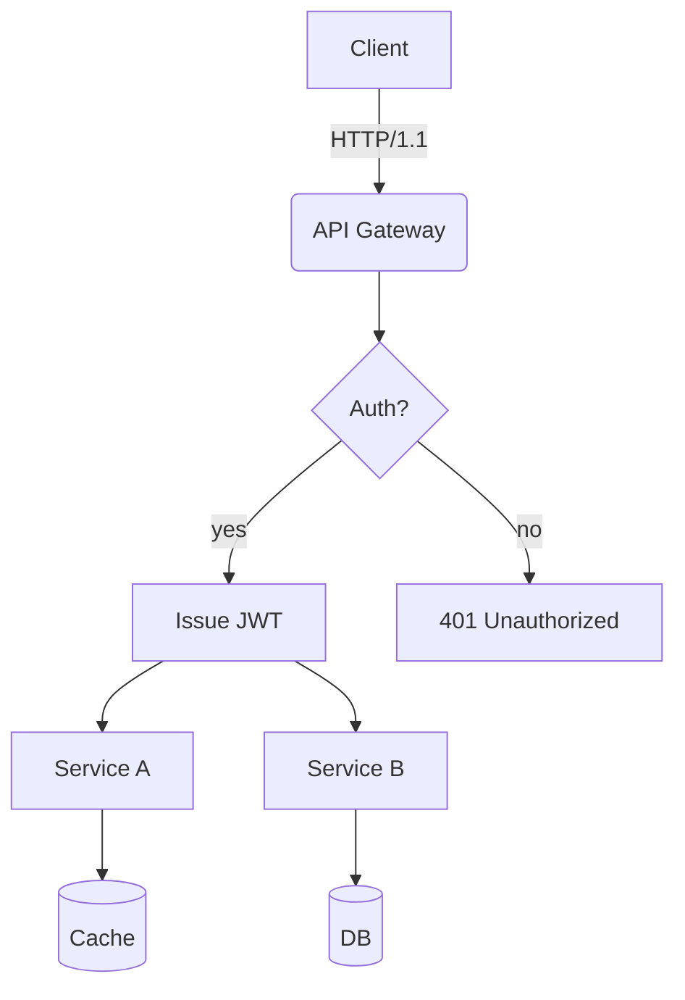
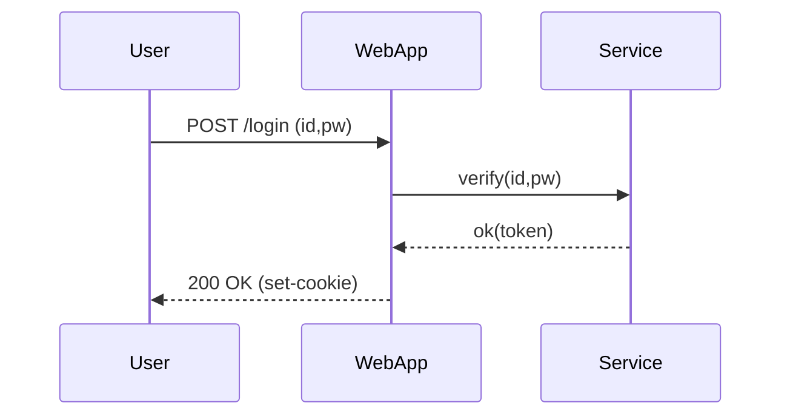
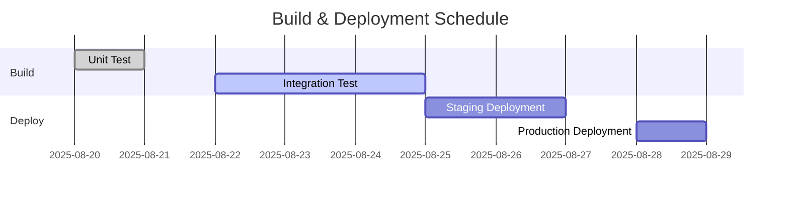
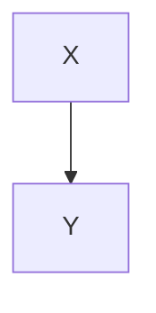

# Translation Test: **Rich** Markdown Document

This document is a collection of Korean content with **various formats** designed to clearly exceed *4096 tokens*.
It is intended for robustness testing, specifically focusing on the translation engine/LLM's ability to handle context, preserve formatting, and ignore code/tables.

> **Guide**
> 1) Verify that code blocks and `mermaid` areas are maintained as is.
> 2) Verify the preservation of numbers/units (e.g., 1.2GB, 3ms), slash paths (`/var/log/app.log`), and options (`--flag`).
> 3) Ensure that tables, lists, quotes, checkboxes, formulas, and emojis 😀 are preserved without layout issues.

## 1. Table and Symbols/Units Mixed

| Item | Value | Unit | Comment |
|---|---|---|---|
| Throughput | 12,345 | RPS | Peak at 18,900 RPS |
| Latency (P50) | 3.2 | ms | When `--enable-cache` is applied |
| Latency (P99) | 41.7 | ms | Includes GC occurrence |
| Memory | 1.5 | GB | Based on RSS, cgroup limit of 2GB |
| Disk I/O | 220 | MB/s | Via NVMe-oF (TCP) |

## 2. Checklist (Task List)

- [x] Markdown header translation accuracy
- [x] Preserve keywords within code blocks (`for`, `if`, `return`, etc.)
- [ ] Preserve Mermaid diagrams and ignore comments
- [ ] Preserve units (GB/ms/%), paths (`/etc/hosts`)
- [ ] Preserve inline notation $O(n \log n)$

## 3. Code Blocks: Bash/Python/JSON/YAML

```bash
#!/usr/bin/env bash
set -euo pipefail

APP_ENV="${APP_ENV:-prod}"
INPUT="${1:-/data/input.txt}"
OUT="/var/tmp/result.json"

echo "[INFO] starting job on $(hostname) at $(date -Iseconds)"
if [[ ! -f "$INPUT" ]]; then
  echo "[ERROR] input not found: $INPUT" >&2
  exit 1
fi

lines=$(wc -l < "$INPUT")
echo "[DEBUG] line count: $lines"

curl -sS -X POST "http://127.0.0.1:8080/api" \  -H "Content-Type: application/json" \  -d "{"env":"$APP_ENV","count":$lines}" > "$OUT"

jq -r '.status' "$OUT" | grep -q success && echo "OK" || { echo "FAIL"; exit 2; }
```

```python
from __future__ import annotations

def rolling_avg(xs: list[float], k: int) -> list[float]:
    if k <= 0:
        raise ValueError("k must be > 0")
    out = []
    acc = 0.0
    for i, v in enumerate(xs):
        acc += v
        if i >= k:
            acc -= xs[i-k]
        if i >= k - 1:
            out.append(acc / k)
    return out

print(rolling_avg([1,2,3,4,5,6,7,8,9], 3))
```

```json
{
  "service": "analytics",
  "version": "1.4.2",
  "features": ["rollup", "compaction", "delta-index"],
  "limits": {
    "max_docs": 1000000,
    "max_payload_mb": 256
  }
}
```

```yaml
apiVersion: v1
kind: ConfigMap
metadata:
  name: test-config
data:
  APP_ENV: "staging"
  ENDPOINT: "https://api.example.com"
```

## 4. Mermaid Diagrams

### 4.1 Flowchart

```mermaid
flowchart TD
  A[Client] -->|HTTP/1.1| B(API Gateway)
  B --> C{Auth?}
  C -- yes --> D[Issue JWT]
  C -- no  --> E[401 Unauthorized]
  D --> F[Service A]
  D --> G[Service B]
  F --> H[(Cache)]
  G --> I[(DB)]
```

### 4.2 Sequence

```mermaid
sequenceDiagram
  participant U as User
  participant W as WebApp
  participant S as Service
  U->>W: POST /login (id,pw)
  W->>S: verify(id,pw)
  S-->>W: ok(token)
  W-->>U: 200 OK (set-cookie)
```

### 4.3 Gantt

```mermaid
gantt
  title Build & Deployment Schedule
  dateFormat  YYYY-MM-DD
  section Build
  Unit Test       :done,    des1, 2025-08-20,2025-08-21
  Integration Test       :active,  des2, 2025-08-22, 3d
  section Deploy
  Staging Deployment     :         des3, after des2, 2d
  Production Deployment     :         des4, 2025-08-28, 1d
```

## 5. Images/Links/Quotes


- Document: <https://example.com/docs/guide>
- API Reference: [API Reference](https://example.com/api)
- Issue Tracker: https://example.com/issues

> "Translation quality is determined by the simultaneous preservation of layout and meaning." — Anonymous

## 6. Mixing of Formulas and Text

- Average time complexity: $O(n \log n)$, worst case: $O(n^2)$
- Variance: $\sigma^2 = \frac{1}{n}\sum_{i=1}^{n}(x_i-\mu)^2$
- Sample mean: $\bar{x} = \frac{1}{n}\sum x_i$

Paragraph example: This paragraph is a sample to verify whether formulas and text are preserved correctly even when mixed with **bold**, *italic*, and `code`.
It includes emojis 😀, Chinese characters 漢字, English CamelCase, snake_case, kebab-case.

### 7.1 Experimental Paragraph — Variation Pattern
The following paragraph is similar, but the vocabulary and order are slightly changed each time to avoid duplicate translations.
- Scenario: Dialogue summary
- Condition: Includes 100k Korean characters
- Expected result: Summary rate of 90% or more

#### Procedure
1. Input data: `/data/input_01.jsonl`
2. Options: `--batch 512 --timeout 3s --enable-cache`
3. Run: `app run --job test-01 --qos high`
4. Verification: Check if "test-01 finished" is included in the logs

#### Observations
- Observed an increasing tendency of P99 latency as GC cycles become longer
- When the cache miss rate increases by 10%, the throughput decreases by ~7%
- When the connection pool size increases from 32 to 64, the retry rate decreases from 1.2% to 0.6%

### 7.2 Experimental Paragraph — Modified Pattern
The following paragraph is similar, but the vocabulary and order are slightly modified each time to avoid duplicate translations.
- Scenario: Summary of conversation log
- Condition: Including 100k Korean characters
- Expected result: Summary rate of 90% or higher

#### Procedure
1. Input data: `/data/input_02.jsonl`
2. Options: `--batch 512 --timeout 3s --enable-cache`
3. Run: `app run --job test-02 --qos high`
4. Verification: Check if "test-02 finished" is included in the logs

#### Observations
- Observed an increasing trend in P99 latency as the GC cycle becomes longer
- When the cache miss rate increases by 10%, the throughput decreases by ~7%
- When the connection pool size increases from 32 to 64, the retry rate per second decreases from 1.2% to 0.6%

### 7.3 Experimental Paragraph — Modified Pattern
The following paragraph is similar, but the vocabulary and order are slightly modified each time to avoid duplicate translations.
- Scenario: Kubernetes deployment
- Condition: HPA enabled
- Expected result: Scale range 2~10 operations

#### Procedure
1. Input data: `/data/input_03.jsonl`
2. Options: `--batch 512 --timeout 3s --enable-cache`
3. Run: `app run --job test-03 --qos high`
4. Verification: Check if the log contains `test-03 finished`

#### Observations
- Observed an increasing trend in P99 latency as the GC cycle becomes longer
- When the cache miss rate increases by 10%, the throughput decreases by ~7%
- When the connection pool size increases from 32 to 64, the retry rate per second decreases from 1.2% to 0.6%

### 7.4 Experimental Paragraph — Modified Pattern
The following paragraph is similar, but the vocabulary and order are slightly modified each time to avoid duplicate translations.
- Scenario: Kubernetes deployment
- Condition: HPA enabled
- Expected result: Scale range 2~10 operations

#### Procedure
1. Input data: `/data/input_04.jsonl`
2. Options: `--batch 512 --timeout 3s --enable-cache`
3. Run: `app run --job test-04 --qos high`
4. Verification: Check if the log contains `test-04 finished`

#### Observations
- Observed an increasing trend in P99 latency as the GC cycle becomes longer
- When the cache miss rate increases by 10%, the throughput decreases by ~7%
- When the connection pool size increases from 32 to 64, the retry rate per second decreases from 1.2% to 0.6%

### 7.5 Experimental Paragraph — Modified Pattern
The following paragraph is similar, but the vocabulary and order are slightly modified each time to avoid duplicate translations.
- Scenario: Summary of conversation log
- Condition: Including 100k Korean characters
- Expected result: Summary rate of 90% or higher

#### Procedure
1. Input data: `/data/input_05.jsonl`
2. Options: `--batch 512 --timeout 3s --enable-cache`
3. Run: `app run --job test-05 --qos high`
4. Verification: Check if "test-05 finished" is included in the logs

#### Observations
- Observed an increasing trend in P99 latency as the GC cycle becomes longer
- When the cache miss rate increases by 10%, the throughput decreases by ~7%
- When the connection pool size increases from 32 to 64, the retry rate per second decreases from 1.2% to 0.6%

### 7.6 Experimental Paragraph — Modified Pattern
The following paragraph is similar, but the vocabulary and order are slightly modified each time to avoid duplicate translations.
- Scenario: Mermaid rendering
- Conditions: 50+ nodes, 100+ edges
- Expected result: No layout distortion

#### Procedure
1. Input data: `/data/input_06.jsonl`
2. Options: `--batch 512 --timeout 3s --enable-cache`
3. Run: `app run --job test-06 --qos high`
4. Verification: Check if "test-06 finished" is included in the logs

#### Observations
- Observed an increasing trend in P99 latency as the GC cycle becomes longer
- When the cache miss rate increases by 10%, the throughput decreases by ~7%
- When the connection pool size increases from 32 to 64, the retry rate per second decreases from 1.2% to 0.6%

### 7.7 Experimental Paragraph — Modified Pattern
The following paragraph is similar, but the vocabulary and order are slightly modified each time to avoid duplicate translations.
- Scenario: Parsing large JSON
- Conditions: 64MB payload, 4 workers
- Expected Result: Completion without memory spikes

#### Procedure
1. Input data: `/data/input_07.jsonl`
2. Options: `--batch 512 --timeout 3s --enable-cache`
3. Run: `app run --job test-07 --qos high`
4. Verification: Check if the log contains `test-07 finished`

#### Observations
- Observed an increasing trend in P99 latency as the GC cycle becomes longer
- When the cache miss rate increases by 10%, the throughput decreases by ~7%
- When the connection pool size increases from 32 to 64, the retry rate per second decreases from 1.2% to 0.6%

### 7.8 Experimental Paragraph — Modified Pattern
The following paragraph is similar, but the vocabulary and order are slightly modified each time to avoid duplicate translations.
- Scenario: Parsing large JSON
- Conditions: 64MB payload, 4 workers
- Expected Result: Completion without memory spikes

#### Procedure
1. Input data: `/data/input_08.jsonl`
2. Options: `--batch 512 --timeout 3s --enable-cache`
3. Run: `app run --job test-08 --qos high`
4. Verification: Check if the log contains `test-08 finished`

#### Observations
- Observed an increasing trend in P99 latency as the GC cycle becomes longer
- When the cache miss rate increases by 10%, the throughput decreases by ~7%
- When the connection pool size increases from 32 to 64, the retry rate per second decreases from 1.2% to 0.6%

### 7.9 Experimental Paragraph — Modified Pattern
The following paragraph is similar, but the vocabulary and order are slightly modified each time to avoid duplicate translations.
- Scenario: Parsing large JSON
- Conditions: 64MB payload, 4 workers
- Expected Result: Completion without memory spikes

#### Procedure
1. Input data: `/data/input_09.jsonl`
2. Options: `--batch 512 --timeout 3s --enable-cache`
3. Run: `app run --job test-09 --qos high`
4. Verification: Check if the log contains `test-09 finished`

#### Observations
- Observed an increasing trend in P99 latency as the GC cycle becomes longer
- When the cache miss rate increases by 10%, the throughput decreases by ~7%
- When the connection pool size increases from 32 to 64, the retry rate per second decreases from 1.2% to 0.6%

### 7.10 Experimental Paragraph — Modified Pattern
The following paragraph is similar, but the vocabulary and order are slightly changed each time to avoid duplicate translations.
- Scenario: NVMe-oF I/O Retries
- Conditions: TCP RTT 2ms, loss 0.1%
- Expected Result: Retry rate of 1% or less

#### Procedure
1. Input Data: `/data/input_10.jsonl`
2. Options: `--batch 512 --timeout 3s --enable-cache`
3. Run: `app run --job test-10 --qos high`
4. Verification: Check if the log contains `test-10 finished`

#### Observations
- Observed an increasing trend in P99 latency as the GC cycle becomes longer
- When the cache miss rate increases by 10%, the throughput decreases by ~7%
- When the connection pool size increases from 32 to 64, the retry rate decreases from 1.2% to 0.6 per second

### 7.11 Experimental Paragraph — Modified Pattern
The following paragraph is similar, but the vocabulary and order are slightly modified each time to avoid duplicate translations.
- Scenario: Parsing large JSON
- Conditions: 64MB payload, 4 workers
- Expected Result: Completion without memory spikes

#### Procedure
1. Input data: `/data/input_11.jsonl`
2. Options: `--batch 512 --timeout 3s --enable-cache`
3. Run: `app run --job test-11 --qos high`
4. Verification: Check if the log contains `test-11 finished`

#### Observations
- Observed an increasing trend in P99 latency as the GC cycle becomes longer
- When the cache miss rate increases by 10%, the throughput decreases by ~7%
- When the connection pool size increases from 32 to 64, the retry rate per second decreases from 1.2% to 0.6%

### 7.12 Experiment Section — Modified Pattern
The following paragraph is similar, but the vocabulary and order are slightly changed each time to avoid duplicate translations.
- Scenario: Kubernetes deployment
- Condition: HPA enabled
- Expected result: Scale range 2~10 Movement

#### Procedure
1. Input data: `/data/input_12.jsonl`
2. Options: `--batch 512 --timeout 3s --enable-cache`
3. Run: `app run --job test-12 --qos high`
4. Verification: Check if "test-12 finished" is included in the logs

#### Observations
- Observed an increasing trend in P99 latency as the GC cycle becomes longer
- When the cache miss rate increases by 10%, the throughput decreases by ~7%
- When the connection pool size increases from 32 to 64, the retry rate per second decreases from 1.2% to 0.6%

### 7.13 Experimental Paragraph — Modified Pattern
The following paragraph is similar, but the vocabulary and order are slightly modified each time to avoid duplicate translations.
- Scenario: Parsing large JSON
- Conditions: 64MB payload, 4 workers
- Expected Result: Completion without memory spikes

#### Procedure
1. Input data: `/data/input_13.jsonl`
2. Options: `--batch 512 --timeout 3s --enable-cache`
3. Run: `app run --job test-13 --qos high`
4. Verification: Check if the log contains `test-13 finished`

#### Observations
- Observed an increasing trend in P99 latency as the GC cycle becomes longer
- When the cache miss rate increases by 10%, the throughput decreases by ~7%
- When the connection pool size increases from 32 to 64, the retry rate per second decreases from 1.2% to 0.6%

### 7.14 Experimental Paragraph — Modified Pattern
The following paragraph is similar, but the vocabulary and order are slightly modified each time to avoid duplicate translations.
- Scenario: Parsing large JSON
- Conditions: 64MB payload, 4 workers
- Expected Result: Completion without memory spikes

#### Procedure
1. Input data: `/data/input_14.jsonl`
2. Options: `--batch 512 --timeout 3s --enable-cache`
3. Run: `app run --job test-14 --qos high`
4. Verification: Check if the log contains `test-14 finished`

#### Observations
- Observed an increasing trend in P99 latency as the GC cycle becomes longer
- When the cache miss rate increases by 10%, the throughput decreases by ~7%
- When the connection pool size increases from 32 to 64, the retry rate per second decreases from 1.2% to 0.6%

### 7.15 Experiment Paragraph — Modified Pattern
The following paragraph is similar, but the vocabulary and order are slightly changed each time to avoid duplicate translations.
- Scenario: NVMe-oF I/O Retries
- Conditions: TCP RTT 2ms, loss 0.1%
- Expected Result: Retry rate of 1% or less

#### Procedure
1. Input Data: `/data/input_15.jsonl`
2. Options: `--batch 512 --timeout 3s --enable-cache`
3. Run: `app run --job test-15 --qos high`
4. Verification: Check if the log contains `test-15 finished`

#### Observations
- Observed an increasing trend in P99 latency as the GC cycle becomes longer
- When the cache miss rate increases by 10%, the throughput decreases by ~7%
- When the connection pool size increases from 32 to 64, the retry rate decreases from 1.2% to 0.6 per second

### 7.16 Experiment Paragraph — Modified Pattern
The following paragraph is similar, but the vocabulary and order are slightly changed each time to avoid duplicate translations.
- Scenario: Mermaid rendering
- Condition: 50+ nodes, 100+ edges
- Expected result: No layout distortion

#### Procedure
1. Input data: `/data/input_16.jsonl`
2. Options: `--batch 512 --timeout 3s --enable-cache`
3. Run: `app run --job test-16 --qos high`
4. Verification: Check if "test-16 finished" is included in the logs

#### Observations
- Observed an increasing trend in P99 latency as the GC cycle becomes longer
- When the cache miss rate increases by 10%, the throughput decreases by ~7%
- When the connection pool size increases from 32 to 64, the retry rate per second decreases from 1.2% to 0.6%

### 7.17 Experimental Paragraph — Modified Pattern
The following paragraph is similar, but the vocabulary and order are slightly modified each time to avoid duplicate translations.
- Scenario: Summary of conversation log
- Condition: Including 100k Korean characters
- Expected Result: Summary rate of 90% or higher

#### Procedure
1. Input data: `/data/input_17.jsonl`
2. Options: `--batch 512 --timeout 3s --enable-cache`
3. Run: `app run --job test-17 --qos high`
4. Verification: Check if "test-17 finished" is included in the logs

#### Observations
- Observed an increasing trend in P99 latency as the GC cycle becomes longer
- When the cache miss rate increases by 10%, the throughput decreases by ~7%
- When the connection pool size increases from 32 to 64, the retry rate per second decreases from 1.2% to 0.6%

### 7.18 Experiment Section — Modified Pattern
The following paragraph is similar, but the vocabulary and order are slightly changed each time to avoid duplicate translations.
- Scenario: Parsing large JSON
- Conditions: 64MB payload, 4 workers
- Expected Result: Completion without memory spikes

#### Procedure
1. Input data: `/data/input_18.jsonl`
2. Options: `--batch 512 --timeout 3s --enable-cache`
3. Run: `app run --job test-18 --qos high`
4. Verification: Check if the log contains `test-18 finished`

#### Observations
- Observed an increasing trend in P99 latency as the GC cycle becomes longer
- When the cache miss rate increases by 10%, the throughput decreases by ~7%
- When the connection pool size increases from 32 to 64, the retry rate per second decreases from 1.2% to 0.6%

### 7.19 Experiment Section — Modified Pattern
The following paragraph is similar, but the vocabulary and order are slightly changed each time to avoid duplicate translations.
- Scenario: Parsing large JSON
- Conditions: 64MB payload, 4 workers
- Expected Result: Completion without memory spikes

#### Procedure
1. Input data: `/data/input_19.jsonl`
2. Options: `--batch 512 --timeout 3s --enable-cache`
3. Run: `app run --job test-19 --qos high`
4. Verification: Check if the log contains `test-19 finished`

#### Observations
- Observed an increasing trend in P99 latency as the GC cycle becomes longer
- When the cache miss rate increases by 10%, the throughput decreases by ~7%
- When the connection pool size increases from 32 to 64, the retry rate per second decreases from 1.2% to 0.6%

### 7.20 Experiment Section — Modified Pattern
The following paragraph is similar, but the vocabulary and order are slightly changed each time to avoid duplicate translations.
- Scenario: NVMe-oF I/O Retries
- Conditions: TCP RTT 2ms, loss 0.1%
- Expected Result: Retry rate of 1% or less

#### Procedure
1. Input Data: `/data/input_20.jsonl`
2. Options: `--batch 512 --timeout 3s --enable-cache`
3. Run: `app run --job test-20 --qos high`
4. Verification: Check if the log contains `test-20 finished`

#### Observations
- Observed an increasing trend in P99 latency as the GC cycle becomes longer
- When the cache miss rate increases by 10%, the throughput decreases by ~7%
- When the connection pool size increases from 32 to 64, the retry rate decreases from 1.2% to 0.6 per second

### 7.21 Experiment Section — Modified Pattern
The following paragraph is similar, but the vocabulary and order are slightly changed each time to avoid duplicate translations.
- Scenario: Kubernetes deployment
- Condition: HPA enabled
- Expected result: Scale range 2~10 Movement

#### Procedure
1. Input data: `/data/input_21.jsonl`
2. Options: `--batch 512 --timeout 3s --enable-cache`
3. Run: `app run --job test-21 --qos high`
4. Verification: Check if "test-21 finished" is included in the logs

#### Observations
- Observed an increasing trend in P99 latency as the GC cycle becomes longer
- When the cache miss rate increases by 10%, the throughput decreases by ~7%
- When the connection pool size increases from 32 to 64, the retry rate per second decreases from 1.2% to 0.6%

### 7.22 Experiment Section — Modified Pattern
The following paragraph is similar, but the vocabulary and order are slightly changed each time to avoid duplicate translations.
- Scenario: Mermaid rendering
- Condition: 50+ nodes, 100+ edges
- Expected result: No layout distortion

#### Procedure
1. Input data: `/data/input_22.jsonl`
2. Options: `--batch 512 --timeout 3s --enable-cache`
3. Run: `app run --job test-22 --qos high`
4. Verification: Check if "test-22 finished" is included in the logs

#### Observations
- Observed an increasing trend in P99 latency as the GC cycle becomes longer
- When the cache miss rate increases by 10%, the throughput decreases by ~7%
- When the connection pool size increases from 32 to 64, the retry rate per second decreases from 1.2% to 0.6%

### 7.23 Experiment Section — Modified Pattern
The following paragraph is similar, but the vocabulary and order are slightly changed each time to avoid duplicate translations.
- Scenario: Parsing large JSON
- Conditions: 64MB payload, 4 workers
- Expected Result: Completion without memory spikes

#### Procedure
1. Input data: `/data/input_23.jsonl`
2. Options: `--batch 512 --timeout 3s --enable-cache`
3. Run: `app run --job test-23 --qos high`
4. Verification: Check if the log contains `test-23 finished`

#### Observations
- Observed an increasing trend in P99 latency as the GC cycle becomes longer
- When the cache miss rate increases by 10%, the throughput decreases by ~7%
- When the connection pool size increases from 32 to 64, the retry rate per second decreases from 1.2% to 0.6%

### 7.24 Experiment Section — Modified Pattern
The following paragraph is similar, but the vocabulary and order are slightly changed each time to avoid duplicate translations.
- Scenario: Mermaid rendering
- Condition: 50+ nodes, 100+ edges
- Expected result: No layout distortion

#### Procedure
1. Input data: `/data/input_24.jsonl`
2. Options: `--batch 512 --timeout 3s --enable-cache`
3. Run: `app run --job test-24 --qos high`
4. Verification: Check if "test-24 finished" is included in the logs

#### Observations
- Observed an increasing trend in P99 latency as the GC cycle becomes longer
- When the cache miss rate increases by 10%, the throughput decreases by ~7%
- When the connection pool size increases from 32 to 64, the retry rate per second decreases from 1.2% to 0.6%

### 7.25 Experiment Section — Modified Pattern
The following paragraph is similar, but the vocabulary and order are slightly changed each time to avoid duplicate translations.
- Scenario: Kubernetes deployment
- Condition: HPA enabled
- Expected result: Scale range 2~10 Movement

#### Procedure
1. Input data: `/data/input_25.jsonl`
2. Options: `--batch 512 --timeout 3s --enable-cache`
3. Run: `app run --job test-25 --qos high`
4. Verification: Check if "test-25 finished" is included in the logs

#### Observations
- Observed an increasing trend in P99 latency as the GC cycle becomes longer
- When the cache miss rate increases by 10%, the throughput decreases by ~7%
- When the connection pool size increases from 32 to 64, the retry rate per second decreases from 1.2% to 0.6%

### 7.26 Experiment Paragraph — Modified Pattern
The following paragraph is similar, but the vocabulary and order are slightly changed each time to avoid duplicate translations.
- Scenario: NVMe-oF I/O Retries
- Conditions: TCP RTT 2ms, loss 0.1%
- Expected Result: Retry rate below 1%

#### Procedure
1. Input Data: `/data/input_26.jsonl`
2. Options: `--batch 512 --timeout 3s --enable-cache`
3. Run: `app run --job test-26 --qos high`
4. Verification: Check if the log contains `test-26 finished`

#### Observations
- Observed an increasing trend in P99 latency as the GC cycle becomes longer
- When the cache miss rate increases by 10%, the throughput decreases by ~7%
- When the connection pool size increases from 32 to 64, the retry rate decreases from 1.2% to 0.6 per second

### 7.27 Experimental Paragraph — Modified Pattern
The following paragraph is similar, but the vocabulary and order are slightly modified each time to avoid duplicate translations.
- Scenario: Summary of conversation log
- Condition: Including 100k Korean characters
- Expected Result: Summary rate of 90% or higher

#### Procedure
1. Input data: `/data/input_27.jsonl`
2. Options: `--batch 512 --timeout 3s --enable-cache`
3. Run: `app run --job test-27 --qos high`
4. Verification: Check if "test-27 finished" is included in the logs

#### Observations
- Observed an increasing trend in P99 latency as the GC cycle becomes longer
- When the cache miss rate increases by 10%, the throughput decreases by ~7%
- When the connection pool size increases from 32 to 64, the retry rate per second decreases from 1.2% to 0.6%

### 7.28 Experiment Paragraph — Modified Pattern
The following paragraph is similar, but the vocabulary and order are slightly changed each time to avoid duplicate translations.
- Scenario: Summary of conversation log
- Condition: Including 100k Korean characters
- Expected Result: Summary rate of 90% or higher

#### Procedure
1. Input data: `/data/input_28.jsonl`
2. Options: `--batch 512 --timeout 3s --enable-cache`
3. Run: `app run --job test-28 --qos high`
4. Verification: Check if "test-28 finished" is included in the logs

#### Observations
- Observed an increasing trend in P99 latency as the GC cycle becomes longer
- When the cache miss rate increases by 10%, the throughput decreases by ~7%
- When the connection pool size increases from 32 to 64, the retry rate per second decreases from 1.2% to 0.6%

### 7.29 Experiment Section — Modified Pattern
The following paragraph is similar, but the vocabulary and order are slightly changed each time to avoid duplicate translations.
- Scenario: Parsing large JSON
- Conditions: 64MB payload, 4 workers
- Expected Result: Completion without memory spikes

#### Procedure
1. Input data: `/data/input_29.jsonl`
2. Options: `--batch 512 --timeout 3s --enable-cache`
3. Run: `app run --job test-29 --qos high`
4. Verification: Check if the log contains `test-29 finished`

#### Observations
- Observed an increasing trend in P99 latency as the GC cycle becomes longer
- When the cache miss rate increases by 10%, the throughput decreases by ~7%
- When the connection pool size increases from 32 to 64, the retry rate per second decreases from 1.2% to 0.6%

### 7.30 Experimental Paragraph — Modified Pattern
The following paragraph is similar, but the vocabulary and order are slightly modified each time to avoid duplicate translations.
- Scenario: Summary of conversation log
- Condition: Including 100k Korean characters
- Expected Result: Summary rate of 90% or higher

#### Procedure
1. Input data: `/data/input_30.jsonl`
2. Options: `--batch 512 --timeout 3s --enable-cache`
3. Run: `app run --job test-30 --qos high`
4. Verification: Check if "test-30 finished" is included in the logs

#### Observations
- Observed an increasing trend in P99 latency as the GC cycle becomes longer
- When the cache miss rate increases by 10%, the throughput decreases by ~7%
- When the connection pool size increases from 32 to 64, the retry rate per second decreases from 1.2% to 0.6%

### 7.31 Experiment Paragraph — Modified Pattern
The following paragraph is similar, but the vocabulary and order are slightly changed each time to avoid duplicate translations.
- Scenario: Kubernetes deployment
- Condition: HPA enabled
- Expected result: Scale range 2~10 Movement

#### Procedure
1. Input data: `/data/input_31.jsonl`
2. Options: `--batch 512 --timeout 3s --enable-cache`
3. Run: `app run --job test-31 --qos high`
4. Verification: Check if "test-31 finished" is included in the logs

#### Observations
- Observed an increasing trend in P99 latency as the GC cycle becomes longer
- When the cache miss rate increases by 10%, the throughput decreases by ~7%
- When the connection pool size increases from 32 to 64, the retry rate per second decreases from 1.2% to 0.6%

### 7.32 Experimental Paragraph — Modified Pattern
The following paragraph is similar, but the vocabulary and order are slightly modified each time to avoid duplicate translations.
- Scenario: Mermaid rendering
- Condition: 50+ nodes, 100+ edges
- Expected Result: No layout distortion

#### Procedure
1. Input data: `/data/input_32.jsonl`
2. Options: `--batch 512 --timeout 3s --enable-cache`
3. Run: `app run --job test-32 --qos high`
4. Verification: Check if "test-32 finished" is included in the logs

#### Observations
- Observed an increasing trend in P99 latency as the GC cycle becomes longer
- When the cache miss rate increases by 10%, the throughput decreases by ~7%
- When the connection pool size increases from 32 to 64, the retry rate per second decreases from 1.2% to 0.6%

### 7.33 Experimental Paragraph — Modified Pattern
The following paragraph is similar, but the vocabulary and order are slightly modified each time to avoid duplicate translations.
- Scenario: Parsing large JSON
- Conditions: 64MB payload, 4 workers
- Expected Result: Completion without memory spikes

#### Procedure
1. Input data: `/data/input_33.jsonl`
2. Options: `--batch 512 --timeout 3s --enable-cache`
3. Run: `app run --job test-33 --qos high`
4. Verification: Check if the log contains `test-33 finished`

#### Observations
- Observed an increasing trend in P99 latency as the GC cycle becomes longer
- When the cache miss rate increases by 10%, the throughput decreases by ~7%
- When the connection pool size increases from 32 to 64, the retry rate per second decreases from 1.2% to 0.6%

### 7.34 Experiment Section — Modified Pattern
The following paragraph is similar, but the vocabulary and order are slightly changed each time to avoid duplicate translations.
- Scenario: Kubernetes deployment
- Condition: HPA enabled
- Expected result: Scale range 2~10 Movement

#### Procedure
1. Input data: `/data/input_34.jsonl`
2. Options: `--batch 512 --timeout 3s --enable-cache`
3. Run: `app run --job test-34 --qos high`
4. Verification: Check if "test-34 finished" is included in the logs

#### Observations
- Observed an increasing trend in P99 latency as the GC cycle becomes longer
- When the cache miss rate increases by 10%, the throughput decreases by ~7%
- When the connection pool size increases from 32 to 64, the retry rate per second decreases from 1.2% to 0.6%

### 7.35 Experiment Section — Modified Pattern
The following section contains similar content, but the vocabulary and order are slightly modified each time to avoid duplicate translations.
- Scenario: Mermaid rendering
- Conditions: 50+ nodes, 100+ edges
- Expected result: No layout distortion

#### Procedure
1. Input data: `/data/input_35.jsonl`
2. Options: `--batch 512 --timeout 3s --enable-cache`
3. Run: `app run --job test-35 --qos high`
4. Verification: Check if the log contains `test-35 finished`

#### Observations
- Observed an increasing trend in P99 latency as the GC cycle becomes longer
- When the cache miss rate increases by 10%, the throughput decreases by ~7%
- When the connection pool size increases from 32 to 64, the retry rate per second decreases from 1.2% to 0.6%

### 7.36 Experiment Paragraph — Modified Pattern
The following paragraph is similar, but the vocabulary and order are slightly changed each time to avoid duplicate translations.
- Scenario: NVMe-oF I/O Retries
- Conditions: TCP RTT 2ms, loss 0.1%
- Expected Result: Retry rate below 1%

#### Procedure
1. Input Data: `/data/input_36.jsonl`
2. Options: `--batch 512 --timeout 3s --enable-cache`
3. Run: `app run --job test-36 --qos high`
4. Verification: Check if the log contains `test-36 finished`

#### Observations
- Observed an increasing trend in P99 latency as the GC cycle becomes longer
- When the cache miss rate increases by 10%, the throughput decreases by ~7%
- When the connection pool size increases from 32 to 64, the retry rate decreases from 1.2% to 0.6 per second

### 7.37 Experiment Section — Modified Pattern
The following paragraph is similar, but the vocabulary and order are slightly changed each time to avoid duplicate translations.
- Scenario: Parsing large JSON
- Conditions: 64MB payload, 4 workers
- Expected Result: Completion without memory spikes

#### Procedure
1. Input data: `/data/input_37.jsonl`
2. Options: `--batch 512 --timeout 3s --enable-cache`
3. Run: `app run --job test-37 --qos high`
4. Verification: Check if the log contains `test-37 finished`

#### Observations
- Observed an increase in P99 latency as the GC cycle becomes longer
- When the cache miss rate increases by 10%, the throughput decreases by ~7%
- When the connection pool size increases from 32 to 64, the retry rate per second decreases from 1.2% to 0.6%

### 7.38 Experiment Section — Modified Pattern
The following section contains similar content, but the vocabulary and order are slightly modified each time to avoid duplicate translations.
- Scenario: Mermaid rendering
- Conditions: 50+ nodes, 100+ edges
- Expected result: No layout distortion

#### Procedure
1. Input data: `/data/input_38.jsonl`
2. Options: `--batch 512 --timeout 3s --enable-cache`
3. Run: `app run --job test-38 --qos high`
4. Verification: Check if the log contains `test-38 finished`

#### Observations
- Observed an increasing trend in P99 latency as the GC cycle becomes longer
- When the cache miss rate increases by 10%, the throughput decreases by ~7%
- When the connection pool size increases from 32 to 64, the retry rate per second decreases from 1.2% to 0.6%

### 7.39 Experiment Section — Modified Pattern
The following section contains similar content, but the vocabulary and order are slightly modified each time to avoid duplicate translations.
- Scenario: Mermaid rendering
- Conditions: 50+ nodes, 100+ edges
- Expected result: No layout distortion

#### Procedure
1. Input data: `/data/input_39.jsonl`
2. Options: `--batch 512 --timeout 3s --enable-cache`
3. Run: `app run --job test-39 --qos high`
4. Verification: Check if the log contains `test-39 finished`

#### Observations
- Observed an increasing trend in P99 latency as the GC cycle becomes longer
- When the cache miss rate increases by 10%, the throughput decreases by ~7%
- When the connection pool size increases from 32 to 64, the retry rate per second decreases from 1.2% to 0.6%

### 7.40 Experimental Paragraph — Modified Pattern
The following paragraph is similar, but the vocabulary and order are slightly modified each time to avoid duplicate translations.
- Scenario: Summary of conversation log
- Condition: Including 100k Korean characters
- Expected Result: Summary rate of 90% or higher

#### Procedure
1. Input data: `/data/input_40.jsonl`
2. Options: `--batch 512 --timeout 3s --enable-cache`
3. Run: `app run --job test-40 --qos high`
4. Verification: Check if "test-40 finished" is included in the logs

#### Observations
- Observed an increasing trend in P99 latency as the GC cycle becomes longer
- When the cache miss rate increases by 10%, the throughput decreases by ~7%
- When the connection pool size increases from 32 to 64, the retry rate per second decreases from 1.2% to 0.6%

## 8. Long List Examples

- 2. Consistent Error Handling – Case #001
- 3. Performance Profiling – Case #002
- 4. Accessibility (a11y) – Case #003
- 5. Log Schema Stability – Case #004
- 6. Cache Invalidation Scenario – Case #005
- 7. Performance Profiling – Case #006
- 8. Performance Profiling – Case #007
- 9. API Backward Compatibility – Case #008
- 10. Log Schema Stability – Case #009
- 11. Accessibility (a11y) – Case #010
- 12. Cache Invalidation Scenario – Case #011
- 13. Performance Profiling – Case #012
- 14. Security Header Implementation – Case #013
- 15. Internationalization (i18n) – Case #014
- 16. Resource Leak Detection – Case #015
- 17. Consistent Error Handling – Case #016
- 18. Consistent Error Handling – Case #017
- 19. Internationalization (i18n) – Case #018
- 20. CORS Policy Validation – Case #019
- 21. Performance Profiling – Case #020
- 22. Security Header Implementation – Case #021
- 23. Log Schema Stability – Case #022
- 24. Performance Profiling – Case #023
- 25. Cache Invalidation Scenario – Case #024
- 26. CORS Policy Validation – Case #025
- 27. Performance Profiling – Case #026
- 28. Accessibility (a11y) – Case #027
- 29. Accessibility (a11y) – Case #028
- 30. API Backward Compatibility – Case #029
- 31. Cache Invalidation Scenario – Case #030
- 32. Cache Invalidation Scenario – Case #031
- 33. Performance Profiling – Case #032
- 34. Resource Leak Detection – Case #033
- 35. Log Schema Stability – Case #034
- 36. CORS Policy Validation – Case #035
- 37. Consistent Error Handling – Case #036
- 38. Resource Leak Detection – Case #037
- 39. Consistent Error Handling – Case #038
- 40. Internationalization (i18n) – Case #039
- 41. API Backward Compatibility – Case #040
- 42. Cache Invalidation Scenario – Case #041
- 43. Cache Invalidation Scenario – Case #042
- 44. Cache Invalidation Scenario – Case #043
- 45. Performance Profiling – Case #044
- 46. Performance Profiling – Case #045
- 47. CORS Policy Validation – Case #046
- 48. Resource Leak Detection – Case #047
- 49. Cache Invalidation Scenario – Case #048
- 50. Consistent Error Handling – Case #049
- 51. Log Schema Stability – Case #050
- 52. Resource Leak Detection – Case #051
- 53. Internationalization (i18n) – Case #052
- 54. Log Schema Stability – Case #053
- 55. Resource Leak Detection – Case #054
- 56. Security Header Implementation – Case #055
- 57. Internationalization (i18n) – Case #056
- 58. API Backward Compatibility – Case #057
- 59. Accessibility (a11y) – Case #058
- 60. API Backward Compatibility – Case #059
- 61. Performance Profiling – Case #060
- 62. Accessibility (a11y) – Case #061
- 63. API Backward Compatibility – Case #062
- 64. Internationalization (i18n) – Case #063
- 65. Security Header Implementation – Case #064
- 66. Consistent Error Handling – Case #065
- 67. Performance Profiling – Case #066
- 68. Accessibility (a11y) – Case #067
- 69. Consistent Error Handling – Case #068
- 70. Performance Profiling – Case #069
- 71. Resource Leak Detection – Case #070
- 72. Accessibility (a11y) – Case #071
- 73. Internationalization (i18n) – Case #072
- 74. Consistent Error Handling – Case #073
- 75. Internationalization (i18n) – Case #074
- 76. Performance Profiling – Case #075
- 77. Security Header Implementation – Case #076
- 78. CORS Policy Validation – Case #077
- 79. Resource Leak Detection – Case #078
- 80. Resource Leak Detection – Case #079
- 81. Performance Profiling – Case #080
- 82. Accessibility (a11y) – Case #081
- 83. Accessibility (a11y) – Case #082
- 84. Performance Profiling – Case #083
- 85. Resource Leak Detection – Case #084
- 86. Accessibility (a11y) – Case #085
- 87. Cache Invalidation Scenario – Case #086
- 88. CORS Policy Validation – Case #087
- 89. Log Schema Stability – Case #088
- 90. CORS Policy Validation – Case #089
- 91. Security Header Implementation – Case #090
- 92. API Backward Compatibility – Case #091
- 93. Accessibility (a11y) – Case #092
- 94. Performance Profiling – Case #093
- 95. Performance Profiling – Case #094
- 96. Log Schema Stability – Case #095
- 97. Internationalization (i18n) – Case #096
- 98. API Backward Compatibility – Case #097
- 99. Consistent Error Handling – Case #098
- 100. Cache Invalidation Scenario – Case #099
- 101. Accessibility (a11y) – Case #100
- 102. Accessibility (a11y) – Case #101
- 103. Internationalization (i18n) – Case #102
- 104. Accessibility (a11y) – Case #103
- 105. API Backward Compatibility – Case #104
- 106. Accessibility (a11y) – Case #105
- 107. Performance Profiling – Case #106
- 108. Security Header Implementation – Case #107
- 109. API Backward Compatibility – Case #108
- 110. Security Header Implementation – Case #109
- 111. Consistent Error Handling – Case #110
- 112. Performance Profiling – Case #111
- 113. Resource Leak Detection – Case #112
- 114. CORS Policy Validation – Case #113
- 115. Accessibility (a11y) – Case #114
- 116. Consistent Error Handling – Case #115
- 117. Consistent Error Handling – Case #116
- 118. Performance Profiling – Case #117
- 119. CORS Policy Validation – Case #118
- 120. Resource Leak Detection – Case #119
- 121. Cache Invalidation Scenario – Case #120
- 122. CORS Policy Validation – Case #121
- 123. Performance Profiling – Case #122
- 124. Consistent Error Handling – Case #123
- 125. Performance Profiling – Case #124
- 126. Performance Profiling – Case #125
- 127. Accessibility (a11y) – Case #126
- 128. Accessibility (a11y) – Case #127
- 129. Error Handling Consistency – Case #128
- 130. Error Handling Consistency – Case #129
- 131. API Backward Compatibility – Case #130
- 132. Accessibility (a11y) – Case #131
- 133. API Backward Compatibility – Case #132
- 134. Cache Invalidation Scenario – Case #133
- 135. Security Header Implementation – Case #134
- 136. Internationalization (i18n) – Case #135
- 137. Security Header Implementation – Case #136
- 138. Performance Profiling – Case #137
- 139. Performance Profiling – Case #138
- 140. CORS Policy Validation – Case #139
- 141. Internationalization (i18n) – Case #140
- 142. Log Schema Stability – Case #141
- 143. CORS Policy Validation – Case #142
- 144. Accessibility (a11y) – Case #143
- 145. Security Header Implementation – Case #144
- 146. Log Schema Stability – Case #145
- 147. Performance Profiling – Case #146
- 148. Performance Profiling – Case #147
- 149. API Backward Compatibility – Case #148
- 150. Resource Leak Detection – Case #149
- 151. Performance Profiling – Case #150
- 152. Resource Leak Detection – Case #151
- 153. Accessibility (a11y) – Case #152
- 154. API Backward Compatibility – Case #153
- 155. Accessibility (a11y) – Case #154
- 156. Security Header Implementation – Case #155
- 157. Accessibility (a11y) – Case #156
- 158. Performance Profiling – Case #157
- 159. Cache Invalidation Scenario – Case #158
- 160. Security Header Implementation – Case #159
- 161. Error Handling Consistency – Case #160
- 162. Log Schema Stability – Case #161
- 163. Performance Profiling – Case #162
- 164. Accessibility (a11y) – Case #163
- 165. Error Handling Consistency – Case #164
- 166. Resource Leak Detection – Case #165
- 167. Log Schema Stability – Case #166
- 168. Internationalization (i18n) – Case #167
- 169. Cache Invalidation Scenario – Case #168
- 170. Internationalization (i18n) – Case #169
- 171. Cache Invalidation Scenario – Case #170
- 172. Resource Leak Detection – Case #171
- 173. Security Header Implementation – Case #172
- 174. Resource Leak Detection – Case #173
- 175. Error Handling Consistency – Case #174
- 176. Resource Leak Detection – Case #175
- 177. Log Schema Stability – Case #176
- 178. CORS Policy Validation – Case #177
- 179. Security Header Implementation – Case #178
- 180. Log Schema Stability – Case #179
- 181. Performance Profiling – Case #180
- 182. Resource Leak Detection – Case #181
- 183. Internationalization (i18n) – Case #182
- 184. Log Schema Stability – Case #183
- 185. Accessibility (a11y) – Case #184
- 186. Security Header Implementation – Case #185
- 187. Resource Leak Detection – Case #186
- 188. Resource Leak Detection – Case #187
- 189. Accessibility (a11y) – Case #188
- 190. Cache Invalidation Scenario – Case #189
- 191. Accessibility (a11y) – Case #190
- 192. Cache Invalidation Scenario – Case #191
- 193. Error Handling Consistency – Case #192
- 194. Error Handling Consistency – Case #193
- 195. Resource Leak Detection – Case #194
- 196. Error Handling Consistency – Case #195
- 197. CORS Policy Validation – Case #196
- 198. Performance Profiling – Case #197
- 199. Resource Leak Detection – Case #198
- 200. Accessibility (a11y) – Case #199
- 201. Resource Leak Detection – Case #200
- 202. Cache Invalidation Scenario – Case #201
- 203. Internationalization (i18n) – Case #202
- 204. Log Schema Stability – Case #203
- 205. Error Handling Consistency – Case #204
- 206. Resource Leak Detection – Case #205
- 207. Security Header Implementation – Case #206
- 208. Resource Leak Detection – Case #207
- 209. Cache Invalidation Scenario – Case #208
- 210. Performance Profiling – Case #209
- 211. Security Header Implementation – Case #210
- 212. Internationalization (i18n) – Case #211
- 213. Log Schema Stability – Case #212
- 214. Error Handling Consistency – Case #213
- 215. Cache Invalidation Scenario – Case #214
- 216. Security Header Implementation – Case #215
- 217. Internationalization (i18n) – Case #216
- 218. Security Header Implementation – Case #217
- 219. Performance Profiling – Case #218
- 220. Error Handling Consistency – Case #219
- 221. Security Header Implementation – Case #220
- 222. Performance Profiling – Case #221
- 223. API Backward Compatibility – Case #222
- 224. Resource Leak Detection – Case #223
- 225. Internationalization (i18n) – Case #224
- 226. Security Header Implementation – Case #225
- 227. Internationalization (i18n) – Case #226
- 228. Performance Profiling – Case #227
- 229. Log Schema Stability – Case #228
- 230. CORS Policy Validation – Case #229
- 231. Performance Profiling – Case #230
- 232. API Backward Compatibility – Case #231
- 233. CORS Policy Validation – Case #232
- 234. Internationalization (i18n) – Case #233
- 235. Error Handling Consistency – Case #234
- 236. Performance Profiling – Case #235
- 237. Error Handling Consistency – Case #236
- 238. Performance Profiling – Case #237
- 239. Security Header Implementation – Case #238
- 240. Error Handling Consistency – Case #239
- 241. CORS Policy Validation – Case #240
- 242. API Backward Compatibility – Case #241
- 243. Performance Profiling – Case #242
- 244. Cache Invalidation Scenario – Case #243
- 245. Performance Profiling – Case #244
- 246. Security Header Implementation – Case #245
- 247. Error Handling Consistency – Case #246
- 248. Internationalization (i18n) – Case #247
- 249. Log Schema Stability – Case #248
- 250. Security Header Implementation – Case #249
- 251. Accessibility (a11y) – Case #250
- 252. Accessibility (a11y) – Case #251
- 253. Internationalization (i18n) – Case #252
- 254. Internationalization (i18n) – Case #253
- 255. CORS Policy Validation – Case #254
- 256. Log Schema Stability – Case #255
- 257. CORS Policy Validation – Case #256
- 258. Security Header Implementation – Case #257
- 259. Cache Invalidation Scenario – Case #258
- 260. Error Handling Consistency – Case #259
- 261. Accessibility (a11y) – Case #260
- 262. Resource Leak Detection – Case #261
- 263. Resource Leak Detection – Case #262
- 264. Performance Profiling – Case #263
- 265. Accessibility (a11y) – Case #264
- 266. Cache Invalidation Scenario – Case #265
- 267. Security Header Implementation – Case #266
- 268. Resource Leak Detection – Case #267
- 269. Security Header Implementation – Case #268
- 270. Performance Profiling – Case #269
- 271. Error Handling Consistency – Case #270
- 272. Internationalization (i18n) – Case #271
- 273. API Backward Compatibility – Case #272
- 274. Error Handling Consistency – Case #273
- 275. Accessibility (a11y) – Case #274
- 276. API Backward Compatibility – Case #275
- 277. Internationalization (i18n) – Case #276
- 278. CORS Policy Validation – Case #277
- 279. Security Header Implementation – Case #278
- 280. Cache Invalidation Scenario – Case #279
- 281. Log Schema Stability – Case #280
- 282. Resource Leak Detection – Case #281
- 283. Resource Leak Detection – Case #282
- 284. Accessibility (a11y) – Case #283
- 285. Accessibility (a11y) – Case #284
- 286. Error Handling Consistency – Case #285
- 287. API Backward Compatibility – Case #286
- 288. Cache Invalidation Scenario – Case #287
- 289. Accessibility (a11y) – Case #288
- 290. Accessibility (a11y) – Case #289
- 291. Security Header Implementation – Case #290
- 292. Internationalization (i18n) – Case #291
- 293. Security Header Implementation – Case #292
- 294. CORS Policy Validation – Case #293
- 295. Resource Leak Detection – Case #294
- 296. Security Header Implementation – Case #295
- 297. CORS Policy Validation – Case #296
- 298. Log Schema Stability – Case #297
- 299. Cache Invalidation Scenario – Case #298
- 300. API Backward Compatibility – Case #299
- 301. Cache Invalidation Scenario – Case #300
- 302. Internationalization (i18n) – Case #301
- 303. Accessibility (a11y) – Case #302
- 304. Performance Profiling – Case #303
- 305. API Backward Compatibility – Case #304
- 306. Error Handling Consistency – Case #305
- 307. Accessibility (a11y) – Case #306
- 308. Resource Leak Detection – Case #307
- 309. API Backward Compatibility – Case #308
- 310. Security Header Implementation – Case #309
- 311. CORS Policy Validation – Case #310
- 312. API Backward Compatibility – Case #311
- 313. Accessibility (a11y) – Case #312
- 314. CORS Policy Validation – Case #313
- 315. Internationalization (i18n) – Case #314
- 316. Resource Leak Detection – Case #315
- 317. Internationalization (i18n) – Case #316
- 318. Log Schema Stability – Case #317
- 319. Security Header Implementation – Case #318
- 320. Log Schema Stability – Case #319
- 321. Error Handling Consistency – Case #320
- 322. Performance Profiling – Case #321
- 323. Accessibility (a11y) – Case #322
- 324. Security Header Implementation – Case #323
- 325. API Backward Compatibility – Case #324
- 326. CORS Policy Validation – Case #325
- 327. Resource Leak Detection – Case #326
- 328. CORS Policy Validation – Case #327
- 329. CORS Policy Validation – Case #328
- 330. API Backward Compatibility – Case #329
- 331. Accessibility (a11y) – Case #330
- 332. Performance Profiling – Case #331
- 333. CORS Policy Validation – Case #332
- 334. Resource Leak Detection – Case #333
- 335. Performance Profiling – Case #334
- 336. Resource Leak Detection – Case #335
- 337. Error Handling Consistency – Case #336
- 338. Internationalization (i18n) – Case #337
- 339. Cache Invalidation Scenario – Case #338
- 340. API Backward Compatibility – Case #339
- 341. Cache Invalidation Scenario – Case #340
- 342. CORS Policy Validation – Case #341
- 343. Internationalization (i18n) – Case #342
- 344. Performance Profiling – Case #343
- 345. Performance Profiling – Case #344
- 346. Log Schema Stability – Case #345
- 347. Error Handling Consistency – Case #346
- 348. API Backward Compatibility – Case #347
- 349. Error Handling Consistency – Case #348
- 350. Accessibility (a11y) – Case #349
- 351. Performance Profiling – Case #350
- 352. Accessibility (a11y) – Case #351
- 353. Error Handling Consistency – Case #352
- 354. Cache Invalidation Scenario – Case #353
- 355. Internationalization (i18n) – Case #354
- 356. Resource Leak Detection – Case #355
- 357. Accessibility (a11y) – Case #356
- 358. Security Header Implementation – Case #357
- 359. Resource Leak Detection – Case #358
- 360. Performance Profiling – Case #359
- 361. Resource Leak Detection – Case #360
- 362. Log Schema Stability – Case #361
- 363. Internationalization (i18n) – Case #362
- 364. Error Handling Consistency – Case #363
- 365. Resource Leak Detection – Case #364
- 366. Accessibility (a11y) – Case #365
- 367. Security Header Implementation – Case #366
- 368. Resource Leak Detection – Case #367
- 369. Performance Profiling – Case #368
- 370. API 역호환성 — 케이스 #369
- 371. 접근성(a11y) — 케이스 #370
- 372. 성능 프로파일링 — 케이스 #371
- 373. CORS 정책 검증 — 케이스 #372
- 374. 캐시 무효화 시나리오 — 케이스 #373
- 375. 보안 헤더 적용 — 케이스 #374
- 376. 접근성(a11y) — 케이스 #375
- 377. API 역호환성 — 케이스 #376
- 378. 접근성(a11y) — 케이스 #377
- 379. 보안 헤더 적용 — 케이스 #378
- 380. CORS 정책 검증 — 케이스 #379
- 381. CORS 정책 검증 — 케이스 #380
- 382. 로그 스키마 안정성 — 케이스 #381
- 383. 로그 스키마 안정성 — 케이스 #382
- 384. 성능 프로파일링 — 케이스 #383
- 385. 에러 처리 일관성 — 케이스 #384
- 386. 성능 프로파일링 — 케이스 #385
- 387. 로그 스키마 안정성 — 케이스 #386
- 388. 리소스 누수 점검 — 케이스 #387
- 389. 접근성(a11y) — 케이스 #388
- 390. API 역호환성 — 케이스 #389
- 391. 성능 프로파일링 — 케이스 #390
- 392. CORS 정책 검증 — 케이스 #391
- 393. API 역호환성 — 케이스 #392
- 394. 리소스 누수 점검 — 케이스 #393
- 395. 보안 헤더 적용 — 케이스 #394
- 396. 캐시 무효화 시나리오 — 케이스 #395
- 397. 리소스 누수 점검 — 케이스 #396
- 398. 성능 프로파일링 — 케이스 #397
- 399. 성능 프로파일링 — 케이스 #398
- 400. 에러 처리 일관성 — 케이스 #399
- 401. 캐시 무효화 시나리오 — 케이스 #400
- 402. API 역호환성 — 케이스 #401
- 403. 로그 스키마 안정성 — 케이스 #402
- 404. 리소스 누수 점검 — 케이스 #403
- 405. 에러 처리 일관성 — 케이스 #404
- 406. 접근성(a11y) — 케이스 #405
- 407. API 역호환성 — 케이스 #406
- 408. API 역호환성 — 케이스 #407
- 409. CORS 정책 검증 — 케이스 #408
- 410. 리소스 누수 점검 — 케이스 #409
- 411. 캐시 무효화 시나리오 — 케이스 #410
- 412. 보안 헤더 적용 — 케이스 #411
- 413. 보안 헤더 적용 — 케이스 #412
- 414. 보안 헤더 적용 — 케이스 #413
- 415. 접근성(a11y) — 케이스 #414
- 416. 국제화(i18n) — 케이스 #415
- 417. API 역호환성 — 케이스 #416
- 418. 성능 프로파일링 — 케이스 #417
- 419. 캐시 무효화 시나리오 — 케이스 #418
- 420. 리소스 누수 점검 — 케이스 #419
- 421. 리소스 누수 점검 — 케이스 #420
- 422. 로그 스키마 안정성 — 케이스 #421
- 423. API 역호환성 — 케이스 #422
- 424. 접근성(a11y) — 케이스 #423
- 425. 로그 스키마 안정성 — 케이스 #424
- 426. 캐시 무효화 시나리오 — 케이스 #425
- 427. 로그 스키마 안정성 — 케이스 #426
- 428. 국제화(i18n) — 케이스 #427
- 429. 성능 프로파일링 — 케이스 #428
- 430. 보안 헤더 적용 — 케이스 #429
- 431. 에러 처리 일관성 — 케이스 #430
- 432. 리소스 누수 점검 — 케이스 #431
- 433. 에러 처리 일관성 — 케이스 #432
- 434. 캐시 무효화 시나리오 — 케이스 #433
- 435. 성능 프로파일링 — 케이스 #434
- 436. API 역호환성 — 케이스 #435
- 437. 로그 스키마 안정성 — 케이스 #436
- 438. 캐시 무효화 시나리오 — 케이스 #437
- 439. 보안 헤더 적용 — 케이스 #438
- 440. 접근성(a11y) — 케이스 #439
- 441. API 역호환성 — 케이스 #440
- 442. API 역호환성 — 케이스 #441
- 443. 보안 헤더 적용 — 케이스 #442
- 444. 접근성(a11y) — 케이스 #443
- 445. 로그 스키마 안정성 — 케이스 #444
- 446. 캐시 무효화 시나리오 — 케이스 #445
- 447. 국제화(i18n) — 케이스 #446
- 448. API 역호환성 — 케이스 #447
- 449. 국제화(i18n) — 케이스 #448
- 450. 성능 프로파일링 — 케이스 #449
- 451. 캐시 무효화 시나리오 — 케이스 #450
- 452. CORS 정책 검증 — 케이스 #451
- 453. 보안 헤더 적용 — 케이스 #452
- 454. CORS 정책 검증 — 케이스 #453
- 455. 국제화(i18n) — 케이스 #454
- 456. 로그 스키마 안정성 — 케이스 #455
- 457. 성능 프로파일링 — 케이스 #456
- 458. 성능 프로파일링 — 케이스 #457
- 459. 보안 헤더 적용 — 케이스 #458
- 460. 리소스 누수 점검 — 케이스 #459
- 461. 성능 프로파일링 — 케이스 #460
- 462. 접근성(a11y) — 케이스 #461
- 463. 에러 처리 일관성 — 케이스 #462
- 464. 에러 처리 일관성 — 케이스 #463
- 465. 에러 처리 일관성 — 케이스 #464
- 466. 캐시 무효화 시나리오 — 케이스 #465
- 467. 국제화(i18n) — 케이스 #466
- 468. 접근성(a11y) — 케이스 #467
- 469. 로그 스키마 안정성 — 케이스 #468
- 470. 국제화(i18n) — 케이스 #469
- 471. API 역호환성 — 케이스 #470
- 472. 보안 헤더 적용 — 케이스 #471
- 473. API 역호환성 — 케이스 #472
- 474. 에러 처리 일관성 — 케이스 #473
- 475. 로그 스키마 안정성 — 케이스 #474
- 476. 성능 프로파일링 — 케이스 #475
- 477. CORS 정책 검증 — 케이스 #476
- 478. CORS 정책 검증 — 케이스 #477
- 479. 국제화(i18n) — 케이스 #478
- 480. 국제화(i18n) — 케이스 #479
- 481. CORS 정책 검증 — 케이스 #480
- 482. API 역호환성 — 케이스 #481
- 483. 성능 프로파일링 — 케이스 #482
- 484. 로그 스키마 안정성 — 케이스 #483
- 485. API 역호환성 — 케이스 #484
- 486. 캐시 무효화 시나리오 — 케이스 #485
- 487. 에러 처리 일관성 — 케이스 #486
- 488. 성능 프로파일링 — 케이스 #487
- 489. 에러 처리 일관성 — 케이스 #488
- 490. 캐시 무효화 시나리오 — 케이스 #489
- 491. 보안 헤더 적용 — 케이스 #490
- 492. Cache invalidation scenario – Case #491
- 493. Error handling consistency – Case #492
- 494. Resource leak check – Case #493
- 495. Resource leak check – Case #494
- 496. Error handling consistency – Case #495
- 497. Internationalization (i18n) – Case #496
- 498. Security header application – Case #497
- 499. API backward compatibility – Case #498
- 500. Accessibility (a11y) – Case #499
- 501. Cache invalidation scenario – Case #500
- 502. Cache invalidation scenario – Case #501
- 503. API backward compatibility – Case #502
- 504. Internationalization (i18n) – Case #503
- 505. Internationalization (i18n) – Case #504
- 506. Resource leak check – Case #505
- 507. Resource leak check – Case #506
- 508. Internationalization (i18n) – Case #507
- 509. Cache invalidation scenario – Case #508
- 510. Accessibility (a11y) – Case #509
- 511. Performance profiling – Case #510
- 512. Resource leak check – Case #511
- 513. Accessibility (a11y) – Case #512
- 514. CORS policy validation – Case #513
- 515. Cache invalidation scenario – Case #514
- 516. API backward compatibility – Case #515
- 517. CORS policy validation – Case #516
- 518. API backward compatibility – Case #517
- 519. API backward compatibility – Case #518
- 520. Performance profiling – Case #519
- 521. Accessibility (a11y) – Case #520
- 522. CORS policy validation – Case #521
- 523. Security header application – Case #522
- 524. Cache invalidation scenario – Case #523
- 525. Log schema stability – Case #524
- 526. CORS policy validation – Case #525
- 527. Internationalization (i18n) – Case #526
- 528. Log schema stability – Case #527
- 529. Resource leak check – Case #528
- 530. Internationalization (i18n) – Case #529
- 531. Error handling consistency – Case #530
- 532. Error handling consistency – Case #531
- 533. Log schema stability – Case #532
- 534. Performance profiling – Case #533
- 535. Performance profiling – Case #534
- 536. API backward compatibility – Case #535
- 537. Internationalization (i18n) – Case #536
- 538. CORS policy validation – Case #537
- 539. API backward compatibility – Case #538
- 540. API backward compatibility – Case #539
- 541. Cache invalidation scenario – Case #540
- 542. Cache invalidation scenario – Case #541
- 543. Security header application – Case #542
- 544. Cache invalidation scenario – Case #543
- 545. Security header application – Case #544
- 546. Security header application – Case #545
- 547. Performance profiling – Case #546
- 548. CORS policy validation – Case #547
- 549. Internationalization (i18n) – Case #548
- 550. Resource leak check – Case #549
- 551. Performance profiling – Case #550
- 552. Performance profiling – Case #551
- 553. Internationalization (i18n) – Case #552
- 554. Error handling consistency – Case #553
- 555. Internationalization (i18n) – Case #554
- 556. Security header application – Case #555
- 557. Security header application – Case #556
- 558. Internationalization (i18n) – Case #557
- 559. API backward compatibility – Case #558
- 560. API backward compatibility – Case #559
- 561. Log schema stability – Case #560
- 562. Security header application – Case #561
- 563. Error handling consistency – Case #562
- 564. Security header application – Case #563
- 565. Cache invalidation scenario – Case #564
- 566. Error handling consistency – Case #565
- 567. Log schema stability – Case #566
- 568. Internationalization (i18n) – Case #567
- 569. Internationalization (i18n) – Case #568
- 570. Performance profiling – Case #569
- 571. API backward compatibility – Case #570
- 572. Performance profiling – Case #571
- 573. API backward compatibility – Case #572
- 574. Security header application – Case #573
- 575. CORS policy validation – Case #574
- 576. Resource leak check – Case #575
- 577. CORS policy validation – Case #576
- 578. Resource leak check – Case #577
- 579. Error handling consistency – Case #578
- 580. Log schema stability – Case #579
- 581. Error handling consistency – Case #580
- 582. Performance profiling – Case #581
- 583. Internationalization (i18n) – Case #582
- 584. Log schema stability – Case #583
- 585. Resource leak check – Case #584
- 586. API backward compatibility – Case #585
- 587. CORS policy validation – Case #586
- 588. CORS policy validation – Case #587
- 589. Cache invalidation scenario – Case #588
- 590. Log schema stability – Case #589
- 591. API backward compatibility – Case #589
- 592. Security header application – Case #589
- 593. Security header application – Case #590
- 594. Error handling consistency – Case #590
- 595. Internationalization (i18n) – Case #594
- 596. API backward compatibility – Case #595
- 597. Internationalization (i18n) – Case #596
- 598. CORS policy validation – Case #597
- 599. Cache invalidation scenario – Case #598
- 600. Internationalization (i18n) – Case #598
- 601. Resource leak check – Case #600
- 602. Resource leak check – Case #601
- 603. Cache invalidation scenario – Case #602
- 604. Resource leak check – Case #603
- 605. Cache invalidation scenario – Case #604
- 606. Log schema stability – Case #605
- 607. API backward compatibility – Case #606
- 608. Security header application – Case #607
- 609. Performance profiling – Case #608
- 610. API backward compatibility – Case #609
- 611. Error handling consistency – Case #610
- 612. CORS policy validation – Case #611
- 613. CORS policy validation – Case #612
- 614. Performance Profiling – Case #613
- 615. Cache Invalidation Scenario – Case #614
- 616. Performance Profiling – Case #615
- 617. Error Handling Consistency – Case #616
- 618. Performance Profiling – Case #617
- 619. Performance Profiling – Case #618
- 620. Performance Profiling – Case #619
- 621. Internationalization (i18n) – Case #620
- 622. Performance Profiling – Case #621
- 623. Log Schema Stability – Case #622
- 624. API Backward Compatibility – Case #623
- 625. Security Header Implementation – Case #624
- 626. Error Handling Consistency – Case #625
- 627. Log Schema Stability – Case #626
- 628. Performance Profiling – Case #627
- 629. Error Handling Consistency – Case #628
- 630. Security Header Implementation – Case #629
- 631. Security Header Implementation – Case #630
- 632. Performance Profiling – Case #631
- 633. Log Schema Stability – Case #632
- 634. Resource Leak Detection – Case #633
- 635. Resource Leak Detection – Case #634
- 636. Accessibility (a11y) – Case #635
- 637. Accessibility (a11y) – Case #636
- 638. Resource Leak Detection – Case #637
- 639. Cache Invalidation Scenario – Case #638
- 640. Cache Invalidation Scenario – Case #639
- 641. Internationalization (i18n) – Case #640
- 642. Error Handling Consistency – Case #641
- 643. API Backward Compatibility – Case #642
- 644. Performance Profiling – Case #643
- 645. Cache Invalidation Scenario – Case #644
- 646. Cache Invalidation Scenario – Case #645
- 647. Internationalization (i18n) – Case #646
- 648. Log Schema Stability – Case #647
- 649. CORS Policy Validation – Case #648
- 650. Log Schema Stability – Case #649
- 651. Resource Leak Detection – Case #650
- 652. Accessibility (a11y) – Case #651
- 653. Security Header Implementation – Case #652
- 654. Log Schema Stability – Case #653
- 655. Performance Profiling – Case #654
- 656. Security Header Implementation – Case #655
- 657. Log Schema Stability – Case #656
- 658. Security Header Implementation – Case #657
- 659. CORS Policy Validation – Case #658
- 660. API Backward Compatibility – Case #659
- 661. CORS Policy Validation – Case #660
- 662. API Backward Compatibility – Case #661
- 663. Performance Profiling – Case #662
- 664. Log Schema Stability – Case #663
- 665. Cache Invalidation Scenario – Case #664
- 666. CORS Policy Validation – Case #665
- 667. Resource Leak Detection – Case #666
- 668. Security Header Implementation – Case #667
- 669. Cache Invalidation Scenario – Case #668
- 670. Cache Invalidation Scenario – Case #669
- 671. Performance Profiling – Case #670
- 672. API Backward Compatibility – Case #671
- 673. Accessibility (a11y) – Case #672
- 674. CORS Policy Validation – Case #673
- 675. Security Header Implementation – Case #674
- 676. Resource Leak Detection – Case #675
- 677. Accessibility (a11y) – Case #676
- 678. Internationalization (i18n) – Case #677
- 679. Resource Leak Detection – Case #678
- 680. Cache Invalidation Scenario – Case #679
- 681. Cache Invalidation Scenario – Case #680
- 682. Log Schema Stability – Case #681
- 683. Accessibility (a11y) – Case #682
- 684. CORS Policy Validation – Case #683
- 685. Resource Leak Detection – Case #684
- 686. Performance Profiling – Case #685
- 687. Log Schema Stability – Case #686
- 688. Performance Profiling – Case #687
- 689. CORS Policy Validation – Case #688
- 690. CORS Policy Validation – Case #689
- 691. Cache Invalidation Scenario – Case #690
- 692. API Backward Compatibility – Case #691
- 693. API Backward Compatibility – Case #692
- 694. Internationalization (i18n) – Case #693
- 695. Internationalization (i18n) – Case #694
- 696. API Backward Compatibility – Case #695
- 697. Performance Profiling – Case #696
- 698. Cache Invalidation Scenario – Case #697
- 699. Performance Profiling – Case #698
- 700. API Backward Compatibility – Case #699
- 701. Security Header Implementation – Case #700
- 702. Cache Invalidation Scenario – Case #701
- 703. Error Handling Consistency – Case #702
- 704. Performance Profiling – Case #703
- 705. Security Header Implementation – Case #704
- 706. Log Schema Stability – Case #705
- 707. Accessibility (a11y) – Case #706
- 708. API Backward Compatibility – Case #707
- 709. Cache Invalidation Scenario – Case #708
- 710. Log Schema Stability – Case #709
- 711. Error Handling Consistency – Case #710
- 712. Resource Leak Detection – Case #711
- 713. Internationalization (i18n) – Case #712
- 714. Resource Leak Detection – Case #713
- 715. CORS Policy Validation – Case #714
- 716. Log Schema Stability – Case #715
- 717. Accessibility (a11y) – Case #716
- 718. Error Handling Consistency – Case #717
- 719. Performance Profiling – Case #718
- 720. Accessibility (a11y) – Case #719
- 721. CORS Policy Validation – Case #720
- 722. Log Schema Stability – Case #721
- 723. Accessibility (a11y) – Case #722
- 724. Resource Leak Detection – Case #723
- 725. Cache Invalidation Scenario – Case #724
- 726. Cache Invalidation Scenario – Case #725
- 727. Performance Profiling – Case #726
- 728. Resource Leak Detection – Case #727
- 729. CORS Policy Validation – Case #728
- 730. Performance Profiling – Case #729
- 731. Log Schema Stability – Case #730
- 732. Resource Leak Detection – Case #731
- 733. Accessibility (a11y) – Case #732
- 734. Performance Profiling – Case #733
- 735. API Backward Compatibility – Case #734
- 736. CORS Policy Validation – Case #735
- 737. Resource Leak Check – Case #736
- 738. Security Header Application – Case #737
- 739. Log Schema Stability – Case #738
- 740. Accessibility (a11y) – Case #739
- 741. CORS Policy Validation – Case #740
- 742. Security Header Application – Case #741
- 743. CORS Policy Validation – Case #742
- 744. Security Header Application – Case #743
- 745. Internationalization (i18n) – Case #744
- 746. Internationalization (i18n) – Case #745
- 747. Log Schema Stability – Case #746
- 748. Cache Invalidation Scenario – Case #747
- 749. Performance Profiling – Case #748
- 750. Cache Invalidation Scenario – Case #749
- 751. Performance Profiling – Case #750
- 752. Log Schema Stability – Case #751
- 753. CORS Policy Validation – Case #752
- 754. Accessibility (a11y) – Case #753
- 755. CORS Policy Validation – Case #754
- 756. Cache Invalidation Scenario – Case #755
- 757. Internationalization (i18n) – Case #756
- 758. Internationalization (i18n) – Case #757
- 759. Accessibility (a11y) – Case #758
- 760. Performance Profiling – Case #759
- 761. Resource Leak Check – Case #760
- 762. Internationalization (i18n) – Case #761
- 763. Cache Invalidation Scenario – Case #762
- 764. Internationalization (i18n) – Case #763
- 765. Accessibility (a11y) – Case #764
- 766. Performance Profiling – Case #765
- 767. Resource Leak Check – Case #766
- 768. Accessibility (a11y) – Case #767
- 769. Error Handling Consistency – Case #768
- 770. CORS Policy Validation – Case #769
- 771. Accessibility (a11y) – Case #770
- 772. Resource Leak Check – Case #771
- 773. Error Handling Consistency – Case #772
- 774. Performance Profiling – Case #773
- 775. Log Schema Stability – Case #774
- 776. Error Handling Consistency – Case #775
- 777. Resource Leak Check – Case #776
- 778. Accessibility (a11y) – Case #777
- 779. Performance Profiling – Case #778
- 780. Error Handling Consistency – Case #779
- 781. Internationalization (i18n) – Case #780
- 782. API Backward Compatibility – Case #781
- 783. Log Schema Stability – Case #782
- 784. Accessibility (a11y) – Case #783
- 785. Accessibility (a11y) – Case #784
- 786. Accessibility (a11y) – Case #785
- 787. Security Header Application – Case #786
- 788. Accessibility (a11y) – Case #787
- 789. CORS Policy Validation – Case #788
- 790. CORS Policy Validation – Case #789
- 791. Cache Invalidation Scenario – Case #790
- 792. Security Header Application – Case #791
- 793. CORS Policy Validation – Case #792
- 794. Log Schema Stability – Case #793
- 795. Internationalization (i18n) – Case #794
- 796. Resource Leak Check – Case #795
- 797. Internationalization (i18n) – Case #796
- 798. Cache Invalidation Scenario – Case #797
- 799. Security Header Application – Case #798
- 800. Security Header Application – Case #799
- 801. Internationalization (i18n) – Case #800

## 9. Conclusion
This document is a sample to evaluate whether the translation engine properly handles **format preservation**, **terminology consistency**, and **rules for ignoring code/formulas/paths**.
If needed, you can add more sections with the same pattern to expand it to over 10,000 characters.

# Section 1: Expansion

## Block 1-1

- This paragraph was added to create a very long document.

- It contains various grammar and Korean text.

- You can check translation quality, token limits, and context loss.

```bash

echo 'section 1-1' >> /tmp/out.log

```


```mermaid
flowchart TD
  X-->Y
```

## Block 1-2

- This paragraph was added to create a very long document.

- It contains various grammar and Korean text.

- You can check translation quality, token limits, and context loss.

```bash

echo 'section 1-2' >> /tmp/out.log

```


```mermaid
flowchart TD
  X-->Y
```

## Block 1-3

- This paragraph was added to create a very long document.

- It contains various grammar and Korean text.

- You can check translation quality, token limits, and context loss.

```bash

echo 'section 1-3' >> /tmp/out.log

```


```mermaid
flowchart TD
  X-->Y
```

## Block 1-4

- This paragraph was added to create a very long document.

- It contains various grammar and Korean text.

- You can check translation quality, token limits, and context loss.

```bash

echo 'section 1-4' >> /tmp/out.log

```


```mermaid
flowchart TD
  X-->Y
```

## Block 1-5

- This paragraph was added to create a very long document.

- It contains various grammar and Korean text.

- You can check translation quality, token limits, and context loss.

```bash

echo 'section 1-5' >> /tmp/out.log

```


```mermaid
flowchart TD
  X-->Y
```

## Block 1-6

- This paragraph was added to create a very long document.

- It contains various grammar and Korean text.

- You can check translation quality, token limits, and context loss.

```bash

echo 'section 1-6' >> /tmp/out.log

```


```mermaid
flowchart TD
  X-->Y
```

## Block 1-7

- This paragraph was added to create a very long document.

- It contains various grammar and Korean text.

- You can check translation quality, token limits, and context loss.

```bash

echo 'section 1-7' >> /tmp/out.log

```


```mermaid
flowchart TD
  X-->Y
```

## Block 1-8 (Repeated)

- This paragraph was added to create a very long document.

- It contains various grammar and Korean text.

- You can check translation quality, token limits, and context loss.

```bash

echo 'section 1-8' >> /tmp/out.log

```


```mermaid
flowchart TD
  X-->Y
```

## Block 1-9

- This paragraph was added to create a very long document.

- It contains various grammar and Korean text.

- You can check translation quality, token limits, and context loss.

```bash

echo 'section 1-9' >> /tmp/out.log

```


```mermaid
flowchart TD
  X-->Y
```

## Block 1-10 (Repeated)

- This paragraph was added to create a very long document.

- It contains various grammar and Korean text.

- You can check translation quality, token limits, and context loss.

```bash

echo 'section 1-10' >> /tmp/out.log

```

---

> **⚠️ 이 문서는 AI로 번역된 문서입니다.**
>
> **⚠️ This document has been translated by AI.**