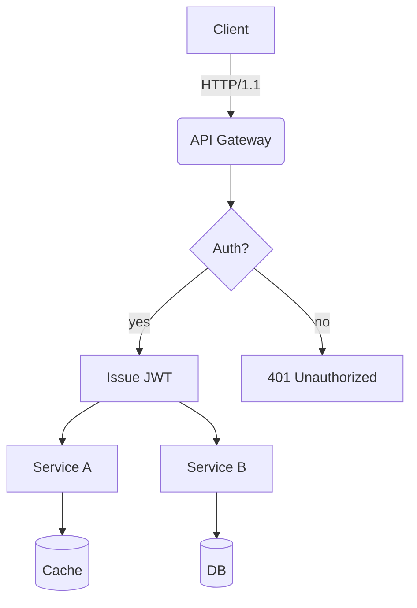
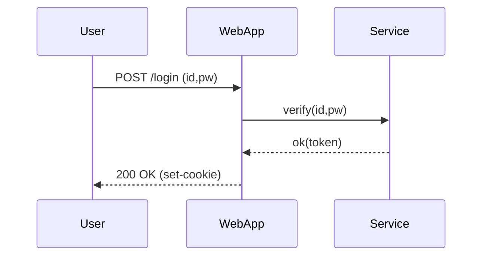
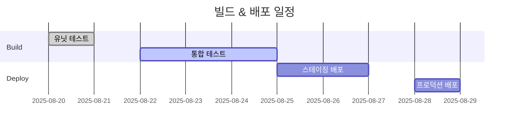
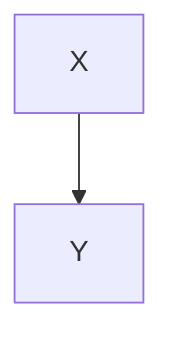

# 번역 테스트용 **리치(Rich) Markdown** 문서

이 문서는 *4096 토큰을 확실히 초과*하도록 설계된 **다양한 포맷**의 한국어 콘텐츠 모음입니다.  
번역기/LLM의 문맥 처리, 형식 보존, 코드/도표 무시 규칙 등 **견고성(robustness)** 테스트를 목적으로 합니다.

> **가이드**
> 1) 코드 블록과 `mermaid` 영역은 그대로 유지되는지 확인하세요.
> 2) 숫자/단위(예: 1.2GB, 3ms), 슬래시 경로(`/var/log/app.log`), 옵션(`--flag`)의 보존성을 확인하세요.
> 3) 표, 목록, 인용문, 체크박스, 수식, 이모지 😀 가 뒤섞여도 레이아웃이 무너지지 않아야 합니다.


## 1. 표(Table)와 기호/단위 혼재

| 항목 | 값 | 단위 | 주석 |
|---|---:|:---:|---|
| 처리량 | 12,345 | RPS | 피크 시 18,900 RPS |
| 지연시간(P50) | 3.2 | ms | `--enable-cache` 적용 |
| 지연시간(P99) | 41.7 | ms | GC 발생 구간 포함 |
| 메모리 | 1.5 | GB | RSS 기준, cgroup 제한 2GB |
| 디스크 I/O | 220 | MB/s | NVMe-oF(TCP) 경유 |


## 2. 체크리스트(Task List)

- [x] 마크다운 헤더 번역 정확도
- [x] 코드 블록 내 키워드 보존 (`for`, `if`, `return` 등)
- [ ] Mermaid 다이어그램 보존 및 주석 무시
- [ ] 단위(GB/ms/%), 경로(`/etc/hosts`) 보존
- [ ] 인라인 수식 $O(n \log n)$ 보존


## 3. 코드 블록: Bash/Python/JSON/YAML

```bash
#!/usr/bin/env bash
set -euo pipefail

APP_ENV="${APP_ENV:-prod}"
INPUT="${1:-/data/input.txt}"
OUT="/var/tmp/result.json"

echo "[INFO] starting job on $(hostname) at $(date -Iseconds)"
if [[ ! -f "$INPUT" ]]; then
  echo "[ERROR] input not found: $INPUT" >&2
  exit 1
fi

lines=$(wc -l < "$INPUT")
echo "[DEBUG] line count: $lines"

curl -sS -X POST "http://127.0.0.1:8080/api" \  -H "Content-Type: application/json" \  -d "{"env":"$APP_ENV","count":$lines}" > "$OUT"

jq -r '.status' "$OUT" | grep -q success && echo "OK" || { echo "FAIL"; exit 2; }
```

```python
from __future__ import annotations

def rolling_avg(xs: list[float], k: int) -> list[float]:
    if k <= 0:
        raise ValueError("k must be > 0")
    out = []
    acc = 0.0
    for i, v in enumerate(xs):
        acc += v
        if i >= k:
            acc -= xs[i-k]
        if i >= k - 1:
            out.append(acc / k)
    return out

print(rolling_avg([1,2,3,4,5,6,7,8,9], 3))
```

```json
{
  "service": "analytics",
  "version": "1.4.2",
  "features": ["rollup", "compaction", "delta-index"],
  "limits": {
    "max_docs": 1000000,
    "max_payload_mb": 256
  }
}
```

```yaml
apiVersion: v1
kind: ConfigMap
metadata:
  name: test-config
data:
  APP_ENV: "staging"
  ENDPOINT: "https://api.example.com"
```


## 4. Mermaid 다이어그램

### 4.1 Flowchart


### 4.2 Sequence


### 4.3 Gantt



## 5. 이미지/링크/인용문


- 문서: <https://example.com/docs/guide>
- API 참조: [API Reference](https://example.com/api)
- 이슈 트래커: https://example.com/issues

> “번역 품질은 레이아웃과 의미의 동시 보존에서 결정된다.” — 익명


## 6. 수식과 텍스트 혼합

- 평균 시간 복잡도: $O(n \log n)$, 최악: $O(n^2)$
- 분산: $\sigma^2 = \frac{1}{n}\sum_{i=1}^{n}(x_i-\mu)^2$
- 샘플 평균: $\bar{x} = \frac{1}{n}\sum x_i$

문단 예시: 이 문단은 번역 중 **굵게**, *기울임*, `코드`가 섞여도 정상적으로 보존되는지 확인하기 위한 샘플입니다.  
이모지 😀, 한자 漢字, 영문 CamelCase, snake_case, kebab-case 모두 포함합니다.


### 7.1 실험 단락 — 변형 패턴
다음 단락은 유사하지만 중복 번역 방지를 위해 매 회차마다 어휘와 순서를 약간씩 바꿉니다.
- 시나리오: 대화 기록 요약
- 조건: 한글 100k자 포함
- 기대결과: 요약률 90% 이상

#### 절차
1. 입력 데이터: `/data/input_01.jsonl`
2. 옵션: `--batch 512 --timeout 3s --enable-cache`
3. 실행: `app run --job test-01 --qos high`
4. 검증: 로그에서 `test-01 finished` 포함 여부 확인

#### 관찰사항
- GC 주기가 길어질수록 P99 지연시간 증가 경향 관측
- 캐시 미스 비율이 10%p 증가할 때 처리량은 ~7% 감소
- 커넥션 풀 사이즈가 32 → 64로 증가 시 초당 재시도율이 1.2% → 0.6%로 감소

---


### 7.2 실험 단락 — 변형 패턴
다음 단락은 유사하지만 중복 번역 방지를 위해 매 회차마다 어휘와 순서를 약간씩 바꿉니다.
- 시나리오: 대화 기록 요약
- 조건: 한글 100k자 포함
- 기대결과: 요약률 90% 이상

#### 절차
1. 입력 데이터: `/data/input_02.jsonl`
2. 옵션: `--batch 512 --timeout 3s --enable-cache`
3. 실행: `app run --job test-02 --qos high`
4. 검증: 로그에서 `test-02 finished` 포함 여부 확인

#### 관찰사항
- GC 주기가 길어질수록 P99 지연시간 증가 경향 관측
- 캐시 미스 비율이 10%p 증가할 때 처리량은 ~7% 감소
- 커넥션 풀 사이즈가 32 → 64로 증가 시 초당 재시도율이 1.2% → 0.6%로 감소

---


### 7.3 실험 단락 — 변형 패턴
다음 단락은 유사하지만 중복 번역 방지를 위해 매 회차마다 어휘와 순서를 약간씩 바꿉니다.
- 시나리오: 쿠버네티스 배포
- 조건: HPA 활성화
- 기대결과: 스케일 범위 2~10 동작

#### 절차
1. 입력 데이터: `/data/input_03.jsonl`
2. 옵션: `--batch 512 --timeout 3s --enable-cache`
3. 실행: `app run --job test-03 --qos high`
4. 검증: 로그에서 `test-03 finished` 포함 여부 확인

#### 관찰사항
- GC 주기가 길어질수록 P99 지연시간 증가 경향 관측
- 캐시 미스 비율이 10%p 증가할 때 처리량은 ~7% 감소
- 커넥션 풀 사이즈가 32 → 64로 증가 시 초당 재시도율이 1.2% → 0.6%로 감소

---


### 7.4 실험 단락 — 변형 패턴
다음 단락은 유사하지만 중복 번역 방지를 위해 매 회차마다 어휘와 순서를 약간씩 바꿉니다.
- 시나리오: 쿠버네티스 배포
- 조건: HPA 활성화
- 기대결과: 스케일 범위 2~10 동작

#### 절차
1. 입력 데이터: `/data/input_04.jsonl`
2. 옵션: `--batch 512 --timeout 3s --enable-cache`
3. 실행: `app run --job test-04 --qos high`
4. 검증: 로그에서 `test-04 finished` 포함 여부 확인

#### 관찰사항
- GC 주기가 길어질수록 P99 지연시간 증가 경향 관측
- 캐시 미스 비율이 10%p 증가할 때 처리량은 ~7% 감소
- 커넥션 풀 사이즈가 32 → 64로 증가 시 초당 재시도율이 1.2% → 0.6%로 감소

---


### 7.5 실험 단락 — 변형 패턴
다음 단락은 유사하지만 중복 번역 방지를 위해 매 회차마다 어휘와 순서를 약간씩 바꿉니다.
- 시나리오: 대화 기록 요약
- 조건: 한글 100k자 포함
- 기대결과: 요약률 90% 이상

#### 절차
1. 입력 데이터: `/data/input_05.jsonl`
2. 옵션: `--batch 512 --timeout 3s --enable-cache`
3. 실행: `app run --job test-05 --qos high`
4. 검증: 로그에서 `test-05 finished` 포함 여부 확인

#### 관찰사항
- GC 주기가 길어질수록 P99 지연시간 증가 경향 관측
- 캐시 미스 비율이 10%p 증가할 때 처리량은 ~7% 감소
- 커넥션 풀 사이즈가 32 → 64로 증가 시 초당 재시도율이 1.2% → 0.6%로 감소

---


### 7.6 실험 단락 — 변형 패턴
다음 단락은 유사하지만 중복 번역 방지를 위해 매 회차마다 어휘와 순서를 약간씩 바꿉니다.
- 시나리오: Mermaid 렌더링
- 조건: 50+ 노드, 100+ 엣지
- 기대결과: 레이아웃 왜곡 없음

#### 절차
1. 입력 데이터: `/data/input_06.jsonl`
2. 옵션: `--batch 512 --timeout 3s --enable-cache`
3. 실행: `app run --job test-06 --qos high`
4. 검증: 로그에서 `test-06 finished` 포함 여부 확인

#### 관찰사항
- GC 주기가 길어질수록 P99 지연시간 증가 경향 관측
- 캐시 미스 비율이 10%p 증가할 때 처리량은 ~7% 감소
- 커넥션 풀 사이즈가 32 → 64로 증가 시 초당 재시도율이 1.2% → 0.6%로 감소

---


### 7.7 실험 단락 — 변형 패턴
다음 단락은 유사하지만 중복 번역 방지를 위해 매 회차마다 어휘와 순서를 약간씩 바꿉니다.
- 시나리오: 대용량 JSON 파싱
- 조건: 64MB payload, 4 workers
- 기대결과: 메모리 스파이크 없이 완료

#### 절차
1. 입력 데이터: `/data/input_07.jsonl`
2. 옵션: `--batch 512 --timeout 3s --enable-cache`
3. 실행: `app run --job test-07 --qos high`
4. 검증: 로그에서 `test-07 finished` 포함 여부 확인

#### 관찰사항
- GC 주기가 길어질수록 P99 지연시간 증가 경향 관측
- 캐시 미스 비율이 10%p 증가할 때 처리량은 ~7% 감소
- 커넥션 풀 사이즈가 32 → 64로 증가 시 초당 재시도율이 1.2% → 0.6%로 감소

---


### 7.8 실험 단락 — 변형 패턴
다음 단락은 유사하지만 중복 번역 방지를 위해 매 회차마다 어휘와 순서를 약간씩 바꿉니다.
- 시나리오: 대용량 JSON 파싱
- 조건: 64MB payload, 4 workers
- 기대결과: 메모리 스파이크 없이 완료

#### 절차
1. 입력 데이터: `/data/input_08.jsonl`
2. 옵션: `--batch 512 --timeout 3s --enable-cache`
3. 실행: `app run --job test-08 --qos high`
4. 검증: 로그에서 `test-08 finished` 포함 여부 확인

#### 관찰사항
- GC 주기가 길어질수록 P99 지연시간 증가 경향 관측
- 캐시 미스 비율이 10%p 증가할 때 처리량은 ~7% 감소
- 커넥션 풀 사이즈가 32 → 64로 증가 시 초당 재시도율이 1.2% → 0.6%로 감소

---


### 7.9 실험 단락 — 변형 패턴
다음 단락은 유사하지만 중복 번역 방지를 위해 매 회차마다 어휘와 순서를 약간씩 바꿉니다.
- 시나리오: 대용량 JSON 파싱
- 조건: 64MB payload, 4 workers
- 기대결과: 메모리 스파이크 없이 완료

#### 절차
1. 입력 데이터: `/data/input_09.jsonl`
2. 옵션: `--batch 512 --timeout 3s --enable-cache`
3. 실행: `app run --job test-09 --qos high`
4. 검증: 로그에서 `test-09 finished` 포함 여부 확인

#### 관찰사항
- GC 주기가 길어질수록 P99 지연시간 증가 경향 관측
- 캐시 미스 비율이 10%p 증가할 때 처리량은 ~7% 감소
- 커넥션 풀 사이즈가 32 → 64로 증가 시 초당 재시도율이 1.2% → 0.6%로 감소

---


### 7.10 실험 단락 — 변형 패턴
다음 단락은 유사하지만 중복 번역 방지를 위해 매 회차마다 어휘와 순서를 약간씩 바꿉니다.
- 시나리오: NVMe-oF I/O 재시도
- 조건: TCP RTT 2ms, loss 0.1%
- 기대결과: 재시도율 1% 이하

#### 절차
1. 입력 데이터: `/data/input_10.jsonl`
2. 옵션: `--batch 512 --timeout 3s --enable-cache`
3. 실행: `app run --job test-10 --qos high`
4. 검증: 로그에서 `test-10 finished` 포함 여부 확인

#### 관찰사항
- GC 주기가 길어질수록 P99 지연시간 증가 경향 관측
- 캐시 미스 비율이 10%p 증가할 때 처리량은 ~7% 감소
- 커넥션 풀 사이즈가 32 → 64로 증가 시 초당 재시도율이 1.2% → 0.6%로 감소

---


### 7.11 실험 단락 — 변형 패턴
다음 단락은 유사하지만 중복 번역 방지를 위해 매 회차마다 어휘와 순서를 약간씩 바꿉니다.
- 시나리오: 대용량 JSON 파싱
- 조건: 64MB payload, 4 workers
- 기대결과: 메모리 스파이크 없이 완료

#### 절차
1. 입력 데이터: `/data/input_11.jsonl`
2. 옵션: `--batch 512 --timeout 3s --enable-cache`
3. 실행: `app run --job test-11 --qos high`
4. 검증: 로그에서 `test-11 finished` 포함 여부 확인

#### 관찰사항
- GC 주기가 길어질수록 P99 지연시간 증가 경향 관측
- 캐시 미스 비율이 10%p 증가할 때 처리량은 ~7% 감소
- 커넥션 풀 사이즈가 32 → 64로 증가 시 초당 재시도율이 1.2% → 0.6%로 감소

---


### 7.12 실험 단락 — 변형 패턴
다음 단락은 유사하지만 중복 번역 방지를 위해 매 회차마다 어휘와 순서를 약간씩 바꿉니다.
- 시나리오: 쿠버네티스 배포
- 조건: HPA 활성화
- 기대결과: 스케일 범위 2~10 동작

#### 절차
1. 입력 데이터: `/data/input_12.jsonl`
2. 옵션: `--batch 512 --timeout 3s --enable-cache`
3. 실행: `app run --job test-12 --qos high`
4. 검증: 로그에서 `test-12 finished` 포함 여부 확인

#### 관찰사항
- GC 주기가 길어질수록 P99 지연시간 증가 경향 관측
- 캐시 미스 비율이 10%p 증가할 때 처리량은 ~7% 감소
- 커넥션 풀 사이즈가 32 → 64로 증가 시 초당 재시도율이 1.2% → 0.6%로 감소

---


### 7.13 실험 단락 — 변형 패턴
다음 단락은 유사하지만 중복 번역 방지를 위해 매 회차마다 어휘와 순서를 약간씩 바꿉니다.
- 시나리오: 대용량 JSON 파싱
- 조건: 64MB payload, 4 workers
- 기대결과: 메모리 스파이크 없이 완료

#### 절차
1. 입력 데이터: `/data/input_13.jsonl`
2. 옵션: `--batch 512 --timeout 3s --enable-cache`
3. 실행: `app run --job test-13 --qos high`
4. 검증: 로그에서 `test-13 finished` 포함 여부 확인

#### 관찰사항
- GC 주기가 길어질수록 P99 지연시간 증가 경향 관측
- 캐시 미스 비율이 10%p 증가할 때 처리량은 ~7% 감소
- 커넥션 풀 사이즈가 32 → 64로 증가 시 초당 재시도율이 1.2% → 0.6%로 감소

---


### 7.14 실험 단락 — 변형 패턴
다음 단락은 유사하지만 중복 번역 방지를 위해 매 회차마다 어휘와 순서를 약간씩 바꿉니다.
- 시나리오: 대용량 JSON 파싱
- 조건: 64MB payload, 4 workers
- 기대결과: 메모리 스파이크 없이 완료

#### 절차
1. 입력 데이터: `/data/input_14.jsonl`
2. 옵션: `--batch 512 --timeout 3s --enable-cache`
3. 실행: `app run --job test-14 --qos high`
4. 검증: 로그에서 `test-14 finished` 포함 여부 확인

#### 관찰사항
- GC 주기가 길어질수록 P99 지연시간 증가 경향 관측
- 캐시 미스 비율이 10%p 증가할 때 처리량은 ~7% 감소
- 커넥션 풀 사이즈가 32 → 64로 증가 시 초당 재시도율이 1.2% → 0.6%로 감소

---


### 7.15 실험 단락 — 변형 패턴
다음 단락은 유사하지만 중복 번역 방지를 위해 매 회차마다 어휘와 순서를 약간씩 바꿉니다.
- 시나리오: NVMe-oF I/O 재시도
- 조건: TCP RTT 2ms, loss 0.1%
- 기대결과: 재시도율 1% 이하

#### 절차
1. 입력 데이터: `/data/input_15.jsonl`
2. 옵션: `--batch 512 --timeout 3s --enable-cache`
3. 실행: `app run --job test-15 --qos high`
4. 검증: 로그에서 `test-15 finished` 포함 여부 확인

#### 관찰사항
- GC 주기가 길어질수록 P99 지연시간 증가 경향 관측
- 캐시 미스 비율이 10%p 증가할 때 처리량은 ~7% 감소
- 커넥션 풀 사이즈가 32 → 64로 증가 시 초당 재시도율이 1.2% → 0.6%로 감소

---


### 7.16 실험 단락 — 변형 패턴
다음 단락은 유사하지만 중복 번역 방지를 위해 매 회차마다 어휘와 순서를 약간씩 바꿉니다.
- 시나리오: Mermaid 렌더링
- 조건: 50+ 노드, 100+ 엣지
- 기대결과: 레이아웃 왜곡 없음

#### 절차
1. 입력 데이터: `/data/input_16.jsonl`
2. 옵션: `--batch 512 --timeout 3s --enable-cache`
3. 실행: `app run --job test-16 --qos high`
4. 검증: 로그에서 `test-16 finished` 포함 여부 확인

#### 관찰사항
- GC 주기가 길어질수록 P99 지연시간 증가 경향 관측
- 캐시 미스 비율이 10%p 증가할 때 처리량은 ~7% 감소
- 커넥션 풀 사이즈가 32 → 64로 증가 시 초당 재시도율이 1.2% → 0.6%로 감소

---


### 7.17 실험 단락 — 변형 패턴
다음 단락은 유사하지만 중복 번역 방지를 위해 매 회차마다 어휘와 순서를 약간씩 바꿉니다.
- 시나리오: 대화 기록 요약
- 조건: 한글 100k자 포함
- 기대결과: 요약률 90% 이상

#### 절차
1. 입력 데이터: `/data/input_17.jsonl`
2. 옵션: `--batch 512 --timeout 3s --enable-cache`
3. 실행: `app run --job test-17 --qos high`
4. 검증: 로그에서 `test-17 finished` 포함 여부 확인

#### 관찰사항
- GC 주기가 길어질수록 P99 지연시간 증가 경향 관측
- 캐시 미스 비율이 10%p 증가할 때 처리량은 ~7% 감소
- 커넥션 풀 사이즈가 32 → 64로 증가 시 초당 재시도율이 1.2% → 0.6%로 감소

---


### 7.18 실험 단락 — 변형 패턴
다음 단락은 유사하지만 중복 번역 방지를 위해 매 회차마다 어휘와 순서를 약간씩 바꿉니다.
- 시나리오: 대용량 JSON 파싱
- 조건: 64MB payload, 4 workers
- 기대결과: 메모리 스파이크 없이 완료

#### 절차
1. 입력 데이터: `/data/input_18.jsonl`
2. 옵션: `--batch 512 --timeout 3s --enable-cache`
3. 실행: `app run --job test-18 --qos high`
4. 검증: 로그에서 `test-18 finished` 포함 여부 확인

#### 관찰사항
- GC 주기가 길어질수록 P99 지연시간 증가 경향 관측
- 캐시 미스 비율이 10%p 증가할 때 처리량은 ~7% 감소
- 커넥션 풀 사이즈가 32 → 64로 증가 시 초당 재시도율이 1.2% → 0.6%로 감소

---


### 7.19 실험 단락 — 변형 패턴
다음 단락은 유사하지만 중복 번역 방지를 위해 매 회차마다 어휘와 순서를 약간씩 바꿉니다.
- 시나리오: 대용량 JSON 파싱
- 조건: 64MB payload, 4 workers
- 기대결과: 메모리 스파이크 없이 완료

#### 절차
1. 입력 데이터: `/data/input_19.jsonl`
2. 옵션: `--batch 512 --timeout 3s --enable-cache`
3. 실행: `app run --job test-19 --qos high`
4. 검증: 로그에서 `test-19 finished` 포함 여부 확인

#### 관찰사항
- GC 주기가 길어질수록 P99 지연시간 증가 경향 관측
- 캐시 미스 비율이 10%p 증가할 때 처리량은 ~7% 감소
- 커넥션 풀 사이즈가 32 → 64로 증가 시 초당 재시도율이 1.2% → 0.6%로 감소

---


### 7.20 실험 단락 — 변형 패턴
다음 단락은 유사하지만 중복 번역 방지를 위해 매 회차마다 어휘와 순서를 약간씩 바꿉니다.
- 시나리오: NVMe-oF I/O 재시도
- 조건: TCP RTT 2ms, loss 0.1%
- 기대결과: 재시도율 1% 이하

#### 절차
1. 입력 데이터: `/data/input_20.jsonl`
2. 옵션: `--batch 512 --timeout 3s --enable-cache`
3. 실행: `app run --job test-20 --qos high`
4. 검증: 로그에서 `test-20 finished` 포함 여부 확인

#### 관찰사항
- GC 주기가 길어질수록 P99 지연시간 증가 경향 관측
- 캐시 미스 비율이 10%p 증가할 때 처리량은 ~7% 감소
- 커넥션 풀 사이즈가 32 → 64로 증가 시 초당 재시도율이 1.2% → 0.6%로 감소

---


### 7.21 실험 단락 — 변형 패턴
다음 단락은 유사하지만 중복 번역 방지를 위해 매 회차마다 어휘와 순서를 약간씩 바꿉니다.
- 시나리오: 쿠버네티스 배포
- 조건: HPA 활성화
- 기대결과: 스케일 범위 2~10 동작

#### 절차
1. 입력 데이터: `/data/input_21.jsonl`
2. 옵션: `--batch 512 --timeout 3s --enable-cache`
3. 실행: `app run --job test-21 --qos high`
4. 검증: 로그에서 `test-21 finished` 포함 여부 확인

#### 관찰사항
- GC 주기가 길어질수록 P99 지연시간 증가 경향 관측
- 캐시 미스 비율이 10%p 증가할 때 처리량은 ~7% 감소
- 커넥션 풀 사이즈가 32 → 64로 증가 시 초당 재시도율이 1.2% → 0.6%로 감소

---


### 7.22 실험 단락 — 변형 패턴
다음 단락은 유사하지만 중복 번역 방지를 위해 매 회차마다 어휘와 순서를 약간씩 바꿉니다.
- 시나리오: Mermaid 렌더링
- 조건: 50+ 노드, 100+ 엣지
- 기대결과: 레이아웃 왜곡 없음

#### 절차
1. 입력 데이터: `/data/input_22.jsonl`
2. 옵션: `--batch 512 --timeout 3s --enable-cache`
3. 실행: `app run --job test-22 --qos high`
4. 검증: 로그에서 `test-22 finished` 포함 여부 확인

#### 관찰사항
- GC 주기가 길어질수록 P99 지연시간 증가 경향 관측
- 캐시 미스 비율이 10%p 증가할 때 처리량은 ~7% 감소
- 커넥션 풀 사이즈가 32 → 64로 증가 시 초당 재시도율이 1.2% → 0.6%로 감소

---


### 7.23 실험 단락 — 변형 패턴
다음 단락은 유사하지만 중복 번역 방지를 위해 매 회차마다 어휘와 순서를 약간씩 바꿉니다.
- 시나리오: 대용량 JSON 파싱
- 조건: 64MB payload, 4 workers
- 기대결과: 메모리 스파이크 없이 완료

#### 절차
1. 입력 데이터: `/data/input_23.jsonl`
2. 옵션: `--batch 512 --timeout 3s --enable-cache`
3. 실행: `app run --job test-23 --qos high`
4. 검증: 로그에서 `test-23 finished` 포함 여부 확인

#### 관찰사항
- GC 주기가 길어질수록 P99 지연시간 증가 경향 관측
- 캐시 미스 비율이 10%p 증가할 때 처리량은 ~7% 감소
- 커넥션 풀 사이즈가 32 → 64로 증가 시 초당 재시도율이 1.2% → 0.6%로 감소

---


### 7.24 실험 단락 — 변형 패턴
다음 단락은 유사하지만 중복 번역 방지를 위해 매 회차마다 어휘와 순서를 약간씩 바꿉니다.
- 시나리오: Mermaid 렌더링
- 조건: 50+ 노드, 100+ 엣지
- 기대결과: 레이아웃 왜곡 없음

#### 절차
1. 입력 데이터: `/data/input_24.jsonl`
2. 옵션: `--batch 512 --timeout 3s --enable-cache`
3. 실행: `app run --job test-24 --qos high`
4. 검증: 로그에서 `test-24 finished` 포함 여부 확인

#### 관찰사항
- GC 주기가 길어질수록 P99 지연시간 증가 경향 관측
- 캐시 미스 비율이 10%p 증가할 때 처리량은 ~7% 감소
- 커넥션 풀 사이즈가 32 → 64로 증가 시 초당 재시도율이 1.2% → 0.6%로 감소

---


### 7.25 실험 단락 — 변형 패턴
다음 단락은 유사하지만 중복 번역 방지를 위해 매 회차마다 어휘와 순서를 약간씩 바꿉니다.
- 시나리오: 쿠버네티스 배포
- 조건: HPA 활성화
- 기대결과: 스케일 범위 2~10 동작

#### 절차
1. 입력 데이터: `/data/input_25.jsonl`
2. 옵션: `--batch 512 --timeout 3s --enable-cache`
3. 실행: `app run --job test-25 --qos high`
4. 검증: 로그에서 `test-25 finished` 포함 여부 확인

#### 관찰사항
- GC 주기가 길어질수록 P99 지연시간 증가 경향 관측
- 캐시 미스 비율이 10%p 증가할 때 처리량은 ~7% 감소
- 커넥션 풀 사이즈가 32 → 64로 증가 시 초당 재시도율이 1.2% → 0.6%로 감소

---


### 7.26 실험 단락 — 변형 패턴
다음 단락은 유사하지만 중복 번역 방지를 위해 매 회차마다 어휘와 순서를 약간씩 바꿉니다.
- 시나리오: NVMe-oF I/O 재시도
- 조건: TCP RTT 2ms, loss 0.1%
- 기대결과: 재시도율 1% 이하

#### 절차
1. 입력 데이터: `/data/input_26.jsonl`
2. 옵션: `--batch 512 --timeout 3s --enable-cache`
3. 실행: `app run --job test-26 --qos high`
4. 검증: 로그에서 `test-26 finished` 포함 여부 확인

#### 관찰사항
- GC 주기가 길어질수록 P99 지연시간 증가 경향 관측
- 캐시 미스 비율이 10%p 증가할 때 처리량은 ~7% 감소
- 커넥션 풀 사이즈가 32 → 64로 증가 시 초당 재시도율이 1.2% → 0.6%로 감소

---


### 7.27 실험 단락 — 변형 패턴
다음 단락은 유사하지만 중복 번역 방지를 위해 매 회차마다 어휘와 순서를 약간씩 바꿉니다.
- 시나리오: 대화 기록 요약
- 조건: 한글 100k자 포함
- 기대결과: 요약률 90% 이상

#### 절차
1. 입력 데이터: `/data/input_27.jsonl`
2. 옵션: `--batch 512 --timeout 3s --enable-cache`
3. 실행: `app run --job test-27 --qos high`
4. 검증: 로그에서 `test-27 finished` 포함 여부 확인

#### 관찰사항
- GC 주기가 길어질수록 P99 지연시간 증가 경향 관측
- 캐시 미스 비율이 10%p 증가할 때 처리량은 ~7% 감소
- 커넥션 풀 사이즈가 32 → 64로 증가 시 초당 재시도율이 1.2% → 0.6%로 감소

---


### 7.28 실험 단락 — 변형 패턴
다음 단락은 유사하지만 중복 번역 방지를 위해 매 회차마다 어휘와 순서를 약간씩 바꿉니다.
- 시나리오: 대화 기록 요약
- 조건: 한글 100k자 포함
- 기대결과: 요약률 90% 이상

#### 절차
1. 입력 데이터: `/data/input_28.jsonl`
2. 옵션: `--batch 512 --timeout 3s --enable-cache`
3. 실행: `app run --job test-28 --qos high`
4. 검증: 로그에서 `test-28 finished` 포함 여부 확인

#### 관찰사항
- GC 주기가 길어질수록 P99 지연시간 증가 경향 관측
- 캐시 미스 비율이 10%p 증가할 때 처리량은 ~7% 감소
- 커넥션 풀 사이즈가 32 → 64로 증가 시 초당 재시도율이 1.2% → 0.6%로 감소

---


### 7.29 실험 단락 — 변형 패턴
다음 단락은 유사하지만 중복 번역 방지를 위해 매 회차마다 어휘와 순서를 약간씩 바꿉니다.
- 시나리오: 대용량 JSON 파싱
- 조건: 64MB payload, 4 workers
- 기대결과: 메모리 스파이크 없이 완료

#### 절차
1. 입력 데이터: `/data/input_29.jsonl`
2. 옵션: `--batch 512 --timeout 3s --enable-cache`
3. 실행: `app run --job test-29 --qos high`
4. 검증: 로그에서 `test-29 finished` 포함 여부 확인

#### 관찰사항
- GC 주기가 길어질수록 P99 지연시간 증가 경향 관측
- 캐시 미스 비율이 10%p 증가할 때 처리량은 ~7% 감소
- 커넥션 풀 사이즈가 32 → 64로 증가 시 초당 재시도율이 1.2% → 0.6%로 감소

---


### 7.30 실험 단락 — 변형 패턴
다음 단락은 유사하지만 중복 번역 방지를 위해 매 회차마다 어휘와 순서를 약간씩 바꿉니다.
- 시나리오: 대화 기록 요약
- 조건: 한글 100k자 포함
- 기대결과: 요약률 90% 이상

#### 절차
1. 입력 데이터: `/data/input_30.jsonl`
2. 옵션: `--batch 512 --timeout 3s --enable-cache`
3. 실행: `app run --job test-30 --qos high`
4. 검증: 로그에서 `test-30 finished` 포함 여부 확인

#### 관찰사항
- GC 주기가 길어질수록 P99 지연시간 증가 경향 관측
- 캐시 미스 비율이 10%p 증가할 때 처리량은 ~7% 감소
- 커넥션 풀 사이즈가 32 → 64로 증가 시 초당 재시도율이 1.2% → 0.6%로 감소

---


### 7.31 실험 단락 — 변형 패턴
다음 단락은 유사하지만 중복 번역 방지를 위해 매 회차마다 어휘와 순서를 약간씩 바꿉니다.
- 시나리오: 쿠버네티스 배포
- 조건: HPA 활성화
- 기대결과: 스케일 범위 2~10 동작

#### 절차
1. 입력 데이터: `/data/input_31.jsonl`
2. 옵션: `--batch 512 --timeout 3s --enable-cache`
3. 실행: `app run --job test-31 --qos high`
4. 검증: 로그에서 `test-31 finished` 포함 여부 확인

#### 관찰사항
- GC 주기가 길어질수록 P99 지연시간 증가 경향 관측
- 캐시 미스 비율이 10%p 증가할 때 처리량은 ~7% 감소
- 커넥션 풀 사이즈가 32 → 64로 증가 시 초당 재시도율이 1.2% → 0.6%로 감소

---


### 7.32 실험 단락 — 변형 패턴
다음 단락은 유사하지만 중복 번역 방지를 위해 매 회차마다 어휘와 순서를 약간씩 바꿉니다.
- 시나리오: Mermaid 렌더링
- 조건: 50+ 노드, 100+ 엣지
- 기대결과: 레이아웃 왜곡 없음

#### 절차
1. 입력 데이터: `/data/input_32.jsonl`
2. 옵션: `--batch 512 --timeout 3s --enable-cache`
3. 실행: `app run --job test-32 --qos high`
4. 검증: 로그에서 `test-32 finished` 포함 여부 확인

#### 관찰사항
- GC 주기가 길어질수록 P99 지연시간 증가 경향 관측
- 캐시 미스 비율이 10%p 증가할 때 처리량은 ~7% 감소
- 커넥션 풀 사이즈가 32 → 64로 증가 시 초당 재시도율이 1.2% → 0.6%로 감소

---


### 7.33 실험 단락 — 변형 패턴
다음 단락은 유사하지만 중복 번역 방지를 위해 매 회차마다 어휘와 순서를 약간씩 바꿉니다.
- 시나리오: 대용량 JSON 파싱
- 조건: 64MB payload, 4 workers
- 기대결과: 메모리 스파이크 없이 완료

#### 절차
1. 입력 데이터: `/data/input_33.jsonl`
2. 옵션: `--batch 512 --timeout 3s --enable-cache`
3. 실행: `app run --job test-33 --qos high`
4. 검증: 로그에서 `test-33 finished` 포함 여부 확인

#### 관찰사항
- GC 주기가 길어질수록 P99 지연시간 증가 경향 관측
- 캐시 미스 비율이 10%p 증가할 때 처리량은 ~7% 감소
- 커넥션 풀 사이즈가 32 → 64로 증가 시 초당 재시도율이 1.2% → 0.6%로 감소

---


### 7.34 실험 단락 — 변형 패턴
다음 단락은 유사하지만 중복 번역 방지를 위해 매 회차마다 어휘와 순서를 약간씩 바꿉니다.
- 시나리오: 쿠버네티스 배포
- 조건: HPA 활성화
- 기대결과: 스케일 범위 2~10 동작

#### 절차
1. 입력 데이터: `/data/input_34.jsonl`
2. 옵션: `--batch 512 --timeout 3s --enable-cache`
3. 실행: `app run --job test-34 --qos high`
4. 검증: 로그에서 `test-34 finished` 포함 여부 확인

#### 관찰사항
- GC 주기가 길어질수록 P99 지연시간 증가 경향 관측
- 캐시 미스 비율이 10%p 증가할 때 처리량은 ~7% 감소
- 커넥션 풀 사이즈가 32 → 64로 증가 시 초당 재시도율이 1.2% → 0.6%로 감소

---


### 7.35 실험 단락 — 변형 패턴
다음 단락은 유사하지만 중복 번역 방지를 위해 매 회차마다 어휘와 순서를 약간씩 바꿉니다.
- 시나리오: Mermaid 렌더링
- 조건: 50+ 노드, 100+ 엣지
- 기대결과: 레이아웃 왜곡 없음

#### 절차
1. 입력 데이터: `/data/input_35.jsonl`
2. 옵션: `--batch 512 --timeout 3s --enable-cache`
3. 실행: `app run --job test-35 --qos high`
4. 검증: 로그에서 `test-35 finished` 포함 여부 확인

#### 관찰사항
- GC 주기가 길어질수록 P99 지연시간 증가 경향 관측
- 캐시 미스 비율이 10%p 증가할 때 처리량은 ~7% 감소
- 커넥션 풀 사이즈가 32 → 64로 증가 시 초당 재시도율이 1.2% → 0.6%로 감소

---


### 7.36 실험 단락 — 변형 패턴
다음 단락은 유사하지만 중복 번역 방지를 위해 매 회차마다 어휘와 순서를 약간씩 바꿉니다.
- 시나리오: NVMe-oF I/O 재시도
- 조건: TCP RTT 2ms, loss 0.1%
- 기대결과: 재시도율 1% 이하

#### 절차
1. 입력 데이터: `/data/input_36.jsonl`
2. 옵션: `--batch 512 --timeout 3s --enable-cache`
3. 실행: `app run --job test-36 --qos high`
4. 검증: 로그에서 `test-36 finished` 포함 여부 확인

#### 관찰사항
- GC 주기가 길어질수록 P99 지연시간 증가 경향 관측
- 캐시 미스 비율이 10%p 증가할 때 처리량은 ~7% 감소
- 커넥션 풀 사이즈가 32 → 64로 증가 시 초당 재시도율이 1.2% → 0.6%로 감소

---


### 7.37 실험 단락 — 변형 패턴
다음 단락은 유사하지만 중복 번역 방지를 위해 매 회차마다 어휘와 순서를 약간씩 바꿉니다.
- 시나리오: 대용량 JSON 파싱
- 조건: 64MB payload, 4 workers
- 기대결과: 메모리 스파이크 없이 완료

#### 절차
1. 입력 데이터: `/data/input_37.jsonl`
2. 옵션: `--batch 512 --timeout 3s --enable-cache`
3. 실행: `app run --job test-37 --qos high`
4. 검증: 로그에서 `test-37 finished` 포함 여부 확인

#### 관찰사항
- GC 주기가 길어질수록 P99 지연시간 증가 경향 관측
- 캐시 미스 비율이 10%p 증가할 때 처리량은 ~7% 감소
- 커넥션 풀 사이즈가 32 → 64로 증가 시 초당 재시도율이 1.2% → 0.6%로 감소

---


### 7.38 실험 단락 — 변형 패턴
다음 단락은 유사하지만 중복 번역 방지를 위해 매 회차마다 어휘와 순서를 약간씩 바꿉니다.
- 시나리오: Mermaid 렌더링
- 조건: 50+ 노드, 100+ 엣지
- 기대결과: 레이아웃 왜곡 없음

#### 절차
1. 입력 데이터: `/data/input_38.jsonl`
2. 옵션: `--batch 512 --timeout 3s --enable-cache`
3. 실행: `app run --job test-38 --qos high`
4. 검증: 로그에서 `test-38 finished` 포함 여부 확인

#### 관찰사항
- GC 주기가 길어질수록 P99 지연시간 증가 경향 관측
- 캐시 미스 비율이 10%p 증가할 때 처리량은 ~7% 감소
- 커넥션 풀 사이즈가 32 → 64로 증가 시 초당 재시도율이 1.2% → 0.6%로 감소

---


### 7.39 실험 단락 — 변형 패턴
다음 단락은 유사하지만 중복 번역 방지를 위해 매 회차마다 어휘와 순서를 약간씩 바꿉니다.
- 시나리오: Mermaid 렌더링
- 조건: 50+ 노드, 100+ 엣지
- 기대결과: 레이아웃 왜곡 없음

#### 절차
1. 입력 데이터: `/data/input_39.jsonl`
2. 옵션: `--batch 512 --timeout 3s --enable-cache`
3. 실행: `app run --job test-39 --qos high`
4. 검증: 로그에서 `test-39 finished` 포함 여부 확인

#### 관찰사항
- GC 주기가 길어질수록 P99 지연시간 증가 경향 관측
- 캐시 미스 비율이 10%p 증가할 때 처리량은 ~7% 감소
- 커넥션 풀 사이즈가 32 → 64로 증가 시 초당 재시도율이 1.2% → 0.6%로 감소

---


### 7.40 실험 단락 — 변형 패턴
다음 단락은 유사하지만 중복 번역 방지를 위해 매 회차마다 어휘와 순서를 약간씩 바꿉니다.
- 시나리오: 대화 기록 요약
- 조건: 한글 100k자 포함
- 기대결과: 요약률 90% 이상

#### 절차
1. 입력 데이터: `/data/input_40.jsonl`
2. 옵션: `--batch 512 --timeout 3s --enable-cache`
3. 실행: `app run --job test-40 --qos high`
4. 검증: 로그에서 `test-40 finished` 포함 여부 확인

#### 관찰사항
- GC 주기가 길어질수록 P99 지연시간 증가 경향 관측
- 캐시 미스 비율이 10%p 증가할 때 처리량은 ~7% 감소
- 커넥션 풀 사이즈가 32 → 64로 증가 시 초당 재시도율이 1.2% → 0.6%로 감소

---


## 8. 장문 목록

- 2. 에러 처리 일관성 — 케이스 #001
- 3. 성능 프로파일링 — 케이스 #002
- 4. 접근성(a11y) — 케이스 #003
- 5. 로그 스키마 안정성 — 케이스 #004
- 6. 캐시 무효화 시나리오 — 케이스 #005
- 7. 성능 프로파일링 — 케이스 #006
- 8. 성능 프로파일링 — 케이스 #007
- 9. API 역호환성 — 케이스 #008
- 10. 로그 스키마 안정성 — 케이스 #009
- 11. 접근성(a11y) — 케이스 #010
- 12. 캐시 무효화 시나리오 — 케이스 #011
- 13. 성능 프로파일링 — 케이스 #012
- 14. 보안 헤더 적용 — 케이스 #013
- 15. 국제화(i18n) — 케이스 #014
- 16. 리소스 누수 점검 — 케이스 #015
- 17. 에러 처리 일관성 — 케이스 #016
- 18. 에러 처리 일관성 — 케이스 #017
- 19. 국제화(i18n) — 케이스 #018
- 20. CORS 정책 검증 — 케이스 #019
- 21. 성능 프로파일링 — 케이스 #020
- 22. 보안 헤더 적용 — 케이스 #021
- 23. 로그 스키마 안정성 — 케이스 #022
- 24. 성능 프로파일링 — 케이스 #023
- 25. 캐시 무효화 시나리오 — 케이스 #024
- 26. CORS 정책 검증 — 케이스 #025
- 27. 성능 프로파일링 — 케이스 #026
- 28. 접근성(a11y) — 케이스 #027
- 29. 접근성(a11y) — 케이스 #028
- 30. API 역호환성 — 케이스 #029
- 31. 캐시 무효화 시나리오 — 케이스 #030
- 32. 캐시 무효화 시나리오 — 케이스 #031
- 33. 성능 프로파일링 — 케이스 #032
- 34. 리소스 누수 점검 — 케이스 #033
- 35. 로그 스키마 안정성 — 케이스 #034
- 36. CORS 정책 검증 — 케이스 #035
- 37. 에러 처리 일관성 — 케이스 #036
- 38. 리소스 누수 점검 — 케이스 #037
- 39. 에러 처리 일관성 — 케이스 #038
- 40. 국제화(i18n) — 케이스 #039
- 41. API 역호환성 — 케이스 #040
- 42. 캐시 무효화 시나리오 — 케이스 #041
- 43. 캐시 무효화 시나리오 — 케이스 #042
- 44. 캐시 무효화 시나리오 — 케이스 #043
- 45. 성능 프로파일링 — 케이스 #044
- 46. 성능 프로파일링 — 케이스 #045
- 47. CORS 정책 검증 — 케이스 #046
- 48. 리소스 누수 점검 — 케이스 #047
- 49. 캐시 무효화 시나리오 — 케이스 #048
- 50. 에러 처리 일관성 — 케이스 #049
- 51. 로그 스키마 안정성 — 케이스 #050
- 52. 리소스 누수 점검 — 케이스 #051
- 53. 국제화(i18n) — 케이스 #052
- 54. 로그 스키마 안정성 — 케이스 #053
- 55. 리소스 누수 점검 — 케이스 #054
- 56. 보안 헤더 적용 — 케이스 #055
- 57. 국제화(i18n) — 케이스 #056
- 58. API 역호환성 — 케이스 #057
- 59. 접근성(a11y) — 케이스 #058
- 60. API 역호환성 — 케이스 #059
- 61. 성능 프로파일링 — 케이스 #060
- 62. 접근성(a11y) — 케이스 #061
- 63. API 역호환성 — 케이스 #062
- 64. 국제화(i18n) — 케이스 #063
- 65. 보안 헤더 적용 — 케이스 #064
- 66. 에러 처리 일관성 — 케이스 #065
- 67. 성능 프로파일링 — 케이스 #066
- 68. 접근성(a11y) — 케이스 #067
- 69. 에러 처리 일관성 — 케이스 #068
- 70. 성능 프로파일링 — 케이스 #069
- 71. 리소스 누수 점검 — 케이스 #070
- 72. 접근성(a11y) — 케이스 #071
- 73. 국제화(i18n) — 케이스 #072
- 74. 에러 처리 일관성 — 케이스 #073
- 75. 국제화(i18n) — 케이스 #074
- 76. 성능 프로파일링 — 케이스 #075
- 77. 보안 헤더 적용 — 케이스 #076
- 78. CORS 정책 검증 — 케이스 #077
- 79. 리소스 누수 점검 — 케이스 #078
- 80. 리소스 누수 점검 — 케이스 #079
- 81. 성능 프로파일링 — 케이스 #080
- 82. 접근성(a11y) — 케이스 #081
- 83. 접근성(a11y) — 케이스 #082
- 84. 성능 프로파일링 — 케이스 #083
- 85. 리소스 누수 점검 — 케이스 #084
- 86. 접근성(a11y) — 케이스 #085
- 87. 캐시 무효화 시나리오 — 케이스 #086
- 88. CORS 정책 검증 — 케이스 #087
- 89. 로그 스키마 안정성 — 케이스 #088
- 90. CORS 정책 검증 — 케이스 #089
- 91. 보안 헤더 적용 — 케이스 #090
- 92. API 역호환성 — 케이스 #091
- 93. 접근성(a11y) — 케이스 #092
- 94. 성능 프로파일링 — 케이스 #093
- 95. 성능 프로파일링 — 케이스 #094
- 96. 로그 스키마 안정성 — 케이스 #095
- 97. 국제화(i18n) — 케이스 #096
- 98. API 역호환성 — 케이스 #097
- 99. 에러 처리 일관성 — 케이스 #098
- 100. 캐시 무효화 시나리오 — 케이스 #099
- 101. 접근성(a11y) — 케이스 #100
- 102. 접근성(a11y) — 케이스 #101
- 103. 국제화(i18n) — 케이스 #102
- 104. 접근성(a11y) — 케이스 #103
- 105. API 역호환성 — 케이스 #104
- 106. 접근성(a11y) — 케이스 #105
- 107. 성능 프로파일링 — 케이스 #106
- 108. 보안 헤더 적용 — 케이스 #107
- 109. API 역호환성 — 케이스 #108
- 110. 보안 헤더 적용 — 케이스 #109
- 111. 에러 처리 일관성 — 케이스 #110
- 112. 성능 프로파일링 — 케이스 #111
- 113. 리소스 누수 점검 — 케이스 #112
- 114. CORS 정책 검증 — 케이스 #113
- 115. 접근성(a11y) — 케이스 #114
- 116. 에러 처리 일관성 — 케이스 #115
- 117. 에러 처리 일관성 — 케이스 #116
- 118. 성능 프로파일링 — 케이스 #117
- 119. CORS 정책 검증 — 케이스 #118
- 120. 리소스 누수 점검 — 케이스 #119
- 121. 캐시 무효화 시나리오 — 케이스 #120
- 122. CORS 정책 검증 — 케이스 #121
- 123. 성능 프로파일링 — 케이스 #122
- 124. 에러 처리 일관성 — 케이스 #123
- 125. 성능 프로파일링 — 케이스 #124
- 126. 성능 프로파일링 — 케이스 #125
- 127. 접근성(a11y) — 케이스 #126
- 128. 접근성(a11y) — 케이스 #127
- 129. 에러 처리 일관성 — 케이스 #128
- 130. 에러 처리 일관성 — 케이스 #129
- 131. API 역호환성 — 케이스 #130
- 132. 접근성(a11y) — 케이스 #131
- 133. API 역호환성 — 케이스 #132
- 134. 캐시 무효화 시나리오 — 케이스 #133
- 135. 보안 헤더 적용 — 케이스 #134
- 136. 국제화(i18n) — 케이스 #135
- 137. 보안 헤더 적용 — 케이스 #136
- 138. 성능 프로파일링 — 케이스 #137
- 139. 성능 프로파일링 — 케이스 #138
- 140. CORS 정책 검증 — 케이스 #139
- 141. 국제화(i18n) — 케이스 #140
- 142. 로그 스키마 안정성 — 케이스 #141
- 143. CORS 정책 검증 — 케이스 #142
- 144. 접근성(a11y) — 케이스 #143
- 145. 보안 헤더 적용 — 케이스 #144
- 146. 로그 스키마 안정성 — 케이스 #145
- 147. 성능 프로파일링 — 케이스 #146
- 148. 성능 프로파일링 — 케이스 #147
- 149. API 역호환성 — 케이스 #148
- 150. 리소스 누수 점검 — 케이스 #149
- 151. 성능 프로파일링 — 케이스 #150
- 152. 리소스 누수 점검 — 케이스 #151
- 153. 접근성(a11y) — 케이스 #152
- 154. API 역호환성 — 케이스 #153
- 155. 접근성(a11y) — 케이스 #154
- 156. 보안 헤더 적용 — 케이스 #155
- 157. 접근성(a11y) — 케이스 #156
- 158. 성능 프로파일링 — 케이스 #157
- 159. 캐시 무효화 시나리오 — 케이스 #158
- 160. 보안 헤더 적용 — 케이스 #159
- 161. 에러 처리 일관성 — 케이스 #160
- 162. 로그 스키마 안정성 — 케이스 #161
- 163. 성능 프로파일링 — 케이스 #162
- 164. 접근성(a11y) — 케이스 #163
- 165. 에러 처리 일관성 — 케이스 #164
- 166. 리소스 누수 점검 — 케이스 #165
- 167. 로그 스키마 안정성 — 케이스 #166
- 168. 국제화(i18n) — 케이스 #167
- 169. 캐시 무효화 시나리오 — 케이스 #168
- 170. 국제화(i18n) — 케이스 #169
- 171. 캐시 무효화 시나리오 — 케이스 #170
- 172. 리소스 누수 점검 — 케이스 #171
- 173. 보안 헤더 적용 — 케이스 #172
- 174. 리소스 누수 점검 — 케이스 #173
- 175. 에러 처리 일관성 — 케이스 #174
- 176. 리소스 누수 점검 — 케이스 #175
- 177. 로그 스키마 안정성 — 케이스 #176
- 178. CORS 정책 검증 — 케이스 #177
- 179. 보안 헤더 적용 — 케이스 #178
- 180. 로그 스키마 안정성 — 케이스 #179
- 181. 성능 프로파일링 — 케이스 #180
- 182. 리소스 누수 점검 — 케이스 #181
- 183. 국제화(i18n) — 케이스 #182
- 184. 로그 스키마 안정성 — 케이스 #183
- 185. 접근성(a11y) — 케이스 #184
- 186. 보안 헤더 적용 — 케이스 #185
- 187. 리소스 누수 점검 — 케이스 #186
- 188. 리소스 누수 점검 — 케이스 #187
- 189. 접근성(a11y) — 케이스 #188
- 190. 캐시 무효화 시나리오 — 케이스 #189
- 191. 접근성(a11y) — 케이스 #190
- 192. 캐시 무효화 시나리오 — 케이스 #191
- 193. 에러 처리 일관성 — 케이스 #192
- 194. 에러 처리 일관성 — 케이스 #193
- 195. 리소스 누수 점검 — 케이스 #194
- 196. 에러 처리 일관성 — 케이스 #195
- 197. CORS 정책 검증 — 케이스 #196
- 198. 성능 프로파일링 — 케이스 #197
- 199. 리소스 누수 점검 — 케이스 #198
- 200. 접근성(a11y) — 케이스 #199
- 201. 리소스 누수 점검 — 케이스 #200
- 202. 캐시 무효화 시나리오 — 케이스 #201
- 203. 국제화(i18n) — 케이스 #202
- 204. 로그 스키마 안정성 — 케이스 #203
- 205. 에러 처리 일관성 — 케이스 #204
- 206. 리소스 누수 점검 — 케이스 #205
- 207. 보안 헤더 적용 — 케이스 #206
- 208. 리소스 누수 점검 — 케이스 #207
- 209. 캐시 무효화 시나리오 — 케이스 #208
- 210. 성능 프로파일링 — 케이스 #209
- 211. 보안 헤더 적용 — 케이스 #210
- 212. 국제화(i18n) — 케이스 #211
- 213. 로그 스키마 안정성 — 케이스 #212
- 214. 에러 처리 일관성 — 케이스 #213
- 215. 캐시 무효화 시나리오 — 케이스 #214
- 216. 보안 헤더 적용 — 케이스 #215
- 217. 국제화(i18n) — 케이스 #216
- 218. 보안 헤더 적용 — 케이스 #217
- 219. 성능 프로파일링 — 케이스 #218
- 220. 에러 처리 일관성 — 케이스 #219
- 221. 보안 헤더 적용 — 케이스 #220
- 222. 성능 프로파일링 — 케이스 #221
- 223. API 역호환성 — 케이스 #222
- 224. 리소스 누수 점검 — 케이스 #223
- 225. 국제화(i18n) — 케이스 #224
- 226. 보안 헤더 적용 — 케이스 #225
- 227. 국제화(i18n) — 케이스 #226
- 228. 성능 프로파일링 — 케이스 #227
- 229. 로그 스키마 안정성 — 케이스 #228
- 230. CORS 정책 검증 — 케이스 #229
- 231. 성능 프로파일링 — 케이스 #230
- 232. API 역호환성 — 케이스 #231
- 233. CORS 정책 검증 — 케이스 #232
- 234. 국제화(i18n) — 케이스 #233
- 235. 에러 처리 일관성 — 케이스 #234
- 236. 성능 프로파일링 — 케이스 #235
- 237. 에러 처리 일관성 — 케이스 #236
- 238. 성능 프로파일링 — 케이스 #237
- 239. 보안 헤더 적용 — 케이스 #238
- 240. 에러 처리 일관성 — 케이스 #239
- 241. CORS 정책 검증 — 케이스 #240
- 242. API 역호환성 — 케이스 #241
- 243. 성능 프로파일링 — 케이스 #242
- 244. 캐시 무효화 시나리오 — 케이스 #243
- 245. 성능 프로파일링 — 케이스 #244
- 246. 보안 헤더 적용 — 케이스 #245
- 247. 에러 처리 일관성 — 케이스 #246
- 248. 국제화(i18n) — 케이스 #247
- 249. 로그 스키마 안정성 — 케이스 #248
- 250. 보안 헤더 적용 — 케이스 #249
- 251. 접근성(a11y) — 케이스 #250
- 252. 접근성(a11y) — 케이스 #251
- 253. 국제화(i18n) — 케이스 #252
- 254. 국제화(i18n) — 케이스 #253
- 255. CORS 정책 검증 — 케이스 #254
- 256. 로그 스키마 안정성 — 케이스 #255
- 257. CORS 정책 검증 — 케이스 #256
- 258. 보안 헤더 적용 — 케이스 #257
- 259. 캐시 무효화 시나리오 — 케이스 #258
- 260. 에러 처리 일관성 — 케이스 #259
- 261. 접근성(a11y) — 케이스 #260
- 262. 리소스 누수 점검 — 케이스 #261
- 263. 리소스 누수 점검 — 케이스 #262
- 264. 성능 프로파일링 — 케이스 #263
- 265. 접근성(a11y) — 케이스 #264
- 266. 캐시 무효화 시나리오 — 케이스 #265
- 267. 보안 헤더 적용 — 케이스 #266
- 268. 리소스 누수 점검 — 케이스 #267
- 269. 보안 헤더 적용 — 케이스 #268
- 270. 성능 프로파일링 — 케이스 #269
- 271. 에러 처리 일관성 — 케이스 #270
- 272. 국제화(i18n) — 케이스 #271
- 273. API 역호환성 — 케이스 #272
- 274. 에러 처리 일관성 — 케이스 #273
- 275. 접근성(a11y) — 케이스 #274
- 276. API 역호환성 — 케이스 #275
- 277. 국제화(i18n) — 케이스 #276
- 278. CORS 정책 검증 — 케이스 #277
- 279. 보안 헤더 적용 — 케이스 #278
- 280. 캐시 무효화 시나리오 — 케이스 #279
- 281. 로그 스키마 안정성 — 케이스 #280
- 282. 리소스 누수 점검 — 케이스 #281
- 283. 리소스 누수 점검 — 케이스 #282
- 284. 접근성(a11y) — 케이스 #283
- 285. 접근성(a11y) — 케이스 #284
- 286. 에러 처리 일관성 — 케이스 #285
- 287. API 역호환성 — 케이스 #286
- 288. 캐시 무효화 시나리오 — 케이스 #287
- 289. 접근성(a11y) — 케이스 #288
- 290. 접근성(a11y) — 케이스 #289
- 291. 보안 헤더 적용 — 케이스 #290
- 292. 국제화(i18n) — 케이스 #291
- 293. 보안 헤더 적용 — 케이스 #292
- 294. CORS 정책 검증 — 케이스 #293
- 295. 리소스 누수 점검 — 케이스 #294
- 296. 보안 헤더 적용 — 케이스 #295
- 297. CORS 정책 검증 — 케이스 #296
- 298. 로그 스키마 안정성 — 케이스 #297
- 299. 캐시 무효화 시나리오 — 케이스 #298
- 300. API 역호환성 — 케이스 #299
- 301. 캐시 무효화 시나리오 — 케이스 #300
- 302. 국제화(i18n) — 케이스 #301
- 303. 접근성(a11y) — 케이스 #302
- 304. 성능 프로파일링 — 케이스 #303
- 305. API 역호환성 — 케이스 #304
- 306. 에러 처리 일관성 — 케이스 #305
- 307. 접근성(a11y) — 케이스 #306
- 308. 리소스 누수 점검 — 케이스 #307
- 309. API 역호환성 — 케이스 #308
- 310. 보안 헤더 적용 — 케이스 #309
- 311. CORS 정책 검증 — 케이스 #310
- 312. API 역호환성 — 케이스 #311
- 313. 접근성(a11y) — 케이스 #312
- 314. CORS 정책 검증 — 케이스 #313
- 315. 국제화(i18n) — 케이스 #314
- 316. 리소스 누수 점검 — 케이스 #315
- 317. 국제화(i18n) — 케이스 #316
- 318. 로그 스키마 안정성 — 케이스 #317
- 319. 보안 헤더 적용 — 케이스 #318
- 320. 로그 스키마 안정성 — 케이스 #319
- 321. 에러 처리 일관성 — 케이스 #320
- 322. 성능 프로파일링 — 케이스 #321
- 323. 접근성(a11y) — 케이스 #322
- 324. 보안 헤더 적용 — 케이스 #323
- 325. API 역호환성 — 케이스 #324
- 326. CORS 정책 검증 — 케이스 #325
- 327. 리소스 누수 점검 — 케이스 #326
- 328. CORS 정책 검증 — 케이스 #327
- 329. CORS 정책 검증 — 케이스 #328
- 330. API 역호환성 — 케이스 #329
- 331. 접근성(a11y) — 케이스 #330
- 332. 성능 프로파일링 — 케이스 #331
- 333. CORS 정책 검증 — 케이스 #332
- 334. 리소스 누수 점검 — 케이스 #333
- 335. 성능 프로파일링 — 케이스 #334
- 336. 리소스 누수 점검 — 케이스 #335
- 337. 에러 처리 일관성 — 케이스 #336
- 338. 국제화(i18n) — 케이스 #337
- 339. 캐시 무효화 시나리오 — 케이스 #338
- 340. API 역호환성 — 케이스 #339
- 341. 캐시 무효화 시나리오 — 케이스 #340
- 342. CORS 정책 검증 — 케이스 #341
- 343. 국제화(i18n) — 케이스 #342
- 344. 성능 프로파일링 — 케이스 #343
- 345. 성능 프로파일링 — 케이스 #344
- 346. 로그 스키마 안정성 — 케이스 #345
- 347. 에러 처리 일관성 — 케이스 #346
- 348. API 역호환성 — 케이스 #347
- 349. 에러 처리 일관성 — 케이스 #348
- 350. 접근성(a11y) — 케이스 #349
- 351. 성능 프로파일링 — 케이스 #350
- 352. 접근성(a11y) — 케이스 #351
- 353. 에러 처리 일관성 — 케이스 #352
- 354. 캐시 무효화 시나리오 — 케이스 #353
- 355. 국제화(i18n) — 케이스 #354
- 356. 리소스 누수 점검 — 케이스 #355
- 357. 접근성(a11y) — 케이스 #356
- 358. 보안 헤더 적용 — 케이스 #357
- 359. 리소스 누수 점검 — 케이스 #358
- 360. 성능 프로파일링 — 케이스 #359
- 361. 리소스 누수 점검 — 케이스 #360
- 362. 로그 스키마 안정성 — 케이스 #361
- 363. 국제화(i18n) — 케이스 #362
- 364. 에러 처리 일관성 — 케이스 #363
- 365. 리소스 누수 점검 — 케이스 #364
- 366. 접근성(a11y) — 케이스 #365
- 367. 로그 스키마 안정성 — 케이스 #366
- 368. 리소스 누수 점검 — 케이스 #367
- 369. 성능 프로파일링 — 케이스 #368
- 370. API 역호환성 — 케이스 #369
- 371. 접근성(a11y) — 케이스 #370
- 372. 성능 프로파일링 — 케이스 #371
- 373. CORS 정책 검증 — 케이스 #372
- 374. 캐시 무효화 시나리오 — 케이스 #373
- 375. 보안 헤더 적용 — 케이스 #374
- 376. 접근성(a11y) — 케이스 #375
- 377. API 역호환성 — 케이스 #376
- 378. 접근성(a11y) — 케이스 #377
- 379. 보안 헤더 적용 — 케이스 #378
- 380. CORS 정책 검증 — 케이스 #379
- 381. CORS 정책 검증 — 케이스 #380
- 382. 로그 스키마 안정성 — 케이스 #381
- 383. 로그 스키마 안정성 — 케이스 #382
- 384. 성능 프로파일링 — 케이스 #383
- 385. 에러 처리 일관성 — 케이스 #384
- 386. 성능 프로파일링 — 케이스 #385
- 387. 로그 스키마 안정성 — 케이스 #386
- 388. 리소스 누수 점검 — 케이스 #387
- 389. 접근성(a11y) — 케이스 #388
- 390. API 역호환성 — 케이스 #389
- 391. 성능 프로파일링 — 케이스 #390
- 392. CORS 정책 검증 — 케이스 #391
- 393. API 역호환성 — 케이스 #392
- 394. 리소스 누수 점검 — 케이스 #393
- 395. 보안 헤더 적용 — 케이스 #394
- 396. 캐시 무효화 시나리오 — 케이스 #395
- 397. 리소스 누수 점검 — 케이스 #396
- 398. 성능 프로파일링 — 케이스 #397
- 399. 성능 프로파일링 — 케이스 #398
- 400. 에러 처리 일관성 — 케이스 #399
- 401. 캐시 무효화 시나리오 — 케이스 #400
- 402. API 역호환성 — 케이스 #401
- 403. 로그 스키마 안정성 — 케이스 #402
- 404. 리소스 누수 점검 — 케이스 #403
- 405. 에러 처리 일관성 — 케이스 #404
- 406. 접근성(a11y) — 케이스 #405
- 407. API 역호환성 — 케이스 #406
- 408. API 역호환성 — 케이스 #407
- 409. CORS 정책 검증 — 케이스 #408
- 410. 리소스 누수 점검 — 케이스 #409
- 411. 캐시 무효화 시나리오 — 케이스 #410
- 412. 보안 헤더 적용 — 케이스 #411
- 413. 보안 헤더 적용 — 케이스 #412
- 414. 보안 헤더 적용 — 케이스 #413
- 415. 접근성(a11y) — 케이스 #414
- 416. 국제화(i18n) — 케이스 #415
- 417. API 역호환성 — 케이스 #416
- 418. 성능 프로파일링 — 케이스 #417
- 419. 캐시 무효화 시나리오 — 케이스 #418
- 420. 리소스 누수 점검 — 케이스 #419
- 421. 리소스 누수 점검 — 케이스 #420
- 422. 로그 스키마 안정성 — 케이스 #421
- 423. API 역호환성 — 케이스 #422
- 424. 접근성(a11y) — 케이스 #423
- 425. 로그 스키마 안정성 — 케이스 #424
- 426. 캐시 무효화 시나리오 — 케이스 #425
- 427. 로그 스키마 안정성 — 케이스 #426
- 428. 국제화(i18n) — 케이스 #427
- 429. 성능 프로파일링 — 케이스 #428
- 430. 보안 헤더 적용 — 케이스 #429
- 431. 에러 처리 일관성 — 케이스 #430
- 432. 리소스 누수 점검 — 케이스 #431
- 433. 에러 처리 일관성 — 케이스 #432
- 434. 캐시 무효화 시나리오 — 케이스 #433
- 435. 성능 프로파일링 — 케이스 #434
- 436. API 역호환성 — 케이스 #435
- 437. 로그 스키마 안정성 — 케이스 #436
- 438. 캐시 무효화 시나리오 — 케이스 #437
- 439. 보안 헤더 적용 — 케이스 #438
- 440. 접근성(a11y) — 케이스 #439
- 441. API 역호환성 — 케이스 #440
- 442. API 역호환성 — 케이스 #441
- 443. 보안 헤더 적용 — 케이스 #442
- 444. 접근성(a11y) — 케이스 #443
- 445. 로그 스키마 안정성 — 케이스 #444
- 446. 캐시 무효화 시나리오 — 케이스 #445
- 447. 국제화(i18n) — 케이스 #446
- 448. API 역호환성 — 케이스 #447
- 449. 국제화(i18n) — 케이스 #448
- 450. 성능 프로파일링 — 케이스 #449
- 451. 캐시 무효화 시나리오 — 케이스 #450
- 452. CORS 정책 검증 — 케이스 #451
- 453. 보안 헤더 적용 — 케이스 #452
- 454. CORS 정책 검증 — 케이스 #453
- 455. 국제화(i18n) — 케이스 #454
- 456. 로그 스키마 안정성 — 케이스 #455
- 457. 성능 프로파일링 — 케이스 #456
- 458. 성능 프로파일링 — 케이스 #457
- 459. 보안 헤더 적용 — 케이스 #458
- 460. 리소스 누수 점검 — 케이스 #459
- 461. 성능 프로파일링 — 케이스 #460
- 462. 접근성(a11y) — 케이스 #461
- 463. 에러 처리 일관성 — 케이스 #462
- 464. 에러 처리 일관성 — 케이스 #463
- 465. 에러 처리 일관성 — 케이스 #464
- 466. 캐시 무효화 시나리오 — 케이스 #465
- 467. 국제화(i18n) — 케이스 #466
- 468. 접근성(a11y) — 케이스 #467
- 469. 로그 스키마 안정성 — 케이스 #468
- 470. 국제화(i18n) — 케이스 #469
- 471. API 역호환성 — 케이스 #470
- 472. 보안 헤더 적용 — 케이스 #471
- 473. API 역호환성 — 케이스 #472
- 474. 에러 처리 일관성 — 케이스 #473
- 475. 로그 스키마 안정성 — 케이스 #474
- 476. 성능 프로파일링 — 케이스 #475
- 477. CORS 정책 검증 — 케이스 #476
- 478. CORS 정책 검증 — 케이스 #477
- 479. 국제화(i18n) — 케이스 #478
- 480. 국제화(i18n) — 케이스 #479
- 481. CORS 정책 검증 — 케이스 #480
- 482. API 역호환성 — 케이스 #481
- 483. 성능 프로파일링 — 케이스 #482
- 484. 로그 스키마 안정성 — 케이스 #483
- 485. API 역호환성 — 케이스 #484
- 486. 캐시 무효화 시나리오 — 케이스 #485
- 487. 에러 처리 일관성 — 케이스 #486
- 488. 성능 프로파일링 — 케이스 #487
- 489. 에러 처리 일관성 — 케이스 #488
- 490. 캐시 무효화 시나리오 — 케이스 #489
- 491. 보안 헤더 적용 — 케이스 #490
- 492. 캐시 무효화 시나리오 — 케이스 #491
- 493. 에러 처리 일관성 — 케이스 #492
- 494. 리소스 누수 점검 — 케이스 #493
- 495. 리소스 누수 점검 — 케이스 #494
- 496. 에러 처리 일관성 — 케이스 #495
- 497. 국제화(i18n) — 케이스 #496
- 498. 보안 헤더 적용 — 케이스 #497
- 499. API 역호환성 — 케이스 #498
- 500. 접근성(a11y) — 케이스 #499
- 501. 캐시 무효화 시나리오 — 케이스 #500
- 502. 캐시 무효화 시나리오 — 케이스 #501
- 503. API 역호환성 — 케이스 #502
- 504. 국제화(i18n) — 케이스 #503
- 505. 국제화(i18n) — 케이스 #504
- 506. 리소스 누수 점검 — 케이스 #505
- 507. 리소스 누수 점검 — 케이스 #506
- 508. 국제화(i18n) — 케이스 #507
- 509. 캐시 무효화 시나리오 — 케이스 #508
- 510. 접근성(a11y) — 케이스 #509
- 511. 성능 프로파일링 — 케이스 #510
- 512. 리소스 누수 점검 — 케이스 #511
- 513. 접근성(a11y) — 케이스 #512
- 514. CORS 정책 검증 — 케이스 #513
- 515. 캐시 무효화 시나리오 — 케이스 #514
- 516. API 역호환성 — 케이스 #515
- 517. CORS 정책 검증 — 케이스 #516
- 518. API 역호환성 — 케이스 #517
- 519. API 역호환성 — 케이스 #518
- 520. 성능 프로파일링 — 케이스 #519
- 521. 접근성(a11y) — 케이스 #520
- 522. CORS 정책 검증 — 케이스 #521
- 523. 보안 헤더 적용 — 케이스 #522
- 524. 캐시 무효화 시나리오 — 케이스 #523
- 525. 로그 스키마 안정성 — 케이스 #524
- 526. CORS 정책 검증 — 케이스 #525
- 527. 국제화(i18n) — 케이스 #526
- 528. 로그 스키마 안정성 — 케이스 #527
- 529. 리소스 누수 점검 — 케이스 #528
- 530. 국제화(i18n) — 케이스 #529
- 531. 에러 처리 일관성 — 케이스 #530
- 532. 에러 처리 일관성 — 케이스 #531
- 533. 로그 스키마 안정성 — 케이스 #532
- 534. 성능 프로파일링 — 케이스 #533
- 535. 성능 프로파일링 — 케이스 #534
- 536. API 역호환성 — 케이스 #535
- 537. 국제화(i18n) — 케이스 #536
- 538. CORS 정책 검증 — 케이스 #537
- 539. API 역호환성 — 케이스 #538
- 540. API 역호환성 — 케이스 #539
- 541. 캐시 무효화 시나리오 — 케이스 #540
- 542. 캐시 무효화 시나리오 — 케이스 #541
- 543. 보안 헤더 적용 — 케이스 #542
- 544. 캐시 무효화 시나리오 — 케이스 #543
- 545. 보안 헤더 적용 — 케이스 #544
- 546. 보안 헤더 적용 — 케이스 #545
- 547. 성능 프로파일링 — 케이스 #546
- 548. CORS 정책 검증 — 케이스 #547
- 549. 국제화(i18n) — 케이스 #548
- 550. 리소스 누수 점검 — 케이스 #549
- 551. 성능 프로파일링 — 케이스 #550
- 552. 성능 프로파일링 — 케이스 #551
- 553. 국제화(i18n) — 케이스 #552
- 554. 에러 처리 일관성 — 케이스 #553
- 555. 국제화(i18n) — 케이스 #554
- 556. 보안 헤더 적용 — 케이스 #555
- 557. 보안 헤더 적용 — 케이스 #556
- 558. 국제화(i18n) — 케이스 #557
- 559. API 역호환성 — 케이스 #558
- 560. API 역호환성 — 케이스 #559
- 561. 로그 스키마 안정성 — 케이스 #560
- 562. 보안 헤더 적용 — 케이스 #561
- 563. 에러 처리 일관성 — 케이스 #562
- 564. 보안 헤더 적용 — 케이스 #563
- 565. 캐시 무효화 시나리오 — 케이스 #564
- 566. 에러 처리 일관성 — 케이스 #565
- 567. 로그 스키마 안정성 — 케이스 #566
- 568. 국제화(i18n) — 케이스 #567
- 569. 국제화(i18n) — 케이스 #568
- 570. 성능 프로파일링 — 케이스 #569
- 571. API 역호환성 — 케이스 #570
- 572. 성능 프로파일링 — 케이스 #571
- 573. API 역호환성 — 케이스 #572
- 574. 보안 헤더 적용 — 케이스 #573
- 575. CORS 정책 검증 — 케이스 #574
- 576. 리소스 누수 점검 — 케이스 #575
- 577. CORS 정책 검증 — 케이스 #576
- 578. 리소스 누수 점검 — 케이스 #577
- 579. 에러 처리 일관성 — 케이스 #578
- 580. 로그 스키마 안정성 — 케이스 #579
- 581. 에러 처리 일관성 — 케이스 #580
- 582. 성능 프로파일링 — 케이스 #581
- 583. 국제화(i18n) — 케이스 #582
- 584. 로그 스키마 안정성 — 케이스 #583
- 585. 리소스 누수 점검 — 케이스 #584
- 586. API 역호환성 — 케이스 #585
- 587. CORS 정책 검증 — 케이스 #586
- 588. CORS 정책 검증 — 케이스 #587
- 589. 캐시 무효화 시나리오 — 케이스 #588
- 590. 로그 스키마 안정성 — 케이스 #589
- 591. API 역호환성 — 케이스 #590
- 592. 보안 헤더 적용 — 케이스 #591
- 593. 보안 헤더 적용 — 케이스 #592
- 594. 에러 처리 일관성 — 케이스 #593
- 595. 국제화(i18n) — 케이스 #594
- 596. API 역호환성 — 케이스 #595
- 597. 국제화(i18n) — 케이스 #596
- 598. CORS 정책 검증 — 케이스 #597
- 599. 캐시 무효화 시나리오 — 케이스 #598
- 600. 국제화(i18n) — 케이스 #599
- 601. 리소스 누수 점검 — 케이스 #600
- 602. 리소스 누수 점검 — 케이스 #601
- 603. 캐시 무효화 시나리오 — 케이스 #602
- 604. 리소스 누수 점검 — 케이스 #603
- 605. 캐시 무효화 시나리오 — 케이스 #604
- 606. 로그 스키마 안정성 — 케이스 #605
- 607. API 역호환성 — 케이스 #606
- 608. 보안 헤더 적용 — 케이스 #607
- 609. 성능 프로파일링 — 케이스 #608
- 610. API 역호환성 — 케이스 #609
- 611. 에러 처리 일관성 — 케이스 #610
- 612. CORS 정책 검증 — 케이스 #611
- 613. CORS 정책 검증 — 케이스 #612
- 614. 성능 프로파일링 — 케이스 #613
- 615. 캐시 무효화 시나리오 — 케이스 #614
- 616. 성능 프로파일링 — 케이스 #615
- 617. 에러 처리 일관성 — 케이스 #616
- 618. 성능 프로파일링 — 케이스 #617
- 619. 성능 프로파일링 — 케이스 #618
- 620. 성능 프로파일링 — 케이스 #619
- 621. 국제화(i18n) — 케이스 #620
- 622. 성능 프로파일링 — 케이스 #621
- 623. 로그 스키마 안정성 — 케이스 #622
- 624. API 역호환성 — 케이스 #623
- 625. 보안 헤더 적용 — 케이스 #624
- 626. 에러 처리 일관성 — 케이스 #625
- 627. 로그 스키마 안정성 — 케이스 #626
- 628. 성능 프로파일링 — 케이스 #627
- 629. 에러 처리 일관성 — 케이스 #628
- 630. 보안 헤더 적용 — 케이스 #629
- 631. 보안 헤더 적용 — 케이스 #630
- 632. 성능 프로파일링 — 케이스 #631
- 633. 로그 스키마 안정성 — 케이스 #632
- 634. 리소스 누수 점검 — 케이스 #633
- 635. 리소스 누수 점검 — 케이스 #634
- 636. 접근성(a11y) — 케이스 #635
- 637. 접근성(a11y) — 케이스 #636
- 638. 리소스 누수 점검 — 케이스 #637
- 639. 캐시 무효화 시나리오 — 케이스 #638
- 640. 캐시 무효화 시나리오 — 케이스 #639
- 641. 국제화(i18n) — 케이스 #640
- 642. 에러 처리 일관성 — 케이스 #641
- 643. API 역호환성 — 케이스 #642
- 644. 성능 프로파일링 — 케이스 #643
- 645. 캐시 무효화 시나리오 — 케이스 #644
- 646. 캐시 무효화 시나리오 — 케이스 #645
- 647. 국제화(i18n) — 케이스 #646
- 648. 로그 스키마 안정성 — 케이스 #647
- 649. CORS 정책 검증 — 케이스 #648
- 650. 로그 스키마 안정성 — 케이스 #649
- 651. 리소스 누수 점검 — 케이스 #650
- 652. 접근성(a11y) — 케이스 #651
- 653. 보안 헤더 적용 — 케이스 #652
- 654. 로그 스키마 안정성 — 케이스 #653
- 655. 성능 프로파일링 — 케이스 #654
- 656. 보안 헤더 적용 — 케이스 #655
- 657. 로그 스키마 안정성 — 케이스 #656
- 658. 보안 헤더 적용 — 케이스 #657
- 659. CORS 정책 검증 — 케이스 #658
- 660. API 역호환성 — 케이스 #659
- 661. CORS 정책 검증 — 케이스 #660
- 662. API 역호환성 — 케이스 #661
- 663. 성능 프로파일링 — 케이스 #662
- 664. 로그 스키마 안정성 — 케이스 #663
- 665. 캐시 무효화 시나리오 — 케이스 #664
- 666. CORS 정책 검증 — 케이스 #665
- 667. 리소스 누수 점검 — 케이스 #666
- 668. 보안 헤더 적용 — 케이스 #667
- 669. 캐시 무효화 시나리오 — 케이스 #668
- 670. 캐시 무효화 시나리오 — 케이스 #669
- 671. 성능 프로파일링 — 케이스 #670
- 672. API 역호환성 — 케이스 #671
- 673. 접근성(a11y) — 케이스 #672
- 674. CORS 정책 검증 — 케이스 #673
- 675. 보안 헤더 적용 — 케이스 #674
- 676. 리소스 누수 점검 — 케이스 #675
- 677. 접근성(a11y) — 케이스 #676
- 678. 국제화(i18n) — 케이스 #677
- 679. 리소스 누수 점검 — 케이스 #678
- 680. 캐시 무효화 시나리오 — 케이스 #679
- 681. 캐시 무효화 시나리오 — 케이스 #680
- 682. 로그 스키마 안정성 — 케이스 #681
- 683. 접근성(a11y) — 케이스 #682
- 684. CORS 정책 검증 — 케이스 #683
- 685. 리소스 누수 점검 — 케이스 #684
- 686. 성능 프로파일링 — 케이스 #685
- 687. 로그 스키마 안정성 — 케이스 #686
- 688. 성능 프로파일링 — 케이스 #687
- 689. CORS 정책 검증 — 케이스 #688
- 690. CORS 정책 검증 — 케이스 #689
- 691. 캐시 무효화 시나리오 — 케이스 #690
- 692. API 역호환성 — 케이스 #691
- 693. API 역호환성 — 케이스 #692
- 694. 국제화(i18n) — 케이스 #693
- 695. 국제화(i18n) — 케이스 #694
- 696. API 역호환성 — 케이스 #695
- 697. 성능 프로파일링 — 케이스 #696
- 698. 캐시 무효화 시나리오 — 케이스 #697
- 699. 성능 프로파일링 — 케이스 #698
- 700. API 역호환성 — 케이스 #699
- 701. 보안 헤더 적용 — 케이스 #700
- 702. 캐시 무효화 시나리오 — 케이스 #701
- 703. 에러 처리 일관성 — 케이스 #702
- 704. 성능 프로파일링 — 케이스 #703
- 705. 보안 헤더 적용 — 케이스 #704
- 706. 로그 스키마 안정성 — 케이스 #705
- 707. 접근성(a11y) — 케이스 #706
- 708. API 역호환성 — 케이스 #707
- 709. 캐시 무효화 시나리오 — 케이스 #708
- 710. 로그 스키마 안정성 — 케이스 #709
- 711. 에러 처리 일관성 — 케이스 #710
- 712. 리소스 누수 점검 — 케이스 #711
- 713. 국제화(i18n) — 케이스 #712
- 714. 리소스 누수 점검 — 케이스 #713
- 715. CORS 정책 검증 — 케이스 #714
- 716. 로그 스키마 안정성 — 케이스 #715
- 717. 접근성(a11y) — 케이스 #716
- 718. 에러 처리 일관성 — 케이스 #717
- 719. 성능 프로파일링 — 케이스 #718
- 720. 접근성(a11y) — 케이스 #719
- 721. CORS 정책 검증 — 케이스 #720
- 722. 로그 스키마 안정성 — 케이스 #721
- 723. 접근성(a11y) — 케이스 #722
- 724. 리소스 누수 점검 — 케이스 #723
- 725. 캐시 무효화 시나리오 — 케이스 #724
- 726. 캐시 무효화 시나리오 — 케이스 #725
- 727. 성능 프로파일링 — 케이스 #726
- 728. 리소스 누수 점검 — 케이스 #727
- 729. CORS 정책 검증 — 케이스 #728
- 730. 성능 프로파일링 — 케이스 #729
- 731. 로그 스키마 안정성 — 케이스 #730
- 732. 리소스 누수 점검 — 케이스 #731
- 733. 접근성(a11y) — 케이스 #732
- 734. 성능 프로파일링 — 케이스 #733
- 735. API 역호환성 — 케이스 #734
- 736. CORS 정책 검증 — 케이스 #735
- 737. 리소스 누수 점검 — 케이스 #736
- 738. 보안 헤더 적용 — 케이스 #737
- 739. 로그 스키마 안정성 — 케이스 #738
- 740. 접근성(a11y) — 케이스 #739
- 741. CORS 정책 검증 — 케이스 #740
- 742. 보안 헤더 적용 — 케이스 #741
- 743. CORS 정책 검증 — 케이스 #742
- 744. 보안 헤더 적용 — 케이스 #743
- 745. 국제화(i18n) — 케이스 #744
- 746. 국제화(i18n) — 케이스 #745
- 747. 로그 스키마 안정성 — 케이스 #746
- 748. 캐시 무효화 시나리오 — 케이스 #747
- 749. 성능 프로파일링 — 케이스 #748
- 750. 캐시 무효화 시나리오 — 케이스 #749
- 751. 성능 프로파일링 — 케이스 #750
- 752. 로그 스키마 안정성 — 케이스 #751
- 753. CORS 정책 검증 — 케이스 #752
- 754. 접근성(a11y) — 케이스 #753
- 755. CORS 정책 검증 — 케이스 #754
- 756. 캐시 무효화 시나리오 — 케이스 #755
- 757. 국제화(i18n) — 케이스 #756
- 758. 국제화(i18n) — 케이스 #757
- 759. 접근성(a11y) — 케이스 #758
- 760. 성능 프로파일링 — 케이스 #759
- 761. 리소스 누수 점검 — 케이스 #760
- 762. 국제화(i18n) — 케이스 #761
- 763. 캐시 무효화 시나리오 — 케이스 #762
- 764. 국제화(i18n) — 케이스 #763
- 765. 접근성(a11y) — 케이스 #764
- 766. 성능 프로파일링 — 케이스 #765
- 767. 리소스 누수 점검 — 케이스 #766
- 768. 접근성(a11y) — 케이스 #767
- 769. 에러 처리 일관성 — 케이스 #768
- 770. CORS 정책 검증 — 케이스 #769
- 771. 접근성(a11y) — 케이스 #770
- 772. 리소스 누수 점검 — 케이스 #771
- 773. 에러 처리 일관성 — 케이스 #772
- 774. 성능 프로파일링 — 케이스 #773
- 775. 로그 스키마 안정성 — 케이스 #774
- 776. 에러 처리 일관성 — 케이스 #775
- 777. 리소스 누수 점검 — 케이스 #776
- 778. 접근성(a11y) — 케이스 #777
- 779. 성능 프로파일링 — 케이스 #778
- 780. 에러 처리 일관성 — 케이스 #779
- 781. 국제화(i18n) — 케이스 #780
- 782. API 역호환성 — 케이스 #781
- 783. 로그 스키마 안정성 — 케이스 #782
- 784. 접근성(a11y) — 케이스 #783
- 785. 접근성(a11y) — 케이스 #784
- 786. 접근성(a11y) — 케이스 #785
- 787. 보안 헤더 적용 — 케이스 #786
- 788. 접근성(a11y) — 케이스 #787
- 789. CORS 정책 검증 — 케이스 #788
- 790. CORS 정책 검증 — 케이스 #789
- 791. 캐시 무효화 시나리오 — 케이스 #790
- 792. 보안 헤더 적용 — 케이스 #791
- 793. CORS 정책 검증 — 케이스 #792
- 794. 로그 스키마 안정성 — 케이스 #793
- 795. 국제화(i18n) — 케이스 #794
- 796. 리소스 누수 점검 — 케이스 #795
- 797. 국제화(i18n) — 케이스 #796
- 798. 캐시 무효화 시나리오 — 케이스 #797
- 799. 보안 헤더 적용 — 케이스 #798
- 800. 보안 헤더 적용 — 케이스 #799
- 801. 국제화(i18n) — 케이스 #800


## 9. 마무리
이 문서는 번역 엔진이 **형식 보존**, **용어 일관성**, **코드/수식/경로 무시 규칙**을 제대로 처리하는지 평가하기 위한 샘플입니다.  
필요하다면 동일 패턴으로 더 많은 섹션을 추가해 10만자 이상으로 확장할 수 있습니다.


# 확장 섹션 1

## 반복 블록 1-1

- 이 문단은 매우 긴 문서를 만들기 위해 추가되었습니다.

- 다양한 문법과 한글 텍스트가 섞여 있습니다.

- 번역 품질, 토큰 제한, 맥락 손실 등을 확인할 수 있습니다.

```bash

echo 'section 1-1' >> /tmp/out.log

```



## 반복 블록 1-2

- 이 문단은 매우 긴 문서를 만들기 위해 추가되었습니다.

- 다양한 문법과 한글 텍스트가 섞여 있습니다.

- 번역 품질, 토큰 제한, 맥락 손실 등을 확인할 수 있습니다.

```bash

echo 'section 1-2' >> /tmp/out.log

```


## 반복 블록 1-3

- 이 문단은 매우 긴 문서를 만들기 위해 추가되었습니다.

- 다양한 문법과 한글 텍스트가 섞여 있습니다.

- 번역 품질, 토큰 제한, 맥락 손실 등을 확인할 수 있습니다.

```bash

echo 'section 1-3' >> /tmp/out.log

```


## 반복 블록 1-4

- 이 문단은 매우 긴 문서를 만들기 위해 추가되었습니다.

- 다양한 문법과 한글 텍스트가 섞여 있습니다.

- 번역 품질, 토큰 제한, 맥락 손실 등을 확인할 수 있습니다.

```bash

echo 'section 1-4' >> /tmp/out.log

```


## 반복 블록 1-5

- 이 문단은 매우 긴 문서를 만들기 위해 추가되었습니다.

- 다양한 문법과 한글 텍스트가 섞여 있습니다.

- 번역 품질, 토큰 제한, 맥락 손실 등을 확인할 수 있습니다.

```bash

echo 'section 1-5' >> /tmp/out.log

```


## 반복 블록 1-6

- 이 문단은 매우 긴 문서를 만들기 위해 추가되었습니다.

- 다양한 문법과 한글 텍스트가 섞여 있습니다.

- 번역 품질, 토큰 제한, 맥락 손실 등을 확인할 수 있습니다.

```bash

echo 'section 1-6' >> /tmp/out.log

```


## 반복 블록 1-7

- 이 문단은 매우 긴 문서를 만들기 위해 추가되었습니다.

- 다양한 문법과 한글 텍스트가 섞여 있습니다.

- 번역 품질, 토큰 제한, 맥락 손실 등을 확인할 수 있습니다.

```bash

echo 'section 1-7' >> /tmp/out.log

```


## 반복 블록 1-8

- 이 문단은 매우 긴 문서를 만들기 위해 추가되었습니다.

- 다양한 문법과 한글 텍스트가 섞여 있습니다.

- 번역 품질, 토큰 제한, 맥락 손실 등을 확인할 수 있습니다.

```bash

echo 'section 1-8' >> /tmp/out.log

```


## 반복 블록 1-9

- 이 문단은 매우 긴 문서를 만들기 위해 추가되었습니다.

- 다양한 문법과 한글 텍스트가 섞여 있습니다.

- 번역 품질, 토큰 제한, 맥락 손실 등을 확인할 수 있습니다.

```bash

echo 'section 1-9' >> /tmp/out.log

```


## 반복 블록 1-10

- 이 문단은 매우 긴 문서를 만들기 위해 추가되었습니다.

- 다양한 문법과 한글 텍스트가 섞여 있습니다.

- 번역 품질, 토큰 제한, 맥락 손실 등을 확인할 수 있습니다.

```bash

echo 'section 1-10' >> /tmp/out.log

```


## 반복 블록 1-11

- 이 문단은 매우 긴 문서를 만들기 위해 추가되었습니다.

- 다양한 문법과 한글 텍스트가 섞여 있습니다.

- 번역 품질, 토큰 제한, 맥락 손실 등을 확인할 수 있습니다.

```bash

echo 'section 1-11' >> /tmp/out.log

```


## 반복 블록 1-12

- 이 문단은 매우 긴 문서를 만들기 위해 추가되었습니다.

- 다양한 문법과 한글 텍스트가 섞여 있습니다.

- 번역 품질, 토큰 제한, 맥락 손실 등을 확인할 수 있습니다.

```bash

echo 'section 1-12' >> /tmp/out.log

```


## 반복 블록 1-13

- 이 문단은 매우 긴 문서를 만들기 위해 추가되었습니다.

- 다양한 문법과 한글 텍스트가 섞여 있습니다.

- 번역 품질, 토큰 제한, 맥락 손실 등을 확인할 수 있습니다.

```bash

echo 'section 1-13' >> /tmp/out.log

```


## 반복 블록 1-14

- 이 문단은 매우 긴 문서를 만들기 위해 추가되었습니다.

- 다양한 문법과 한글 텍스트가 섞여 있습니다.

- 번역 품질, 토큰 제한, 맥락 손실 등을 확인할 수 있습니다.

```bash

echo 'section 1-14' >> /tmp/out.log

```


## 반복 블록 1-15

- 이 문단은 매우 긴 문서를 만들기 위해 추가되었습니다.

- 다양한 문법과 한글 텍스트가 섞여 있습니다.

- 번역 품질, 토큰 제한, 맥락 손실 등을 확인할 수 있습니다.

```bash

echo 'section 1-15' >> /tmp/out.log

```


## 반복 블록 1-16

- 이 문단은 매우 긴 문서를 만들기 위해 추가되었습니다.

- 다양한 문법과 한글 텍스트가 섞여 있습니다.

- 번역 품질, 토큰 제한, 맥락 손실 등을 확인할 수 있습니다.

```bash

echo 'section 1-16' >> /tmp/out.log

```


## 반복 블록 1-17

- 이 문단은 매우 긴 문서를 만들기 위해 추가되었습니다.

- 다양한 문법과 한글 텍스트가 섞여 있습니다.

- 번역 품질, 토큰 제한, 맥락 손실 등을 확인할 수 있습니다.

```bash

echo 'section 1-17' >> /tmp/out.log

```


## 반복 블록 1-18

- 이 문단은 매우 긴 문서를 만들기 위해 추가되었습니다.

- 다양한 문법과 한글 텍스트가 섞여 있습니다.

- 번역 품질, 토큰 제한, 맥락 손실 등을 확인할 수 있습니다.

```bash

echo 'section 1-18' >> /tmp/out.log

```

```mermaid
flowchart TD
  X-->Y
```

## 반복 블록 1-19

- 이 문단은 매우 긴 문서를 만들기 위해 추가되었습니다.

- 다양한 문법과 한글 텍스트가 섞여 있습니다.

- 번역 품질, 토큰 제한, 맥락 손실 등을 확인할 수 있습니다.

```bash

echo 'section 1-19' >> /tmp/out.log

```

```mermaid
flowchart TD
  X-->Y
```

## 반복 블록 1-20

- 이 문단은 매우 긴 문서를 만들기 위해 추가되었습니다.

- 다양한 문법과 한글 텍스트가 섞여 있습니다.

- 번역 품질, 토큰 제한, 맥락 손실 등을 확인할 수 있습니다.

```bash

echo 'section 1-20' >> /tmp/out.log

```

```mermaid
flowchart TD
  X-->Y
```

## 반복 블록 1-21

- 이 문단은 매우 긴 문서를 만들기 위해 추가되었습니다.

- 다양한 문법과 한글 텍스트가 섞여 있습니다.

- 번역 품질, 토큰 제한, 맥락 손실 등을 확인할 수 있습니다.

```bash

echo 'section 1-21' >> /tmp/out.log

```

```mermaid
flowchart TD
  X-->Y
```

## 반복 블록 1-22

- 이 문단은 매우 긴 문서를 만들기 위해 추가되었습니다.

- 다양한 문법과 한글 텍스트가 섞여 있습니다.

- 번역 품질, 토큰 제한, 맥락 손실 등을 확인할 수 있습니다.

```bash

echo 'section 1-22' >> /tmp/out.log

```

```mermaid
flowchart TD
  X-->Y
```

## 반복 블록 1-23

- 이 문단은 매우 긴 문서를 만들기 위해 추가되었습니다.

- 다양한 문법과 한글 텍스트가 섞여 있습니다.

- 번역 품질, 토큰 제한, 맥락 손실 등을 확인할 수 있습니다.

```bash

echo 'section 1-23' >> /tmp/out.log

```

```mermaid
flowchart TD
  X-->Y
```

## 반복 블록 1-24

- 이 문단은 매우 긴 문서를 만들기 위해 추가되었습니다.

- 다양한 문법과 한글 텍스트가 섞여 있습니다.

- 번역 품질, 토큰 제한, 맥락 손실 등을 확인할 수 있습니다.

```bash

echo 'section 1-24' >> /tmp/out.log

```

```mermaid
flowchart TD
  X-->Y
```

## 반복 블록 1-25

- 이 문단은 매우 긴 문서를 만들기 위해 추가되었습니다.

- 다양한 문법과 한글 텍스트가 섞여 있습니다.

- 번역 품질, 토큰 제한, 맥락 손실 등을 확인할 수 있습니다.

```bash

echo 'section 1-25' >> /tmp/out.log

```

```mermaid
flowchart TD
  X-->Y
```

## 반복 블록 1-26

- 이 문단은 매우 긴 문서를 만들기 위해 추가되었습니다.

- 다양한 문법과 한글 텍스트가 섞여 있습니다.

- 번역 품질, 토큰 제한, 맥락 손실 등을 확인할 수 있습니다.

```bash

echo 'section 1-26' >> /tmp/out.log

```

```mermaid
flowchart TD
  X-->Y
```

## 반복 블록 1-27

- 이 문단은 매우 긴 문서를 만들기 위해 추가되었습니다.

- 다양한 문법과 한글 텍스트가 섞여 있습니다.

- 번역 품질, 토큰 제한, 맥락 손실 등을 확인할 수 있습니다.

```bash

echo 'section 1-27' >> /tmp/out.log

```

```mermaid
flowchart TD
  X-->Y
```

## 반복 블록 1-28

- 이 문단은 매우 긴 문서를 만들기 위해 추가되었습니다.

- 다양한 문법과 한글 텍스트가 섞여 있습니다.

- 번역 품질, 토큰 제한, 맥락 손실 등을 확인할 수 있습니다.

```bash

echo 'section 1-28' >> /tmp/out.log

```

```mermaid
flowchart TD
  X-->Y
```

## 반복 블록 1-29

- 이 문단은 매우 긴 문서를 만들기 위해 추가되었습니다.

- 다양한 문법과 한글 텍스트가 섞여 있습니다.

- 번역 품질, 토큰 제한, 맥락 손실 등을 확인할 수 있습니다.

```bash

echo 'section 1-29' >> /tmp/out.log

```

```mermaid
flowchart TD
  X-->Y
```

## 반복 블록 1-30

- 이 문단은 매우 긴 문서를 만들기 위해 추가되었습니다.

- 다양한 문법과 한글 텍스트가 섞여 있습니다.

- 번역 품질, 토큰 제한, 맥락 손실 등을 확인할 수 있습니다.

```bash

echo 'section 1-30' >> /tmp/out.log

```

```mermaid
flowchart TD
  X-->Y
```

## 반복 블록 1-31

- 이 문단은 매우 긴 문서를 만들기 위해 추가되었습니다.

- 다양한 문법과 한글 텍스트가 섞여 있습니다.

- 번역 품질, 토큰 제한, 맥락 손실 등을 확인할 수 있습니다.

```bash

echo 'section 1-31' >> /tmp/out.log

```

```mermaid
flowchart TD
  X-->Y
```

## 반복 블록 1-32

- 이 문단은 매우 긴 문서를 만들기 위해 추가되었습니다.

- 다양한 문법과 한글 텍스트가 섞여 있습니다.

- 번역 품질, 토큰 제한, 맥락 손실 등을 확인할 수 있습니다.

```bash

echo 'section 1-32' >> /tmp/out.log

```

```mermaid
flowchart TD
  X-->Y
```

## 반복 블록 1-33

- 이 문단은 매우 긴 문서를 만들기 위해 추가되었습니다.

- 다양한 문법과 한글 텍스트가 섞여 있습니다.

- 번역 품질, 토큰 제한, 맥락 손실 등을 확인할 수 있습니다.

```bash

echo 'section 1-33' >> /tmp/out.log

```

```mermaid
flowchart TD
  X-->Y
```

## 반복 블록 1-34

- 이 문단은 매우 긴 문서를 만들기 위해 추가되었습니다.

- 다양한 문법과 한글 텍스트가 섞여 있습니다.

- 번역 품질, 토큰 제한, 맥락 손실 등을 확인할 수 있습니다.

```bash

echo 'section 1-34' >> /tmp/out.log

```

```mermaid
flowchart TD
  X-->Y
```

## 반복 블록 1-35

- 이 문단은 매우 긴 문서를 만들기 위해 추가되었습니다.

- 다양한 문법과 한글 텍스트가 섞여 있습니다.

- 번역 품질, 토큰 제한, 맥락 손실 등을 확인할 수 있습니다.

```bash

echo 'section 1-35' >> /tmp/out.log

```

```mermaid
flowchart TD
  X-->Y
```

## 반복 블록 1-36

- 이 문단은 매우 긴 문서를 만들기 위해 추가되었습니다.

- 다양한 문법과 한글 텍스트가 섞여 있습니다.

- 번역 품질, 토큰 제한, 맥락 손실 등을 확인할 수 있습니다.

```bash

echo 'section 1-36' >> /tmp/out.log

```

```mermaid
flowchart TD
  X-->Y
```

## 반복 블록 1-37

- 이 문단은 매우 긴 문서를 만들기 위해 추가되었습니다.

- 다양한 문법과 한글 텍스트가 섞여 있습니다.

- 번역 품질, 토큰 제한, 맥락 손실 등을 확인할 수 있습니다.

```bash

echo 'section 1-37' >> /tmp/out.log

```

```mermaid
flowchart TD
  X-->Y
```

## 반복 블록 1-38

- 이 문단은 매우 긴 문서를 만들기 위해 추가되었습니다.

- 다양한 문법과 한글 텍스트가 섞여 있습니다.

- 번역 품질, 토큰 제한, 맥락 손실 등을 확인할 수 있습니다.

```bash

echo 'section 1-38' >> /tmp/out.log

```

```mermaid
flowchart TD
  X-->Y
```

## 반복 블록 1-39

- 이 문단은 매우 긴 문서를 만들기 위해 추가되었습니다.

- 다양한 문법과 한글 텍스트가 섞여 있습니다.

- 번역 품질, 토큰 제한, 맥락 손실 등을 확인할 수 있습니다.

```bash

echo 'section 1-39' >> /tmp/out.log

```

```mermaid
flowchart TD
  X-->Y
```

## 반복 블록 1-40

- 이 문단은 매우 긴 문서를 만들기 위해 추가되었습니다.

- 다양한 문법과 한글 텍스트가 섞여 있습니다.

- 번역 품질, 토큰 제한, 맥락 손실 등을 확인할 수 있습니다.

```bash

echo 'section 1-40' >> /tmp/out.log

```

```mermaid
flowchart TD
  X-->Y
```

## 반복 블록 1-41

- 이 문단은 매우 긴 문서를 만들기 위해 추가되었습니다.

- 다양한 문법과 한글 텍스트가 섞여 있습니다.

- 번역 품질, 토큰 제한, 맥락 손실 등을 확인할 수 있습니다.

```bash

echo 'section 1-41' >> /tmp/out.log

```

```mermaid
flowchart TD
  X-->Y
```

## 반복 블록 1-42

- 이 문단은 매우 긴 문서를 만들기 위해 추가되었습니다.

- 다양한 문법과 한글 텍스트가 섞여 있습니다.

- 번역 품질, 토큰 제한, 맥락 손실 등을 확인할 수 있습니다.

```bash

echo 'section 1-42' >> /tmp/out.log

```

```mermaid
flowchart TD
  X-->Y
```

## 반복 블록 1-43

- 이 문단은 매우 긴 문서를 만들기 위해 추가되었습니다.

- 다양한 문법과 한글 텍스트가 섞여 있습니다.

- 번역 품질, 토큰 제한, 맥락 손실 등을 확인할 수 있습니다.

```bash

echo 'section 1-43' >> /tmp/out.log

```

```mermaid
flowchart TD
  X-->Y
```

## 반복 블록 1-44

- 이 문단은 매우 긴 문서를 만들기 위해 추가되었습니다.

- 다양한 문법과 한글 텍스트가 섞여 있습니다.

- 번역 품질, 토큰 제한, 맥락 손실 등을 확인할 수 있습니다.

```bash

echo 'section 1-44' >> /tmp/out.log

```

```mermaid
flowchart TD
  X-->Y
```

## 반복 블록 1-45

- 이 문단은 매우 긴 문서를 만들기 위해 추가되었습니다.

- 다양한 문법과 한글 텍스트가 섞여 있습니다.

- 번역 품질, 토큰 제한, 맥락 손실 등을 확인할 수 있습니다.

```bash

echo 'section 1-45' >> /tmp/out.log

```

```mermaid
flowchart TD
  X-->Y
```

## 반복 블록 1-46

- 이 문단은 매우 긴 문서를 만들기 위해 추가되었습니다.

- 다양한 문법과 한글 텍스트가 섞여 있습니다.

- 번역 품질, 토큰 제한, 맥락 손실 등을 확인할 수 있습니다.

```bash

echo 'section 1-46' >> /tmp/out.log

```

```mermaid
flowchart TD
  X-->Y
```

## 반복 블록 1-47

- 이 문단은 매우 긴 문서를 만들기 위해 추가되었습니다.

- 다양한 문법과 한글 텍스트가 섞여 있습니다.

- 번역 품질, 토큰 제한, 맥락 손실 등을 확인할 수 있습니다.

```bash

echo 'section 1-47' >> /tmp/out.log

```

```mermaid
flowchart TD
  X-->Y
```

## 반복 블록 1-48

- 이 문단은 매우 긴 문서를 만들기 위해 추가되었습니다.

- 다양한 문법과 한글 텍스트가 섞여 있습니다.

- 번역 품질, 토큰 제한, 맥락 손실 등을 확인할 수 있습니다.

```bash

echo 'section 1-48' >> /tmp/out.log

```

```mermaid
flowchart TD
  X-->Y
```

## 반복 블록 1-49

- 이 문단은 매우 긴 문서를 만들기 위해 추가되었습니다.

- 다양한 문법과 한글 텍스트가 섞여 있습니다.

- 번역 품질, 토큰 제한, 맥락 손실 등을 확인할 수 있습니다.

```bash

echo 'section 1-49' >> /tmp/out.log

```

```mermaid
flowchart TD
  X-->Y
```

## 반복 블록 1-50

- 이 문단은 매우 긴 문서를 만들기 위해 추가되었습니다.

- 다양한 문법과 한글 텍스트가 섞여 있습니다.

- 번역 품질, 토큰 제한, 맥락 손실 등을 확인할 수 있습니다.

```bash

echo 'section 1-50' >> /tmp/out.log

```

```mermaid
flowchart TD
  X-->Y
```


# 확장 섹션 2

## 반복 블록 2-1

- 이 문단은 매우 긴 문서를 만들기 위해 추가되었습니다.

- 다양한 문법과 한글 텍스트가 섞여 있습니다.

- 번역 품질, 토큰 제한, 맥락 손실 등을 확인할 수 있습니다.

```bash

echo 'section 2-1' >> /tmp/out.log

```

```mermaid
flowchart TD
  X-->Y
```

## 반복 블록 2-2

- 이 문단은 매우 긴 문서를 만들기 위해 추가되었습니다.

- 다양한 문법과 한글 텍스트가 섞여 있습니다.

- 번역 품질, 토큰 제한, 맥락 손실 등을 확인할 수 있습니다.

```bash

echo 'section 2-2' >> /tmp/out.log

```

```mermaid
flowchart TD
  X-->Y
```

## 반복 블록 2-3

- 이 문단은 매우 긴 문서를 만들기 위해 추가되었습니다.

- 다양한 문법과 한글 텍스트가 섞여 있습니다.

- 번역 품질, 토큰 제한, 맥락 손실 등을 확인할 수 있습니다.

```bash

echo 'section 2-3' >> /tmp/out.log

```

```mermaid
flowchart TD
  X-->Y
```

## 반복 블록 2-4

- 이 문단은 매우 긴 문서를 만들기 위해 추가되었습니다.

- 다양한 문법과 한글 텍스트가 섞여 있습니다.

- 번역 품질, 토큰 제한, 맥락 손실 등을 확인할 수 있습니다.

```bash

echo 'section 2-4' >> /tmp/out.log

```

```mermaid
flowchart TD
  X-->Y
```

## 반복 블록 2-5

- 이 문단은 매우 긴 문서를 만들기 위해 추가되었습니다.

- 다양한 문법과 한글 텍스트가 섞여 있습니다.

- 번역 품질, 토큰 제한, 맥락 손실 등을 확인할 수 있습니다.

```bash

echo 'section 2-5' >> /tmp/out.log

```

```mermaid
flowchart TD
  X-->Y
```

## 반복 블록 2-6

- 이 문단은 매우 긴 문서를 만들기 위해 추가되었습니다.

- 다양한 문법과 한글 텍스트가 섞여 있습니다.

- 번역 품질, 토큰 제한, 맥락 손실 등을 확인할 수 있습니다.

```bash

echo 'section 2-6' >> /tmp/out.log

```

```mermaid
flowchart TD
  X-->Y
```

## 반복 블록 2-7

- 이 문단은 매우 긴 문서를 만들기 위해 추가되었습니다.

- 다양한 문법과 한글 텍스트가 섞여 있습니다.

- 번역 품질, 토큰 제한, 맥락 손실 등을 확인할 수 있습니다.

```bash

echo 'section 2-7' >> /tmp/out.log

```

```mermaid
flowchart TD
  X-->Y
```

## 반복 블록 2-8

- 이 문단은 매우 긴 문서를 만들기 위해 추가되었습니다.

- 다양한 문법과 한글 텍스트가 섞여 있습니다.

- 번역 품질, 토큰 제한, 맥락 손실 등을 확인할 수 있습니다.

```bash

echo 'section 2-8' >> /tmp/out.log

```

```mermaid
flowchart TD
  X-->Y
```

## 반복 블록 2-9

- 이 문단은 매우 긴 문서를 만들기 위해 추가되었습니다.

- 다양한 문법과 한글 텍스트가 섞여 있습니다.

- 번역 품질, 토큰 제한, 맥락 손실 등을 확인할 수 있습니다.

```bash

echo 'section 2-9' >> /tmp/out.log

```

```mermaid
flowchart TD
  X-->Y
```

## 반복 블록 2-10

- 이 문단은 매우 긴 문서를 만들기 위해 추가되었습니다.

- 다양한 문법과 한글 텍스트가 섞여 있습니다.

- 번역 품질, 토큰 제한, 맥락 손실 등을 확인할 수 있습니다.

```bash

echo 'section 2-10' >> /tmp/out.log

```

```mermaid
flowchart TD
  X-->Y
```

## 반복 블록 2-11

- 이 문단은 매우 긴 문서를 만들기 위해 추가되었습니다.

- 다양한 문법과 한글 텍스트가 섞여 있습니다.

- 번역 품질, 토큰 제한, 맥락 손실 등을 확인할 수 있습니다.

```bash

echo 'section 2-11' >> /tmp/out.log

```

```mermaid
flowchart TD
  X-->Y
```

## 반복 블록 2-12

- 이 문단은 매우 긴 문서를 만들기 위해 추가되었습니다.

- 다양한 문법과 한글 텍스트가 섞여 있습니다.

- 번역 품질, 토큰 제한, 맥락 손실 등을 확인할 수 있습니다.

```bash

echo 'section 2-12' >> /tmp/out.log

```

```mermaid
flowchart TD
  X-->Y
```

## 반복 블록 2-13

- 이 문단은 매우 긴 문서를 만들기 위해 추가되었습니다.

- 다양한 문법과 한글 텍스트가 섞여 있습니다.

- 번역 품질, 토큰 제한, 맥락 손실 등을 확인할 수 있습니다.

```bash

echo 'section 2-13' >> /tmp/out.log

```

```mermaid
flowchart TD
  X-->Y
```

## 반복 블록 2-14

- 이 문단은 매우 긴 문서를 만들기 위해 추가되었습니다.

- 다양한 문법과 한글 텍스트가 섞여 있습니다.

- 번역 품질, 토큰 제한, 맥락 손실 등을 확인할 수 있습니다.

```bash

echo 'section 2-14' >> /tmp/out.log

```

```mermaid
flowchart TD
  X-->Y
```

## 반복 블록 2-15

- 이 문단은 매우 긴 문서를 만들기 위해 추가되었습니다.

- 다양한 문법과 한글 텍스트가 섞여 있습니다.

- 번역 품질, 토큰 제한, 맥락 손실 등을 확인할 수 있습니다.

```bash

echo 'section 2-15' >> /tmp/out.log

```

```mermaid
flowchart TD
  X-->Y
```

## 반복 블록 2-16

- 이 문단은 매우 긴 문서를 만들기 위해 추가되었습니다.

- 다양한 문법과 한글 텍스트가 섞여 있습니다.

- 번역 품질, 토큰 제한, 맥락 손실 등을 확인할 수 있습니다.

```bash

echo 'section 2-16' >> /tmp/out.log

```

```mermaid
flowchart TD
  X-->Y
```

## 반복 블록 2-17

- 이 문단은 매우 긴 문서를 만들기 위해 추가되었습니다.

- 다양한 문법과 한글 텍스트가 섞여 있습니다.

- 번역 품질, 토큰 제한, 맥락 손실 등을 확인할 수 있습니다.

```bash

echo 'section 2-17' >> /tmp/out.log

```

```mermaid
flowchart TD
  X-->Y
```

## 반복 블록 2-18

- 이 문단은 매우 긴 문서를 만들기 위해 추가되었습니다.

- 다양한 문법과 한글 텍스트가 섞여 있습니다.

- 번역 품질, 토큰 제한, 맥락 손실 등을 확인할 수 있습니다.

```bash

echo 'section 2-18' >> /tmp/out.log

```

```mermaid
flowchart TD
  X-->Y
```

## 반복 블록 2-19

- 이 문단은 매우 긴 문서를 만들기 위해 추가되었습니다.

- 다양한 문법과 한글 텍스트가 섞여 있습니다.

- 번역 품질, 토큰 제한, 맥락 손실 등을 확인할 수 있습니다.

```bash

echo 'section 2-19' >> /tmp/out.log

```

```mermaid
flowchart TD
  X-->Y
```

## 반복 블록 2-20

- 이 문단은 매우 긴 문서를 만들기 위해 추가되었습니다.

- 다양한 문법과 한글 텍스트가 섞여 있습니다.

- 번역 품질, 토큰 제한, 맥락 손실 등을 확인할 수 있습니다.

```bash

echo 'section 2-20' >> /tmp/out.log

```

```mermaid
flowchart TD
  X-->Y
```

## 반복 블록 2-21

- 이 문단은 매우 긴 문서를 만들기 위해 추가되었습니다.

- 다양한 문법과 한글 텍스트가 섞여 있습니다.

- 번역 품질, 토큰 제한, 맥락 손실 등을 확인할 수 있습니다.

```bash

echo 'section 2-21' >> /tmp/out.log

```

```mermaid
flowchart TD
  X-->Y
```

## 반복 블록 2-22

- 이 문단은 매우 긴 문서를 만들기 위해 추가되었습니다.

- 다양한 문법과 한글 텍스트가 섞여 있습니다.

- 번역 품질, 토큰 제한, 맥락 손실 등을 확인할 수 있습니다.

```bash

echo 'section 2-22' >> /tmp/out.log

```

```mermaid
flowchart TD
  X-->Y
```

## 반복 블록 2-23

- 이 문단은 매우 긴 문서를 만들기 위해 추가되었습니다.

- 다양한 문법과 한글 텍스트가 섞여 있습니다.

- 번역 품질, 토큰 제한, 맥락 손실 등을 확인할 수 있습니다.

```bash

echo 'section 2-23' >> /tmp/out.log

```

```mermaid
flowchart TD
  X-->Y
```

## 반복 블록 2-24

- 이 문단은 매우 긴 문서를 만들기 위해 추가되었습니다.

- 다양한 문법과 한글 텍스트가 섞여 있습니다.

- 번역 품질, 토큰 제한, 맥락 손실 등을 확인할 수 있습니다.

```bash

echo 'section 2-24' >> /tmp/out.log

```

```mermaid
flowchart TD
  X-->Y
```

## 반복 블록 2-25

- 이 문단은 매우 긴 문서를 만들기 위해 추가되었습니다.

- 다양한 문법과 한글 텍스트가 섞여 있습니다.

- 번역 품질, 토큰 제한, 맥락 손실 등을 확인할 수 있습니다.

```bash

echo 'section 2-25' >> /tmp/out.log

```

```mermaid
flowchart TD
  X-->Y
```

## 반복 블록 2-26

- 이 문단은 매우 긴 문서를 만들기 위해 추가되었습니다.

- 다양한 문법과 한글 텍스트가 섞여 있습니다.

- 번역 품질, 토큰 제한, 맥락 손실 등을 확인할 수 있습니다.

```bash

echo 'section 2-26' >> /tmp/out.log

```

```mermaid
flowchart TD
  X-->Y
```

## 반복 블록 2-27

- 이 문단은 매우 긴 문서를 만들기 위해 추가되었습니다.

- 다양한 문법과 한글 텍스트가 섞여 있습니다.

- 번역 품질, 토큰 제한, 맥락 손실 등을 확인할 수 있습니다.

```bash

echo 'section 2-27' >> /tmp/out.log

```

```mermaid
flowchart TD
  X-->Y
```

## 반복 블록 2-28

- 이 문단은 매우 긴 문서를 만들기 위해 추가되었습니다.

- 다양한 문법과 한글 텍스트가 섞여 있습니다.

- 번역 품질, 토큰 제한, 맥락 손실 등을 확인할 수 있습니다.

```bash

echo 'section 2-28' >> /tmp/out.log

```

```mermaid
flowchart TD
  X-->Y
```

## 반복 블록 2-29

- 이 문단은 매우 긴 문서를 만들기 위해 추가되었습니다.

- 다양한 문법과 한글 텍스트가 섞여 있습니다.

- 번역 품질, 토큰 제한, 맥락 손실 등을 확인할 수 있습니다.

```bash

echo 'section 2-29' >> /tmp/out.log

```

```mermaid
flowchart TD
  X-->Y
```

## 반복 블록 2-30

- 이 문단은 매우 긴 문서를 만들기 위해 추가되었습니다.

- 다양한 문법과 한글 텍스트가 섞여 있습니다.

- 번역 품질, 토큰 제한, 맥락 손실 등을 확인할 수 있습니다.

```bash

echo 'section 2-30' >> /tmp/out.log

```

```mermaid
flowchart TD
  X-->Y
```

## 반복 블록 2-31

- 이 문단은 매우 긴 문서를 만들기 위해 추가되었습니다.

- 다양한 문법과 한글 텍스트가 섞여 있습니다.

- 번역 품질, 토큰 제한, 맥락 손실 등을 확인할 수 있습니다.

```bash

echo 'section 2-31' >> /tmp/out.log

```

```mermaid
flowchart TD
  X-->Y
```

## 반복 블록 2-32

- 이 문단은 매우 긴 문서를 만들기 위해 추가되었습니다.

- 다양한 문법과 한글 텍스트가 섞여 있습니다.

- 번역 품질, 토큰 제한, 맥락 손실 등을 확인할 수 있습니다.

```bash

echo 'section 2-32' >> /tmp/out.log

```

```mermaid
flowchart TD
  X-->Y
```

## 반복 블록 2-33

- 이 문단은 매우 긴 문서를 만들기 위해 추가되었습니다.

- 다양한 문법과 한글 텍스트가 섞여 있습니다.

- 번역 품질, 토큰 제한, 맥락 손실 등을 확인할 수 있습니다.

```bash

echo 'section 2-33' >> /tmp/out.log

```

```mermaid
flowchart TD
  X-->Y
```

## 반복 블록 2-34

- 이 문단은 매우 긴 문서를 만들기 위해 추가되었습니다.

- 다양한 문법과 한글 텍스트가 섞여 있습니다.

- 번역 품질, 토큰 제한, 맥락 손실 등을 확인할 수 있습니다.

```bash

echo 'section 2-34' >> /tmp/out.log

```

```mermaid
flowchart TD
  X-->Y
```

## 반복 블록 2-35

- 이 문단은 매우 긴 문서를 만들기 위해 추가되었습니다.

- 다양한 문법과 한글 텍스트가 섞여 있습니다.

- 번역 품질, 토큰 제한, 맥락 손실 등을 확인할 수 있습니다.

```bash

echo 'section 2-35' >> /tmp/out.log

```

```mermaid
flowchart TD
  X-->Y
```

## 반복 블록 2-36

- 이 문단은 매우 긴 문서를 만들기 위해 추가되었습니다.

- 다양한 문법과 한글 텍스트가 섞여 있습니다.

- 번역 품질, 토큰 제한, 맥락 손실 등을 확인할 수 있습니다.

```bash

echo 'section 2-36' >> /tmp/out.log

```

```mermaid
flowchart TD
  X-->Y
```

## 반복 블록 2-37

- 이 문단은 매우 긴 문서를 만들기 위해 추가되었습니다.

- 다양한 문법과 한글 텍스트가 섞여 있습니다.

- 번역 품질, 토큰 제한, 맥락 손실 등을 확인할 수 있습니다.

```bash

echo 'section 2-37' >> /tmp/out.log

```

```mermaid
flowchart TD
  X-->Y
```

## 반복 블록 2-38

- 이 문단은 매우 긴 문서를 만들기 위해 추가되었습니다.

- 다양한 문법과 한글 텍스트가 섞여 있습니다.

- 번역 품질, 토큰 제한, 맥락 손실 등을 확인할 수 있습니다.

```bash

echo 'section 2-38' >> /tmp/out.log

```

```mermaid
flowchart TD
  X-->Y
```

## 반복 블록 2-39

- 이 문단은 매우 긴 문서를 만들기 위해 추가되었습니다.

- 다양한 문법과 한글 텍스트가 섞여 있습니다.

- 번역 품질, 토큰 제한, 맥락 손실 등을 확인할 수 있습니다.

```bash

echo 'section 2-39' >> /tmp/out.log

```

```mermaid
flowchart TD
  X-->Y
```

## 반복 블록 2-40

- 이 문단은 매우 긴 문서를 만들기 위해 추가되었습니다.

- 다양한 문법과 한글 텍스트가 섞여 있습니다.

- 번역 품질, 토큰 제한, 맥락 손실 등을 확인할 수 있습니다.

```bash

echo 'section 2-40' >> /tmp/out.log

```

```mermaid
flowchart TD
  X-->Y
```

## 반복 블록 2-41

- 이 문단은 매우 긴 문서를 만들기 위해 추가되었습니다.

- 다양한 문법과 한글 텍스트가 섞여 있습니다.

- 번역 품질, 토큰 제한, 맥락 손실 등을 확인할 수 있습니다.

```bash

echo 'section 2-41' >> /tmp/out.log

```

```mermaid
flowchart TD
  X-->Y
```

## 반복 블록 2-42

- 이 문단은 매우 긴 문서를 만들기 위해 추가되었습니다.

- 다양한 문법과 한글 텍스트가 섞여 있습니다.

- 번역 품질, 토큰 제한, 맥락 손실 등을 확인할 수 있습니다.

```bash

echo 'section 2-42' >> /tmp/out.log

```

```mermaid
flowchart TD
  X-->Y
```

## 반복 블록 2-43

- 이 문단은 매우 긴 문서를 만들기 위해 추가되었습니다.

- 다양한 문법과 한글 텍스트가 섞여 있습니다.

- 번역 품질, 토큰 제한, 맥락 손실 등을 확인할 수 있습니다.

```bash

echo 'section 2-43' >> /tmp/out.log

```

```mermaid
flowchart TD
  X-->Y
```

## 반복 블록 2-44

- 이 문단은 매우 긴 문서를 만들기 위해 추가되었습니다.

- 다양한 문법과 한글 텍스트가 섞여 있습니다.

- 번역 품질, 토큰 제한, 맥락 손실 등을 확인할 수 있습니다.

```bash

echo 'section 2-44' >> /tmp/out.log

```

```mermaid
flowchart TD
  X-->Y
```

## 반복 블록 2-45

- 이 문단은 매우 긴 문서를 만들기 위해 추가되었습니다.

- 다양한 문법과 한글 텍스트가 섞여 있습니다.

- 번역 품질, 토큰 제한, 맥락 손실 등을 확인할 수 있습니다.

```bash

echo 'section 2-45' >> /tmp/out.log

```

```mermaid
flowchart TD
  X-->Y
```

## 반복 블록 2-46

- 이 문단은 매우 긴 문서를 만들기 위해 추가되었습니다.

- 다양한 문법과 한글 텍스트가 섞여 있습니다.

- 번역 품질, 토큰 제한, 맥락 손실 등을 확인할 수 있습니다.

```bash

echo 'section 2-46' >> /tmp/out.log

```

```mermaid
flowchart TD
  X-->Y
```

## 반복 블록 2-47

- 이 문단은 매우 긴 문서를 만들기 위해 추가되었습니다.

- 다양한 문법과 한글 텍스트가 섞여 있습니다.

- 번역 품질, 토큰 제한, 맥락 손실 등을 확인할 수 있습니다.

```bash

echo 'section 2-47' >> /tmp/out.log

```

```mermaid
flowchart TD
  X-->Y
```

## 반복 블록 2-48

- 이 문단은 매우 긴 문서를 만들기 위해 추가되었습니다.

- 다양한 문법과 한글 텍스트가 섞여 있습니다.

- 번역 품질, 토큰 제한, 맥락 손실 등을 확인할 수 있습니다.

```bash

echo 'section 2-48' >> /tmp/out.log

```

```mermaid
flowchart TD
  X-->Y
```

## 반복 블록 2-49

- 이 문단은 매우 긴 문서를 만들기 위해 추가되었습니다.

- 다양한 문법과 한글 텍스트가 섞여 있습니다.

- 번역 품질, 토큰 제한, 맥락 손실 등을 확인할 수 있습니다.

```bash

echo 'section 2-49' >> /tmp/out.log

```

```mermaid
flowchart TD
  X-->Y
```

## 반복 블록 2-50

- 이 문단은 매우 긴 문서를 만들기 위해 추가되었습니다.

- 다양한 문법과 한글 텍스트가 섞여 있습니다.

- 번역 품질, 토큰 제한, 맥락 손실 등을 확인할 수 있습니다.

```bash

echo 'section 2-50' >> /tmp/out.log

```

```mermaid
flowchart TD
  X-->Y
```


# 확장 섹션 3

## 반복 블록 3-1

- 이 문단은 매우 긴 문서를 만들기 위해 추가되었습니다.

- 다양한 문법과 한글 텍스트가 섞여 있습니다.

- 번역 품질, 토큰 제한, 맥락 손실 등을 확인할 수 있습니다.

```bash

echo 'section 3-1' >> /tmp/out.log

```

```mermaid
flowchart TD
  X-->Y
```

## 반복 블록 3-2

- 이 문단은 매우 긴 문서를 만들기 위해 추가되었습니다.

- 다양한 문법과 한글 텍스트가 섞여 있습니다.

- 번역 품질, 토큰 제한, 맥락 손실 등을 확인할 수 있습니다.

```bash

echo 'section 3-2' >> /tmp/out.log

```

```mermaid
flowchart TD
  X-->Y
```

## 반복 블록 3-3

- 이 문단은 매우 긴 문서를 만들기 위해 추가되었습니다.

- 다양한 문법과 한글 텍스트가 섞여 있습니다.

- 번역 품질, 토큰 제한, 맥락 손실 등을 확인할 수 있습니다.

```bash

echo 'section 3-3' >> /tmp/out.log

```

```mermaid
flowchart TD
  X-->Y
```

## 반복 블록 3-4

- 이 문단은 매우 긴 문서를 만들기 위해 추가되었습니다.

- 다양한 문법과 한글 텍스트가 섞여 있습니다.

- 번역 품질, 토큰 제한, 맥락 손실 등을 확인할 수 있습니다.

```bash

echo 'section 3-4' >> /tmp/out.log

```

```mermaid
flowchart TD
  X-->Y
```

## 반복 블록 3-5

- 이 문단은 매우 긴 문서를 만들기 위해 추가되었습니다.

- 다양한 문법과 한글 텍스트가 섞여 있습니다.

- 번역 품질, 토큰 제한, 맥락 손실 등을 확인할 수 있습니다.

```bash

echo 'section 3-5' >> /tmp/out.log

```

```mermaid
flowchart TD
  X-->Y
```

## 반복 블록 3-6

- 이 문단은 매우 긴 문서를 만들기 위해 추가되었습니다.

- 다양한 문법과 한글 텍스트가 섞여 있습니다.

- 번역 품질, 토큰 제한, 맥락 손실 등을 확인할 수 있습니다.

```bash

echo 'section 3-6' >> /tmp/out.log

```

```mermaid
flowchart TD
  X-->Y
```

## 반복 블록 3-7

- 이 문단은 매우 긴 문서를 만들기 위해 추가되었습니다.

- 다양한 문법과 한글 텍스트가 섞여 있습니다.

- 번역 품질, 토큰 제한, 맥락 손실 등을 확인할 수 있습니다.

```bash

echo 'section 3-7' >> /tmp/out.log

```

```mermaid
flowchart TD
  X-->Y
```

## 반복 블록 3-8

- 이 문단은 매우 긴 문서를 만들기 위해 추가되었습니다.

- 다양한 문법과 한글 텍스트가 섞여 있습니다.

- 번역 품질, 토큰 제한, 맥락 손실 등을 확인할 수 있습니다.

```bash

echo 'section 3-8' >> /tmp/out.log

```

```mermaid
flowchart TD
  X-->Y
```

## 반복 블록 3-9

- 이 문단은 매우 긴 문서를 만들기 위해 추가되었습니다.

- 다양한 문법과 한글 텍스트가 섞여 있습니다.

- 번역 품질, 토큰 제한, 맥락 손실 등을 확인할 수 있습니다.

```bash

echo 'section 3-9' >> /tmp/out.log

```

```mermaid
flowchart TD
  X-->Y
```

## 반복 블록 3-10

- 이 문단은 매우 긴 문서를 만들기 위해 추가되었습니다.

- 다양한 문법과 한글 텍스트가 섞여 있습니다.

- 번역 품질, 토큰 제한, 맥락 손실 등을 확인할 수 있습니다.

```bash

echo 'section 3-10' >> /tmp/out.log

```

```mermaid
flowchart TD
  X-->Y
```

## 반복 블록 3-11

- 이 문단은 매우 긴 문서를 만들기 위해 추가되었습니다.

- 다양한 문법과 한글 텍스트가 섞여 있습니다.

- 번역 품질, 토큰 제한, 맥락 손실 등을 확인할 수 있습니다.

```bash

echo 'section 3-11' >> /tmp/out.log

```

```mermaid
flowchart TD
  X-->Y
```

## 반복 블록 3-12

- 이 문단은 매우 긴 문서를 만들기 위해 추가되었습니다.

- 다양한 문법과 한글 텍스트가 섞여 있습니다.

- 번역 품질, 토큰 제한, 맥락 손실 등을 확인할 수 있습니다.

```bash

echo 'section 3-12' >> /tmp/out.log

```

```mermaid
flowchart TD
  X-->Y
```

## 반복 블록 3-13

- 이 문단은 매우 긴 문서를 만들기 위해 추가되었습니다.

- 다양한 문법과 한글 텍스트가 섞여 있습니다.

- 번역 품질, 토큰 제한, 맥락 손실 등을 확인할 수 있습니다.

```bash

echo 'section 3-13' >> /tmp/out.log

```

```mermaid
flowchart TD
  X-->Y
```

## 반복 블록 3-14

- 이 문단은 매우 긴 문서를 만들기 위해 추가되었습니다.

- 다양한 문법과 한글 텍스트가 섞여 있습니다.

- 번역 품질, 토큰 제한, 맥락 손실 등을 확인할 수 있습니다.

```bash

echo 'section 3-14' >> /tmp/out.log

```

```mermaid
flowchart TD
  X-->Y
```

## 반복 블록 3-15

- 이 문단은 매우 긴 문서를 만들기 위해 추가되었습니다.

- 다양한 문법과 한글 텍스트가 섞여 있습니다.

- 번역 품질, 토큰 제한, 맥락 손실 등을 확인할 수 있습니다.

```bash

echo 'section 3-15' >> /tmp/out.log

```

```mermaid
flowchart TD
  X-->Y
```

## 반복 블록 3-16

- 이 문단은 매우 긴 문서를 만들기 위해 추가되었습니다.

- 다양한 문법과 한글 텍스트가 섞여 있습니다.

- 번역 품질, 토큰 제한, 맥락 손실 등을 확인할 수 있습니다.

```bash

echo 'section 3-16' >> /tmp/out.log

```

```mermaid
flowchart TD
  X-->Y
```

## 반복 블록 3-17

- 이 문단은 매우 긴 문서를 만들기 위해 추가되었습니다.

- 다양한 문법과 한글 텍스트가 섞여 있습니다.

- 번역 품질, 토큰 제한, 맥락 손실 등을 확인할 수 있습니다.

```bash

echo 'section 3-17' >> /tmp/out.log

```

```mermaid
flowchart TD
  X-->Y
```

## 반복 블록 3-18

- 이 문단은 매우 긴 문서를 만들기 위해 추가되었습니다.

- 다양한 문법과 한글 텍스트가 섞여 있습니다.

- 번역 품질, 토큰 제한, 맥락 손실 등을 확인할 수 있습니다.

```bash

echo 'section 3-18' >> /tmp/out.log

```

```mermaid
flowchart TD
  X-->Y
```

## 반복 블록 3-19

- 이 문단은 매우 긴 문서를 만들기 위해 추가되었습니다.

- 다양한 문법과 한글 텍스트가 섞여 있습니다.

- 번역 품질, 토큰 제한, 맥락 손실 등을 확인할 수 있습니다.

```bash

echo 'section 3-19' >> /tmp/out.log

```

```mermaid
flowchart TD
  X-->Y
```

## 반복 블록 3-20

- 이 문단은 매우 긴 문서를 만들기 위해 추가되었습니다.

- 다양한 문법과 한글 텍스트가 섞여 있습니다.

- 번역 품질, 토큰 제한, 맥락 손실 등을 확인할 수 있습니다.

```bash

echo 'section 3-20' >> /tmp/out.log

```

```mermaid
flowchart TD
  X-->Y
```

## 반복 블록 3-21

- 이 문단은 매우 긴 문서를 만들기 위해 추가되었습니다.

- 다양한 문법과 한글 텍스트가 섞여 있습니다.

- 번역 품질, 토큰 제한, 맥락 손실 등을 확인할 수 있습니다.

```bash

echo 'section 3-21' >> /tmp/out.log

```

```mermaid
flowchart TD
  X-->Y
```